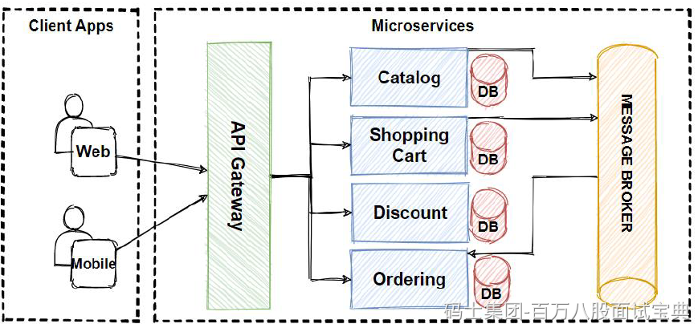

这个需要实实在在的体现准备好一些技术方向， 比如微服务架构、系统性能调优、数据库设计、分布式缓存等 ，回答的时候最好匹配 JD 中的重点 ，所有前提是你的技术要过关，否则可能给自己挖坑。

可以提前 练透一个方向，这样能从容应对追深追问 ，如： 熟悉 microservices，了解 Redis 如何设置/get、缓存穿透处理、分布式锁等细节 ；如果涉及多个方向，比如微服务＋架构＋性能调优，也可以都说，但**要能谈得深入，**展示自己技术栈的广度。无论一个技术或者多个技术，聊的时候都要结合项目业务去聊。

回答示例：

> 我最擅长的方向是**微服务架构 + 性能调优**。  
> 比如我在之前的项目里，主导设计了基于 Spring Cloud 的微服务体系，拆分用户、订单、支付等模块，通过 Redis 做缓存带宽控制，还实现了分布式锁，避免库存并发超卖。  
> 在调优方面，我深入分析过单个请求的时序链路，还对 JVM GC、热代码路径做过打点监控，把响应延时从原来的 200ms 优化到稳定的 80ms。  
> 当然，我对架构设计也有研究；比如做识别系统，能画出完整调用链图，平衡中间层和核心服务间的耦合与独立。
>
> ....
