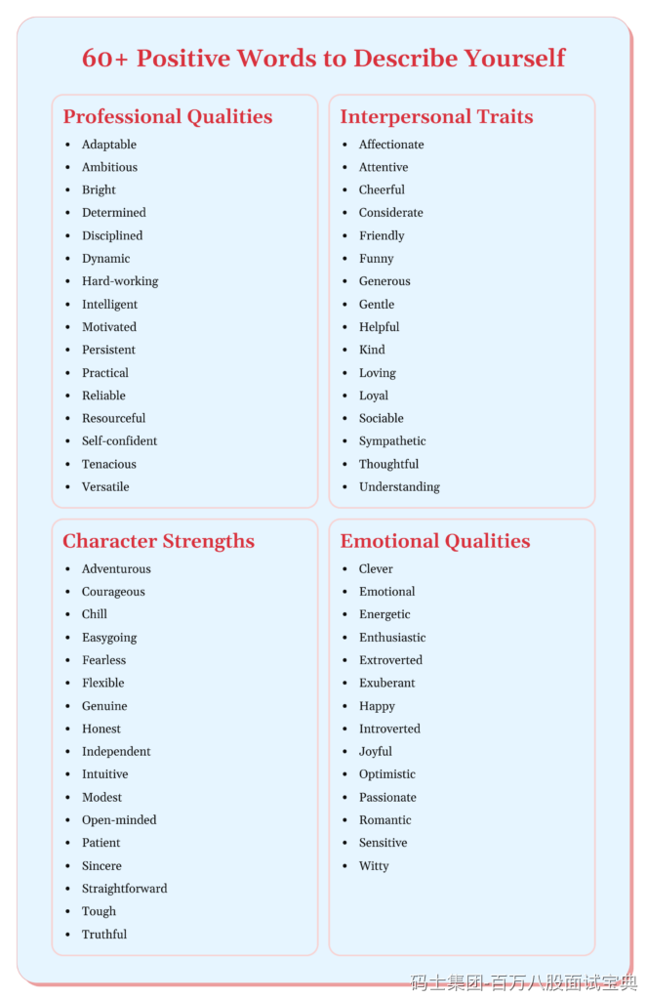

建议2个点：

1. **提前准备好3个词**

一定要提前准备好， 同时避免背书式，要自然表达，选词真实贴合自己的风格。

2. **口语化解释、接地气**

选词要“接地气”：如“适应能力强、责任心强、做事有始有终” ， 避免过于官方或浮夸（忠诚→靠谱、慈祥→随和/善良）

示例关键词和回答模版：

- **适应力强**：  
  “我适应力比较强，能迅速融入新环境、切换节奏。之前切过三次项目组，每次我都很快和团队打成一片。”
- **靠谱**（踏实、靠谱）：  
  “我做事很踏实，不虎头蛇尾。接下任务，我会一直跟到底，把每个环节都做好。项目上线都没掉链子。”
- **专注**：  
  “我比较专注，能沉浸在代码/分析中，直到问题彻底解决。之前有个 bug，我干了晚上三点才停下来，第二天一早功能上线也没问题。”
