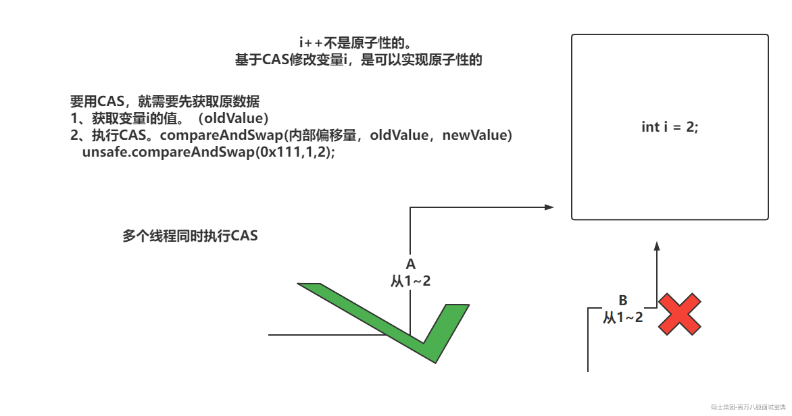
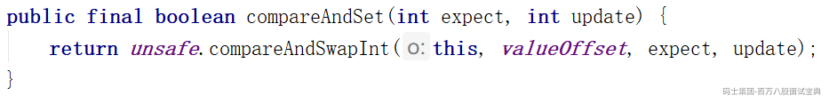
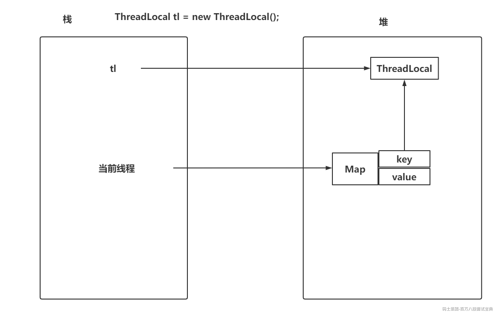
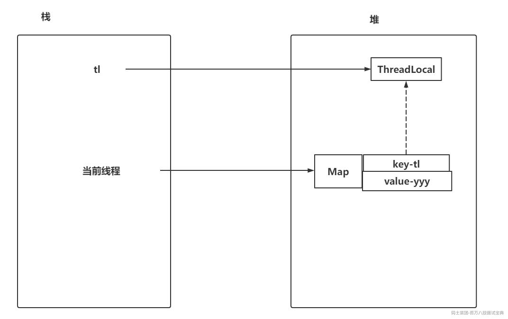
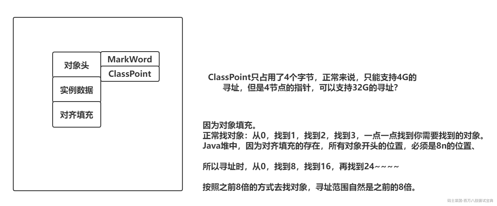
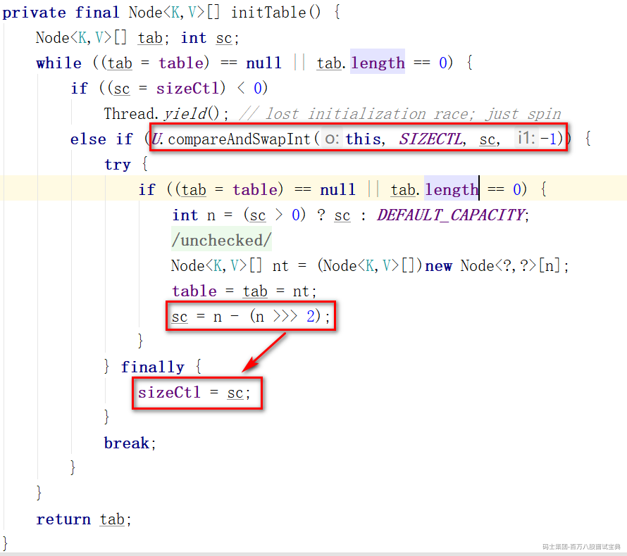
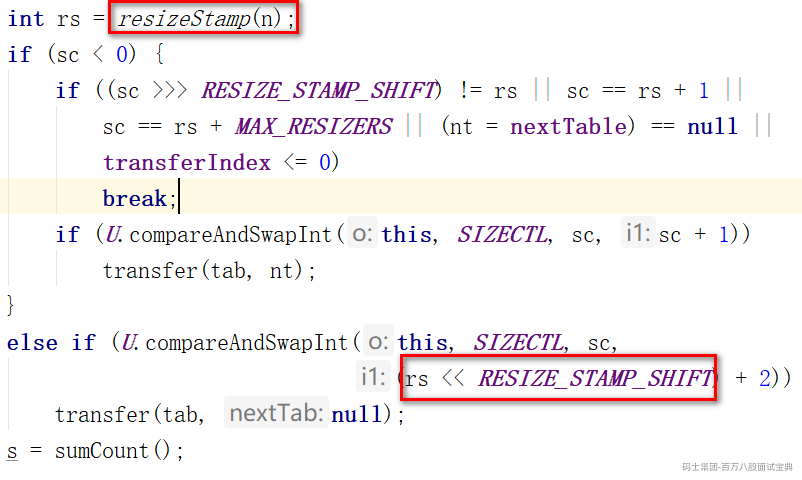
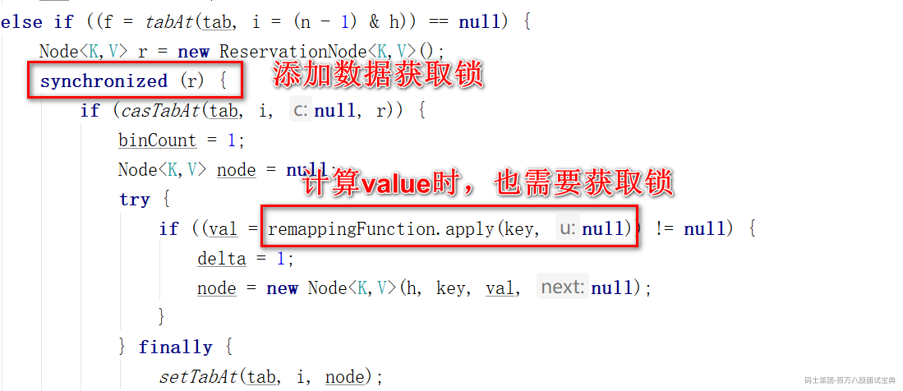
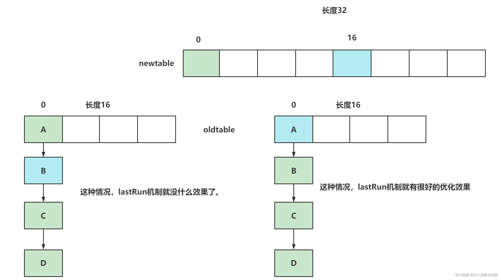

## **1、AQS是什么？**

AQS就是AbstractQueuedSynchronizer。他是一个抽象类。

AQS只是一个JUC包下的基础类，他向上抽取了一些公共的功能。内部并没有什么实际的功能。

ReentrantLock，ReentrantReadWriteLock，Semaphore，CountDownLatch都是基于AQS实现的。

AQS核心内容就俩，一个是由volatile修饰的基于CAS修改的**state**。

AQS还提供了一个**双向链表**，每一个节点都是有Node对象组成的。

Node节点中可以存储当前是互斥锁还是共享锁。

*同时Node中还会存储状态，比如节点不排队了取消了，查看后继节点是否挂起，默认状态，是否await，是否需要释放后续节点。（解决JDK1.5的状态）这里太过细节*

同时，Node还可以存储一个线程。

## **2、CAS**

CAS叫做CompareAndSwap，比较并交换。

**CAS的本质是保证替换一和内存中的值时，是原子性的。**



Java中很多内容都是基于CAS实现的，AtomicInteger，LongAdder，ReentrantLock都用到了CAS



通过cmpxchg指令实现，单核就采用cmpxchg，多核需要追加前缀lock。

CAS的问题：

- ABA：存在多线程成操作，导致一个数据经历多次修改后，回到了原值，导致之前不应该成功CAS操作又成功，可以通过**AtomicStampedReference**追加版本号解决。

- 自旋次数过多：CAS不会挂起线程，会让CPU一致调度当前线程执行CAS直到成功。这样可能会过分消耗CPU资源。

- synchronized用的是自适应自旋锁，拿不到锁就算了吧，赶紧吧线程挂起。线程（WAITING）

- LongAdder，就是基于分段所效果去玩，不让多个线程对一个值进行CAS，你换一个。

- 只能对一个数值修改做原子性：如果想基于CAS实现锁住一段代码的操作，参考ReentrantLock。

## **3、ThreadLocal两个内存泄漏问题**

ThreadLocal就是一个工具，真正存储数据的是Thread类中的Map

```java
ThreadLocal.ThreadLocalMap inheritableThreadLocals = null;
```



ThreadLocal的内存泄漏有两点：

- key的内存泄漏：当一个方法执行完毕，tl弹栈走了，但是当前线程还在。所以为了解决key的内存泄漏问题，ThreadLocal作为key存在时，是一个weak弱引用的存在，因为弱引用只要执行GC时，没有强引用指向，必然会被回收。

- value的内存泄漏：首先一般是针对线程池的操作。如果线程执行完操作可以自行销毁，可以不关注value的内存泄漏。但是咱们大多数操作都是基于线程池的，所以value的内存泄漏不能不管。只需要在使用完毕当前ThreadLocal后，及时调用remove方法。



## **4、ReentrantLock释放锁时为什么要从后往前找有效节点？**

因为在addWaiter方法中，需要先将当前节点的prev之前前继节点，然后基于CAS将tail指向当前节点，最后才是将前继节点的next指向当前节点。

其次，取消排队时，cancelAcquire会将node的next指向自己。

结论，next指针不保证有效。

## **5、AQS为什么用双向链表**

知道AQS中每个Node都有prev，next。为啥不用单向链表呢？

线程在排队的期间，是可以取消的。取消之后，需要将前继节点的next指向后继节点

如果是单向链表，只能找到后继节点或者是前继节点，只能找到其中一个。另一个需要遍历整个AQS的双向链表，这样效率低。

所以采用双向链表的结构。

## **6、对象头中的指针压缩是什么？**

ClassPoint只占用了4个字节，正常来说，只能支持4G的寻址，但是4节点的指针，可以支持32G的寻址？



## **7、公平锁和⾮公平锁的底层实现？**

synchronized只有非公平锁！

ReentrantLock有公平锁和非公平锁。

从两个角度去说，一个是lock方法实现，一个是tryAcquire实现

公平锁：

- lock方法，直接去执行tryAcquire

- tryAcquire方法：如果state为0，先查看AQS中是否有排队的线程，

- 如果有，并且当前线程没有排在head的next位置，告辞，去排队。

- 如果没有，或者有排队的，当前线程是head的next，就执行CAS尝试将state从0改为1

非公平锁：

- lock方法是直接执行CAS，尝试将state从0改为1，如果失败了，执行tryAcquire

- tryAcquire方法：如果state为0，就执行CAS尝试将state从0改为1

## **8、ConcurrentHashMap的计数器实现？**

计数器是用来记录元素个数的，put了一个，计数器+1，remove了一个，计数器-1。

CHM要保证计数器是线程安全的。

CHM如果采用Atmoic，在并发量比较大的情况下，会不会造成CAS自旋次数过多呢？

CHM采用了LongAdder作为计数器的实现。

但是并没有直接引用LongAdder，而是仿照LongAdder源码又实现了一份。

分段存储元素个数，baseCount有，CounterCell有，调用size就是对各个位置的进行累加。

## **9、ConcurrentHashMap的sizeCtl代表什么？**

sizeCtl是用来控制数据的一些操作的。

sizeCtl > 0：

- 可能是下次扩容的阈值

- 可能是初始化数组的长度

sizeCtl == 0：数组还没初始化，并且没设置初始长度，默认16。

sizeCtl == -1：数组正在初始化

sizeCtl &#x3c; -1：数组正在扩容

**初始化修改sizeCtl：**



**扩容修改sizeCtl：**



## **10、LinkedBlockingQueue**是啥？

这玩应就是一个阻塞队列，而且是一个无界队列（默认长度为Integer.MAX\_VALUE）

两把锁，消费者和生产者分开的

生产者添加数据前，看空间够不，够就添加，添加完之后，再查看是否有剩余空间，有就唤醒一下生产者，并且会唤醒消费者

消费者消费数据前，先看有数据没，有就获取数据，获取完之后，查看是否还有数据，有就唤醒一下消费者，并且会唤醒生产者，记得添加数据

## **11、ConcurrentHashMap的BUG？**

协助扩容的条件判断BUG

```java
if (check >= 0) {
    Node<K,V>[] tab, nt; int n, sc;
    while (s >= (long)(sc = sizeCtl) && (tab = table) != null &&
           (n = tab.length) < MAXIMUM_CAPACITY) {
        int rs = resizeStamp(n);
        if (sc < 0) {
            if ((sc >>> RESIZE_STAMP_SHIFT) != rs || 
                sc == rs + 1 ||   // BUG,在判断当前扩容操作是否已经到了最后的检查阶段
                sc == rs + MAX_RESIZERS ||  // BUG，在判断当前扩容操作线程是否已经达到上限
                sc == rs << 16 + 1 ||   // BUG,在判断当前扩容操作是否已经到了最后的检查阶段
                sc == rs << 16 + MAX_RESIZERS ||  // BUG，在判断当前扩容操作线程是否已经达到上限
                (nt = nextTable) == null ||
                transferIndex <= 0)
                break;
            if (U.compareAndSwapInt(this, SIZECTL, sc, sc + 1))
                transfer(tab, nt);
        }
        else if (U.compareAndSwapInt(this, SIZECTL, sc,
                                     (rs << RESIZE_STAMP_SHIFT) + 2))
            transfer(tab, null);
        s = sumCount();
    }
}
```

死循环问题



```java
public static void main(String[] args) throws InterruptedException {
    ConcurrentHashMap map = new ConcurrentHashMap();
    System.out.println(Thread.currentThread().getName());
    map.computeIfAbsent("aaa",key -> {
        map.computeIfAbsent("aaa",key2 -> {return "222";});
        return "1";
    });
}
```

## **12、ConcurrentHashMap的lastRun机制？**

ConcurrentHashMap当中在扩容操作时，涉及到oldTable中是一个链表。

需要将oldTable中链表的数据迁移到newTable中。

lastRun机制就是链表迁移过程中涉及到的概念

在迁移过程中，如果链表尾部基于计算发现可以放到新数组的同一个位置上，此时就尾部位置的头放到新数组指定的索引位置就ok。后续的节点，不需要动



## **13、ConcurrentHashMap的散列算法？数组长度一定是2的n 次幂?**

ConcurrentHashMap存储数据的位置有三处：

- 数组上 O1

- 链表上 On

- 红黑树上 Ologn

ConcurrentHashMap本身就是为了让查询效率比较快

每个数据尽量都放在数组上。

如何确定存储的kv要放在哪个位置上的。

基于k的hashCode值，决定存储在哪个位置。

k1-hash：01010101 01010101 01010101 01010101

k2-hash：11111111 11111111 11111111 01010101

长度 - 1 ：00000000 00000000 00000000 00001111

计算的方式，是将hash值，与数组长度 - 1做&运算

如果单纯按照上述方式去计算，会导致只要hash值的低位一样就会造成，数据放在一个索引位置。

所以内部的散列算法就做了一个事情。

高低一起参与运算：

```java
(hash ^ (hash >>> 16)) & (tableSize - 1)
// 这样一来，高位数值也会参与到运算中。
```

如果数组长度不是2的n次幂，会破坏咱们散列算法，导致频繁的hash冲突

## **14、ConcurrentHashMap查询红黑树会阻塞吗？**

线程A在写入红黑树ing，线程B要查询红黑树中的数据？能查吗？阻塞？

答：不阻塞。

在链表转红黑树时，不但会将单向链表转为红黑树，还会保留一个双向链表在TreeNode中。如果有线程在写入红黑树，其他线程肯定不能查。

ConcurrentHashMap还保留了双向链表，可以直接去查询双向链表

如果有读线程读取红黑数据，此时写线程要写入红黑树数据，写线程阻塞嘛？

答：写线程会阻塞。

## **15、ReentrantReadWriteLock实现原理？**

基于AQS实现的。

AQS就一个state属性，怎么基于一个state实现的互斥锁，和共享锁。

高16位读 低16位写

读写锁是可重入的，写锁因为是互斥，直接追加到低位即可。

但是读锁是共享的，读锁的重入是如何实现的？

因为读锁都会操作state的高16位，为了记录当前线程重入的次数，需要配合ThreadLocal实现

因为读锁是共享的，所以多个读线程进来可以直接获取到读锁，如果在读线程中，有一个写线程在排队，是不是会造成写锁饥饿呢？

如果有写锁在AQS的队列中排队，那么读线程就不能直接获取读锁，要在写线程后面排队，避免写锁饥饿了。

## **16、到底如何设置线程池配置？**

（如果你看过并发编程实战，可以带一嘴内部带的属性）

首先你要确认一个事情。

线程池核心参数的配置是没有固定公式可以通用落地的。

因为IO密集 CPU密集的情况无法确认的，每个程序不一样。

根据压测结果配置一个最合理的核心配置。

为了压测时，可以动态的监控线程池运行情况以及动态修改线程池内部的核心属性。可以基于线程池提供的get方法和set方法自行定制监控系统和动态修改的能力。

线程池在基于set修改核心属性时，不需要做额外的操作，线程池支持动态修改。

## **17、单例模式的DCL为啥要加volatile？**

伪代码

DCL就是Double Check Lock，就是俩if加一个锁

指令重排可能会导致下面的DCL出现问题

```java
private static Instance instance = null;
public static Instance getInstance(){
  if(instance == null){
    sync(xxx){
      if(instance == null){
        instance = new Instance();
        // new操作，分为三个事情，1开辟内存空间，2初始化内部属性，3将地址给予instance引用
        // 因为指令重排的原因，可能会将原有的123顺序，修改为132
        // 先执行了13，但是2还没执行，instance有了指向
      }
    }
  }
  return instance;
}
```

一模一样的操作，只需要在属性上追加volatile

```java
private volatile static Instance instance = null;
public static Instance getInstance(){
  if(instance == null){
    sync(xxx){
      if(instance == null){
        instance = new Instance();
      }
    }
  }
  return instance;
}
```

## **18、ConcurrentHashMap扩容流程？**

扩容触发的方式有哪几种？

- 链表转红黑是前，会判断是否需要触发扩容

- addCount中，如果元素个数超过阈值，触发扩容

- putAll方法中，如果传入的map.size判断是否需要扩容

扩容流程大致怎么做：

- 计算扩容标识戳（int数值）。

- 因为CHM中，sizeCtl为小于-1的值，才能代表正在扩容（扩容标识戳左移16位，作为sizeCtl的高16位数值）

- 因为CHM中，允许协助扩容，从同样的oldCap，到newCap

- **扩容表示戳二进制标识的第16位是1**

- **低位是由oldCap计算出来的**

- 第一个扩容的线程（修改sizeCtl）

- 需要初始化新数组。

- 领取迁移数据的任务，去迁移数据，oldTable中迁移完的桶，会放一个ForwardingNode

- 第N个协助扩容线程（sizeCtl + 1）

- 协助扩容前，需要做判断：

- oldCap一致？

- 扩容要完事了？

- 协助扩容线程到最大值了？

- 新数组初始化了嘛？

- 迁移的任务被领取完了？

- 领取迁移数据的任务，去迁移数据，oldTable中迁移完的桶，会放一个ForwardingNode

- 最后一个完成迁移数据的线程，需要从头到尾再检查一次（单纯的检查，一般没问题）

## **19、ConcurrentHashMap如何保证数组初始化线程安全？**

DCL去做的，锁的实现是基于CAS的方式去玩的。

CHM在初始化数组时，sizeCtl == -1

要初始化数组的线程需要基于CAS成功的将sizeCtl改为-1，才可以去执行初始化操作。

外层while循环判断数组未初始化，基于CAS加锁，然后在内层基于if再次判断数组未初始化

那么此时就可以直接

```java
Node<K,V>[] nt = (Node<K,V>[])new Node<?,?>[初始长度];
```

## **20、读写锁如何实现的读锁重入，做了什么优化？**

读写锁如何实现的读锁重入：tl

做了什么优化：头尾。

每个读线程如果要记录读锁的重入次数，必然需要用到ThreadLocal。

但是ThreadLocal有个特点，上来就初始化16长度Entry数组，每次记录读锁需要拿到ThreadLocal中的值，进行++或者--。同时还需要解决ThreadLocal中value的内存泄漏问题。

读锁针对第一个成功获取读锁的线程，不需要去基于ThreadLocal记录，直接使用读写锁内部提供的属性去记录读锁线程和读多重入次数。

```java
private transient Thread firstReader = null;
private transient int firstReaderHoldCount;
```

读锁还针对最后一个获取读锁的线程，单路的将HoldCounter从ThreadLocal中取出，放到属性中，以后就不需要反复的从ThreadLocal获取

## **21、缓存行的伪共享**

CPU内部也提供了缓存，因为CPU执行效率贼快，CPU去主内存查询数据的效率是比较慢的。

CPU内部提供了L1，L2，L3缓存，其中速度最快的是L1，一般的CPU，L1缓存是以**缓存行**为单位的。

**缓存行一般占用64字节。**

如果L1缓存存储了数据A，以及数据B。需要基于数据A和数据B的操作效率就会很高。

如果操作L1缓存数据时，写了数据A，并没有动数据B。

但是因为最小单位是缓存行，你只修改了数据A，缓存行也是被写过的，CPU会认定当前缓存行失效，再次操作数据B时，会认为数据B可能也有变化，重新的去主内存拉取数据B。

**基于空间换时间的概念去解决问题**。

数据A自己占一个缓存行。

数据B自己占一个缓存行。

这样一来，数据A变化，跟B有关系嘛？？？

JDK1.7之前，给核心属性前后各添加7个无意义的long类型数据

```plain
long l1,l2,l3,l4,l5,l6,l7;
volatile long count = 0;
long x1,x2,x3,x4,x5,x6,x7;
```

JDK1.8之后，不用写的这么麻烦，可以在类上或者属性上，添加\*\*@Contended\*\*注解，可以实现一样的效果
