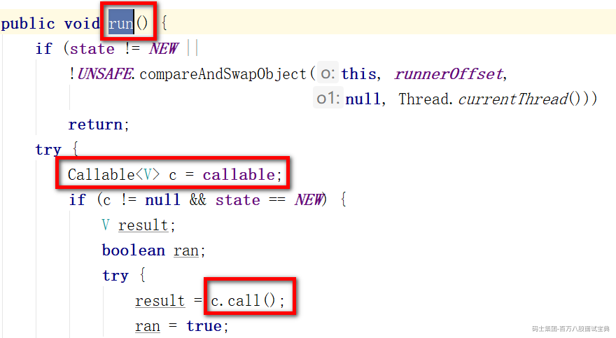
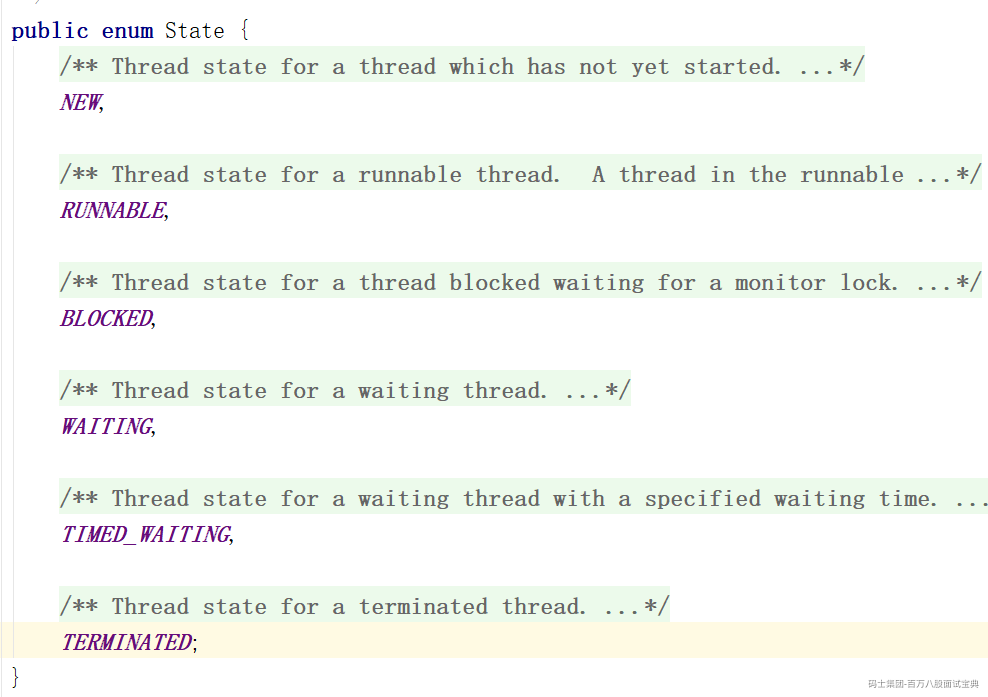
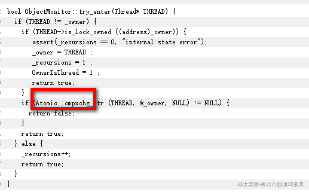
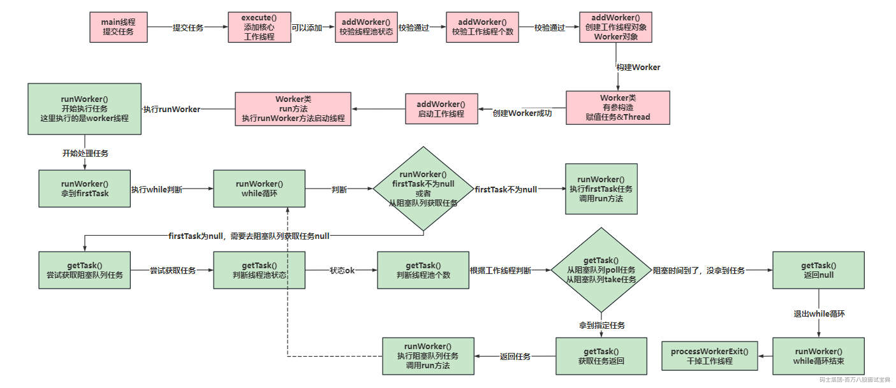

#### 1、构建线程方式？

Java中就三种方式：

- 继承Thread

- 实现Runnable

- 实现Callable

本质都是Runnable，其实是一种。

因为继承Thread，间接实现了Runnable

实现Callable，需要FutureTask做封装，在启动线程时，依然是执行的FutureTask实现Runnable时重写的run方法，在run方法内部，执行的Callable的call方法。

Runnable和Callable有啥区别，使用场景

答：如果启动子线程执行任务后需要有返回结果，使用Callable。

Runnable的run方法，无法抛出异常，返回结果就是void

Callable的call方法，可以抛出异常，返回结果是Object

---

#### 2、线程状态？

Java中的Thread类里有枚举，规定了，只有6种

BLOCKED，WAITING，TIME\_WAITING，本质上一样，都是CPU无法分配时间片

BLOCKED：synchronized没拿到锁，阻塞。

WAITING：Unsafe.park()，JUC包下的类在挂起线程时，用的都是这个。

TIMED\_WAITING：Unsafe.park(time,unit)，默认阻塞这么久，会被自动唤醒，变为RUNNABLE状态

所谓线程挂起，上面三种，都是线程挂起。

**但是操作系统方向里的线程，有5种**

NEW，READY，RUNNING，BLOCKING，TERMINATED

#### 3、join实现原理？

比如主线程执行t1.join()，主线程需要等待t1执行完之后，再执行。

主线程挂起了一会，等到t1执行完了，主线程被唤醒？

答：Join方法本质是基于synchronized以及wait和notify实现的。直接针对当前线程对象加锁，然后wait挂起线程，wait判断的逻辑是t1线程是否存活。isAlive。如果t1线程存货，WAITING这，如果t1线程凉凉了，isAlive会返回false，不用挂起了，被唤醒。

#### 4、wait和notify？为啥要扔synchronized里？

wait和notify是在持有synchronized锁时，

- wait方法是让持有锁的线程释放锁资源，并且挂起。

- notify方法是让持有锁的线程，去唤醒之前执行wait方法挂起的线程，让被唤醒的线程抢锁。

至于为何要在持有synchronized时，才能执行wait和notify，是因为在调整线程存放的队列时，需要持有当前synchronized锁里面的ObjectMonitor，没持有，不让操作。

并且执行wait需要释放锁资源，你没持有锁资源，你释放什么。。。

**在ObjectMonitor里，为什么有了cxq还要有EntryList？**

答：synchronized到了重量级锁时，会利用CAS拿锁么？！！会！！

<https://hg.openjdk.org/jdk8u/jdk8u/hotspot/file/69087d08d473/src/share/vm/runtime/objectMonitor.cpp>

cxq队列就是当竞争激烈时，锁持有时间比较长的时候，将线程扔到cxq队列里，挂起。

EntryList的目的：缓冲~

- 为了避免大量线程追加到cxq队列的头部或者是尾部（默认头部），造成压力过大。

- 当线程拿锁时，在重量级锁的情况下，也会走CAS，当自旋失败没拿到锁，优先扔到EntryList

**重量级锁怎么定义的：查看对象的对象头里的MarkWord里的标识**

---

#### 5、为啥线程停止不推荐使用stop？Java老郑

stop方法，会直接强制停止线程，不让执行。

用了stop会有什么问题？比如ConcurrentHashMap在执行put方法时，需要先将数据扔到数组或者链表或者红黑树里，扔进去之后，还需要记录元素个数，做+1操作。如果线程执行put后，数据扔进去了，但是没执行+1，导致线程安全问题。

#### 6、线程中断是什么？

线程中断大方向和线程停止相关联。推荐停止线程用interrupt中断。

线程不是你想停，想停就能停。

interrupt只是将线程的中断标记未从默认的false，改为了true。

同时，如果线程处在WAITING或者TIMED\_WAITING状态下，会被唤醒。

所以线程停止需要基于判断isInterruptted或者基于线程休眠等操作，触发结束run方法的操作。

---

**主线程启动了子线程，但是主线程凉了，子线程还在么？**

这里要看子线程是用户线程，还是守护线程。

如果是用户线程，主线程凉了，不影响子线程。

如果子线程是守护线程，主线程一凉，子线程也凉！

#### 7、多次对一个thread对象执行start会怎样？

抛异常~一个Thread对象，不允许多次执行start方法。

#### 8、项目中为什么使用多线程？

压榨CPU。为了提升效率。

优化某一个接口，单线程处理，500ms，你上了多线程，可能200ms了。

不是所有接口都能上多线程优化，要看业务。

（IO密集）比如业务中有多个没有关联的网络IO的操作，可以上多线程并行处理，减少IO对程序性能带来的影响。

（CPU密集）比如你有一个相对比较大的数据体量做计算或者做数据的封装。可以将比较庞大的数据量做一个切分，让多个线程同时做处理，最后聚合在一起。也可以提升处理效率。

一行数据，1kb - 300多个字

#### 9、为何要采用线程池？

避免每次任务都重新创建线程，任务结束线程还要销毁。线程创建需要重新开辟内存空间，线程结束，需要释放内存空间。线程池有池化技术，可以复用线程，规避频繁创建和销毁。

如果每次来任务，你都直接构建线程处理，这样一来，如果并发大，线程个数直线飙升，对性能没好处。CPU要来回在线程之间切换分配时间片，如果线程太多，资源都浪费在线程切换上了。线程池可以指定好工作线程的个数，别超过限制，超过了，甩你拒绝策略。

有了线程池，可以更好的去监控任务的执行情况。

#### 10、线程池中有空闲的核心线程，投递任务会交给他处理嘛？

首先，线程池的工作流程：

1、走构建核心线程

2、扔阻塞队列

3、构建非核心线程

4、拒绝策略

- 核心线程空闲时，在干嘛？ **在阻塞队列执行take方法，等新任务呢。**

- 如果核心线程个数已经满了，那么任务会扔到阻塞队列，让核心线程处理。

- 如果核心线程个数没达到要求，会构建新的核心线程，去处理这个任务。

#### 11、核心线程参数设置为0，任务怎么处理？

如果核心线程数设置为0，任务会直接扔到阻塞队列。

但是现在出现了一个场景，阻塞队列有任务，但是没有线程，现在的情况叫任务饥饿。

此时，会构建一个非核心线程，去处理阻塞队列中的任务。而且线程池的最大线程数，最少设置1。

（核心线程数可以设置为0，但是最大线程数最少设置为1）

最大线程数 = 核心线程数 + 非核心线程数。

#### 12、线程池的工作线程如何区别核心和非核心的？怎么区分的？

线程池里，不区分核心线程跟非核心线程。仅仅是在创建的时候，基于有参构造的corePoolSize和maximumPoolSize，做个判断，工作线程最终都是由thread.start启动的。

---

**如果此时线程池核心线程为3个，最大线程为4个。此时工作线程是4个，3个核心，1个非核心满满登登。**

**此时一个核心线程抛异常，结束了，那么会再创建一个核心线程么？**

不会。因为线程池不区分核心和非核心，里面只判断个数，如果有一个工作线程凉了，那还是3个工作线程，满足参数的哟求。

---

**核心线程会结束么？**

1、默认不会，但是可以设置参数，然核心线程也有超时时间。allowCoreThreadTimeOut，默认为false，可以设置为true

2、本身不区分核心还是非核心，如果线程在抛出异常等原因，导致结束后，只会根据个数判断，是否满足要求。

#### 13、工作线程如何被回收（存活时间到了）？回收前需要做哪些判断？

1、线程池的工作状态不是RUNNING，可以回收。

2、当前工作线程个数，大于corePoolSize。（有非核心线程）

3、确保不会出现任务饥饿的问题，也就是RUNNING或者SHUTDOWN状态下，确保工作队列没任务

回收的方式，就是run方法结束了，线程就销毁了。

#### 14、创建线程池的方式？

两个大方向：

1、使用Executors自带的方式构建（不推荐），线程池参数很多，这种自带的，只提供了修改部分参数的功能，无法完整的掌握线程池的细节。

- 定长的newfixed

- 单例的Single

- 非固定长度的Cached

- 执行定时任务的Schedule

- 使用forkJoinPool的WorkStealing

2、手动new ThreadPoolExecutor，自己指定7个核心参数。（推荐）更好把控线程池的情况。

下图是线程池的完整流程

