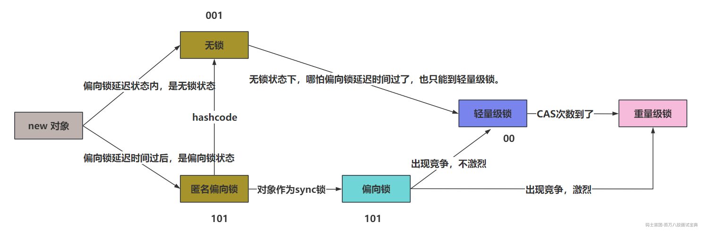

#### 1、乐观锁CAS和自旋锁的关系？

你可以说，自旋锁是基于CAS实现的。

CAS没有自旋或者重试的效果，但是自旋锁是基于类似do-while的形式，不断尝试，直到成功位置。

CAS本质就是Unsafe类中的一个方法，他只会尝试一次，成功返回true，失败返回false。

---

**CAS是怎么实现的（如果想再深入，看2023金三银四的并发编程突击班1，里面有详细说）**

CAS并不是在Java端实现的一个功能，而是在C++里面做的。

最终CAS会被翻译成一个指令。Atomic::cmpxchg，而这个指令是CPU原语，CPU认识这个指令。

#### 2、CAS的效果，以及Java中CAS操作实现？

CAS就是比较和交换，就是将内存中的某一个值，从oldValue，替换为newValue。替换的过程是先用oldValue比较内存值，如果一致，就替换，然后返回true。如果比较不一致，返回false。

比较和交换这两个操作是一条指令实现的。

Java中想用CAS操作的话，无法直接通过new或者是他提供的静态方法，直接使用。会抛出java.lang.SecurityException: Unsafe异常。

想用的话，unsafe类的对象需要通过反射的方式拿到。

```java
public class MyTest {

    private int value = 1;

    public static void main(String[] args) throws Exception {
        MyTest test = new MyTest();
        Unsafe unsafe = null;
        Field field = Unsafe.class.getDeclaredField("theUnsafe");
        field.setAccessible(true);
        unsafe = (Unsafe) field.get(null);
        // 获取内存偏移量
        long offset = unsafe.objectFieldOffset(MyTest.class.getDeclaredField("value"));
        // 执行CAS，这里的四个参数分别代表什么，你也要清楚~
        System.out.println(unsafe.compareAndSwapInt(test, offset, 0, 11));
        System.out.println(test.value);
    }

}
```

#### 3、CAS常见问题，处理方案？

ABA问题：不一定是问题，大多数情况下，只存在++，--这种操作时，无所谓你这个值是否被改过。对最终结果和业务没影响的，不需要考虑。

如果要求整个过程的变化不存在并发问题，不能出现ABA的情况，就必须追加类似版本号的效果，Java中也提供了AtmoicStampedReference

自旋次数过多：

- 自旋一定次数，就挂起线程，别CAS了，浪费CPU资源。

- 采用分段锁的形式，不要专注于一个属性，如果业务允许，可以分开计算，最终汇总。

CAS本质无法锁住一段代码，只能保证修改一个属性的原子性：But，ReentrantLock就是基于CAS的原子性类实现锁住一段代码的。

#### 4、synchronized的锁状态变化？

无锁 -> 偏向锁 -> 轻量级锁 -> 重量级锁？是这么一步一步走过来的么？

其实状态不是这样一点一点来的。

无锁无法到偏向锁



**这里整体是一个锁升级的过程，那存在锁降级么？**

偏向锁是可以到无锁状态的，偏向锁没有地儿存储hashcode之类的值，为了存储，要么升级到轻量级锁，存储到LockRecord里，要么降级为无锁，存在MarkWord里。

#### 5、怎么介绍AQS？

先说清楚和JUC的关系以及说和JUC下其他类的关系，然后说内部的核心结构。你可以往你会的地方拐。

AQS本质就是JUC包下的一个抽象类，JUC包下的一些并发工具，并发集合，线程池，锁都是基于AQS作为基础类去实现的。

AQS里面有一个核心属性和两个核心的结构：

- volatile修改是，并且基于CAS修改的state属性。

- 由Node组成的一个双向链表，或者说叫同步队列。

- 由Node组成的一个单向链表，这个是用于实现类似synchronized的wait和notify的结构。

#### 6、ReentrantLock的几种获取锁方式的区别？

- lock

- tryLock()

- tryLock(time,unit)

- lockInterruptibly

lock方法：死等，如果那不到锁，就一直等，你interrupt中断了也一直等。

tryLock()方法：浅尝一下，试一下，就一下，拿到快乐的返回true，拿不到，返回false。

tryLock(time,unit)方法：尝试time.unit这么尝试时间，如果拿到了，返回true，时间到了，没拿到，返回false。如果在拿的过程中，线程中断了，就抛出异常。

lockInterruptibly方法：死等，如果那不到锁，就一直等，如果被interrupt中断了，抛出异常

#### 7、AQS中Node的几种状态？

Node有5种状态，1，0，-1，-2，-3

- 1：代表当前Node已经取消了，不排队了。

- 0：代表代表默认状态，啥事没有~

- -1：代表当前节点的next Node挂起了，需要被唤醒

- -2：当前Node被await挂起了，扔到了Condition的单向链表里。

- -3：传播用的，共享资源里会用到，读线程拿到锁资源后，如果同步队列里排的是共享资源Node，那就继续唤醒。

---

**共享锁和互斥锁：**

互斥锁是同一时间点，只能有一个线程持有。

共享锁是同一时间点，可以有多个线程同时持有。

#### 8、AQS中取消节点的过程？

想拿资源的线程在排队，但是不想排了，需要取消排队的Node。

1、将排队的Node里的线程设置为null

2、跳过取消的前继节点，找到有效节点连接上

3、将Node的状态设置为1，代表取消

4、后续节点操作，分为几种情况

- 取消的节点是tail：直接更换尾节点为有效的前继节点

- 取消的节点不是head.next：确保后继节点可以被唤醒，将前继节点设置为-1。

- 取消的节点是head.next：直接唤醒后继节点。

5、将取消的节点的next指向自己。

#### 9、AQS唤醒时，head.next有问题时，为啥从后往前找

因为如果next后取消的节点，取消节点会将next指向自己，直接找不到了。

另外，节点加入的顺序，是先连接prev，再连接tail，最后将前继节点的next指向自己。

在AQS里，prev指针始终是正确的，next说不定。

#### 10、ReentrantReadWriteLock读写锁出现的目的？

首先，读写锁能解决的，互斥锁肯定能解决，但是，互斥锁的效率可能比较低。

比如说有一个业务，平均下来，10次读操作，1次写操作。

如果用互斥锁，可以保证线程安全，但是10次读操作也需要一个一个来。

但是，读读操作没有线程安全问题。

但是只要涉及到了写操作，比如读写操作，需要保证线程安全。只要有写线程，就必须满足互斥性。

所以JUC下就提供了一个ReentrantReadWriteLock，读写锁。这个锁的特点，就是读读可以一起操作，但是只要涉及到了写操作，就必须保证互斥。

#### 11、ReentrantReadWriteLock如何基于AQS实现的？

lock锁，无论是读锁还是写锁，都是基于state属性判断的。

state是int，占32个bit为，将高16为，作为读锁的标识，低16位，作为写锁的标识。

如果线程要拿读锁，只需要确认没有写线程在持有写锁资源，并且队列中的head.next不是写锁（解决写锁饥饿问题），就可以直接获取读锁资源。

写锁需要确保没有读线程在持有读锁，并且没有其他线程在持有写锁，写锁才能拿到锁资源。
