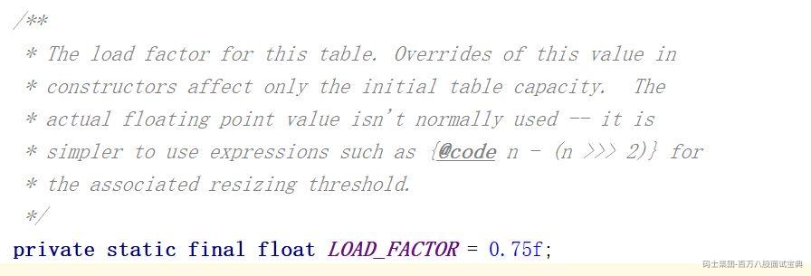
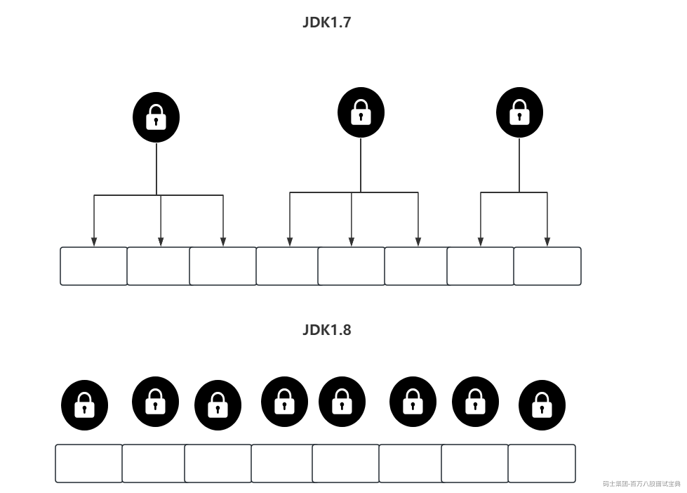

#### 1、线程安全的集合（单列）怎么选择？

**List、Set集合，线程安全的有哪些？**

- Vector，有，但是基本不考虑。（synchronized同步方法）

- Collections.synchronizedList，也可以拿到线程安全的集合（synchronized同步代码块）

- CopyOnWrite系列。（lock锁）

**如果数据体量贼大，不考虑读的问题，还需要保证线程安全？**

答：

- 第一点，不能考虑CopyOnWrite。数据体量贼大，如果用CopyOnWrite会导致空间占用太多。

- 第二点，如果不在业务代码上实现锁的话，基本职能选择Collections.synchronizedList。

- 第三点，不采用JDK提供的线程安全的集合，自己通过代码，针对读写操作最针对性的加锁。

- 可以在业务带上中，去完成读写锁的操作

- 也可以仿照Collections.synchronizedList，直接做一个装饰者模式，套一层。

**至于多列集合，不需要考虑了，上Concurrent系列。**

#### 2、CopyOnWrite集合需要注意的点？

CopyOnWrite在做写操作的时候，会复制一套副本，在副本中做各种操作，这样不会影响读线程去读取原生数据的。基于这种方式，读操作是不需要加锁的，不会出现线程安全问题。

毕竟CopyOnWrite需要复制一套副本，如果数据体量比较大的时候，不推荐使用了，浪费空间。

**我之前真是操作过的：** WebSocket里面，存储客户端的Session，Session需要存储，同时可能会客户端并发连接，而且Session体量不会太大。当时选择的CopyOnWriteArraySet。

---

---

#### 3、ConcurrentHashMap存储数据结构是什么样子呢？

问题基础，但是必须要会：数组 + 链表 + 红黑树

JDK1.8中，才出现红黑树结构。

正常1.7就是数组 + 链表。在没有hash冲突的情况，数据就仍在数组上，当数据在数组上时，查询效率很高，是O1

但是毕竟无法规避Hash冲突问题，当存在Hash冲突时，数据会被挂在数组的某一个索引下，形成一个链表。这样查询的效率会变低，时间复杂度是On

所以红黑树就是在解决链表过长的问题，如果链表过长，会导致查询的效率降低。此时如果链表过程，就可以生成一套红黑树，平衡二叉树，查询效率比链表快，时间复杂度是Ologn。

**为什么选择红黑树提升查询效率，别的数据结构可以嘛？**

跳表可以嘛？换是可以的。但是，ConcurrentHashMap默认不支持修改结构。

跳表空间占用率更高。写效率不想红黑树那么复杂。

#### 4、ConcurrentHashMap的负载因子可以重新指定吗？

负载因子就是这东西。不能改！



而且在ConcurrentHashMap的有参构造中，虽然可以穿度一个负载因子的参数，但是无法修改他，在有参构造的逻辑里，仅仅是拿着传入的loadFactor计算初始数组的长度。没有给核心的loadFactor做修改。

同时HashMap是允许修改的。

而且在ConcurrentHashMap中，没有基于loadFactor计算阈值，而是直接基于位运算计算的，结果其实和×0.75一模一样。没有直接×，就是因为位运算更快。

**如果是HashMap，修改了负载因子，不用0.75，会有什么问题么？**

如果设置的比较小，会造成频繁的扩容，比如设置0.5，16长度的数组，元素有8个就扩容了。

如果设置的比较大，会造成大量的Hash冲突，比如设置为1，16长度的元素，元素个数达到16个才会扩容。大量的hash冲突会造成数据挂到链表甚至生成红黑树，查询效率会降低。

是可以改的，只不过对泊松分布计算出来的概率，有一定影响。

#### 5、ConcurrentHashMap的散列算法？相比HashMap有什么区别？

ConcurrentHashMap还是HashMap，都是对key进行一个hashCode方法，然后配合数组长度做一个&运算，得到当前元素要存储的位置。

hashCode返回的值是一个int类型，站32个bit位。

同时数组的长度，如果要占用16个bit位，长度是65535。

所以一般计算时，hashCode的高16个bit位，无法参与到运算中。导致很多hashCode高位不一样，但是低位一样的key，出现了Hash冲突，存储到了一个位置，形成了链表。

所以无论是ConcurrentHashMap还是HashMap，都是先让hashCode的 **高低位先做^运算** ，然后再去和数组长度 - 1做&运算，得到最终存储的位置。

**为什么数组长度-1做计算？**

因为长度为16的数组，索引位置是0~15。

如果不-1，会造成与数组做&运算，只有0或者16这两个值。首先会大量冲突，另外16不在索引范围内。

#### 6、ConcurrentHashMap 中 sizeCtl 字段的作用？

sizeCtl是用于初始化数组和做扩容是的一个控制字段。

不一样的值，代表不同的意思：

- sizeCtl == -1：代表ConcurrentHashMap正在初始化数组。

- sizeCtl < -1：代表ConcurrentHashMap正在初始化扩容

- sizeCtl == 0：代表默认状态，啥事没有。

- sizeCtl > 0：有可能代表两个意思：

- 数组没初始化时：可能代表ConcurrentHashMap初始化数组时的长度。

- 数组已经初始化：sizeCtl的值代表下次扩容的阈值。

#### 7、ConcurrentHashMap扩容的整体流程？

- 计算扩容标识戳。

- 开始扩容

- 第一个执行扩容的线程

- 给sizeCtl赋值，表示当前线程要扩容了。

- 计算步长（每次迁移多少个索引位置的数据到新数组）

- 初始化新数组，长度是老数组的二倍。

- 领取步长数索引个数的迁移数据的任务

- 将老数组数据迁移到新数组。

- 老数组数据迁移完了，扔个ForwardingNode。

- 4，5，6循环操作，直到数据全部迁移完

- 后续执行扩容的线程

- 给sizeCtl + 1，代表来了一个线程帮忙做迁移数据操作

- 计算步长（和第一个线程计算的结果一致）

- 领取步长数索引个数的迁移数据的任务

- 将老数组数据迁移到新数组。

- 老数组数据迁移完了，扔个ForwardingNode

- 循环3，4，5操作，直到数据全部迁移完毕

#### 8、ConcurrentHashMap扩容时的扩容标识戳干嘛的？

扩容标识戳，有个特点，是int类型，第17个bit位一定是1。并且扩容标识戳是基于oldTable的长度计算出来的。

然后需要将扩容标识戳左移16位

- 如果是第一个扩容的线程，对低位 + 2，代表第一个扩容的线程来了。

- 如果是其他协助扩容的线程，对低位 + 1，代表我来帮忙了。

然后赋值给sizeCtl，第17个bit位一定是1可以确保是负数。

**为啥基于oldTable的长度计算？**

为了确保协助扩容的线程，一定是和正在扩容的线程预期的长度一致。

比如，现在正在做32~64的扩容。此时一个线程想帮忙，但是这个线程希望从64-128。那这个想帮忙的线程，就没法帮忙。

#### 9、ConcurrentHashMap如何统计元素个数？

首先ConcurrentHashMap是线程安全的集合，统计元素个数，肯定要确保线程安全。

计算元素个数，无非是++，--。

确保++，--线程安全，还要有效率。

这里ConcurrentHashMap选择的就是LongAdder，首先基于CAS对元素做++，--操作，确保线程安全。并且LongAdder除了ConcurrentHashMap记录元素个数的baseCount外，同时也准备了一个CounterCell数组，每一个CounterCell里都有一个value记录元素个数。这样CAS就可以针对多个位置执行，以尽量减少CAS的空转情况。

#### 10、ConcurrentHashMap在JDK1.7和1.8如何保证写数据线程安全？



JDK1.7里的锁，一般称为Segement，是基于ReentrantLock实现的。

JDK1.8里，用了两种锁，如果数据要写入到数组上，基于CAS的方式尝试写入。如果数据要挂到链表或者红黑树上时，采用synchronized锁住数组上的Node。

#### 11、ConcurrentHashMap在JDK1.8中存在的BUG？

在扩容的地方，有协助扩容的判断，在这个判断中，中间两个个判断都是毫无意义的。

```java
// 第一个判断，是为了确保协助扩容的线程，和正在扩容的线程的长度是一致的。
if ((sc >>> RESIZE_STAMP_SHIFT) != rs || 
    // 正常这么写：sc == rs << RESIZE_STAMP_SHIFT + 1 ,目的是为了判断，当前扩容是否已经到了最后的检查阶段。BUG ~~~
    sc == rs + 1 || 
    // 正常这么写：  sc == rs << RESIZE_STAMP_SHIFT  + MAX_RESIZERS,目的是为了判断，当前过来协助扩容的线程，是否已经到了最大值。  BUG~~~
    sc == rs + MAX_RESIZERS || 
    // 后面这俩不是BUG~
    (nt = nextTable) == null ||
    transferIndex <= 0)
    break;
```

在协助扩容前，有几个判断，主要是判断扩容是否结束，以及协助扩容的线程是否已经达到最大值的这两个判断，这两个判断没有将扩容标识戳做左移操作，就直接与sizeCtl做判断了，这种判断是没有任何意义的。

#### 12、ConcurrentHashMap在扩容期间可以查询数据嘛？

写操作才会帮助扩容，读操作不会协助扩容。

而且不会等待扩容结束再查，而是直接查询。

查询时，直接查询老数组索引位置，如果查询到了数据，直接返回。

如果发现老数组的索引位置上，放了一个ForwardingNode，代表数据已经被迁移到了新数组。直接去新数组找数据。

（ConcurrentHashMap中的读操作，是不会阻塞的，什么情况都不阻塞。）

#### 13、ConcurrentHashMap的红黑树中为何会保留一套双向链表？

ConcurrentHashMap在转换红黑树的时候，会将Node更改为TreeNode。TreeNode是继承自Node的。TreeNode中不但包含了红黑树的parent，left，right，red之外，还有维护的prev，以及继承自父类的next。所以ConcurrentHashMap中，不但包含红黑树，还包含一套完整的双向链表。

为什么保留双向链表？

1、红黑树结构在执行写操作的时候，为了保证平衡，会做左旋或者右旋操作。做旋转操作时，指针是会变化的，如果有读线程在红黑树里检索，同时写现在来写入数据，可能会导致读操作无法读取到具体内容。所以在有写线程写入红黑树时，读线程可以直接读取这个双向链表。

2、如果在迁移数据时，某一个索引位置下存放的是红黑树，怎么迁移啊？是不是有点麻烦啊？所以在迁移数据时，可以不通过这种麻烦的红黑树做迁移，而是直接利用双向链表做迁移操作。同理，在红黑树退化为链表时，也没那么麻烦，直接操作双向链表即可。

#### 14、lock与sync区别

单词不一样

lock需要new着用，sync关键字，只能同步代码块和同步方法用

lock需要手动释放，sync不需要手动释放

lock基于AQS实现，sync基于对象实现，重量级锁采用ObjectMonitor

lock支持公平和非公平锁，sync只是非公平锁

lock基于Condition的await和signal做挂起和唤醒，sync通过wait和notify做这个操作

…………
