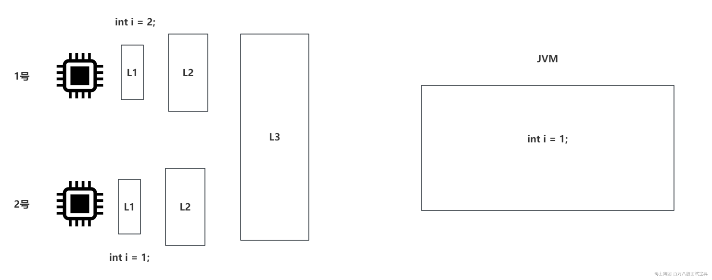
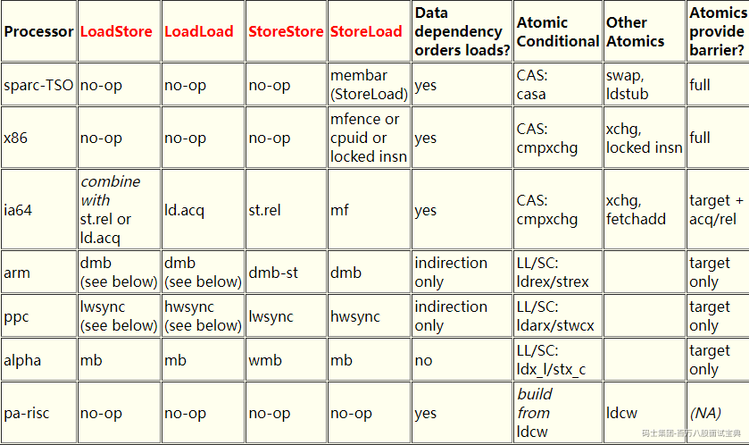
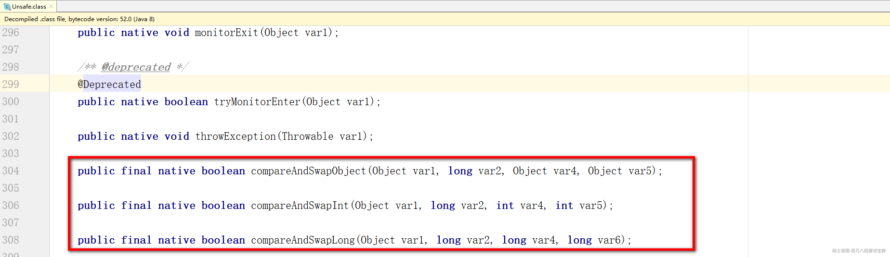
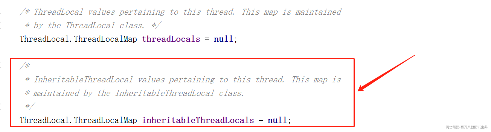

# 一、Java中为什么内存不可见？（高德）

**因为Java中的线程是由CPU去调度的，而CPU中包含了L1~L3的高速缓存，当CPU调度某个线程时，会将JVM中数据拉取到CPU高速缓存中。因为CPU现在基本都是多核的，所以其他CPU内核如果也获取了相同的数据，并且有写操作的发生，就会导致多个CPU内核之间的高速缓存中的数据不一致。**

# 二、什么是JMM？（天润融通）

**你了解Java的内存模型么？你要回答的是JMM。**

**如果问Java的内存结构，或者是JVM的内存结构，你再去说，堆栈方法区啥啥的……**

> JMM就是Java内存模型，因为在不同的CPU厂商下，CPU的实现机制都有一些不同，在内存和一些指令上都会存在一些差异。 所以JMM就是为了屏蔽掉硬件和操作系统带来的差异，放Java程序可以在不同的硬件和操作系统下，实现并发编程的 **原子性、可见性、禁止指令重排** 。

说白了，就是CPU内存和JVM内存之间的一个规范，这个规范可以将JVM的字节码指令转换为CPU能够识别的一些指令。

比如在×86的CPU中，原子性的保证要基于cmpxchg（Compare And Exchange）去实现，但是其他的CPU型号各自不同，在JMM中，就会将涉及到的CAS操作根据不同的CPU情况去翻译成不同的指令。

通过Doug Lea工作站里面的描述信息，可以看到，JMM可以帮你做到很多事情，其中重要的就是基于三大特性，对应不同的CPU做不同的实现。

<https://gee.cs.oswego.edu/>

如下图，除了可以看到Atomic的原子性的不同以外，还能看到内存屏障等内容。

# 三、Java里面有哪些锁，他们的区别是什么？（菜鸟）

Java中的锁可以分成乐观锁的实现和悲观锁的实现。

> 乐观锁和悲观锁是俩概念，不是单独指定的某个锁。
>
> Java中针对这俩种概念做了具体的落地。
>
> 乐观锁：认为在操作的时候，没有线程和我并发操作，正常的去写，但是如果有并发会失败，返回false，成功返回true。不会阻塞、等待，失败了就再试一次……。
>
> 悲观锁：认为在操作的时候，有线程和我并发操作。就需要先去尝试竞争锁资源，如果拿不到这个资源，就将线程挂起、阻塞等待。

乐观锁：CAS，在Java中是以Unsafe类中的native方法形式存在的，到了底层，就是之前说的CPU支持的原子操作的指令，比如×86下的cmpxchg。

悲观锁：synchronized，Lock锁。

# 四、乐观锁和悲观锁的区别？乐观锁一定好嘛？（菜鸟）

乐观锁不会让你的 **线程阻塞、挂起** ，可以让CPU一直调度执行竞争这个乐观锁，可以直到成功为止。

悲观锁会在竞争锁资源失败后，直接 **挂起、阻塞线程** ，等到锁资源释放后，才可能唤醒这个线程再去竞争锁资源。

核心区别就是 **是否会挂起你的线程** ，因为挂起线程这个操作，线程在用户态时不能这么做，需要从用户态转换到内核态，让OS操作系统去唤醒挂起的线程，这个用户态和内核态的切换就比较耗时。

这么看乐观锁相对悲观锁有一定的优势，但是也不是所有场景都ok。

如果竞争很激烈，导致乐观锁一直失败，那CPU就需要一直去调度他，但是又一直失败，就会有点浪费CPU的资源了。会导致CPU占用率飙高…………

在操作系统下，线程就一个阻塞状态BLOCKED，Java中为了更好的排查问题，给线程提供了三种阻塞的状态，BLOCKED，WAITING，TIMED\_WAITING……

# 五、CAS到底最后加没加锁，有哪些用的地方？（猿辅导）

**CAS到底最后加没加锁：**

如果是在Java层面，他没有涉及到锁的情况，因为他不涉及线程的挂起和唤醒操作。可以认为是无锁操作。

但是CAS在CPU内部是基于cmpxchg指令去玩的，而且CPU也是多核的。那么在多个核心都去对一个变量进行CAS操作时，×86的CPU中，会添加 **lock前缀指令** ，可能会基于缓存行锁，或者是基于总线锁，只让一个CPU内核执行这个CAS操作。

**有哪些用的地方：**

一般在平时开发的时候，99.999999%用不到，除非你开发一些中间件，框架之类的，可能会涉及到。一般看到的都是在JUC包下的一个并发工具里会涉及到。 比如ReentrantLock，synchronized，ThreadPoolExecutor，CountDownLatch…………

# 六、Java中锁的底层实现？（天润融通）

1、**可以聊CAS，一般到了CPU的cmpxchg指令就到头了。**

2、**可以聊synchronized：**

- 聊对象头里的MarkWord，去聊锁升级，无锁、偏向锁、轻量级锁、重量级锁……

3、**可以聊Lock锁：**

- 聊AQS！

关于synchronized和Lock锁的细节，看2024金三银四突击班里的并发编程2

<https://www.mashibing.com/live/2583>

# 七、为什么HashMap的k-v允许为null，CHM不允许k-v为null？（小米）

HashMap的设计之初，就是为了线程在局部使用的，不存在多线程操作的情况，所以存null与否都不影响当前线程自己的操作。

ConcurrentHashMap的设计就是为了在多线程的情况下去使用。

- **如果允许存储null，那么你在get时，获取到了一个null数据，到底是获取到了还是没获取到呢？**

- 其次这种多线程操作的情况下，null值必然有可能会发生空指针异常的问题。

# 八、hash冲突的话有几种解决方式？（小米）

**链地址法：** HashMap就玩的这种方式，基于key的hashCode和桶位置 - 1做运算，如果出现了相同位置，就形成一个链表挂在一起。在HashMap中，

因为桶位置一般不会超过16个bit位，所以做了一个高低位的^运算，让高位也参与到。（这个算是多次Hash的套路）

**多次Hash：** 这个就是针对一个内容，做多次hash运算。比如先hashCode，然后再crc16之类的，让数值不同。（布隆过滤器就可以采用这个方式）

**公共溢出区：** 将hash表分为基准表和溢出表，但凡出现了hash冲突，就将冲突的数据扔到溢出表里。

**开放定址法：** 有关键字key的哈希地址（i），出现冲突时，以这个地址（i）为基准，产生另一个hash地址（i2），若i2还有冲突，再次以i为基准，再找一个i3，直到找到不冲突的地址，将元素扔进去。

- 线性探测：顺序的往后面找哈希地址~~~比如0有冲突，那就看1，1再有，那就看2，2再有，那就看…………

- 二次（平方）探测：2,4,8…………这么找地址……

- 随机数：随机找…………

# 九、怎么用Runnable实现Callable的功能（菜鸟）

本质就是问的FutureTask。

Runnable和Callable的区别无非就是能否抛异常，是否可以返回一个结果。

可以很直观的看到Runnable和Callale在源码中的区别。

但是Callable如何执行的啊？？

Callable本质需要基于FutureTask去执行，而在FutureTask里，有一个成员变量outcome，任务执行过程的异常或者是返回结果，都会被封装到outcome中，放执行者需要结果时，get方法会返回outcome中存储的内容。

可以在实现Runnable接口时，也声明类似的成员变量，当run方法执行时，整个try-catch住，如果出现异常信息，就将异常封装到这个成员变量中。如果正常执行完，有结果需要返回，就将需要返回的结果扔到成员变量中。

如果你对FutureTask比较了解，你还可以再聊一下给任务追加一个状态，避免任务并发投递时，带来的并发问题。

# 十、ThreadLocal应用场景，key和value分别是什么（蚂蚁）

**ThreadLocal一般就是再同一个线程中做参数传递的。**

一般场景，比如 **事务的控制** ，需要Service和Mapper使用同一个Connection，那就可以基于ThreadLocal去做参数的传递。

再比如 **链路追踪** ，想记录当前线程的整条日志信息，也可以基于ThreadLocal存储traceID。

再比如在Filter中，从请求头里面获取到了 **Token** ，后期需要在Controller中使用，也可以基于ThreadLocal传递Token信息。

---

本质上，ThreadLocal他不存储数据，真正存储数据的是每个线程Thread对象中的ThreadLocalMap属性。

真正存储数据的容器是Thread类中的ThreadLocalMap。

**ThreadLocal是作为key的存在，value是你正常存储的数据。**

至于ThreadLocal的内存泄漏问题，这里就不展开说了……

看2024金三银四突击班里的**并发编程1**

<https://www.mashibing.com/live/2583>

# 十一、子线程如何获取父线程中的属性信息。（忘了）

**可以采用一些共享变量的方式，来做线程之间的数据传递……**

除此之外，Java中还提供的InheritableThreadLocal类，来实现这个操作。

这个InheritableThreadLocal就是在父线程创建子线程时，将父线程设置到InheritableThreadLocal中的数据直接迁移一份到子线程的InheritableThreadLocal中。

在创建子线程时，会执行Thread的init方法，在init方法中，默认就会做InheritableThreadLocal数据传递的逻辑，只要父线程中的InheritableThreadLocal里面有数据，就会做迁移操作。直接将父线程的inheritableThreadLocals中的数据一个一个的搬到子线程的inheritableThreadLocals里面。

inheritableThreadLocals就是ThreadLocalMap

