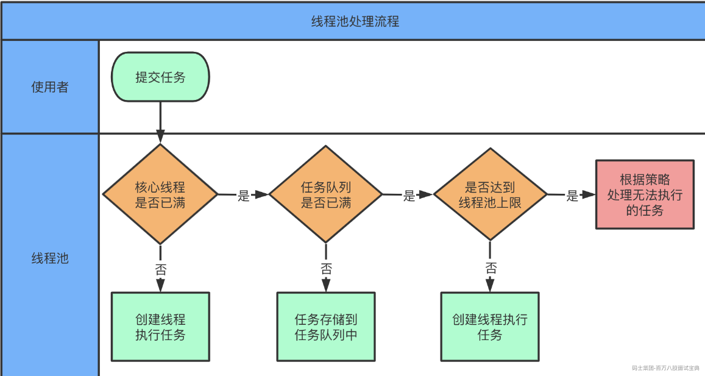

### 一、Java中怎么唤醒一个阻塞的线程？（小红书）

唤醒线程的方式：

- interrupt……

- Unsafe.unpark……

首先，线程阻塞的方式，在Java中其实只有一种形式，就是Unsafe类中的park方法去挂起的。

只不过Java中针对这种阻塞的状态，细分了3种：

- BLOCKED：synchronized…………

- WAITING

- TIMED\_WAITING

这三个状态，其实对于操作系统来说，没区别，Java中细分的目的是为了让咱们在排查问题时，可以更好的定位。

**Java线程在获取synchronized锁资源失败后，如果该线程执行了interrupt，那这个线程会被唤醒吗？**

答：synchronized加锁的核心逻辑都是在C++内部实现的，如果在基于synchronized挂起后，线程被执行了 **interrupt** ，在C++的代码中，会被唤醒，并且可以执行CAS尝试获取锁资源，但是一般情况下，拿不到就再次被挂起了。而在Java中能看到的效果就是，没有任何效果（没拿到锁）。

其他的类似WAITING和TIMED\_WAITING必然也是可以唤醒的，只是根据后续工具的代码逻辑来决定是否能真正的唤醒到自己编写的业务代码中。

比如lock.lock方法，synchronized的阻塞形式，中断后不一定会回到你自己的业务代码中。

但是比如lock.lockInterruptibly，Thread.sleep()，等可以在中断后，抛出interrupt异常能看到效果。

### 二、多个任务，同时达到临界点，主线程执行，怎么实现（去哪）

首先这种方式很多。

- join……

```plain
t1...
t2...
t3...
主线程：
t1.join();
t2.join();
t3.join();
// 只要代码到这，代表t1、t2、t3就都完成了~~
```

- CountDownLatch……

```plain
CountDownLatch latch = new CountDownLatch(3);
t1……(() -> {逻辑代码…………   latch.countDown();})
t2……(() -> {逻辑代码…………   latch.countDown();})
t3……(() -> {逻辑代码…………   latch.countDown();})
主线程：
latch.await();
// 只要代码到这，代表t1、t2、t3就都完成了~~
```

- FutureTask……

```plain
FutureTask f1 = t1……
FutureTask f2 = t2……
FutureTask f3 = t3……
主线程：
f1.get();
f2.get();
f3.get();
// 只要代码到这，代表t1、t2、t3就都完成了~~
```

- CompletableFuture

```plain
CompletableFuture cf = CompletableFuture.allOf(t1,t2,t2);
cf.join();
// 只要代码到这，代表t1、t2、t3就都完成了~~
```

### 三、让20个线程同一时刻开始执行（昨儿大佬直播间聊到的）

首先，想让20个线程同一时刻开始执行，这个不现实…… 线程是CPU调度的，这个咱们没法控制，所以一般情况下，让线程极可能同一时刻就行……

**直接采用CyclicBarrier工具就可以实现，CyclicBarrier本身就是等待多个线程都到达位置，然后再统一的被唤醒。原理类似于一个计数器，每到位一个线程，就--，并且挂起这个线程。当这个计数器减到0的时候，会将所有的线程唤醒，继续执行后续的逻辑。**

扩展聊：

CyclicBarrier的底层是基于ReentrantLock实现的。你到位的线程会基于await挂起，并且丢到Condition单向链表中。等到计数器到0时，会基于signalAll的方法，将所有到位的线程一个一个的唤醒，每个唤醒的线程还需要到AQS的同步队列中获取锁资源，才能继续往下执行，所以他们是存在先后顺序的。

### 四、CountDownLatch和CyclicBarrier，分别作用于什么业务，哪个可以复用，为什么；（去哪）

CountDownLatch的应用场景：

> CountDownLatch最多的使用场景就是在等待多个线程操作都完成后，再让后续业务继续执行的业务中……
>
> 这么解释没毛病：但是推荐大家，在面试的过程中，这个点最好结合自己的项目去聊……你在哪家公司的哪个项目中的什么功能里，就涉及了………………

CyclicBarrier的应用场景：

> - 比如类似游戏中，玩王者荣耀，LOL等等，需要等待10个客户端都匹配到位，才能开始游戏，这个10个客户端才会开始加载游戏……
>
> - 比如一个旅游的APP，需要报团，这个团可能有时间限制，同时还有人数的限制，如果撇去时间，等到人数到达了阈值，才会触发后续的一些。
>
> - 电商拼团，PDD，至少2人成团…………

**哪个可以复用，为什么？**

其实这哥俩都有一个特点，都需要等待多个线程做了什么事情，才能往下继续。

- CountDownLatch是基于AQS中的state做计数，每完成一个任务，countDown方法执行后，会对state - 1，当state为0后，就会唤醒那些基于CountDownLatch执行await的线程。

- CyclicBarrier是自己搞了一个count属性，每当有一个线程到位 **（执行CyclicBarrier的await方法）** 之后，就会对count进行--操作。等到count计数到0后，依然会唤醒，可以优先触发一个任务，然后唤醒所有到位的线程。

CyclicBarrier是可以复用的。 他提供了一个reset的方法，在这个reset方法中，会将所有之前到位，和即将到位的线程全部唤醒结束，同时重置count计数器，清空当前CyclicBarrier，以便下次使用

### 五、线程池的执行过程？（美团）

所谓的执行过程，或者说是执行原理，任务投递后的处理优先级都是一个意思。

任务投递到线程池之后

- 如果当前线程池的线程个数，不满足你设定的核心线程数，那么就会创建核心线程去处理投递过来的任务。

- 如果线程个数等于了你设定的核心线程数，那么任务会尝试投递到工作队列中排队。

- 工作队列有长度，如果工作队列的长度大于排队的任务数，任务会被正常的投递到工作队列。

- 工作队列中的任务数和现在排队的任务数一致，任务无法投递到工作队列，此时需要创建一个非核心线程来处理刚刚投递过来的任务。

- 创建非核心线程时，还需要判断一下线程个数是否小于你设定的最大线程数，小于才会正常创建。

- 如果线程个数等于你设定的最大线程数，会执行拒绝策略。



### 六、为什么非核心优先执行投递的任务（美团）

首先，线程池的使用是为了提交任务给线程池，让线程池异步处理。

而在提交任务的这个过程中，其实是业务线程在执行的。

**希望业务线程提交任务的过程要尽可能的短一些，让业务线程尽快的执行后续的逻辑。**

如果让业务线程创建的非核心线程直接去处理提交过去的任务，速度相对是最快的一种形式。

如果让业务线程创建的非核心线程优先去拉取队列中最早投递的任务，然后业务线程再将任务投递到工作队列这种形式，就会让任务投递的过程变慢。

### 核心线程跟非核心线程有什么区别？

答：没区别，核心线程跟非核心线程只有在创建的时候会区分，因为他要根据核心与非核心来决定判断哪个参数。是判断核心线程数，还是最大线程数。 而在干活的时候，他俩都是普通线程。

线程池只关注数量，无论你创建的时候，走的是核心的逻辑，还是非核心的逻辑，我只看数量。即便创建的时候走的是核心线程的逻辑，但是根据线程个人情况，多了一个线程，到达了最大空闲时间，也会干掉这个核心线程。

**这7个参数，哪怕死记硬背，也要熟练的说出来！！！**

```java
    public ThreadPoolExecutor(int corePoolSize,      核心线程数
                              int maximumPoolSize,   最大线程数
                              long keepAliveTime,    最大摸鱼时间……
                              TimeUnit unit,         摸鱼时间单位。
                              BlockingQueue<Runnable> workQueue,   工作队列
                              ThreadFactory threadFactory,    线程工厂
                              RejectedExecutionHandler handler) {    拒绝策略……
```

### 可能会有面试官这么问：核心线程可以被回收吗？

那面试官想问的是这个属性：allowCoreThreadTimeOut

这个属性相当于把你设置的核心线程数的这个属性的效果直接砍掉。

正常指定核心线程数为2个的时候，线程池即便长时间没任务，也要保留2个工作线程

但是如果allowCoreThreadTimeOut设置为true了（默认为false），那么只要工作线程超过了最大空闲时间，我就把你干掉，一个不留！

### 七、（蚂蚁线程池连环问）

#### Java线程池，5核心、10最大、10队列，第6个任务来了是什么状态？

任务扔工作队列里~

#### 如果在第6个任务过来的时候，5个核心线程都已经空闲了呢？

一样扔队列……线程池只关注数量！

#### 第16个任务来了怎么处理？

创建非核心线程去处理这个第16个任务~

#### 第16个任务来了的时候，要是有核心线程空闲了呢？

如果这个空闲的线程，将工作队列中的10个任务，取走了一个，变为了9个，那任务扔队列。

如果空闲的线程还没来得及取走任务，投递时，队列长度依然为10，那还是创建非核心。

#### 队列满了以后执行队列的任务是从队列头 or 队尾取？

一般咱们的阻塞队列都是FIFO的，所以先进先出，从头取。

#### 核心线程和非核心线程执行结束后，谁先执行队列里的任务？

谁谁空闲了，并且去等待任务，谁先去执行队列里的任务。

#### 线程池中的工作线程在执行任务的过程中，如何取消任务的执行？

**研究过FutureTask的源码即可。**

原生的ThreadPoolExecutor在提交普通的Runnable任务时，是无法做到的。

需要提交FutureTask的任务，在任务的处理过程中，会存储是哪个线程在处理当前的任务。

这样咱们就可以获取到执行当前任务的线程对象执行他的interrupt方法。如果有中断的出口，那就结束了，但是如果没有中断的出口，那即便你中断了，任务也会执行完毕！

其次也可以在任务还没执行前，通过对任务提供状态的修饰，基于状态来阻止任务执行，
