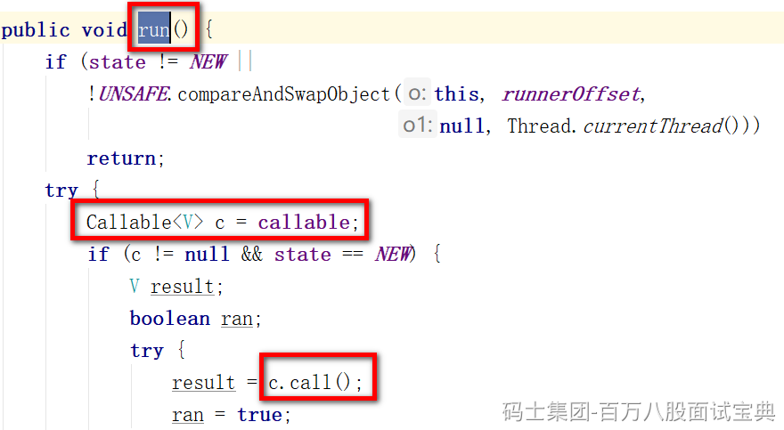

Java中就三种方式：

- 继承Thread
- 实现Runnable
- 实现Callable

本质都是Runnable，其实是一种。

因为继承Thread，间接实现了Runnable

实现Callable，需要FutureTask做封装，在启动线程时，依然是执行的FutureTask实现Runnable时重写的run方法，在run方法内部，执行的Callable的call方法。

Runnable和Callable有啥区别，使用场景

答：如果启动子线程执行任务后需要有返回结果，使用Callable。

Runnable的run方法，无法抛出异常，返回结果就是void

Callable的call方法，可以抛出异常，返回结果是Object
