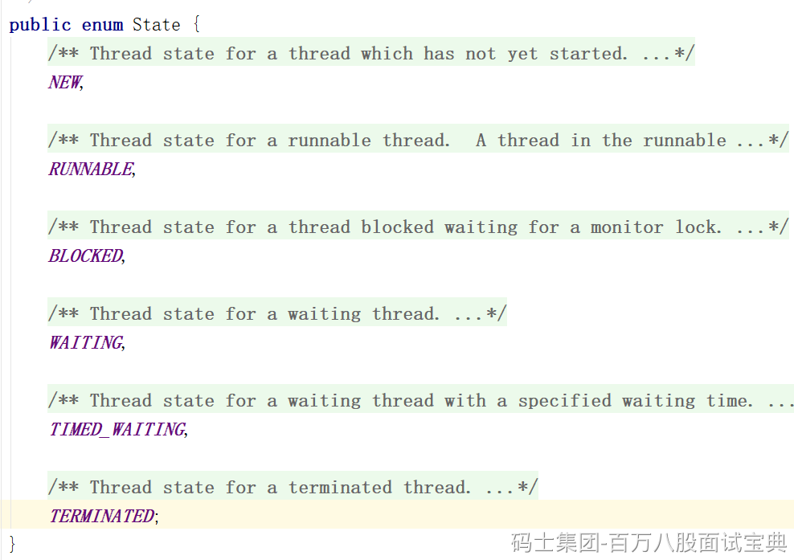

Java中的Thread类里有枚举，规定了，只有6种

BLOCKED，WAITING，TIME\_WAITING，本质上一样，都是CPU无法分配时间片

BLOCKED：synchronized没拿到锁，阻塞。

WAITING：Unsafe.park()，JUC包下的类在挂起线程时，用的都是这个。

TIMED\_WAITING：Unsafe.park(time,unit)，默认阻塞这么久，会被自动唤醒，变为RUNNABLE状态

所谓线程挂起，上面三种，都是线程挂起。

**但是操作系统方向里的线程，有5种**

NEW，READY，RUNNING，BLOCKING，TERMINATED
