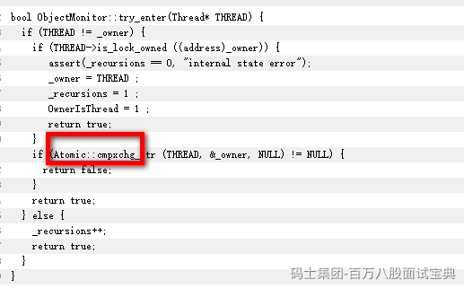

wait和notify是在持有synchronized锁时，

- wait方法是让持有锁的线程释放锁资源，并且挂起。
- notify方法是让持有锁的线程，去唤醒之前执行wait方法挂起的线程，让被唤醒的线程抢锁。

至于为何要在持有synchronized时，才能执行wait和notify，是因为在调整线程存放的队列时，需要持有当前synchronized锁里面的ObjectMonitor，没持有，不让操作。

并且执行wait需要释放锁资源，你没持有锁资源，你释放什么。。。

**在ObjectMonitor里，为什么有了cxq还要有EntryList？**

答：synchronized到了重量级锁时，会利用CAS拿锁么？！！会！！

<https://hg.openjdk.org/jdk8u/jdk8u/hotspot/file/69087d08d473/src/share/vm/runtime/objectMonitor.cpp>

cxq队列就是当竞争激烈时，锁持有时间比较长的时候，将线程扔到cxq队列里，挂起。

EntryList的目的：缓冲~

- 为了避免大量线程追加到cxq队列的头部或者是尾部（默认头部），造成压力过大。
- 当线程拿锁时，在重量级锁的情况下，也会走CAS，当自旋失败没拿到锁，优先扔到EntryList

**重量级锁怎么定义的：查看对象的对象头里的MarkWord里的标识**
