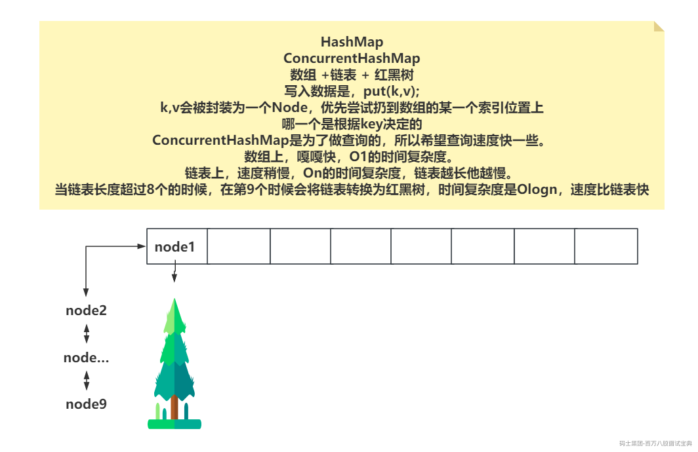

# 一、线程池参数，线程池参数怎么设置（菜鸟）

## 线程池参数：

> 核心线程数
>
> 最大线程数
>
> 最大空闲时间
>
> 空闲时间单位
>
> 工作队列
>
> 线程工厂
>
> 拒绝策略

## 线程池参数怎么设置：

面试的时候被问到了你要点到几个信息：

- 你上线的服务器的硬件配置如何（**你的生产环境是4C8G**）

- CPU内核数

- 内存大小

- 你线程池处理的任务情况

- CPU密集

- IO密集

- 混合型（既有IO操作，又有CPU操作）

前面的信息点清楚后，直接说你线程池中的 **核心线程数** 设置的是多少，以及你的 **工作队列多长**

- 核心线程数与最大线程数保持一致！ 至于到底是多少，自己提前编一个数值，比如50，比如80，随你。直接聊出来。数值是你压测出来的，记住，一定是压测的，你最开始可以给一个预估的数值，但是最终结果是压测的，在你的测试环境压测，测试环境的硬件配置和生产环境一致！ **（有一个前提，如果你任务是混合型的，那50左右没问题，如果是CPU密集的，别太大，基本就是CPU内核数左右）**

- 工作队列用的啥，多长。工作就常用的就俩，要么你用 **ArrayBlockingQueue** ，要么用 **LinkedBlockingQueue** ，这里我推荐大家统一 **LinkedBlockingQueue** 。因为你们的领导说了， **LinkedBlockingQueue** 底层是链表，工作队列本身就是增删比较频繁的情况，所以直接让我们用的 **LinkedBlockingQueue** ，效率相对更好。

- 至于长度：

- 这里你要说清楚你们这个任务触发的并发情况，如果任务体量比较大，会造成内存占用率过大。

- 任务的延迟时间允许的范围，如果队列太长，任务被处理时，最大的延迟时间能否接收。

- 队列长度要直接说是多少，一般情况就是和核心线程的2倍左右，一般情况没问题。 **100长度，150长度，200长度~~**

# 二、一般就是你针对大致业务和Tomcat或者一些中间件的线程池如何配置的，然后在压测的时候，你都查看什么指标？（前几天一学员的）

> 一般聊压测要查看的指标时，方向贼多。最核心的几个：
>
> - **CPU占用率：**
>
> - 其中IO密集的任务，很难让CPU的占用率提升太大，所以IO密集，不需要提太多CPU占用率问题
>
> - 其次在混合型或者CPU密集的任务中，需要时刻关注CPU占用率的情况，一般只要不超过70%基本没啥问题，最好控制在50~60左右。
>
> - **内存资源：**
>
> - 内存资源自然是线程本身也会占用，一般占用1M。而且任务的处理过程也需要占用额外的内存资源，并且在队列中排队的任务也是一个对象，他也占用内存资源。不能让内存资源占用过多，比如在峰值的情况下，50~60%左右就可以了。
>
> - 磁盘资源：这个一般不用太考虑，毕竟现在都是固态，速度是ok的。
>
> - 还需要查看任务的处理情况的指标：
>
> - **吞吐量：** 单位时间内，处理任务的个数。（越大越好） **500个/s**
>
> - **RT响应时间：** 每个任务的平均处理速度。（越小越好） **200ms**
>
> - 还需要查看 **GC的情况** ，如果任务体量比较大，如果新生代的内存不够充裕，可能会导致对象直接甩到老年代，或者新生态频繁的GC，就可能会导致FULL GC频繁的情况。**（比如说，出现了这个情况，可以将新生态的比例调大）**
>
> - **其他资源：** 比如你任务需要访问数据库（MySQL），必然需要Connection，访问其他服务。
>
> - 网络情况： 在访问三方服务时，他的延迟情况是如何的。网络延迟是否会受到影响。
>
> - 还有在这种长时间的压测环境下，系统能否正常的长时间稳定运行。
>
> 1、优先根据配置自己确认要一个预估的数值，然后开始压测，查看指标情况。
>
> 2、逐渐的调整并发的数值，以及线程池的参数，去查看这些性能指标。
>
> 3、如果在逐渐的调整数值后，依然无法得到你性能的要求。根据前面的指标，查看瓶颈在哪 ，做优化。
>
> 4、重复2~3操作，直到，达到你的性能要求…………、
>
> 拒绝策略，在压测的时候就要规避好。因为执行了拒绝策略，必然要做监控预警通知咱们，最好的情况记录日志信息，及时的解决。

# 三、CopyOnWrite 怎么保证线程安全，为什么这么做？（携程）

**写写互斥，写读、读写不互斥，读读也不互斥。**

CopyOnWrite系列的并发集合，是基于再写入操作前，需要先获取ReentrantLock，毕竟写写操作是互斥的，然后先将本地的数据复制一份，在复制的内容中去完成写操作，在写完之后，将复制的内容覆盖掉本地的原数据。

- 前面的ReentrantLock，可以让写写操作直接互斥，达到线程安全的目的。

- 为什么还要改个副本，在副本里写的，这样内存占用率不就是double了么~~

- 因为还有读操作，CopyOnWrite为了提升读的性能，没有让读写之间出现互斥的操作。读和写是可以并行执行的。在有线程进行读操作时，直接读取本地的数据，写入的线程就正常的先去写到副本中。

在使用ArrayList这种线程不安全的集合时，如果需要声明到成员变量，多个线程都去访问的时候，并且读操作居多时，就应当上CopyOnWrite的系列。

# 四、ConcurrentHashMap在红黑树的读写并发会发生什么？（我问的）

扫盲的内容：



红黑树为了保证平衡，在写入数据时，可能会做旋转、变色的操作。

如果红黑树上的读写可以并行执行，那就造成读线程在遍历红黑树找数据时，因为写操作的旋转，从而没找到。但是数据其实是存在的，可能会有影响到你的业务。

如果真的发生了写线程正在写数据到红黑树，此时来了一个读线程，并不会让读线程阻塞等待，而是直接让读线程去双向链表（单向链表）中查询数据，虽然速度慢了一内内，但是查询会进行下去……

**读线程怎么知道是否有写线程正在红黑树里写数据呢？**

基于下面这个int类型的数值，作为一个锁标记

`int lockState;`

```java
00000000
在二进制中。
最低位是1，代表有写线程在里面写数据。
第二低位是1，代表有写线程排队等待读线程完毕，再去写。
第三低位往上不为0，就代表有读线程正在红黑树里读取数据。
```

如果写线程发现有读线程正在红黑树里找数据，那写线程需要等一会，基于park挂起~~~

# 五、有在项目中实际使用过ConcurrentHashMap吗？哪些场景会用到？（京东健康）

ConcurrentHashMap本质就是做缓存的！将一些热点数据甩到ConcurrentHashMap里，他的速度比Redis快。毕竟你找Redis要数据，还得走一个网络IO的成本，ConcurrentHashMap就是JVM内部的数据。

比如数据已经从MySQL同步到Redis里了，但是Redis的性能不达标，或者Redis节点本身压力就比较大。那咱们就可以将缓存前置到JVM缓存中，利用ConcurrentHashMap去存储。

但是这种方式存储，如果JVM节点是集群部署，那就必然会存在不一致的问题。

- 强行走强一致，让你的缓存的存在没啥意义。。。（不这么玩）

- 通过一些中间件，MQ，Zookeeper等都可以做大监听通知或者广播的效果，这种同步可能存在延迟，达到最终一致性。

- 将一些访问量特别频繁的数据，扔到JVM内存，就生存1s甚至更少，这样可以较少对Redis的压力……同时在短时间内，也能提升性能……

类似Nacos，Eureka这种注册中心，就用到了ConcurrentHashMap，将注册中心里的注册列表的所有服务信息拉取到本地的ConcurrentHashMap中。

Spring的三级缓存用的啥？？不也是ConcurrentHashMap么~~BeanDefinition

# 六、工作中的死锁怎么处理（京东健康）

面试的时候，记得聊到死锁，必聊四个点，就背！！！

**互斥条件，请求保持，不可剥夺，环路**………………

**互斥条件（一般玩的就是互斥锁！）**  
每个资源只能被一个线程使用，不能被同时占用。这意味着如果有两个进程试图同时使用同一个资源，就会发生冲突。例如，如果两个进程同时尝试修改同一个文件的内容，就会导致数据混乱。互斥条件是死锁的必要条件之一，因为如果资源可以同时被多个进程使用，就不会出现死锁的情况。

**请求与保持条件（一个线程在持有一个锁资源时，需要再拿另一个资源，而且之前的锁资源不释放）**  
一个线程需要获取新的资源才能继续执行，但已经占有的资源不能被释放。这意味着如果一个进程已经占有了某些资源，那么它还需要获取更多的资源才能继续执行。例如，如果一个进程已经占有了两个资源A和B，但它还需要一个资源C才能继续执行，而资源C已经被另一个进程占用，那么这个进程就会陷入死锁。

**不剥夺条件（锁资源只能自己释放，别人不能释放！）**  
已经分配给进程的资源不能被强制剥夺。这意味着如果一个进程已经占有了某些资源，那么除非它自己释放，否则其他进程或系统不能强制剥夺这些资源。例如，如果一个进程已经占有了两个资源A和B，但系统强行剥夺了其中一个资源A，那么这个进程就会陷入死锁。

**环路等待条件（线程1持有A资源，同时要B资源，线程2只有B资源，同时想要A资源）**  
多个进程形成一种头尾相接的环路，每个进程都占用了一些资源，但又都需要得到下一个未占用的资源。这意味着如果多个进程形成了一个环路，每个进程都等待下一个进程释放资源，那么这个环路上的所有进程都会陷入死锁。例如，有三个进程A、B、C，A需要资源1和资源2，B需要资源2和资源3，C需要资源3和资源1，那么A、B、C就会形成一个环路等待条件，导致所有进程陷入死锁。

**定位方式：**

> jstack：
>
> arthas：

```plain
jps，查看具体的进行的pid
jstack pid ,直接就会打印出死锁信息
```

```plain
需要你自己优先下载一个jar包。
yum -y install wget
wget https://alibaba.github.io/arthas/arthas-boot.jar
在有Java环境的情况下，直接
java -jar arthas-boot.jar
跑起来后，会让你选择监控的JVM进程谁，写编号就成。
继续的命令，就help，或者看看官方文档
```

**解决方式：**

- 规避业务中出现环路等待锁的情况，这种业务的设计就存在问题。

- 不要走lock这种死等的方式，可以采用tryLock等待一小会，拿不到就拉到。

# 七、手撕多线程，三个线程轮流打印123/ijk，打印10次。（阿里一面手撕）

可以采用的方式很多，比如基于synchronized的wait和notify通知线程实现顺序打印。

甚至还能用ReentrantLock的公平锁去实现，但是这个不太稳定……

咱们花活，直接上Semaphore，我就写一种了~~~

```java
private Semaphore s1 = new Semaphore(0);
private Semaphore s2 = new Semaphore(0);
private Semaphore s3 = new Semaphore(0);

public void print123(){
    Thread t1 = new Thread(() -> {
        for(int i = 0;i < 10;i++){
            sout(1);
            s2.release();
            s1.acquire();

        }
    }); 
    Thread t2 = new Thread(() -> {
        for(int i = 0;i < 10;i++){
            s2.acquire();
            sout(2);
            s3.release();
        }
    }); 
    Thread t3 = new Thread(() -> {
        for(int i = 0;i < 10;i++){
            s3.acquire();
            sout(3);
            s1.release();
        }
    });
}
```
