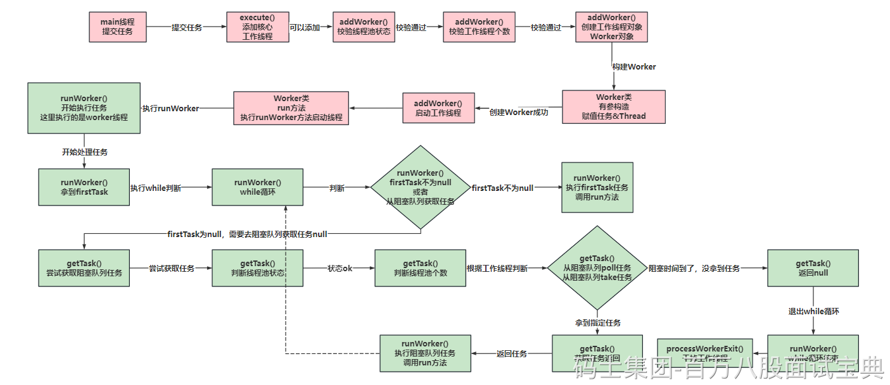

两个大方向：

1、使用Executors自带的方式构建（不推荐），线程池参数很多，这种自带的，只提供了修改部分参数的功能，无法完整的掌握线程池的细节。

- 定长的newfixed
- 单例的Single
- 非固定长度的Cached
- 执行定时任务的Schedule
- 使用forkJoinPool的WorkStealing

2、手动new ThreadPoolExecutor，自己指定7个核心参数。（推荐）更好把控线程池的情况。

下图是线程池的完整流程

