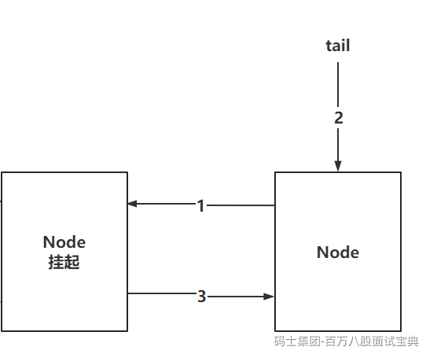

如果线程没有获取到资源，就需要将线程封装为Node对象，安排到AQS的双向链表中排队，并且可能会挂起线程

如果在唤醒线程时，head节点的next是第一个要被唤醒的，如果head的next节点取消了，AQS的逻辑是从tail节点往前遍历，找到离head最近的有效节点？

想解释清楚这个问题，需要先了解，一个Node对象，是如何添加到双向链表中的。

基于addWaiter方法中，是先将当前Node的prev指向tail的节点，再将tail指向我自己，再让prev节点指向我

如下图，如果只执行到了2步骤，此时，Node加入到了AQS队列中，但是从prev节点往后，会找不到当前节点。

