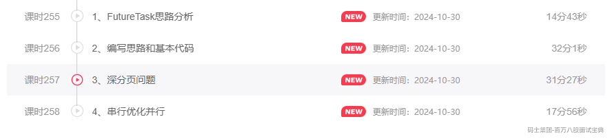

# 并发编程核心原理常见面试题（下）

### 1、JUC包下有哪些常见的工具（国人通、宝马）

> 这个问题本身没啥营养，他的目的依然是引出后续要聊的一些内容。。。
>
> 贴近项目，一般比较多的套路就是CountDownLatch + ThreadPoolExecutor去实现一些并行操作去提升业务的一些性能。
>
> AQS、ReentrantLock，Semaphore，CyclicBarrier，ReentrantReadWriteLock。
>
> ………………
>
> 老师，我业务用到线程池。
>
> 记住，没有也得有，自己run！！！！！！

### 2、项目中哪里用到了多线程（众安保险、鸿盛天极）

> 很多同学在开发的过程中，基本就没玩过优化相关的东西，一切都是业务实现为核心，只要功能没问题，测试能通过，完事！！！
>
> 同学们应当用过@Async，@Scheduled，这都是SpringBoot提供一个很基本的注解。
>
> 一个实现异步方法，一个实现定时任务。
>
> 先聊@Async：
>
> - Async注解默认使用的线程池的线程只有8个，最大并行也就是8，如果并发很大，可能会导致异步的任务处理的时间很慢，甚至任务太多，都有可能OOM。、
>
> - 问题出现了，解决方案也就简单了，可以自己去配置@Async使用的线程池的具体细节。
>
> 再聊@Scheduled：
>
> - 在使用@Scheduled执行定时任务的时候，发现指定了多个任务的执行周期是一致的，但是同时只有一个任务在执行，其他任务需要等待当前任务执行完毕后才能执行。
>
> - 问题很简单，依然是默认线程池的问题，默认的@Scheduled注解提供的线程池就一个核心线程，理论上他同一时间只能执行一个任务。
>
> - 排查Spring默认提供的线程池，他默认最大线程数，是1个，导致任务只能并行走一个。自己设置即可
>
> 除此之前，你项目上线前，Tomcat线程池也需要配置把。。。比如用到了MQ，你MQ中的消费者，如果不设置并行情况，比如RabbitMQ，默认就一个线程作为线程池从Queue中拉取消息消费。
>
> **除此之外，之前一个学员面试中，面试官特意强调了，别说框架中涉及到的，你有自己去new 线程池去处理一些业务嘛？？（原问题是设计模式）**
>
> 此时就要润色了。。。。。可以看看这个。核心方向就内个几个
>
> - 多次查询数据库或者三方服务的业务，可以基于线程池并行去查询三方以及数据库，减少网络IO带来的时间成本。。。
>
> - 比较大的数据，或者文件之类的东西，单个线程处理速度太慢了，可以将这种文件或者数据做好合理的切分，让多个线程并行去处理，最终汇总即可。
>
> 

```plain
@Configuration
public class AsyncConfig implements AsyncConfigurer {

    @Override
    public Executor getAsyncExecutor() {
        // 自己在这去创建线程池，解决现在@Async注解存在的问题。。
        return AsyncConfigurer.super.getAsyncExecutor();
    }
}
```

```plain
@Configuration
public class TaskConfig  implements SchedulingConfigurer {
    @Override
    public void configureTasks(ScheduledTaskRegistrar taskRegistrar) {
        // 自己提供即可。。。
    }
}
```

### 3、线程池参数（滴滴司乘、仕硕科技、元保）

> 这个不是面试题，这个是常识。回答的时候，卡壳都不行！
>
> 这个不是让你背的，是必须理解的。
>
> 核心线程数
>
> 工作队列
>
> 最大线程数
>
> 拒绝策略
>
> 最大空闲时间
>
> 空闲时间单位
>
> 线程工厂

### 4、提交任务到线程池的细节（仕硕科技，中关村科金）

> 任务投递过来后的基本流程：
>
> - 尝试创建核心线程去处理任务。
>
> - 核心线程数达到了要求，就将任务扔到工作队列。 （有后续操作，任务饥饿问题，**如果出现队列有任务，但是没有工作线程的情况**，他会创建一个非核心线程去处理队列的任务）
>
> - 工作队列放慢了，就会创建非核心线程去处理任务。
>
> - 工作线程数，达到最大线程数了，执行拒绝策略。
>
> 线程池里区分核心与非核心线程吗？ **创建的时候，区分，干上活之后，不区分。**
>
> 线程池里关心工作线程是否空闲吗？ **不关心，他只关心数！、**
>
> **1、Java线程池，5核心、10最大、10队列，第6个任务来了是什么状态？**
>
> **2、如果在第6个任务过来的时候，5个核心线程都已经空闲了呢？**
>
> **3、第16个任务来了怎么处理？**
>
> **4、第16个任务来了的时候，要是有核心线程空闲了呢？**
>
> **5、队列满了以后执行队列的任务是从队列头 or 队尾取？**
>
> **为什么核心满了，不去创建最大线程数，而是扔到队列后，才考虑创建非核心线程？**
>
> - 将任务扔到队列的目的是为了缓冲，由现在的线程去处理任务，如果上来直接额外创建非核心线程，那核心跟非核心的意义就不大了。浪费资源，多线程了。。。
>
> **为什么非核心线程创建的时候，要优先执行投递过来的任务，而不是执行队列中任务？**
>
> - 投递任务到线程池的目的为了走异步，更快的处理后续的业务，上述这个方式可以让异步的响应速度很快。
>
> - 如果是先处理队列的任务，那就需要先完成线程的创建，并且启动，然后从工作队列中获取任务，然后你的新任务才能投递到工作队列。
>
> - 反之，如果是直接由非核心线程处理， 执行到线程的创建和启动就结束了。

### 5.1、核心线程1个正在工作，最大线程2个，来任务想直接创建非核心线程（不想放到等待队列）

> 1、队列长度为0即可。
>
> 2、队列可以使用SynchronousQueue。

### 5.2 后续再来任务，在进入队列，问怎么做？（飞书）

> 先从执行顺序来说，按照前面的参数特点，这次的任务只能走拒绝策略，可以在拒绝策略的位置，依然基于SynchronousQueue，利用put，一直等。（但是这样会影响到投递任务的线程。。。）
>
> 另外一个解决方式，可以在投递第三个任务之前，修改队列的长度。
>
> - 可以获取到队列的引用，直接修改他的引用即可，但是，发现workQueue的引用是final修饰的，方案不行。 ×
>
> - 咱们又去考虑，直接使用LinkedBlockingQueue，这哥们是链表结构，动态修改他的长度把，不行，虽然count是Atomic类型，但是CAPACITY最大值是final修饰的也不让改。 ×
>
> - 想通过修改队列长度实现，就得自己实现一个阻塞队列，可以动态修改长度的。。

### 6、任务来了可以再有选择的优先创建线程或者扔到等待队列（飞书）

> 基于原来的execute的逻辑，必然没法实现这个逻辑，咱们能做到，只有重新execute内部的一些机制，或者是换一个投递任务的方法，自己在内部来一波逻辑。。。
>
> 1、任务要区分优先级到哪，你的每个任务要有一个标识。确定优先级。可以创建一个抽象类，实现Runnable，设置好一个优先级属性
>
> 2、需要构建一个类，去继承ThreadPoolExecutor，然后去自己声明一个投递任务的方法。
>
> - 如果队列优先，可以直接基于super获取到工作队列，然后offer或者put到工作队列中。
>
> - 如果要创建线程去处理，可以直接走execute方法。（理想状态下，是调用addWorker，但是线程池本身addWorker是private的，不允许外部调用）
>
> 如果再问，队列扔到工作线程后，任务饥饿怎么办，如果线程优先的任务执行exeute，核心跳过后放到工作队列怎么办？
>
> 那就不用ThreadPoolExecutor了，他不满足现在的要求，自己实现一个线程池！

### 7、工作线程在执行任务时，抛出了异常，工作线程会被销毁嘛？（中关村科金）

> 给线程池投递任务的方式有几种？
>
> - execute，投递Runnable的任务
>
> - submit，投递Callable的任务（也可以投递Runnable）
>
> submit本质还是基于execute投递的任务，但是在投递任务前，将任务封装为了RunnableFuture的类，可以看做是FutureTask……
>
> execute投递的Runnable任务，异常会直接抛出，基于runWorker方法抛出，抛到Worker类的run方法，run方法会异常结束，run方法结束，Worker线程销毁。
>
> submit投递的任务，当出现异常时，Future会将任务的异常保留在Future内部，不会抛出，在你基于Future去get的时候，异常才会catch到。异常是保留的FutureTask里面的outcome属性中。。。

### 8、线程池有哪些队列。（国人通）

> 首先线程池要求提供的是阻塞队列，也就是BlockingQueue的实现。
>
> 这里有很多，比如
>
> - **ArrayBlockingQueue：底层数组，定长**
>
> - **LinkedBlockingQueue：底层链表，也可以定长，也可以不定长**
>
> - PriorityBlockingQueue：底层是数组实现的二叉堆，一般用于定时处理。
>
> - SynchronousQueue：不存储任务，直接以匹配的方式。
>
> - DelayQueue：底层也是二叉堆，是PriorityBlockingQueue的二次封装。
>
> **一般咱们常用的就是ArrayBlockingQueue和LinkedBlockingQueue，而我们要求就使用LinkedBlockingQueue，因为线程池中的队列存放的任务会进进出出，增删多，那链表结构更合适。**
>
> **并且LinkedBlockingQueue是生产者和消费者各吃一把锁，互不影响，总之性能相对好一些。**
