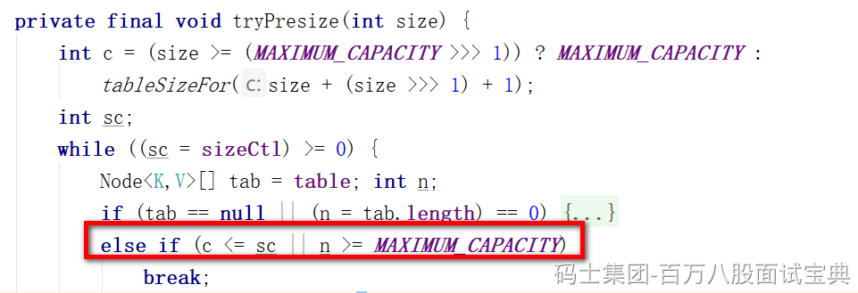

- ConcurrentHashMap中的元素个数，达到了负载因子计算的阈值，那么直接扩容
- 当调用putAll方法，查询大量数据时，也可能会造成直接扩容的操作，大量数据是如果插入的数据大于下次扩容的阈值，直接扩容，然后再插入
- 数组长度小于64，并且链表长度大于等于8时，会触发扩容

扩容的流程：（sizeCtl是一个int类型变量，用于控制初始化和扩容）

- 每个扩容的线程都需要基于oldTable的长度计算一个扩容标识戳（避免出现两个扩容线程的数组长度不一致。其次保证扩容标识戳的16位是1，这样左移16位会得到一个负数）
- 第一个扩容的线程，会对sizeCtl + 2，代表当前有1个线程来扩容
- 除去第一个扩容的线程，其他线程会对sizeCtl + 1，代表现在又来了一个线程帮助扩容
- 第一个线程会初始化新数组。
- 每个线程会领取迁移数据的任务，将oldTable中的数据迁移到newTable。默认情况下，每个线程每次领取长度为16的迁移数据任务
- 当数据迁移完毕时，每个线程再去领取任务时，发现没任务可领了，退出扩容，对sizeCtl - 1。
- 最后一个退出扩容的线程，发现-1之后，还剩1，最后一个退出扩容的线程会从头到尾再检查一次，有没有遗留的数据没有迁移走（这种情况基本不发生），检查完之后，再-1，这样sizeCtl扣除完，扩容结束。
