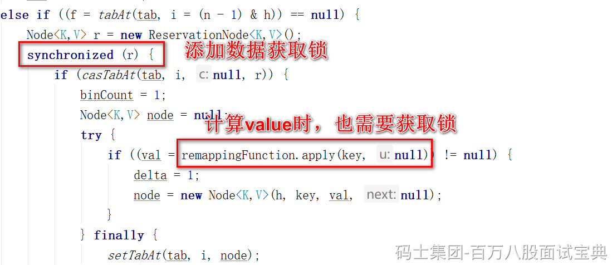

协助扩容的条件判断BUG

```plain
if (check >= 0) {
    Node<K,V>[] tab, nt; int n, sc;
    while (s >= (long)(sc = sizeCtl) && (tab = table) != null &&
           (n = tab.length) < MAXIMUM_CAPACITY) {
        int rs = resizeStamp(n);
        if (sc < 0) {
            if ((sc >>> RESIZE_STAMP_SHIFT) != rs || 
                sc == rs + 1 ||   // BUG,在判断当前扩容操作是否已经到了最后的检查阶段
                sc == rs + MAX_RESIZERS ||  // BUG，在判断当前扩容操作线程是否已经达到上限
                sc == rs << 16 + 1 ||   // BUG,在判断当前扩容操作是否已经到了最后的检查阶段
                sc == rs << 16 + MAX_RESIZERS ||  // BUG，在判断当前扩容操作线程是否已经达到上限
                (nt = nextTable) == null ||
                transferIndex <= 0)
                break;
            if (U.compareAndSwapInt(this, SIZECTL, sc, sc + 1))
                transfer(tab, nt);
        }
        else if (U.compareAndSwapInt(this, SIZECTL, sc,
                                     (rs << RESIZE_STAMP_SHIFT) + 2))
            transfer(tab, null);
        s = sumCount();
    }
}
```

死循环问题



```plain
public static void main(String[] args) throws InterruptedException {
    ConcurrentHashMap map = new ConcurrentHashMap();
    System.out.println(Thread.currentThread().getName());
    map.computeIfAbsent("aaa",key -> {
        map.computeIfAbsent("aaa",key2 -> {return "222";});
        return "1";
    });
}
```
