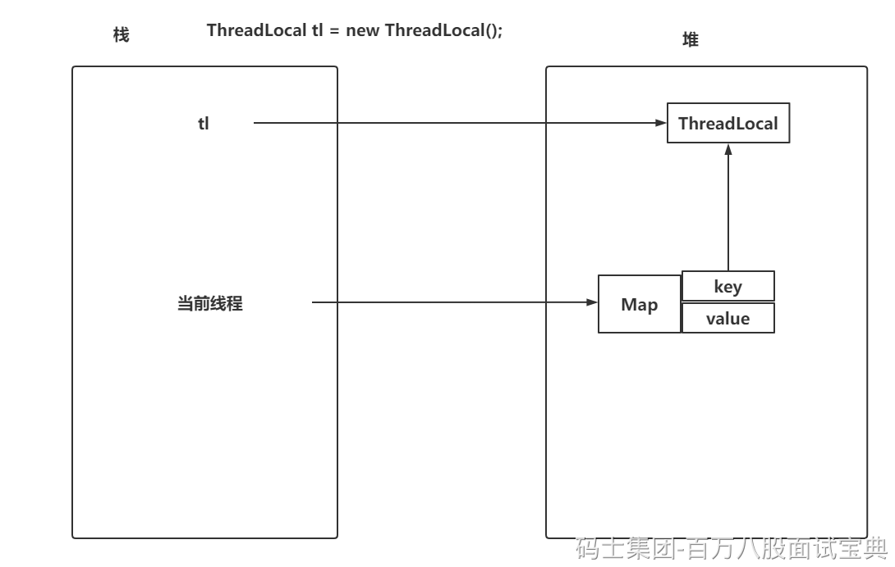
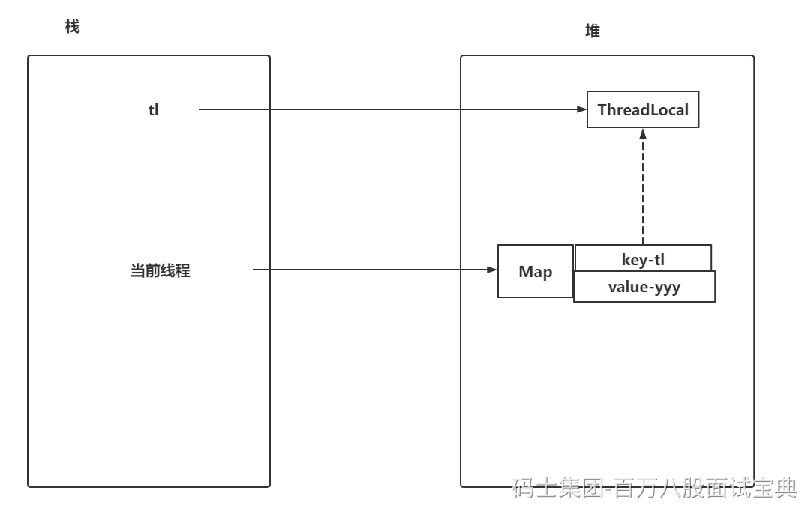

ThreadLocal就是一个工具，真正存储数据的是Thread类中的Map

ThreadLocal.ThreadLocalMap inheritableThreadLocals = null;

ThreadLocal的内存泄漏有两点：

- key的内存泄漏：当一个方法执行完毕，tl弹栈走了，但是当前线程还在。所以为了解决key的内存泄漏问题，ThreadLocal作为key存在时，是一个weak弱引用的存在，因为弱引用只要执行GC时，没有强引用指向，必然会被回收。
- value的内存泄漏：首先一般是针对线程池的操作。如果线程执行完操作可以自行销毁，可以不关注value的内存泄漏。但是咱们大多数操作都是基于线程池的，所以value的内存泄漏不能不管。只需要在使用完毕当前ThreadLocal后，及时调用remove方法。

