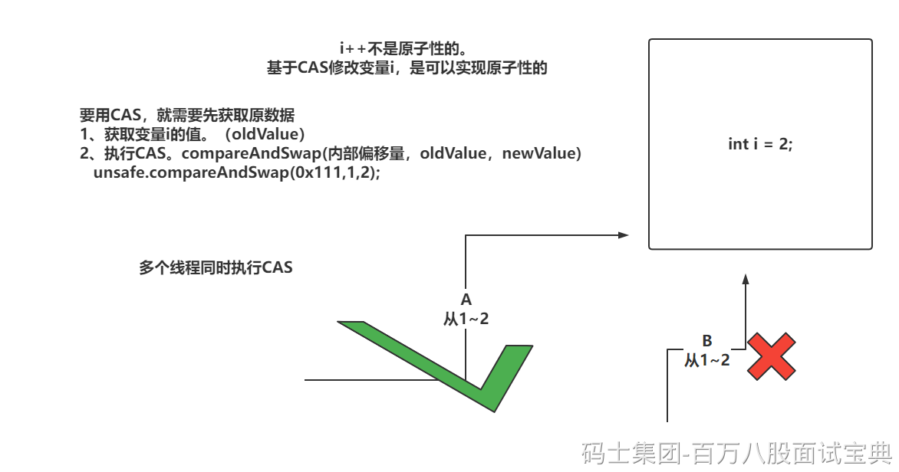
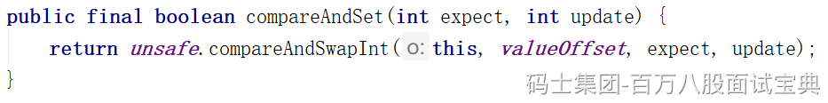

CAS叫做CompareAndSwap，比较并交换。

**CAS的本质是保证替换一和内存中的值时，是原子性的。**

Java中很多内容都是基于CAS实现的，AtomicInteger，LongAdder，ReentrantLock都用到了CAS

通过cmpxchg指令实现，单核就采用cmpxchg，多核需要追加前缀lock。

CAS的问题：

- ABA：存在多线程成操作，导致一个数据经历多次修改后，回到了原值，导致之前不应该成功CAS操作又成功，可以通过**AtomicStampedReference**追加版本号解决。
- 自旋次数过多：CAS不会挂起线程，会让CPU一致调度当前线程执行CAS直到成功。这样可能会过分消耗CPU资源。

- synchronized用的是自适应自旋锁，拿不到锁就算了吧，赶紧吧线程挂起。线程（WAITING）
- LongAdder，就是基于分段所效果去玩，不让多个线程对一个值进行CAS，你换一个。

- 只能对一个数值修改做原子性：如果想基于CAS实现锁住一段代码的操作，参考ReentrantLock。
