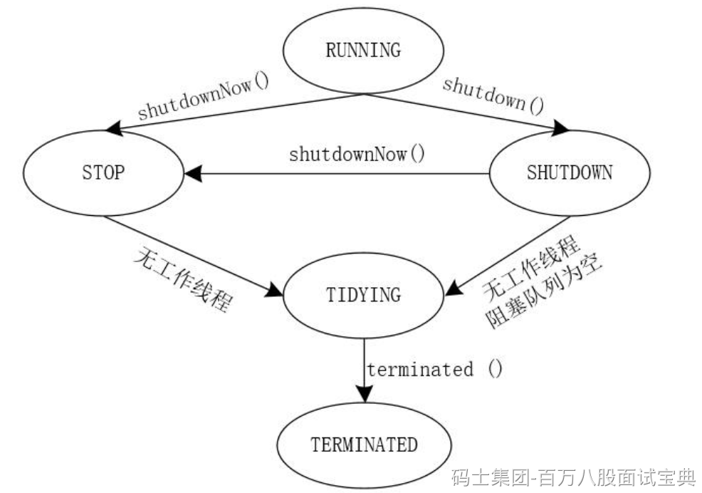

ThreadPoolExecutor 的生命周期共定义了 **五个状态**，分别是 RUNNING、SHUTDOWN、STOP、TIDYING 和 TERMINATED。以下分段说明每个状态的含义及触发条件：M

首先，线程池创建后即处于 **RUNNING** 状态。在该状态下，线程池 **接受新任务** 并继续处理队列中的任务。如果调用 `shutdown()`，线程池会停止接受新任务，但仍 **执行队列中及正在运行的任务**，然后过渡到 **SHUTDOWN** 状态。

当我们通过 `shutdownNow()` 强制关闭线程池，它不仅停止接受新任务，还 **中断当前执行的任务**，并且清空等待队列，同时转入 **STOP** 状态。此时任务队列中的任务不再执行。S

当线程池在 SHUTDOWN 状态下，且队列为空且没有正在运行的线程，或者在 STOP 状态下所有工作线程结束之后，线程池便会切换到 **TIDYING** 状态。此状态下线程池调用 `terminated()` 钩子方法执行清理逻辑。

最后，当 `terminated()` 执行完毕后，线程池进入 **TERMINATED** 状态，表示线程池已经完全关闭，所有资源释放完毕，并最终结束。B

上图明确展示如下状态转换：

- RUNNING ➝ SHUTDOWN（调用 shutdown()）
- RUNNING 或 SHUTDOWN ➝ STOP（调用 shutdownNow()）
- SHUTDOWN 或 STOP ➝ TIDYING（任务执行完毕且队列清空）
- TIDYING ➝ TERMINATED（terminated() 方法完成）
