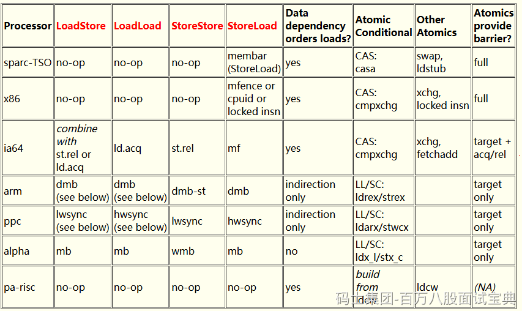

**每次突击班，我基本都会说JMM，而且每次都要说一句。**

**别这么写技术栈： 熟练掌握JVM，JMM，了解GC回收。。。 JMM属于并发编程，别放这。。。。。**

**如果面试被问到了Java的内存模型，你要聊JMM，如果是问了Java的内存结构或者是JVM的内存模型，你去聊堆、栈、方法区。。**

**因为咱们程序是由线程去执行指令的，线程是由CPU去调度的。但是CPU由于厂商不同，型号不同，在做一些并发操作时，他去解决原子性，可见性，有序性时，他们提供的指令或者是解决方案可能各有不同，JMM的目的，就是为了解决这个硬件，甚至包括不同的操作系统带来的一些差异化的影响。从而实现Java的跨平台的并发编程能力。**

比如有序性，在不用的CPU型号中，解决问题的方式就不一样，JMM就可以去调用不同型号CPU的解决方式。

