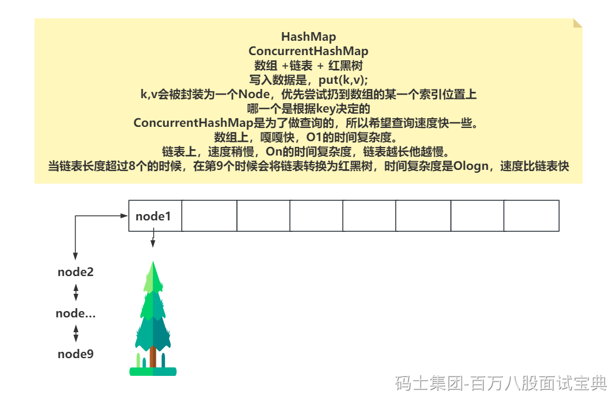

扫盲的内容：



红黑树为了保证平衡，在写入数据时，可能会做旋转、变色的操作。

如果红黑树上的读写可以并行执行，那就造成读线程在遍历红黑树找数据时，因为写操作的旋转，从而没找到。但是数据其实是存在的，可能会有影响到你的业务。

如果真的发生了写线程正在写数据到红黑树，此时来了一个读线程，并不会让读线程阻塞等待，而是直接让读线程去双向链表（单向链表）中查询数据，虽然速度慢了一内内，但是查询会进行下去……

**读线程怎么知道是否有写线程正在红黑树里写数据呢？**

基于下面这个int类型的数值，作为一个锁标记

`int lockState;`

```plain
00000000
在二进制中。
最低位是1，代表有写线程在里面写数据。
第二低位是1，代表有写线程排队等待读线程完毕，再去写。
第三低位往上不为0，就代表有读线程正在红黑树里读取数据。
```

如果写线程发现有读线程正在红黑树里找数据，那写线程需要等一会，基于park挂起~~~
