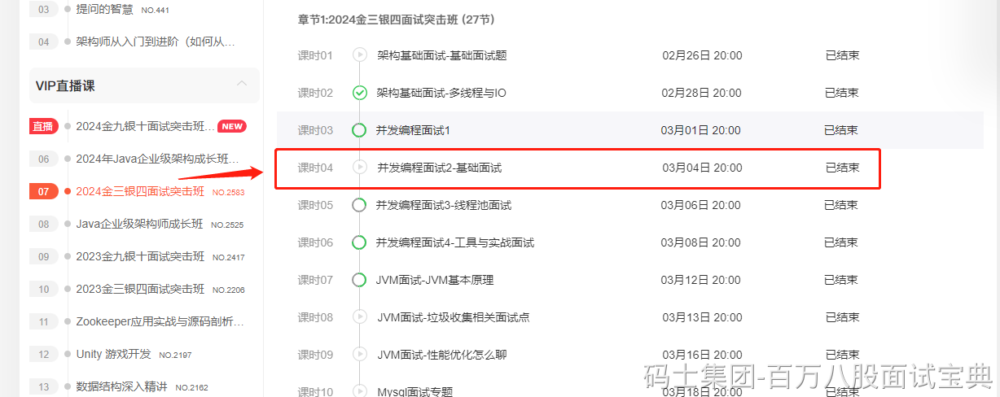

1、**可以聊CAS，一般到了CPU的cmpxchg指令就到头了。**

2、**可以聊synchronized：**

- 聊对象头里的MarkWord，去聊锁升级，无锁、偏向锁、轻量级锁、重量级锁……

3、**可以聊Lock锁：**

- 聊AQS！

关于synchronized和Lock锁的细节，看2024金三银四突击班里的并发编程2

<https://www.mashibing.com/live/2583>

