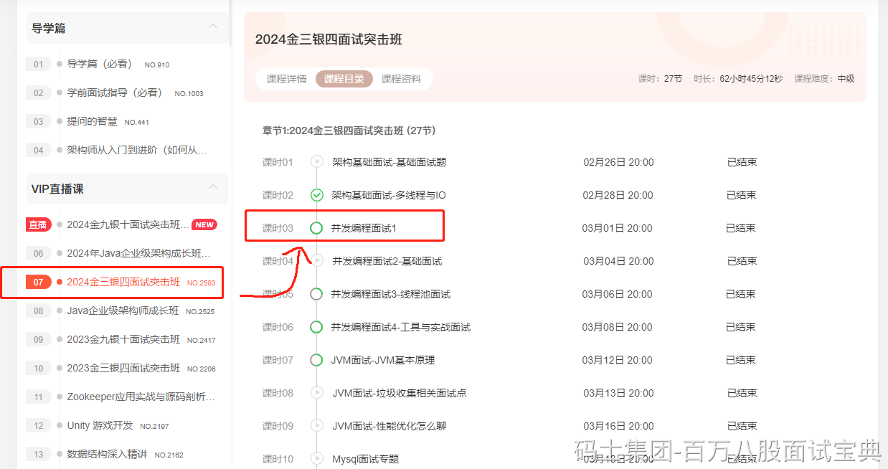

**ThreadLocal一般就是再同一个线程中做参数传递的。**

一般场景，比如 **事务的控制** ，需要Service和Mapper使用同一个Connection，那就可以基于ThreadLocal去做参数的传递。

再比如 **链路追踪** ，想记录当前线程的整条日志信息，也可以基于ThreadLocal存储traceID。

再比如在Filter中，从请求头里面获取到了 **Token** ，后期需要在Controller中使用，也可以基于ThreadLocal传递Token信息。

---

本质上，ThreadLocal他不存储数据，真正存储数据的是每个线程Thread对象中的ThreadLocalMap属性。

真正存储数据的容器是Thread类中的ThreadLocalMap。

**ThreadLocal是作为key的存在，value是你正常存储的数据。**

至于ThreadLocal的内存泄漏问题，这里就不展开说了……

看2024金三银四突击班里的**并发编程1**

<https://www.mashibing.com/live/2583>

