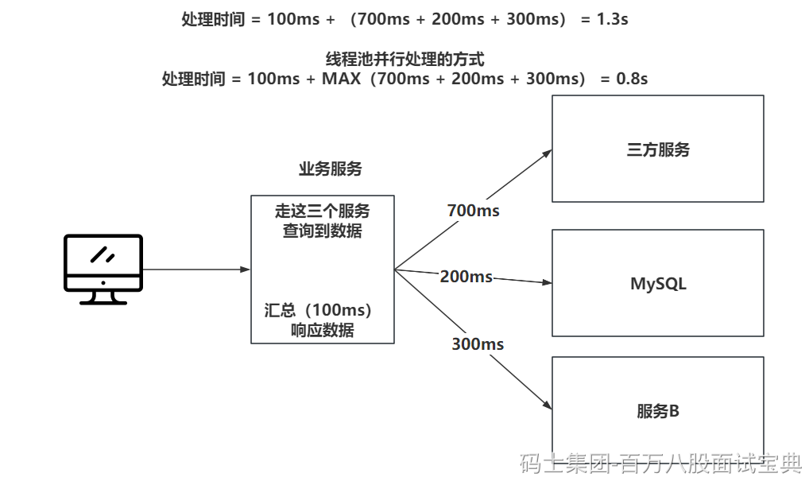

1、异步要处理的，比如你发送个邮件，发送个短信，这种异步处理的，就上线程池。

2、定时任务，时间到了，触发一个线程去执行某个任务，也能上线程池，而且JUC还提供了ScheduleThreadPoolExecutor，就是定时任务的线程池。

3、访问多个服务做并行处理，提升效率

4、处理的数据体量比较大，做导入导出这种，可以上多线程做并行处理提升处理效率。

5、框架底层都有线程池，只是你没配置，RabbitMQ的消费者，你不配置线程的信息，他就是单线程处理，速度嘎嘎慢，你配置了，那就是多个消费者并行处理。
