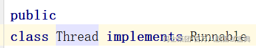

Java中创建线程方式，只有一种，本质都是Runnable的形式。

1、继承Thread

2、Runnable，本质都是他！

3、Callable：Callable一般需要配合FutureTask来执行，执行的是FutureTask中的run方法，而FutureTask实现了RunnableFuture的接口，RunnableFuture的接口又继承的Runnable。

4、线程池：线程池中的工作线程是Worker，Worker实现了Runnable，在构建工作线程时，会new Worker对象，将Worker传递给线程工厂构建的Thread对象。本质还是Runnable。
