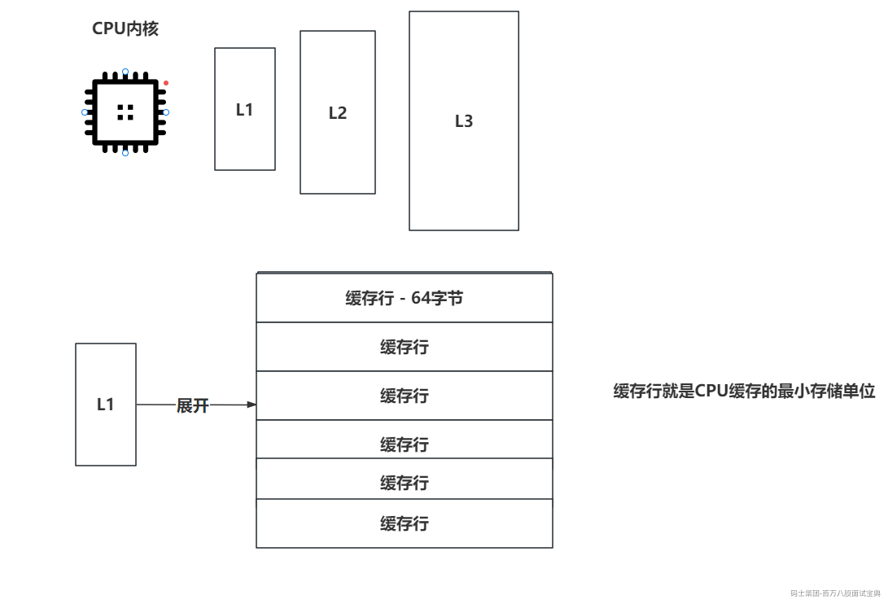

伪共享问题需要先掌握一下CPU缓存的事。



所谓的伪共享就是多个数据公用一个缓存行发生的问题。

当一个缓存行的64个字节，缓存了多个数据（ABCD），此时因为JVM的操作，A数据被修改了，但是对于CPU来说，我只能知道当前缓存行的数据被修改了，现在的数据不安全，需要重新的去JVM中将数据同步一次。

因为CPU执行的效率特别快，如果去主内存中同步一次数据，相对CPU的速度来说，就好像咱们执行代码时查询了一次数据库，很影响效率。

想解决这个问题，避免其他线程写缓存行导致当前线程需要去主内存查询，可以让某个线程直接占满当前缓存行的64k大小即可。

占满缓存行，独自使用，其实就是利用空间换时间的套路。

```java
long l1,l2,l3,l4,l5,l6,l7;
long value;
long l9,l10,l11,l12,l13,l14,l15;
```
