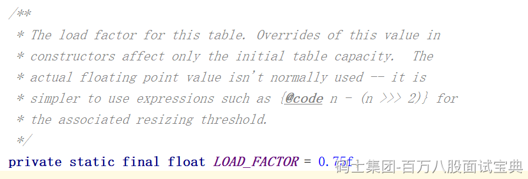

负载因子就是这东西。不能改！

而且在ConcurrentHashMap的有参构造中，虽然可以穿度一个负载因子的参数，但是无法修改他，在有参构造的逻辑里，仅仅是拿着传入的loadFactor计算初始数组的长度。没有给核心的loadFactor做修改。

同时HashMap是允许修改的。

而且在ConcurrentHashMap中，没有基于loadFactor计算阈值，而是直接基于位运算计算的，结果其实和×0.75一模一样。没有直接×，就是因为位运算更快。

**如果是HashMap，修改了负载因子，不用0.75，会有什么问题么？**

如果设置的比较小，会造成频繁的扩容，比如设置0.5，16长度的数组，元素有8个就扩容了。

如果设置的比较大，会造成大量的Hash冲突，比如设置为1，16长度的元素，元素个数达到16个才会扩容。大量的hash冲突会造成数据挂到链表甚至生成红黑树，查询效率会降低。

是可以改的，只不过对泊松分布计算出来的概率，有一定影响。
