# 1、说说HTTP、TCP、Socket的关系是什么？

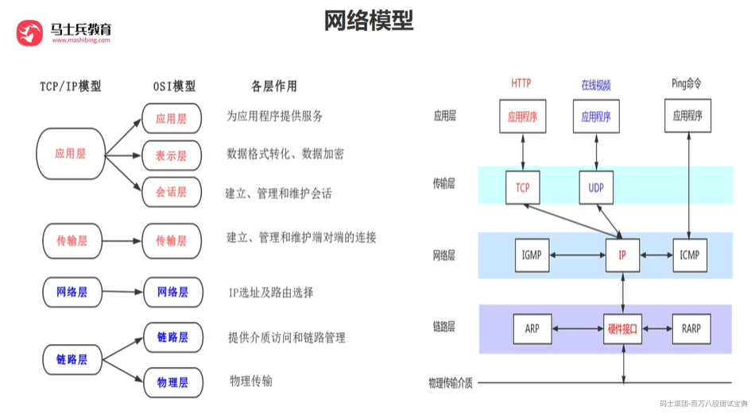

TCP/IP 代表传输控制协议/网际协议，指的是一系列协议族。

HTTP 本身就是一个协议(应用层)，是从 Web 服务器传输超文本到本地浏览器的传送协议。

Socket 是 TCP/IP 网络的 API ，其实就是一个门面模式，它把复杂的 TCP/IP 协议族隐藏在Socket 接口后面。对用户来说，一组简单的接口就是全部，让 Socket 去组织数据，以符合指定的协议。

**综上所述：**

1、需要 IP 协议来连接网络

2、TCP 是一种允许我们安全传输数据的机制，使用 TCP 协议来传输数据的 HTTP 是 Web 服务器和客户端使用的特殊协议。

3、HTTP 基于 TCP 协议，所以可以使用 Socket 去建立一个 TCP 连接。

# 2、TCP为什么要三次握手，两次不行吗？为什么？

TCP是可靠的传输控制协议，而三次握手是保证数据可靠传输又能提高传输效率的最小次数。为什么？RFC793，也就是TCP的协议RFC中就谈到了原因，这是因为：

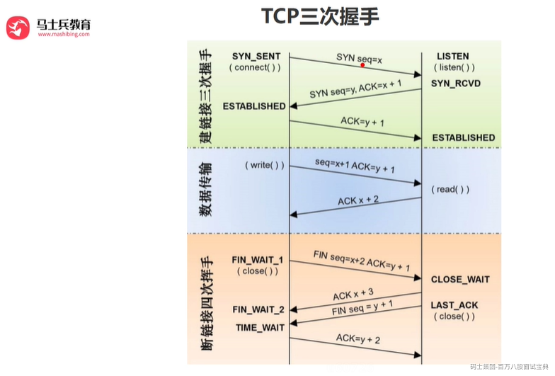

为了实现可靠数据传输，TCP协议的通信双方，都必须维护一个序列号， 以标识发送出去的数据包中，哪些是已经被对方收到的。

举例说明：发送方在发送数据包（假设大小为10 byte）时， 同时送上一个序号( 假设为 500)，那么接收方收到这个数据包以后， 就可以回复一个确认号（510 = 500 + 10） 告诉发送方 “我已经收到了你的数据包， 你可以发送下一个数据包， 序号从 511 开始” 。

三次握手的过程即是通信双方**相互告知**序列号起始值，并**确认对方**已经收到了序列号起始值的必经步骤。

如果只是两次握手，至多只有连接发起方的起始序列号能被确认，另一方选择的序列号则得不到确认。

至于为什么不是四次，很明显，三次握手后，通信的双方都已经知道了对方序列号起始值，也确认了对方知道自己序列号起始值，第四次握手已经毫无必要了。

# 3、TCP如何保证可靠性？

**序列号和确认号机制：**

TCP 发送端发送数据包的时候会选择一个 seq 序列号，接收端收到数据包后会检测数据包的完整

性，如果检测通过会响应一个 ack 确认号表示收到了数据包。

**超时重发机制：**

TCP 发送端发送了数据包后会启动一个定时器，如果一定时间没有收到接受端的确认后，将会重新

发送该数据包。

**对乱序数据包重新排序：**

从 IP 网络层传输到 TCP 层的数据包可能会乱序，TCP 层会对数据包重新排序再发给应用层。

TCP序号超过大小--发生回绕的问题，有timestamp时间戳，可以把回绕的数据和之前的数据区分出来。

TCP 的序列号⽤ 32bit 来表示，因此在 2^32 字节的数据传输后序列号就会溢出回绕。TCP 的窗⼝经过

窗⼝缩放可以最⾼到 1GB（2^30)，在⾼速⽹络中，序列号在很短的时间内就会被重复使⽤。

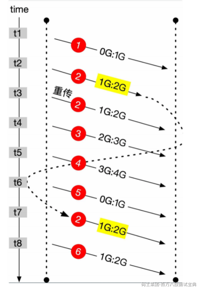

假设发送了 6 个数据包，每个数据包的⼤⼩为 1GB，第 5 个包序列号发⽣回绕。

第 2 个包因为某些原因延迟导致重传，但没有丢失到时间 t7 才到达。

这个迷途数据包与后⾯要发送的第 6 个包序列号完全相同，如果没有⼀些措施进⾏区分，将会造成数据

的紊乱。

有 Timestamps 的存在，迷途数据包与第 6 个包可以区分。如下图：

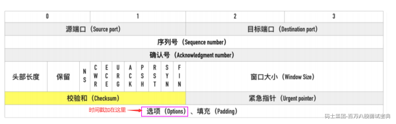

**丢弃重复数据：**

从 IP 网络层传输到 TCP 层的数据包可能会重复，TCP 层会丢弃重复的数据包。

**流量控制：**

TCP 发送端和接收端都有一个固定大小的缓冲空间，为了防止发送端发送数据的速度太快导致接收

端缓冲区溢出，发送端只能发送接收端可以接纳的数据，为了达到这种控制效果，TCP 用了流量控

制协议（可变大小的滑动窗口协议）来实现。

# 4、说说域名解析详细过程，以及你对DNS的理解

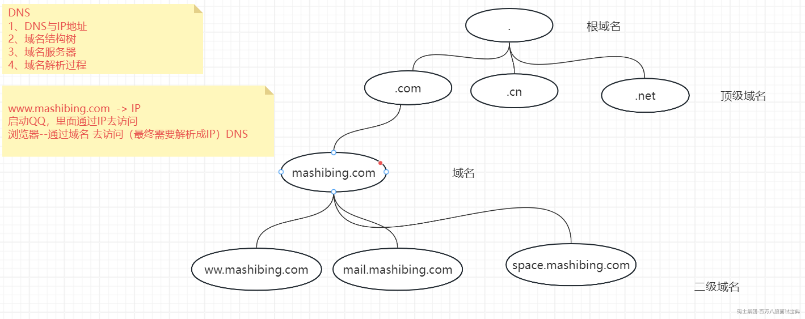

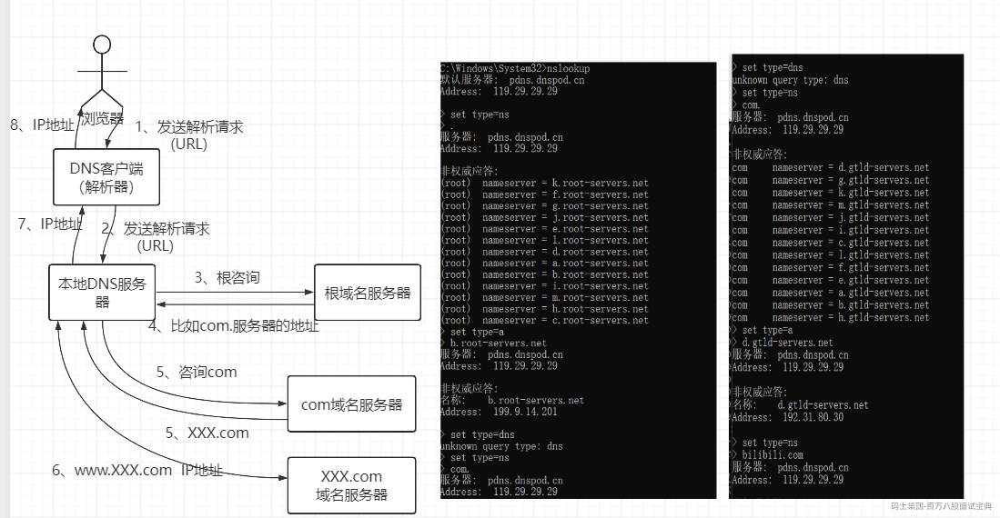

# 5、说一说TCP的滑动窗口机制

#### ***TCP缓冲区***

每个TCP的Socket的内核中都有一个发送缓冲区和一个接收缓冲区。现在我们假设用write()方法发送数据，使用 read()方法接收数据。

*(⚠️ 图片缺失:源知识库原图已失效)*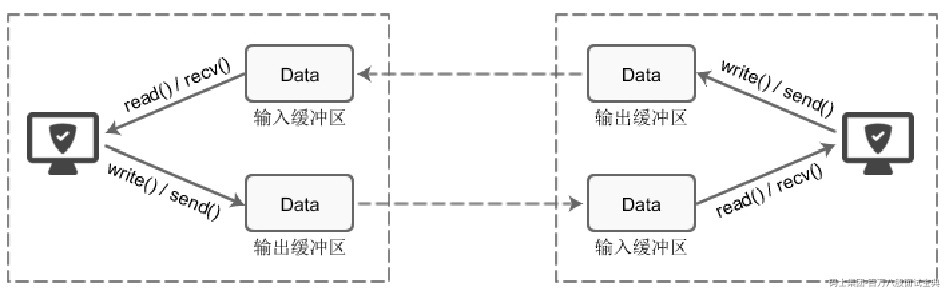

write()并不立即向网络中传输数据，而是先将数据写入缓冲区中，再由TCP协议将数据从缓冲区发送到目标机器。一旦将数据写入到缓冲区，函数就可以成功返回，不管它们有没有到达目标机器，也不管它们何时被发送到网络，这些都是TCP协议负责的事情。

TCP协议独立于 write()函数，数据有可能刚被写入缓冲区就发送到网络，也可能在缓冲区中不断积压，多次写入的数据被一次性发送到网络，这取决于当时的网络情况、当前线程是否空闲等诸多因素，不由程序员控制。

read()也是如此，也从输入缓冲区中读取数据，而不是直接从网络中读取。

总得来说，I/O缓冲区在每个TCP套接字中单独存在；I/O缓冲区在创建套接字时自动生成；

### **TCP 的可靠性**

在TCP 中，当发送端的数据到达接收主机时，接收端主机会返回一个已收到消息的通知。这个消息叫做确认应答（ACK）。当发送端将数据发出之后会等待对端的确认应答。如果有确认应答，说明数据已经成功到达对端。反之，则数据丢失的可能性很大。

在一定时间内没有等待到确认应答，发送端就可以认为数据已经丢失，并进行重发。由此，即使产生了丢包，仍然能够保证数据能够到达对端，实现可靠传输。

未收到确认应答并不意味着数据一定丢失。也有可能是数据对方已经收到，只是返回的确认应答在途中丢失。这种情况也会导致发送端误以为数据没有到达目的地而重发数据。

此外，也有可能因为一些其他原因导致确认应答延迟到达，在源主机重发数据以后才到达的情况也屡见不鲜。此时，源主机只要按照机制重发数据即可。

对于目标主机来说，反复收到相同的数据是不可取的。为了对上层应用提供可靠的传输，目标主机必须放弃重复的数据包。为此我们引入了序列号。

序列号是按照顺序给发送数据的每一个字节（8位字节）都标上号码的编号。接收端查询接收数据 TCP 首部中的序列号和数据的长度，将自己下一步应该接收的序列号作为确认应答返送回去。通过序列号和确认应答号，TCP 能够识别是否已经接收数据，又能够判断是否需要接收，从而实现可靠传输。

*(⚠️ 图片缺失:源知识库原图已失效)*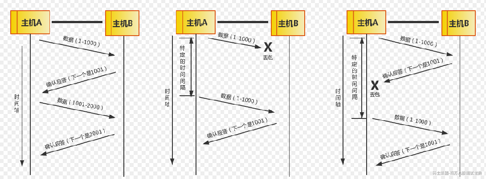

### TCP 的滑动窗口

发送方和接收方都会维护一个数据帧的序列，这个序列被称作窗口。发送方的窗口大小由接收方确认，目的是控制发送速度，以免接收方的缓存不够大导致溢出，同时控制流量也可以避免网络拥塞。

在TCP 的可靠性的图中，我们可以看到，发送方每发送一个数据接收方就要给发送方一个ACK对这个数据进行确认。只有接收了这个确认数据以后发送方才能传输下个数据。

存在的问题：如果窗口过小，当传输比较大的数据的时候需要不停的对数据进行确认，这个时候就会造成很大的延迟。

如果窗口过大，我们假设发送方一次发送100个数据，但接收方只能处理50个数据，这样每次都只对这50个数据进行确认。发送方下一次还是发送100个数据，但接受方还是只能处理50个数据。这样就避免了不必要的数据来拥塞我们的链路。

因此，我们引入了滑动窗口。滑动窗口通俗来讲就是一种流量控制技术。

它本质上是描述接收方的TCP数据报缓冲区大小的数据，发送方根据这个数据来计算自己最多能发送多长的数据，如果发送方收到接收方的窗口大小为0的TCP数据报，那么发送方将停止发送数据，等到接收方发送窗口大小不为0的数据报的到来。

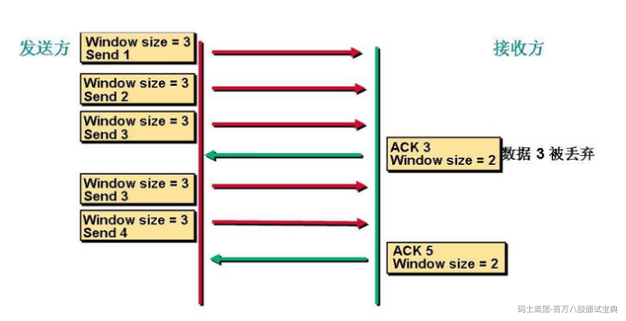

首先是第一次发送数据这个时候的窗口大小是根据链路带宽的大小来决定的。我们假设这个时候窗口的大小是3。这个时候接受方收到数据以后会对数据进行确认告诉发送方我下次希望手到的是数据是多少。这里我们看到接收方发送的ACK=3(这是发送方发送序列2的回答确认，下一次接收方期望接收到的是3序列信号)。这个时候发送方收到这个数据以后就知道我第一次发送的3个数据对方只收到了2个。就知道第3个数据对方没有收到。下次在发送的时候就从第3个数据开始发。

此时窗口大小变成了2 。

于是发送方发送2个数据。看到接收方发送的ACK是5就表示他下一次希望收到的数据是5，发送方就知道我刚才发送的2个数据对方收了这个时候开始发送第5个数据。

这就是滑动窗口的工作机制，当链路变好了或者变差了这个窗口还会发生变话，并不是第一次协商好了以后就永远不变了。

所以滑动窗口协议，是TCP使用的一种流量控制方法。该协议允许发送方在停止并等待确认前可以连续发送多个分组。由于发送方不必每发一个分组就停下来等待确认，因此该协议可以加速数据的传输。

只有在接收窗口向前滑动时（与此同时也发送了确认），发送窗口才有可能向前滑动。

收发两端的窗口按照以上规律不断地向前滑动，因此这种协议又称为滑动窗口协议。

**不过这里还要和TCP的重发和超时机制挂关系：**

1、在建立 TCP 连接的同时，也可以确定发送数据包的单位，我们也可以称其为 **“最大消息长度”（MSS，Max Segment Size）** ，也就是一个段

2、TCP 在传送大量数据时，是以 MSS 的大小将数据进行分割发送。进行重发时也是以 MSS 为单位

3、MSS 在三次握手的时候，在两端主机之间被计算得出。两端的主机在发出建立连接的请求时，会在 TCP 首部中写入 MSS 选项，告诉对方自己的接口能够适应的 MSS 的大小。然后会在两者之间选择一个较小的值投入使用

但是TCP 以1个段为单位，如果每发送一个段进行一次确认应答，才能进行下一次通信，那这样的传输方式有一个缺点，就是包的往返时间（RTT）越长通信性能就越低

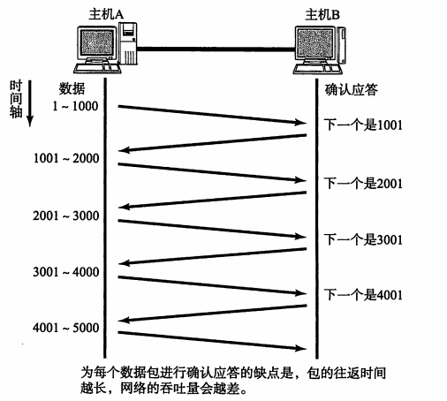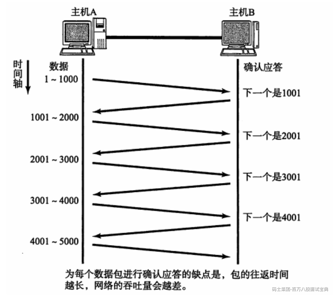

为解决这个问题，TCP 引入了**窗口**这个概念。 **确认应答不是以每个分段来确认，而是以更大的单位进行确认** ，转发时间将会被大幅地缩短。也就是说， **发送端主机，在发送了一个段以后不必要一直等待确认应答，而是继续发送** 。如下图所示

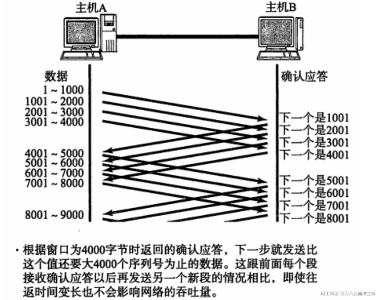

我们假设窗口大小是4000字节，主机A可以一口气发送把4000字节的序列号发送完毕。这个跟前面每个段接收ACK后才能继续发送新一个段的情况相比，即使RTT变长也不会影响网络的吞吐量。

窗口机制实现了使用了大量的缓冲区（Buffer，指的是计算机存储收发数据的的内存空间），通过对多个段同时进行确认应答的功能。

滑动窗口示意图如下：

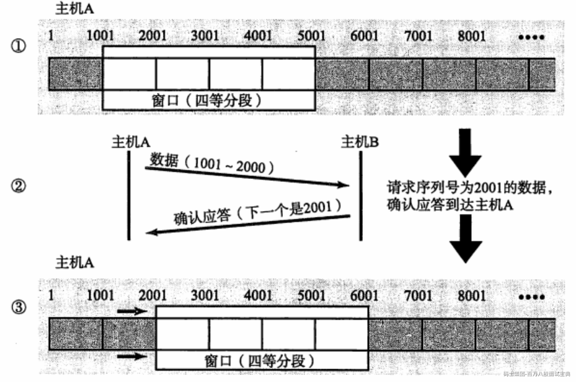

这个图一个段为1000字节，滑动窗口是4个段，在①的状态下，如果收到一个序列号为2000的ACK，那么2001 之前的数据就没必要重发了，这部分的数据可以被过滤掉，滑动窗口成为③的样子。

### 滑动窗口控制与重发控制

**1.确认应答ACK未能正确返回的情况**

在这种情况下，数据是已经被对端主机成功接收了的，是不需要进行重新发送的。  
然而，如果在没有使用窗口控制的前提下，没有收到确认应答包的数据包都会被重发。  
但是，在使用了窗口控制以后，就如下图所示，某些应答包即使丢失了也无需重发，这也提高了传输效率。

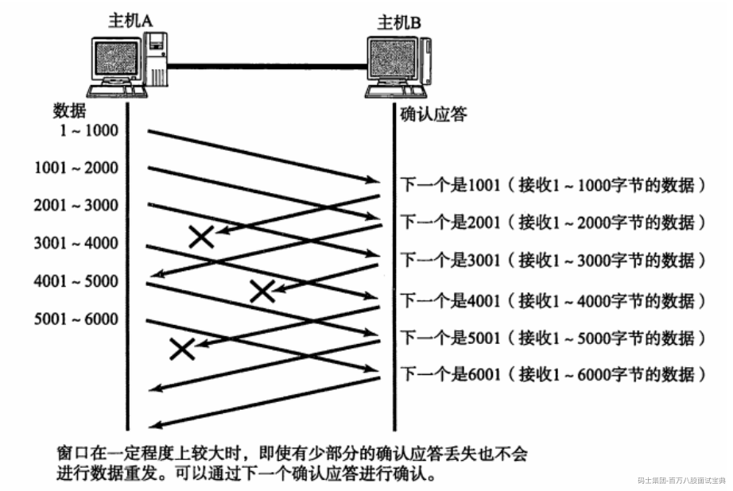

上图所示，一个段大小为1000字节，一个窗口大小为6000个字节的情况，主机A连续发送了6000序列号的数据，中间的主机B对1001的ACK丢失了，但是后面的2001的ACK正常返回了，说明前2000的序列号的数据都正常读取了，那么即使1001的ACK丢失也不需要进行数据重发！  
**所以在窗口控制的机制下，前面的ACK丢失，也能通过下一个ACK进行确认，提高了不少效率**

**2.某个报文丢失的情况**

如果当接收端主机接收到一个自己应该接收的序列号之外的数据包时，它会一直对当前接收到的数据包返回确认应答包。

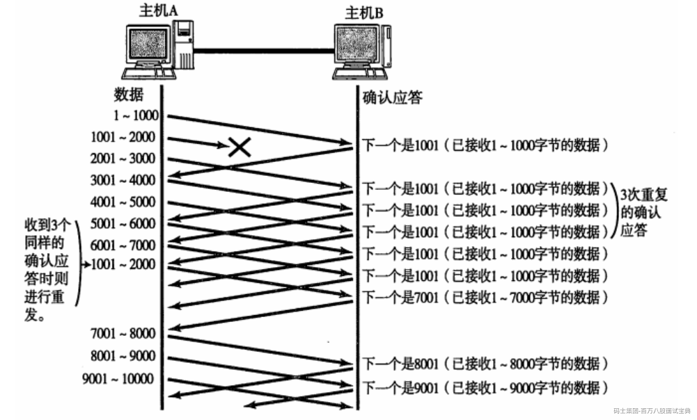

上图所示，主机A的1001-2000序列号的报文丢失了，它会一直收到来自主机B的一个1001的ACK，这个ACK就像在跟主机A提醒 “我想接收从1001开始的数据”。当主机A连续收到这个1001的确认应答ACK **3次**后，就会认为数据丢失了，需要重发。

在滑动窗口比较大的情况下，同一个序列号的确认应答将会被重复不断地返回。**而发送端主机如果 连续 3 次 接收到同一个确认应答包，就会将其对应的数据重发，这种机制比之前提到的“超时重发”更加高效，所以被称之为“高速重发控制”。**

# 6、如果要你来设计一个QQ，在网络协议上你会考虑如何设计

登陆采用TCP协议和HTTP协议，你和好友之间发送消息，主要采用UDP协议，内网传文件采用了P2P技术。总来的说：

1.登陆过程，客户端client 采用TCP协议向服务器server发送信息，HTTP协议下载信息。登陆之后，会有一个TCP连接来保持在线状态。

2.和好友发消息，客户端client采用UDP协议，但是需要通过服务器转发。腾讯为了确保传输消息的可靠，采用上层协议来保证可靠传输。如果消息发送失败，客户端会提示消息发送失败，并可重新发送。

这个协议是：TCPF 协议（本质是UDP协议）

3.如果是在内网里面的两个客户端传文件，QQ采用的是P2P技术，不需要服务器中转。

4、加密，在设计报文的时候，要做报文的加密处理，防止报文被窃取。

# 7、BIO阻塞，阻塞在哪里？

**阻塞在操作系统层面**

这些阻塞实际上是发生在操作系统层面的。当Java程序调用 `accept()`、`read()`或 `write()`等I/O操作时，它们会触发操作系统级别的I/O操作。如果I/O操作不能立即完成（如等待网络连接、磁盘I/O等），操作系统会将这些线程置于等待状态，直到I/O操作完成或发生异常。

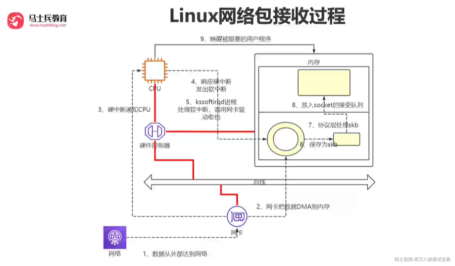

# 8、讲一讲Java中的NIO的实现

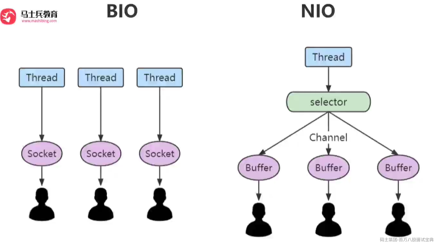

### 核心组件

1. **Buffers (**`java.nio.Buffer`**及其子类):**

- **作用:** NIO 操作数据的 **容器** 。所有数据读写都通过 Buffer 进行。

2. **Channels (**`java.nio.channels.Channel`**及其子类):**

- **作用:** 连接 I/O 源（如文件、套接字）的 **管道** 。代表一个开放的连接，可以进行数据的读写。

3. **Selectors (**`java.nio.channels.Selector`**):**

- **作用:** NIO 实现非阻塞和多路复用的 **核心** 。一个 Selector 可以监控多个 `SelectableChannel` 的状态（如“连接就绪”、“接受就绪”、“读就绪”、“写就绪”）。

- **工作原理:**

1. 将需要监控的 `SelectableChannel` 注册到 `Selector` 上，并指定感兴趣的**操作集** (`SelectionKey.OP_ACCEPT`, `OP_CONNECT`, `OP_READ`, `OP_WRITE`)。注册时返回一个 `SelectionKey` 对象，代表该 Channel 在 Selector 上的注册关系。

2. 调用 `Selector.select()` 或 `select(long timeout)` 或 `selectNow()` 方法。这些方法会 **阻塞** （或等待指定时间，或立即返回）直到至少有一个注册的 Channel 发生了其感兴趣的事件。

3. `select()` 返回后，调用 `selectedKeys()` 获取已就绪的 `SelectionKey` 集合。

4. 遍历 `selectedKeys()` 集合，对于每个 `SelectionKey`：

- 检查 `key.readyOps()` 确定具体就绪的事件类型（使用位操作，如 `(key.readyOps() & SelectionKey.OP_READ) != 0`）。

- 获取关联的 `Channel` (`key.channel()`) 和 `Selector` (`key.selector()`)，执行相应的 I/O 操作（如 `accept()`, `read()`, `write()`）。

- **非常重要:** 处理完一个 `SelectionKey` 后，需要将其从 `selectedKeys` 集合中**手动移除** (`iterator.remove()`)。否则下次 `select()` 返回时它还会在集合里。

5. 循环回到步骤 2，继续轮询。

# 9、什么是RPC，要点是什么？

RPC（Remote Procedure Call ——远程过程调用），它是一种通过网络从远程计算机程序上请求服务，而不需要了解底层网络的技术。

*(⚠️ 图片缺失:源知识库原图已失效)*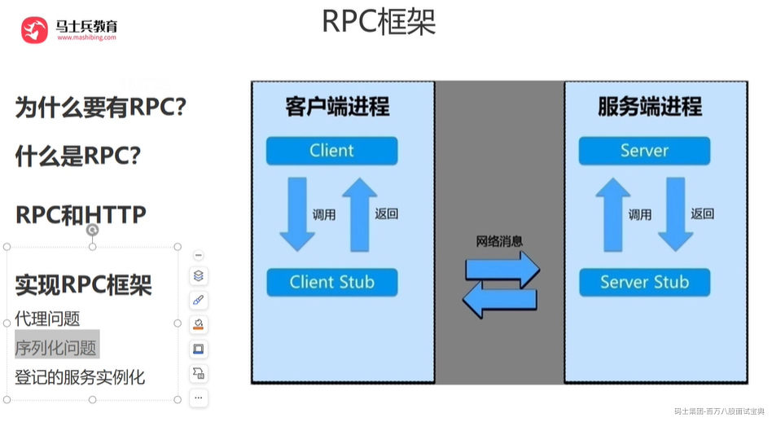

一次完整的RPC同步调用流程：

1）服务消费方（client）以本地调用方式调用客户端存根；

2）什么叫客户端存根？就是远程方法在本地的模拟对象，一样的也有方法名，也有方法参数，client stub接收到调用后负责将方法名、方法的参数等包装，并将包装后的信息通过网络发送到服务端；

3）服务端收到消息后，交给代理存根在服务器的部分后进行解码为实际的方法名和参数

4） server stub根据解码结果调用服务器上本地的实际服务；

5）本地服务执行并将结果返回给server stub；

6）server stub将返回结果打包成消息并发送至消费方；

7）client stub接收到消息，并进行解码；

8）服务消费方得到最终结果。

RPC框架的目标就是要中间步骤都封装起来，让我们进行远程方法调用的时候感觉到就像在本地调用一样。

#### RPC和HTTP？

rpc字面意思就是远程过程调用，只是对不同应用间相互调用的一种描述，一种思想。具体怎么调用？实现方式可以是最直接的tcp通信，也可以是http方式，在很多的消息中间件的技术书籍里，甚至还有使用消息中间件来实现RPC调用的，我们知道的dubbo是基于tcp通信的，gRPC是Google公布的开源软件，基于最新的HTTP2.0协议，底层使用到了Netty框架的支持。所以总结来说，rpc和http是完全两个不同层级的东西，他们之间并没有什么可比性。

#### ***实现RPC框架***

##### 实现RPC框架需要解决的那些问题

###### *代理问题*

代理本质上是要解决什么问题？要解决的是被调用的服务本质上是远程的服务，但是调用者不知道也不关心，调用者只要结果，具体的事情由代理的那个对象来负责这件事。既然是远程代理，当然是要用代理模式了。

代理(Proxy)是一种设计模式,即通过代理对象访问目标对象.这样做的好处是:可以在目标对象实现的基础上,增强额外的功能操作,即扩展目标对象的功能。那我们这里额外的功能操作是干什么，通过网络访问远程服务。

jdk的代理有两种实现方式：静态代理和动态代理。

###### *序列化问题*

序列化问题在计算机里具体是什么？我们的方法调用，有方法名，方法参数，这些可能是字符串，可能是我们自己定义的java的类，但是在网络上传输或者保存在硬盘的时候，网络或者硬盘并不认得什么字符串或者javabean，它只认得二进制的01串，怎么办？要进行序列化，网络传输后要进行实际调用，就要把二进制的01串变回我们实际的java的类，这个叫反序列化。java里已经为我们提供了相关的机制Serializable。

###### *通信问题*

我们在用序列化把东西变成了可以在网络上传输的二进制的01串，但具体如何通过网络传输？使用JDK为我们提供的BIO。

###### *登记的服务实例化*

登记的服务有可能在我们的系统中就是一个名字，怎么变成实际执行的对象实例，当然是使用反射机制。

反射机制是什么？

反射机制是在运行状态中，对于任意一个类，都能够知道这个类的所有属性和方法；对于任意一个对象，都能够调用它的任意一个方法和属性；这种动态获取的信息以及动态调用对象的方法的功能称为java语言的反射机制。

反射机制能做什么

反射机制主要提供了以下功能：

•在运行时判断任意一个对象所属的类；

•在运行时构造任意一个类的对象；

•在运行时判断任意一个类所具有的成员变量和方法；

•在运行时调用任意一个对象的方法；

•生成动态代理。

最后成型的代码参见工程ketang-v3-rpc

# 10、什么Netty？讲一下你对Netty的理解

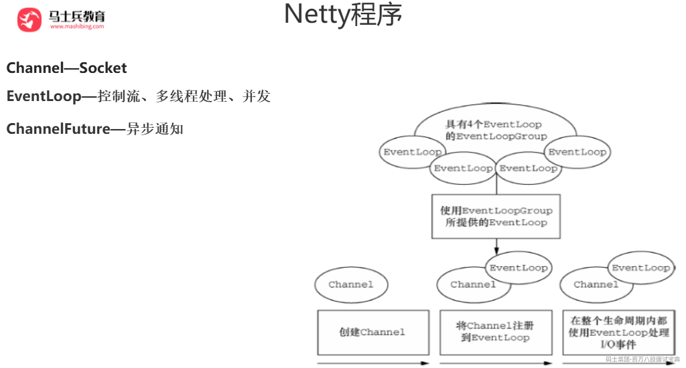

本质：网络应用程序框架

实现：异步、事件驱动

特性：高性能、可维护、快速开发

用途：开发服务器和客户端

Netty的性能很高，按照Facebook公司开发小组的测试表明，Netty最高能达到接近百万的吞吐。

## Netty程序

maven中引入4.1.25.Final的版本

```plain
 <dependency>
            <groupId>io.netty</groupId>

            <artifactId>netty-all</artifactId>

            <version>4.1.28.Final</version>

        </dependency>

```

代码如下：

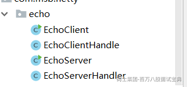

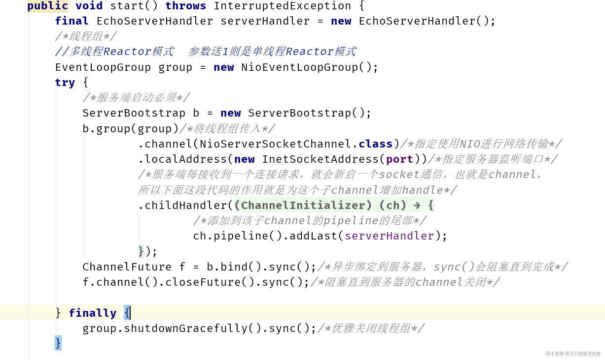

### 重要的类、方法解析

#### EventLoop

EventLoop暂时可以看成一个线程、EventLoopGroup自然就可以看成线程组。


网络编程里，“服务器”和“客户端”实际上表示了不同的网络行为；换句话说，是监听传入的连接还是建立到一个或者多个进程的连接。因此，有两种类型的引导：一种用于客户端（简单地称为Bootstrap），而另一种（ServerBootstrap）用于服务器。无论你的应用程序使用哪种协议或者处理哪种类型的数据，唯一决定它使用哪种引导类的是它是作为一个客户端还是作为一个服务器。

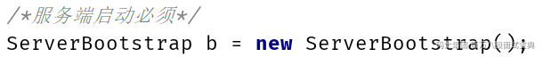

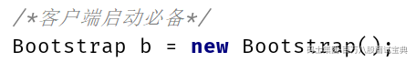

ServerBootstrap将绑定到一个端口，因为服务器必须要监听连接，而Bootstrap 则是由想要连接到远程节点的客户端应用程序所使用的。

引导一个客户端只需要一个EventLoopGroup，但是一个ServerBootstrap 则需要两个，因为服务器需要两组不同的Channel。第一组将只包含一个ServerChannel，代表服务器自身的已绑定到某个本地端口的正在监听的套接字。而第二组将包含所有已创建的用来处理传入客户端连接（对于每个服务器已经接受的连接都有一个）的Channel。

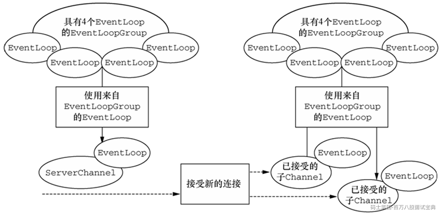

Channel 是Java NIO 的一个基本构造。

它代表一个到实体（如一个硬件设备、一个文件、一个网络套接字或者一个能够执行一个或者多个不同的I/O操作的程序组件）的开放连接，如读操作和写操作

目前，可以把Channel 看作是传入（入站）或者传出（出站）数据的载体。因此，它可以被打开或者被关闭，连接或者断开连接。

#### 事件和ChannelHandler、ChannelPipeline

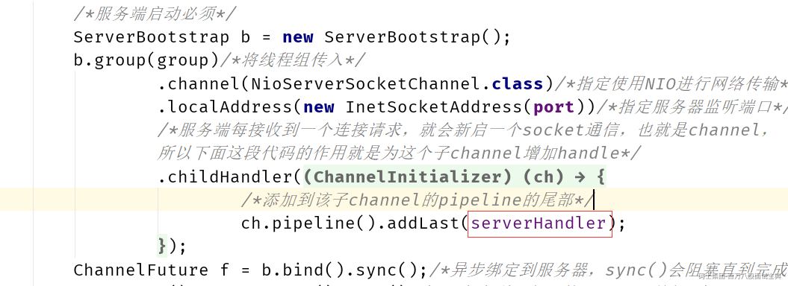

Netty 使用不同的事件来通知我们状态的改变或者是操作的状态。这使得我们能够基于已经发生的事件来触发适当的动作。

**可能由入站数据或者相关的状态更改而触发的事件包括：**

连接已被激活或者连接失活；数据读取；用户事件；错误事件。

**出站事件是未来将会触发的某个动作的操作结果，这些动作包括：**

打开或者关闭到远程节点的连接；将数据写到或者冲刷到套接字。

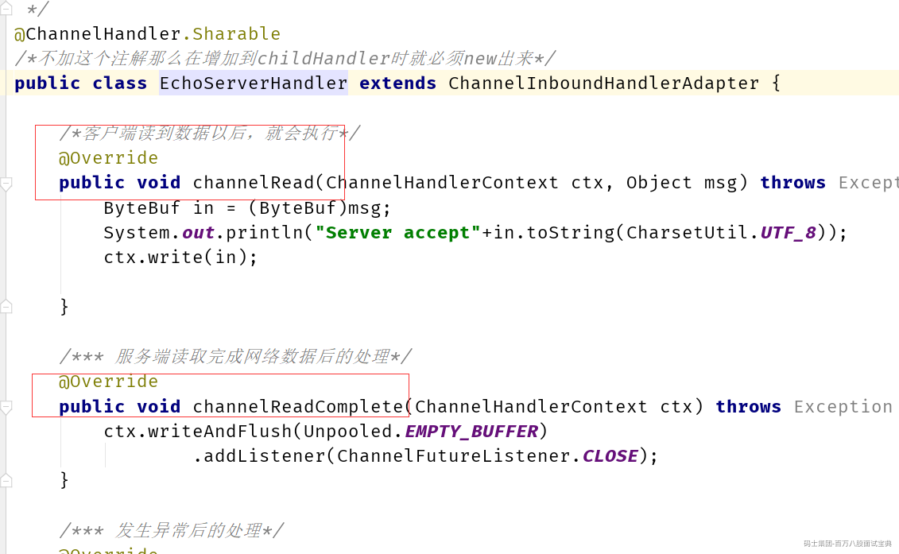

每个事件都可以被分发给ChannelHandler 类中的某个用户实现的方法。

Netty 提供了大量预定义的可以开箱即用的ChannelHandler 实现，包括用于各种协议（如HTTP 和SSL/TLS）的ChannelHandler。

#### ChannelFuture

Netty 中所有的I/O 操作都是异步的。

JDK 预置了interface java.util.concurrent.Future，Future 提供了一种在操作完成时通知应用程序的方式。这个对象可以看作是一个异步操作的结果的占位符；它将在未来的某个时刻完成，并提供对其结果的访问。但是其所提供的实现，只允许手动检查对应的操作是否已经完成，或者一直阻塞直到它完成。这是非常繁琐的，所以Netty提供了它自己的实现——ChannelFuture，用于在执行异步操作的时候使用。

**每个Netty 的出站I/O操作都将返回一个 ChannelFuture 。**

# **11、如何让单机下Netty支持百万长连接？**

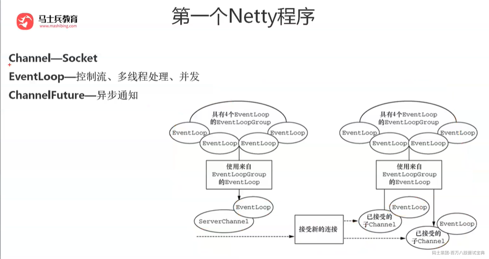

## 操作系统

首先就是要突破操作系统的限制。  
在Linux平台上，无论编写客户端程序还是服务端程序，在进行高并发TCP连接处理时，最高的并发数量都要受到系统对用户单一进程同时可打开文件数量的限制（这是因为系统为每个TCP连接都要创建一个socket句柄，每个socket句柄同时也是一个文件句柄）。  
可使用ulimit命令查看系统允许当前用户进程打开的文件数限制：

```plain
$ ulimit -n
1024
```

这表示当前用户的每个进程最多允许同时打开1024个文件，这1024个文件中还得除去每个进程必然打开的标准输入，标准输出，标准错误，服务器监听 socket,进程间通讯的unix域socket等文件，那么剩下的可用于客户端socket连接的文件数就只有大概1024-10=1014个左右。也就是说缺省情况下，基于Linux的通讯程序最多允许同时1014个TCP并发连接。  
  对于想支持更高数量的TCP并发连接的通讯处理程序，就必须修改Linux对当前用户的进程同时打开的文件数量。  
修改单个进程打开最大文件数限制的最简单的办法就是使用ulimit命令：

```plain
$ ulimit –n 1000000
```

如果系统回显类似于"Operation not permitted"之类的话，说明上述限制修改失败，实际上是因为在中指定的数值超过了Linux系统对该用户打开文件数的软限制或硬限制。因此，就需要修改Linux系统对用户的关于打开文件数的软限制和硬限制。  
软限制（soft limit）:是指Linux在当前系统能够承受的范围内进一步限制一个进程同时打开的文件数；  
硬限制（hardlimit）:是根据系统硬件资源状况（主要是系统内存）计算出来的系统最多可同时打开的文件数量。  
第一步，修改/etc/security/limits.conf文件，在文件中添加如下行：

```plain
　　* soft nofile 1000000
　　* hard nofile 1000000
　　'*'号表示修改所有用户的限制；
```

　　soft和hard为两种限制方式，其中soft表示警告的限制，hard表示真正限制，nofile表示打开的最大文件数。1000000则指定了想要修改的新的限制值，即最大打开文件数（请注意软限制值要小于或等于硬限制）。修改完后保存文件。  
第二步，修改/etc/pam.d/login文件，在文件中添加如下行：

```plain
　　session required /lib/security/pam_limits.so
```

这是告诉Linux在用户完成系统登录后，应该调用pam\_limits.so模块来设置系统对该用户可使用的各种资源数量的最大限制（包括用户可打开的最大文件数限制），而pam\_limits.so模块就会从/etc/security/limits.conf文件中读取配置来设置这些限制值。修改完后保存此文件。  
第三步，查看Linux系统级的最大打开文件数限制，使用如下命令：

```plain
　　[speng@as4 ~]$ cat /proc/sys/fs/file-max
　　12158
```

　　这表明这台Linux系统最多允许同时打开（即包含所有用户打开文件数总和）12158个文件，是Linux系统级硬限制，所有用户级的打开文件数限制都不应超过这个数值。如果没有特殊需要，不应该修改此限制，除非想为用户级打开文件数限制设置超过此限制的值。  
如何修改这个系统最大文件描述符的限制呢？修改sysctl.conf文件

```plain
vi /etc/sysctl.conf
 # 在末尾添加 
fs.file_max = 1000000
 # 立即生效 
sysctl -p
```

## Netty调

设置合理的线程数  
对于线程池的调优,主要集中在用于接收海量设备TCP连接、TLS握手的 Acceptor线程池( Netty通常叫 boss NioEventLoop Group)上,以及用于处理网络数据读写、心跳发送的1O工作线程池(Nety通常叫 work Nio EventLoop Group)上。  
对于Nety服务端,通常只需要启动一个监听端口用于端侧设备接入即可,但是如果服务端集群实例比较少,甚至是单机(或者双机冷备)部署,在端侧设备在短时间内大量接入时,需要对服务端的监听方式和线程模型做优化,以满足短时间内(例如30s)百万级的端侧设备接入的需要。  
服务端可以监听多个端口,利用主从 Reactor线程模型做接入优化,前端通过SLB做4层门7层负载均衡。  
主从 Reactor线程模型特点如下:服务端用于接收客户端连接的不再是一个单独的NO线程,而是一个独立的NIO线程池; Acceptor接收到客户端TCP连接请求并处理后(可能包含接入认证等),将新创建的 Socketchanne注册到I/O线程池(subReactor线程池)的某个IO线程,由它负责 Socketchannel的读写和编解码工作; Acceptor线程池仅用于客户端的登录、握手和安全认证等,一旦链路建立成功,就将链路注册到后端 sub reactor线程池的IO线程,由IO线程负责后续的IO操作。  
对于IO工作线程池的优化,可以先采用系统默认值(即CPU内核数×2)进行性能测试,在性能测试过程中采集IO线程的CPU占用大小,看是否存在瓶颈， 具体可以观察线程堆栈，如果连续采集几次进行对比,发现线程堆栈都停留在 Selectorlmpl. lockAndDoSelect，则说明IO线程比较空闲,无须对工作线程数做调整。  
如果发现IO线程的热点停留在读或者写操作,或者停留在 Channelhandler的执行处,则可以通过适当调大 Nio EventLoop线程的个数来提升网络的读写性能。

## 心跳优化

针对海量设备接入的服务端,心跳优化策略如下。  
(1)要能够及时检测失效的连接,并将其剔除,防止无效的连接句柄积压,导致OOM等问题  
(2)设置合理的心跳周期,防止心跳定时任务积压,造成频繁的老年代GC(新生代和老年代都有导致STW的GC,不过耗时差异较大),导致应用暂停  
(3)使用Nety提供的链路空闲检测机制,不要自己创建定时任务线程池,加重系统的负担,以及增加潜在的并发安全问题。  
当设备突然掉电、连接被防火墙挡住、长时间GC或者通信线程发生非预期异常时,会导致链路不可用且不易被及时发现。特别是如果异常发生在凌晨业务低谷期间,当早晨业务高峰期到来时,由于链路不可用会导致瞬间大批量业务失败或者超时,这将对系统的可靠性产生重大的威胁。  
从技术层面看,要解决链路的可靠性问题,必须周期性地对链路进行有效性检测。目前最流行和通用的做法就是心跳检测。心跳检测机制分为三个层面：  
(1)TCP层的心跳检测,即TCP的 Keep-Alive机制,它的作用域是整个TCP协议栈。  
(2)协议层的心跳检测,主要存在于长连接协议中,例如MQTT。  
(3)应用层的心跳检测,它主要由各业务产品通过约定方式定时给对方发送心跳消息实现。  
心跳检测的目的就是确认当前链路是否可用,对方是否活着并且能够正常接收和发送消息。作为高可靠的NIO框架,Nety也提供了心跳检测机制。  
**一般的心跳检测策略如下。**  
(1)连续N次心跳检测都没有收到对方的Pong应答消息或者Ping请求消息,则认为链路已经发生逻辑失效,这被称为心跳超时。  
(2)在读取和发送心跳消息的时候如果直接发生了IO异常,说明链路已经失效,这被称为心跳失败。无论发生心跳超时还是心跳失败,都需要关闭链路,由客户端发起重连操作,保证链路能够恢复正常。  
Nety提供了三种链路空闲检测机制,利用该机制可以轻松地实现心跳检测  
(1)读空闲,链路持续时间T没有读取到任何消息。  
(2)写空闲,链路持续时间T没有发送任何消息  
(3)读写空闲,链路持续时间T没有接收或者发送任何消息  
对于百万级的服务器，一般不建议很长的心跳周期和超时时长。

## 接收和发送缓冲区调优

在一些场景下,端侧设备会周期性地上报数据和发送心跳,单个链路的消息收发量并不大,针对此类场景,可以通过调小TCP的接收和发送缓冲区来降低单个TCP连接的资源占用率  
当然对于不同的应用场景,收发缓冲区的最优值可能不同,用户需要根据实际场景,结合性能测试数据进行针对性的调优

## 合理使用内存池

随着JVM虚拟机和JT即时编译技术的发展,对象的分配和回收是一个非常轻量级的工作。但是对于缓冲区 Buffer,情况却稍有不同,特别是堆外直接内存的分配和回收,是一个耗时的操作。  
为了尽量重用缓冲区,Nety提供了基于内存池的缓冲区重用机制。  
在百万级的情况下,需要为每个接入的端侧设备至少分配一个接收和发送ByteBuf缓冲区对象,采用传统的非池模式,每次消息读写都需要创建和释放 ByteBuf对象,如果有100万个连接,每秒上报一次数据或者心跳,就会有100万次/秒的 ByteBuf对象申请和释放,即便服务端的内存可以满足要求,GC的压力也会非常大。

以上问题最有效的解决方法就是使用内存池,每个 NioEventLoop线程处理N个链路,在线程内部,链路的处理是串行的。

假如A链路首先被处理,它会创建接收缓冲区等对象,待解码完成,构造的POJO对象被封装成任务后投递到后台的线程池中执行,然后接收缓冲区会被释放,每条消息的接收和处理都会重复接收缓冲区的创建和释放。如果使用内存池,则当A链路接收到新的数据报时,从 NioEventLoop的内存池中申请空闲的 ByteBuf,解码后调用 release将 ByteBuf释放到内存池中,供后续的B链路使用。  
Nety内存池从实现上可以分为两类:堆外直接内存和堆内存。由于 Byte Buf主要用于网络IO读写,因此采用堆外直接内存会减少一次从用户堆内存到内核态的字节数组拷贝,所以性能更高。由于 DirectByteBuf的创建成本比较高,因此如果使用 DirectByteBuf,则需要配合内存池使用,否则性价比可能还不如 Heap Byte。  
Netty默认的IO读写操作采用的都是内存池的堆外直接内存模式,如果用户需要额外使用 ByteBuf,建议也采用内存池方式;如果不涉及网络IO操作(只是纯粹的内存操作),可以使用堆内存池,这样内存的创建效率会更高一些。

## IO线程和业务线程分离

如果服务端不做复杂的业务逻辑操作,仅是简单的内存操作和消息转发,则可以通过调大 NioEventLoop工作线程池的方式,直接在IO线程中执行业务 Channelhandler,这样便减少了一次线程上下文切换,性能反而更高。  
如果有复杂的业务逻辑操作,则建议IO线程和业务线程分离,对于IO线程,由于互相之间不存在锁竞争,可以创建一个大的 NioEvent Loop Group线程组,所有 Channel都共享同一个线程池。  
对于后端的业务线程池,则建议创建多个小的业务线程池,线程池可以与IO线程绑定,这样既减少了锁竞争,又提升了后端的处理性能。

## 针对端侧并发连接数的流控

无论服务端的性能优化到多少,都需要考虑流控功能。当资源成为瓶颈,或者遇到端侧设备的大量接入,需要通过流控对系统做保护。流控的策略有很多种，比如针对端侧连接数的流控：  
在Nety中,可以非常方便地实现流控功能:新增一个FlowControlchannelhandler，然后添加到 ChannelPipeline靠前的位置,覆盖 channelActive()方法,创建TCP链路后,执行流控逻辑,如果达到流控阈值,则拒绝该连接,调用 ChannelHandler Context的 close(方法关闭连接。

# 12、讲一讲什么是零拷贝？

## **零拷贝**

### **什么是零拷贝?**

零拷贝(英语: Zero-copy) 技术是指计算机执行操作时，CPU不需要先将数据从某处内存复制到另一个特定区域。这种技术通常用于通过网络传输文件时节省CPU周期和内存带宽。

➢零拷贝技术可以减少数据拷贝和共享总线操作的次数，消除传输数据在存储器之间不必要的中间拷贝次数，从而有效地提高数据传输效率

➢零拷贝技术减少了用户进程地址空间和内核地址空间之间因为上:下文切换而带来的开销

可以看出没有说不需要拷贝，只是说减少冗余[不必要]的拷贝。

下面这些组件、框架中均使用了零拷贝技术：Kafka、Netty、Rocketmq、Nginx、Apache。

### **Linux的I/O机制与DMA**

在早期计算机中，用户进程需要读取磁盘数据，需要CPU中断和CPU参与，因此效率比较低，发起IO请求，每次的IO中断，都带来CPU的上下文切换。因此出现了——DMA。

DMA(Direct Memory Access，直接内存存取) 是所有现代电脑的重要特色，它允许不同速度的硬件装置来沟通，而不需要依赖于CPU 的大量中断负载。

DMA控制器，接管了数据读写请求，减少CPU的负担。这样一来，CPU能高效工作了。现代硬盘基本都支持DMA。

实际因此IO读取，涉及两个过程：

1、DMA等待数据准备好，把磁盘数据读取到操作系统内核缓冲区；

2、用户进程，将内核缓冲区的数据copy到用户空间。

这两个过程，都是阻塞的。

### **传统数据传送机制**

比如：读取文件，再用socket发送出去，实际经过四次copy。

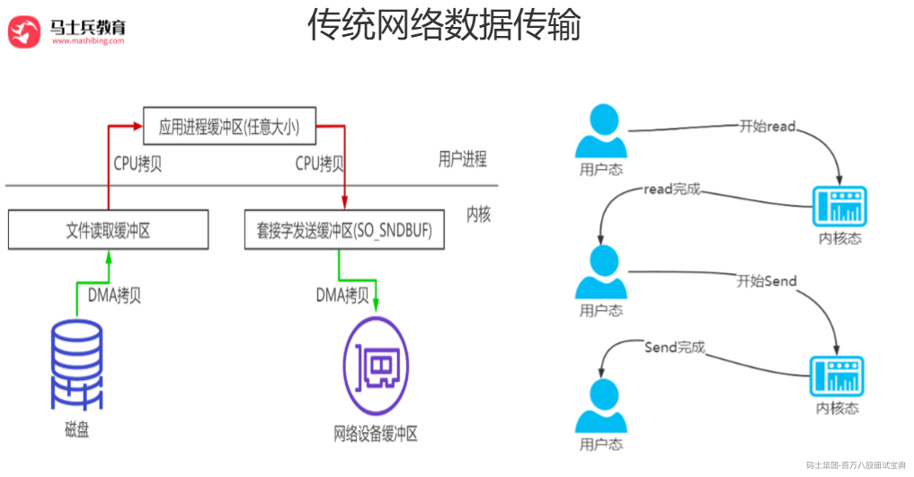

伪码实现如下：

buffer = File.read()

Socket.send(buffer)

1、第一次：将磁盘文件，读取到操作系统内核缓冲区；

2、第二次：将内核缓冲区的数据，copy到应用程序的buffer；

3、第三步：将application应用程序buffer中的数据，copy到socket网络发送缓冲区(属于操作系统内核的缓冲区)；

4、第四次：将socket buffer的数据，copy到网卡，由网卡进行网络传输。

*(⚠️ 图片缺失:源知识库原图已失效)*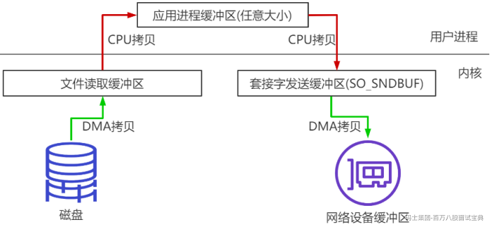

分析上述的过程，虽然引入DMA来接管CPU的中断请求，但四次copy是存在“不必要的拷贝”的。实际上并不需要第二个和第三个数据副本。应用程序除了缓存数据并将其传输回套接字缓冲区之外什么都不做。相反，数据可以直接从读缓冲区传输到套接字缓冲区。

显然，第二次和第三次数据copy 其实在这种场景下没有什么帮助反而带来开销，这也正是零拷贝出现的背景和意义。

同时，read和send都属于系统调用，每次调用都牵涉到两次上下文切换：

*(⚠️ 图片缺失:源知识库原图已失效)*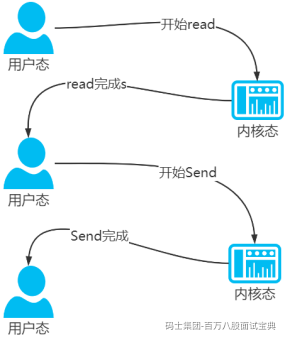

总结下，传统的数据传送所消耗的成本：4次拷贝，4次上下文切换。

4次拷贝，其中两次是DMA copy，两次是CPU copy。

### **Linux支持的(常见)零拷贝**

目的：减少IO流程中不必要的拷贝，当然零拷贝需要OS支持，也就是需要kernel暴露api。

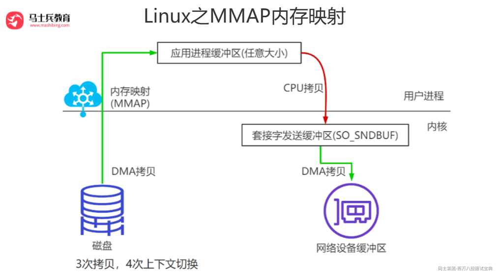

#### ***mmap内存映射***

硬盘上文件的位置和应用程序缓冲区(application buffers)进行映射（建立一种一一对应关系），由于mmap()将文件直接映射到用户空间，所以实际文件读取时根据这个映射关系，直接将文件从硬盘拷贝到用户空间，只进行了一次数据拷贝，不再有文件内容从硬盘拷贝到内核空间的一个缓冲区。

mmap内存映射将会经历：3次拷贝: 1次cpu copy，2次DMA copy；

以及4次上下文切换

*(⚠️ 图片缺失:源知识库原图已失效)*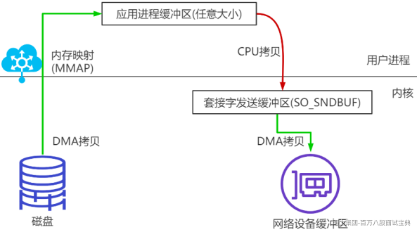

#### ***sendfile***

linux 2.1支持的sendfile

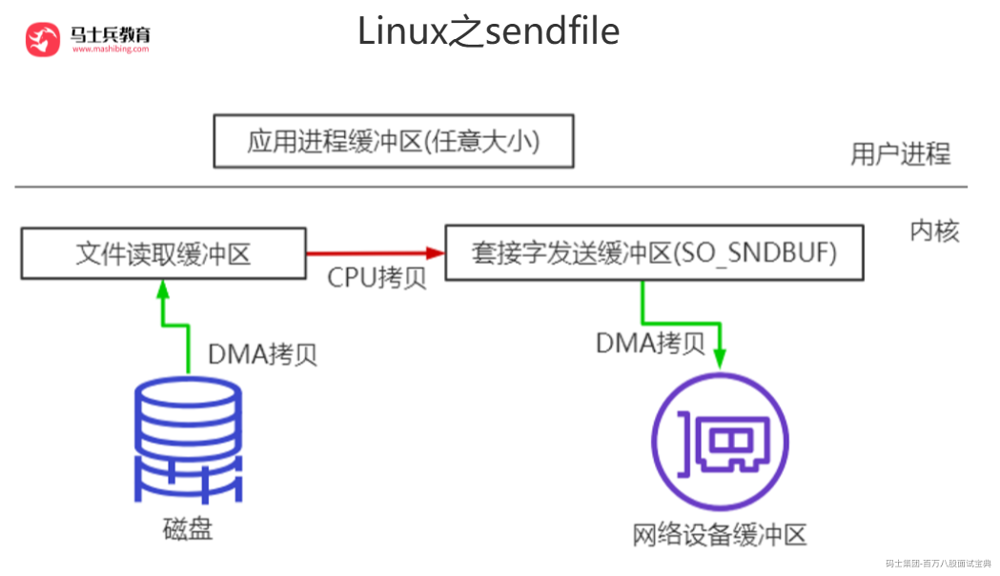

当调用sendfile()时，DMA将磁盘数据复制到kernel buffer，然后将内核中的kernel buffer直接拷贝到socket buffer。在硬件支持的情况下，甚至数据都并不需要被真正复制到socket关联的缓冲区内。取而代之的是，只有记录数据位置和长度的描述符被加入到socket缓冲区中，DMA模块将数据直接从内核缓冲区传递给协议引擎，从而消除了遗留的最后一次复制。

一旦数据全都拷贝到socket buffer，sendfile()系统调用将会return、代表数据转化的完成。socket buffer里的数据就能在网络传输了。

sendfile会经历：3次拷贝，1次CPU copy ，2次DMA copy；硬件支持的情况下，则是2次拷贝，0次CPU copy， 2次DMA copy。

以及2次上下文切换

*(⚠️ 图片缺失:源知识库原图已失效)*

#### ***splice***

Linux 从2.6.17 支持splice

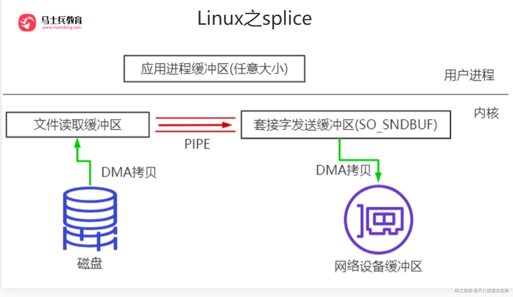

数据从磁盘读取到OS内核缓冲区后，在内核缓冲区直接可将其转成内核空间其他数据buffer，而不需要拷贝到用户空间。

如下图所示，从磁盘读取到内核buffer后，在内核空间直接与socket buffer建立pipe管道。

和sendfile()不同的是，splice()不需要硬件支持。

注意splice和sendfile的不同，sendfile是将磁盘数据加载到kernel buffer后，需要一次CPU copy，拷贝到socket buffer。而splice是更进一步，连这个CPU copy也不需要了，直接将两个内核空间的buffer进行pipe。

splice会经历 2次拷贝: 0次cpu copy 2次DMA copy；

以及2次上下文切换

*(⚠️ 图片缺失:源知识库原图已失效)*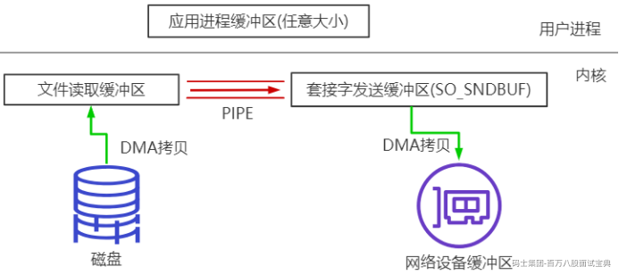

#### ***总结L****inux****中零拷贝***

最早的零拷贝定义，来源于

*Linux 2.4内核新增 sendfile 系统调用，提供了零拷贝。磁盘数据通过 DMA 拷贝到内核态 Buffer 后，直接通过 DMA 拷贝到 NI\***O* Buffer(socket buffer)，无需 CPU 拷贝。这也是零拷贝这一说法的来源。这是真正操作系统 意义上的零拷贝(也就是狭义零拷贝)。\*

但是我们知道，由OS内核提供的 操作系统意义上的零拷贝，发展到目前也并没有很多种，也就是这样的零拷贝并不是很多；

随着发展，零拷贝的概念得到了延伸，就是目前的减少不必要的数据拷贝都算作零拷贝的范畴。

### **Java生态圈中的零拷贝**

Linux提供的零拷贝技术 Java并不是全支持，支持2种(内存映射mmap、sendfile)；

#### ***NIO提供的内存映射 MappedByteBuffer***

NIO中的FileChannel.map()方法其实就是采用了操作系统中的内存映射方式，底层就是调用Linux mmap()实现的。

将内核缓冲区的内存和用户缓冲区的内存做了一个地址映射。这种方式适合读取大文件，同时也能对文件内容进行更改，但是如果其后要通过SocketChannel发送，还是需要CPU进行数据的拷贝。

#### ***NIO提供的sendfile***

Java NIO 中提供的 FileChannel 拥有 transferTo 和 transferFrom 两个方法，可直接把 FileChannel 中的数据拷贝到另外一个 Channel，或者直接把另外一个 Channel 中的数据拷贝到 FileChannel。该接口常被用于高效的网络 / 文件的数据传输和大文件拷贝。在操作系统支持的情况下，通过该方法传输数据并不需要将源数据从内核态拷贝到用户态，再从用户态拷贝到目标通道的内核态，同时也避免了两次用户态和内核态间的上下文切换，也即使用了“零拷贝”，所以其性能一般高于 Java IO 中提供的方法。

#### ***Kafka中的零拷贝***

Kafka两个重要过程都使用了零拷贝技术，且都是操作系统层面的狭义零拷贝，一是Producer生产的数据存到broker，二是 Consumer从broker读取数据。

Producer生产的数据持久化到broker，采用mmap文件映射，实现顺序的快速写入；

Customer从broker读取数据，采用sendfile，将磁盘文件读到OS内核缓冲区后，直接转到socket buffer进行网络发送。

#### ***Netty的零拷贝实现***

Netty 的零拷贝主要包含三个方面：

在网络通信上，Netty 的接收和发送 ByteBuffer 采用 DIRECT BUFFERS，使用堆外直接内存进行 Socket 读写，不需要进行字节缓冲区的二次拷贝。如果使用传统的堆内存（HEAP BUFFERS）进行 Socket 读写，JVM 会将堆内存 Buffer 拷贝一份到直接内存中，然后才写入 Socket 中。相比于堆外直接内存，消息在发送过程中多了一次缓冲区的内存拷贝。

在缓存操作上，Netty提供了CompositeByteBuf类，它可以将多个ByteBuf合并为一个逻辑上的ByteBuf，避免了各个ByteBuf之间的拷贝。

通过wrap操作，我们可以将byte[]数组、ByteBuf、 ByteBuffer 等包装成一个 Netty ByteBuf对象，进而避免了拷贝操作。

ByteBuf支持slice 操作，因此可以将ByteBuf分解为多个共享同一个存储区域的ByteBuf，避免了内存的拷贝。

# 13、讲一讲C10K问题和C10M问题？以及Java中如何解决？

随着互联网的发展，尤其是移动互联网时代的到来，服务端对高并发的要求越来越高，也就是我们需要高性能的网络服务器。

以 C10K 为代表，需要单机同时支持 1 万个并发连接，到现在互联网要求的单机要支持 1 千万并发连接 (C10M 问题。我们分析一下：

在Java中，基本我们说的线程（Thread）实际上应该叫作“用户线程”，而对应到操作系统，还有另外一种线程叫作“内核线程”。

用户线程和内核线程之间存在一对一的关系。

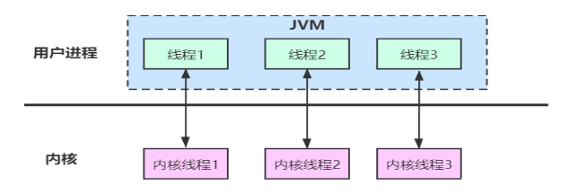

如果靠这种方式解决C10K或者C10M的问题有很大的问题:

1、创建成百上千个线程会导致过多的线程创建和上下文切换

2、过多的线程创建会导致栈空间占用非常大

在 JVM 中，缺省会为每个线程分配 1MB 的内存，1万个线程理论上需要消耗10 GB 的内存，1000万个线程理论上需要消耗10 TB 的内存。理论上讲服务器也没有这个资源。
