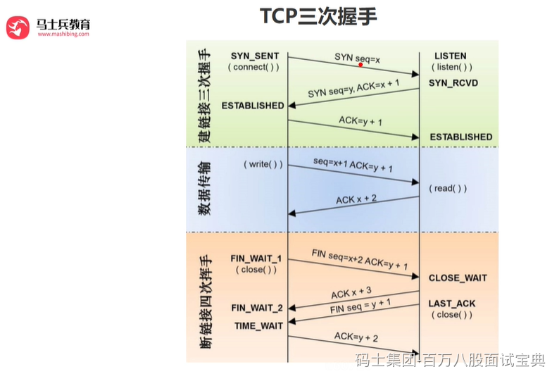

TCP是可靠的传输控制协议，而三次握手是保证数据可靠传输又能提高传输效率的最小次数。为什么？RFC793，也就是TCP的协议RFC中就谈到了原因，这是因为：

为了实现可靠数据传输，TCP协议的通信双方，都必须维护一个序列号， 以标识发送出去的数据包中，哪些是已经被对方收到的。

举例说明：发送方在发送数据包（假设大小为10 byte）时， 同时送上一个序号( 假设为 500)，那么接收方收到这个数据包以后， 就可以回复一个确认号（510 = 500 + 10） 告诉发送方 “我已经收到了你的数据包， 你可以发送下一个数据包， 序号从 511 开始” 。

三次握手的过程即是通信双方**相互告知**序列号起始值，并**确认对方**已经收到了序列号起始值的必经步骤。

如果只是两次握手，至多只有连接发起方的起始序列号能被确认，另一方选择的序列号则得不到确认。

至于为什么不是四次，很明显，三次握手后，通信的双方都已经知道了对方序列号起始值，也确认了对方知道自己序列号起始值，第四次握手已经毫无必要了。
