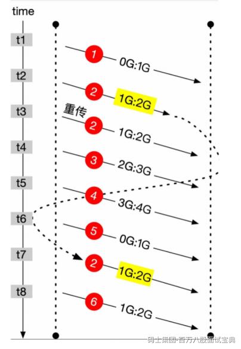
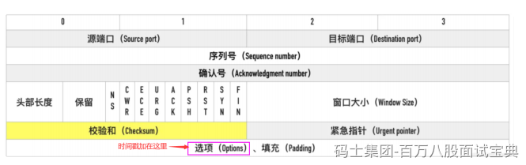

**序列号和确认号机制：**

TCP 发送端发送数据包的时候会选择一个 seq 序列号，接收端收到数据包后会检测数据包的完整

性，如果检测通过会响应一个 ack 确认号表示收到了数据包。

**超时重发机制：**

TCP 发送端发送了数据包后会启动一个定时器，如果一定时间没有收到接受端的确认后，将会重新

发送该数据包。

**对乱序数据包重新排序：**

从 IP 网络层传输到 TCP 层的数据包可能会乱序，TCP 层会对数据包重新排序再发给应用层。

TCP序号超过大小--发生回绕的问题，有timestamp时间戳，可以把回绕的数据和之前的数据区分出来。

TCP 的序列号⽤ 32bit 来表示，因此在 2^32 字节的数据传输后序列号就会溢出回绕。TCP 的窗⼝经过

窗⼝缩放可以最⾼到 1GB（2^30)，在⾼速⽹络中，序列号在很短的时间内就会被重复使⽤。

假设发送了 6 个数据包，每个数据包的⼤⼩为 1GB，第 5 个包序列号发⽣回绕。

第 2 个包因为某些原因延迟导致重传，但没有丢失到时间 t7 才到达。

这个迷途数据包与后⾯要发送的第 6 个包序列号完全相同，如果没有⼀些措施进⾏区分，将会造成数据

的紊乱。

有 Timestamps 的存在，迷途数据包与第 6 个包可以区分。如下图：

**丢弃重复数据：**

从 IP 网络层传输到 TCP 层的数据包可能会重复，TCP 层会丢弃重复的数据包。

**流量控制：**

TCP 发送端和接收端都有一个固定大小的缓冲空间，为了防止发送端发送数据的速度太快导致接收

端缓冲区溢出，发送端只能发送接收端可以接纳的数据，为了达到这种控制效果，TCP 用了流量控

制协议（可变大小的滑动窗口协议）来实现。
