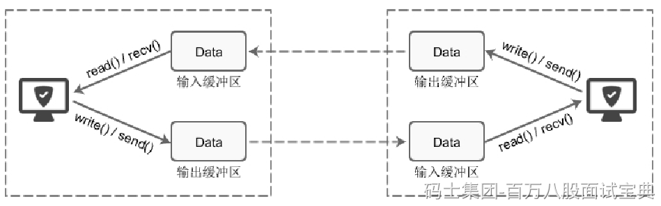
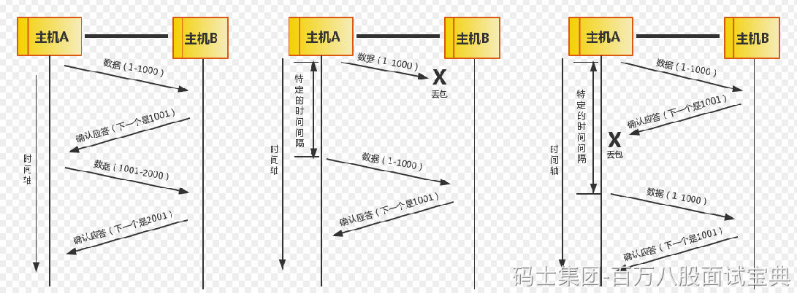
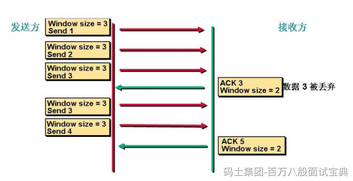
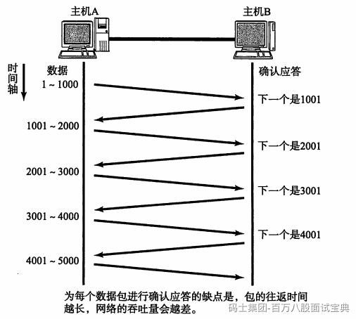
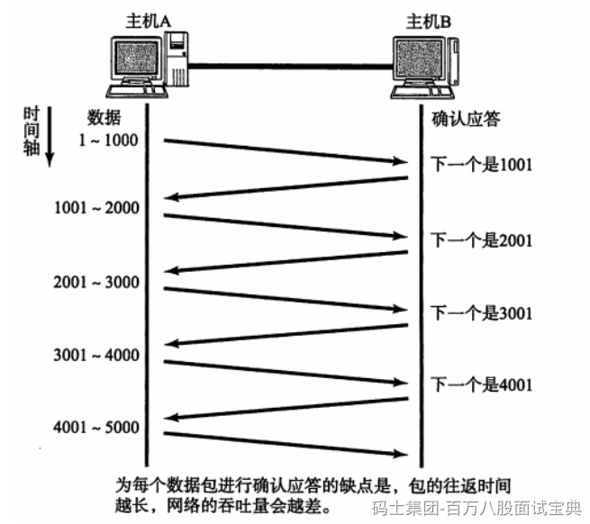
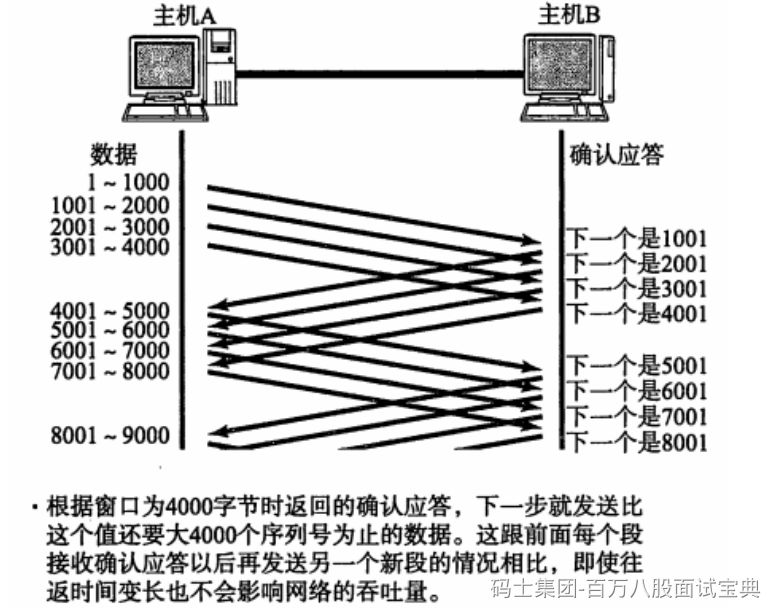
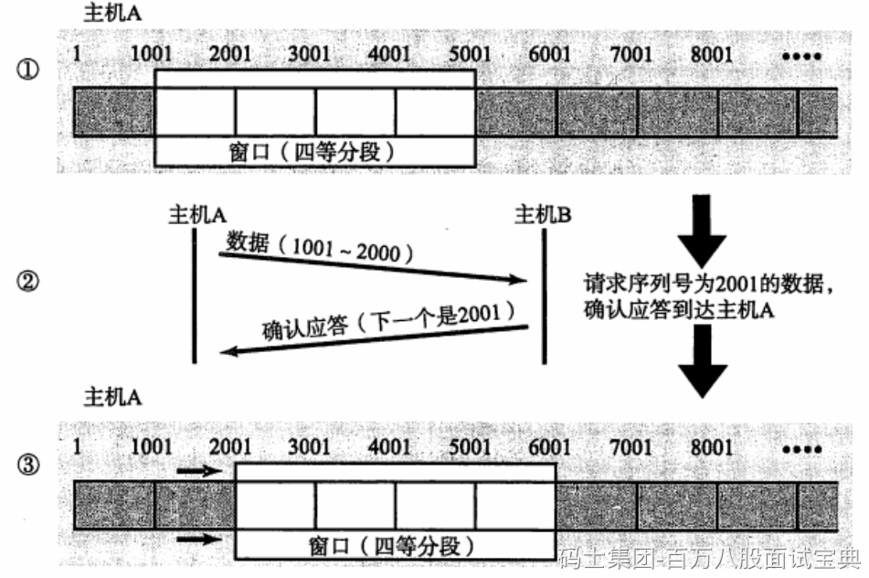
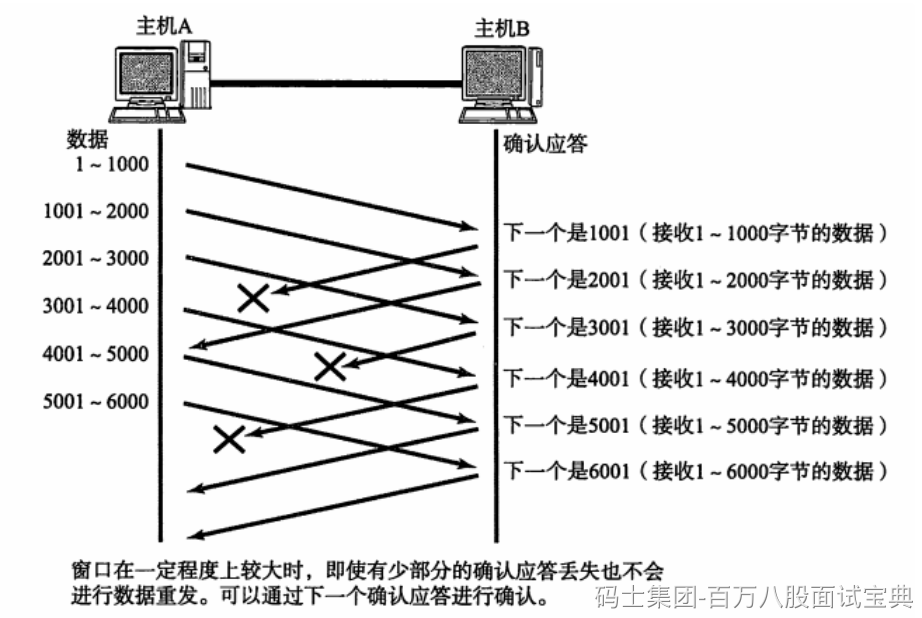
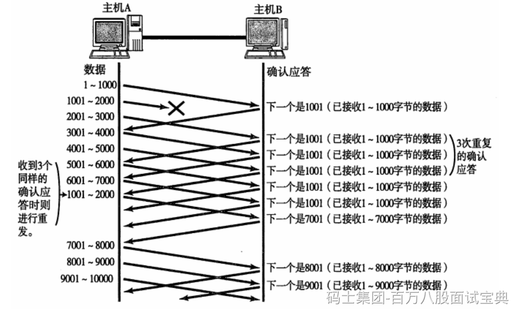

#### ***TCP缓冲区***

每个TCP的Socket的内核中都有一个发送缓冲区和一个接收缓冲区。现在我们假设用write()方法发送数据，使用 read()方法接收数据。

write()并不立即向网络中传输数据，而是先将数据写入缓冲区中，再由TCP协议将数据从缓冲区发送到目标机器。一旦将数据写入到缓冲区，函数就可以成功返回，不管它们有没有到达目标机器，也不管它们何时被发送到网络，这些都是TCP协议负责的事情。

TCP协议独立于 write()函数，数据有可能刚被写入缓冲区就发送到网络，也可能在缓冲区中不断积压，多次写入的数据被一次性发送到网络，这取决于当时的网络情况、当前线程是否空闲等诸多因素，不由程序员控制。

read()也是如此，也从输入缓冲区中读取数据，而不是直接从网络中读取。

总得来说，I/O缓冲区在每个TCP套接字中单独存在；I/O缓冲区在创建套接字时自动生成；

### **TCP 的可靠性**

在TCP 中，当发送端的数据到达接收主机时，接收端主机会返回一个已收到消息的通知。这个消息叫做确认应答（ACK）。当发送端将数据发出之后会等待对端的确认应答。如果有确认应答，说明数据已经成功到达对端。反之，则数据丢失的可能性很大。

在一定时间内没有等待到确认应答，发送端就可以认为数据已经丢失，并进行重发。由此，即使产生了丢包，仍然能够保证数据能够到达对端，实现可靠传输。

未收到确认应答并不意味着数据一定丢失。也有可能是数据对方已经收到，只是返回的确认应答在途中丢失。这种情况也会导致发送端误以为数据没有到达目的地而重发数据。

此外，也有可能因为一些其他原因导致确认应答延迟到达，在源主机重发数据以后才到达的情况也屡见不鲜。此时，源主机只要按照机制重发数据即可。

对于目标主机来说，反复收到相同的数据是不可取的。为了对上层应用提供可靠的传输，目标主机必须放弃重复的数据包。为此我们引入了序列号。

序列号是按照顺序给发送数据的每一个字节（8位字节）都标上号码的编号。接收端查询接收数据 TCP 首部中的序列号和数据的长度，将自己下一步应该接收的序列号作为确认应答返送回去。通过序列号和确认应答号，TCP 能够识别是否已经接收数据，又能够判断是否需要接收，从而实现可靠传输。

### TCP 的滑动窗口

发送方和接收方都会维护一个数据帧的序列，这个序列被称作窗口。发送方的窗口大小由接收方确认，目的是控制发送速度，以免接收方的缓存不够大导致溢出，同时控制流量也可以避免网络拥塞。

在TCP 的可靠性的图中，我们可以看到，发送方每发送一个数据接收方就要给发送方一个ACK对这个数据进行确认。只有接收了这个确认数据以后发送方才能传输下个数据。

存在的问题：如果窗口过小，当传输比较大的数据的时候需要不停的对数据进行确认，这个时候就会造成很大的延迟。

如果窗口过大，我们假设发送方一次发送100个数据，但接收方只能处理50个数据，这样每次都只对这50个数据进行确认。发送方下一次还是发送100个数据，但接受方还是只能处理50个数据。这样就避免了不必要的数据来拥塞我们的链路。

因此，我们引入了滑动窗口。滑动窗口通俗来讲就是一种流量控制技术。

它本质上是描述接收方的TCP数据报缓冲区大小的数据，发送方根据这个数据来计算自己最多能发送多长的数据，如果发送方收到接收方的窗口大小为0的TCP数据报，那么发送方将停止发送数据，等到接收方发送窗口大小不为0的数据报的到来。

首先是第一次发送数据这个时候的窗口大小是根据链路带宽的大小来决定的。我们假设这个时候窗口的大小是3。这个时候接受方收到数据以后会对数据进行确认告诉发送方我下次希望手到的是数据是多少。这里我们看到接收方发送的ACK=3(这是发送方发送序列2的回答确认，下一次接收方期望接收到的是3序列信号)。这个时候发送方收到这个数据以后就知道我第一次发送的3个数据对方只收到了2个。就知道第3个数据对方没有收到。下次在发送的时候就从第3个数据开始发。

此时窗口大小变成了2 。

于是发送方发送2个数据。看到接收方发送的ACK是5就表示他下一次希望收到的数据是5，发送方就知道我刚才发送的2个数据对方收了这个时候开始发送第5个数据。

这就是滑动窗口的工作机制，当链路变好了或者变差了这个窗口还会发生变话，并不是第一次协商好了以后就永远不变了。

所以滑动窗口协议，是TCP使用的一种流量控制方法。该协议允许发送方在停止并等待确认前可以连续发送多个分组。由于发送方不必每发一个分组就停下来等待确认，因此该协议可以加速数据的传输。

只有在接收窗口向前滑动时（与此同时也发送了确认），发送窗口才有可能向前滑动。

收发两端的窗口按照以上规律不断地向前滑动，因此这种协议又称为滑动窗口协议。

**不过这里还要和TCP的重发和超时机制挂关系：**

1、在建立 TCP 连接的同时，也可以确定发送数据包的单位，我们也可以称其为 **“最大消息长度”（MSS，Max Segment Size）** ，也就是一个段

2、TCP 在传送大量数据时，是以 MSS 的大小将数据进行分割发送。进行重发时也是以 MSS 为单位

3、MSS 在三次握手的时候，在两端主机之间被计算得出。两端的主机在发出建立连接的请求时，会在 TCP 首部中写入 MSS 选项，告诉对方自己的接口能够适应的 MSS 的大小。然后会在两者之间选择一个较小的值投入使用

但是TCP 以1个段为单位，如果每发送一个段进行一次确认应答，才能进行下一次通信，那这样的传输方式有一个缺点，就是包的往返时间（RTT）越长通信性能就越低

为解决这个问题，TCP 引入了**窗口**这个概念。 **确认应答不是以每个分段来确认，而是以更大的单位进行确认** ，转发时间将会被大幅地缩短。也就是说， **发送端主机，在发送了一个段以后不必要一直等待确认应答，而是继续发送** 。如下图所示

我们假设窗口大小是4000字节，主机A可以一口气发送把4000字节的序列号发送完毕。这个跟前面每个段接收ACK后才能继续发送新一个段的情况相比，即使RTT变长也不会影响网络的吞吐量。

窗口机制实现了使用了大量的缓冲区（Buffer，指的是计算机存储收发数据的的内存空间），通过对多个段同时进行确认应答的功能。

滑动窗口示意图如下：

这个图一个段为1000字节，滑动窗口是4个段，在①的状态下，如果收到一个序列号为2000的ACK，那么2001 之前的数据就没必要重发了，这部分的数据可以被过滤掉，滑动窗口成为③的样子。

### 滑动窗口控制与重发控制

**1.确认应答ACK未能正确返回的情况**

在这种情况下，数据是已经被对端主机成功接收了的，是不需要进行重新发送的。然而，如果在没有使用窗口控制的前提下，没有收到确认应答包的数据包都会被重发。但是，在使用了窗口控制以后，就如下图所示，某些应答包即使丢失了也无需重发，这也提高了传输效率。

上图所示，一个段大小为1000字节，一个窗口大小为6000个字节的情况，主机A连续发送了6000序列号的数据，中间的主机B对1001的ACK丢失了，但是后面的2001的ACK正常返回了，说明前2000的序列号的数据都正常读取了，那么即使1001的ACK丢失也不需要进行数据重发！**所以在窗口控制的机制下，前面的ACK丢失，也能通过下一个ACK进行确认，提高了不少效率**

**2.某个报文丢失的情况**

如果当接收端主机接收到一个自己应该接收的序列号之外的数据包时，它会一直对当前接收到的数据包返回确认应答包。

上图所示，主机A的1001-2000序列号的报文丢失了，它会一直收到来自主机B的一个1001的ACK，这个ACK就像在跟主机A提醒 “我想接收从1001开始的数据”。当主机A连续收到这个1001的确认应答ACK **3次**后，就会认为数据丢失了，需要重发。

在滑动窗口比较大的情况下，同一个序列号的确认应答将会被重复不断地返回。**而发送端主机如果 连续 3 次 接收到同一个确认应答包，就会将其对应的数据重发，这种机制比之前提到的“超时重发”更加高效，所以被称之为“高速重发控制”。**
