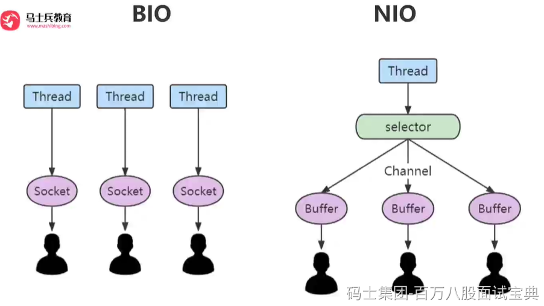

### 核心组件

1. **Buffers (**`java.nio.Buffer`**及其子类):**

- **作用:** NIO 操作数据的 **容器** 。所有数据读写都通过 Buffer 进行。

2. **Channels (**`java.nio.channels.Channel`**及其子类):**

- **作用:** 连接 I/O 源（如文件、套接字）的 **管道** 。代表一个开放的连接，可以进行数据的读写。

3. **Selectors (**`java.nio.channels.Selector`**):**

- **作用:** NIO 实现非阻塞和多路复用的 **核心** 。一个 Selector 可以监控多个 `SelectableChannel` 的状态（如“连接就绪”、“接受就绪”、“读就绪”、“写就绪”）。
- **工作原理:**

1. 将需要监控的 `SelectableChannel` 注册到 `Selector` 上，并指定感兴趣的**操作集** (`SelectionKey.OP_ACCEPT`, `OP_CONNECT`, `OP_READ`, `OP_WRITE`)。注册时返回一个 `SelectionKey` 对象，代表该 Channel 在 Selector 上的注册关系。
2. 调用 `Selector.select()` 或 `select(long timeout)` 或 `selectNow()` 方法。这些方法会 **阻塞** （或等待指定时间，或立即返回）直到至少有一个注册的 Channel 发生了其感兴趣的事件。
3. `select()` 返回后，调用 `selectedKeys()` 获取已就绪的 `SelectionKey` 集合。
4. 遍历 `selectedKeys()` 集合，对于每个 `SelectionKey`：

- 检查 `key.readyOps()` 确定具体就绪的事件类型（使用位操作，如 `(key.readyOps() & SelectionKey.OP_READ) != 0`）。
- 获取关联的 `Channel` (`key.channel()`) 和 `Selector` (`key.selector()`)，执行相应的 I/O 操作（如 `accept()`, `read()`, `write()`）。
- **非常重要:** 处理完一个 `SelectionKey` 后，需要将其从 `selectedKeys` 集合中**手动移除** (`iterator.remove()`)。否则下次 `select()` 返回时它还会在集合里。

5. 循环回到步骤 2，继续轮询。
