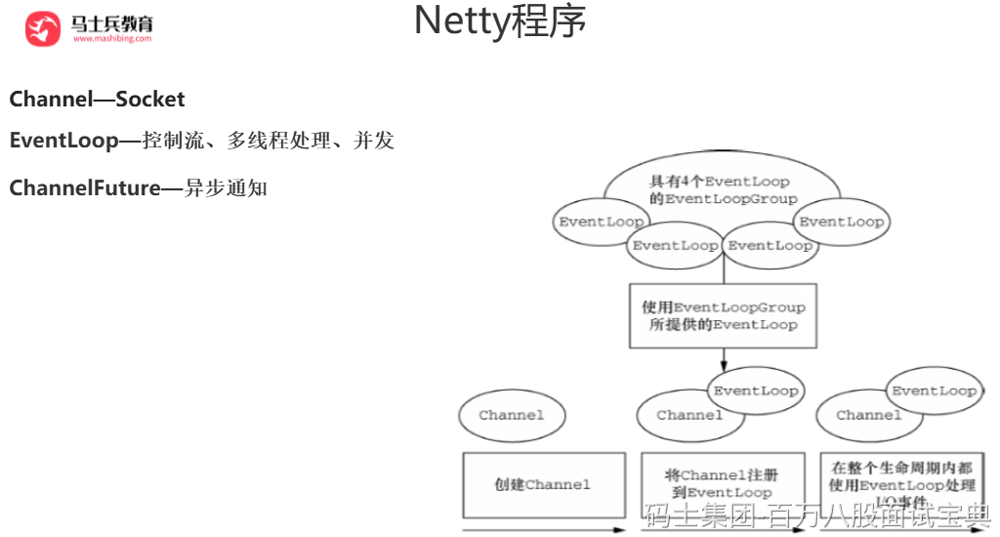
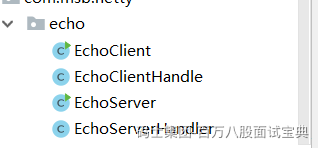
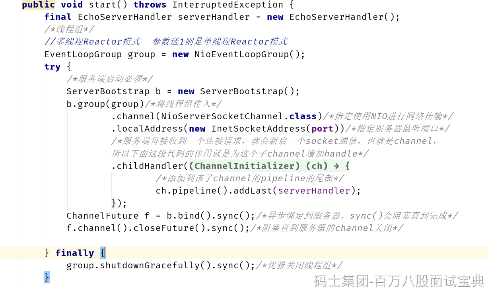
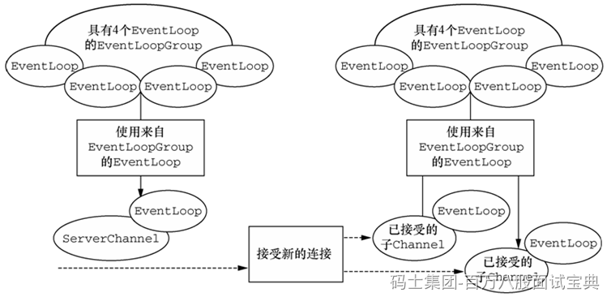
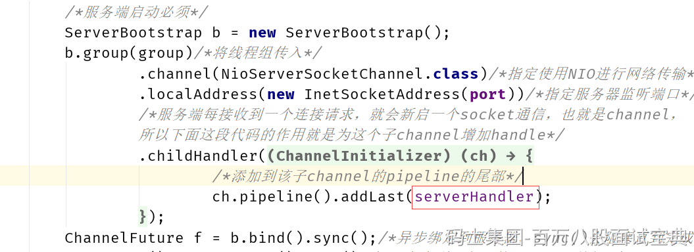
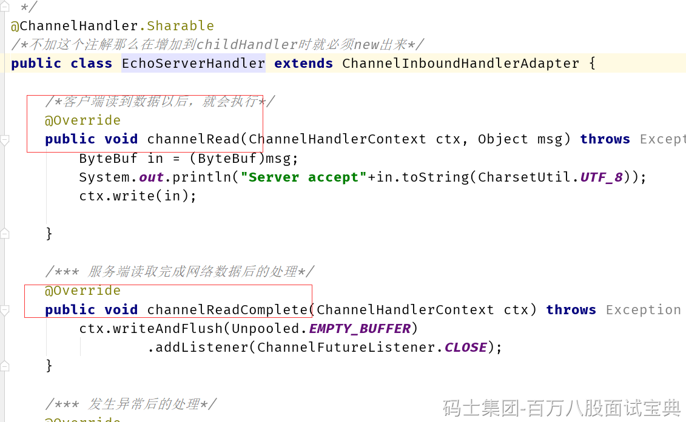

本质：网络应用程序框架

实现：异步、事件驱动

特性：高性能、可维护、快速开发

用途：开发服务器和客户端

Netty的性能很高，按照Facebook公司开发小组的测试表明，Netty最高能达到接近百万的吞吐。

## Netty程序

maven中引入4.1.25.Final的版本

```plain
<dependency>
            <groupId>io.netty</groupId>
            <artifactId>netty-all</artifactId>
            <version>4.1.28.Final</version>
        </dependency>
```

代码如下：





### 重要的类、方法解析

#### EventLoop

EventLoop暂时可以看成一个线程、EventLoopGroup自然就可以看成线程组。


网络编程里，“服务器”和“客户端”实际上表示了不同的网络行为；换句话说，是监听传入的连接还是建立到一个或者多个进程的连接。因此，有两种类型的引导：一种用于客户端（简单地称为Bootstrap），而另一种（ServerBootstrap）用于服务器。无论你的应用程序使用哪种协议或者处理哪种类型的数据，唯一决定它使用哪种引导类的是它是作为一个客户端还是作为一个服务器。


ServerBootstrap将绑定到一个端口，因为服务器必须要监听连接，而Bootstrap 则是由想要连接到远程节点的客户端应用程序所使用的。

引导一个客户端只需要一个EventLoopGroup，但是一个ServerBootstrap 则需要两个，因为服务器需要两组不同的Channel。第一组将只包含一个ServerChannel，代表服务器自身的已绑定到某个本地端口的正在监听的套接字。而第二组将包含所有已创建的用来处理传入客户端连接（对于每个服务器已经接受的连接都有一个）的Channel。



Channel 是Java NIO 的一个基本构造。

它代表一个到实体（如一个硬件设备、一个文件、一个网络套接字或者一个能够执行一个或者多个不同的I/O操作的程序组件）的开放连接，如读操作和写操作

目前，可以把Channel 看作是传入（入站）或者传出（出站）数据的载体。因此，它可以被打开或者被关闭，连接或者断开连接。

#### 事件和ChannelHandler、ChannelPipeline



Netty 使用不同的事件来通知我们状态的改变或者是操作的状态。这使得我们能够基于已经发生的事件来触发适当的动作。

**可能由入站数据或者相关的状态更改而触发的事件包括：**

连接已被激活或者连接失活；数据读取；用户事件；错误事件。

**出站事件是未来将会触发的某个动作的操作结果，这些动作包括：**

打开或者关闭到远程节点的连接；将数据写到或者冲刷到套接字。


