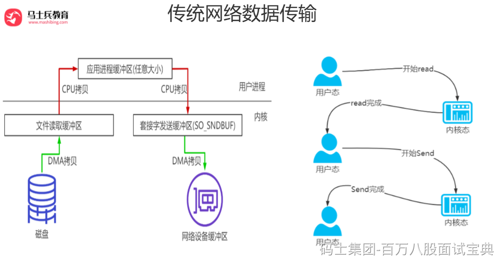
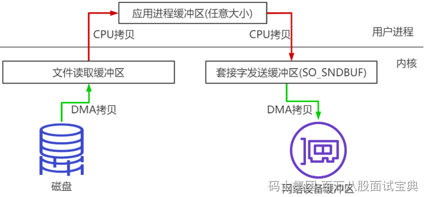
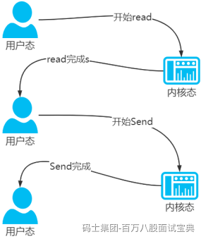
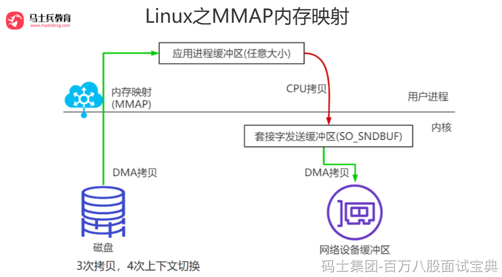
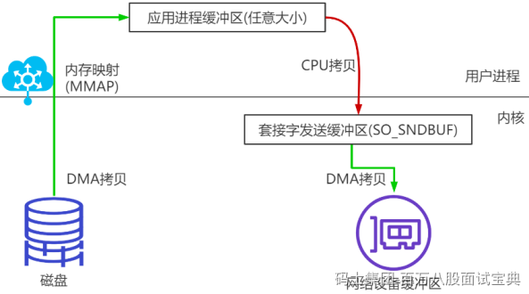
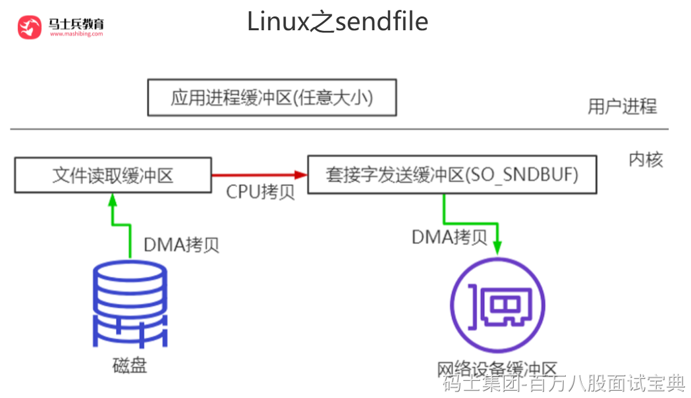
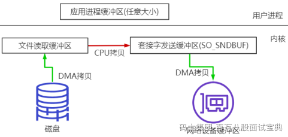
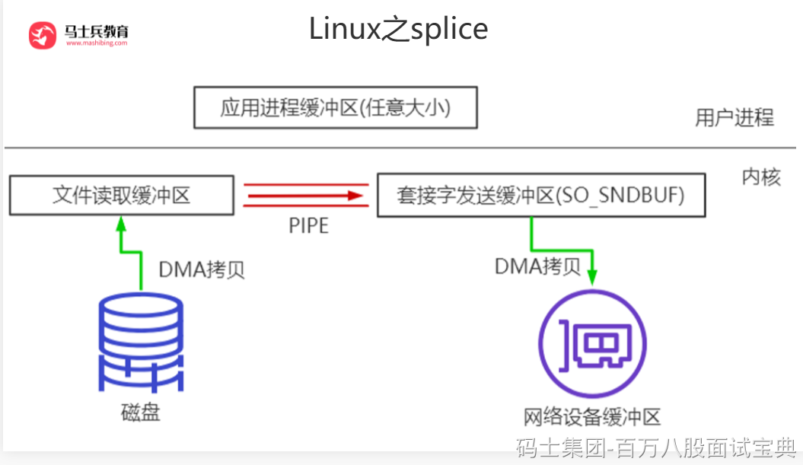
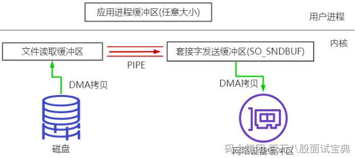

## **零拷贝**

### **什么是零拷贝?**

零拷贝(英语: Zero-copy) 技术是指计算机执行操作时，CPU不需要先将数据从某处内存复制到另一个特定区域。这种技术通常用于通过网络传输文件时节省CPU周期和内存带宽。

➢零拷贝技术可以减少数据拷贝和共享总线操作的次数，消除传输数据在存储器之间不必要的中间拷贝次数，从而有效地提高数据传输效率

➢零拷贝技术减少了用户进程地址空间和内核地址空间之间因为上:下文切换而带来的开销

可以看出没有说不需要拷贝，只是说减少冗余[不必要]的拷贝。

下面这些组件、框架中均使用了零拷贝技术：Kafka、Netty、Rocketmq、Nginx、Apache。

### **Linux的I/O机制与DMA**

在早期计算机中，用户进程需要读取磁盘数据，需要CPU中断和CPU参与，因此效率比较低，发起IO请求，每次的IO中断，都带来CPU的上下文切换。因此出现了——DMA。

DMA(Direct Memory Access，直接内存存取) 是所有现代电脑的重要特色，它允许不同速度的硬件装置来沟通，而不需要依赖于CPU 的大量中断负载。

DMA控制器，接管了数据读写请求，减少CPU的负担。这样一来，CPU能高效工作了。现代硬盘基本都支持DMA。

实际因此IO读取，涉及两个过程：

1、DMA等待数据准备好，把磁盘数据读取到操作系统内核缓冲区；

2、用户进程，将内核缓冲区的数据copy到用户空间。

这两个过程，都是阻塞的。

### **传统数据传送机制**

比如：读取文件，再用socket发送出去，实际经过四次copy。

伪码实现如下：

buffer = File.read()

Socket.send(buffer)

1、第一次：将磁盘文件，读取到操作系统内核缓冲区；

2、第二次：将内核缓冲区的数据，copy到应用程序的buffer；

3、第三步：将application应用程序buffer中的数据，copy到socket网络发送缓冲区(属于操作系统内核的缓冲区)；

4、第四次：将socket buffer的数据，copy到网卡，由网卡进行网络传输。

分析上述的过程，虽然引入DMA来接管CPU的中断请求，但四次copy是存在“不必要的拷贝”的。实际上并不需要第二个和第三个数据副本。应用程序除了缓存数据并将其传输回套接字缓冲区之外什么都不做。相反，数据可以直接从读缓冲区传输到套接字缓冲区。

显然，第二次和第三次数据copy 其实在这种场景下没有什么帮助反而带来开销，这也正是零拷贝出现的背景和意义。

同时，read和send都属于系统调用，每次调用都牵涉到两次上下文切换：

总结下，传统的数据传送所消耗的成本：4次拷贝，4次上下文切换。

4次拷贝，其中两次是DMA copy，两次是CPU copy。

### **Linux支持的(常见)零拷贝**

目的：减少IO流程中不必要的拷贝，当然零拷贝需要OS支持，也就是需要kernel暴露api。

#### ***mmap内存映射***

硬盘上文件的位置和应用程序缓冲区(application buffers)进行映射（建立一种一一对应关系），由于mmap()将文件直接映射到用户空间，所以实际文件读取时根据这个映射关系，直接将文件从硬盘拷贝到用户空间，只进行了一次数据拷贝，不再有文件内容从硬盘拷贝到内核空间的一个缓冲区。

mmap内存映射将会经历：3次拷贝: 1次cpu copy，2次DMA copy；

以及4次上下文切换

#### ***sendfile***

linux 2.1支持的sendfile

当调用sendfile()时，DMA将磁盘数据复制到kernel buffer，然后将内核中的kernel buffer直接拷贝到socket buffer。在硬件支持的情况下，甚至数据都并不需要被真正复制到socket关联的缓冲区内。取而代之的是，只有记录数据位置和长度的描述符被加入到socket缓冲区中，DMA模块将数据直接从内核缓冲区传递给协议引擎，从而消除了遗留的最后一次复制。

一旦数据全都拷贝到socket buffer，sendfile()系统调用将会return、代表数据转化的完成。socket buffer里的数据就能在网络传输了。

sendfile会经历：3次拷贝，1次CPU copy ，2次DMA copy；硬件支持的情况下，则是2次拷贝，0次CPU copy， 2次DMA copy。

以及2次上下文切换

#### ***splice***

Linux 从2.6.17 支持splice

数据从磁盘读取到OS内核缓冲区后，在内核缓冲区直接可将其转成内核空间其他数据buffer，而不需要拷贝到用户空间。

如下图所示，从磁盘读取到内核buffer后，在内核空间直接与socket buffer建立pipe管道。

和sendfile()不同的是，splice()不需要硬件支持。

注意splice和sendfile的不同，sendfile是将磁盘数据加载到kernel buffer后，需要一次CPU copy，拷贝到socket buffer。而splice是更进一步，连这个CPU copy也不需要了，直接将两个内核空间的buffer进行pipe。

splice会经历 2次拷贝: 0次cpu copy 2次DMA copy；

以及2次上下文切换

#### ***总结L****inux**中零拷贝\*\**

最早的零拷贝定义，来源于

*Linux 2.4内核新增 sendfile 系统调用，提供了零拷贝。磁盘数据通过 DMA 拷贝到内核态 Buffer 后，直接通过 DMA 拷贝到 NI****O*** *Buffer(socket buffer)，无需 CPU 拷贝。这也是零拷贝这一说法的来源。这是真正操作系统 意义上的零拷贝(也就是狭义零拷贝)。*

但是我们知道，由OS内核提供的 操作系统意义上的零拷贝，发展到目前也并没有很多种，也就是这样的零拷贝并不是很多；

随着发展，零拷贝的概念得到了延伸，就是目前的减少不必要的数据拷贝都算作零拷贝的范畴。

### **Java生态圈中的零拷贝**

Linux提供的零拷贝技术 Java并不是全支持，支持2种(内存映射mmap、sendfile)；

#### ***NIO提供的内存映射 MappedByteBuffer***

NIO中的FileChannel.map()方法其实就是采用了操作系统中的内存映射方式，底层就是调用Linux mmap()实现的。

将内核缓冲区的内存和用户缓冲区的内存做了一个地址映射。这种方式适合读取大文件，同时也能对文件内容进行更改，但是如果其后要通过SocketChannel发送，还是需要CPU进行数据的拷贝。

#### ***NIO提供的sendfile***

Java NIO 中提供的 FileChannel 拥有 transferTo 和 transferFrom 两个方法，可直接把 FileChannel 中的数据拷贝到另外一个 Channel，或者直接把另外一个 Channel 中的数据拷贝到 FileChannel。该接口常被用于高效的网络 / 文件的数据传输和大文件拷贝。在操作系统支持的情况下，通过该方法传输数据并不需要将源数据从内核态拷贝到用户态，再从用户态拷贝到目标通道的内核态，同时也避免了两次用户态和内核态间的上下文切换，也即使用了“零拷贝”，所以其性能一般高于 Java IO 中提供的方法。

#### ***Kafka中的零拷贝***

Kafka两个重要过程都使用了零拷贝技术，且都是操作系统层面的狭义零拷贝，一是Producer生产的数据存到broker，二是 Consumer从broker读取数据。

Producer生产的数据持久化到broker，采用mmap文件映射，实现顺序的快速写入；

Customer从broker读取数据，采用sendfile，将磁盘文件读到OS内核缓冲区后，直接转到socket buffer进行网络发送。

#### ***Netty的零拷贝实现***

Netty 的零拷贝主要包含三个方面：

在网络通信上，Netty 的接收和发送 ByteBuffer 采用 DIRECT BUFFERS，使用堆外直接内存进行 Socket 读写，不需要进行字节缓冲区的二次拷贝。如果使用传统的堆内存（HEAP BUFFERS）进行 Socket 读写，JVM 会将堆内存 Buffer 拷贝一份到直接内存中，然后才写入 Socket 中。相比于堆外直接内存，消息在发送过程中多了一次缓冲区的内存拷贝。

在缓存操作上，Netty提供了CompositeByteBuf类，它可以将多个ByteBuf合并为一个逻辑上的ByteBuf，避免了各个ByteBuf之间的拷贝。

通过wrap操作，我们可以将byte[]数组、ByteBuf、 ByteBuffer 等包装成一个 Netty ByteBuf对象，进而避免了拷贝操作。

ByteBuf支持slice 操作，因此可以将ByteBuf分解为多个共享同一个存储区域的ByteBuf，避免了内存的拷贝。
