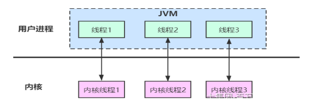

随着互联网的发展，尤其是移动互联网时代的到来，服务端对高并发的要求越来越高，也就是我们需要高性能的网络服务器。

以 C10K 为代表，需要单机同时支持 1 万个并发连接，到现在互联网要求的单机要支持 1 千万并发连接 (C10M 问题。我们分析一下：

在Java中，基本我们说的线程（Thread）实际上应该叫作“用户线程”，而对应到操作系统，还有另外一种线程叫作“内核线程”。

用户线程和内核线程之间存在一对一的关系。

如果靠这种方式解决C10K或者C10M的问题有很大的问题:

1、创建成百上千个线程会导致过多的线程创建和上下文切换

2、过多的线程创建会导致栈空间占用非常大

在 JVM 中，缺省会为每个线程分配 1MB 的内存，1万个线程理论上需要消耗10 GB 的内存，1000万个线程理论上需要消耗10 TB 的内存。理论上讲服务器也没有这个资源。
