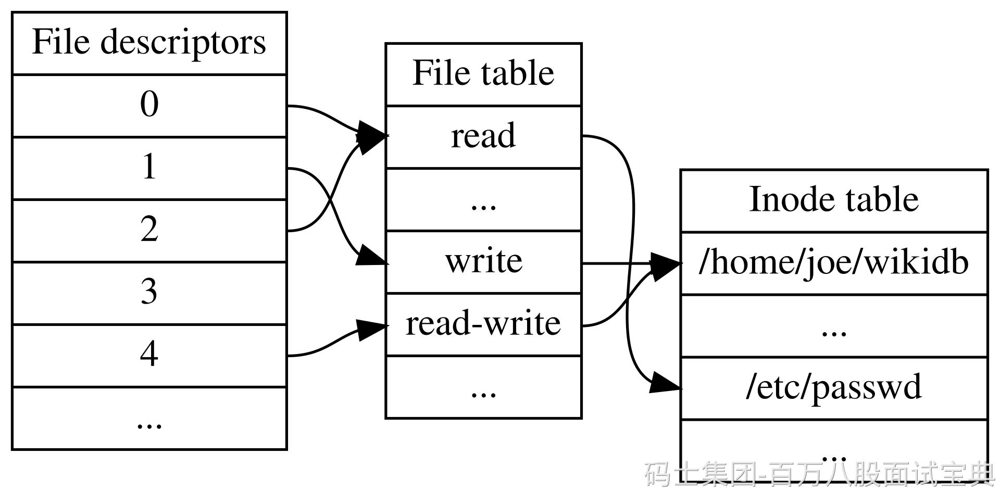

在 Unix/Linux 等系统中，**文件描述符（File Descriptor, FD）是内核分配给进程的一个非负整数，用来作为打开文件或其他 I/O 资源（如网络 socket、管道、字符设备等）的唯一句柄。它并不是传统意义上的“指针”，而是对内核内部文件表项**的索引，让进程以统一方式进行读写操作。

M

每个进程都有自己的文件描述符表，表中存储对各种打开对象的引用，如下图所示：

- 表中的索引即为 FD 值
- FD 指向系统的“打开文件表”条目，其中包含文件偏移量、状态标志等信息
- 该打开文件表条目再指向底层 inode 或资源描述结构  
  不同进程可共享相同底层资源，但各自维护独立的 FD 表。

**标准文件描述符**（在程序启动时默认打开）：

- `0` → stdin（标准输入）
- `1` → stdout（标准输出）
- `2` → stderr（标准错误）  
  这是 POSIX 规范要求，用户程序可以使用如 `STDIN_FILENO` 等符号替代这些数字，增强可读性。

S

### **文件描述符的作用及优势**

- **统一 I/O 接口**：使得文件、网络连接、设备、管道等不同类型的资源都能通过 `read()` / `write()` 等系统调用操作，从而实现“一切皆文件”的设计理念。
- **系统资源管理**：通过 FD，内核可以集中管理打开资源的状态、读写位置、引用计数等。关闭一个 FD 会解除对资源的引用，并在无进程持有时释放底层结构。
- **支持进程继承与共享**：调用 `fork()` 时，子进程继承父进程的 FD 表；调用 `dup()` 和 `dup2()` 可以复制 FD，使多个 FD 指向相同底层资源，适用于重定向或多进程协作。
- **限制和监控资源使用**：每个进程可使用 FD 的数量有限（受系统参数如 `ulimit -n` 或 `OPEN_MAX` 限制），以控制资源泄漏风险。

B

总结： 文件描述符是进程与 I/O 资源交互的“钥匙”，通过一个整数标识，底层则是复杂结构的索引机制。它实现了统一 I/O 操作、资源共享 & 管理，节点灵活、性能高效，是 Unix/Linux I/O 子系统的基石。在网络编程、并发处理、进程间通信等场景中，都离不开它的使用和优化。
