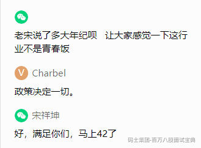

# 三高项目

# 可靠性

完全可靠，是不可能的。

通过架构的手段提升可靠性。

失效概率：衡量时间。R(0)=1,R(正无穷)=0 相反。

## 模块的连接方式和可靠性

串联系统可靠性：

调用方：1 2 3 4 5 每个系统 99%。那么整体可靠性：（五个99相乘）95%。

并联系统可靠性：

r=1-(1-r1)乘\*(1-r2)乘\*(1-r3)乘\*(1-r4)乘\*(1-r5) == 1-0.01\*0.01。

冗余系统可靠性：

5个模块，3个能用，就oK。

R串 < R冗余 < R并联

## 可靠性设计

消除单点依赖：重要策略。

显示的串联改并联：

Read Write Through：

此方式下，调用方只和缓存打交道，而缓存负责保证自身和数据提供方一致。。

调用方 -- 缓存 ---数据库。（类似于串联）。

Cache Aside：

调用方 先读 缓存，如果没有去读数据库，（），相当于有了旁路。

集群：

一个模块有效，则集群对外就是有效的。

主备式：

等价式：

前面是保障可靠性，但是 真扛不住了。咋整。

后面阶段：

分流

并行

并发

缓存。

隔离 限流 降级 熔断 恢复

非黑即白。

未失效（给所有用户提供所有服务）

给所有用户提供部分服务

给部分用户提供部分服务

不提供服务，马上能恢复

系统崩溃，不影响其他服务

系统崩溃，影响其他服务

失效（全挂了）

# 应用保护

丢卒保车

## 隔离

方法（）{

线程池5个连接：取连接 去调用：调用科比：hystrix源码。（缺点：线程池 创建，回收，切换）

从业务出发，确定可隔离的对象。

信号量：5。

调用W：

}

## 限流

水库。

固定时间窗口：

规定一个时间：10秒。100个请求。

---

int 时间窗口大小；

int 请求阈值；

// 重置窗口

if((现在时间-开始时间) > 时间窗口大小){

请求数置零；

开始时间=now；

}

// 处理请求

if(请求数 < 请求阈值) 阈值和请求数{

请求数++；

return 结果；

}else{

滚；

}

---

突刺。

为了避免突刺，尽量缩小时间窗口，只要时间窗口足够小，小到只允许一个请求。

漏桶限流算法。小到我给你的请求你都能处理。

以恒定的速率 想服务 放请求。

容量有限。

缺点：1 2

服务和漏下来的请求之间没有交互：要么我太忙，要么我太闲。

令牌限流：

请求要继续，需要拿令牌，令牌 由服务颁发。

**作业：共享存储。服务处理能力：**

方法（）{

long 当前时间；

代码；

代码：

long 当前时间；

算个差； 如果小于 10秒；服务处理的还行，如果大于10秒，服务差点意思；

}

检票， 机场安检

检票速度， 处理业务

1 新请求来：默认几个令牌，

2 令牌来，要有请求用。

请求队列

令牌默认数量。

突刺。不会造成冲击。无所谓。

---

## 降级

只保留必要的功能。

降级策略：

停止读取数据库：改成从缓存中存近似结果。商品 已销售数量。

准确结果 转成 近似 结果。lbs location based service。低精度。降低清晰度。

返回静态结果：

同步转异步：写缓存，mq。

功能剪裁：

禁止写操作：不让用户改数据。if(!flag){return }

分用户降级：

工作量证明降级：POW：

触发手段：

自动：

因失败概率过高。

因限流：100个 你 10个 ，set key 1。return；

手动：

## 熔断

我调用你。隔离：牺牲我。

响应慢，错误多。达到阈值。保险丝。

降级：是服务自身的行为。

熔断：是服务上游的行为。

熔断：哪怕下一个请求 能成功，我也不让你访问。自动完成。

隔离 限流 降级 熔断 恢复

## 恢复

暂时性手段，为了保护系统。

撤出限流、消除降级、关闭熔断。

感知到系统正常（从哪里来，到哪去，解铃还须系铃人。），直接恢复。

预热。（先少量开放）

第一次，肯定慢，但是后面快。（证明自己）

恢复阶段：逐渐增加请求（本质 参考限流）。

---

# 总结

高并发。

代码：肯定实现不了。

他就直接问你们项目里怎么实现高并发的

---

后面减掉：

read write through: redis，mysql。

软引用 清理：java语言特性 + 缓存。

---

直播减掉：

read write through 用在什么项目当中？ 直播类，教学视频类，电商，秒杀？

用缓存，用数据库，流程数量好，公司对数据的期望。

强：只要被强引用，就不回收。

软：当被gc root 引用，内存空间不足，会回收。

Map `<object, SoftRefrence<object>> 变量名 = new 对象；`

弱：只要被jvm发现，不管内存够不够，都回收。

虚：直接回收。

来几节小课讲讲怎么画架构图，上次面试最后要求画架构图

业务（功能）架构图：业务分层，拆分，识别边界。

技术架构图：数据的流转。

老师 redis适合做搜索么？比如搜索商品 并且商品数据量比较大==ES

其实我想问的是 假如用redis做搜索 理论上也可以scan 但这么做有什么弊端么？

**内存。容量太小**

1kb \* 1个亿。

LRU。

老师手写一个redis抢红包可好？

---

需求，解决方案，难点。

编这个项目，都编了3天。面试官 就那么 十几分钟或者 几十分钟。

坦诚。

每个人都想按照自己的方式来。

工业富联。

兴趣--行业--公司/工资

老师 我现在打算去从最基础的去开始学 比如linux 等等 老师有什么建议么？先满足短期，能干活：java基础，

ssm，boot cloud。

有余力，则学（底层）
