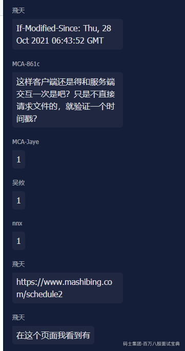

# 客户端优化

资源的获取，资源的处理，资源的展示。

资源：样式文件，脚本文件，图片，视频，文本等等。

浏览器：DOM树。

过程：

## 1。资源下载。

快：压缩。

不必要的cookie。

1k 1一亿个呢？ 8亿。

JavaScript：删除无效字符，注释：1。减少体积。2。代码安全。语义合并。

CSS：类似。语义合并。9行。原来10个按钮 10个样式，class 1个样式。

http请求压缩：

head中加参数：Accept-Encoding：gzip，deflate

表示 客户端 可以接受的压缩内容的格式。

服务端响应：head: Content-Encoding:gzip

在服务端：手动做一些压缩的操作。

减少请求：

资源数目多、体积小，频繁创建http链接？

雪碧图：样式文件 background-postition:

js合并。

矢量图：`<svg >`

base64图片。

40% 以下。gzip 对文本文件的压缩 能压缩到原来的 40%以下。

转移给第三方。

---

连接：

http1.0 http 1.1（）

http没有长短连接一说，长短连接 是 针对tcp的。

http是针对 请求和响应模式的，只要服务端给了响应，本次http连接 结束。

http1.1 发请求的时候，在请求头中：connection:keep-alive。

好处：减少了 创建和销毁连接的 消耗。

例子：网页，（css,js，html），baidu.com。

header里设置超时。

长轮询 和 短轮询

长轮询：发现服务端没有变化的话，那么将当前请求挂起一段时间，如果没变化，一直等到超时，如果有变化，则返回。

假如是查询数据库的，那不是一直要不停的查询吗？

1。 用redis。

2。发布 订阅。

形成自己的解决问题的 思路的框架。

双工通信

netty，websocket（ws）。

http在tcp的基础上 有 长 短 轮询。

tcp链接 有 长短。

现在 基本上都是http1。1 默认支持长连接。

长轮询 ：是服务端控制的。

双工通信：前后端 可以彼此 交互。

connection: keep-alive

keep-alive: timeout=60s

### 资源的缓存

页面缓存，客户端本地缓存（）

页面的缓存：可以控制 客户端、各级代理（中间的各个节点）、 对页面资源的缓存。

如何控制：headers : Cache-Control:public

可缓存性：

pubic（服务器 响应中）: 各级都能缓存。

private（服务器 响应中）: 只能 客户端 缓存，中间各级不缓存。

no-cache: (请求，响应)：可以缓存，但是不能直接使用缓存，要去服务端验证一下。

no-store: (请求，响应)：哪都不要存。

缓存有效期：

max-age=秒，缓存可以存活的时间。

s-maxage=秒，在各级节点存活的时间，如果是 客户端存储忽略。

max-stale=秒，可以忍受资源过期的时间。

min-fresh=秒，

重新验证和加载的设置

must-revalidate: 服务器重新验证之前，不可以使用该资源。

proxy-revalidate: 各级节点有效。

no-transform: 不能压缩图像。

only-if-cached: 只要缓存的，不要服务器的资源。

header：

Cache-Control: pulic, max-age=10,no-transform

缓存更新不及时：

1。更新文件名：版本号，url时间戳的变化。my-js.js。my-js-1.js。客户端和服务器要达成一致。

**发布上线一个文件，这个文件名是变的，那么 缓存的文件 就失效了。**

2。验证 缓存的有效性。

基于 文件的最后修改时间。

服务端：last-modified : 最后修改时间。

客户端：if-modified-since ：自己需要资源的时间。

你要我1个手机，我给你手机，手机贴标：时间戳。。304，不返回具体资源。200：返回具体资源。

基于：版本号的。

etag: 版本号。

客户端在请求中：if-none-match:

## 2。 解析。元素，样式，脚本。

目的? 优化解析。

1。优化正常解析流程。

元素

css样式文件 render tree 布局好， 绘制。

js脚本

回流：

重绘：

目的：缩小 回流和重绘的 范围。

方法：分几个块。

2。创新解析流程。：

虚拟dom（Virtual DOM）。算法，比较前后两个dom的区别。

**如果改变不了 它 本来的面目，那么就给 它 化化妆，改变展现的面目。**

oracle 物化视图？

缓存 redis？

---

## 懒加载

h5 app 界面。

懒加载：仅仅加载 最基础的元素，以后，再根据用户的操作，进行局部加载。将原来一次性要加载的内容拆分成了多次加载。分流。

回流、重绘。

app上的，

树形组件，折叠面板，标签页。

尽量灵活一些，支持多种情况。

到了不得不看具体数据的时候，才调用后端。

但是也不一定，一些 经常不变的数据，就没必要了。

## 预加载

先后顺序。

1 2 3 4 5 ---10

1。同一个域名下。

拉去资源

`<link rel="preload" href="xxxx.js" />`

`<link rel="prefetch" href="xxxx.js" />`

2。不同域名下。

A，B，C

减少域名解析此时：dns缓存。

DNS预获取。

dns解析速度，被很多人忽视。蚊子腿也是肉。

预解析：

dns解析，多级递归查询。对时间是消耗，我们想办法节省时间。

我们在当前页面，完成对下一个页面域名的解析，而在下一个页面直接使用预解析之后的结果。

dns prefetching。

告知浏览器 打开域名的预解析

`<meta http-equiv="x-dns-prefetch-control" content="on">`

解析谁

`<link rel="dns-prefetch" href="//www.baidu.com">`

`<meta http-equiv="x-dns-prefetch-control" content="off">`

拉去资源

`<link rel="preload" href="xxxx.png" />`

`<link rel="prefetch" href="xxxx.js" />`

`preload`: 针对当前页面，更早的去下载资源，当前页面的资源。

音频，视频，embed，图片，js，css，

prefetch: 针对下一页，如果下个页面 存在比较大的资源，当前页面处理完，浏览器闲置的时候，

会去加载 该资源。

扩展：

图片->base64->放到 css文件里。

## 客户端数据库

一个用户1k，1000w个用户 10G。

cookie算一个：过期时间，坏处：

sqllite。

## 动静分离

媒体类网站：一篇新闻，

数据不仅包括 传统意义上的页面，也包括 没有和访问者相关的个性化数据。

缓存：

把静态数据 放到 离用户最近的地方。：浏览器，cdn，服务端的cache。

链接和数据做映射。url1 获得一个数据。key value。如果缓存到了 客户端，都不用发http请求了。

nginx,apache。

怎么做？

url唯一，做映射。

特殊展示的元素做分离：尽可能的多做静态化。

将页面中的cookie，与用户个性化相关的 东西 去掉。

架构方案：

静态服务器：nginx,apache

统一缓存管理服务：缓存做分发。

上CDN得了。

数据库查的 数据 + 样式文件 = html文件。

**客户端优化 到此为止**

用户在客户端中的优化。
