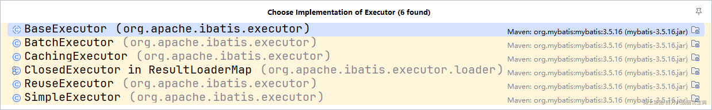
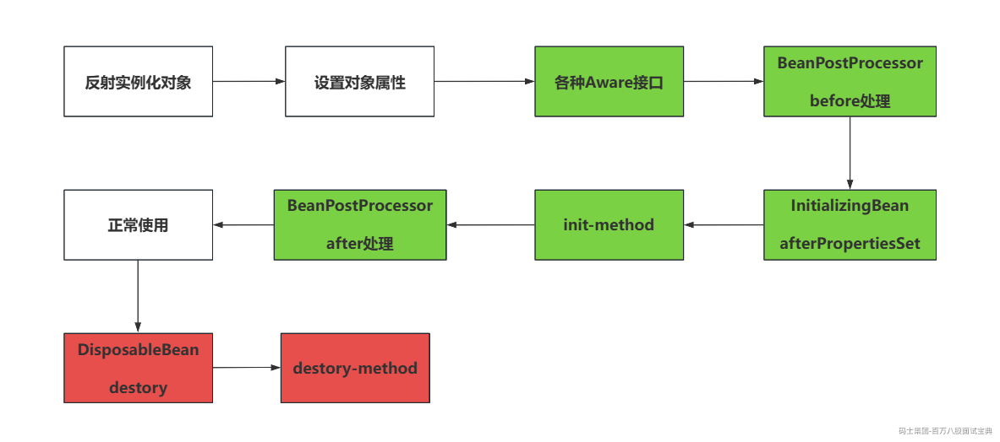
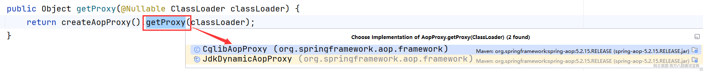

# 核心框架源码常见问题（上）

## 1、MyBatis中#与$的区别（常识）

> 这个问题就是常识性问题，会，应该的。 不会回家。
>
> #预编译处理（PreparedStatement）：
>
> - #是基于占位符的方式，将参数注入到SQL语句的指定位置。完成预编译的效果，传入的参数不会被解析为关键字，就是一个字符串，可以预防SQL。
>
> $字符串的拼接（Statement）：
>
> - $传参时，无法预防SQL注入的问题。
>
> - 在一些特殊的情况下，需要传入一些表名，字段之类的内容，这些就不能去做预编译的处理，所以在传入字段，表名之类的内容时，一定要用$传参。

```plain
select xxx from ${table} order by ${column}
```

## 2、MyBatis中的一级缓存和二级缓存的区别

> 区别蛮多的，最好还是从源码的维度去和面试官沟通。
>
> **1、本质的实现流程区别**
>
> - 首先一级缓存是基于BaseExecutor去查询一个PerpetualCache中的HashMap得到的缓存结果。
>
> - 二级缓存是基于CachingExecutor去查询一个PerpetualCache中的HashMap得到的缓存结果。
>
> Ps：虽然都是PerpetualCache，但是不是一个对象！
>
> **2、查询Cache的区别**
>
> - 一级缓存，他只去查询PerpetualCache，不涉及其他的Cache实例。
>
> - 二级缓存，他会经历很多个Cache，最后才会到PerpetualCache中查询数据。
>
> - SynchronizedCache：加锁，确保线程安全
>
> - SerializedCache：对数据做序列化和反序列化的操作
>
> - LoggingCache：记录缓存命中率的日志。
>
> - LruCache：基于Lru删除最近最少使用的缓存对象，Lru策略就是基于LinkedHashMap实现的，最大长度默认为1024。
>
> - …………
>
> **3、作用域**
>
> - 一级缓存的作用域是SqlSession级别。 （线程）
>
> - 二级缓存的作用域是SqlSessionFactory级别。 （全局）
>
> **4、优先级别**
>
> - MyBatis中，二级缓存的优先级高于一级缓存 **（因为一级缓存的作用域原因，他的缓存命中率约等于0，因为咱们很少在一次事务中多次查询同一个数据，所以，二级缓存毕竟是全局共享，所以使用他的缓存命中率更高，不如直接查询二级缓存）**
>
> **5、默认开关**
>
> - 一级默认开启
>
> - 二级默认关闭，需要在配置文件手动开启

## 3、MyBatis中的Executor

> Executor就是咱们在使用MyBatis和数据库交互时，底层就是在Executor的位置去搞Statement之类的内容。可以直接找到Executor的接口，查看他对应的实现类
>
> 
>
> 除了ClosedExecutor不需要关注之外，其他的5个咱们需要了解。
>
> - **BaseExecutor：** 基本的执行器，除了CachingExecutor之外，都是继承BaseExecutor实现的。
>
> - **CachingExecutor：** 他就是二级缓存的执行器。
>
> - **SimpleExecutor：** 一般默认使用的就是SimpleExecutor，每次执行SQL语句，都会创建一个Statement对象去和数据库完成交互。
>
> - **ReuseExecutor：** 可复用的执行器，复用的是Statement对象，他会根据SQL语句来决定是否复用一些Statement，他是将SQL作为Key，Statement作为Value扔到了一个HashMap里。
>
> - **BatchExecutor：** 批处理执行器，针对写操作，但是不是你想的那种批处理，他是将每次要执行的SQL语句，扔到一个集合里，等你commit之后，再一个一个扔给数据库执行。
>
> **选择Executor，默认是在MyBatis的核心配置文件中修改settings，指定defaultExecutorType。**

## 4、谈谈你对IOC的理解（常识性）

> **解耦：**
>
> - IOC就是帮你创建对象，同时将对象地址扔到引用里。
>
> - 某个通过IOC，各个模块之间的对象耦合性变的更低。
>
> - 比如远古时期，一个Service层如果依赖DAO，那会直接new一个DaoImpl的实例。使用了IOC之后，基于接口的引用，利用IOC将依赖通过Spring容器注入进来，就可以扔Service和DAO之间的耦合更低。
>
> - 比如现在有一个CacheService，可能之前使用的是MemCacheServiceImpl的实例，利用Spring直接基于CacheService接口注入进去。如果后期要换成RedisSerivceImpl，所有引用CacheService实例的对象不需要做任何变化。
>
> **底层相关：**
>
> 前面聊清楚自己的想法后，可以再点一嘴Spring是怎么实现IOC的，他的本质就是在程序启动时，先加载xml以及注解的相关内容，获取bean的一些元数据，将这些元数据封装为BeanDefinition的实例，扔到一个集合中，当要创建bean时，获取到每一个BeanDefinition，基于反射的形式将对象构建出来，并且扔到一级缓存中，哪里需要注入，就从一级缓存中拿！

## 5、Spring创建Bean的过程（Bean的生命周期、Spring的拓展接口）

> 说白了就是Spring在构建好一个bean之后，会再次执行一些拓展的接口方法，都有哪些~
>
> 当对象实例化完毕，也初始化ok之后，会按照这个流程走
>
> 1. 执行各种Aware接口。（ApplicationContextAware，也可以点一嘴实际的应用，SpringUtil工具类）
>
> 2. BeanPostProcessor的Before方法。
>
> 3. InitializingBean的afterPropertiesSet方法。
>
> 4. init-method方法
>
> 5. BeanPostProcessor的After方法。
>
> 6. 正常使用~~~
>
> 7. DisposableBean的destory方法
>
> 8. destory-method方法



## 6、聊聊AOP

> 首先，如果你的项目中涉及到了AOP的操作，无论是你们自己封装的，还是框架里面设计的，都可以点一嘴你们项目中的应用。
>
> 如果你的项目里没涉及，或者你不了解，那你也要说一些会用到AOP的场景，比如认证的框架，Shiro，SpringSecurity在授权注解校验里都是基于AOP做的， **声明式事务底层也是AOP** ，再比如记录一些日志啥的， **在不改变源代码要动态注入功能的点** ，多说一说…………
>
> 聊完这个理解和一些应用之后，就是聊底层了，底层也可以从两个维度来聊
>
> - AOP底层实现：
>
> - AOP底层是基于动态代理实现的，他有两种实现的方案
>
> - jdk动态代理：基于接口（interface）去构建代理对象。
>
> - cglib动态代理：基于继承（extends）去构建代理对象。
>
> - **如果被问到了那个代理效率好，你要提一嘴虽然cglib底层是基于字节码增强实现的，但是他俩效率其实大差不差。**
>
> - **如果一个类没有实现接口，并且被final修饰，那这个类的对象就没法被代理。**
>
> - Spring创建代理对象的时机
>
> - **代理对象的创建是基于BeanPostProcessor的after后置处理创建的。**
>
> - 从源码的纬度搂一眼。
>
> 

```plain
1、查看到BeanPostProcessor的实现类，AspectJAwareAdvisorAutoProxyCreator，代理对象创建的过程就是基于他完成的。
2、查看他的postProcessAfterInitialization方法，在里面有创建的逻辑。
3、可以进入到wrapIfNecessary方法中的实现
4、再次看到一个核心方法，核心方法叫createProxy，明显就是创建代理对象。
5、在进去可以看到proxyFactory.getProxy方法，必然是通过这个创建的代理对象
6、最后可以看到return createAopProxy().getProxy(classLoader);方法，getProxy的实现方式就有前面说的两种方案，一种JDK，一种Cglib
```

## 7、AOP的名词（常识）

> 代理的最终目的，是为了给某一个方法织入一些功能。比如方法执行之前干点啥，方法执行之后干点啥，方法出现异常干点啥。
>
> **连接点：** 可以被织入功能的方法，就叫连接点。
>
> **切入点：** 真正要被织入功能的方法，就叫切入点。 **（切入点可以基于切入点表达式来指定）**
>
> **增强：** 要被注入的功能，就要增强。
>
> ~~织入：将增强扔到切入点里的动作就是织入。 （不用聊~~）~~
>
> **切面：** 将增强织入到切入点的过程就是切面。

## 8、Spring涉及到了哪些设计模式。

> Spring涉及到的设计模式太多了，能说几个是几个，但是一定要点到具体是哪里涉及到了。
>
> - 单例：Spring默认维护的bean都是单例的
>
> - 工厂：Spring内部提供了各种工厂，顶级接口是BeanFactory
>
> - 代理：AOP底层就是基于代理实现的
>
> - 原型：Spring可以将bean的scope属性设置为prototype。**（但是他每次都是重新基于反射构建，没用拷贝）**
>
> - 装饰者：Spring在构建bean之后，会将器包装为BeanWrapper
>
> - 构建者：在构建BeanDefinition的时候，属性贼多，内部提供了BeanDefinitionBuilder
>
> - 责任链：Interceptor拦截器，多个拦截器就具备责任链的效果。
>
> - 模板：RedisTemplate，RabbitTemplate…………各种模板~
>
> - 策略：ClassPathXMLApplicationContext以及对应的FileSystemXmlApplicationContext
>
> - 观察者：各种Listener，各种Event事件~~
>
> - 委托…………………………等等
