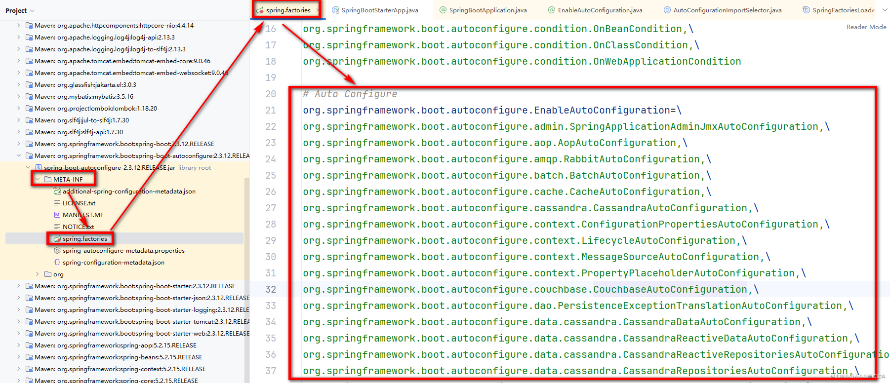
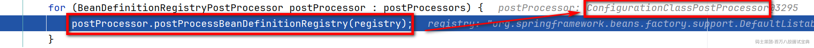

# **核心框架源码常见问题（下）**

## 1、BeanFactory跟FactoryBean的区别（常识）

> 在Spring框架中，BeanFactory和FactoryBean就不是一个东西，名字看着像一点。
>
> 首先这哥俩都是接口。
>
> 其中BeanFactory其实就是咱们一直在说的Spring容器，Spring工厂，IOC容器…………这个BeanFactory就是在帮助咱们创建和管理bean的实例。
>
> FactoryBean是一个特殊的bean对象，构建的时候指定的是某一个工厂里的某一个方法返回的对象才是咱们要管理的对象。

## 2、Spring的循环依赖（常识）

> 聊Spring循环依赖的思路。
>
> 1、先说清楚循环依赖的问题是怎么出现的。
>
> 2、再说解决循环依赖的方式，这里从三个维度聊
>
> - 提前暴露对象引用
>
> - 二级缓存
>
> - 三级缓存（AOP）
>
> 先说清楚循环依赖的问题是怎么出现的：
>
> - 有两个实例，A和B。
>
> - 其中A中的属性引用了B，B中的属性引用了A。（A和B之间相互引用）
>
> - 利用Spring来构建这两个实例。
>
> - 先实例化A，A在初始化的时候，需要将b属性赋值，b的实例需要去Spring容器中找。
>
> - 因为b还没有实例化，需要去实例化B，B也需要初始化，需要去Spring容器中找A实例。
>
> - 如果非完成初始化的A无法没使用，那就会出现循环依赖。
>
> - But，Spring可以用非完成初始化的A实例。
>
> Spring解决这个问题的方式：
>
> - Spring是允许将未完成初始化的实例提前暴露出来使用的，所以上述的流程不会出现循环依赖的问题。
>
> - 而二级缓存就是分别存储提前暴露出来的对象，以及完成初始化的对象，可以提前去这里查看提供的二级缓存分别是啥。
>
> - 面试官可能会问，二级缓存已经够了，为啥Spring提供了三级缓存呢？
>
> - 因为咱们Spring提供了AOP的机制，如果某个bean需要被代理，需要将代理对象提前暴露出来，不能对外暴露未代理的对象。
>
> - 而Spring提供的三级缓存，他存储的ObjectFactory类型，他是一个函数式接口，三级缓存中本质存储的是一个Lambda表达式，需要获取对应的对象时，需要调用这个ObjectFactory中的getObject方法才能获取。
>
> - 这样如果对象需要被代理，就可以基于三级缓存中提供的getObject的方式将对象代理后，再从三级缓存中拿到二级或者一级缓存。
>
> **如果Spring没有AOP的这个机制需要处理，那其实二级缓存已经足够了。 But，Spring有代理的操作，所以他需要这个三级缓存，来将bean的代理对象构建出来返回。**

---

```plain
class A{
    B b;
}
class B{
    A a;
}
```

```plain
public class DefaultSingletonBeanRegistry ……{
        /** 一级缓存，存储完成初始化的对象 */
    private final Map<String, Object> singletonObjects = new ConcurrentHashMap<>(256);

    /** 二级缓存，存储提前暴露出来的对象 */
    private final Map<String, Object> earlySingletonObjects = new ConcurrentHashMap<>(16);
}
```

## 3、SpringBoot的自动装配实现原理（常识中的常识）

> 自动装配，本质就是约定大于配置的。 当你引入了一个starter依赖之后，这些starter依赖会提前帮你写好一些约定好的配置。 **面试要聊的自动装配的原理，其实就是怎么样加载到的这些提前写好的配置。**
>
> 大多数时候，咱们有两种回答方式：
>
> **注解方式的回答：**
>
> - 在启动类的头上，有一个@SpringBootApplication的注解，这个注解是一个组合注解。
>
> - 在这个组合注解中，有一个@EnableAutoConfiguration的注解。同时他也是一个组合注解。
>
> - 在这个组合注解中，有一个@Import的注解，引用了AutoConfigurationImportSelector的类。
>
> - 在项目启动时，会加载到这个类，去读取META-INF下的spring.factories文件。
>
> - 在这个spring.factories文件中，就存储着那些提前写好的配置。
>
> 
>
> **从源码维度的方式回答：**
>
> 记住一个核心，要聊到是ConfigurationClassPostProcessor去读取@Import注解，以及解析导入的AutoConfigurationImportSelector类的过程。
>
> **1、加载ConfigurationClassPostProcessor的点**
>
> **ConfigurationClassPostProcessor属于BeanFactoryPostProcessor**
>
> - 当启动main方法之后，会执行run方法。
>
> - 在run方法内部，最终会调用到refresh方法。
>
> - 找到invokeBeanFactoryPostProcessors(beanFactory)。这里就是加载CCPP的位置。
>
> 
>
> **2、CCPP是在什么位置去解析的启动类中的@Import注解**
>
> - 前面加载到之后，会执行CCPP的postProcessBeanDefinitionRegistry方法。
>
> - 在内部会获取到CCPP的ConfigurationClassParser，通过他的parse方法读取@Import注解 **（本质是加载@Configuration修饰的类，启动类包含了这个注解，同时他也会读取@Import引入的内容）**
>
> - 在加载到启动类之后，他会去解析内部的各种注解，包括了@Import注解，基于processImports方法
>
> - 在内部，基于deferredImportSelectorHandler.handle方法加载@Import引入的实例，并且放入到一个List集合中存储好。
>
> **3、什么时候去执行的@Import注解引入的实例**
>
> - 在前面读取完毕之后，会在ConfigurationClassParser的parse方法会面，基于process开始处理的。
>
> - 在process内部会从那个List集合中取出要处理的ImportSelector类，执行handler.processGroupImports去处理
>
> - 在内部处理过程中，最后会执行到@Import注解引入的AutoConfigurationImportSelector类中提供的process方法。
>
> - 在process中会调用到getAutoConfigurationEntry方法。这个方法和前面注解聊到的就形成了闭环~
>
> 整理一下话术：这里是一些缩写。
>
> AutoConfigurationImportSelector：ACIS
>
> AutoConfiguration：AC
>
> ConfigurationClassPostProcessor：CCPP
>
> ~~ConfigurationClassParser：CCP~~
>
> - **启动类中注解包含了@Import注解，他引入了一个ACIS的类。**
>
> - **本质是ACIS去选择出需要加载的各种AC的类。**
>
> - **加载的过程是在SpringBoot项目启动后，基于加载CCPP去解析启动类中的@Import注解**
>
> - **在基于CCPP****~~内部的CCP的类~~****去解析启动类，最终会将启动类中引入到ACIS类，扔到一个List集合中**
>
> - **然后再将List集合中的ACIS类进行加载，会执行他的process方法，最终会拿到所有的AC，再选择需要进行加载的内容**

```plain
可以查看AutoConfigurationImportSelector的类，在内部有一个getAutoConfigurationEntry的方法，在这个方法内部会去调用getCandidateConfigurations，在这个放里又会套一堆，SpringFactoriesLoader.loadFactoryNames -->loadSpringFactories --> 最后就会加载到前面说的classLoader.getResources(……)，也就是META-INF下的spring.factories。
```

## 4、Nacos的服务注册

> 服务注册：Nacos客户端将自己的各种元数据（服务名，IP，Port等等）封装好，基于grpc请求将自己的元数据注册到NacosServer中。
>
> 注册的大致流程。
>
> - 在注册之前，Nacos客户端会将自己的各种信息封装成一个Instance实例，里面包含了服务名、IP、Port、权重、健康信息、是否开启、是否是临时节点等。
>
> - 基于NacosNamingService，将封装好的Instace注册要NacosServer上。
>
> - 咱们自己的服务一般都是临时服务，那就默认走的都是grpc的方式注册上去，利用NamingGrpcClientProxy实现的请求发送。
>
> **Ps：咱们自己写的服务基本都是临时服务，一般类似MySQL之类的要注册Nacos才是持久化服务。**

## 5、Nacos1.x服务的心跳

> 心跳是干嘛的呢，说白了就是Nacos客户端注册到Nacos服务上之后，默认每隔5s要发送一次心跳请求（HTTP）。如果NacosServer15s没收到心跳，将服务的健康设置为false，30s没收到心跳，直接从注册表中剔除。
>
> 本质其实就是利用JUC包下的ScheduledThreadPoolExecutor去实现的定时任务，每隔5s，利用Java默认提供的方式发起的HTTP请求。
>
> BeatInfo：封装当前心跳要携带的一些信息，没啥说的。
>
> BeatReactor：发送心跳的。
>
> - 在他的有参构造中，会初始化发送请求用到的NamingHttpClientProxy，本质就是Java自带的HttpURLConnection
>
> - 其次还会初始化一个ScheduledThreadPoolExecutor，在内部会提交BeatTask任务，内部其实就是发送心跳请求，以及在当前服务没有在Nacos中找到时，会重新注册上去。
>
> - 任务执行完，会重新将任务投递到ScheduledThreadPoolExecutor中。
>
> **Ps：如果后期要注册到NacosServer上的服务成百上千，甚至上万个，每隔5s的一次请求，对于Nacos的压力也是比较大的，所以到了2.x有一个优化……上长连接~~**

## 6、Nacos2.x服务的心跳

> 在2.x中，心跳从每隔5s发送请求优化为了一个grpc的长连接。
>
> 长连接的建立，其实是在服务注册到NacosServer上之前完成的。
>
> 之前服务的注册是利用NamingGrpcClientProxy注册到NacosServer上的。
>
> 其实在NamingGrpcClientProxy构建的时候，他就会创建一个rpcClient，并且会直接调用rpcClient.start()
>
> - 在内部依然构建了一个ScheduledThreadPoolExecutor
>
> - 在ScheduledThreadPoolExecutor中投递了俩任务~
>
> - 在一个while循环中，将当前服务和NacosServer建立一个grpc的长连接。
>
> - 建立连接成功之后，会向一个队列中投递连接事件。
>
> - 这个事件会被第一个投递到ScheduledThreadPoolExecutor的任务中处理，处理连接成功和失败之后的回调
>
> - 第二个Submit是检测是否存活以及一些补偿操作……

## 7、Nacos的服务发现

> 1、服务的发现，其实是根据对应服务的名称去拉取到服务的元数据。
>
> 2、服务发现的第一步是去找一个本地缓存（ConcurrentHashMap）先拿数据，如果没有，再尝试访问NacosServer
>
> 3、在这会开启一个定时任务，延迟1s去NacosServer中拉取信息同步到ConcurrentHashMap中。
>
> 4、没有的话就直接发送一个grpc请求，找NacosServer去查询具体的服务信息。

```plain
这里会根据拉取信息的失败与否，每隔几秒~60秒之间去NacosServer拉最新的元数据并且扔到本地。
```

## 8、Nacos的配置动态刷新。

> 一般这种配置的动态刷新就两个方式，一个Push，一个Pull
>
> **Push就是服务端主动的将数据变更的信息推送给客户端。**
>
> - **时效性好**
>
> - **服务端需要占用更多的资源来维持跟客户端的连接**
>
> **Pull就是客户端每隔一段时间，主动的发送请求到服务端，问一下配置变了么。**
>
> - **时效性和发送频率不好把控**
>
> - **间隔太短，对于服务端的压力也贼大。**
>
> Nacos取各家值所长，又推又拉~~~
>
> 客户端默认每10ms发送一次请求到服务端，但是服务端在接收到请求之后，不会立马响应，卡在这，因为默认超时是30s，他会卡住这个请求29.5s，如果在卡住的期间，配置变化了，直接响应，如果没变，就卡到29.5s完事，等待客户端再次发送请求……
>
> - 服务端不需要占用太多资源维护跟客户端的连接
>
> - 客户端不会很频繁的发送请求，请求间隔在30s左右
>
> - 服务端一变化，立马响应，时效性也很好。
