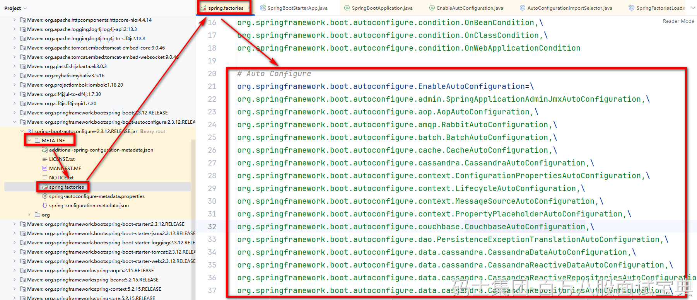

自动装配，本质就是约定大于配置的。 当你引入了一个starter依赖之后，这些starter依赖会提前帮你写好一些约定好的配置。 **面试要聊的自动装配的原理，其实就是怎么样加载到的这些提前写好的配置。**

大多数时候，咱们有两种回答方式：

**注解方式的回答：**

- 在启动类的头上，有一个@SpringBootApplication的注解，这个注解是一个组合注解。
- 在这个组合注解中，有一个@EnableAutoConfiguration的注解。同时他也是一个组合注解。
- 在这个组合注解中，有一个@Import的注解，引用了AutoConfigurationImportSelector的类。
- 在项目启动时，会加载到这个类，去读取META-INF下的spring.factories文件。
- 在这个spring.factories文件中，就存储着那些提前写好的配置。

可以查看AutoConfigurationImportSelector的类，在内部有一个getAutoConfigurationEntry的方法，在这个方法内部会去调用getCandidateConfigurations，在这个放里又会套一堆，SpringFactoriesLoader.loadFactoryNames -->loadSpringFactories --> 最后就会加载到前面说的classLoader.getResources(……)，也就是META-INF下的spring.factories。

**从源码维度的方式回答：**

记住一个核心，要聊到是ConfigurationClassPostProcessor去读取@Import注解，以及解析导入的AutoConfigurationImportSelector类的过程。

**1、加载ConfigurationClassPostProcessor的点**

**ConfigurationClassPostProcessor属于BeanFactoryPostProcessor**

- 当启动main方法之后，会执行run方法。
- 在run方法内部，最终会调用到refresh方法。
- 找到invokeBeanFactoryPostProcessors(beanFactory)。这里就是加载CCPP的位置。

**2、CCPP是在什么位置去解析的启动类中的@Import注解**

- 前面加载到之后，会执行CCPP的postProcessBeanDefinitionRegistry方法。
- 在内部会获取到CCPP的ConfigurationClassParser，通过他的parse方法读取@Import注解 **（本质是加载@Configuration修饰的类，启动类包含了这个注解，同时他也会读取@Import引入的内容）**
- 在加载到启动类之后，他会去解析内部的各种注解，包括了@Import注解，基于processImports方法
- 在内部，基于deferredImportSelectorHandler.handle方法加载@Import引入的实例，并且放入到一个List集合中存储好。

**3、什么时候去执行的@Import注解引入的实例**

- 在前面读取完毕之后，会在ConfigurationClassParser的parse方法会面，基于process开始处理的。
- 在process内部会从那个List集合中取出要处理的ImportSelector类，执行handler.processGroupImports去处理
- 在内部处理过程中，最后会执行到@Import注解引入的AutoConfigurationImportSelector类中提供的process方法。
- 在process中会调用到getAutoConfigurationEntry方法。这个方法和前面注解聊到的就形成了闭环~

整理一下话术：这里是一些缩写。

AutoConfigurationImportSelector：ACIS

AutoConfiguration：AC

ConfigurationClassPostProcessor：CCPP

~~ConfigurationClassParser：CCP~~

- **启动类中注解包含了@Import注解，他引入了一个ACIS的类。**
- **本质是ACIS去选择出需要加载的各种AC的类。**
- **加载的过程是在SpringBoot项目启动后，基于加载CCPP去解析启动类中的@Import注解**
- **在基于CCPP****~~内部的CCP的类~~****去解析启动类，最终会将启动类中引入到ACIS类，扔到一个List集合中**
- **然后再将List集合中的ACIS类进行加载，会执行他的process方法，最终会拿到所有的AC，再选择需要进行加载的内容**
