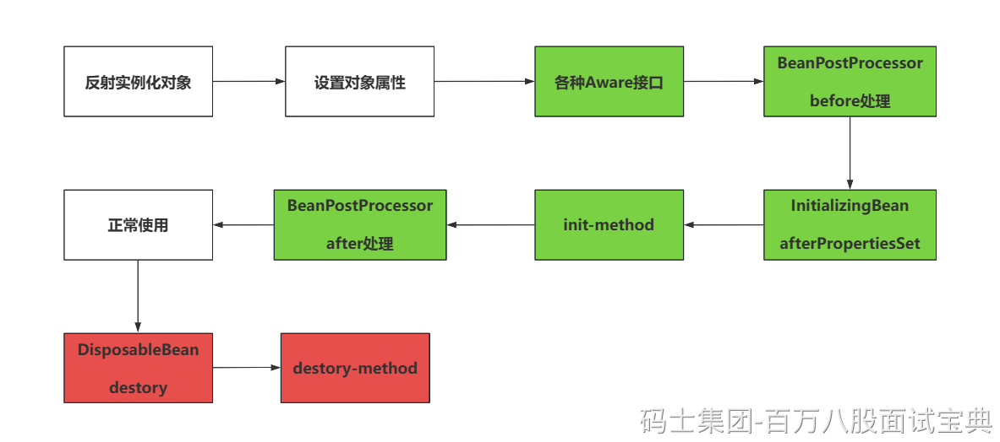

说白了就是Spring在构建好一个bean之后，会再次执行一些拓展的接口方法，都有哪些~

当对象实例化完毕，也初始化ok之后，会按照这个流程走

1. 执行各种Aware接口。（ApplicationContextAware，也可以点一嘴实际的应用，SpringUtil工具类）
2. BeanPostProcessor的Before方法。
3. InitializingBean的afterPropertiesSet方法。
4. init-method方法
5. BeanPostProcessor的After方法。
6. 正常使用~~~
7. DisposableBean的destory方法
8. destory-method方法

