生产故障体系概论

课程主要内容

1-生产故障分级规范概要

2-生产故障定位解决

3-面对生产故障应有的思考

4-常见的生产故障案例

目的

能快速合理的处理线上问题 写出高质量代码 对上线有敬畏精神，平时加强注重细节，养成良好的设计，分析问题能力。

**1 生产故障分级规范概要**

**1.1 开篇**

计算机是当今世界的命脉，你能看到的任何地方，计算机都在改变着世界，不论是传统的制造生产，医 疗通讯。还是新兴的虚拟现实，无人驾驶汽车 等领域。过去的几十年，计算机硬件飞速发展，软件领域 也是不断刷新着人们的想象。可以说，计算机学科复杂而且庞大，甚至有人说，不亚于物理学。

今天我们讨论的话题，线上事故分析，只是其中的一部分，一小部分，为了说清楚这一点，我们简单了 解一下软件工程学科。

**玛格丽特·希菲尔德·汉密尔顿** （英语：Margaret Heafield Hamilton，1936年8月17日－[ [**1]**](https://zh.wikipedia.org/wiki/%E7%8E%9B%E6%A0%BC%E4%B8%BD%E7%89%B9%C2%B7%E6%B1%89%E5%AF%86%E5%B0%94%E9%A1%BF#cite_note-Wayne2011-1) ）被认为 发明了软件工程一词。

她帮助了NASA在阿波罗计划中避免了严重问题。她曾这样说：“有点像牙根管治疗：你总是拖到最后

才做，但有些事可以预先做好，有点像预防性体验，只不过是预防软件出错”。

我们不妨简单总结如何开发一个大型的软件项目下：

1-基于面向对象的编程语言

2-容易使用的集成开发环境

3-文档和注释（程序员最讨厌的两件事，写注释给别人读，阅读别人没有写注释的代码😃）

4-构建管理和版本控制

5-质量保证测试(QUALITY ASSURANCE-QA)

每个软件从业者从写下第一行代码开始，就一刻不停地 和软件中的错误做斗争 开发和维护（修复缺 陷、确保资源充 足等保障软件运行的活动）是一对伴随软件运行而产生的双 热爱从零到一开发软件是 开发者的天性 看着自己编写的 软件完美运行，为其他 提供服务，一直是驱动开发者前进的动力。为了 更快更好地开发软件，我们不断改进开发方法和软件架构，但是开发者在使用新的方法和更复杂的架构 时，往往也会低估潜在的风险。

本课程话题，主要讨论质量测试上线后，运营环节期间的一些问题，当然，我们暂时并不界定事故的产 生到底是因为测试覆盖不全还是操作不当等，这某种程度体现着管理的方式问题。

**1.2 事故等级定义**

业务和产品的线上质量、是研发团队的生命线，也是支撑业务快速是错，小步跑的前置条件。

**1.2.1 故障等级定义**

故障等级定义，不同的业务形态，不同的公司团队，有不一样的划分标准，下表列举了一般常见的维度 和标准

【1】核心数据定义

**个人敏感信息：** 姓名、出生日期、身份证件号码、个人生物识别信息、住址、通信通讯联系方式、通信 记录和内容、账号密码、财产信息、征信信息、行踪轨迹、住宿信息、健康生理信息、交易信息等。

**用户画像：** 职业、经济、健康、教育、个人喜好、信用、行为等。

【2】系统级别定义

**零级系统(P0)** ：为公司核心业务服务的核心系统，一旦发生不可用会直接影响公司核心业务的业务连续 性，对所有系统用户造成影响。

**一级系统(P1)** ：重点的业务系统，一旦发生不可用，影响核心业务的连续型，并造成大部分内部用户或 外部用户不可使用此系统。

**二级系统(P2)** ：重要的业务系统，一旦发生不可用存在一定的业务可用性问题，但不会影响核心业务的 业务连续性。

**三级系统(P3)** ：非核心的支撑系统，一旦发生故障不直接产生业务影响，但会影响少部分内部用户使用 此系统。

【3】影响范围与故障等级

**1.2.2 故障报告模板示例**

模板参考

**1.2.3 故障响应处理机制**

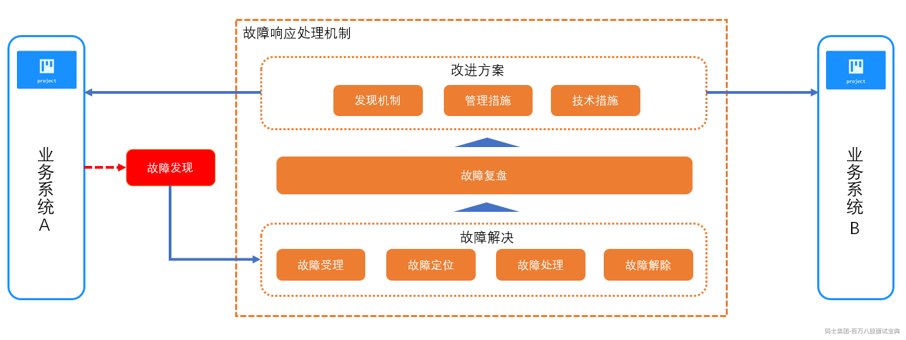

如图所示，大体描述了一般生产故障的处理机制

故障发现：

1-客户投诉或者业务反馈，研发自我发现

2-监控报警：技术监控，业务监控

**1.2.4 思考**

为什么会发生这个问题？ 为什么测试阶段没有发现？ 为什么系统不能容错？ 能不能更早发现问题？ 解决过程能不能更快？ 怎样防止类似的事情发现？

**2 生产故障原因和分类**

**2.1 故障分类**

代码bug：上线代码逻辑有问题，遇到特殊情况下，导致故障的情况 操作不当：线上配置或资源配置错误，操作不当，比如启动顺序不合理，初始化脚本不对，语法生 产数据隔离混用等 系统级别软件bug：技术架构中使用到的任何OS，第三方类库，软件在特殊场景下，bug被处罚导 致故障的情况。 突发流量：热点或突发事件，引发的瞬时流量超过日常峰值或成倍增长，造成性能下降或功能不可 用问题 资源使用不均：整体产品线利用率不达标，但有些业务冗余度不足，导致资源不能正确合理使用 容量预估不足：对个别业务核心池预估不足 网络类：公网拥堵、丢包、专线、网络设备故障、ip被攻击（包括DNS被攻击）、IP被封、域名被 封、网络软件BUG、业务部门使用不当、未及时扩容等 安全类：被攻击，漏洞被利用等问题，均归为此类 局方故障：ISP，根域名服务，电力，空调，光缆等外部单位故障导致的问题。 硬件故障：任何硬件非人为原因损坏导致的故障均归为此类。

第三方合作公司或接口故障：项目依赖的第三方公司或接口故障

个人统计（未必准确），实际生产中，遇见的故障所占比例

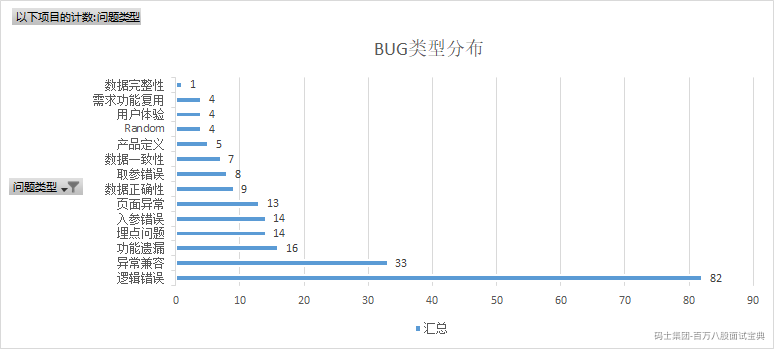

**2.2 bug是可以完全避免的么？-了解**

日常项目里中，站在开发者的角度：

大多数程序员会花费70%-80%时间调试，而不是在写代码，虽然现在有很好的工具能极大帮助程

序员防止和解决错误

另一个重要部分 给代码写文档 由于现在的需求越来越复杂，依赖的外部条件，技术组件也是越来越多，很多bug在所难免。但也

有一些bug是不能被原谅的，所以养成良好的开发习惯，很重要。

【bug起源】：1945年9月9日，格蕾丝·赫柏（Grace Murray Hopper） 使用的Mark Ⅱ出现故障，导 致工作无法进行。经过了近一天的检查，格蕾丝找到了故障的原因：继电器中有一只死掉的蛾子。蛾子 被夹了出来。后来，” [**bug**](https://baike.baidu.com/item/bug/3353935) ” (小虫) 和” [**debug**](https://baike.baidu.com/item/debug/825293) ” (除虫) 这两个本来普普通通的词汇成了计算机领域 中特指莫明其妙的“错误”和“排除错误”的专用词汇而流传至今，而格蕾丝·赫柏也因此成了第一个发 现“bug”的人。

另一方面，大名鼎鼎的 "千年虫"bug，也是由她带来的。当然，这也不全完全算作bug。

**2.3 经典故障示例-了解**

[**由软件Bug引发的18次重大事故 | 程序师 - 程序员、编程语言、软件开发、编程技术 (techug.com)**](https://www.techug.com/post/12-biggest-software-failures-of-all-time.html)

近年的CSDN600万用户信息泄露事件： [**CSDN网站六百万用户信息外泄-月光博客 (williamlong.info)**](https://www.williamlong.info/archives/2933.html)

2018年github服务中断24小时11分钟事件： [**GitHub服务中断24小时11分钟事故分析报告 (qq.com)**](https://mp.weixin.qq.com/s/fFv1ASElHsVNEPPkP53qAQ)

**2.4 混沌工程简介**

观念和思想来源于：【混沌工程】一书 说起混沌工程一次，也许你听过阿里的红蓝军对抗。

混沌工程是一种通过实验探究的方式来让我们理解系统行为的方法，就像科学家通过实验来研究物理和 社会现象一样，混沌工程通过实验来了解特定的系统 如何使用混沌工程提高系统弹性呢？混沌工程通过 设计 和执行一系列实验，帮助我们发现系统中潜在的、可以导致灾难的或让我们的用户受损的脆弱环 节，推动我主动解决这些环节存在的问题 和现在各大公司主流的被动式故障响应流程相比，混沌工程向 前迈进了一大步。

**混沌工程解决的问题：**

要设计良好的系统需要考虑很多因素，比如可靠性、安全 性、可扩展性、可定制化、可伸缩性、可维护 性、用户体验等。 为了更高效地支撑业务发展，越来越多的企业选择基于云服务 或云原生理念来构建 平台。采用新思路和新技术必然会带来系统架构和组织结构的变革，引入风险因素。

如何通过实验证明生产环境下的分布式系统在面对失控条件的时候依然具备较强的“可观测性”和故障 恢复能力呢？这就是混沌工程要解决的问题。

**混沌工程和测试的区别：**

混沌工程故障注入和故障测试在侧重点和工具集的使用上有些重叠 举个例子， Netflix 的很多混沌工程 实验的研究对象都是基于故障注入来引入的。

混沌工程和其他测试方法的主要区别在于，混沌工程是发现新信息的实践过程，而故障注 入则是基于一 个特定的条件、变址的验证方法。

混沌工程和故障注人本质上是思维方式上的不同 。故障 注人首先要知道会发生什么故障，然后一个一 个地注人， 而在 复杂分布式系统中，想要穷举所有可能的故障，本身就是奢望 混沌工程的思维方式是 主动去找故障，是探索性的，你不知道摘 掉一个节点、关掉一个服务会发生什么故障，虽然按计划做好 了 降级预案，但是关闭节点时却引发了上游服务异常，进而引发雪崩，这不是靠故障注人或预先计划能 发现的。

**一些混沌实验的输入样例：**

·模拟整个云服务区域或整个数据中心的故障 部分删除各种实例上的Kafka主题。 重新创建生产中发生的问题。 针对特定百分比的交易服务之间注入一段预期的访问延迟。 基于函数的混乱（运行时注入）：随机导致抛出异常的函数。

代码插入：向目标程序添加指令和允许在某些指令之前进行故障注入。 时间旅行：强制系统时钟彼此不同步。 在模拟I/O错误的驱动程序代码中执行例程。

在 Elasticsearch 集群上最大化CPU核心。 混沌工程实验的机会是无限的，可能会根据分布式系统的架构和组织的核心业务价值而有所不同。

**混沌工程实现的四个步骤：**

1.定义并测量系统的“稳定状态”。

首先精确定义指标，表明您的系统按照应有的方式运行。 Netflix使用客户点击视频流设备上播放按钮的 速率作为指标，称为“每秒流量”。请注意，这更像是商业指标而非技术指标;事实上，在混沌工程中， 业务指标通常比技术指标更有用，因为它们更适合衡量用户体验或运营。

2.创建假设。与任何实验一样，您需要一个假设来进行测试。 因为你试图破坏系统正常运行时的稳定状态，你的假设将是这样的，“当我们做X时，这个系统的稳定

状态应该没有变化。”为什么用这种方式表达？如果你的期望是你的动作会破坏系统的稳定状态，那么

你会做的第一件事会是修复问题。混沌工程应该包括真正的实验，涉及真正的未知数。

3.模拟现实世界中可能发生的事情，目前有如下混沌工程实践方法：模拟数据中心的故障、强制系统时 钟不同步、在驱动程序代码中模拟I/O异常、模拟服务之间的延迟、随机引发函数抛异常。通常，您希望 模拟可能导致系统不可用或导致其性能降低的场景。首先考虑可能出现什么问题，然后进行模拟。一定 要优先考虑潜在的错误。 “当你拥有非常复杂的系统时，很容易引起出乎意料的下游效应，这是混沌工 程寻找的结果之一，”

“因此，系统越复杂，越重要，它就越有可能成为混沌工程的候选对象。”

4.证明或反驳你的假设。将稳态指标与干扰注入系统后收集的指标进行比较。如果您发现测量结果存在 差异，那么您的混沌工程实验已经成功 - 您现在可以继续加固系统，以便现实世界中的类似事件不会导 致大问题。或者，如果您发现稳定状态可以保持，那么你对该系统的稳定性大可放心。

**引入混沌工程的一些建议：来源于-周洋（花名：中亭）-阿里巴巴高可用架构团队高级技术专家**

第一，引入混沌工程，需要建立进行面向失败设计（可以 使系统暴露出已有问题的设计）和拥抱失败的 技术文化

第二，实施混沌工程，需要定义一个清晰可衡量的目标。 第三，推广混沌工程，要在控制风险的前提下不断提升效率。

**阿里巴巴 混沌工程画像：**

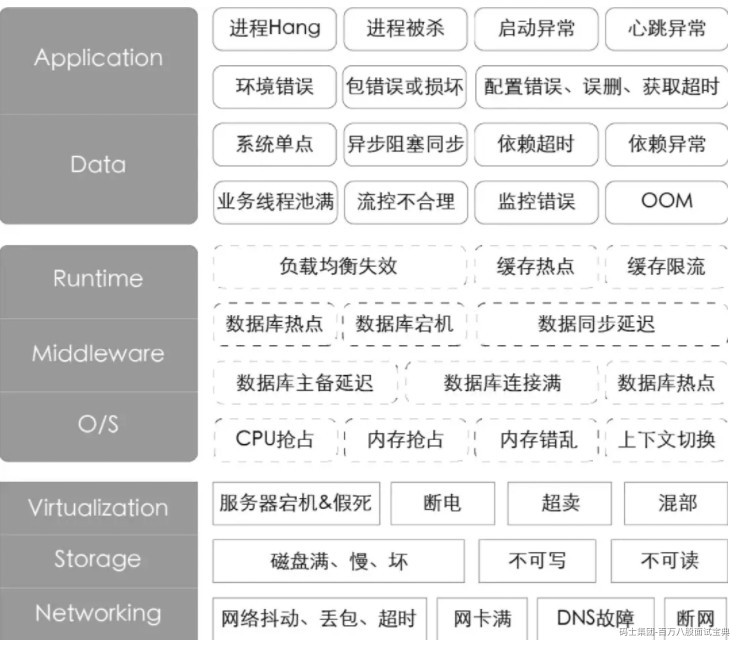

混沌工程是一种实践思想，其本身是不绑定任何技术或工具的。 减少问题的最好方法就是让问题经常性地发生，通过不断 重复失败过程并找出解决方案，来持续提升系

统的容错能力和 弹性。

**混沌工程工具**

[**chaosblade-io/chaosblade: An easy to use and powerful chaos engineering experiment toolkit.（阿里巴巴开源的一款简单易用、功能强大的混沌实验注入工具） (github.com)**](https://github.com/chaosblade-io/chaosblade)

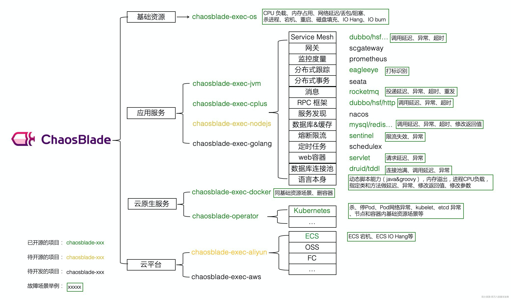

简单示例：

**3 生产故障定位和解决流程**

**3.1 影响服务质量的因素**

**3.1.1我们常常面对如下的业务场景**

•大量无用业务逻辑

•sleep

•循环里写查询

•磁盘满了、影响到有磁盘写操作的接口

•慢查询的SQL

•Redis中存在大key，带宽打满不知是哪些接口影响与被影响

•队列堆积却不知哪些接口影响

•流量放大系数评估全靠经验和看代码

······

**3.1.2 资源依赖**

•接口依赖（内部服务、外部服务） 无法整体查看服务、接口、资源之间的依赖关系 没有很好的外部服务监控机制、无法统计依赖的服务质量

•数据资源依赖（DB、Redis、Memcached、队列） 无法整体查看服务、接口、资源之间的依赖关系 容量评估及扩容标准全靠经验 出问题后仅能凭经验逐一排查、无法迅速定位到代码层面 完全依赖dba帮忙排查

•服务器资源依赖 （负载、内存、网络 ······） 资源指标上升后、无法判断数值是常规上升还是资源异常

•······

**3.1.3 流量**

•大流量来袭时、无法整体感知流量状况 流量多大算大？ 核心业务是否收到影响？

单一接口流量增加却未达到整体的告警线、导致无法感知 可视化是否实时

•无法直观统计流量分布、无法查看具体每个接口的流量情况

•容量评估时、流量放大系数全靠人为判断、对服务整体的放大系数无感知

•······

**3.2 故障发现**

一个高可用的业务系统除了技术架构支撑之外，监控系统作为事中决策支撑和事后决策止损是必不可少 的一部分

工具：Prometheus、Zabbix、Nagios、Open-Falcon、Pageduty等

**3.2.1 监控体系汇总**

监控体系分类：一般可分为： **业务监控** ，系统级别监控，网络监控，程序代码监控，日志监控，用户行 为分析监控，其他种类监控等

系统级别监控：主要跟操作系统相关的基本监控项

物理监控（对物理机或者容器的监控）：存活、内存、cpu、load、硬盘（速率、使用率）、网

络

活性检测：进程、端口 应用服务监控：jvm、gc、线程数

服务监控：rpc和http接口的qps、rt、错误码等

业务监控：包含用户访问的QPS，DAU，访问状态（http状态码），业务接口（登录，注册，聊

天，送礼，留言，下单，支付，播放按钮点击率，搜索次数，好评差评数等等），产品转化率，充 值额度，客诉等很宏观的概念

1-基础业务监控 交易运营数据 业务监控自定义数据

2-业务监控的发展

1-业务监控设置静态阈值无法满足要求 阈值应该配成多少，不同的业务甚至不同的时间段都需要不同的阈值 业务总是出现周期性的趋势，规则配置极易产生误报 特殊的业务场景例如活动引起的冲高回落、大促的冲击都会引起大量误报 对大量维度的业务，比如要监控外部千万级别的商户、上百个不同类型的错误码该如何配置

2-我们要根据业务特征和历史数据生成动态阈值，自动化报警，及时发现故障

3-业界产品： 支付宝lego 阿里妈妈goldeneye

4-一般架构图

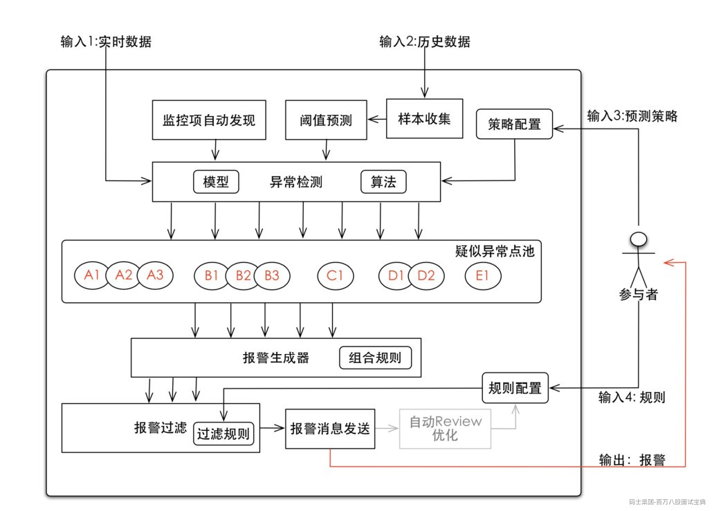

网络监控

IDC，对网络状态的监控（交换机、路由器、防火墙，vpn）对于一个互联网公司必不可少，但是

有很多时候又被忽略：例如：内网之间（物理内网，逻辑内网），外网，丢包率，网络重传，延迟 等等

日志监控

日志监控比较重要，所以一般单独管理和分类，日志不仅限于服务系统日志，对于很多专业化的运维 工程师来说，需要采集的包括系统日志，设备日志，用户行为日志等等，后续可加工处理，（splunk， ELK）

**常用监控图示**

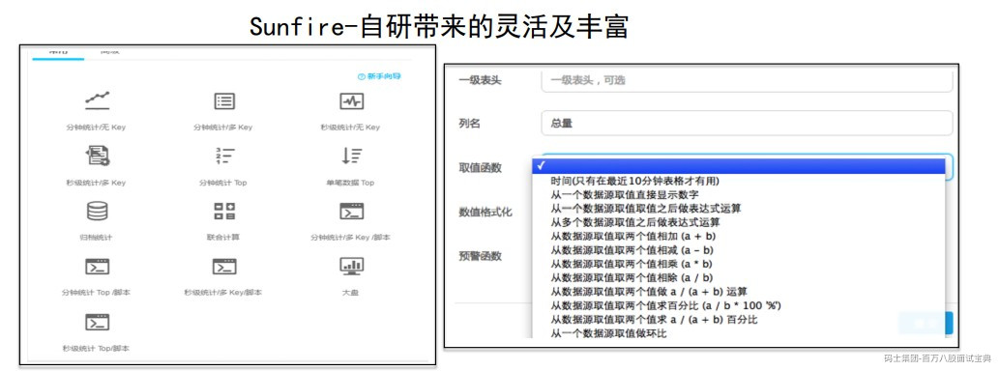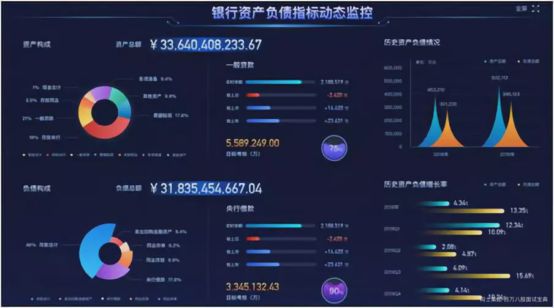

链路监控

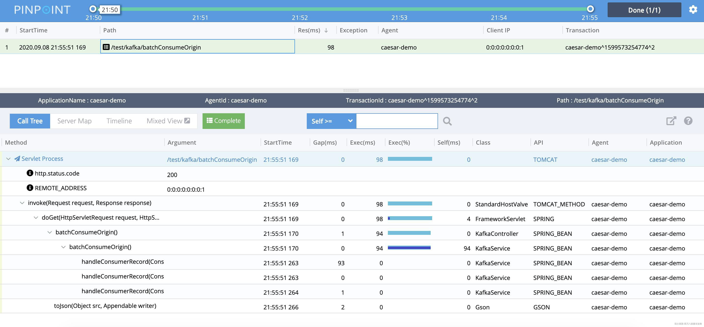

中间件监控：

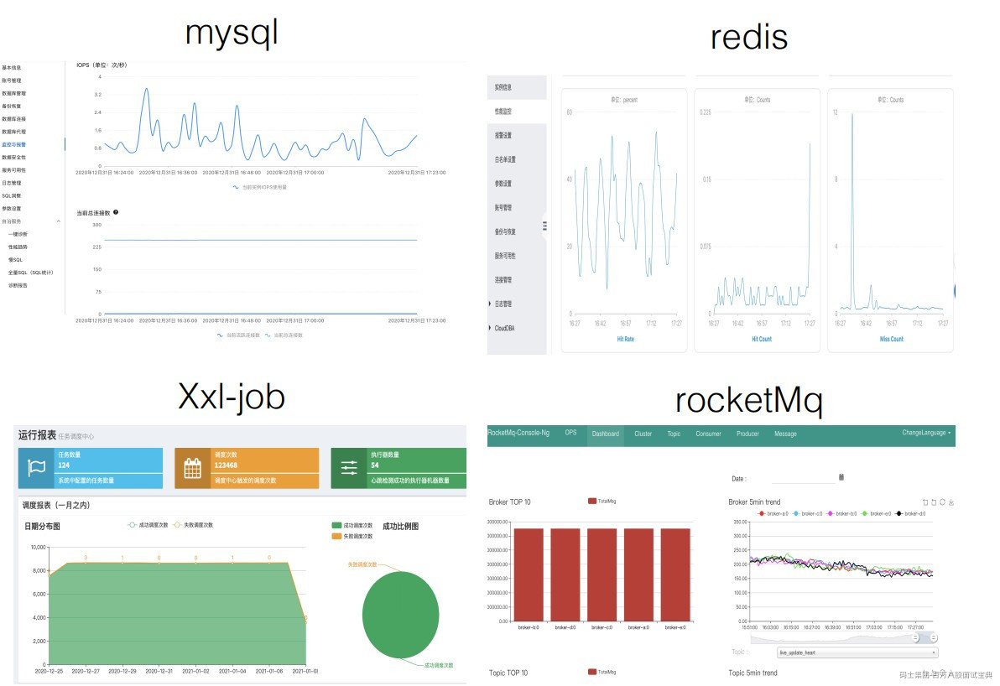

异常监控：

当前排除故障的流程

【项目背景】目前公司线上业务，经常遇到以下几种问题：

1. 由于环境的隔离，导致无法从本地开发环境访问线上环境，故而遇到问题，无法使用IDE远程调试应用程序。

2. 为了线上业务的正常运作，所以不能在生产中调试，防止因调试导致所有线程不可用，从而影响线上业务。

3. 不同环境，参数不同，重现问题难。

一旦我们在生产中检测到问题，我们必须：

1. 回滚到稳定版本。

2. 在日志和代码中搜索错误和异常。

3. 添加log日志，创建新的修补程序版本。

4. 提交测试，等待测试和发布（有可能数天）。

5. 部署预发，获取详细日志，验证问题。

6. 发布新版本到线上。 完成上述步骤，有的故障甚至持续数天，效率非常低下

故障诊断跟踪系统因此产生，其实纵观计算机科学的发展，也是需求促使着新技术不断被发明，又在一 层一层的技术之上建立新的抽象。

以京东的JEX平台为例 功能：

1. 自动捕获程序中发生的异常事件

2. 自动保存异常发生时的完整调用栈（callstack）

3. 自动保存异常发生时的变量值

4. 自动关联相关源代码和变量

异常退栈：

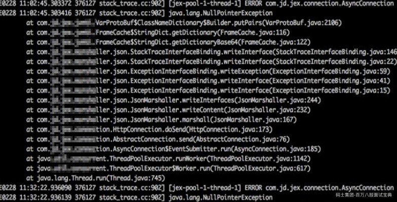

JEX：

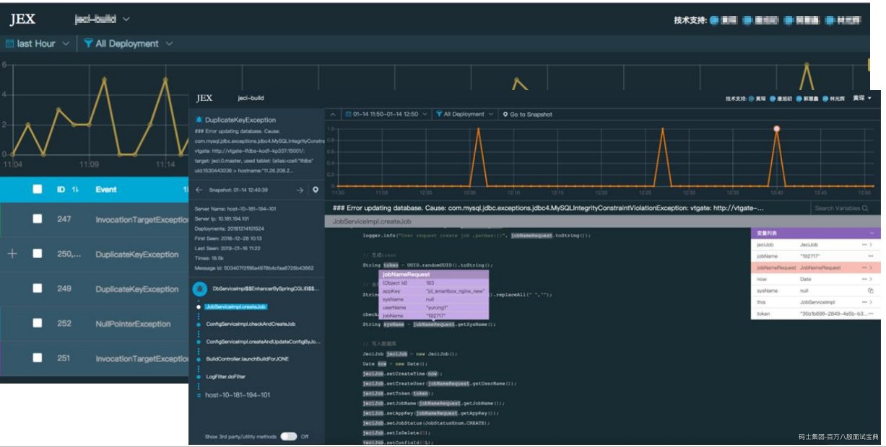

保存了异常的DEBUG 和TRACE信息

**3.3 线上排除故障**

**3.3.1故障排除方法**

上一节，我们有提到，故障排除的一般流程，不妨在此再次总结如下：

1. 回滚到稳定版本。

2. 在日志和代码中搜索错误和异常。

3. 添加log日志，创建新的修补程序版本。

4. 提交测试，等待测试和发布（数天）。

5. 部署预发，获取详细日志，验证问题。

6. 发布新版本到线上。

另外，别忘了一个很重要的方法：重启服务

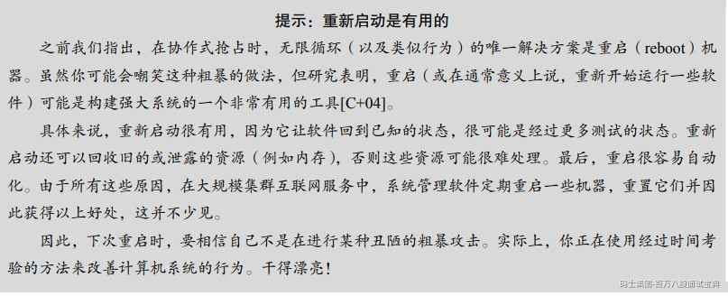

上图来源于 操作系统导论：[美] 雷姆兹·H.阿帕希-杜塞尔（Remzi H.Arpaci-Dusseau） [美] 安德莉亚

·C.阿帕希-杜塞尔（Andrea C.Arpaci-Dusseau）

**3.3.2 故障排除一般需要掌握的技能-工具篇**

1-一般情况下，需要了解业务场景，千万不要第一时间着急解决bug，应先评断是否可以回滚，影响面 大小，是否为上层提供服务，是否有数据异常。

2-应熟悉项目依赖的监控，学会看监控。

3-应熟练开发环境的断点排查与诊断，熟悉git，maven，idea的使用，分析如何复现线上故障。

4-线上排查故障的工具链（仅供参考）-随着课程慢慢补齐

**3.3.2.1 IDEA 断点高阶**

**1.window快捷键：** 所在行处： Ctrl+F8 断点属性编辑： Ctrl+Shift+F8

**2.断点类型与设置**

行断点（line breakpoints) 在到达设置断点的代码行时暂停程序。这种类型的断点可以设置在任何可执行的代码行上。该类型

断点的图标：

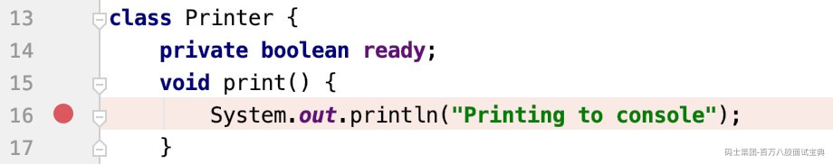

字段断点（field breakpoints）

当指定的字段被读取或写入时暂停程序。这允许你对与特定实例变量的交互作出反应。例如，如果 在一个复杂的过程结束时，你的某个字段出现了明显的错误值，设置一个字段观察点可能有助于确 定故障的来源。该类型断点的图标：

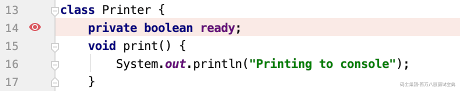

鼠标右键点击该断点图标 ，弹出该断点配置，会有Field access和Field modification选项，此选 项是字段类型断点特有的，分别对应访问该字段或修改该字段触发断点，两项同时选中，则访问与 修改该字段都会触发断点。

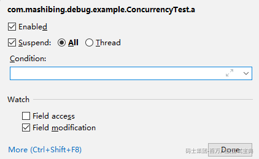

方法断点（method breakpoints） 在进入或退出指定的方法或其实现之一时暂停程序，允许你检查该方法的进入/退出条件。

该类型断点的图标：

当断点加在class类名这一行，且该类中没有编写构造函数（只有默认无参构造函数），当调用默认 无参构造函数时会触发此断点，程序挂起，故该断点虽然图标是行断点类型图标，但实际上属于方 法类型断点。

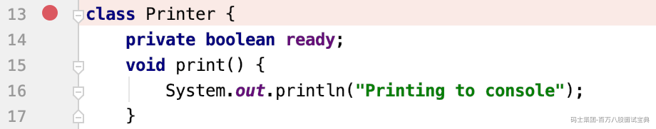

鼠标右键点击该断点图标 ，弹出该断点配置，会有Emulated、Method entry、Method exit选 项，此选项是方法类型断点特有的。Emulated勾选中，会将方法断点优化成方法中第一条和最后 一条语句的行断点，这样会优化调试的性能，因此在IDE中会默认选中，

通过匹配符批量添加方法断点，在断点列表页

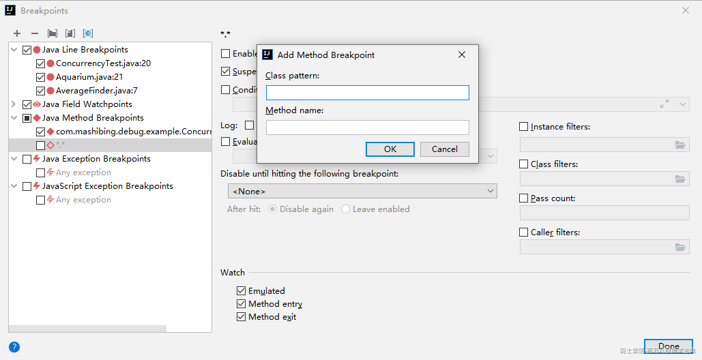

匹配符示例:

异常断点（Exception breakpoints）

异常断点分为两种，一种是Any Exception，任意Throwable异常被捕获或未被捕获就会触发断 点，另一种是指定类型的异常及其该异常子类被捕获或未被捕获会触发断点，该类型断点图标

鼠标右键点击该断点图标 ，弹出该断点配置，会有Caught exception和Uncaught exception选

项，此选项是字段类型断点特有的，Caught exception选项选中时，当指定的异常被捕获时，触 发断点程序挂起，Uncaught exception选中时，当指定的异常未被捕获时，触发断点程序挂起

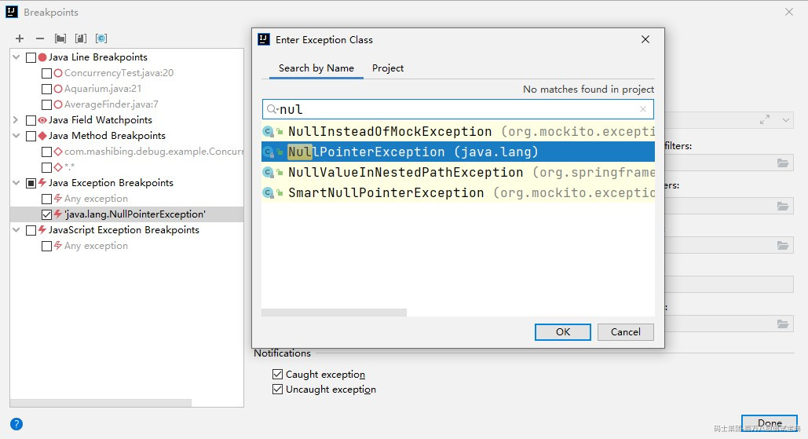

**3.断点控制**

**断点删除**

1-所有类型断点：断点设置中移除对应的即可。

2-快捷移除：行位置鼠标左键单击即可移除（异常断点除外） 建议：为了避免意外删除断点并丢失其参数，通常选择点击鼠标中键来删除断点。要做到这一点，请进

入 "设置/首选项"|"构建、执行、部署"|"调试器"，选择 "拖到编辑器 "或用鼠标中键点击。点击一个断点

将启用或禁用它。

**断点静音**

如果某些时候不需要在断点处停留一段时间，可以将断点静音。这样就可以在不离开调试器会话的情况 下恢复正常的程序操作。之后，可以解除中断点的静音，继续调试。断点静音会静音所有断点

在断点调试窗口，点击断点静音按钮

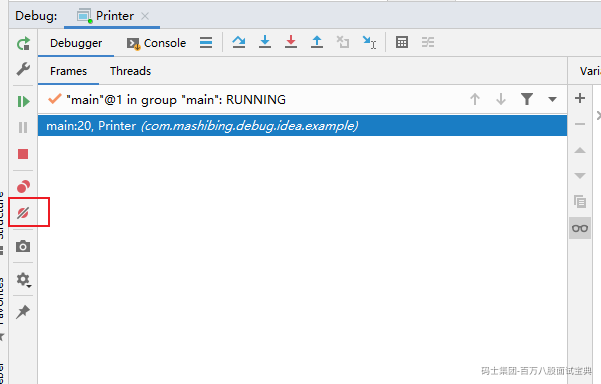

**启用/禁用断点**

正常 通过 断电删除 的断点，会连同当时断点的内部所有配置一并删除。如果想暂时关闭一个断点，后 续可能还会使用，这是一个很好的选择

同断点删除操作 **断点移动/复制** 断点移动：鼠标左键拖动 断点复制：按住ctrl，鼠标左键拖动

**4.断点属性配置**

鼠标操作：右键断点：More(Ctrl+Shift+F8)

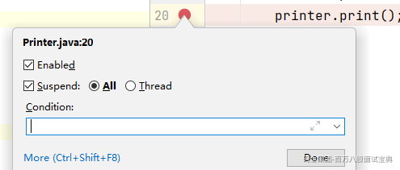

**快捷键：Ctrl+Shift+F8**

**快捷键：光标所在行 Alt+Enter**

断点有许多属性配置，如下图所示，下面将会对各个属性的作用以及使用进行说明。

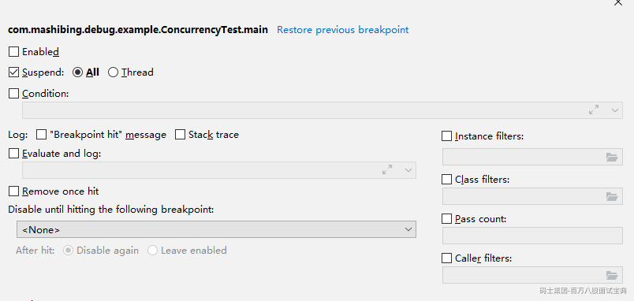

Enabled

表示是否启用该断点，选中表示启用，取消选中表示不启用。

Supend

当断点的 Suppend 属性被勾选，触发该断点时，会触发程序挂起，当该属性未选中时，程序触发该

断点时，程序不会挂起，常用于输出一些表达式结果日志。 当断点的 All 属性被勾选，触发该断点时，会挂起所有线程

当断点的 Thead 属性被勾选，触发该断点时，只会挂起触发该断点的那个线程，不影响其他线程 当需要在不暂停程序的情况下记录一些表达式时（例如，需要知道一个方法被调用了多少次时），

或者需要创建一个主断点，在击中后启用附属断点时，非暂停性断点是非常有用的。

实际生产实践中，可用于调试多线程并发的问题

**Condition**

可以输入一段能获得true或false的表达式，程序运行到断点处，且表达式条件为true才会触发断点

**Log**

下面三个属性选项经常配合 Suppend 属性一起使用，用于在不挂起的情况下，输出一些想要的日志信

息

Breakpint hit message ：控制台输出触发端点的日志信息，类似如： Breakpoint reached at

ocean.Whale.main(Whale.java:5)

Stack trace ：输出触发断点时的堆栈信息

Evaluate and log ：计算表达式结果并输出表达式结果到控制台，表达式的计算基于断点所在行的

上下文，表达式的语句可以是字符串字面量，如 "我是字符串" ,也可以是方法调用，如

users.size() ，也可以是多行语句块，表达式的结果取自return语句，如果没有return语句，会取 表达式中的最后一行语句。

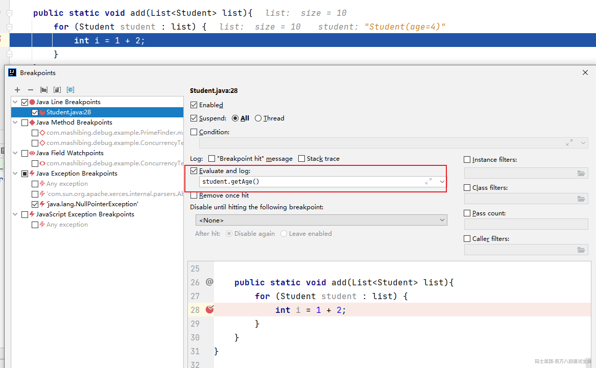

**Remove once hit**

是否在断点触发后移除该断点，后续不在触发

**Disable until hitting the following breakpoint**

指定在另一个断点触发后，该断点才启用，若该断点启用后，并且被触发，

场景：当只需要在某些条件下或某些操作后暂停程序时，这个选项很有用。在这种情况下，触发断 点通常不需要停止程序的执行，而是做成非暂停状态。

**Filters**

前边说的大都数属性，都只针对方法程序运行上下文。此属性更多关注通过过滤掉类、实例和调用者 方法来微调断点操作，只在需要时暂停程序。，有如下几种过滤方式：

Catch class filters ：此选项只对异常类型的断点可用，可以让程序只在指定类和子类中抛出的

异常才会触发断点或者不在指定的类和子类中触发断点（即排除一些类，排除通常以 - 开始，例 如 -pacakge.ClassName ），

Instance filters ：只有指定实例id号可以触发断点，多个实例id号以逗号隔开，实例id号可以在 Variables和Memory面板中查看

Class filters ：可以让程序只在指定类和子类中才会触发断点或者不在指定的类和子类中触发断

点（即排除一些类）。

Caller filters ：根据调用者来进行过滤，需指定方法的全限定名（包含方法签名），例如

mypackage.MyObject.addString(Ljava/lang/String;)V

**配置 说明**

-package1.Class1.method1([Ljava/lang/String;)Ljava/util/List;

此处是 caller filter 的配置示例，

该示例中排除了来自 package1.Class1类中method1方法 并并且方法签名是: List method1 (String[] input) 的调用（即不触发 断点）

package1.Class1 \*s2 -package3.Class3

Class filters 和 catch class filter

中的配置示例。该示例中，断点仅在 package1.Class1以及全限定名以 s2 结尾的类中可以被触发，并且不在 package3.Class3中触发（ - 开头表 示排除）

-java.\* -sun.\*

Class filters 和 catch class filter

中的配置示例，该示例排除了 java and sun包下的所有类（``- 开头表示 排除）

**Pass count**

勾选中并输入一个正整数N，N>=1，那么程序会每N次命中断点才会触发挂起，如果同时设置了 condition 与 pass count 属性，ide会优先判断 condition 表达式，再判断 pass count 是否满足， 下例中， pass count 中传入的是15，每15次命中断点才会触发断点，挂起程序

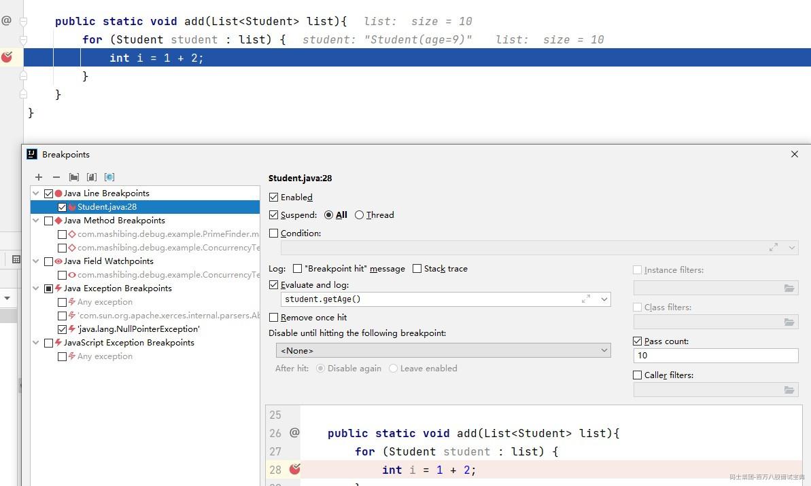

**5.断点状态**

图标：

**6.断点窗口操作**

**7.stream流调试**

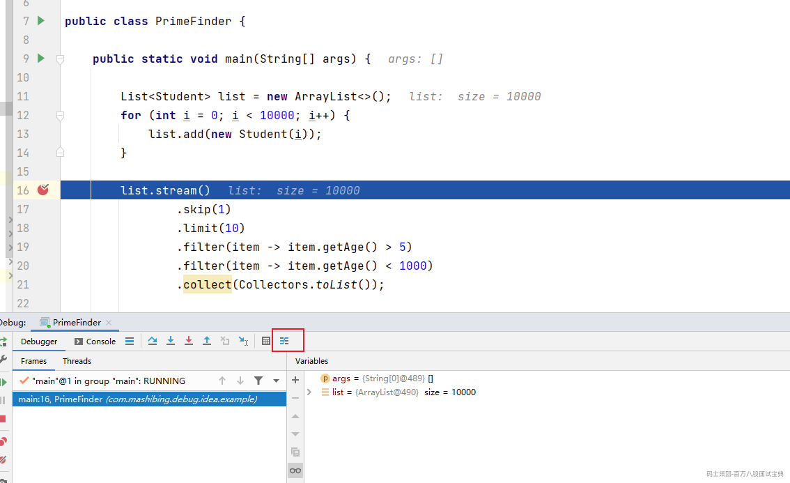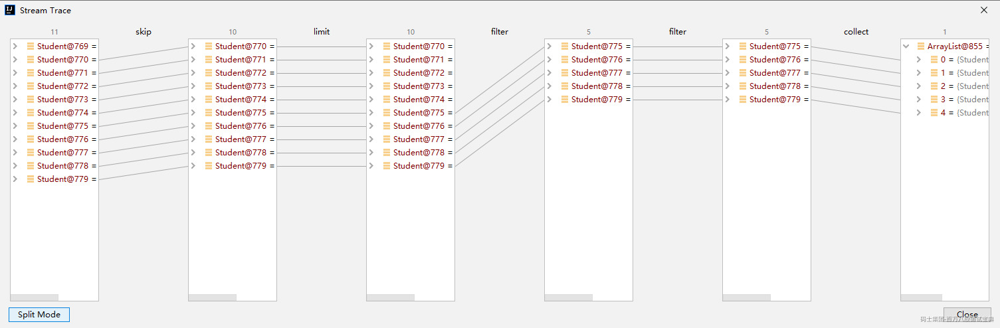

**8.远程调试**

1-打开Idea的 Run/Debug Configurations 新增一个Remote

JVM参数添加 -agentlib:jdwp=transport=dt\_socket,server=y,suspend=n,address=5005

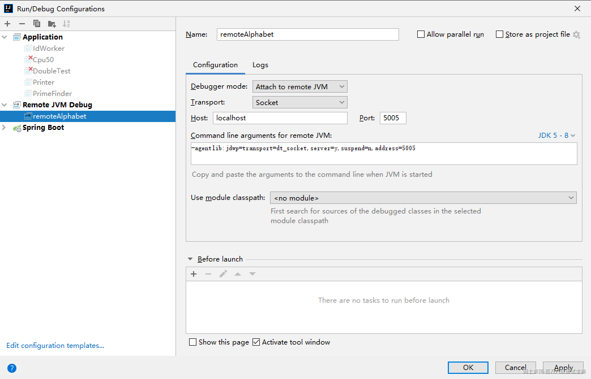

2-远程项目启动添加参数

java -agentlib:jdwp=transport=dt\_socket,server=y,suspend=n,address=5005 -jar xxx.jar

3-idea启动remote，并打断点调试

**9.生产力建议**

使用断点进行 "printf "调试 使用非暂停的日志断点，而不是在代码中插入打印语句。这为处理调试日志信息提供了一种更灵活 和集中的方式。

场景：

所有需要打印的地方，生产上禁止 System.out.print();

调试无响应的应用程序 如果你的应用程序挂起，暂停会话，让调试器获得关于其当前状态的信息。然后你可以检查程序的 状态并找出问题的原因。

场景： 项目启动卡死等处理

测试你的程序是否有并发性问题 发现多线程程序在并发方面是否健壮的一个好方法是使用断点，在碰到时只暂停一个线程。停止一 个线程可能会揭示出应用程序设计中的问题，否则这些问题就不会显现出来。

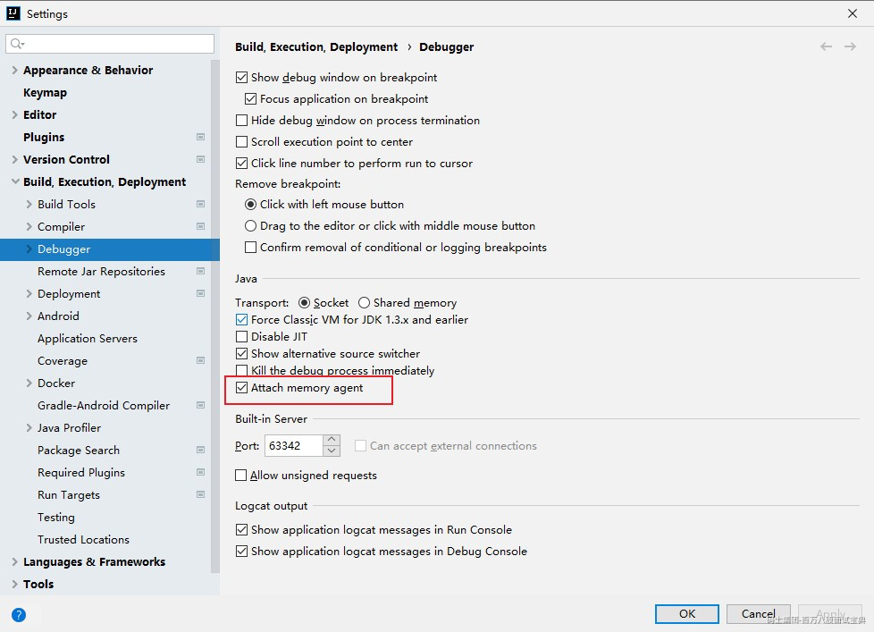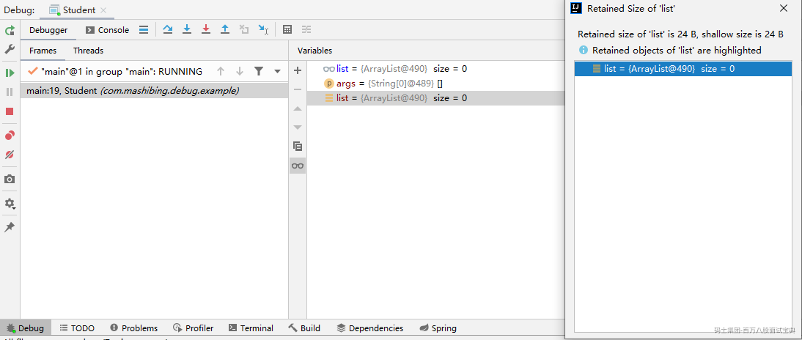

计算保留的大小 对于每个类的实例，你可以计算它的保留大小。保留大小是指对象本身和它所引用的所有对象以及 没有被其他对象引用的对象所占据的内存量。

这在估算重型单体或从磁盘上读取的数据（例如，复杂的JSON）的内存占用时，可能很有用。另 外，在决定使用哪种数据结构时（例如，ArrayList与LinkedList），这也很有用。

在运行应用程序之前，确保在设置/首选项|构建、执行、部署|调试器中启用附加内存代理选项。 在查看类的实例时，右键单击一个实例并单击计算保留大小。

**4 案例解析**

**4.1 热身-事故1：redis锁处理幂等性失效**

/\*\*

\* 接口需要幂等，此处身份证号不允许重复

\* @param user

\*/

@Override

@Transactional(rollbackFor = Exception.class)

public void add(User user) {

log.info("add user params user:{}", JSON.toJSONString(user)); Assert.isTrue(StringUtils.isNotBlank(user.getIdCard()), "身份证号不允许null"); String key = "key";

RLock lock = redissonClient.getLock(key);

lock.lock();

try {

LambdaQueryWrapper<User> wrapper = new LambdaQueryWrapper<User>()

.eq(User::getIdCard, user.getIdCard()); long count = userMapper.selectCount(wrapper); if (count == 0) {

userMapper.insert(user);

}

} catch (Exception e) {

log.error("add user error", e);

} finally {

lock.unlock();

}

}

以上代码问题：

1：对事物的理解使用有问题，幂等设计bug

2：redis锁使用有问题（单独案例讲述） 扩展：

事务在生产实践中经常犯的错误： 事务范围：应该加入事务的代码未加入到事务中 下图是另一个真实生产当中的事故-仅供参考：

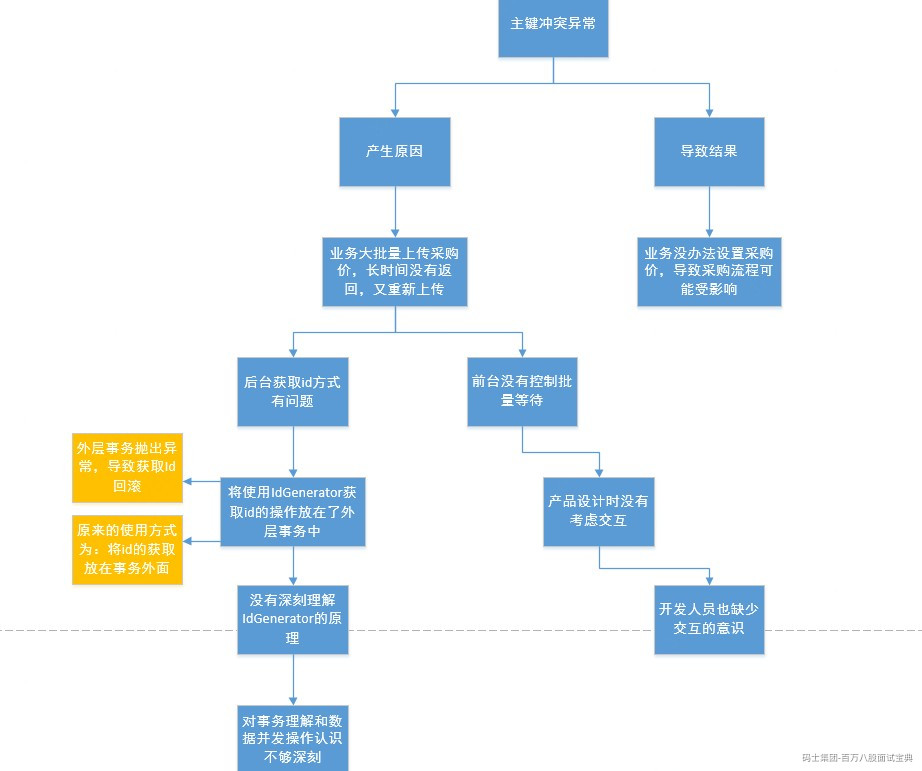

事务大小：事务过大，是否有必要拆解小事务（如何优化），拆解后一致性问题。

传播范围（异常标注）： 多线程中不可传播

多个方法内如果异常被捕获将要被标记为异常事务，不可以再次提交（虽然不影响数据，但是有报 错信息）

**4.1.1 幂等性设计方法**

幂等性设计：

1. 有时我们在填写某些 form表单 时，保存按钮不小心快速点了两次，表中竟然产生了两条重 复的数据，只是id不一样。

2. 我们在项目中为了解决 接口超时 问题，通常会引入了 重试机制 。第一次请求接口超时了， 请求方没能及时获取返回结果（此时有可能已经成功了），为了避免返回错误的结果（这种 情况不可能直接返回失败吧？），于是会对该请求重试几次，这样也会产生重复的数据。

3. mq消费者在读取消息时，有时候会读取到 重复消息 ，如果处理不好，也会产生重复的数 据。

4. 没错，这些都是幂等性问题。

接口幂等性 **是指用户对于同一操作发起的一次请求或者多次请求的结果是一致的，不会因 为多次点击而产生了副作用。**

这类问题多发于接口的：

insert 操作，这种情况下多次请求，可能会产生重复数据。

update 操作，如果只是单纯的更新数据，比如： update user set status=1 where id=1 ，是没有问题的。如果还有计算，比如： update user set status=status+1

where id=1 ，这种情况下多次请求，可能会导致数据错误。

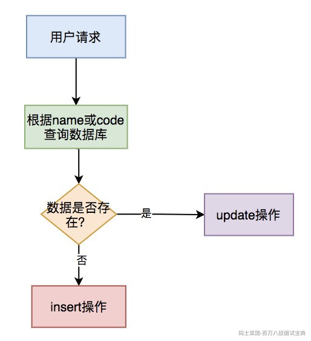

那么我们要如何保证接口幂等性？本课程将会告诉你答案。

**1. insert前先select**

通常情况下，在保存数据的接口中，我们为了防止产生重复数据，一般会在 insert 前，先 根据 name 或 code 字段 select 一下数据。如果该数据已存在，则执行 update 操作，如果不 存在，才执行 insert 操作。

该方案可能是我们平时在防止产生重复数据时，使用最多的方案。但是该方案不适用于并发

场景，在并发场景中，要配合其他方案一起使用，否则同样会产生重复数据。

**2. 加悲观锁**

1）支付场景在加减库存场景中，用户A的账号余额有150元，想转出100元，正常情况下用户A 的余额只剩50元。一般情况下，sql是这样的：

update user amount = amount-100 where id=123;

如果出现多次相同的请求，可能会导致用户A的余额变成负数。这种情况，用户A来可能要哭

了。于此同时，系统开发人员可能也要哭了，因为这是很严重的系统bug。

为了解决这个问题，可以加悲观锁，将用户A的那行数据锁住，在同一时刻只允许一个请求获得 锁，更新数据，其他的请求则等待。

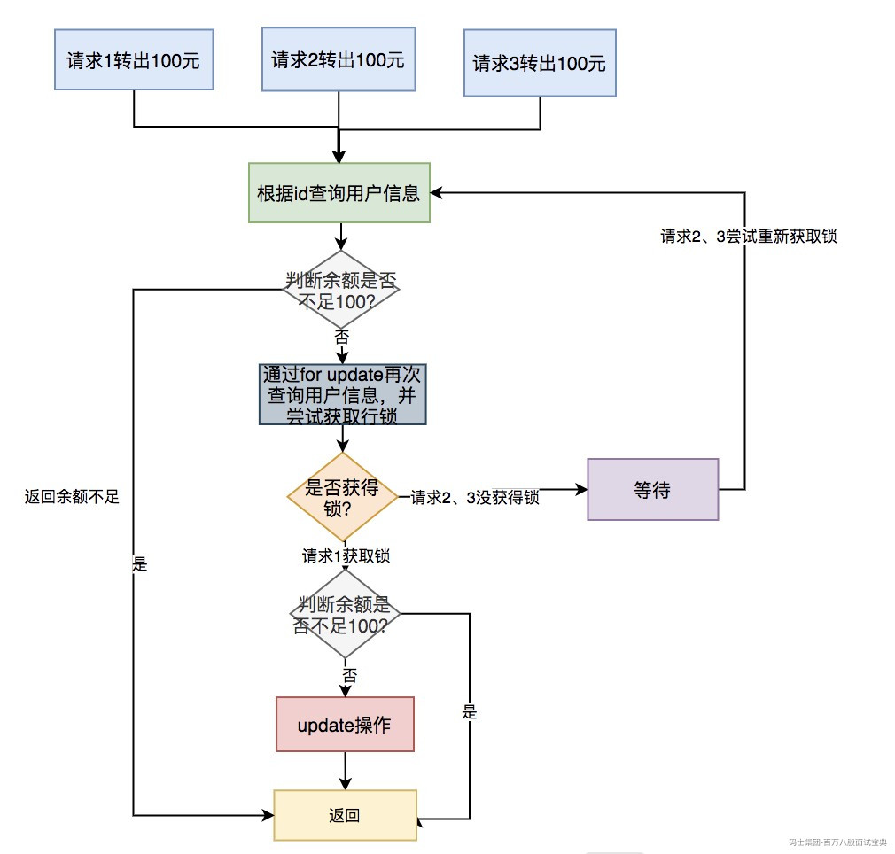

通常情况下通过如下sql锁住单行数据：

select \* from user id=123 for update;

条件：数据库引擎为innoDB

操作位于事务中 具体流程如下：

具体步骤：

1. 多个请求同时根据id查询用户信息。

2. 判断余额是否不足100，如果余额不足，则直接返回余额不足。

3. 如果余额充足，则通过for update再次查询用户信息，并且尝试获取锁。

4. 只有第一个请求能获取到行锁，其余没有获取锁的请求，则等待下一次获取锁的机会。

5. 第一个请求获取到锁之后，判断余额是否不足100，如果余额足够，则进行update操作。

6. 如果余额不足，说明是重复请求，则直接返回成功。

2） **操作库存场景**

select\* from stock\_info where goods\_id=12312 and storage\_id=1 for update; 具体流程：

a:单件货品操作流程

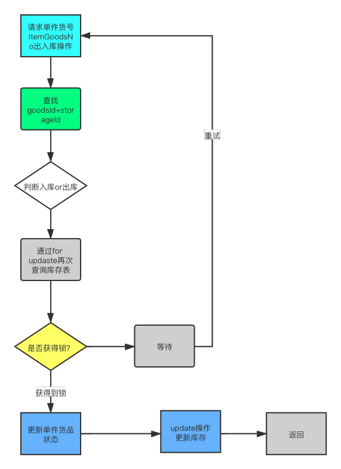

b:（同一个goodsId)多个单件货品，批量操作出库流程

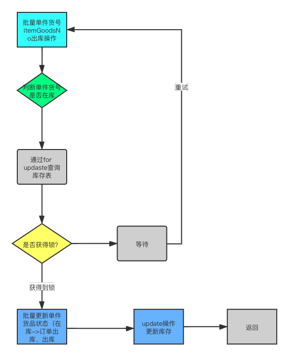

具体步骤：

1. 多个请求同时根据goodsId和storageId操作货品的上下架，或者其他渠道订单批量下架操 作

2. 判断当前货品是否有仓库货品

3. 如果货品库存充足，则通过for update再次查询货品库存信息，并且尝试获取锁。

4. 只有第一个请求能获取到行锁，其余没有获取锁的请求，则等待下一次获取锁的机会。

5. 第一个请求获取到锁之后，进行货品单件明细状态变更，成功后操作，则进行update操作 加减库存。

6. 如果库存不足或者单件不满足操作，则直接返回成功或者幂等状态。

需要特别注意的是：如果使用的是mysql数据库，存储引擎必须用innodb，因为它才支持事 务。此外，这里id字段一定要是主键或者唯一索引，不然会锁住整张表。

悲观锁需要在同一个事务操作过程中锁住一行数据，如果事务耗时比较长，会造成大量的请求等 待，影响接口性能。此外，每次请求接口很难保证都有相同的返回值，所以不适合幂等性设计场 景，但是在防重场景中是可以的使用的。在这里顺便说一下， 防重设计 和 幂等设计 ，其实是有

区别的。防重设计主要为了避免产生重复数据，对接口返回没有太多要求。而幂等设计除了避免产 生重复数据之外，还要求每次请求都返回一样的结果。

**3. 加乐观锁**

既然悲观锁有性能问题，为了提升接口性能，我们可以使用乐观锁。需要在表中增加一个

timestamp 或者 version 字段，这里以 version 字段为例。

在更新数据之前先查询一下数据：

select id,amount,version from user id=123;

如果数据存在，假设查到的 version 等于 1 ，再使用 id 和 version 字段作为查询条件更新数据：

update user set amount=amount+100,version=version+1 where id=123 and version=1;

更新数据的同时 version+1 ，然后判断本次 update 操作的影响行数，如果大于0，则说明本次更

新成功，如果等于0，则说明本次更新没有让数据变更。

由于第一次请求 version 等于 1 是可以成功的，操作成功后 version 变成 2 了。这时如果并发的 请求过来，再执行相同的sql：

update user set amount=amount+100,version=version+1where id=123 and version=1;

该 update 操作不会真正更新数据，最终sql的执行结果影响行数是 0 ，因为 version 已经变成 2

了， where 中的 version=1 肯定无法满足条件。但为了保证接口幂等性，接口可以直接返回成功， 因为 version 值已经修改了，那么前面必定已经成功过一次，后面都是重复的请求。

具体流程如下：

id version

update user set amount=amount+100.version

whe!re id=123 and versio

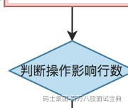

ersion+1

=1;

1

0

E

l ;d .'0'.. V8fSlon

2 idverSlonwhereversion t-1

3 1 .

3 0 .

**4. 加唯一索引**

绝大数情况下，为了防止重复数据的产生，我们都会在表中加唯一索引，这是一个非常简单，并 且有效的方案。

alter table `order` add UNIQUE KEY `un\_code` (`code`);

加了唯一索引之后，第一次请求数据可以插入成功。但后面的相同请求，插入数据时会报

Duplicate entry '002' for key 'order.un\_code 异常，表示唯一索引有冲突。

虽说抛异常对数据来说没有影响，不会造成错误数据。但是为了保证接口幂等性，我们需要对该 异常进行捕获，然后返回成功。

如果是 java 程序需要捕获： DuplicateKeyException 异常，如果使用了 spring 框架还需要捕 获： MySQLIntegrityConstraintViolationException 异常。

具体流程图如下：

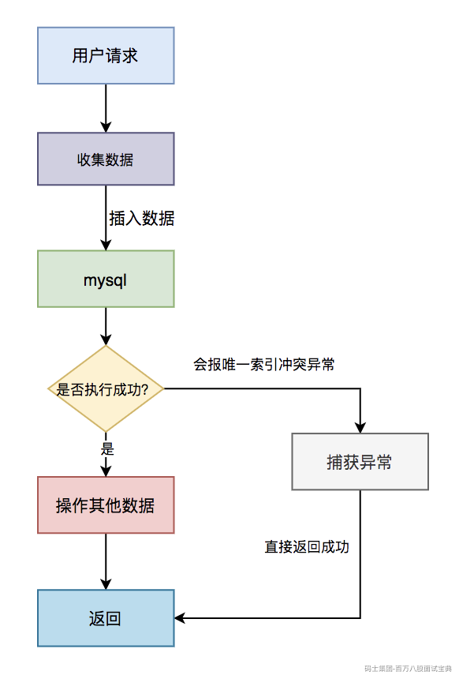

具体步骤：

1. 用户通过浏览器发起请求，服务端收集数据。

2. 将该数据插入mysql

3. 判断是否执行成功，如果成功，则操作其他数据（可能还有其他的业务逻辑）。

4. 如果执行失败，捕获唯一索引冲突异常，直接返回成功。

思考:

在很多业务场景中，都使用“软删除”即使用flag或is\_deleted等字段表示记录是否被删除，这 种方式能很好地保存“历史记录”，但由于”历史记录”的存在，导致无法在表上建立唯一索引， 需要通过程序来控制”数据唯一性”，其中一种程序实现逻辑就是“先尝试更新，更新失败则插 入”，该方式在高并发下死锁频发。（select for update ；为什么？你能复现么？如何避免？）

尽管可以通过程序来控制”数据唯一性”，但仍建议使用数据库级别的唯一约束来确保数据在表 级别的”唯一”，对于”硬删除”方式，直接在唯一索引列上建立为唯一索引即可，对于”软删 除”方式，可以通过复合索引方式来处理。

假设当前有订单相关的表tb\_order\_worker，表中有order\_id字段需要唯一约束，使用is\_delete字段来标识记

录是否被”软删除”，is\_delete=1时表示记录被删除，is\_delete=0时表示记录未被删除，需要控制满足 is\_delete=0时的记录中order\_id唯一，如果对(order\_id,is\_delete)的建唯一索引，那么当同一订单被多次” 软删除”时就会出现唯一索引冲突的问题。

解决方式一：提升is\_delete列的取值范围，当is\_delete=0时表示记录有效，当is\_delete>0时

表示记录被删除，在删除记录时将is\_delete值设置为不同数值，只要确保相同order\_id的记录使 用不同数值即可(很多表都使用自增主键，可以取自增主键的值来作为is\_delete值)。

解决方式二：新增列order\_rid来保持方式一中is\_delete的原有取值范围，当is\_delete时设置order\_rid=0，

当is\_delete=1时设置order\_rid为任意非0值，只要确保相同order\_id的记录使用不同值即可(同样建议参照自 增主键值来设置)，然后对(order\_id,yn,order\_rid)建唯一索引

**唯一索引和普通索引的区别？**

**查询**

select \* from t\_user where id\_card =1000; 对于普通索引来说，查找到满足条件的第一个记录(1,1000)后，需要查找下一个记录，直到碰到第

一个不满足id\_card=1000条件的 记录。

对于唯一索引来说，由于索引定义了唯一性，查找到第一个满足条件的记录后，就会停止继续检 索。

性能差距微乎其微，因为mysql 数据是按照数据页为单位的，也就是说，当读取一条数据的时 候，会将当前数据所在页都读入到内存，普通索引无非多了一次判断是否等于 的操作，相当于指 针的寻找和一次计算，当然，如果该页码上，id\_card=1000是最后一个数据，那么就需要取下一 个页了，但是这种概率并不大。

总结说，查询上，普通索引和唯一索引性能是没什么差异的

**更新**

当需要更新一个数据页时，如果数据页在内存中就直接更新，而如果这个数据页还没有在内存中的 话，在不影响数据一致 性的前提下，InooDB会将这些更新操作缓存在change buffer中，这样就 不需要从磁盘中读入这个数据页了。在下次查询 需要访问这个数据页的时候，将数据页读入内 存，然后执行change buffer中与这个页有关的操作。通过这种方式就能保证 这个数据逻辑的正

确性。

这个change buffer通常被称为InnoDB的写缓冲？

在MySQL5.5之前，叫插入缓冲(insert buffer)，只针对insert做了优化；现在对delete和update

也有效，叫做写缓冲(change buffer)。

它是一种应用在非唯一普通索引页(non-unique secondary index page)不在缓冲池中，对页进 行了写操作，并不会立刻将磁盘页加载到缓冲池，而仅仅记录缓冲变更(buffer changes)，等未来 数据被读取时，再将数据合并(merge)恢复到缓冲池中的技术。

写缓冲的目的是降低写操作的磁盘IO，提升数据库性能。 对于唯一索引来说，所有的更新操作都要先判断这个操作是否违反唯一性约束。比如，要插入

(1,1000)这个记录，就要先判 断现在表中是否已经存在id\_card=1000的记录，而这必须要将数据

页读入内存才能判断。如果都已经读入到内存了，那直接更新内 存会更快，就没必要使用change buffer了。 因此，唯一索引的更新就不能使用change buffer，实际上也只有普通索引可以使用。

接着分析InnoDB更新流程 第一种情况是，该记录要更新的目标页在内存中。 处理流程如下：

对于唯一索引来说，找到999和1001之间的位置，判断到没有冲突，插入这个值，语句执行结 束；

对于普通索引来说，找到999和1001之间的位置，插入这个值，语句执行结束。 这样看来，普通索引和唯一索引对更新语句性能影响的差别，只是一个判断，只会耗费微小的

CPU时间。

真正影响性能的是第二种情况是，这个记录要更新的目标页不在内存中。处理流程如下： 对于唯一索引来说，需要将数据页读入内存，判断到没有冲突，插入这个值，语句执行结束； 对于普通索引来说，则是将更新记录在change buffer，语句执行就结束了。

**总结**

将数据从磁盘读入内存涉及随机IO的访问，是数据库里面成本最高的操作之一。change buffer因 为减少了随机磁盘访问， 所以对更新性能的提升是会很明显的。

因此，对于写多读少的业务来说，页面在写完以后马上被访问到的概率比较小，此时change buffer的使用效果最好。

这种 业务模型常见的就是账单类、日志类的系统。 反过来，假设一个业务的更新模式是写入之后马上会做查询，那么即使满足了条件，将更新先记录

在change buffer，但之 后由于马上要访问这个数据页，会立即触发merge过程。这样随机访问

IO的次数不会减少，反而增加了change buffer的维 护代价。所以，对于这种业务模式来说，

change buffer反而起到了副作用。

redo log 主要节省的是随机写磁盘的IO消耗（转成 顺序写）， 而change buffer主要节省的则是随机读磁盘的IO消耗。

**5. 建防重表**

l

- 1. .

]L

id - namecod

9 - : pauìpaì\_0001

:

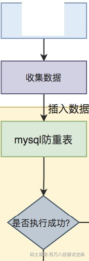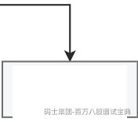

:

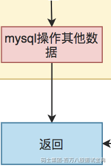

1. lttìXlJ

| :

**6. 根据状态机**

很多时候业务表是有状态的，比如订单表中有：1-下单、2-已支付、3-完成、4-撤销等状态。 如果这些状态的值是有规律的，按照业务节点正好是从小到大，我们就能通过它来保证接口的幂等 性。

假如id=123的订单状态是 已支付 ，现在要变成 完成 状态。

update `order` set status=3 where id=123 and status=2;

第一次请求时，该订单的状态是 已支付 ，值是 2 ，所以该 update 语句可以正常更新数据，sql

执行结果的影响行数是 1 ，订单状态变成了 3 。

后面有相同的请求过来，再执行相同的sql时，由于订单状态变成了 3 ，再用 status=2 作为条 件，无法查询出需要更新的数据，所以最终sql执行结果的影响行数是 0 ，即不会真正的更新数 据。但为了保证接口幂等性，影响行数是 0 时，接口也可以直接返回成功。

具体流程图如下：

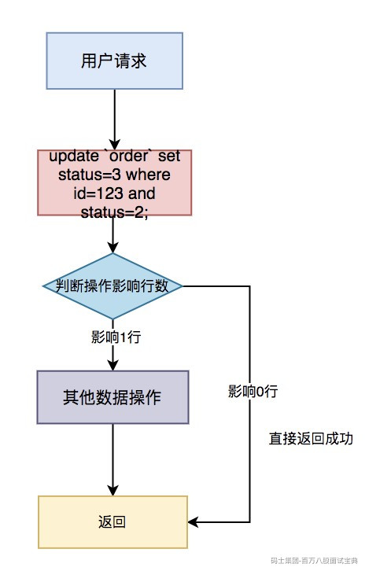

具体步骤：

1. 用户通过浏览器发起请求，服务端收集数据。

2. 根据id和当前状态作为条件，更新成下一个状态

3. 判断操作影响行数，如果影响了1行，说明当前操作成功，可以进行其他数据操作。

4. 如果影响了0行，说明是重复请求，直接返回成功。

主要特别注意的是，该方案仅限于要更新的 表有状态字段 ，并且刚好要更新 状态字段 的这 种特殊情况，并非所有场景都适用。

**7. 加分布式锁**

|

- redis zookeeper

redis

1. setNx

2. set

3. Redíssíon

i :

codeset

redís :

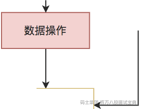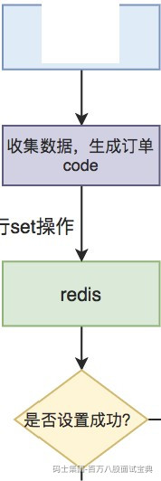

E

:

1. code -

2. redís set code Dredís

3. -

4. 如果设置失败，说明是重复请求，则直接返回成功。

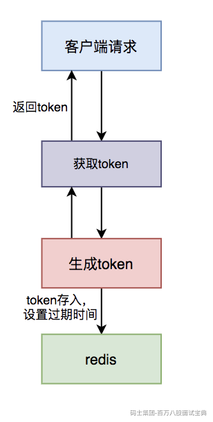

需要特别注意的是：分布式锁一定要设置一个合理的过期时间，如果设置过短，无法有效的 防止重复请求。如果设置过长，可能会浪费 redis 的存储空间，需要根据实际业务情况而 定。

**8. 获取token**

除了上述方案之外，还有最后一种使用 token 的方案。该方案跟之前的所有方案都有点不一样， 需要两次请求才能完成一次业务操作。

1. 第一次请求获取 token

2. 第二次请求带着这个 token ，完成业务操作。 具体流程图如下：

第一步，先获取token。

第二步，做具体业务操作。

token

redistoken

E3

:!E

1 l(token .

2 ßlitoken :lJredis .

3 :token.

4 redis'token -

5 .

6 redistoken .

.

:

token

redistoken

\

1

0

E

l :

**事故名称**

自动还款业务事故

**事故描述**

事故发生时间：201x-0x-18 0x:15:00 事故响应时间：201x-0x-20 0x:18:00 事故解决时间：201x-0x-20 0x:28:00 **事故现象：**

自动扣款,出现扣款重复,同一用户在当天扣款多次. **事故造成影响** 重复给n个用户扣款，重复扣款的多支付金额部分已退款给用户。 **事故发生原因**

1.自动还款的防重有问题，当出现并发进行消费MQ时，通过读库的防重是不起作用的。

**事故解决过程描述**

1、0x:15左右：收到运营人员的反馈，自动扣款有几笔在x.18号进行重复扣款.

2、0x:18左右：进行线上排查，在数据库里发现同一笔用户在当天有多笔的扣款数据信息，并且 时间上都是同一时间内。

3、0x:20左右：调取线上的相关日志，分析 MQ在同一秒内推送了3~5条一样的消息进来,走查代 码发现防重是通过uuid来查询数据库，如果查询没有数据信息，则insert一条新数据。

4、0x:25左右：排查线上数据库对uuid的唯一性约束，发现线上没有做uuid的唯一性约束.

5、0x:28左右 : 提工单将uuid做成唯一性约束.

6、201x-0x-21 8:00 左右，验证线上数据，没有重复扣款的记录信息，扣款正常。

**事故总结教训**

1、 **强化对于防重技术的实现，防重通过读是解决不了的（并发情况也需要考虑）,通过写防重是 更好的解决办法**

2、 针对于数据库表字段的唯一性的字段的处理，检查是否增加唯一性的约束条件。

3、 **消费MQ消息必做防重处理。**

4、加强业务逻辑上的监控，针对于同一用户在当天执行多次扣款进行监控告警处理。

**4.1.3 金融场景幂等性思考**

重复出款特指代付或者转账场景下，服务消费者A重复向服务提供者B发起的重复交易，导致资金 损失；后续特指各类重复金融性交易导致的资金损失。出错的原因如下：

**1、程序逻辑错误：**

1）状态控制出错：由于程序、网络和系统异常等原因，A未得到B答复，A发起了新交易。

2）未做幂等性设计：由于A未收到B明确响应，A发起重试交易，B未做幂等性处理，重复交易。

**2、跨会计日场景**

1）由于A发起交易为T日，而B处理交易为T+1日，所以A未收到T日的结果，可能再次发起交易。

2）有些系统没有会计日，是按照机器时间为准，A和B的交易时间不一致，导致重复出款

**3、多任务并发：** 通常是指定时任务中，同一个定时任务并发处理的资源导致。

**4、提交并发：** 也就是防重复提交指引提到的。

**5、服务器异常：** 由于服务异常崩溃，消息或者缓存信息丢失，等服务器重启后，可能导致。

**设计原则：**

1. 先扣款，再生成处理订单，宁可长款也不能短款，宽进严出。

2. 数据校验：设置校验规则，同一时间段，同一客户，相同金额的交易发起记录；如果是客户 发起，提示客户确认；如系统发起（例如代付），建议转人工处理。

3. 状态控制：交易状态为，成功、失败、未知（或处理中），对于未知状态，不能再重复自动 发起。

4. 时间控制：对于未实现24小时服务的应用，尽可能避免在23点30后做出款处理。

5. 提交并发控制：审核提交等做防重复提交控制。

6. 定时并发控制：禁止提交同一个文件给多个定时任务。

7. 对账及差错处理：要对交易进行对账，并对差错交易进行差错处理。

相关阅读：

[**支付系统的防重设计 (qq.com)**](https://mp.weixin.qq.com/s/gsaSYfXrQ2DZbmjMqV8HFA)

**4.1.4 服务间超时处理**

在一个很普遍的场景中，涉及到双端通信的情况下，不论是传统的单机服务，还是现在的微服务，甚至 事异步通信技术（进程内，进程与进程），一直都存在着三态的问题，即成功，失败，超时。

如下图两个服务间：

成功失败具有明确的业务语义和边界，正常处理即可。最复杂的就是超时，因为网络通信原因，双端都 不总是确定，到底哪个环节超时。

超时点：

1-请求超时

2-服务端内部处理超时：比如操作耗时的资源，调用第三方系统等造成客户端请求整体超时而主动断开 连接

3-服务端处理正常，但响应结果阶段超时

**处理：**

**客户端** ：无论那个阶段，客户端都不确定请求是否被应答，即服务端处理的结果，客户端不知道是否成 功。客户端此时能做的，有两种方法：

1-重试，客户端需要主动做好重试方案，比如类似mq的重试队列（1s 5s 10s 30s 1m 2m 3m 4m 5m

6m 7m 8m 9m 10m 20m 30m 1h 2h），主要的技术，spring-retry框组件，将请求扔到自产自销的

mq，依靠mq的重试队列主动重试，或者建立定时任务表重试。

不管哪种方式，需要服务端接口具备幂等性

2-主动查询结果：超时后客户端主动查询，查询的时机类似重试机制，因为快速的查询，并不总是有 效，当发生网络抖动的时候，很大概率就地查询，也是网络抖动阶段。

**服务端**

服务端不存在请求超时和响应超时，但存在自身超时的情况，解决方案：

1-自身rt值需要优化，比如慢sql等

2-以来三方接口的时候，跟第三方接口又形成了一个客户端-服务端模式，根据具体场景或者快速失败， 或者做好容错措施，必要的时候，还会有比如金融领域的冲正操作。

**2-异步调用超时**

异步调用，类似ajax，客户端同步请求，服务端异步响应

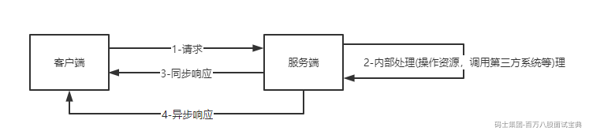

超时点：

1-请求超时

2-服务端内部处理超时：比如操作耗时的资源，调用第三方系统等造成客户端请求整体超时而主动断开 连接

3-服务端处理正常，但响应结果阶段超时

4-异步响应超时

**客户端**

参考同步-客户端

**服务端**

服务端不存在请求超时和同步响应超时，对于内部处理超时，同同步情况一样。那么就只剩下异步响应 超时了。

比较有代表性的就是支付结果通知，可参考： [**支付结果通知文档**](https://pay.weixin.qq.com/wiki/doc/api/native.php?chapter=9_7&amp;index=8)

存在此问题就是服务端通知客户端的时候（客户端需要同步提供响应服务端结果通知的接口），未接受 到客户端的响应。

**3-MQ超时**

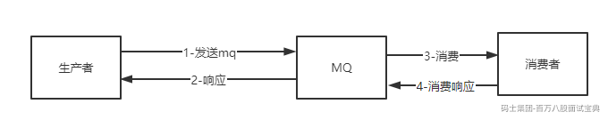

在此处讨论的超时，其实相当于另外一个话题，如何保证mq不丢消息，无论是kafka和RocketMQ，都 支持ack的机制，用以确认消息的发送和接受的成功

**4.2 事故2：CPU飙高**

CPU飙高的现象很常见，但其实发现和解决起来并不是特别复杂，此处列举一些常见的CPU飙高案例， 并给出解决方案和相关故障排查解决过程。

分析之前，复习几个知识点：

CPU性能指标：

load average：负载，linux查看的时候，通常显示如下：

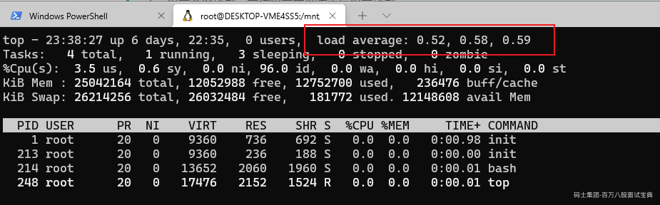

代表了系统1分钟，5分钟，15分钟平均负载。

[形象的类比可参考 **Understanding Linux CPU Load - when should you be worried? | Scout**](https://scoutapm.com/blog/understanding-load-averages)

[**APM Blog**](https://scoutapm.com/blog/understanding-load-averages)

另一个形象地比喻： [**CPU的load和使用率傻傻分不清 - 昀溪 - 博客园 (cnblogs.com)**](https://www.cnblogs.com/rexcheny/p/9382396.html)

上图1个电话亭可以理解为一个CPU核心。从上图的过程中可以看到load的概念，而使用率始终100%。

**使用率**

%Cpu(s):用户空间占用CPU百分比

%CPU：上次更新到现在的CPU时间占用百分比

**查看**

cat /proc/cpuinfo

grep -c 'model name' /proc/cpuinfo

实验1：观察CPU使用率

启动：java -jar 2\_cpu-0.0.1-SNAPSHOT.jar 8 > log.file 2>&1 &

实验2：定位CPU标高

方法1：

1-启动：java -jar 2\_cpu-0.0.1-SNAPSHOT.jar 8 > log.file 2>&1 &

2-一般来说，应用服务器通常只部署了java应用，可以top一下先确认，是否是java应用导致的：命令：top

3-如果是，查看java进场ID，命令：jps -l

4-找出该进程内最好非CPU的线程，命令：top -Hp pid 25128

5-将线程ID转化为16进制，命令：printf "%x\n" 线程ID 623c 25148

6-导出java堆栈信息，根据上一步的线程ID查找结果：命令：

jstack 11976 >stack.txt grep 2ed7 stack.txt -A 20

方法2：

在线工具：<https://gceasy.io/ft-index.jsp>

1-方法1中导出的对快照文件，上传到该网站即可

**4.2.1 序列化问题引起的应用服务CPU飙高**

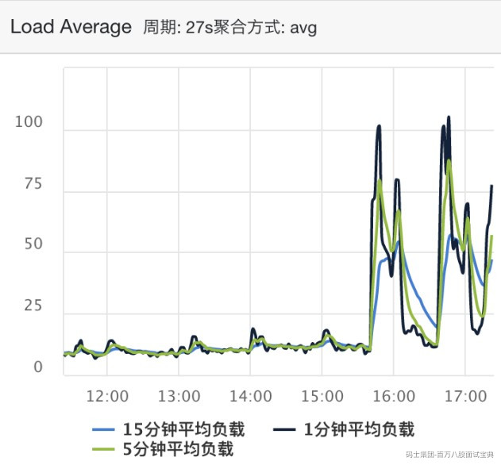

1.发现问题

7.8日 17:09监控大盘发现xxx-web的CPU快跑满，导致机器不断扩容增加机器。 平均负载图如下：

CPU利用率：

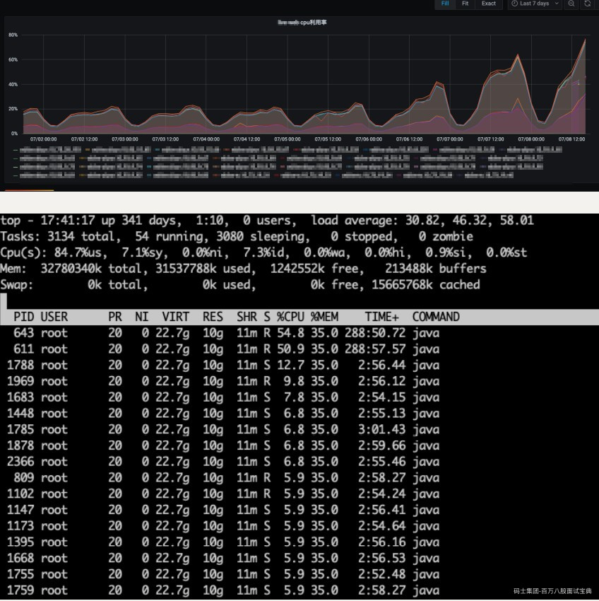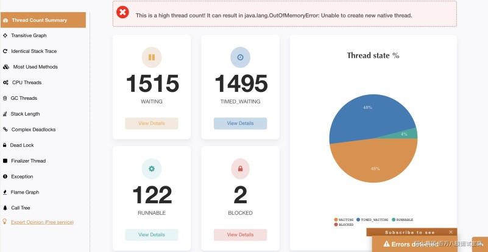

2.分析阶段

根据对线程dump文件进行分析，主要是否存在死锁、阻塞现象，以及CPU线程的占用情况，分析 工具采用在线fastThread工具。地址： [**https://gceasy.io/ft-index.jsp**](https://gceasy.io/ft-index.jsp)

（1）查看线程数情况 数据图示可知，创建的线程等待线程有3000，提示高线程数可能导致内存泄露异常，从而可能影

响后面任务的创建线程。

（2）查看当前CPU线程使用情况

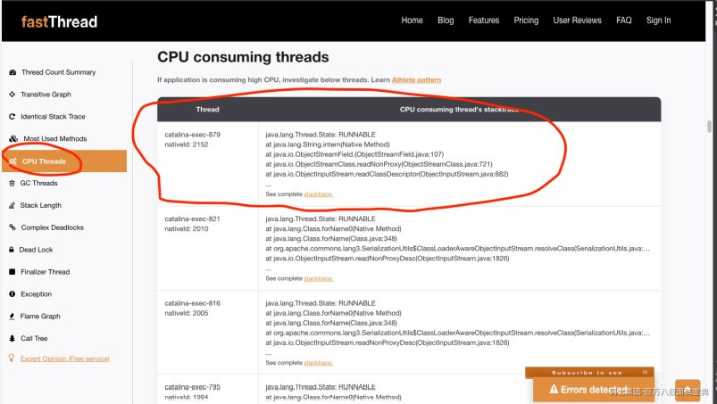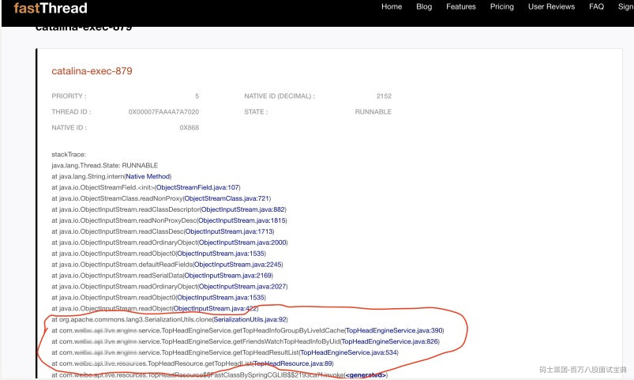

根据CPU线程情况，查询CPU正在执行的线程堆栈列表，可以发现大部分日志都是类似于：

catalina-exec-879

（3）定位出现问题的线程堆栈

查看是新版头像圈的一段代码逻辑，其中有个步骤需要深拷贝对象，以便以后逻辑更改使用。

3.问题恢复

从而猜测可能是跟8号开放一批白名单规则用户有关，所以临时采用更改config的白名单策略配 置，降低灰度用户范围。通过配置推送后，CPU利用率恢复正常情况。

调整后机器CPU利用率：

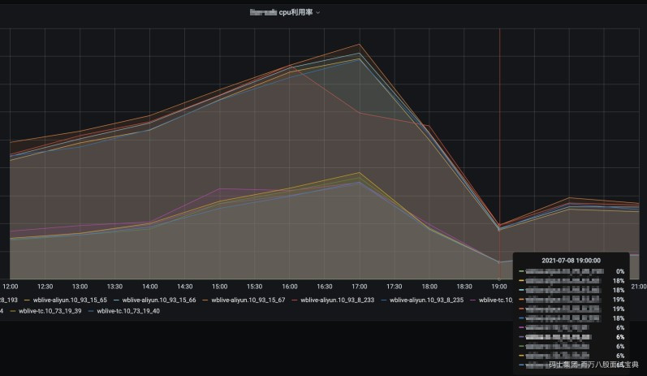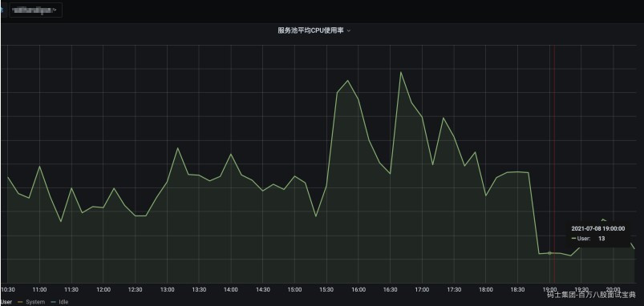

服务池平均CPU利用率情况如下：

4.相关代码：

public Map<String, TopHeadInfoV3> getTopHeadInfoGroupByLiveIdCache(){

Map<String, TopHeadInfoV3> topHeadInfoGroupByLiveIdMap =

topHeadInfoGroupByLiveIdCache.getUnchecked("top\_head\_info\_group\_by\_live\_id");

if (MapUtils.isEmpty(topHeadInfoGroupByLiveIdMap)) {

return Collections.emptyMap();

}

// guava cache 对象对外不可⻅，防⽌上游对cache⾥对象进⾏修改，并发场景下出现问题 Map<String, TopHeadInfoV3> topHeadInfoGroupByLiveIdMapDeepCopy =

Maps.newHashMapWithExpectedSize(topHeadInfoGroupByLiveIdMap.size());

for (Map.Entry<String, TopHeadInfoV3> entry : topHeadInfoGroupByLiveIdMap.entrySet()) { topHeadInfoGroupByLiveIdMapDeepCopy.put(entry.getKey(), SerializationUtils.clone(entry.getValue()));

}

return topHeadInfoGroupByLiveIdMapDeepCopy;

}

其中影响性能的问题方法是apache commongs工具包提供的对象克隆工具：

SerializationUtils.clone(entry.getValue()))，基本操作就是利用ObjectInputStream和Object

OutputSTream进行，先序列化再发序列化。频繁克隆且耗时较长，导致占用其他任务的执行。

// Clone

//-----------------------------------------------------------------------

/\*\*

\* 
Deep clone an {@code Object} using serialization.

\*

\* 
This is many times slower than writing clone methods by hand

\* on all objects in your object graph. However, for complex object

\* graphs, or for those that don't support deep cloning this can

\* be a simple alternative implementation. Of course all the objects

\* must be {@code Serializable}.

\*

\* @param <T> the type of the object involved

\* @param object the {@code Serializable} object to clone

\* @return the cloned object

\* @throws SerializationException (runtime) if the serialization fails

\*/

public static <T extends Serializable> T clone(final T object) {

if (object == null) {

return null;

}

final byte[] objectData = serialize(object);

final ByteArrayInputStream bais = new ByteArrayInputStream(objectData);

try (ClassLoaderAwareObjectInputStream in = new

ClassLoaderAwareObjectInputStream(bais, object.getClass().getClassLoader())) {

/\*

\* when we serialize and deserialize an object,

\* it is reasonable to assume the deserialized object

\* is of the same type as the original serialized object

\*/

@SuppressWarnings("unchecked") // see above final T readObject = (T) in.readObject(); return readObject;

} catch (final ClassNotFoundException ex) {

throw new SerializationException("ClassNotFoundException while reading cloned object data", ex);

} catch (final IOException ex) {

throw new SerializationException("IOException while reading or closing cloned object data", ex);

}

}

源代码注释：

使用序列化来深度克隆一个对象。

这比在你的对象图中的所有对象上手工编写克隆方法要慢很多倍。然而，对于复杂的对象图，或者那些不 支持深度克隆的对象，这可以是一个简单的替代实现。当然，所有的对象必须是可序列化的。

5.优化方案 经过讨论临时采用创建对象和属性设置的方式进行对象复制，先不采用对象序列化工具。实现

java.lang.Cloneable接口并实现clone方法。

主要对象拷贝代码如下：

@Override

public TopHeadInfoV3 clone() {

Object object = null;

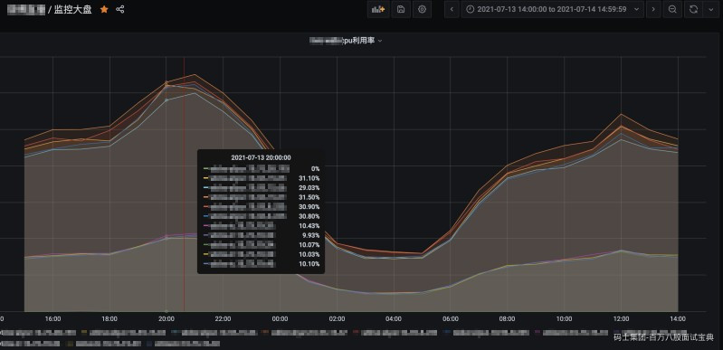

try {

object = super.clone();

} catch (CloneNotSupportedException e) {

return null;

}

TopHeadInfoV3 topHeadInfoV3 = (TopHeadInfoV3) object; topHeadInfoV3.playEnums = Sets.newHashSet(topHeadInfoV3.playEnums); topHeadInfoV3.recallTypeEnums = Sets.newHashSet(topHeadInfoV3.recallTypeEnums); topHeadInfoV3.behaviorEnums = Sets.newHashSet(topHeadInfoV3.behaviorEnums); topHeadInfoV3.micLinkUserList =

topHeadInfoV3.micLinkUserList.stream().map(MicLinkUser::clone).collect(Collectors.toList());

return topHeadInfoV3;

}

6.上线情况

优化方案上线，13号下午两点全量后，看监控大盘cpu利用率为正常情况，cpu利用率如下：

7.问题总结

针对相对大流量的接口可以提前做好压测分析； 上线后定期通过监控大盘查看线上运行情况，留意机器监控告警便于及时发现问题； 若告警或大盘发现问题CPU或内存使用情况异常，其中可以打印线程堆栈日志，通过堆栈分析工

具帮助分析线程使用的情况。

序列化参考： [**Home · eishay/jvm-serializers Wiki · GitHub**](https://github.com/eishay/jvm-serializers/wiki)

**4.2.2 FULL GC引起的应用服务CPU飙高**

报表worker-CPU使用率过高【618备战】 一、排查过程

1：查看机器监控，初步判断可能有耗CPU的线程

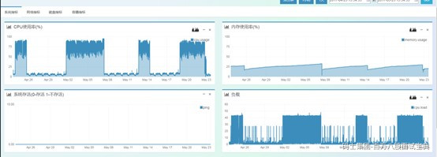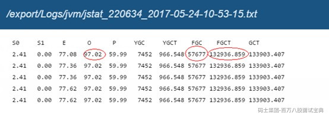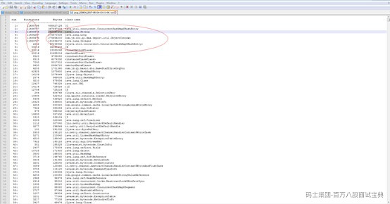

2：导出jstat信息，发现JVM老年代占用过高（达到97%），Full-GC频率超高，FULL-GC总共占

用了36小时。初步定位是频繁FULL-GC导致CPU负载过高。

3：使用jmap –histo导出堆概要信息，发现有个超大的HashMap。

4：使用jmap –dump导出堆。得出hashMap中的KEY是运单号

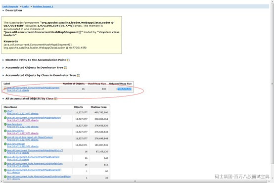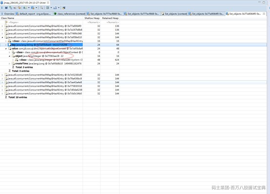

二、总结

1：使用缓存时要做容量估算，并考虑数据增长率

2：缓存要有过期时间。

**gc问题导致调用端出现RpcException问题排查**

场景问题案例解读：

**1、该应用上线弹性数据库后，调用端通过接口查询历史库应用服务时，出现大面积 RpcException，如下图所示**

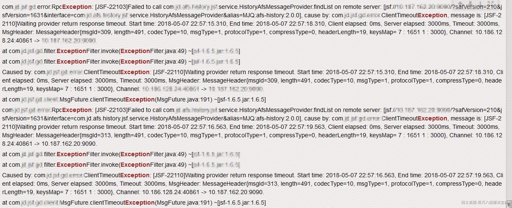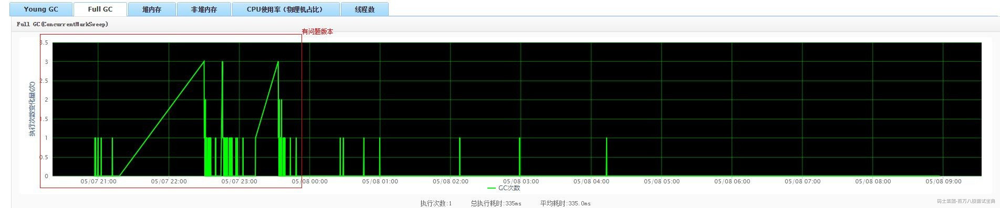

**2、观察该应用，full gc 情况，如下图所示，会出现高频full gc 情况**

**3、观察应用，young gc情况，如下图所示**

**4、查看jvm配置参数时,配置内容如下（可以通过ump、应用配置、堡垒机打印应用信息等方式**

**查看）**

-Xss512k

-Xmn2048m

-XX:+UseConcMarkSweepGC

-XX:+UseCMSInitiatingOccupancyOnly

-XX:+CMSParallelRemarkEnabled

-XX:+CMSClassUnloadingEnabled

-XX:CMSInitiatingOccupancyFraction=60

-XX:CMSInitiatingPermOccupancyFraction=60

-XX:+PrintGCDetails

-XX:+PrintGCTimeStamps

-XX:+PrintClassHistogram

-Xloggc:/export/Logs/jvm/gc.log

**5、通过jstat命令打印内存情况如下图所示**

命令：jstat -gcutil pid

S0 S1 E O P YGC YGCT FGC FGCT GCT

4.26 0.00 73.09 28.36 59.99 3374 427.474 599 1071.941 1499.415

6、之前我们已经配置了jvm参数来打印gc日志，如下所示

66289.394: [GC66289.394: [ParNew: 1685902K->8995K(1887488K), 0.1182020 secs] 2289213K-

>612400K(3984640K), 0.1188790 secs] [Times: user=0.45 sys=0.01, real=0.12 secs]

66312.916: [GC66312.916: [ParNew: 1686819K->8220K(1887488K), 0.1287130 secs] 2290224K-

>611674K(3984640K), 0.1296130 secs] [Times: user=0.48 sys=0.02, real=0.13 secs]

66317.050: [GC [1 CMS-initial-mark: 603454K(2097152K)] 884210K(3984640K), 0.1249350 secs] [Times:

user=0.13 sys=0.01, real=0.12 secs]

66317.176: [CMS-concurrent-mark-start]

66317.567: [CMS-concurrent-mark: 0.391/0.391 secs] [Times: user=1.45 sys=0.06, real=0.40 secs]

66317.567: [CMS-concurrent-preclean-start]

66317.586: [CMS-concurrent-preclean: 0.017/0.018 secs] [Times: user=0.02 sys=0.00, real=0.01 secs]

66317.586: [CMS-concurrent-abortable-preclean-start]

CMS: abort preclean due to time 66322.639: [CMS-concurrent-abortable-preclean: 3.043/5.053 secs] [Times: user=3.36 sys=0.32, real=5.06 secs]

66322.643: [GC[YG occupancy: 525674 K (1887488 K)]66322.643: [Rescan (parallel) , 2.3838210 secs]66325.027: [weak refs processing, 0.0014400 secs]66325.029: [class unloading, 0.0305350 secs]66325.059: [scrub symbol table, 0.0141910 secs]66325.074: [scrub string table, 0.0032960 secs] [1 CMS-remark: 603454K(2097152K)] 1129128K(3984640K), 2.4410070 secs] [Times: user=9.16 sys=0.40, real=2.44 secs]

66325.085: [CMS-concurrent-sweep-start]

66325.444: [CMS-concurrent-sweep: 0.318/0.358 secs] [Times: user=0.51 sys=0.04, real=0.36 secs]

66325.444: [CMS-concurrent-reset-start]

66325.450: [CMS-concurrent-reset: 0.006/0.006 secs] [Times: user=0.01 sys=0.00, real=0.01 secs]

66347.427: [GC66347.427: [ParNew: 1686044K->11073K(1887488K), 0.1323420 secs] 2269768K-

>595648K(3984640K), 0.1330670 secs] [Times: user=0.49 sys=0.02, real=0.13 secs]

**综上所述** ：

通过gc日志可以看到CMS remark阶段耗时较长，如果频繁的full gc且remark时间比较长， 会导致调用端大面积超时,接下来需要通过jstat命令查看内存情况结合配置的jvm启动参数看一下为 啥会频繁的full gc。应用jvm启动参数配置了-XX:CMSInitiatingPermOccupancyFraction=60,持 久带使用空间占60%的时候就会触发一次full gc，由于持久带存放的是静态文件，持久带一般情 况下对垃圾回收没有显著影响。所以可考虑去掉该配置项。

**解决方案：**

持久带用于存放静态文件，如今Java类、方法等， 持久代一般情况下对垃圾回收没有显著影响， 应用启动后持久带使用量占比即接近60%，所以可考虑去掉该配置项。

同时增加配置项-XX:+CMSScavengeBeforeRemark，在CMS GC前启动一次young gc，目的在 于减少old gen对ygc gen的引用，降低remark时的开销(通过上述案例可观察到，一般CMS的GC 耗时 80%都在remark阶段 )

**jvm启动参数更正如下：**

-Xss512k

-XX:+UseConcMarkSweepGC

-XX:+UseCMSInitiatingOccupancyOnly

-XX:CMSInitiatingOccupancyFraction=80

-XX:+CMSScavengeBeforeRemark

-XX:+CMSParallelRemarkEnabled

-XX:+PrintGCDetails

-XX:+PrintGCDateStamps

-Xloggc:/export/Logs/jvm/gc.log

-javaagent:/export/servers/jtrace-agent/pinpoint-bootstrap-1.6.2.jar

-Dpinpoint.applicationName=afs

-Dpinpoint.sampling.rate=100

备注：相比有问题版本，去除了配置项：-XX:CMSInitiatingPermOccupancyFraction=60。

[-XX:CMSInitiatingOccupancyFraction 修改为80（ **Concurrent Mark Sweep (CMS) Collector (oracle.com)** ），添加配置项-XX:+CMSScavengeBeforeRemark,为了个更好的观察](https://docs.oracle.com/javase/8/docs/technotes/guides/vm/gctuning/cms.html) gc日志，修改时间戳打印格式为-XX:+PrintGCDateStamps

**修正后结果如下图所示：**

1、调用端调用服务正常，不再出现rpc exception

2、应用young gc情况如下

3、 应用full gc情况如下

**4.2.3 批处理数据过大引起的应用服务CPU飙高**

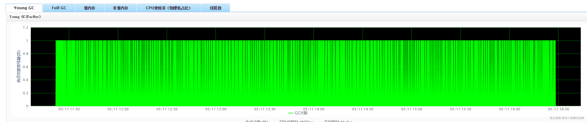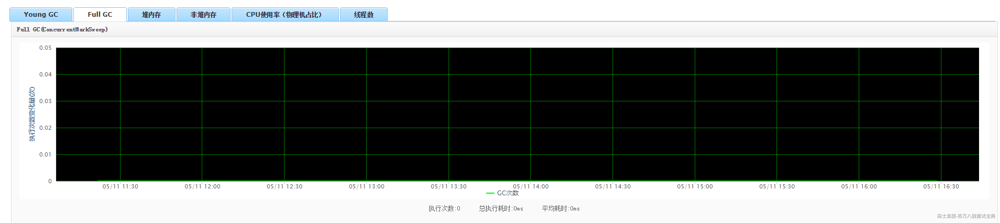

**问题场景**

某定时任务job 收到cpu连续（配置的时间是180s）使用超过90%的报警;

**问题定位**

a) 观察报警中的jvm监控，发现周期性出现即每天8：00，cpu从5%-99%大约持续3分钟左右然 后恢复正常，平时cpu使用率较为平稳（排除因为应用发布导致的cpu升高）；

b) 任务系统周期性出现很可能是定时执行了大量运算导致的，查看任务系统页面，确实存在一个8 点执行的定时任务

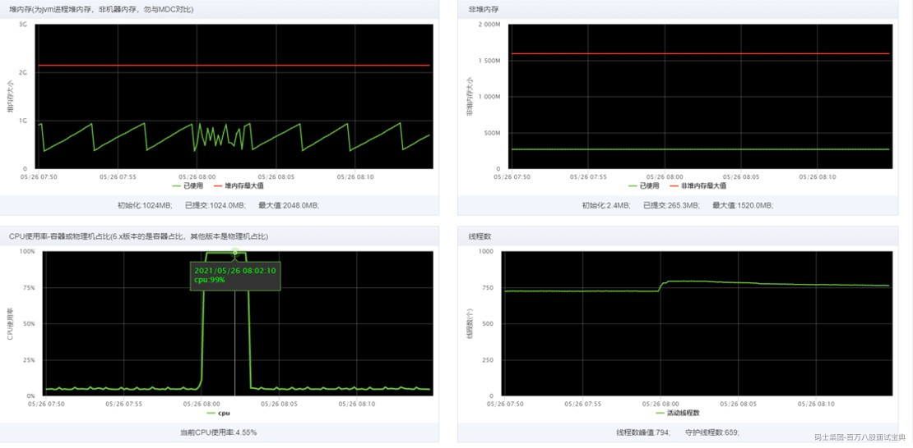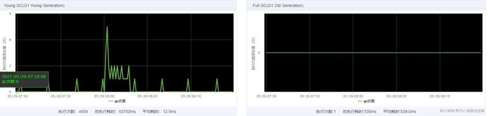

c) 分析代码梳理该任务的业务逻辑为：一个兜底的定时的job任务；其中涉及大量复杂运算，现在 猜测基本是改任务导致的，那么可以复现一下，确认下。

复现操作很简单：

c1）找一台机器，观察jvm相关监控；观察日志

c2) 修改分片数量为1且指定分片容器ip为监控的容器ip， 点击执行分片，查看分片确认成功后， 点击执行一次。通过观察步骤c1）成功复现。

d) 至此基本方向确定是这个任务导致的CPU升高，接下来分析为何CPU升高，以及如何优化问 题。

**问题分析**

1. a)也可能是程序运行过程创建大量对象触发GC，GC线程占用CPU过高导致；b)CPU升高原 因可能是程序大量运算导致；

2. 不管是情况a) 还是情况b) 都需要复现问题，观察使用cpu高的线程有哪些，使用jstack命令 导出线程栈的信息进行观察，观察每个线程CPU使用率

**操作步骤**

1. 预发环境触发任务执行，复现场景。注意：此步骤需要谨慎操作，由于预发和线上是相同的 数据库，所以预发环境部署代码需要把相关的操作屏蔽掉了，比如发送MQ，更新数据库 等。避免影响线上数据和MQ等。

2. 登录堡垒机使用top命令查看目前的进程信息

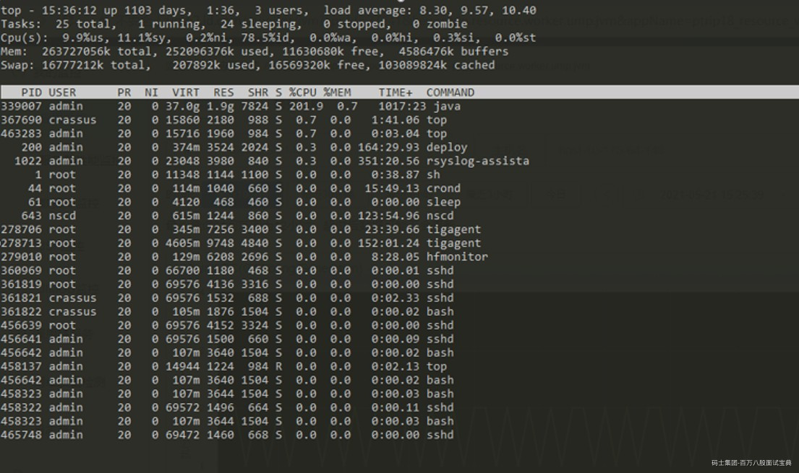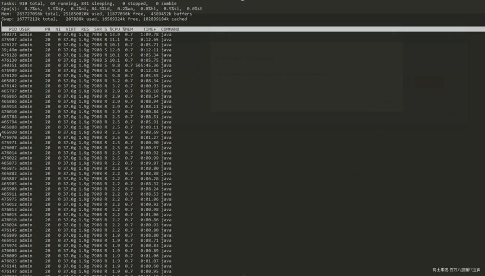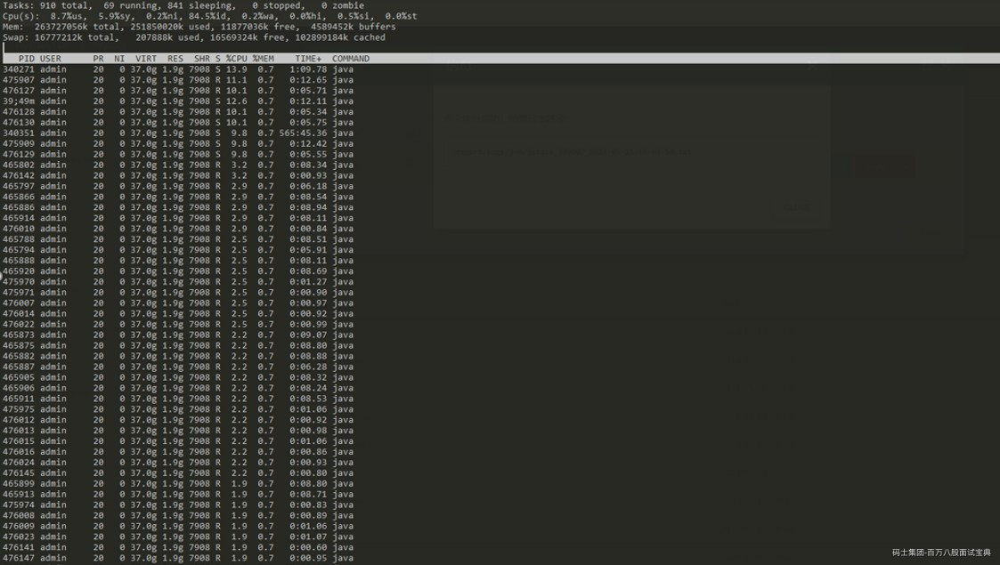

3.发现java进程33907 使用的cpu已经达到200%，使用命令 top-H -p 33907 命令查看该进程下

的哪个线程使用的资源最多

(Ijvm L MDC )

3C

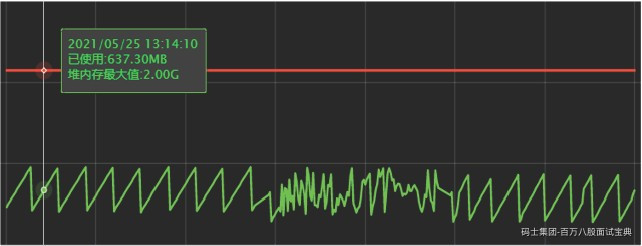

"EU

*2C*

*"*-1<

*E*

*IC*

0

05:25 13.10

5 25 13.20

05; 2513.30 *05* */* *2513**.**40* 05 '2513.50

-8

05 2514;00

5/ 2514.10

05 251

6144MB;

:6144 OMB;

:6144 OMB;

CPU-6x1R:iI> }

100%

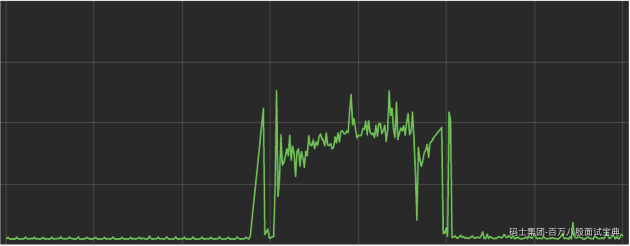

75%

50%

25"

0%

5 25 13'10

5 25 13'20

5 2513'30

05 2513"40

- cpu

05 25 13:50

5'2514'00

052514:10

05251

CPU3 625%

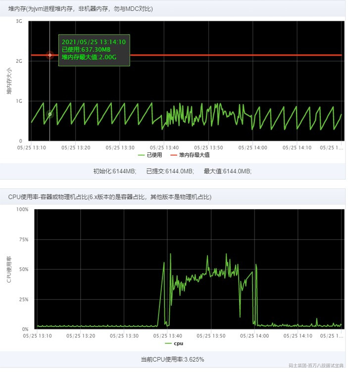

2. 2C4G的机器执行，CPU使用率仍然高达90%，通过分析线程栈的dump文件发现主要是业

务线程占用资源过高，其中不足2%的还有部分是由于并行流导致的，在job执行时候引用的 第三方jar包中，此部分暂时不处理。

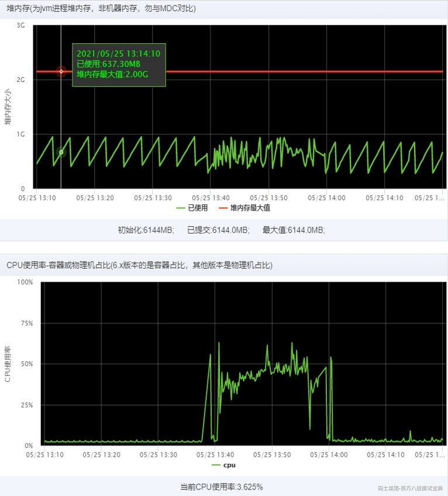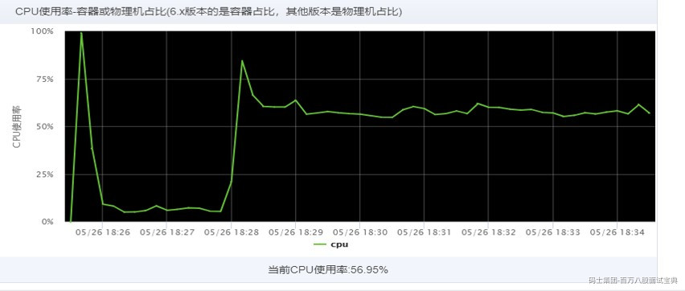

对于2C4G优化方案：a) 由于这个任务是兜底的，不需要立即执行完成，且执行频率为1天1次可以

将线程池调整为1个线程；

b) 申请容器升级为4c\*8G

2C4G配置的执行job单线程跑任务

**问题引申**

parallelStream()原理：

1. parallerlStream是jdk8的特性，是在Stream的基础上实现的并行流式操作；旨在简化并行 编码，提升运算效率；

2. 并行流的底层是基于ForkJoinPool实现的，其中ForkJoinPool采用的思想类似MapReduce 的思想，将一个大的运算任务拆分为子任务（fork的过程）；然后执行所有的子任务运算后 的结果合并在一起（join过程）; 通过分治的方式完成一个计算。

**parallelStream()最佳实践**

**并行流使用问题分析：**

1. 根据parallelSteam的原理我们知道底层是使用的ForkJoinPool；那么我们程序通常会有如 下代码：

//code1

WORDS.entrySet().parallelStream().sorted((a,b)-

>b.getValue().compareTo(a.getValue())).collect(Collectors.toList());

//code2

Set<String> words = new ConcurrentHashSet<>();

words1.parallelStream().forEach(word -> words.add(word.getText()));

2. 那么我们并没有创建ForkJoinPool，且不同的集合都在调用parallerStream(), 那么最终用

的是哪个线程池呢？很显然既然没有报错，就说明jdk应该会给一个默认的ForkJoinPool。 源码如下：

注意：默认的如果使用默认的线程池执行的话，forkJoinPool会使用当前系统默认的cpu核心数 量-1，但是主线程也会参与计算。

执行结果： 可以看出默认的ForkJoinPool线程池，除了worker线程参与运算 ，方法线程也会参 与预算。

**最佳实践总结：**

1. 并行流如果使用，最好使用自定义的线程池，避免使用默认的线程池即线程池隔离思想，造 成阻塞或者资源竞争等问题。

2. parallelStream 适用的场景是CPU密集型的，假如本身电脑CPU的负载很大，那还到处用 并行流，那并不能起到作用，切记不要再paralelSreram操作是中使用IO流；

3. 不要在多线程中使用parallelStream，如本次案例，大家都抢着CPU是没有提升效果，反而 还会加大线程切换开销；

**踩坑记录:**

Runtime.getRuntime().availableProcessors() ；是jdk提供的获取当前系统的可用的核心数，本 次踩坑在于，现在多数应用都是发布在容器中的，虽然应用部署的容器是2C4G的，但是 ForkJoinPool创建的ForkJoinPool.commonPool-worker-线程却有几十个，登录 容器所在的物理机查看机器配置如下：

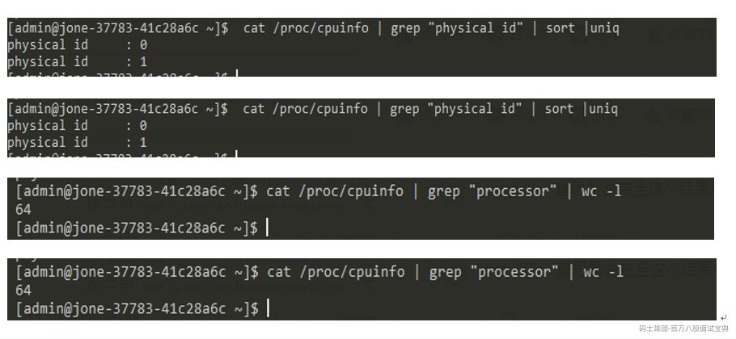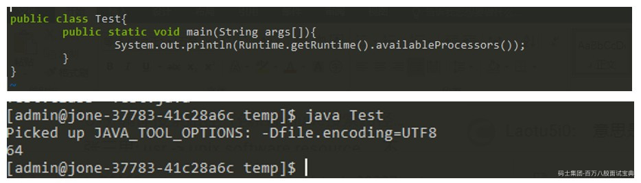

实际为2个cpu每个cpu 32核 总共是64核，编写测试程序验证也是如此：

由此可知，默认的ForkJoinPool获取的是当前系统的核心数量，如果应用部署在docker容器中，

那么就获取的是宿主机的CPU核心数

**Runtime.getRuntime().availableProcessors()问题 ：**

容器明明分配的是2个逻辑核心数，为什么java获取的会是物理机的核心数呢？如何解决这个问题 呢。

是否是容器构建的时候某些参数配置的原因导致的? 将问题反馈给运维，但是对方并未解 决该问题。

那么java是否可以解决呢？毕竟如果我们自定义线程池设置线程数量也会使用 Runtime.getRuntime().availableProcessors()这个方法，

这其实是JDK的一个问题，已经trace在 [**JDK-8140793**](https://bugs.openjdk.java.net/browse/JDK-8140793) ，原因是获取CPU核数是通过读取两个环 境变量，其中

其中\_SC\_NPROCESSORS\_CONF 就是我们需要容器真实的CPU数量。

[**获取CPU数量的源码**](https://github.com/obmarg/libsysconfcpus/blob/master/src/libsysconfcpus.c)

第一种办法是使用新版本的Jdku131以上的版本 [**1**](https://blog.csdn.net/west_609/article/details/108534197#fn1) 。 另外一个办法是使用自编译上面的源代码，通过LD\_PRLOAD的方式将修改后的so文件加载进去

Mock掉CPU的核数

jdk官方链接声明： [**Java SE support for Docker CPU and memory limits**](https://blogs.oracle.com/java-platform-group/java-se-support-for-docker-cpu-and-memory-limits)

使用方法一测试：测试环境容器验证，验证通过，结果如下：

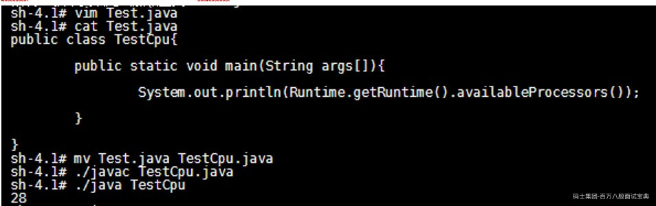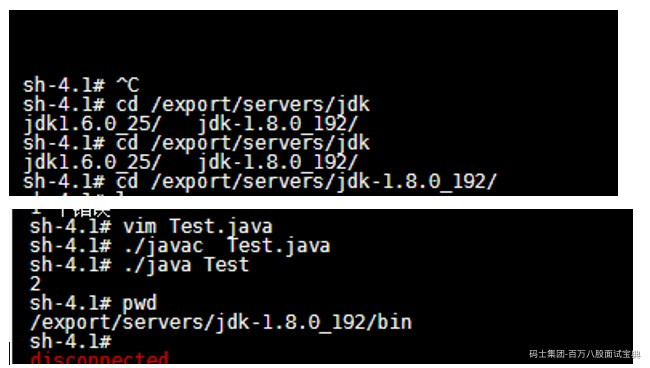

jdk版本 jdk1.8.0\_20 ：返回cpu核心数28

jdk版本： jdk-1.8.0\_192 返回cpu核心数2

**建议**

尽量使用lambda表达式遍历数据，推荐使用常规的for、for-each模式 原因：

1. 性能比传统foreach低 lambda内部有着一套复杂的处理机制（反射、类型转换、拷贝），性能开销要比常规for、 for-eatch大的多。在普通业务场景下这种性能差异可以忽略不计，但是在某些高频场景下

（N万次调用/秒）就不能忽略了。它虽然不会导致一次迭代卡顿，但是会持续增加cpu的消 耗，以及增加GC的压力。

2. **不便于代码调试**

反例：

// lambda并没有起到简化代码的作用，反而会增加系统压力

List<ValidationResult> results = children.stream()

.map(e -> e.validate(context, nextCell, nextCoverCells, occupyAreas))

.collect(Collectors.toList()); List<ValidationResult> failureList = results.stream().filter(ValidationResult::isFailure).collect(Collectors.toList()); List<ValidationResult> successList = results.stream().filter(ValidationResult::isSuccess).collect(Collectors.toList());

正例：

// 优化后总cpu下降2%-4%左右。

// 备注：cpu下降如此明显的原因是该代码的调用频率非常高，真正的N万次/秒调用 List<ValidationResult> failureList = new ArrayList<>(4); List<ValidationResult> successList = new ArrayList<>(4);

for (PathPreAllocationValidator child : children) {

ValidationResult result = child.validate(context, currCell, previousCell, nextCell);

if (result.isSuccess()) {

successList.add(result);

} else {

failureList.add(result);

}

}

**非标导入引发CPU彪高**

**背景**

非标导入使用easyexcel组件进行导入处理，10几万的数据量引发CPU彪高

**排查思路**

1、查看线程栈相关信息

2、pinpoint监控查看性能及代码调用情况

3、是否存在大量阻塞慢SQL

4、是否存在短时间内频繁日志输出

**问题再现**

使用之前分表导入的30万数据进行导入操作,myops查看排名前十线程栈相关信息（如下图），发 现lbs\_non\_standard\_account\_common单个线程消费占用CPU 8%左右，启动的线程数量很多

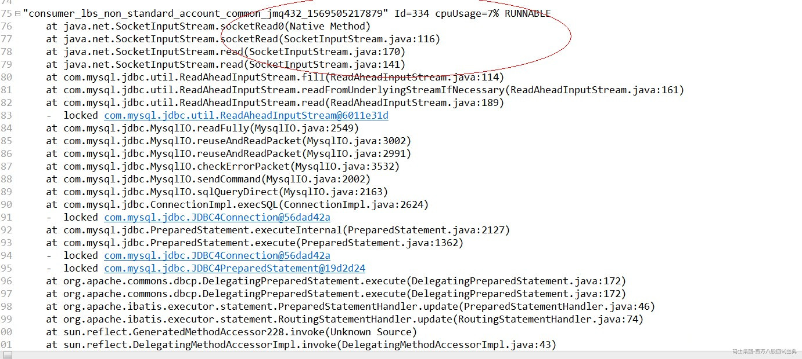

**改善措施**

1、AnalysisEventListener的子类CommonImportExcelListener的invoke方法已将近每秒1万的 速率迅速完成业务逻辑校验发送MQ，该MQ内部消费进行业务处理逻辑处理。

30万的数据将近30秒内发送MQ完成，给消费内部逻辑带来压力导致CPU彪高，使用RateLimiter

进行了MQ发送的限流。

2、调整消费者主题“lbs\_top” 的maxConcurrent参数（该参数设置为单组启动线程数），单个 应用实例启动线程的最大数=maxConcurrent参数\* 分组数量.

3、针对lbs\_top消费逻辑中的部分业务查询进行内存缓存改造

**4.2.4 慢sql引起的数据库服务器CPU飙高**

数据库 cpu 占用率过高事故分析 一、摘要

时间：2018.2.5 18:00:00 --2018.2.6 10:30:00 问题：中台数据库 cpu 占用率超过 89%

原因：系统 DB sql 存在慢查询，并且读写均在主库，随着系统流量的增长， 数据库 cpu 占用持 续增高，2 月 5 日当天数据库 cpu 占用率达到了 89%，2 月 6 日 cpu 占 用率达到 91%；

应急措施： 二、事故背景

该系统最近每天超于 30%的量增长，2 月 5 日下午 18:00:00 左右田xx 通过 mdc 监控观察行情 数据库的 cpu 占用率达到 89%，而且业务方第二天 2 月 6 日要上 6 个新的产品，预估流量会高 于 5 日流量峰值，系统风险非常高。

三、事故处理过程

1. 和中台应用读写分离方案可行性确认【5 日 20:00:00-22:00:00】

与金xx同事确认是否可以在应用层实现主从库读写分离，释放主库压力。由于当晚 金xx同事均已 下班，并且相关人员未全部参与问题处理中，金xx当晚确认不能再 不改代码的情况下实现数据库 的读写分离，若需改代码，当晚不能进行发布升级， 第二日还是存在数据库崩的风险；

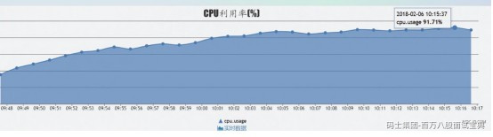

此方案不能解决问题；

2. 数据库拆分方案讨论及开展【5 日 22:00:00-6 日 03:00:00】

读写分离方案 pass 后，多次与金xx沟通讨论后，决定将中台数据库拆分到新 的数据库，缓解现 用数据压力，防止第二天开市后数据库 cpu 占用率超负荷， 作为临时解决方案。

方案确定后，与 dba 申请 dokcer 资源数据库，由于现在公司资源池 docker 数 据库紧缺，当前 情形只能申请弹性数据库，申请后联系 DBA 修改数据库 为线上相同规格（12C/49G/1T）。

数据库资源到位后，电话联系 dba 确定切库方案：先停掉应用，防止数据库备 份期间有数据写入

（此项与业务方确认，可以操作），dba 同事通过 dump 全 库将中台数据库全量备份，然后拿 到新的数据库 source 导入数据

数据库全量迁移至新库后，将中台 nginx\_bin 的 mysql\_config.py 配置文件中 的数据库连接信 息替换为新库配置，启动应用；

经过功能测试验证后无问题，但是由于时间紧急，没有经过压力测试，这也导 致了第二天系统登 录出现问题；

3. 新增行情 BP，设置行情数据库读写分离【2 月 6 日 09:20:00-】

2 月 6 日上午项目开市前，大概 9 点 20 分左右，出现无法登录问 题；为不影响业务正常运营， 紧急将昨天的中台配置恢复，大概在 9 点 45 分 左右系统可重新登录；

操作流程：将中台 nginx\_app 的数据库配置文件 mysql\_config.py 用昨天原有 配置文件替换， 先重启 redis，再重启 nginx；

由于金xx的行情慢查询问题一直没有解决，业务开市后数据库 cpu 占用率持续 飙升，情况非常紧 急。与金xx电话在线同步问题情况，并要求其紧急提供 nginx 测限流方案。

金xx同事评估限流方案在未经过测试的情况下实施可能会对业务造成影响。最后在数据库占用率

在 90%以上的情况下增加两个行情 BP，配置读取数据库地 址为从库地址 10.191.237.73 ，缓解 主库读压力。新增 BP 配置方式

增加行情 BP，实现行情数据库读写分离后，数据库主库 cpu 使用率降至 60% 左右，从库 cpu

使用率开始上升，大概在 20%左右趋于稳定

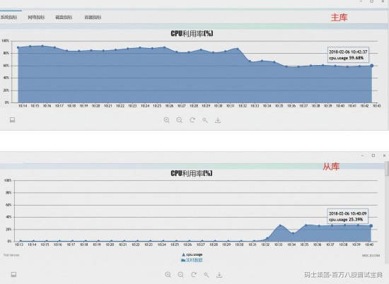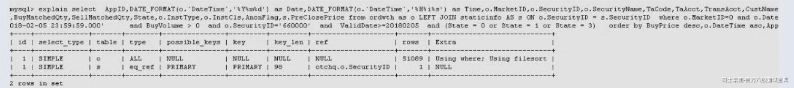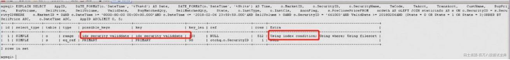

4. 增加索引，数据库 cpu 占用率急速下降

读写分离实现后，cpu 使用率降至正常阈值范围内，肖xx提出 ordwth 表创建 索引的方案，申请 创建后，cpu 占用率急速下降至 10%以内 创建索引：alter table ordwth add index idx\_security\_validate(Security,ValidDate) 增加索引后性能增加原因： 原来的 ordth 表只有 (AppID,DateTime)和(TransAcct,SecurityID)这两组组合索 引。

原来查的慢的 sql，where 条件的两组索引没有用到 。

加上了之后(SecurityID,ValidDate)这组组合索引后 ，查询开始走这组组合索 引。

四、事故反思总结

1. 与金xx同事沟通不透彻，没有找到对应的问题的接口人，导致 5 日晚未能实施数据 库读写 分离方案；

2. 对弹性数据库了解不足，导致应用连接切换到弹性数据库后，流量增加后，数据库 性能不 能支撑线上系统；

3. 前期没有与金xx同事沟通限流应急方案，导致流量增加后，无法第一时间限制流 量

**4.3事故3：内存问题**

**4.3.1 内存概述**

**内存泄漏（Memory Leak）**

是指程序中已动态分配的堆内存由于某种原因程序未释放或无法释放，造成系统内存的浪费，导致程序 运行速度减慢甚至系统崩溃等严重后果。

**一般内存泄露的方式：**

1. 常发性内存泄漏：发生内存泄漏的代码会被多次执行到，每次被执行时都会导致一块内存泄漏。

2. 偶发性内存泄漏：发生内存泄漏的代码只有在某些特定环境或操作过程下才会发生。常发性和偶 发性是相对的。对于特定的环境，偶发性的也许就变成了常发性的。所以测试环境和测试方法对 检测内存泄漏至关重要。

3. 一次性内存泄漏：发生内存泄漏的代码只会被执行一次，或者由于算法上的缺陷，导致总会有一 块且仅有一块内存发生泄漏。

4. 隐式内存泄漏：程序在运行过程中不停的分配内存，但是直到结束的时候才释放内存。严格的说 这里并没有发生内存泄漏，因为最终程序释放了所有申请的内存。但是对于一个服务器程序，需 要运行几天，几周甚至几个月，不及时释放内存也可能导致最终耗尽系统的所有内存。所以，我 们称这类内存泄漏为隐式内存泄漏。从用户使用程序的角度来看，内存泄漏本身不会产生什么危 害，作为一般的用户，根本感觉不到内存泄漏的存在。真正有危害的是内存泄漏的堆积，这会最 终耗尽系统所有的内存。从这个角度来说，一次性内存泄漏并没有什么危害，因为它不会堆积， 而隐式内存泄漏危害性则非常大，因为较之于常发性和偶发性内存泄漏它更难被检测到。

**JAVA中的内存泄露：**

上面所描述的是通常的内存泄露方式，当然也适用于java，但是对于java而言，问题似乎变得简单了， JAVA的一个重要特性就是通过垃圾收集器(GC)自动管理内存的回收，而不需要程序员自己来释放内存。 理论上Java中所有不会再被利用的对象所占用的内存，都可以被GC回收，但是Java也存在内存泄露，但 它的表现与C或者C++不同而已。这通常都是设计不合理造成的，也因此通过设计是可以避免的。根本 问题在于，是否我们需要掌控的对象，在应该销毁的时候没有销毁，或者没有预料到对象的增量超出我 们的预想。

1-对象增长超出预想

2-设计应该销毁的对象，而常驻内存 对于问题一，举一个常见的设计规约：线程池的创建应该显示指定阻塞队列得到小，避免默认值失去控

制，极坏的情况下创建了大量的线程，导致OOM。

问题二，经常出现在设计缓存，存储的map，list中，无限增长，失去控制。

**常见的容易导致内存泄露的点**

1-线程池创建未显示指定阻塞队列大小

2-ThreadLocal 的管理中忘记回收对象

objectThreadLocal.set(userInfo);

try {

// ...

} finally {

objectThreadLocal.remove();

}

3-所有涉及资源链接的地方，都不要忘记关闭资源

4-类的成员变量为集合，或者单例的模式中有集合，引用了大量的其他对象

5-java方法，是传值还是传引用，造成的小时间段内，内存没按照预想回收掉

(Out Of Memory)

(stackoverflow)

II

:JVM

: 7

JVM

JAVA

(Method Area) OutOfMemoError:Metaspace

( ".fi!eld. 1i

?

(Nativl! Method Statck) ivmE me(JVM Stack)

rror. Y lIJVMλ

E JI.I1Jl!Javañ .7

(Runtime Constant Pool) (SunJO SJatavatck1VFIwErrro{

HSPoM'

). ) ;

{ )

li'.

OutOfMemoryError ()

(eHEa)p IR

1i (OireJdVMMem}

E ( \*' 4G.JVM

lG. lIJ3G.JOK

) . C!<:li!Java GCffU (Channel)

.JVM (Buffer) E Java GC native

lE

r1||uvwer:1| utOfMemError. |

Eden: 8 Old

(PgomJaEvaounHr Re9s' telr} u ndened

" .perm/meta

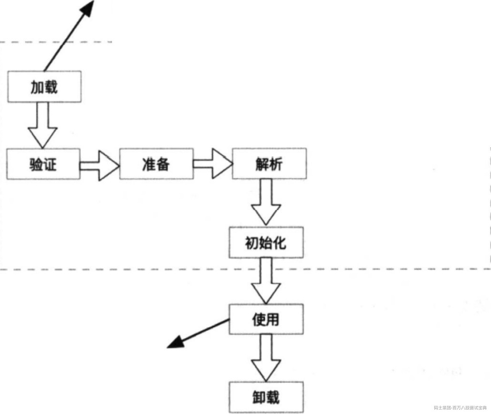

/ JaV8 '

**JVM参数**

1-JVM的参数类型

1.1 标配参数:-version,-help

1.2 X参数(了解):-Xint,-Xmixed

1.3 XX参数:

1.3.1 boolean类型:-XX:+PrintGCDetails

1.3.2 KV设值类型:-XX:MetaspaceSize=128m

2-查看内存参数

2.1 -XX:+PrintFlagsInitial 主要查看初始默认（不依赖java进程）

case:java -XX:+PrintFlagsInitial

2.2 -XX:+PrintFlagsFinal 主要查看修改更新(不依赖java进程)

case:java -XX:+PrintFlagsFinal

2.3 -XX:+PrintCommandLineFlags 打印命令行参数

2.4 jinfo 查看进程相关数据

case： jinfo -flag MetaspaceSize pid

问题：

-Xms：初始大小内存，默认物理内存1/64，等价于-XX:InitialHeapSize

-Xmx：最大分配内存，默认为物理内存1/4，等价于-XX:MaxHeapSize

-Xss：设置单个线程栈的大小，一般默认为512k~1024k，等价于-XX:ThreadStackSize

参考：https://docs.oracle.com/javase/8/docs/technotes/tools/unix/java.html

**常用配置**

-XX:+HeapDumpOnOutOfMemoryError -XX:HeapDumpPath=heapdump.txt

-XX:+PrintGCDetails

-Xloggc:gc.log

**模拟内存溢出**

见代码

**什么条件触发GC-CMS为例**

1-eden区满了？会不会触发？

2-老年代满了会不会触发？

3-直接缓冲区满了会不会触发？

4-元空间满了，会不会触发？

**工具**

1-jvm gc日志分析工具： [**https://javagc.cn/**](https://javagc.cn/) [**https://gceasy.io/ft-index.jsp**](https://gceasy.io/ft-index.jsp)

2-内存快照分析工具：mat,jprofile,VisualVM

3-java自带：

-jps 进程查看

-jstat：用于监视虚拟机各种运行状态信息的命令行工具。可以显示本地或者远程虚拟机进程中的类记 载、内存、垃圾收集、JIT编译等运行数据.

jstat -gc pid #垃圾回收统计

jstat -gccapacity pid #堆内存统计 jstat -gcnew pid #新生代垃圾回收统计 jstat -gcnewcapacity pid #新生代内存统计 jstat -gcold pid #老年代垃圾回收统计 jstat -gcoldcapacity pid #老年代内存统计 jstat -gcutil pid #总结垃圾回收统计

jstat -printcompilation pid #JVM编译方法统计

jstat -class pid #类加载统计

-jinfo 参数配置查看

-jmap 内存监控

jmap -clstats pid #打印进程的类加载器和类加载器加载的持久代对象信息

jmap -heap pid #查看进程堆内存使用情况，包括使用的GC算法、堆配置参数和各代中堆内存使用情况。 jmap -histo[:live] pid #查看堆内存中的对象数目、大小统计直方图，如果带上live则只统计活对象 jmap -dump:format=b,file=dumpFileName pid #jmap把进程内存使用情况dump到文件中

-jstatck线程监控

**思考**

1-eden space+ from space > to space可能么？ 会发生什么GC

2-Integer为什么用equals判断相等

**4.3.1 非堆内存泄露-仅供阅读参考，问题在4.3.2都有解答**

背景： 三方路由系统对外提供的查询三方全程跟踪接口调用方TP99较高，提供方TP99很低，差距较大，

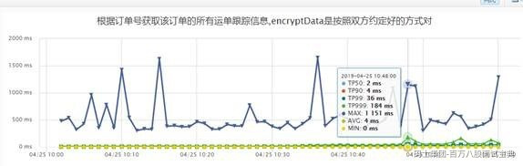

为寻找原因，进行了极限压测。

1、 服务单提供方TP99 30多ms，而调用方TP99 250ms左右，主要是因为极限压测过程中服务

提供方机器数量过少，而调用方机器是我们的几十倍，从统计方式上（按机器维度），我们的 TP999或者是Max值才是调用方的TP99，单从TP999与Max值来看，这个接口还存在可以优化的 空间，后来通过Jtrace查看几个执行慢的方法也看不出特别的东西，有些是SQL执行数据库慢，有 些是跟Jimdb交互慢，表象是这样。实际上这个sql都是走的索引，这个分表大小也才250w数据， 所以正常不会出现这种。

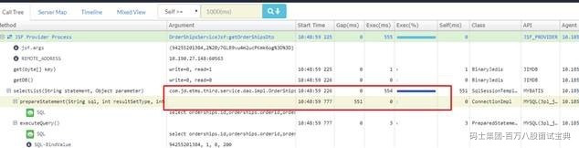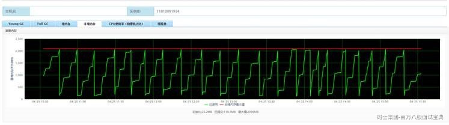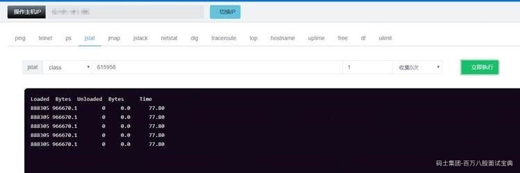

2、 后来看了下GC，发现存在大量FullGC，且堆占用很小的时候就执行FullGC了，看了下非堆，

非堆大小从0-2G频繁变化，由此判断堆外泄露了，第一次遇到这种堆外泄露问题，jvm内存分布- 方法区，这个地方出问题了，堆内存有MAT，dump之后有很多分析方式，非堆咋分析？(截图 FullGC平均时长应该是700ms),后面的过程也是寻找可以分析非堆内存的工具，找了一圈找了俩， 一个是google的greftools，但是这个工具需要安装一些库，根据实际观察，随着调用量增加非堆 内存增加的越快，判断是某个方法出现的内存泄露，不知道哪个方法的情况下没法本地做复现，这 个工具在生产环境安装又需要运维帮忙，可能会比较麻烦。那有没有其他方式轻松的查看非堆内存 分布呢？答案是肯定的，有个命令jmap –permstat,但是很可惜，这个命令在生产环境使用的时候 竟然卡主了，最后直接导致jvm假死，JSF没能及时移除这个节点，导致调用方超时。

3、 后来咨询胡老师(感谢胡老师，给出关键性的一步)，给出的建议是在启动的时候增加参数-

verbose:class参数，看到这个参数，我想到了jstat –class查看class加载数量，果然加载了96w的 class对象，而此时重启也生效了，控制台频繁打出加载class的输出。接下来代码就容易定位了， 原因是JAXBContext的使用方式不对（搜索结果），本来应该单例，却每次都创建对象使用。修 改代码-测试-发布-再次极限压测。最终验证正确，再也没出现非堆飙升，也没出现FullGC，我们 自己的TP999 跟MAX值很稳定，调用方TP99也维持在10ms以下，至此问题解决。

4、 但是why?，经过漫长跟踪JAXBContext.newInstance代码过程中发现JAXB内部使用了反射

获取对象属性和方法(JAXBxml转对象的工具)生成代理类，代理类需要通过classLoader加载，走 类加载过程，双亲委派，正常情况下只加载一次就行，我们还知道同一个classLoader下同一个代 理类对象是不能多次加载的，看似没问题，然而由于内部Injector类管理代理类的过程中使用了弱 引用WeakReference类 ，导致被回收就会重新加载代理类，按照之前的逻辑好像没问题，重新加 载同一个类了，不会加载成功，之前我也是这么想的，直到断点打到这，它抛了个duplicate class之后，还发现打印了Load class日志，大胆猜想，这个可能是jdk的bug，重复加载同一个 类，虽然失败，但对应到方法区的内存却没被销毁，最后放开断点，出现大量Loadclass日志，看 永久代，大量增加，最终FullGC回收，class对象也在一直增加，重复.其实这也算是JAXB的一个 bug，不该重复加载同一个代理对象(说明：在原classLoader.load方法里是有判断是否加载过

class的过程，但是JAXB中自己调用了classLoader内部的defineClass、resolveClass方法，是打 破了双亲委派机制，导致多次重复加载class，引起内存泄露，本质上来说是JAXB的bug，当然 JDK底层抛异常却不释放对内存的占用这也是有问题的，最后警惕对classLoder的使用，尽量使用 其对外的load方法)

**4.3.2 运单非堆内存溢出问题排查**

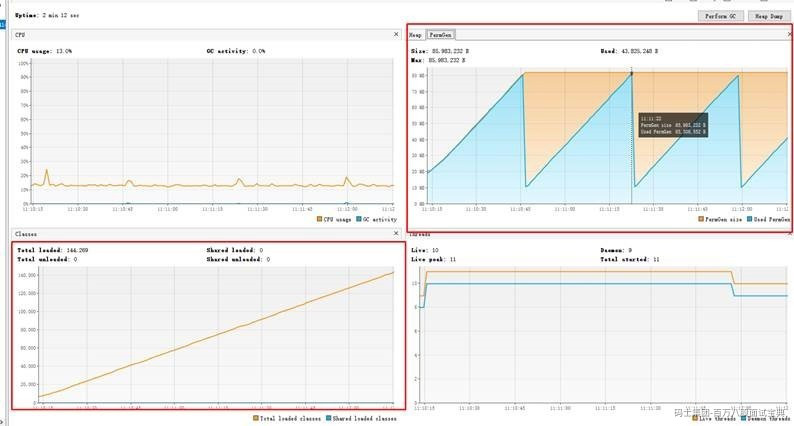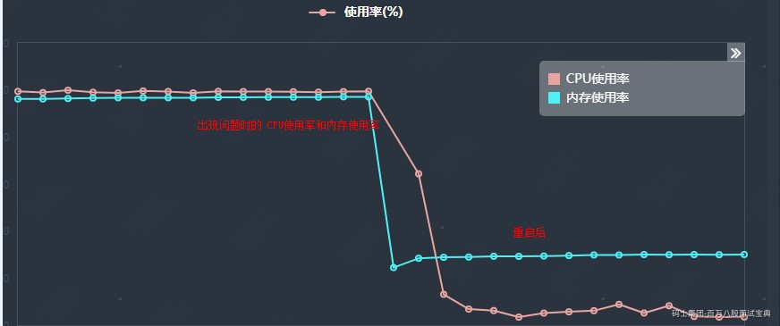

**1、环境及现象** 运行环境：JDK版本 1.8.0 现象描述：

运单系统每隔一段时间，内存使用和CPU报警超出阈值85%，通过监控平台可以看到非堆内存持 续增加不回收 。导致频繁FullGC，引起CPU100%。

操作系统监控图:

JVM内存监控

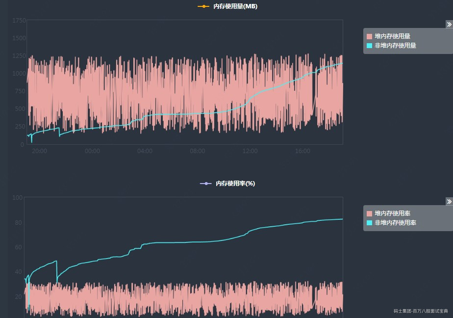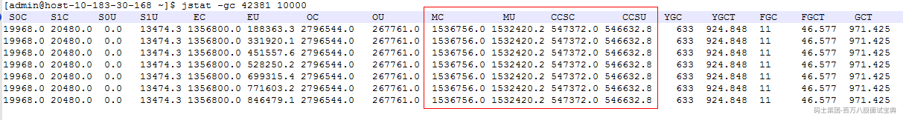

从监控上看非堆内存永久代（JDK8 HotSpot JVM 将移除永久区，使用本地内存来存储类元数据

信息并称之为：元空间（Metaspace））一直增加且无法回收。这部分内存主要用于存储类的信 息、方法数据、方法代码等，正常情况下元空间不会占用很大内存， 所以对于动态生成类的情况 比较容易出现永久代的内存溢出。开始怀疑应该是使用反射、代理等技术生成了大量的类加载到元 空间无法回收。

问题排查

1、使用jstat 查看内存及GC情况：

各列含义: [**jstat (oracle.com)**](https://docs.oracle.com/javase/8/docs/technotes/tools/unix/jstat.html)

S0C：第一个幸存区的大小 S1C：第二个幸存区的大小 S0U：第一个幸存区的使用大小 S1U：第二个幸存区的使用大小 EC：伊甸园区的大小 EU：伊甸园区的使用大小 OC：老年代大小 OU：老年代使用大小 MC：方法区大小 MU：方法区使用大小 CCSC:压缩类空间大小 CCSU:压缩类空间使用大小 YGC：年轻代垃圾回收次数 YGCT：年轻代垃圾回收消耗时间 FGC：老年代垃圾回收次数 FGCT：老年代垃圾回收消耗时间 GCT：垃圾回收消耗总时间

可以看到发生了FullGC， MU 和 CCSU 都很大，FullGC并没有回收掉，再次确认了元空间内存 溢出的可能。

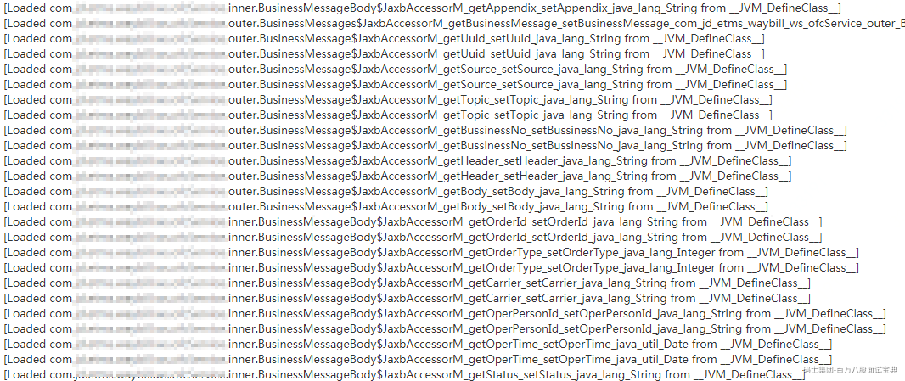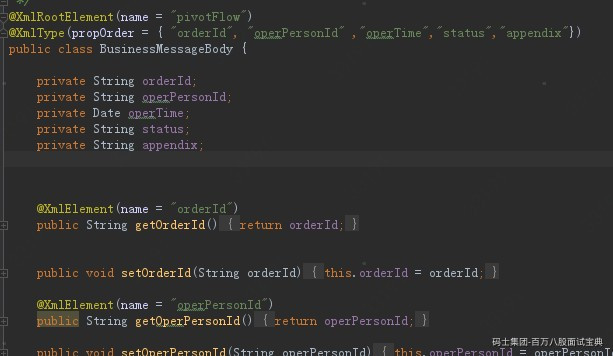

**2、打印类加载信息 分析代码**

在JAVA\_OPION 中添加 -verbose:class 打印类加载信息。重启后观察日志输出

发现以上输出信息，并且一直不停的Loaded。 打印出了相关的业务类.BusinessMessageBody

、BusinessMessage ，看样子是使用Jaxb 序列化成XML时产生的问题。在项目中搜索相关代 码：

有Xml的注解

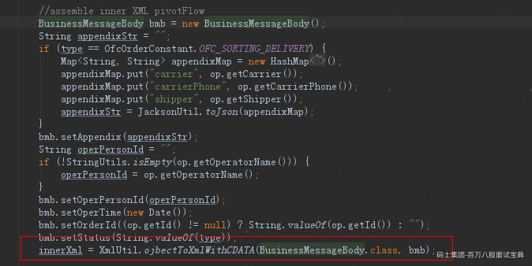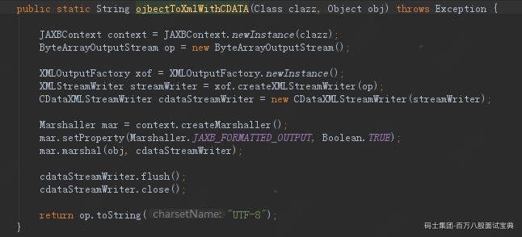

业务代码中使用 XmlUtil 工具类转成XML 。继续跟进 XmlUtil.ojbectToXmlWithCDATA

\*注 XML概念：\*

\*XML，就是可扩展标记语言Extensible Markup Language，包括XML/DTD/XSD/XPATH的w3c规范,在webservice方 面主要应用有SOAP/WSDL等(WSDL还不是w3c规范)\*

\*JAVA规范API统称JAXP,主要有DOM/SAX/STAX/XPATH等标准API,并内置默认实现。并在JAXP的基础上建立了 JAXB/JAX-WS等规范\*

\*常见的JAXP API(解析器)实现有xerces/crimson/woodstox/xalan等开源实现，也有一些厂商的实现(如IBM)。 常用的XML操作库如dom4j/jdom是JAXP API的二次封装(其实也封装了其他一些非规范的实现)\*

\*常见的webservice库如axis2/xfire/cxf等，按自己的方式实现了SOAP/WSDL等功能(XML相关功能基于JAXP)， 由于JAX-WS规范的兴起，这些库也实现了JAX-WS规范\*

\*运行期实现类的查找模式都是类似，基本都是参数、配置、SPI、默认实现的顺序。如果有需要(如存在bug/性 能问题)，可以根据这个查找顺序更换不同的实现方式。\*

工具类中使用 JAXB 将对象解析成XML。JAXB(Java Architecture for XML Binding),基于

JAXP(Java API for XML Processing)，定义了XML和Java对象的映射处理关系，来看下JAXB 规 范

首先，检查配置文件jaxb.properties有没有定义javax.xml.bind.context.factory工厂类，通 过createContext生成

如果没有找到，就通过SPI(Service Provider Interface)机制( JDK内置的一种服务提供发现 机制 ), 查找有没有实现类定义: META-INF/services/javax.xml.bind.XXX 如果没有找到，选择默认内部实现(oracle JDK):com.sun.xml.internal.bind.v2.ContextFactory

在项目目录中未找到 jaxb.properties 文件，但在maven依赖中搜索到了间接引用：

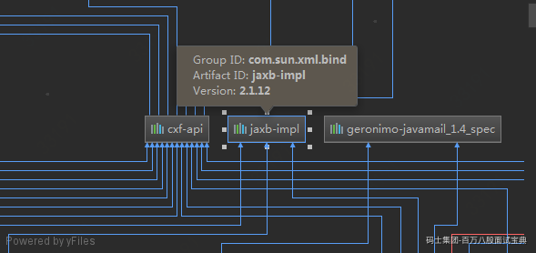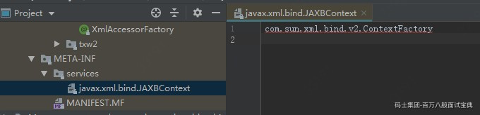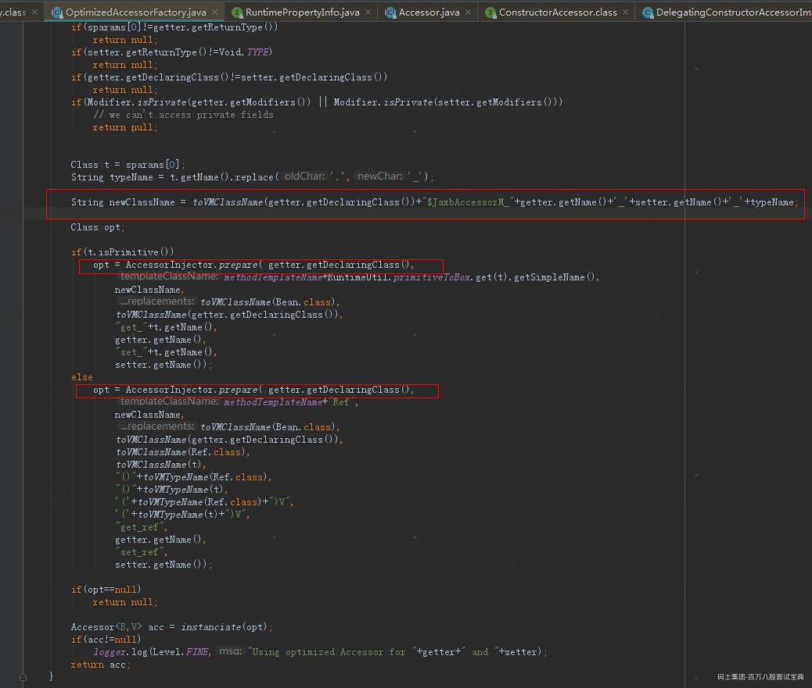

可以看到通过SPI机制 加载com.sun.xml.bind.v2.ContexFactory 实现类来生成JAXBContext。

JAXB 中有个用于访问bean的特定属性的类Accessor，该类定义了一个方法optimize返回优化的 Accessor类，

在optimize方法中 使用 OptimizedAccessorFactory 工厂获取优化的Accessor，来看具体实 现：

第一个红框内 newClassName 我们在日志中已经看到了既是新生成的类名。紧接着使用 AccessorInjector.prepare 方法生成对应的Class 对象。AccessorInjector.prepare 方法中又调 用了

Injector.find 和Injector.inject ，这两个方法中 都调用了 下面这个方法用于获取类加载器对应的 Injector 对象，如果已存在缓存的Injector 直接返回，如果为空则会新建WeakReference 放入缓 存 injectors （声明为WeakHashMap类型），injectors 里面的Value使用的是WeakReference 弱引用 ，当GC发生时，垃圾收集器在某个时间点决定一个对象是弱可达的(weakly reachable)

（也就是说当前指向它的全都是弱引用），这时垃圾收集器会清除所有指向该对象的弱引用。

private static Injector get(ClassLoader cl) {

Injector injector = null;

WeakReference<Injector> wr = (WeakReference)injectors.get(cl);

if (wr != null) {

injector = (Injector)wr.get();

}

if (injector == null) {

try {

injectors.put(cl, new WeakReference(injector = new Injector(cl)));

} catch (SecurityException var4) {

logger.log(Level.FINE, "Unable to set up a back-door for the injector", var4);

return null;

}

}

return injector;

}

如果 injector 不为空这调用下面方法返回对应的 Class ：

private synchronized Class inject(String className, byte[] image) {

if (!this.loadable) {

return null;

} else {

Class c = (Class)this.classes.get(className);

if (c == null) {

try {

image, 0, image.length);

c = (Class)defineClass.invoke(this.parent, className.replace('/', '.'),

resolveClass.invoke(this.parent, c);

} catch (IllegalAccessException var5) {

logger.log(Level.FINE, "Unable to inject " + className, var5);

return null;

} catch (InvocationTargetException var6) {

logger.log(Level.FINE, "Unable to inject " + className, var6);

return null;

} catch (SecurityException var7) {

logger.log(Level.FINE, "Unable to inject " + className, var7);

return null;

} catch (LinkageError var8) {

logger.log(Level.FINE, "Unable to inject " + className, var8);

return null;

}

this.classes.put(className, c);

}

return c;

}

}

重点在下面这行

c = (Class)defineClass.invoke(parent,className.replace('/','.'),image,0,image.length);

defineClass ，resolveClass 分别是ClassLoader的 defineClass，和resolveClas 方法，通过反

射初始化的。

static {

try {

defineClass = ClassLoader.class.getDeclaredMethod("defineClass", String.class,

byte[].class, Integer.TYPE, Integer.TYPE);

resolveClass = ClassLoader.class.getDeclaredMethod("resolveClass", Class.class);

} catch (NoSuchMethodException var1) {

throw new NoSuchMethodError(var1.getMessage());

}

AccessController.doPrivileged(new PrivilegedAction<Void>() {

public Void run() { Injector.defineClass.setAccessible(true); Injector.resolveClass.setAccessible(true); return null;

}

});

}

先看下 ClassLoader 中与加载类相关的方法，也就是说如果 缓存中没有对应的Class 就利用反射

调用ClassLoader的 defineClass方法重新定义Class的实例 。

**方法 说明**

getParent() 返回该类加载器的父类加载器。

loadClass(String name)

加载名称为 name 的类，返回的结果是 java.lang.Class 类

的实例。

findClass(String name)

查找名称为 name 的类，返回的结果是 java.lang.Class 类

的实例。

findLoadedClass(String

name)

**查找名称为** name **的已经被加载过的类，返回的结果是**

java.lang.Class **类的实例。**

defineClass(String name,

byte[] b, int off, int len)

**把字节数组** b **中的内容转换成 Java 类，返回的结果是**

java.lang.Class **类的实例。这个方法被声明为** final **的。**

resolveClass(Class<?> c) 链接指定的 Java 类。

**因为这一行，会重复执行类的定义，一定重复定义，重复定义，在jvm内部会有一次约束检查抛出**

**LinkageError，但临时创建的结构，等待GC去回收。**

那么回过来想，为什么 injectors 被回收后，对应的Class实例未被回收卸载掉呢？ 此现象产生的 环境差异是因为升级了JDK版本，由JDK7升级到JDK8, 那么JDK8对垃圾回收做了哪些改变，是否 这些改变导致了此问题的产生。带着这个疑问检索 google，得到了答案。

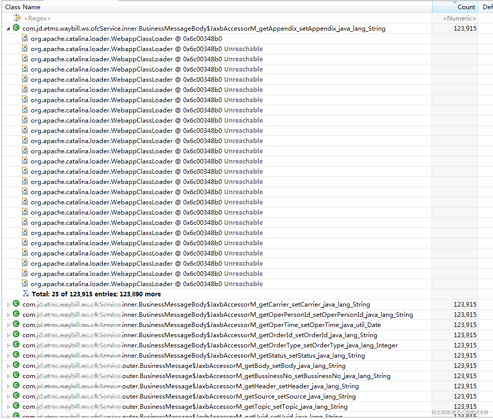

**在JDK 7中，对Permgen中对象的回收会进行存活性检查，因此重复定义时产生的数据会在GC时 被清理。然而在JDK 8中，Metaspace的回收只依赖classloader的存活，当classloader还活着 时，它所产生的对象无论存活与否都不会被回收，由此引发了OOM。**

从生产环境dump出来的内存文件分析后验证了这一点：

参见 ：

[**https://zhuanlan.zhihu.com/p/25634935**](https://zhuanlan.zhihu.com/p/25634935) [**http://lovestblog.cn/blog/2016/04/24/classloader-unload/**](http://lovestblog.cn/blog/2016/04/24/classloader-unload/) [**http://blog.yongbin.me/2017/03/20/jaxb\_metaspace\_oom/**](http://blog.yongbin.me/2017/03/20/jaxb_metaspace_oom/)

文中提到 JAXB 2.2.2 以上版本做了修改，我们找到一个2.2.11 版来分析下差异：

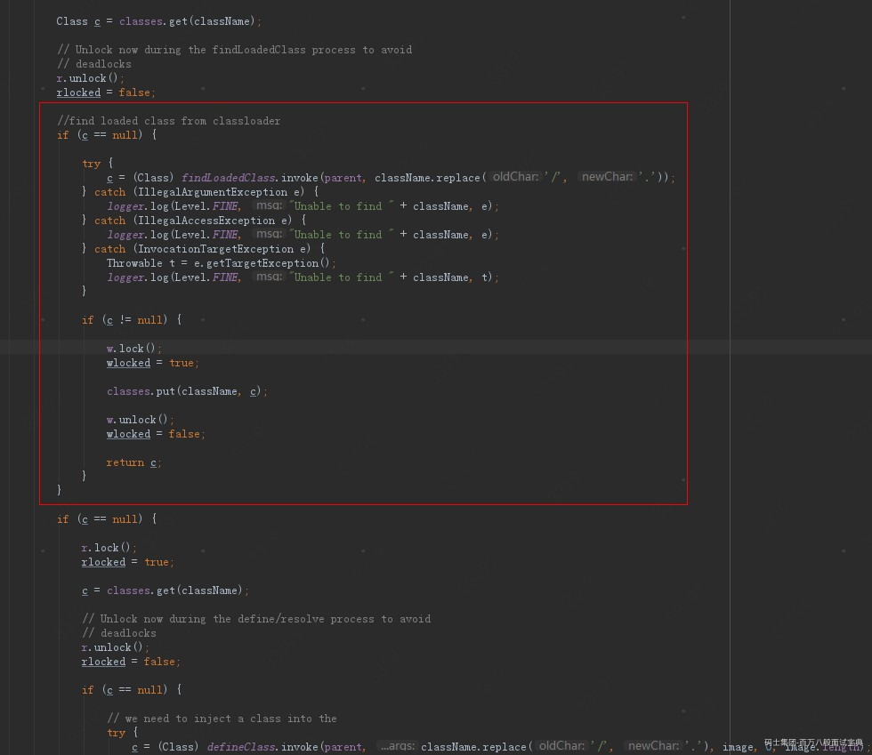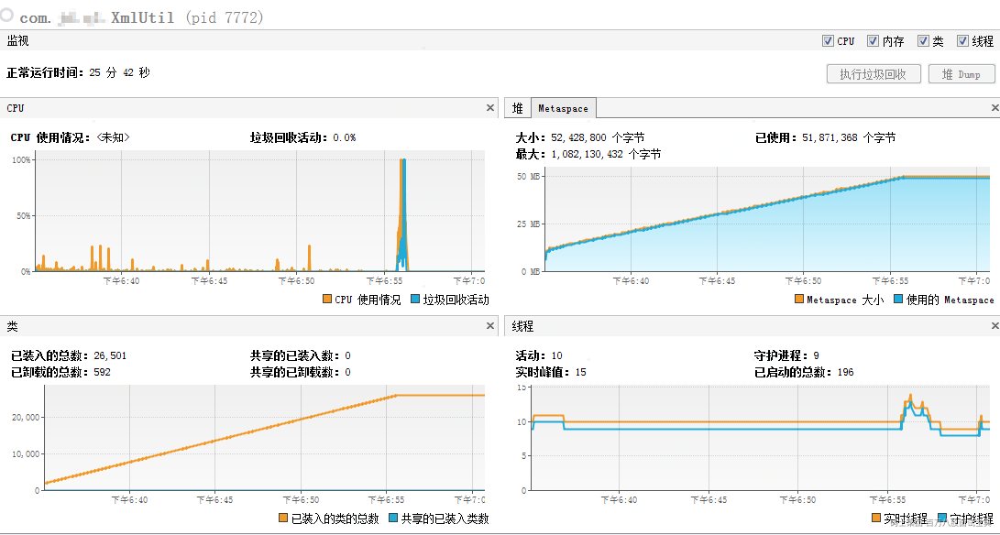

JAXB-impl 2.2.11 版本 inject 版本种增加了一段 findLoadedClass`` 逻辑，按名称查找是否已有

加载的类，避免重复定义加载。

**3、本地环境验证测试**

把运单的相关代码摘出来测试观察使用JAXB-impl不同版本监控元空间变化规律。

JAXB-Impl 2.1.12 版本 监控详情： 可以看出来 元空间 持续增长，当达到配置的最大值，触发频 繁FullGC，同时CPU使用率达到100%，也可看到已加载的类数量有 26501个

JAXB-Impl 2.2.11 版本 监控详情，元空间使用保持在12906832 ，类加载总数保持在 2156， CPU正常，GC正常，运行稳定。

**4、线上更新版本观察**

非堆内存维持在150M大小，稳定运行。

**4.3.3 入库内存泄露总结**

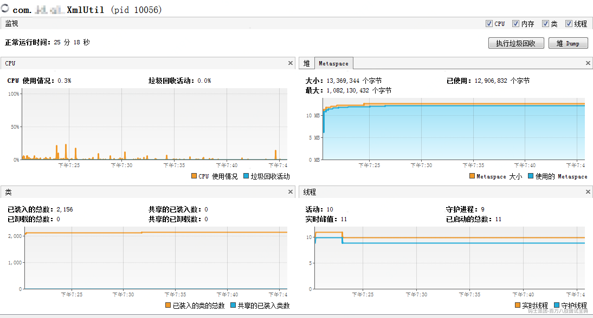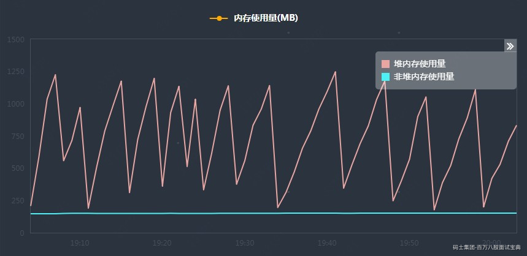

**由于条件问题，一个查询语句把一个表里所有的记录都查询出来了，数据量很大，把内存打爆， 造成现场验收卡，卡，卡.......**

**在LAOS上用jmap -dump命令导出JVM的整个内存信息**

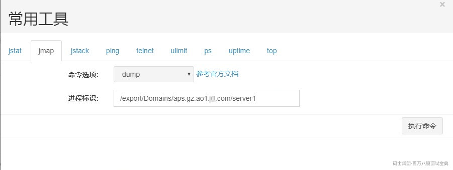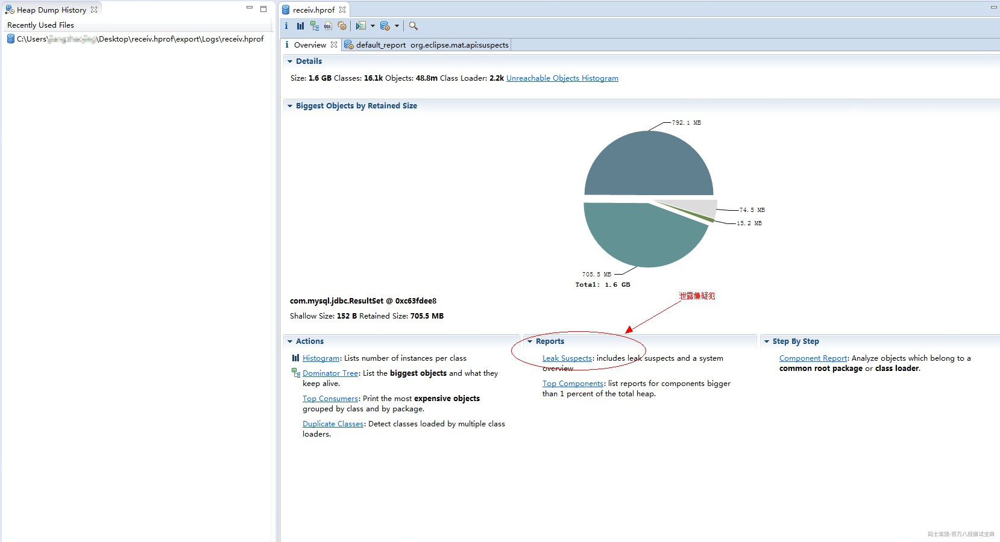

**然后用MAT艰难的打开文件，如图：**

**快速定位报表里的泄露嫌疑犯，点击进去，如图，发现这两个嫌疑犯占用了**

**49.90%+44.45%=94,35%的内存，还让其他功能咋用呢？？**

I 01

111 @ | 1 0..

τ .tal:1.6 GB

T f3 Problem Suspect 1

The tlfread java.lang.Thread @ Oxa6092ba8 http-8004-3 k e p5 local variabl e5 with total e.\_830 584 592 (49.90)byte5

The memois accumulated ce of "java.lang.Object[]" loaded by

"<system class loader>" -

---

- -

The 5tackt ace of thi5 Thread i 5 avilabl e ).

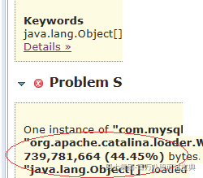

T f3 Problem Suspect 2

.jdbc.ResultSet"loaded by

lebappClassLoader @ Ox80256678" upies

The memois accumulated in one instance of

"<system class loader> 1O

Keywords com.mysql.jdbc.ResultSet java.lang.Object[)

org. apache.catalina.Joader WebappClassLoader @x8256678

E

T Hint 1

The problem suspects 1and 2 may be relatedr because the reference chains to them have a common beginning

E

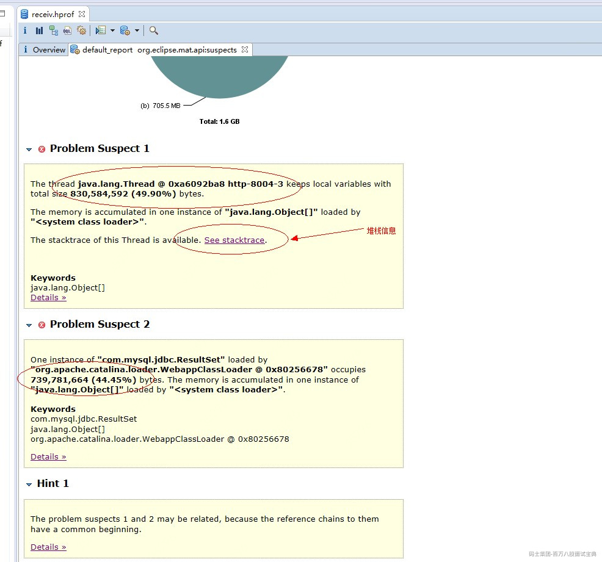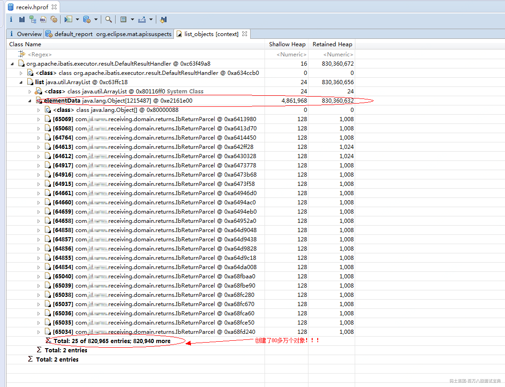

**点击第一个嫌疑犯的堆栈信息链接，仔细看就能发现该嫌疑犯是如何行凶的，如下图：**

**总结：内存分析工具有很多，使用MAT是其中的一种方法。另外，除了手动导出JVM内存信息**

**外，还可以通过设置JVM参数，在JVM发生内存泄露的时候自动导出文件。**

**4.3.4ArrayList递归调用addAll方法导致内存溢出**

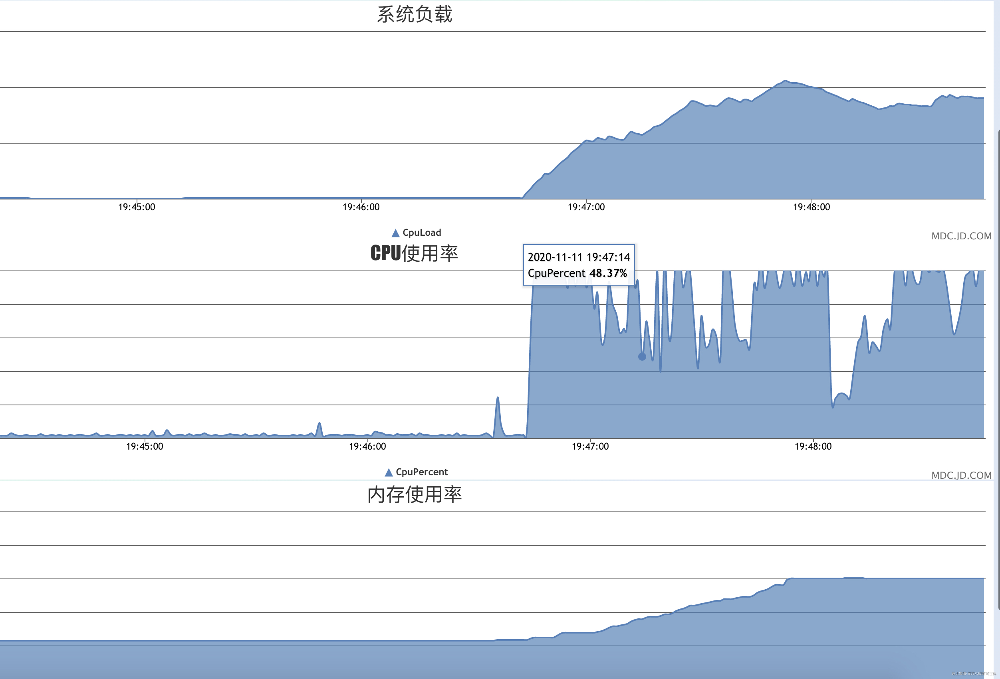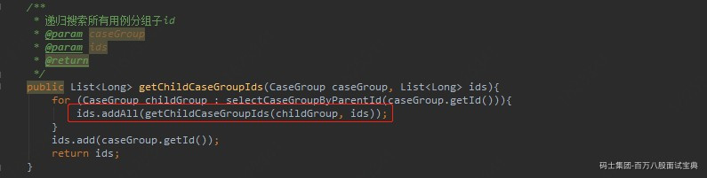

**1、问题现象** casegroupId为7197的分组无法删除成功。 其中一台服务器内存从20%上升至60%，cpu一直处于100%状态。

导致一段时间该服务器无法处理请求并报Network error异常。

日志上报 Java.Lang.OutOfMemoryError:Java heap space内存溢出异常

**2、排查过程**

根据log日志排查发现，每次服务器内存上升前都有调用删除分组casegroupId为7197接口的操 作。

将数据拷贝到本地环境后，复现了该问题，定位到问题代码如下：

**3、原因分析**

本段递归原思想以ids（ArrayList）为容器，循环添加每个子节点包含的全部分组id，并加上自身 节点，进行返回。

但是，由于ids为引用传递，每次addAll操作都会将容器中已有的ids重复添加到容器中，造成每次 添加容器中的数据都会发生倍增。

子分组数小时，不会发生异常现象。ArrayList 的每次扩容包括分配1.5倍的新数组空间，和老数组 历史数据的拷贝。

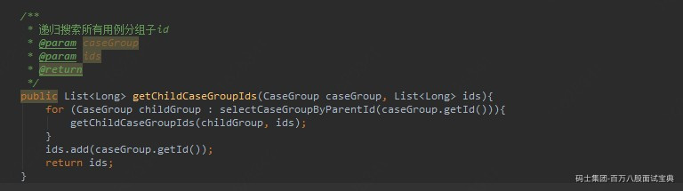

当子分组数超过27个时，数组长度达到了134217726，当长度超过Integer.MAX\_VALUE-8或系 统无法给ArrayList分配足够长的连续内存空间时，就会抛OOM异常 **。**

ArrayList的频繁扩容与拷贝操作，也导致了在执行递归方法开始到抛出OOM异常这段过程中， Cpu一直处于100%的状态，无法处理其它请求。

修复后的代码如下，由于ids为引用传递，不需要addAll操作重复添加至容器中。

**4、经验总结**

1、在写完递归方法后，自测一定要认真测试到递归方法层的输入与返回，功能通过不能代表代码 没有问题。

2、在使用ArrayList的时候，如果可以预知数组的大小范围，尽量对其进行容量大小的初始化，避 免其频繁扩容。

**4.3.5 读取excel引发的内存泄露**

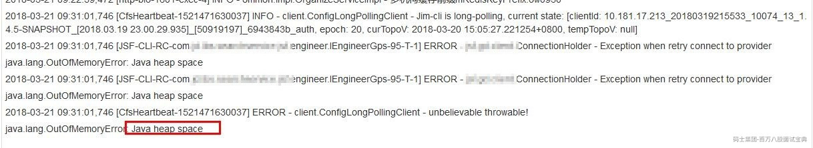

1.业务反馈las.im.\*\*.com打开显示502，去查logbook日志发现应用出现内存溢出

2.去ump中jvm监控查dump文件输入路径“-XX:+HeapDumpOnOutOfMemoryError -

XX:HeapDumpPath=/export/Instances/las-im-manager-new/server1/logs”，登录运维自 主平台下载dump文件

3.使用MAT工具打开dump文件，查看大对象的具体堆栈信息

at org.apache.poi.xssf.usermodel.XSSFSheet.read(Ljava/io/InputStream;)V (XSSFSheet.java:138)

at org.apache.poi.xssf.usermodel.XSSFSheet.onDocumentRead()V (XSSFSheet.java:130)

at org.apache.poi.xssf.usermodel.XSSFWorkbook.onDocumentRead()V (XSSFWorkbook.java:286)

at org.apache.poi.POIXMLDocument.load(Lorg/apache/poi/POIXMLFactory;)V (POIXMLDocument.java:159) at org.apache.poi.xssf.usermodel.XSSFWorkbook.<init>(Lorg/apache/poi/openxml4j/opc/OPCPackage;)V (XSSFWorkbook.java:186)

at org.apache.poi.ss.usermodel.WorkbookFactory.create(Ljava/io/InputStream;)Lorg/apache/poi/ss/userm odel/Workbook; (WorkbookFactory.java:73)

at com.jd.las.im.manager.service.wareservice.impl.ImportExcelWareAddrRelationServiceImpl.importExcel (Lorg/springframework/web/multipart/MultipartFile;)Lcom/jd/las/im/util/data/Result; (ImportExcelWareAddrRelationServiceImpl.java:114)

at com.jd.las.im.manager.action.basis.wareservice.WareAddrRelationController.upload(Lorg/springframe work/web/multipart/MultipartFile;)Lcom/jd/las/im/util/data/Result; (WareAddrRelationController.java:401)

4.去程序中查代码，excel导入读取是使用WorkBook的方式，经测试几兆的excel文件导入就占用

大量的内存（超1g）

5.去查poi文档 [**http://poi.apache.org/spreadsheet/how-to.html**](http://poi.apache.org/spreadsheet/how-to.html) ，发现POI提供了2中读取 Excel的模式，分别是：

**用户模式：** 也就是poi下的usermodel有关包，它对用户友好，有统一的接口在ss包下，但是它是 把整个文件读取到内存中的，对于大量数据很容易内存溢出，所以只能用来处理相对较小量的数 据；

**事件模式：** 在poi下的eventusermodel包下，相对来说实现比较复杂，但是它处理速度快，占用 内存少，可以用来处理海量的Excel数据

[6.参考了poi官方example（ **http://svn.apache.org/repos/asf/poi/trunk/src/examples/sr c/org/apache/poi/xssf/eventusermodel/examples/FromHowTo.java** ），使用事件模式](http://svn.apache.org/repos/asf/poi/trunk/src/examples/src/org/apache/poi/xssf/eventusermodel/examples/FromHowTo.java) 读取excel，解决了问题

**4.3.6 通用sql查询条件全if导致的内存溢出**

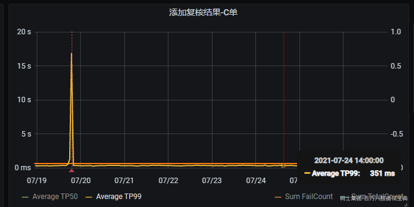

现象：

20210726发现grafana平台上 添加复核结果方法出现 17s左右的调点(平时此方法的执行时间约为

400-600ms)

问题分析：

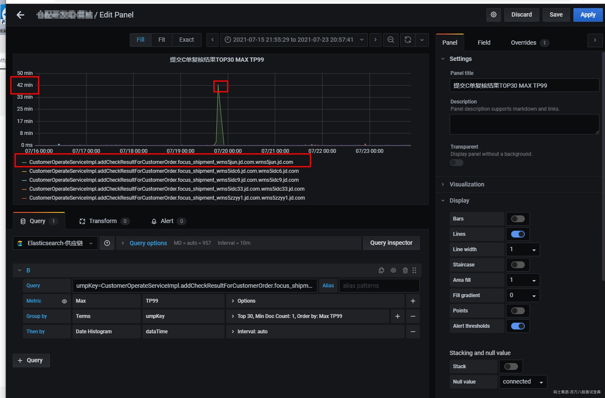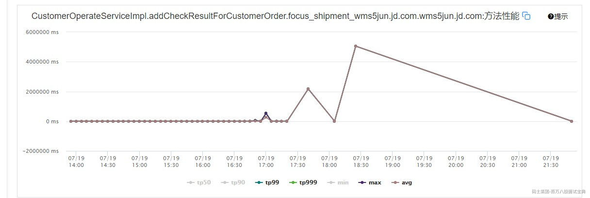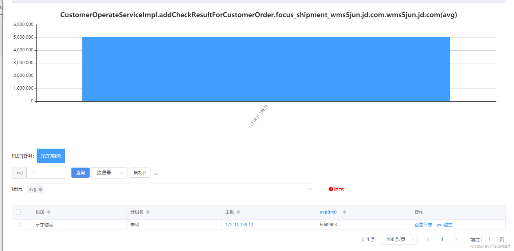

1.首先WMS是按照园区部署的。对应看板取得是全国平均值，所以需要使用自定义看板配置 确定 对应园区的，配置对应的看板进行园区查看：

发现7月19日出现了一个调用时长 超过42min的ump 告警

2.使用对应umpKey值:查找对应的机器IP，由于 wms客户端调用后台最大等待时间为1.5min，所

以怀疑此调用为 服务假死导致无法上报UMP，UMP一直等待profiler.end方法上传，获取到出现 问题的机器为172.31.136.xx

3.查询IP 对应机器对应的jvm内存,发现堆内存 在 7月19日17点左右开始飚高，按照监控中

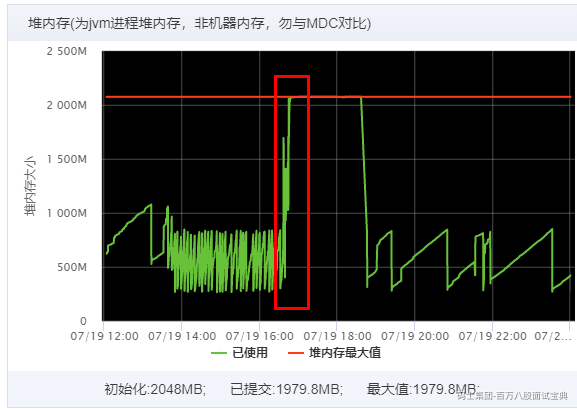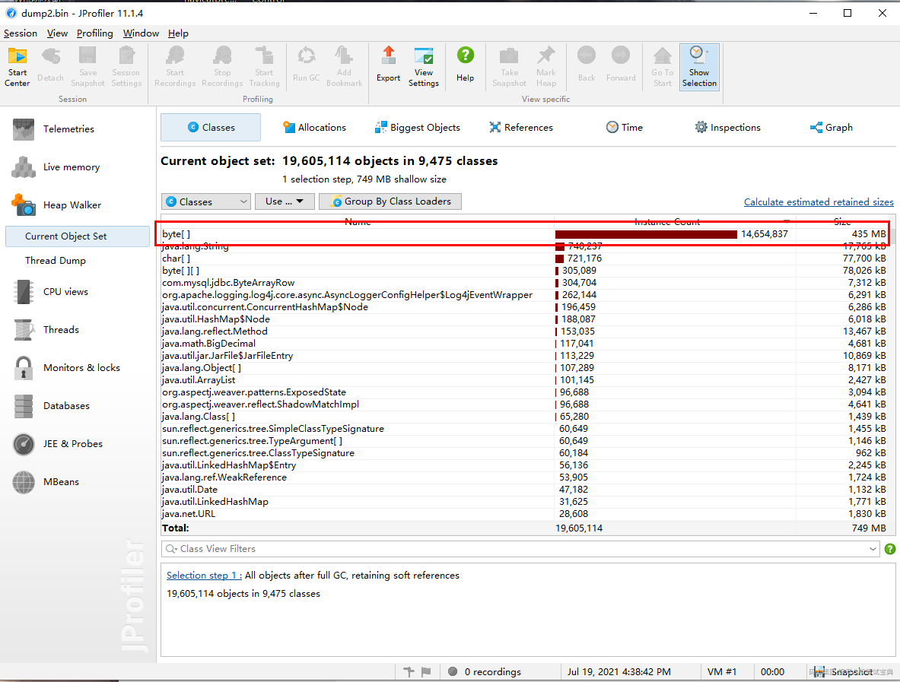

profiler.end的提交时间回推 对应请求的时间大概在16:58左右发起，与图中JVM彪高时间一致

查询地址：

4.目前JVM启动日志中都配置了 内存打满前自动dump,前往对应的机器dump日志进行分析,使用

工具为jprofiler,经过分析 发现byte类型占用了435MB的数据，并且调用来源为 ibatis.executor.resultset.ResultWrapper,经过jprofiler分析，怀疑有全表查询语句 返回了大对象 导致的内存溢出

5.登录myops进行查询对应数据库是否存在慢sql全表查询

找到罪魁祸首,图中SQL直接关联拣货明细和订单明细进行查询 未添加任何条件,根据查询时间 反 查到对应请求调用日志： 确定原因为研发本地手改报文调用服务端 导致的内存溢出(风险点：通 用sql为了保证兼容性，对条件进行全if判断，导致全表查询)

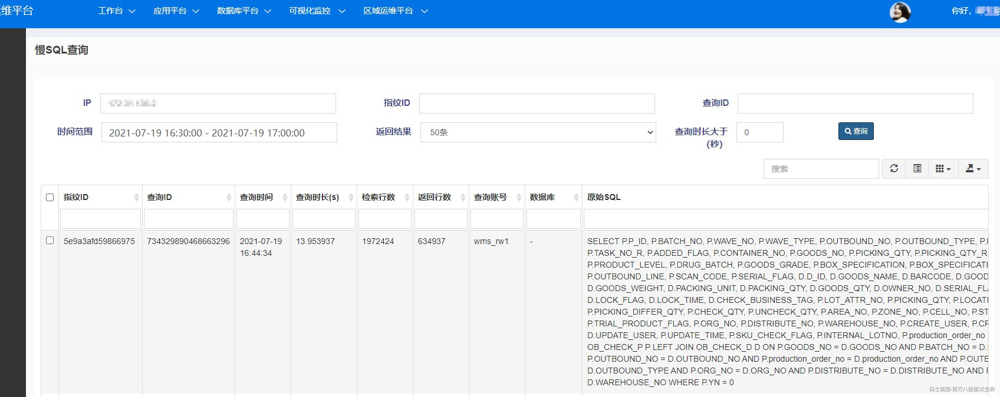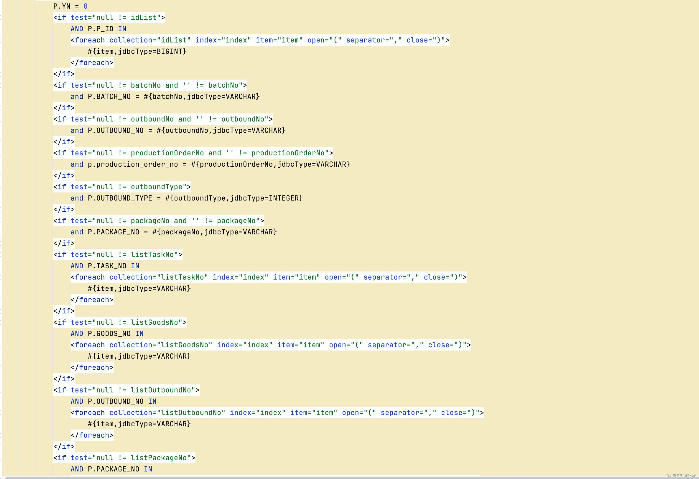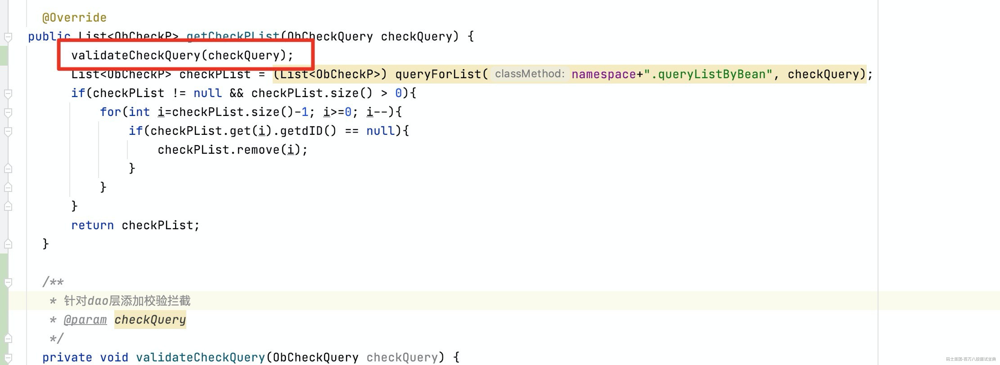

问题sql:

修改方案: 针对Dao层对一些基础参数进行强制校验(三要素)

**4.3.7 JVM堆栈内存溢出问题分析**

**一、事件回顾**

**整体处理时间** ：2020年07月23日 下午18：10 至 21: 50

**涉及主机： 10.176.213.11, 10.176.213.7, 10.176.243.78, 10.176.243.75**

**关键告警内容** ：JVM监控堆内存使用率超出阈值，URL探针连续x次访问目标地址出现网络超时 或者系统异常；

**告警影响范围：** 个别用户(5个以内)

**事件详细描述** ：

**18:10** 接收到 10.176.213.11 主机发送来的JVM内存使用率超出告警，随后又收到该

主机发送来的URL探针访问目标地址出现网络超时或者系统异常告警；

18:11 登录NP系统，摘除此主机

18:11 登录J-One，排除人为操作系统

18:12 登录日志系统，查看主机日志输出正常；排除log4j的日志Bug；

18:12 登录UMP系统，查看主机JVM指标：Yong GC 0~1 次/分钟 (正常)，Full GC

20+次/分钟( **不正常** ，平时为0)，堆内存 3.99G，占比100% ( **不正常** ，平时为

500M~1.7G，占比不超过50%)，线程数 < 1500 (正常)

18:15 返回J-One系统，留存主机堆栈信息和运行日志；

**18:16** 收到 10.176.213.7 主机发送来的JVM告警，随后几秒接收到该主机发送来的 URL探针访问目标地址出现网络超时或者系统异常告警；

18:17 NP上操作 10.176.213.7 主机下线

18:18 在UMP系统查看10.176.213.7 的 JVM各项指标，指标大致与10.176.213.11雷 同；

18:20 对主机10.176.213.11 执行应用重启操作

18:28 对主机10.176.213.7 执行应用重启操作

**18:30** 对主机10.176.213.11 重启完毕，各项指标恢复正常水平，验证后挂回线上；

**18:35** 主机10.176.213.7 重启完毕，各项指标恢复正常水平，验证后挂回线上；

**18:41** 接收到 10.176.243.78 主机发送来的JVM内存使用率超出告警，随后又收到该 主机发送来的URL探针访问目标地址出现网络超时或者系统异常告警；

18:42 NP上摘除 10.176.243.78 此主机；

18:45 留存10.176.243.78 主机的堆栈日志和运行日志；为了做事故原因分析，此主机 未进行重启操作；

**21:49** 收到 10.176.243.75 主机发送来JVM内存使用率超出告警，随后又收到该主机 发送来的URL探针访问目标地址出现网络超时或者系统异常告警；

21:50 在NP上摘除 10.176.243.75 主机；

**第二日 上午** : 由于已经留存了一台事故主机，于是重启10.176.243.\*\* 主机，验证后挂 回；

**二、问题分析**

**数据来源** ：

出现JVM内存溢出时生成的hprof； 一共两份，分别来源于10.176.243. **主机和10.176.213.** 主 机；

日志：一共四份：分别来源于出现问题的四台主机的eclp\_selle.log；

:

JVM :

•BiggestObjects byRetained Size

2.8 GS

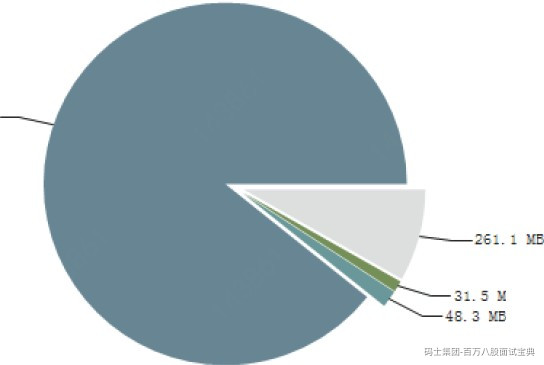

Slm

java.lang.Thread @OX712455468h p-lω1-18

ShallowSize:112B Retained Size:2.8GB

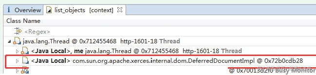

COntexn.;18S oaaer 9 3<t31l na.loaaer weoappι13SSLoaaer

D.th dLIjava.lThreadlocal$Th readlocalM @ 0><712455520

Þ () <Jav.J Loal > "framework.web.servlet.mvc.method tn.RequestMappingHandlerAdap@M

RXML :

Total:3.1 GIl

Shallow Hea p Retai nHeap

<NurTric:- < N u m ric .

112

112 2977C6

200 2.0'979488

JlIb -uabSJ.U

24 4.232

144 353448

ClassName

Þ 0 <Java Local > java.util.Arr73a218

Þ CJ.<Java Local> org.apache.catalinac. ore .standardHostValve C Ox70003babO

Þ 0 <Java Local > orga. pache.catalina.core.StaardEineValve C 7)()3bcd8

Þ CJ.<Java L1> org.apache.ca talina.valves.ErrorReValveC 70013f140

Þ 0 <Java Local > org.a pache.clina.core.Sta ndardWra pperValve CI Ox7001426f8

CJ.<Java Local > org.a pa .xmlbea ns.impl. << Cuntext C Ox7aU15ebO

Þ CJ.inheritedAccessControlContext java.security.Ac ControlConlext CP 0bc977d8

Þ CJ.<Java L1> java l.Arrsl C Ox70da

Þ CJ.<Java Local > java.lStriC Ox72bOca2u5343\u91cc\u9b\u5e94\u94f e

Þ CJ.<Java L1> org fra meworlc.web et.mvc.method tation.S et1nvoca bleHlerMethod cþ Ox73a228

Þ CJ.<Java Local> java.la ng.String C 0x6c5d510 ST

Þ n<Java Local > org ache.coyote.http11p11ProtocolSHpllConnler cþ Ox700047a98 Busy Monitor

Þ CJ.<Java Local > jal.ArraC Ox73a2e

Þ 0 <Java Local > java.lStO 0x6e7eO

Þ D <Java L> j iJVð.net.SoC Ox72bOcda

<Java Local > va.util.tinkedLjst C Ox73a2e07c8 þ 0.<Java Local > java I.linkedlist C Ox73a2eOal0 þ WJ.name cha r[10 7124554<:18 http-l1-18

þ 0.<Java L1> or9 fra mework.web.method.Ha lerMC Ox73a2eOad}

Þ CJ.<Java Local > org.a pad lina re.ApplicationFilte @70ab538

Þ()<Java L1> org.a paιhe talina.core.Appli tionFilte @70abae398

Þ [). <Java Local> target org.a pache.tomcat.util.netJloEndrker C Ox7124555

þ 0 <Java Local> java.la ng.String C 12b0c81b8 *19* dsNew/impoB. ds.d

þ 0.<Java Local > java.lS @72UO 1

Þ liùbuf bγte(2S6851696) CP Ox714Sc3ds8 m t version::"l.o'encodi;:'UTF-S" ne:'yes'?>..-< heet xmlns:::"http://schemas.openxmlfol

Þ ß <class> class java io.BnpYtStrea m @ Ox6f026estemClus

7 Total:2 entries

Þ (i .L <Java Local > java.la ng.Object[3] C Ox13a2e0700

Þ CJ.<Java Local > java.lStri @73a2eOb38 importBatGoods.d

þ 0 <Java Local > a pachena.conneyoteAda pter C Ox702lf 8ed8

Þ D.<Java Local > Mna mespac.e.QNa me C Ox7138

Þ 0 <Java Local > springframework.web.multipart.mmons.CommonsMultipartle 0 72bO98

1)va Lb 'pofra mework.web.servlet spatc.hcet$1 C 72bOc.c.Sω

<Java Local > .openxformschemas readsheetml.x2m. mpl.CTSheetImpl C 73a2d4

va L 1> org.openxmlformats.schemas.spreadsheetml.x2m mpl.WoQGumempl CÞ Ox73a2d41

Shallow Hea p Retai ne Hea p

24 8()

40 72

40 72

40 72

72 72

72 72

32 64

24 64

32 64

64 64

32 56

32 56

24 56

32 48

32 48

24 48

24 48

40 40

40 40

32 32

32 32

32 32

32 32

32 32

32 32

256.851.712 256.851.712

32 32

32 32

24 24

24 24

24 24

24 24

24 24

24 24

**线程调用的HTTP响应方法：**

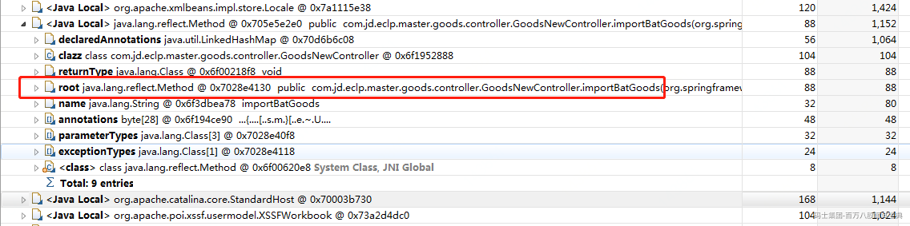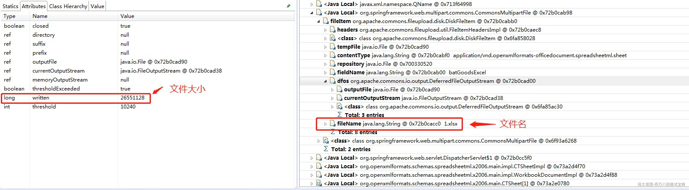

**用户上传文件**

**原因分析** ：

在查看JVM内存堆栈信息分析报告的，Orverview的大对象图表中，说名称为"http-1601-18"的 线程事例时占用内存超过2G；继而查看该线程实例包含属性实例明细列表；

发现线程中占用内存最大的实例类为： com.sun.org.apache.xerces.internal.dom.DeferredDocumentImpl ，占用内存 2G 左右；初 步可以确定此实例的创建造成了JVM内存溢出；

而该实例是POI工具包用于解析xlsx格式文件中的XML文件用的，也就是说是因为该线程执行过程 中需要有xlsx文件解析逻辑。

进而查询该线程的调用HTTP业务接口，是：

com. **.** .master.goods.controller.GoodsNewController#importBatGoods ;

结合代码，获知此方法是用于批量导入事业部商品数据的，其大致逻辑是:

1. 接收用户导入的xlsx文件

2. 使用POI包对文件进行解析

3. 循环遍历解析后的数据，对他们进行数据验证、数据入库(及创建商品)操作

4. 返回导入结果

结合的代码逻辑，堆栈信息分析，初步结论为某一用户在执行改操作时，导入了过大文件，导致此 次的JVM 内存溢出事故；

然后查询四台主机操作日志：果然发现同一个用户在每次告警前的几分钟，都在商家工作台执行了 商品导入操作；

因而得出本次JVM内存溢出的最终原因为：系统并未对导入文件大小做限制或限制太宽松； 从而 导致用户导入较大的文件时在解析过程中出现 JVM内存溢出问题；

**三、问题修复方案**

**1、对上传得文件进行大小限制；限制的原则就是根据模板和数据条目上限，计算 出一个合理的数值；根据实践：1000条的数据文件大小约在135K，5000条的文 件大小在619K；也就是说文件大小不应该超过1M;**

**而本案例中,用户上传的文件大小在26M左右；**

**2、解析数据时，要先进行数据行数验证，在对行数据进行解析；尽量减少数据转 换次数。**

**4.3.8 生产环境部分机器内存溢出问题处理**

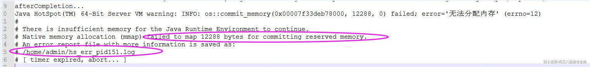

**一、摘要**

**时间：** 2018.1.31 13:30:00 --2018.1.31 17:00:00

**问题：** 3c联盟用户点击请求时，部分请求出现502的现象；导致部分请求处理失败

**原因\*** \*：\*\*服务器其中一台服务器，jvm因为内存溢出导致宕机

**影响：** 用户量暂时不大，影响范围较小，5台服务器，一台出现问题

**应急措施** ：将出问题的机器从负载上去掉，保证线上服务正常运行，处理时间约30秒左右

**二、事故背景**

系统已于11月底上线，一直运行正常，没有问题反馈，前期有持续观察服务器，没有发现问题。 于2018年1月31号，接到业务方反馈和预警邮件，部分请求出现502的情况。经查看发现5台服务 器中的一台宕机，Tomcat进程已经不存在了。

**三、事故分析过程**

**第一步：** 把出问题的那台服务器从负载上去掉并解决线上问题之后，用jdos的监控中心对该服务 器及负载下的其他服务器的运行状态进行观察发现：该服务器的jvm已经没有数据，其他服务器 jvm内存均接近100%，看来其他服务器也岌岌可危啊。

**第二步：** 查看了下宕机的那台服务器日志，关键信息如下：

为了查看该日志文件，和jdos同事，申请开通了 该服务器 和 另外一台濒临崩溃的服务器的 终端

连接信息；

该文件信息基本上全是当时崩溃是的内存的一些大小参数（忘记截图），参考意义不大；

**第三步：** 紧接着为了查看内存中到底是什么对象导致了内存的崩溃，由于jvm崩溃了，获取不到现 在的一些信息了，于是连接到另外一台“濒危”的服务器上，去查看jvm内存的一些状况，具体情 况如下

首先使用查看了下 jvm进程ID为 139

**使用该命令 ：sudo -u admin ./jmap -histo 139|more 查看到的情况如下：**

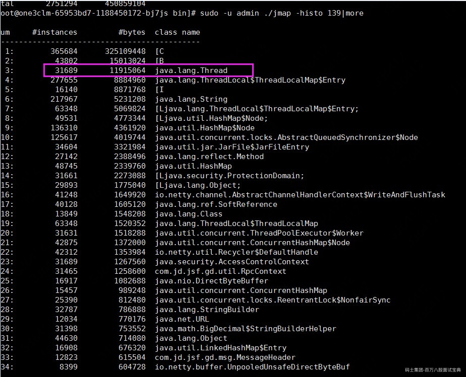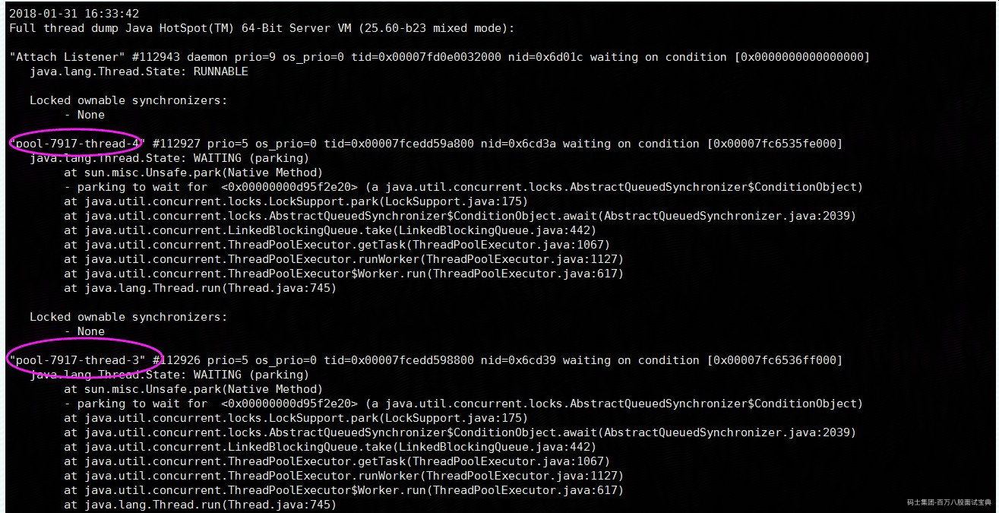

如图：有31889个“Thread”事例导致，初步分析，某个地方在疯狂创建线程。但是，在哪个地

方创建呢？我和几个相关同事沟通，确定没人在这个项目里边创建过线程。

其实这个时候离成功仅有一步之遥了。

**第四步：** 正在兴奋的解决中，杨xx同学也参与进来建议用 **sudo -u admin ./jstack -l -F 139 >**

**stack.txt** 打印堆栈信息，如图：

查到有7000多个线程池，可以定位某个地方在疯狂创建线程池，肯定了第一步的判断

然后全文搜 Executors，发现之前的同事有两处创建线程池，并且是每次该请求接口基本上都会创 建一个固定4个大小的线程池！原因终于找到了；此处列举一处：

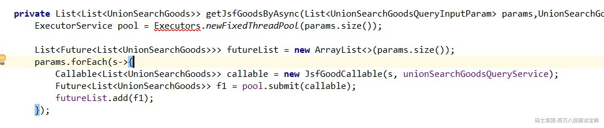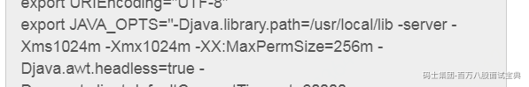

于是，将宕掉的机子重启，然后频繁的去请求该接口，复现了异常情况，由此可以肯定了判断。此

处修改为启动的时候创建一个线程池，请求的时候创建一个Callable实现即可。

**续：补上此次服务器的jvm参数，以及dump文件大小**

使用命令 sudo -u admin ./jmap -dump:format=b,file=a.hprof 139。

**四、事故反思总结**

1、将服务器监控预警做到位，此次疏于预警，导致服务器异常，没有及时发现，而是由业务方通 知发现的，以后应避免此类事情再次发生。

2、多人合作项目，项目时间长一些细节东西已经记的不清晰了，以后重要的设计点最好有设计问 题，方便后人解决问题。

3、有必要进行codeReview，来相互学习，相互进步。

4、应继续加强深入学习jvm相关知识，此处的事故算是一个在学习jvm道路上的一个成功解决案 例。

**4.3.9 JVM异常终止问题排查**

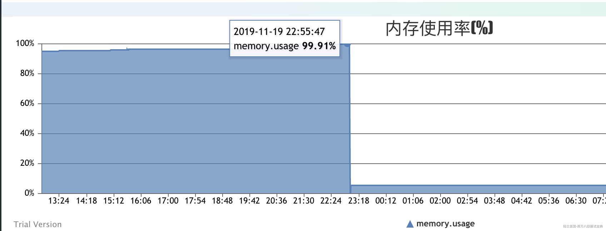

1.现象

11月19号，jdos两台机器JVM突然挂掉（11.26.78.xx、10.190.183.xx）， 查看MDC监控，发现jvm挂掉的时间点 机器内存占用很高（99%）；

查看UMP-JVM监控，JVM各项指标很正常

920:50:20 '"- .:DI

10 467259218

.. '"" . .. }

gaMez--2Rv-u

"

lI/1g 11Ilgll'SO 1IIIV n IIIIQ n IO II/1V n..o 1IIIgn lO II/1Qn 40 1IIIV n SO lI/1g41ω

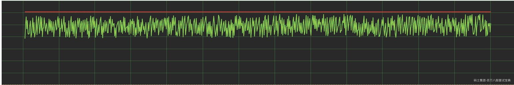

.

10 467259218

VogGC FullGC . .. '"" .(..fLð } m.

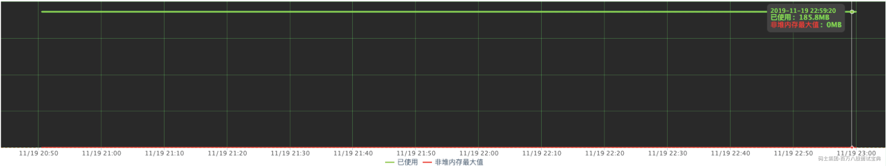

467259218

YoungGC FullGC jfi . "υ " ' . }

C '" .1

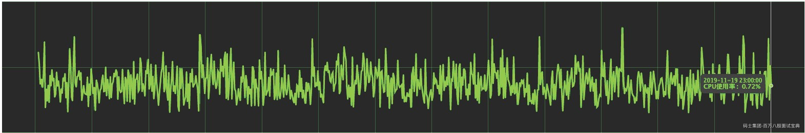

1l/1920.S0 1l/1921(.)O 11/192110 1l/19 20 111l92UO n/19 40 11/192150 11/1922ω11/192210 11/192220 11/192230 11/1922 H92250 11/19 2)()O

-(

.

YoungGC full GC '"" { ..}

..

•

0

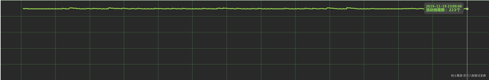

'"92UO 11/1922ω11/192210 11/192220 11/1922 10 1111922 11/1922 50 11/1921ω

z

""GCM"' "

11119 B 11/192110 11/192120 l1/1921JO 11/1921 1111921'50 11119U 1II19UI0 11119U20 1I/1922JO 111192240 11119U.50 11/19 ω

-GC..

yong gc ;JVMj:full gc; CPU

2. -Google

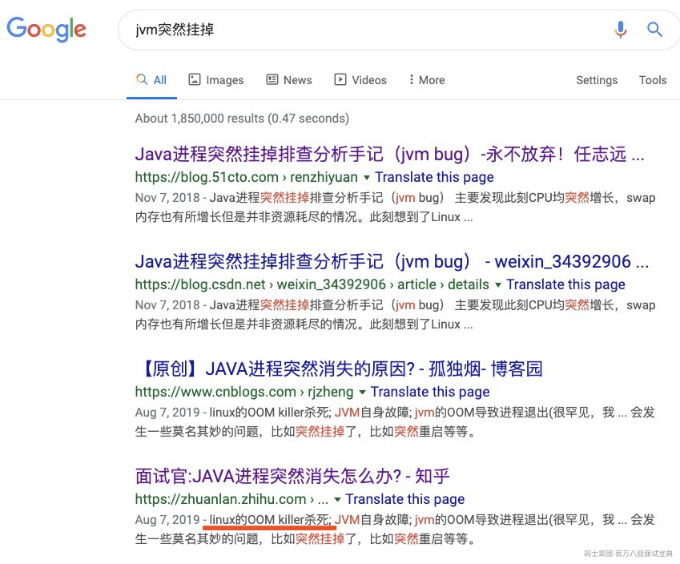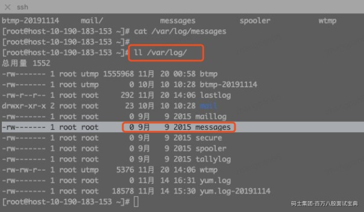

**linux的OOM killer**

Linux 内核有个机制叫OOM killer（Out-Of-Memory killer），该机制会监控那些占用内存过 大，尤其是瞬间很快消耗大量内存的进程，为了防止内存耗尽而内核会把该进程杀掉。 因此，你 发现java进程突然没了，首先要怀疑是不是被linux的OOM killer给干掉了！

OK，顺着这个思路，确定到底是不是被oom killer干掉的。

查看系统报错日志: /var/log/messages，发现此文件是空的（后来咨询jdos运维同事得知，docker实例 写此日志被禁用）

查看内核日志：

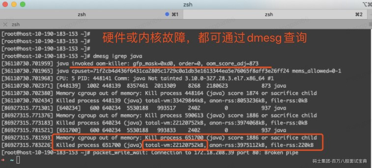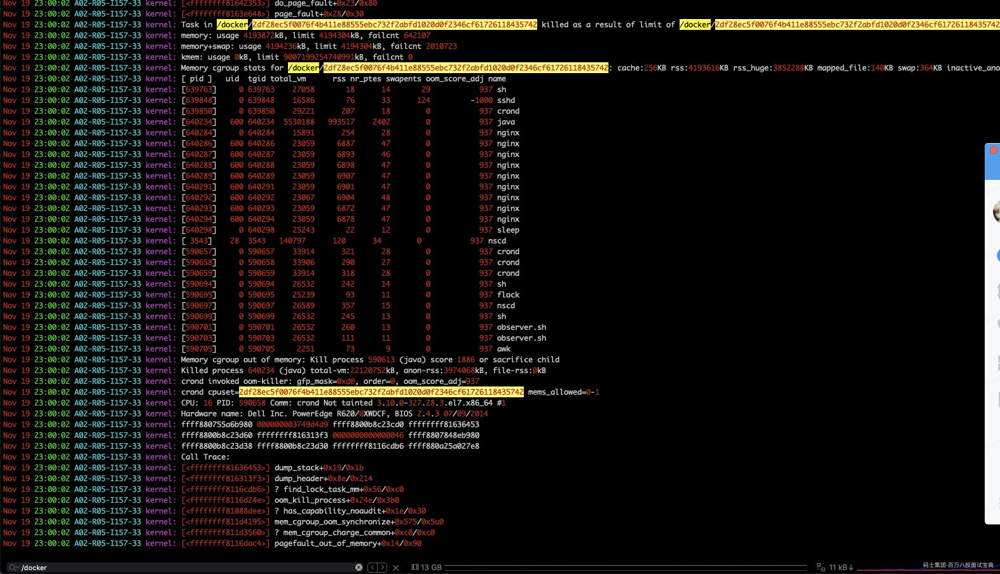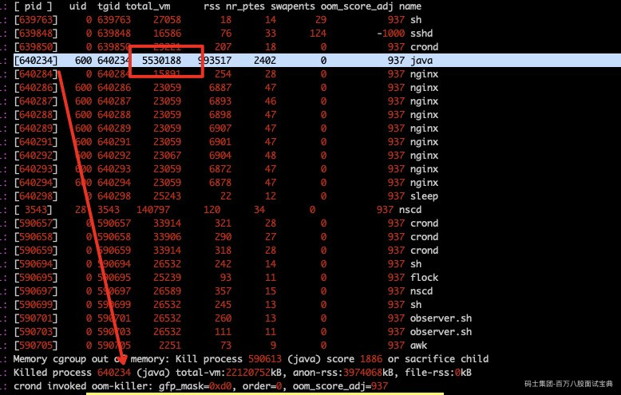

dmesg输出信息有调用oom-killer，但是从内存来看貌似是宿主机的（total-

vm:22120752kB），时间点无法确定；

联系运维查询：

可以确定JVM是被操作系统oom killer干掉了，

问题：docker规格4c4g，为何java进程会占用5.2g？

jdk1.8及之前，JVM是感知不到容器的存在的，所以会使用宿主机的信息来计算，docker -m参数 一般用来限制应用内存大小，跟镜像版本也有很大关系，有的版本限制的差不多相当于物理内存的 百分之50.

模拟：OOMKilled

4.3.8-4.3.9 案例说明一个问题：遇见jvm异常退出，先找dump文件，dump如果没有，找

hs\_err\_pid.log日志。如果还没有，翻内核日志。

1-jvm建议配置

以8G内存为例：

1-垃圾回收器的参数

2-元空间需要配?512，350

3-堆内存最大最小？4G

4-栈大小？512k

5-直接物理内存？

6-GC日志，

不建议配置的： 各个区域的比例，默认值，

**4.4 雪花算法重复**

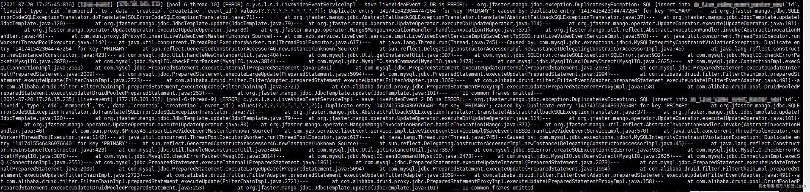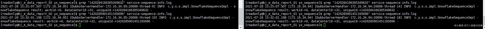

**问题发现**

查看服务A发布项机器日志，发现表的insert报主键冲突异常

查看发号器服务器日志，发现两台机器产生相同的uniqueID

**定位**

1.发号器生成算法-雪花算法 该项目所采用雪花算法规则，64位生成的唯一标识，由4部分构成：1位符号位，41位的

diffTime，5位的datacenter，5位的workerId，12位的sequence

diffTime:当前的时间戳

datacenterId：当前机器IP对应唯一数字，2台机器IP分别为：xxx.xxx.xxx.94，xxx.xxx.xxx.95

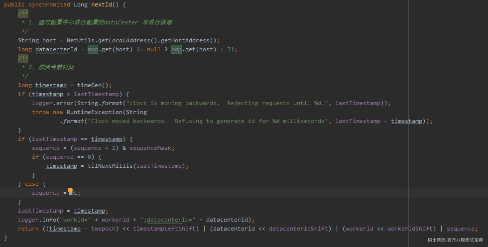

（配置中心配置的映射关系）

workerId：统一配置为0，无意义

sequence：自增序列，保证同一台主机同一时间戳下生成的唯一值

**雪花算法生成规则 机器IP来源于配置中心**

服务部署在两台机器上，两台机器IP分别为：xxx.xxx.xxx.94，xxx.xxx.xxx.95.配置中心配置的正 常配置应该如比如{"xxx.xxx.xxx.94":0,"xxx.xxx.xxx.95":0}

配置中心缺少配置，因此雪花算法中的datacenterId都是用默认值31，因此两台机器在同一毫秒 生成的ID会重复

**影响范围** 所有依赖该服务的应用 **解决方案**

1：方案1：应用中自定义算法工具类，优点：不依赖该雪花算法服务，避免修改雪花算法对其它 服务产生影响。缺点：定义新规则开发雪花算法

2：方案2；修改配置中心，重启雪花算法服务。优点：不需要修改代码 缺点：对其依赖产生影响

**设计考量：**

java基础数据类型当中

int类型最大值10亿级别（数量级，明显不够用） float和double，存在不精准运算，有效位数并不大，占用字节最大同long 综合考量：long类型数据规很大，足够应用在ID策略上了

**负数如何存储 位运算：&。如果两个对应的二进制位上的数都是1，结果是1，其他都是0**

0000 1000

0000 1010 结-----果

0000 1000

**按位或：|。如果两个对应的二进制位上的数都是0，结果是0，其他都是1**

0000 1000

0000 1010 结-----果

0000 1000

**按位异或：^。如果两个对应的二进制位上的数字相同，则运算结果为0，其他都是1**

**左移：<<。把二进制数据在内存空间中向左边移动。左移n相当于乘以2的n次方，但要注意两 点：1-左移带有符号位的，说明每个数据类型左移都有位数限制；2-左移后原来的值不变，移位 后是一个新的值**

**补码：该数的原码除符号位外各位取反，然后在最后一位加1**

-1L去除符号位原码：

0000000000000000000000000000000000000000000000000000000000000001

取反：

1111111111111111111111111111111111111111111111111111111111111110

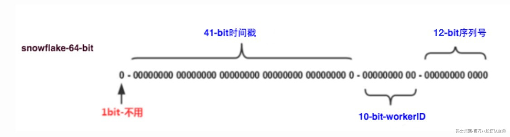

加1：

1111111111111111111111111111111111111111111111111111111111111111

**雪花算法原理分析**

前置条件：单机，机器中心：31机器号吗：31

workID：可认为是机器特征号码，一般由两部分组成：数据中心+机器号，各占用5位。也就是最 大值2^5\*2^5=2^10=1024个值(0-1023)

单机情况下，如果不考虑时钟回拨，上图中，workID对于单机固定，12位序列化的变化范围为：

2^12=4096个值（0-4095）

这么分析，单机该种算法，每一毫秒可产生4096个可用不重复的序列号

1s内4096\*1000=4096000个。足够很多场景下使用了。 时间部分：

2^41/1000\*60\*60\*24\*365 = 69年

69年都不会重复，既然只能使用69年，我们系统中的时间，是从1970年开始的，所以设计上，设

置一个起始时间，也就是项目开始的时间，目的为了使用更久的时间，

**代码**

public synchronized long nextId() {

long timestamp = timeGen();

if (timestamp < lastTimestamp) {

System.err.printf("clock is moving backwards. Rejecting requests until %d.", lastTimestamp);

throw new RuntimeException(String.format("Clock moved backwards. Refusing to generate id for %d milliseconds",

lastTimestamp - timestamp));

}

if (lastTimestamp == timestamp) {

sequence = (sequence + 1) & sequenceMask;

if (sequence == 0) {

timestamp = tilNextMillis(lastTimestamp);

}

} else {

sequence = 0;

}

lastTimestamp = timestamp;

return ((timestamp - twepoch) << timestampLeftShift) | (datacenterId << datacenterIdShift) | (workerId << workerIdShift) |

sequence;

}

if (timestamp < lastTimestamp) { //lastTimestamp，上次生成时间，本次生成时间

timestamp ，如果小于，说明时钟回拨

if (lastTimestamp == timestamp) {//说明两次生成ID的时间戳在同一毫秒内，否则，每一s从0 开始生成最后的序列号。

最终如何组成结果：

return ((timestamp - twepoch) << timestampLeftShift) | (datacenterId << datacenterIdShift) |

(workerId << workerIdShift) |

sequence;

每一个号段向左移位置，在按位或，如下图：

第一步:时间 左移22位

0101111100100110010111110101000111111101110000000000000000000000 第二步:数据中心datacenterId 左移位17

0000000000000000000000000000000000000000001111100000000000000000 第三步:机器号码workerId 左移位12

0000000000000000000000000000000000000000000000011111000000000000 sequence占据后12位置

0000000000000000000000000000000000000000000000000000111111111111 第四步:跟sequence组合按位或

0101111100100110010111110101000111111101110111111111111111111111

这里解释了最终结果的构成，非常巧妙，综合了性能，变化点，生成了非常完美，不容易重合的一

个long数字，那么问题只剩下，相同时间如何拿到后边的12位序列了

if (lastTimestamp == timestamp) {

//如果等走到这里：说明来给你个问题，第一：肯定生成过一次序列，那么sequence一定不可能从0开始

//sequenceMark=-1L ^ (-1L << sequenceBits)经过前面基础知识，可知

//sequenceMask=0000000000000000000000000000000000000000000000000000111111111111

//如果sequence=0，说明：

//sequence + 1= 0000000000000000000000000000000000000000000000000001000000000000

//sequence = 0000000000000000000000000000000000000000000000000000111111111111

//说明此时sequence=4095，及已经增长到最大值

//初始进入此条件的时候，sequence=

0000000000000000000000000000000000000000000000000000000000000000

//经过sequence = (sequence + 1) & sequenceMask;

//sequence=0000000000000000000000000000000000000000000000000000000000000001 sequence = (sequence + 1) & sequenceMask;

//如果此处等于零，相当于4095之后，在同一秒内再次需要生成序列，此时根据设计12位，已经不能在生成 了，所以，相当于系统调整了下时间，把当前时间修改到下一秒钟，参考tilNextMillis(lastTimestamp)，不 难理解了。

if (sequence == 0) {

timestamp = tilNextMillis(lastTimestamp);

}

}

存在的问题：

问题1：注意事项 雪花算法的设计等价于单台机器 不变（符号位置）+变化（时间戳）+不变（最大31）+不变（最大31）+变化（0-+4096）

多台机器

不变（符号位置）(不变)+变化（时间戳）(多机会重复)+（不变（最大31）()+不变（最大31）） (组合不变)+变化（0-+4096）(可能重复)

等价于： 不变+不变+（变化）（自由组合）+不变 自由组合：可以分成2段，也可以是云主机一段，每个IP不通即可、 问题2：时间回拨

这种设计，严重依赖服务器的时间，但是时间，不仅是哲学家的难题，也是计算机领域的一大难 题，至少linux上，存在时间同步等产生的时间跳跃问题，在分布式环境中，如果事件发生回拨， 则很大概率产生重复的ID。

知道了原生的雪花算法，我们在理解美团和百度开源的算法其实就不难理解了；

**4.5 序列化**

**4.5.1 运营商 POP 裸机搭售自营套餐事故分析**

摘要 时间：12 月 2 日~12 月 3 日 需求：运营商 POP 裸机搭售自营套餐(Android) 问题：APP 自营合约机套餐数据未下发 原因：获取商品 sku 代码缺陷导致系统出现异常 影响：APP 自营合约机单量下降 应急措施：生产环境版本回滚

事故背景

原定于 11 月 28 日发布的【运营商 POP 裸机搭售自营套餐】需求，上线过程中 master 打包测 试不通过，发现是本地缓存影响 6.5.3 版本以下的合约机套餐数据下发。经过和商祥 开发确认 后，删除合约机 handler 的本地缓存处理，并于 12 月 1 日重新测试、发布上线。

事故过程简述

12 月 3 日业务方（3C 文旅事业部）反馈产品自营合约机下单量有所减少，接到产品反 馈之后对 线上服务进行回滚操作，回滚之后系统恢复正常。同时进行问题排查，经分析问题 由新上线的功 能中，获取商品 sku 部分代码出现异常导致。次日完成问题的修复和测试并 于 12 月 5 日重新上 线。

事故原因分析

开发阶段：上游 http 接口返回的合约机的套餐数据，在反序列化为 Map对象的过程当中，使用 的 Fastjson 工具会根据 json 对象中数值的长度，自动转 换为不同类型的 java 数值。在本次 sku 的获取过程中，会将长度为 11 的 POP 商品 sku 转换为 Long 类型的数值，而长度为 7 的 自营商品的 sku 则被自动转换为 Integer 类型。 在开发过程中，未能意识到该潜在的问题。在 service 层代码中获取 sku 时候，使用了和 该方法中其他字段一样的获取方式，即强制类型转 换。这种处理方式对于 POP 商品的 sku 是没问题的。但是当遇到自营商品 sku 的时候，出现将 Integer 类型的数值转为 Long 类 型的情况，这样就触发了 java 的类型转换异常

(ClassCastException: java.lang.Integer cannot be cast to java.lang.Long)，抛出异常之后， 后续代码不再执行，所以出现自营 商品合约机套餐不下发的情况；

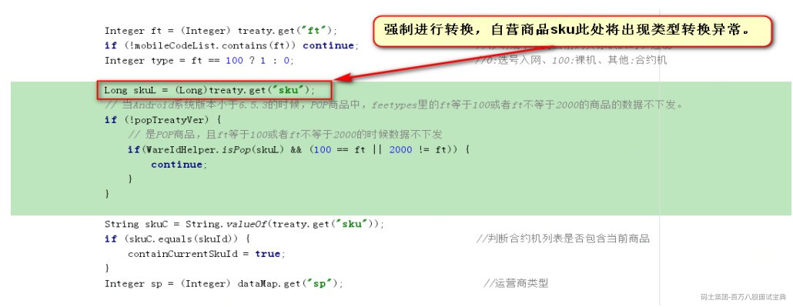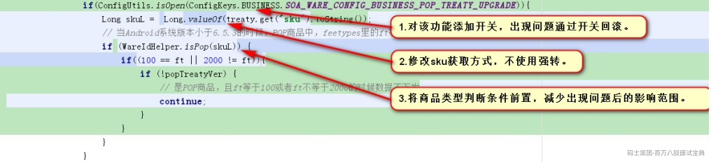

自测阶段：只使用 PRD 文档中提供的 sku 进行了验证，忽略了对自营商品 sku 的验 证。 事故代码：

1）强制转换，遇到自营商品 sku 将抛出类型转换异常。

2）行原有异常捕获处理中将异常输出为 info级别，会导致线上出现异常信息不 打印。 修改后代码：

1） 添加开关控制，出现问题通过开关回滚；

2） 修改 sku 获取方式，不进行强转；

3） 将商品类型判断条件前置，减少修改影响范围；

4） 将异常日志类型从 log 改为 error，出现异常生产环境将打印出异常堆栈；

5） 添加缓存开关功能，如果出现缓存导致的问题，通过开关关闭缓存功能。 事故反思总结

本次事故主要有两方面原因导致，第一是开发过程中考虑不够全面，没能够提前识别到 不同类型 商品的 sku，长度不同可能导致的问题；另一方面测试时只局限于 PRD 提供的测 试数据进行， 没能够自主去查找自营商品数据进行全面的测试。如果上面提到的任一环节稍 加注意就不会出现 此次事故。

通过对此次事故的反思，今后的开发及自测中需要注意以下几点：

1） 要建立开发过程中的代码交叉 review 机制并自觉坚持执行，提前排查运行期 可能发生的异 常；

2）要求产品提供更多 sku，开发和测试有充足的 sku 验证；

3.）除了完成业务逻辑之外，单独开发回滚开关，做好秒级回滚的预案；

4）功能上线前提前、积极沟通好业务方产品配合上线走查，降低上线风险

**4.5.2 直播抽奖超发奖品**

“如果一个人因为怕被骂，而不去做他认为正确的事情，就是他达到上限的时候--高铁”

**X日凌晨，接到客诉：购买礼品抽不出奖品，经定位发现 直接原因是没有建表，之后盲目的处理 过程当中认为mq没发生重试，对账过程当中又没有核对数据明细， 错误的补发了金币，针对此次 事故，分享出来一些犯过的错误，与大家共勉，引以为戒！！！**

**主要问题清单：**

核账

fastjson 序列化需注意问题 日志规范

代码严谨性

按时间顺序还原问题经过，内容如下：

**代码严谨性**

问题代码1-自动建表job

job方法片段：

@Override

public ReturnT<String> execute(String... params) throws SQLException { logger.info("CreateTableJobHandler execute params->{}", (Object[]) params); Integer year = null;

Integer month = null;

try {

year = Integer.parseInt(params[0]); month = Integer.parseInt(params[1]); tableTemplate.operate(year, month); logger.info("CreateTableJobHandler.execute success");

} catch (Exception e) {

logger.error("CreateTableJobHandler params error:{}", (Object[]) params);

return ReturnT.ERROR;

}

return ReturnT.SUCCESS;

}

tableTemplate.operate 方法片段

public void operate(Integer year, Integer month) throws SQLException {

//月表

for (String monthValue : monthList) {

Calendar calendar = DateUtils.getPreMonthCalendarByYearAndMonth(year, month); String monthString = DateUtils.getFormatedDateString(calendar.getTime(),

DateUtils.FORMATE\_YYYYMM);

String sql = MessageFormat.format(monthValue,monthString);

Integer result = (Integer) sqlService.executeSql(sql, getConnection());

if (result.equals(-1)) {

logger.error("sql error:{}", sql);

}

}

//天表

for (String dayValue : dayList) {

List<Date> datesByYearAndMonth = DateUtils.getPreDatesByYearAndMonth(year, month);

for (Date date : datesByYearAndMonth) {

String dayString = DateUtils.getFormatedDateString(date, DateUtils.FORMATE\_YYYYMMDD);

String sql = MessageFormat.format(dayValue,dayString);

Integer result = (Integer) sqlService.executeSql(sql, getConnection());

if (result.equals(-1)) {

logger.error("sql error:{}", sql);

}

}

}

}

job设计功能及缺陷

1. 功能： 每月定期四次执行，如果入参为空，则建立下个月的表，年末顺延下一年度

如果入参不为空，则建立指定指定参数下一个月的表，年月正确性校验

2. 缺陷： 如果年月是一个已经过期的，未处理，

case，输入2021,4 则当月分执行可生成5月份表，到5月份的时候，6月份的表不会建立

类似问题思考：方法入参校验，调用链路上方法分不清边界，参数完整性校验，异常抛出问题，都 很值得思考

**解决方案：建立有效的建表审查复查机制，用技术的角度解决认为疏忽的问题。**

**核账**

当初问题发生后，运营的建议是补发金币，代码如下，先贴出来，我们后分析:

@Override

public ConsumeConcurrentlyStatus consumeMessage(List<MessageExt> msgs, ConsumeConcurrentlyContext context) {

try {

GiftSendMessage message = JSON.parseObject(msgs.get(0).getBody(),

GiftSendMessage.class);

UserInfo userInfo = new UserInfo(); userInfo.setMemberId(String.valueOf(message.getFromId())); userInfo.setScId(message.getScId()); userInfo.setAnchorScid(message.getAnchorScid()); userInfo.setAnchorId(message.getAnchorId()); userInfo.setGiftSendToId(message.getToId()); DrawByGiftSendConfig draw =

filter.getGiftIdBySend().get(String.valueOf(message.getGiftId()));

GiftSendRequest request = new GiftSendRequest(); request.setActivityId(draw.getActivityId()); request.setBoxType(draw.getBoxType()); request.setGiftOrderId(message.getGiftOrderId()); request.setBatch(message.getAmount()); request.setSendTime(message.getSendTime()); request.setUserInfo(userInfo); request.setPaymentVersion(PAYMENT\_VERSION);

this.userDrawService.giftSend(request);

LOG.info("DRAW BY GIFT SEND WITH SANTA CHECKOUT, MQ-MESSAGE={}, REQUEST={}", JSON.toJSONString(message),

JSON.toJSONString(request));

} catch (Exception e) {

LOG.error("GIFT-SEND-QUEUE CONSUME FATAL ERROR ON PARSING, DROPPED, MSG={}, EXCEPTION={}, EXCEPTION-MESSAGE={}",

JSON.toJSONString(msgs), e.getClass().getSimpleName(),

e.getMessage(), e);

}

return ConsumeConcurrentlyStatus.CONSUME\_SUCCESS;

}

MQ消费者中有try catch块，核账的时候未详细的核对数据。其实mq已经发生重试，重试发生在

有表的时候，执行逻辑正常，保证了数据完整性。

思考：分析过程不代表事实，所有故障，一般都发生在 ‘自以为的不科学‘，事实却从不说谎。

**解决方案：建立行之有效的核账机制，用管理和制度的维度，杜绝不规范操作**

**问题分析**

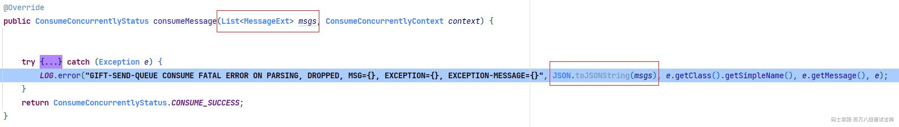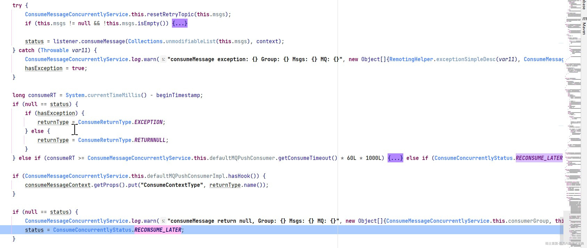

上面的代码，问题出现在

图中红色方框当中，用的序列化方式为 fastjson，此行代码会抛出异常，导致消费失败，进入重

试队列，且没有任何业务日志输出。MQ源码如下：

如果异常，返回 ConsumeConcurrentlyStatus.RECONSUME\_LATER;

结论：无论是kafka，还是RocketMq，消费者方法参数中的MessageExt对象不能被 fastjson默 认的方式序列化

原因：

环境：项目采用1.2.31 (最新版本1.2.78) 接下来，我们分析下fastjson序列化的完整过程

fastjson反序列化的方式默认为采用 get方法、is方法作为序列化属性 字段的,序列化流程如下：

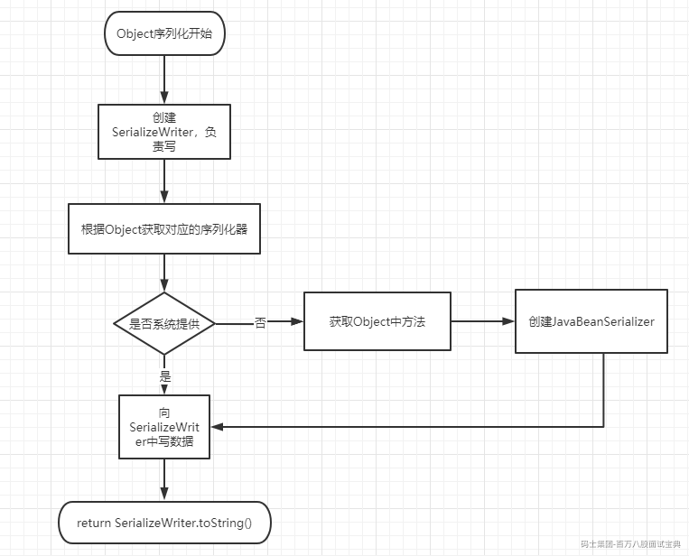

其中：在获取对象序列化的时候，MessageExt中有返回 ByteBuffer的get方法，代码如下：

public ByteBuffer getStoreHostBytes() {

return socketAddress2ByteBuffer(this.storeHost);

}

//socketAddress2ByteBuffer

public static ByteBuffer socketAddress2ByteBuffer(SocketAddress socketAddress) { ByteBuffer byteBuffer = ByteBuffer.allocate(8);

return socketAddress2ByteBuffer(socketAddress, byteBuffer);

}

//socketAddress2ByteBuffer

public static ByteBuffer socketAddress2ByteBuffer(SocketAddress socketAddress, ByteBuffer byteBuffer) {

InetSocketAddress inetSocketAddress = (InetSocketAddress)socketAddress; byteBuffer.put(inetSocketAddress.getAddress().getAddress(), 0, 4); byteBuffer.putInt(inetSocketAddress.getPort());

byteBuffer.flip();

return byteBuffer;

}

Mq消息在接收到消息时，构造了返回了ByteBuffer对象的方法，该方法是nio中设计用于保存数

据到缓冲区的目的。

主要的属性如下：

position: 其实是指从buffer读取或写入buffer的下一个元素位置。比如，已经写入buffer 3 个元素那那么position就是指向第4个位置，即position设置为3（数组从0开始计）。

limit：还有多少数据需要从buffer中取出，或还有多少空间可以放入。postition总是

<=limit。

capacity: 表示buffer本身底层数组的容量。limit绝不能>capacity。

数据结构如下：

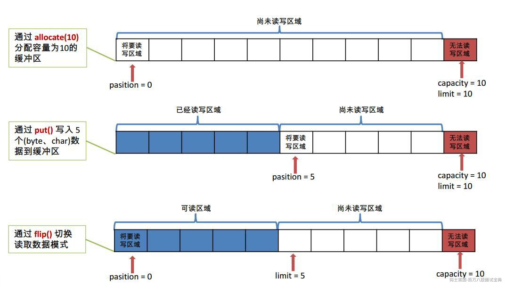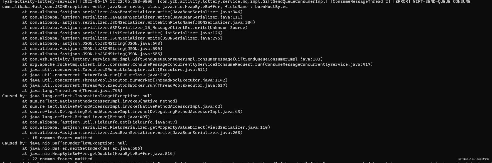

get()方法，一字节一字节读

getChar()、getShort()、getInt()、getFloat()、getLong()、getDouble()读取相应字节数 的数据

至此：问题显而易见，fastjson在1.2.31及之前，没有提供ByteBuffer 序列化器，所以用了默认的 javabean序列化器，而默认的javabean序列化器，又通过get方法反序列化，当遇见ByteBuffer 时，ByteBuffer中会先遇到如下方法，getLong(),

public long getLong() {

return Bits.getLong(this, ix(nextGetIndex(8)), bigEndian);

}

//nextGetIndex

final int nextGetIndex(int nb) { // package-private if (limit - position < nb)

throw new BufferUnderflowException();

int p = position; position += nb; return p;

}

每次读取position偏移8个字节，而MessageExt中，构建的ByteBuffer存储的时4个字节，所以会

报错，完整的堆栈如下：

以下内容是fastjson序列化的过程：

1-JSON.toJSONString方法

public static String toJSONString(Object object, int defaultFeatures, SerializerFeature... features) {

//写数据的类，存储序列化过程的数据，最后通过 out.toString()转化为json字符串 SerializeWriter out = new SerializeWriter((Writer)null, defaultFeatures, features);

String var5;

try {

//Json序列化解析对象的类，解析过程中向out写入数据 JSONSerializer serializer = new JSONSerializer(out);

//解析传入的对象，保存在out中

serializer.write(object);

//将解析的结果转成String输出

var5 = out.toString();

} finally {

out.close();

}

return var5;

}

2-JSONSerializer#write(java.lang.Object)方法

public final void write(Object object) {

if (object == null) {

this.out.writeNull();

} else {

Class<?> clazz = object.getClass();

//获取序列化器

ObjectSerializer writer = this.getObjectWriter(clazz);

try {

writer.write(this, object, (Object)null, (Type)null, 0);

} catch (IOException var5) {

throw new JSONException(var5.getMessage(), var5);

}

}

}

3-SerializeConfig#getObjectWriter(java.lang.Class<?>, boolean)方法

获取对应的序列化器

private ObjectSerializer getObjectWriter(Class<?> clazz, boolean create) {

ObjectSerializer writer = (ObjectSerializer)this.serializers.get(clazz); ClassLoader classLoader;

Iterator var5; Object o;

AutowiredObjectSerializer autowired; Iterator var8;

Type forType;

if (writer == null) {

try {

classLoader = Thread.currentThread().getContextClassLoader();

var5 = ServiceLoader.load(AutowiredObjectSerializer.class, classLoader).iterator();

label254:

while(true) {

do {

if (!var5.hasNext()) {

break label254;

}

o = var5.next();

} while(!(o instanceof AutowiredObjectSerializer));

autowired = (AutowiredObjectSerializer)o;

var8 = autowired.getAutowiredFor().iterator();

while(var8.hasNext()) {

forType = (Type)var8.next();

this.put((Type)forType, (ObjectSerializer)autowired);

}

}

} catch (ClassCastException var17) {

}

writer = (ObjectSerializer)this.serializers.get(clazz);

}

if (writer == null) {

classLoader = JSON.class.getClassLoader();

if (classLoader != Thread.currentThread().getContextClassLoader()) {

try {

classLoader).iterator();

var5 = ServiceLoader.load(AutowiredObjectSerializer.class,

label235:

while(true) {

do {

if (!var5.hasNext()) {

break label235;

}

o = var5.next();

} while(!(o instanceof AutowiredObjectSerializer));

autowired = (AutowiredObjectSerializer)o;

var8 = autowired.getAutowiredFor().iterator();

while(var8.hasNext()) {

forType = (Type)var8.next();

this.put((Type)forType, (ObjectSerializer)autowired);

}

}

} catch (ClassCastException var16) {

}

writer = (ObjectSerializer)this.serializers.get(clazz);

}

}

if (writer == null) {

if (Map.class.isAssignableFrom(clazz)) {

this.put((Type)clazz, (ObjectSerializer)MapSerializer.instance);

} else if (List.class.isAssignableFrom(clazz)) {

this.put((Type)clazz, (ObjectSerializer)ListSerializer.instance);

} else if (Collection.class.isAssignableFrom(clazz)) {

this.put((Type)clazz, (ObjectSerializer)CollectionCodec.instance);

} else if (Date.class.isAssignableFrom(clazz)) {

this.put((Type)clazz, (ObjectSerializer)DateCodec.instance);

} else if (JSONAware.class.isAssignableFrom(clazz)) {

this.put((Type)clazz, (ObjectSerializer)JSONAwareSerializer.instance);

} else if (JSONSerializable.class.isAssignableFrom(clazz)) {

this.put((Type)clazz, (ObjectSerializer)JSONSerializableSerializer.instance);

} else if (JSONStreamAware.class.isAssignableFrom(clazz)) {

this.put((Type)clazz, (ObjectSerializer)MiscCodec.instance);

} else if (clazz.isEnum() || clazz.getSuperclass() != null &&

clazz.getSuperclass().isEnum()) {

JSONType jsonType = (JSONType)clazz.getAnnotation(JSONType.class);

if (jsonType != null && jsonType.serializeEnumAsJavaBean()) {

this.put((Type)clazz, (ObjectSerializer)this.createJavaBeanSerializer(clazz));

} else {

this.put((Type)clazz, (ObjectSerializer)EnumSerializer.instance);

}

} else if (clazz.isArray()) {

Class<?> componentType = clazz.getComponentType();

ObjectSerializer compObjectSerializer = this.getObjectWriter(componentType);

this.put((Type)clazz, (ObjectSerializer)(new ArraySerializer(componentType, compObjectSerializer)));

} else if (Throwable.class.isAssignableFrom(clazz)) {

SerializeBeanInfo beanInfo = TypeUtils.buildBeanInfo(clazz, (Map)null, this.propertyNamingStrategy);

beanInfo.features |= SerializerFeature.WriteClassName.mask;

this.put((Type)clazz, (ObjectSerializer)(new JavaBeanSerializer(beanInfo)));

} else if (!TimeZone.class.isAssignableFrom(clazz) &&

!Entry.class.isAssignableFrom(clazz)) {

if (Appendable.class.isAssignableFrom(clazz)) {

this.put((Type)clazz, (ObjectSerializer)AppendableSerializer.instance);

} else if (Charset.class.isAssignableFrom(clazz)) {

this.put((Type)clazz, (ObjectSerializer)ToStringSerializer.instance);

} else if (Enumeration.class.isAssignableFrom(clazz)) {

this.put((Type)clazz, (ObjectSerializer)EnumerationSerializer.instance);

} else if (!Calendar.class.isAssignableFrom(clazz) &&

!XMLGregorianCalendar.class.isAssignableFrom(clazz)) {

if (Clob.class.isAssignableFrom(clazz)) {

this.put((Type)clazz, (ObjectSerializer)ClobSeriliazer.instance);

} else if (TypeUtils.isPath(clazz)) {

this.put((Type)clazz, (ObjectSerializer)ToStringSerializer.instance);

} else if (Iterator.class.isAssignableFrom(clazz)) {

this.put((Type)clazz, (ObjectSerializer)MiscCodec.instance);

} else {

String className = clazz.getName();

if (className.startsWith("java.awt.") &&

AwtCodec.support(clazz)) {

if (!awtError) {

try {

this.put((Type)Class.forName("java.awt.Color"), (ObjectSerializer)AwtCodec.instance);

this.put((Type)Class.forName("java.awt.Font"),

(ObjectSerializer)AwtCodec.instance);

this.put((Type)Class.forName("java.awt.Point"), (ObjectSerializer)AwtCodec.instance);

this.put((Type)Class.forName("java.awt.Rectangle"), (ObjectSerializer)AwtCodec.instance);

} catch (Throwable var10) {

awtError = true;

}

}

return AwtCodec.instance;

}

if (!jdk8Error && (className.startsWith("java.time.") ||

className.startsWith("java.util.Optional") || className.equals("java.util.concurrent.atomic.LongAdder") || className.equals("java.util.concurrent.atomic.DoubleAdder"))) {

try {

this.put((Type)Class.forName("java.time.LocalDateTime"), (ObjectSerializer)Jdk8DateCodec.instance);

(ObjectSerializer)Jdk8DateCodec.instance); (ObjectSerializer)Jdk8DateCodec.instance);

this.put((Type)Class.forName("java.time.LocalDate"),

this.put((Type)Class.forName("java.time.LocalTime"),

this.put((Type)Class.forName("java.time.ZonedDateTime"),

(ObjectSerializer)Jdk8DateCodec.instance);

this.put((Type)Class.forName("java.time.OffsetDateTime"), (ObjectSerializer)Jdk8DateCodec.instance);

this.put((Type)Class.forName("java.time.OffsetTime"), (ObjectSerializer)Jdk8DateCodec.instance);

this.put((Type)Class.forName("java.time.ZoneOffset"), (ObjectSerializer)Jdk8DateCodec.instance);

this.put((Type)Class.forName("java.time.ZoneRegion"), (ObjectSerializer)Jdk8DateCodec.instance);

(ObjectSerializer)Jdk8DateCodec.instance); (ObjectSerializer)Jdk8DateCodec.instance); (ObjectSerializer)Jdk8DateCodec.instance); (ObjectSerializer)OptionalCodec.instance);

this.put((Type)Class.forName("java.time.Period"), this.put((Type)Class.forName("java.time.Duration"), this.put((Type)Class.forName("java.time.Instant"),

this.put((Type)Class.forName("java.util.Optional"),

this.put((Type)Class.forName("java.util.OptionalDouble"),

(ObjectSerializer)OptionalCodec.instance);

this.put((Type)Class.forName("java.util.OptionalInt"), (ObjectSerializer)OptionalCodec.instance);

this.put((Type)Class.forName("java.util.OptionalLong"), (ObjectSerializer)OptionalCodec.instance);

this.put((Type)Class.forName("java.util.concurrent.atomic.LongAdder"), (ObjectSerializer)AdderSerializer.instance);

this.put((Type)Class.forName("java.util.concurrent.atomic.DoubleAdder"), (ObjectSerializer)AdderSerializer.instance);

writer = (ObjectSerializer)this.serializers.get(clazz);

if (writer != null) {

return writer;

}

} catch (Throwable var15) {

jdk8Error = true;

}

}

if (!oracleJdbcError && className.startsWith("oracle.sql.")) {

try {

(ObjectSerializer)DateCodec.instance);

this.put((Type)Class.forName("oracle.sql.DATE"),

this.put((Type)Class.forName("oracle.sql.TIMESTAMP"), (ObjectSerializer)DateCodec.instance);

writer = (ObjectSerializer)this.serializers.get(clazz);

if (writer != null) {

return writer;

}

} catch (Throwable var14) {

oracleJdbcError = true;

}

}

if (!springfoxError &&

className.equals("springfox.documentation.spring.web.json.Json")) {

try {

this.put((Type)Class.forName("springfox.documentation.spring.web.json.Json"), (ObjectSerializer)SwaggerJsonSerializer.instance);

writer = (ObjectSerializer)this.serializers.get(clazz);

if (writer != null) {

return writer;

}

} catch (ClassNotFoundException var13) {

springfoxError = true;

}

}

if (!guavaError &&

className.startsWith("com.google.common.collect.")) {

try {

this.put((Type)Class.forName("com.google.common.collect.HashMultimap"), (ObjectSerializer)GuavaCodec.instance);

this.put((Type)Class.forName("com.google.common.collect.LinkedListMultimap"), (ObjectSerializer)GuavaCodec.instance);

this.put((Type)Class.forName("com.google.common.collect.ArrayListMultimap"), (ObjectSerializer)GuavaCodec.instance);

this.put((Type)Class.forName("com.google.common.collect.TreeMultimap"), (ObjectSerializer)GuavaCodec.instance);

writer = (ObjectSerializer)this.serializers.get(clazz);

if (writer != null) {

return writer;

}

} catch (ClassNotFoundException var12) {

guavaError = true;

}

}

if (className.equals("net.sf.json.JSONNull")) {

try {

this.put((Type)Class.forName("net.sf.json.JSONNull"), (ObjectSerializer)MiscCodec.instance);

} catch (ClassNotFoundException var11) {

}

writer = (ObjectSerializer)this.serializers.get(clazz);

if (writer != null) {

return writer;

}

}

this.getObjectWriter(superClazz);

if (TypeUtils.isProxy(clazz)) {

Class<?> superClazz = clazz.getSuperclass(); ObjectSerializer superWriter =

this.put((Type)clazz, (ObjectSerializer)superWriter);

return superWriter;

}

if (create) {

//默认返回 JavaBeanSerializer this.put((Type)clazz,

(ObjectSerializer)this.createJavaBeanSerializer(clazz));

}

}

} else {

this.put((Type)clazz, (ObjectSerializer)CalendarCodec.instance);

}

} else {

this.put((Type)clazz, (ObjectSerializer)MiscCodec.instance);

}

writer = (ObjectSerializer)this.serializers.get(clazz);

}

return writer;

}

4-SerializeConfig#createJavaBeanSerializer(java.lang.Class<?>)方法

private final ObjectSerializer createJavaBeanSerializer(Class<?> clazz) {

//构造SerializeBeanInfo 对象，里面存储序列化的字段等信息 SerializeBeanInfo beanInfo = TypeUtils.buildBeanInfo(clazz, (Map)null,

this.propertyNamingStrategy, this.fieldBase);

return (ObjectSerializer)(beanInfo.fields.length == 0 && Iterable.class.isAssignableFrom(clazz) ? MiscCodec.instance : this.createJavaBeanSerializer(beanInfo));

}

5-TypeUtils#buildBeanInfo(java.lang.Class<?>,

java.util.Map<java.lang.String,java.lang.String>, com.alibaba.fastjson.PropertyNamingStrategy, boolean)方法

public static SerializeBeanInfo buildBeanInfo(Class<?> beanType, Map<String, String> aliasMap,

PropertyNamingStrategy propertyNamingStrategy, boolean fieldBased) {

JSONType jsonType = (JSONType)beanType.getAnnotation(JSONType.class); Map<String, Field> fieldCacheMap = new HashMap(); ParserConfig.parserAllFieldToCache(beanType, fieldCacheMap);

//fieldBased==false，执行computeGetters(beanType, jsonType, aliasMap, fieldCacheMap, false, propertyNamingStrategy) 逻辑

List<FieldInfo> fieldInfoList = fieldBased ? computeGettersWithFieldBase(beanType, aliasMap, false, propertyNamingStrategy) : computeGetters(beanType, jsonType, aliasMap, fieldCacheMap, false, propertyNamingStrategy);

FieldInfo[] fields = new FieldInfo[fieldInfoList.size()];

fieldInfoList.toArray(fields); String[] orders = null;

String typeName = null;

int features;

if (jsonType != null) {

orders = jsonType.orders(); typeName = jsonType.typeName(); if (typeName.length() == 0) {

typeName = null;

}

features = SerializerFeature.of(jsonType.serialzeFeatures());

} else {

features = 0;

}

Object sortedFieldList;

if (orders != null && orders.length != 0) {

sortedFieldList = fieldBased ? computeGettersWithFieldBase(beanType, aliasMap, true, propertyNamingStrategy) : computeGetters(beanType, jsonType, aliasMap, fieldCacheMap, true, propertyNamingStrategy);

} else {

sortedFieldList = new ArrayList(fieldInfoList); Collections.sort((List)sortedFieldList);

}

FieldInfo[] sortedFields = new FieldInfo[((List)sortedFieldList).size()]; ((List)sortedFieldList).toArray(sortedFields);

if (Arrays.equals(sortedFields, fields)) {

sortedFields = fields;

}

return new SerializeBeanInfo(beanType, jsonType, typeName, features, fields, sortedFields);

}

6-TypeUtils#computeGetters(java.lang.Class<?>,

com.alibaba.fastjson.annotation.JSONType, java.util.Map<java.lang.String,java.lang.String>, java.util.Map<java.lang.String,java.lang.reflect.Field>, boolean, com.alibaba.fastjson.PropertyNamingStrategy)方法

public static List<FieldInfo> computeGetters(Class<?> clazz, JSONType jsonType, Map<String,

String> aliasMap, Map<String, Field> fieldCacheMap, boolean sorted, PropertyNamingStrategy propertyNamingStrategy) {

Map<String, FieldInfo> fieldInfoMap = new LinkedHashMap();

//反射获取所有方法

Method[] var7 = clazz.getMethods();

int var8 = var7.length;

for(int var9 = 0; var9 < var8; ++var9) { Method method = var7[var9];

String methodName = method.getName();

int ordinal = 0;

int serialzeFeatures = 0; int parserFeatures = 0; String label = null;

//静态方法等过滤

if (!Modifier.isStatic(method.getModifiers()) &&

!method.getReturnType().equals(Void.TYPE) && method.getParameterTypes().length == 0 &&

method.getReturnType() != ClassLoader.class && (!method.getName().equals("getMetaClass") ||

!method.getReturnType().getName().equals("groovy.lang.MetaClass"))) {

JSONField annotation = (JSONField)method.getAnnotation(JSONField.class);

if (annotation == null) {

annotation = getSuperMethodAnnotation(clazz, method);

}

if (annotation != null) {

if (!annotation.serialize()) {

continue;

}

ordinal = annotation.ordinal();

serialzeFeatures = SerializerFeature.of(annotation.serialzeFeatures());

parserFeatures = Feature.of(annotation.parseFeatures());

if (annotation.name().length() != 0) {

String propertyName = annotation.name();

if (aliasMap != null) {

propertyName = (String)aliasMap.get(propertyName);

if (propertyName == null) {

continue;

}

}

FieldInfo fieldInfo = new FieldInfo(propertyName, method,

(Field)null, clazz, (Type)null, ordinal, serialzeFeatures, parserFeatures, annotation, (JSONField)null, label);

fieldInfoMap.put(propertyName, fieldInfo);

continue;

}

if (annotation.label().length() != 0) {

label = annotation.label();

}

}

char c2;

String propertyName;

//get方法

if (methodName.startsWith("get")) {

if (methodName.length() < 4 || methodName.equals("getClass") ||

methodName.equals("getDeclaringClass") && clazz.isEnum()) {

continue;

}

c2 = methodName.charAt(3);

if (!Character.isUpperCase(c2) && c2 <= 512) {

if (c2 == '\_') {

propertyName = methodName.substring(4);

} else if (c2 == 'f') {

propertyName = methodName.substring(3);

} else {

if (methodName.length() < 5 ||

!Character.isUpperCase(methodName.charAt(4))) {

continue;

}

}

} else {

propertyName = decapitalize(methodName.substring(3));

+ methodName.substring(4);

if (compatibleWithJavaBean) {

propertyName = decapitalize(methodName.substring(3));

} else {

propertyName = Character.toLowerCase(methodName.charAt(3))

}

propertyName =

getPropertyNameByCompatibleFieldName(fieldCacheMap, methodName, propertyName, 3);

}

boolean ignore = isJSONTypeIgnore(clazz, propertyName);

if (ignore) {

continue;

}

fieldCacheMap);

Field field = ParserConfig.getFieldFromCache(propertyName,

if (field == null && propertyName.length() > 1) {

char ch = propertyName.charAt(1);

if (ch >= 'A' && ch <= 'Z') {

String javaBeanCompatiblePropertyName =

decapitalize(methodName.substring(3));

field =

ParserConfig.getFieldFromCache(javaBeanCompatiblePropertyName, fieldCacheMap);

}

}

JSONField fieldAnnotation = null;

if (field != null) {

fieldAnnotation = (JSONField)field.getAnnotation(JSONField.class);

if (fieldAnnotation != null) {

if (!fieldAnnotation.serialize()) {

continue;

}

ordinal = fieldAnnotation.ordinal();

serialzeFeatures = SerializerFeature.of(fieldAnnotation.serialzeFeatures());

parserFeatures = Feature.of(fieldAnnotation.parseFeatures());

if (fieldAnnotation.name().length() != 0) { propertyName = fieldAnnotation.name(); if (aliasMap != null) {

propertyName =

(String)aliasMap.get(propertyName);

if (propertyName == null) {

continue;

}

}

}

if (fieldAnnotation.label().length() != 0) {

label = fieldAnnotation.label();

}

}

}

if (aliasMap != null) {

propertyName = (String)aliasMap.get(propertyName);

if (propertyName == null) {

continue;

}

}

if (propertyNamingStrategy != null) {

propertyName = propertyNamingStrategy.translate(propertyName);

}

FieldInfo fieldInfo = new FieldInfo(propertyName, method, field, clazz, (Type)null, ordinal, serialzeFeatures, parserFeatures, annotation, fieldAnnotation, label);

fieldInfoMap.put(propertyName, fieldInfo);

}

//返回boolean的is开头的方法

if (methodName.startsWith("is") && methodName.length() >= 3 && (method.getReturnType() == Boolean.TYPE || method.getReturnType() == Boolean.class)) {

c2 = methodName.charAt(2);

if (Character.isUpperCase(c2)) {

if (compatibleWithJavaBean) {

propertyName = decapitalize(methodName.substring(2));

} else {

+ methodName.substring(3);

propertyName = Character.toLowerCase(methodName.charAt(2))

}

propertyName =

getPropertyNameByCompatibleFieldName(fieldCacheMap, methodName, propertyName, 2);

} else if (c2 == '\_') {

propertyName = methodName.substring(3);

} else {

if (c2 != 'f') {

continue;

}

propertyName = methodName.substring(2);

}

fieldCacheMap);

fieldCacheMap);

Field field = ParserConfig.getFieldFromCache(propertyName,

if (field == null) {

field = ParserConfig.getFieldFromCache(methodName,

}

JSONField fieldAnnotation = null;

if (field != null) {

fieldAnnotation = (JSONField)field.getAnnotation(JSONField.class);

if (fieldAnnotation != null) {

if (!fieldAnnotation.serialize()) {

continue;

}

ordinal = fieldAnnotation.ordinal();

serialzeFeatures = SerializerFeature.of(fieldAnnotation.serialzeFeatures());

parserFeatures = Feature.of(fieldAnnotation.parseFeatures());

if (fieldAnnotation.name().length() != 0) { propertyName = fieldAnnotation.name(); if (aliasMap != null) {

propertyName =

(String)aliasMap.get(propertyName);

if (propertyName == null) {

continue;

}

}

}

if (fieldAnnotation.label().length() != 0) {

label = fieldAnnotation.label();

}

}

}

if (aliasMap != null) {

propertyName = (String)aliasMap.get(propertyName);

if (propertyName == null) {

continue;

}

}

if (propertyNamingStrategy != null) {

propertyName = propertyNamingStrategy.translate(propertyName);

}

if (!fieldInfoMap.containsKey(propertyName)) {

FieldInfo fieldInfo = new FieldInfo(propertyName, method, field, clazz, (Type)null, ordinal, serialzeFeatures, parserFeatures, annotation, fieldAnnotation,

label);

fieldInfoMap.put(propertyName, fieldInfo);

}

}

}

}

Field[] fields = clazz.getFields();

computeFields(clazz, aliasMap, propertyNamingStrategy, fieldInfoMap, fields);

return getFieldInfos(clazz, sorted, fieldInfoMap);

}

上面方法可证明，fastjson序列化是依赖的java方法

getXxx()

boolean isXxx()

**4.5 redis锁失效**

场景：主播通关任务，例如1金币1积分，积分达到2000的时候，开启一个xx活动（比如赠送加速 卡，双倍经验时常等），然后积分从0再次开始，依次循环。

实现：

public void rank(long memberId, double score) {

String socreKey = memberId + ":"+"score"; String lockKey = memberId + "";

boolean flag =false;

try {

flag = lock.lock(lockKey);

//

Double newScore = redisUtil.zincrby(socreKey, score, memberId + "");

if (newScore >= 2000) {

//清0

...

}

}catch (Exception e){

//log

//双倍经验时常

service.add(memberId, score);

}finally {

if(true){

lock.close();

}

}

}

加锁代码：

@Override

public boolean lock(String key) {

Jedis jedis = null;

try {

jedis = jedisPool.getResource();

while (true) {

String result = jedis.set(key, uuid, "NX", "PX", expireTime);

if (LOCK\_SUCCESS.equals(result)) {

return true;

}

}

return false;

} catch (Exception e) { log.error("redis error",e); throw e;

} finally {

if (jedis != null) {

jedis.close();

}

}

}

生产故障：

设计前：加锁考量时，已知存在单点故障，存在释放他人锁可能性，所以简化加了30s，且QPS不 太大。

问题点：redis购买的阿里云主从从版本，存在主从延时，造成获取锁的可能性的概率大大增强。 当时活动三天，每天大概锁重复概率事后统计20条左右吧。 网上分布式锁的代码不少，再次给出，希望大家有所启示

**1.为什么需要分布式锁**

实际的业务场景中，有很多并发访问的问题：比如下单，修改库存等，可总结为如下的流程： 客户端读数据到本地，本地修改；

客户端修改完数据，回写数据；

这样的流程通常有显著的特点："读取-修改-写回"，简称为RMW操作（Read-Modify-Write）。 多个客户端对同一份数据执行RMW操作的话，需要让RMW和涉及的代码，按照原子方式执行，

这种访问同一份数据的RMW操作代码，叫做临界区代码。实际场景，基本如下图：

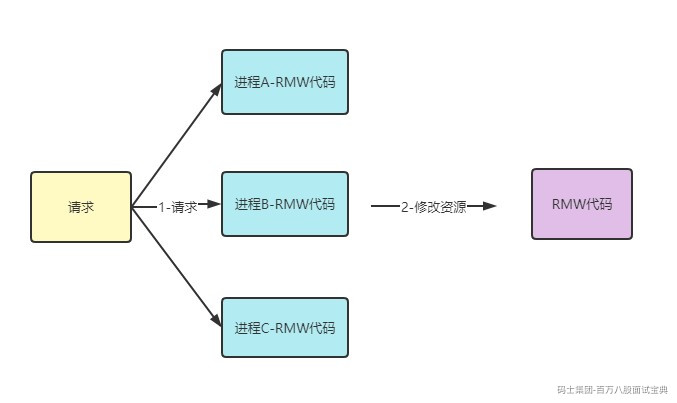

临界区代码必须要保证多进程串行执行，否则将产生数据不一致等影响。

在redis中，处理临界区的代码通常有三种方式 多个操作合并成一条命令操作：case：INCR/DECR，set之于setnx

多个操作写道Lua脚本中执行

加分布式锁

前两个不是所有的场景都适合。为了保证多进程能串行执行，我们需要一个统一的外部资源来实现

这种互斥的能力。

为了追求性能，我们使用redis 分布式锁，当然，还可以是MySQL，Zookeeper等。

**2.Redis分布式锁实现**

讨论之前，我们有必要分析和总结一下Redis分布式锁应有的设计原则：

1. 安全属性：互斥，不管任何时候，只有一个客户端能持有同一个锁。

2. 效率属性A：不会死锁，最终一定会得到锁，就算一个持有锁的客户端宕掉或者发生网络分 区。

3. 效率属性B：容错，只要大多数Redis节点正常工作，客户端应该都能获取和释放锁。

这三点，是最基本的安全和可靠性保障，除此之外，还可以考虑扩展功能：是否支持阻塞和非阻 塞、持久性（能否自动续约活自动延期）、是否支持公平性和可重入特性。

可以以一个常见伪代码为案例： 加锁代码形式通常如下：

function writeData(filename, data) { var lock = redis.setNx(filename,1); redis.expire(filename,3000)

if (!lock) {

}

try {

throw 'Failed to acquire lock';

var file = storage.readFile(filename);

var updated = updateContents(file, data);

storage.writeFile(filename, updated);

} finally {

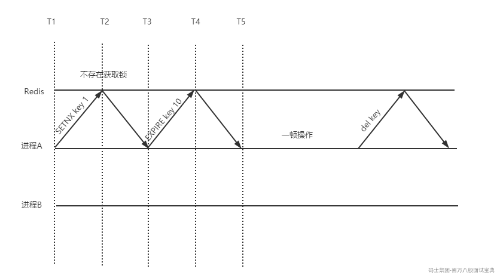

redis.del(filename)

}

}

部分代码参考:https://martin.kleppmann.com/2016/02/08/how-to-do-distributed-locking.html

**2.1 如何避免死锁**

加锁代码通常如下,很容易想到加一个过期时间

SETNX key 1 //加锁

EXPIRE key 10 //设置锁过期

时间图如下：

问题：

1-进程A在T2-T3之间出现问题，没有机会释放锁，锁一直不释放

2-进程A在T3-T5之间出问题，设置有效期失败，锁一直不释放

解决方案：对于问题1-2，可以使用 **SET key value [EX seconds] [PX milliseconds] [NX]** 保 证原子性，redis单节点问题，我们稍后讨论。

修复setnx问题后，我们继续分析有另外一个进程进入的情况，考虑按时间顺序如下场景：

如果锁有效时间10s

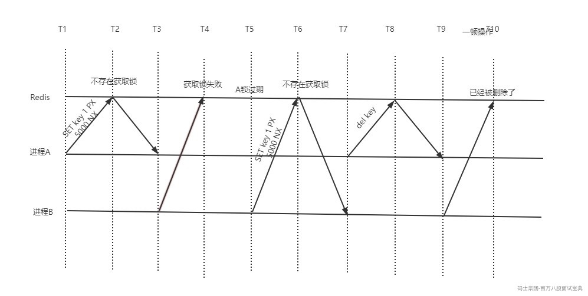

1.进程A加锁成功，开始操作，操作时间过了锁有效期

2.进程B申请加锁，开始操作；

3.进程A释放锁（进程B的锁被释放掉了）

问题：

1-锁过期时间控制：如果一个进程执行时间过长，导致锁超期释放，别的进程可获取锁，两个进 程同时拥有一把锁，操作同一份RMW 代码

2-释放别人的锁：进程A释放锁的时候，把别的进程的锁释放掉了

问题1我们先不讨论，

**2.2 释放别人加的锁**

上述问题，图示如下：

1-进程A加锁成功

2-进程A执行时间超出锁有效期，进程B获取锁

2-进程A执行完成，释放了B进程加的锁

解决方案：

1-通过控制加锁的value值为 唯一值：SET key random PX 5000 NX，其中，random应该是唯 一值

2-删除锁的时候，先获取锁的值是否等于random值，等于则释放，为了保证原子性采用lua脚 本，内容如下：

//释放锁 比较random是否相等，避免误释放

if redis.call("get",KEYS[1]) == ARGV[1] then return redis.call("del",KEYS[1])

else

return 0

end

如下图：

整体代码开起来如下：

function writeData(filename, data) {

uuid = UUID.random().tostring;

var lock = redis.set(filename,uuid,px,5000,NX);

if (!lock) {

throw 'Failed to acquire lock';

}

try {

var file = storage.readFile(filename);

var updated = updateContents(file, data);

storage.writeFile(filename, updated);

} finally {

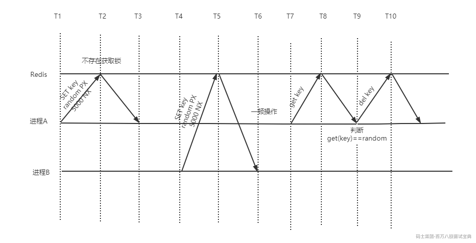

redis.eval("if redis.call("get",KEYS[1]) == ARGV[1] then return redis.call("del",KEYS[1])

else

return 0 end")

}

}

这段代码看起来，解决了我们想到的很多问题，事实上，很多项目中依然采用着，除了上述我们提

及过：锁过期时间与线程执行时间不好确定之外，我们继续分析，还有什么问题：

1-锁过期时间

2-redis不能是主从部署方式

3-更宽泛的说来，不支持很多锁的功能：比如，是否公平，是否可重入

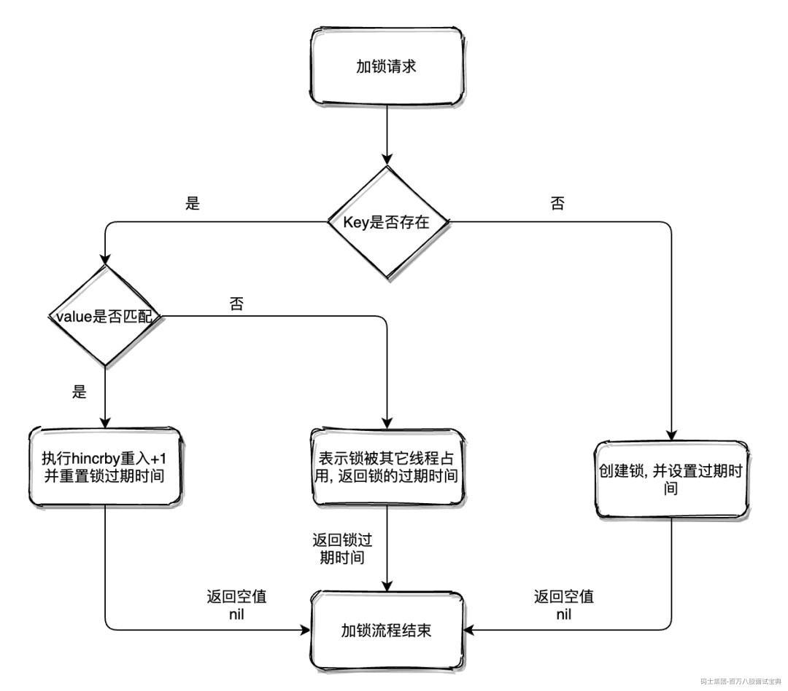

其实redisson已经帮我们提供了更加健壮简洁的锁实现

**3.Redisson**

Redisson 是架设在 Redis 基础上的一个 Java驻内存数据网格框架, 充分利用 Redis 键值数据库 提供的一系列优势, 基于 Java 使用工具包中常用接口, 为使用者提供了 一系列具有分布式特性的 常用工具类。其中就提供了一种RedLock的加锁算法和实现，讨论之前，我们可以先分析单机版 的Redisson如何实现一个分布式锁。

RedLock官方介绍: [**Distributed locks with Redis – Redis**](https://redis.io/topics/distlock)

由于 Redisson自身太过于复杂, 设计的 API 调用大多用 Netty 相关, 所以本文只对 如何加锁、 如何实现重入锁，释放锁进行讨论

1-加锁流程

2-解锁流程

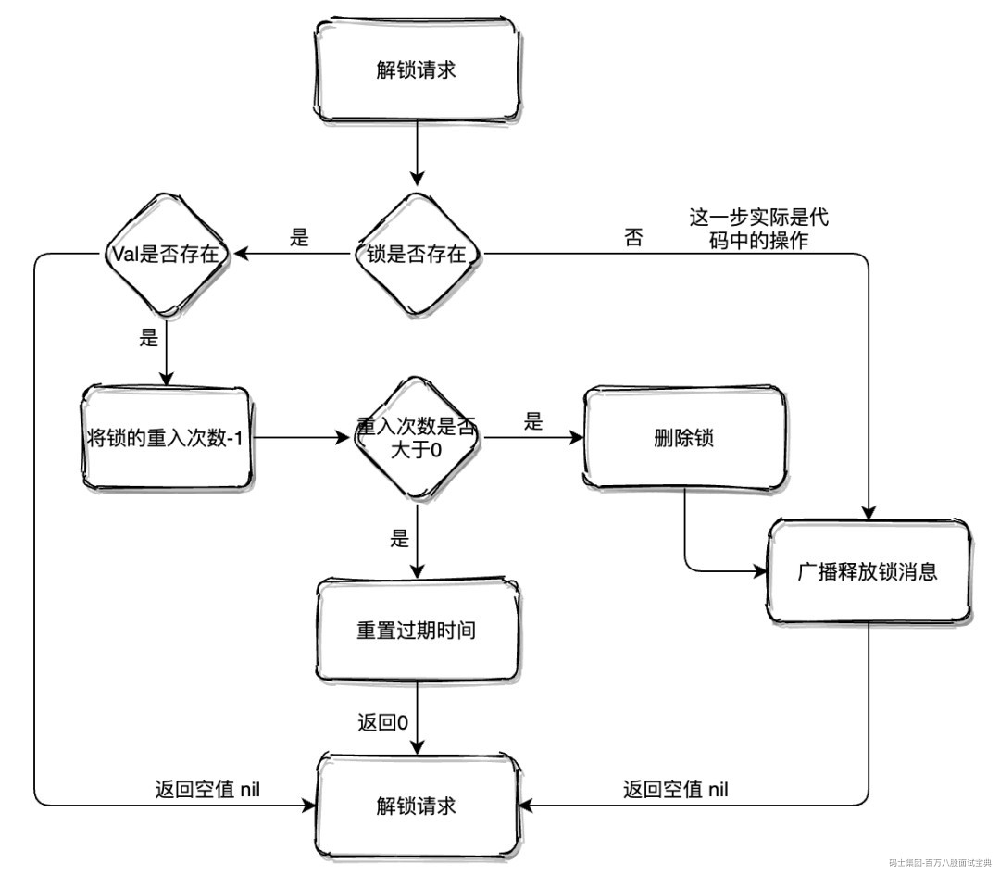

**3.1 Redlock**

**3.1.1 Redlock 算法介绍**

部署多台 Redis, 各实例之间相互独立, 不存在主从复制或者其他集群协调机制 使用方式大体如下：

RLock lock1 = redissonInstance1.getLock("lock1");

RLock lock2 = redissonInstance2.getLock("lock1"); RLock lock3 = redissonInstance3.getLock("lock1");

RedissonRedLock lock = new RedissonRedLock(lock1, lock2, lock3);

// 同时加锁：lock1 lock1 lock1

// 红锁在大部分节点上加锁成功就算成功。

lock.lock();

... lock.unlock();

原理：

加入设置节点数N=5，所以我们需要在不同的计算机或虚拟机上运行5个Redis主站，以确保它们 会以一种基本独立的方式失败。

为了获得锁，客户端执行以下操作。 获取当前的时间，以毫秒为单位。

依次在所有N个实例中获取锁，在所有实例中使用相同的键名和随机值。在步骤2中，当在每

个实例中设置锁时，客户端使用一个与总的锁自动释放时间相比很小的超时来获取它。例

如，如果自动释放时间是10秒，超时可以在~ 5-50毫秒范围内。这可以防止客户端在试图与 Redis节点对话时长时间受阻：如果一个实例不可用，我们应该尽快尝试与下一个实例对话。 客户端通过从当前时间减去步骤1中获得的时间戳，计算出获得锁所需的时间。如果并且只有 当客户端能够在大多数实例（至少3个）中获取锁，并且获取锁的总时间小于锁的有效期，锁 才被认为是被获取。 如果锁被获取，其有效性时间被认为是初始有效性时间减去经过的时间，如步骤3中计算的那 样。 如果客户端由于某种原因未能获得锁（要么它无法锁定N/2+1个实例，要么有效性时间为负 数），它将尝试解锁所有的实例（甚至是它认为无法锁定的实例）。

**3.1.2 Redlock 算法是否安全**

分布式系统研究员Martin Kleppmann曾对 RedLock算法深入分析并强烈反对在生产中使用，其 主要原因就是redlock的实现依赖了服务器的本地时钟

如下例子，还是5个节点，Redlock失效：

1. 客户端1获得了A、B、C节点上的锁，由于网络问题，无法到达D和E。

2. 节点C上的时钟向前跳动，导致锁过期。

3. 客户端2获得了节点C、D、E的锁，由于网络问题，A和B不能被联系到。

4. 客户端1和2现在都认为他们持有锁。

也或者，在第二步骤，节点c如果出现宕机，恢复后没有之前的数据，客户端2也可能获取到锁。 再看如下例子：

1. 客户端1请求锁定节点A、B、C、D、E。

2. 当对客户端1的响应在路途中时，客户端1进入停止世界的GC。

3. 所有Redis节点的锁都过期了。

4. 客户端2获得了节点A、B、C、D、E的锁。

5. 客户端1完成了GC，并收到了来自Redis节点的响应，表明它成功获得了锁（当进程暂停 时，它们被保存在客户端1的内核网络缓冲区）。

6. 客户端1和2现在都认为他们持有该锁。

具体可参考：

[**安静的小气泡 - 简书 (jianshu.com)**](https://www.jianshu.com/u/759d76906d5a)

**4.7 double 精准计算**

随着经验的增长，你肯定想去深入了解一些常见的东西的细节，浮点数的存储和计算就是这样一种"东 西"

/\*\*

\* 判断一个坐标点是否包含在当前单元格的范围内

\*

\* @param point 坐标点

\* @return 包含在范围内返回true，否则false

\*/

public boolean contains(DPoint point) {

return (point.x >= startBounds.x

&& point.y >= startBounds.y

&& (int) (point.x \* 1000) < (int) (startBounds.x \* 1000) + (int) (getLength() \*

1000)

1000));

}

&& (int) (point.y \* 1000) < (int) (startBounds.y \* 1000) + (int) (getWidth() \*

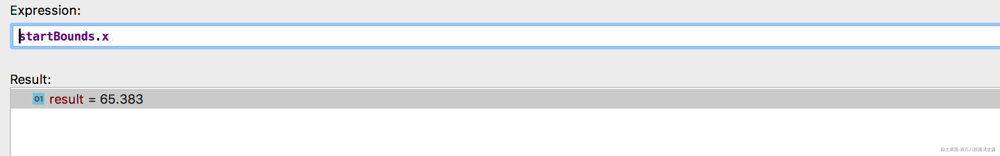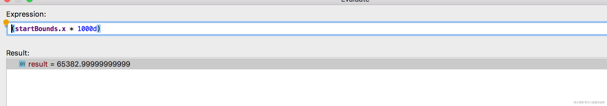

以上代码是在已知double计算有误差的时候写的。

这种精度丢失，未采用BigDecimal 是因为性能问题，该方法每秒调用几十万次，有性能问题.

double计算错误案例：

double d2 = 123456.1234567890;

double d3 = 123456.12345678901; System.out.println(d3-d2);

结果：0 明显是错误的

**double类型在java中的存储结构**

类型double大小为8字节，即64位，内存布局如下：

**符号位（1 bit） 指数（11 bit） 尾数（52 bit）**

**符号位** (Sign)：0代表正数，1代表为负数；

**指数位** (Exponent)：用于存储科学计数法中的指数数据；

**尾数部分** (Mantissa)：采用移位存储尾数部分；

小数用二进制如何表示

首先，给出一个任意实数，整数部分用普通的二进制便可以表示，这里只说小数部分如何表示 例如0.6

文字描述该过程如下：将该数字乘以2，取出整数部分作为二进制表示的第1位；然后再将小数部分乘以2，将得 到的整数部分作为二进制表示的第2位；以此类推，知道小数部分为0。

特殊情况： 小数部分出现循环，无法停止，则用有限的二进制位无法准确表示一个小数，这也是在编程语言中 表示小数会出现误差的原因

下面我们具体计算一下0.6的小数表示过程

0.6 \* 2 = 1.2 ——————- 1

0.2 \* 2 = 0.4 ——————- 0

0.4 \* 2 = 0.8 ——————- 0

0.8 \* 2 = 1.6 ——————- 1

0.6 \* 2 = 1.2 ——————- 1

…………

我们可以发现在该计算中已经出现了循环，0.6用二进制表示为 1001 1001 1001 1001 …… 如果是10.6，那个10.6的完整二进制表示为 1010.100110011001……

2. 二进制表示的小数如何转换为十进制 其实这个问题很简单，我们再拿0.6的二进制表示举例：1001 1001 1001 1001 文字描述：从左到右，v[i] \* 2^( - i ), i 为从左到右的index，v[i]为该位的值:

0.6 = 1 \* 2^-1 + 0 \* 2^-2 + 0 \* 2^-3 + 1 \* 2^-4 + ……

0.5

0.0625

0.03125

0.003906

0.001953

**验证**

案例中：65.383 转换成 二进制存储，结果如下：

1000001.0110001000001100010010011011101001011110001101 转换成科学计数法：

1.0000010110001000001100010010011011101001011110001101 \* 10^6 内存布局如下：

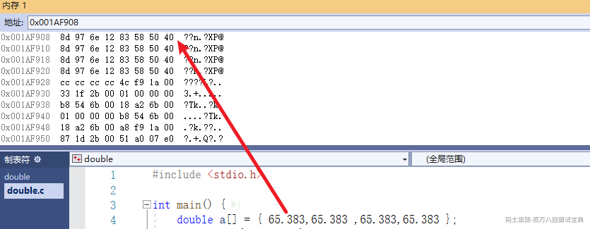

上面表格，之所以能用vs去验证，或者说之所以c语言中，double与java一一致，是因为java和c

语言，在存储浮点型数据的时候，都采用了 IEEE 754 的标准

**IEEE754(美国电器和电子工程师学会)**

浮点数是将特定长度的连续字节的所有二进制位分割为特定宽度的符号域，指数域和尾数域三个 域，其中保存的值分别用于表示给定二进制浮点数中的符号，指数和尾数。这样，通过尾数和可以 调节的 **指数（所以称为"浮点"** ）就可以表达给定的数值了。

指数位采用移码的方式： 移码（又叫增码或偏置码）通常用于表示浮点数的阶码，其表示形式与补码相似，只是其符号位用

“1”表示正数，用“0”表示负数，数值部分与补码相同。

所以上面的案例，用于标识6的阶码，是10000000101

011 1111 1111

+ 000 0000 0101

100 0000 0101

其中 011 1111 1111=1023，也叫做双精度数的偏差值，对于单精度，该值=127

**为什么用移码？**

便于浮点数比大小。如果阶码（指数）也用补码来表示，就会使得一个浮点数中出现两个符号位： 浮点数自身的和浮点数指数部分的。这样的结果是，在比较两个浮点数大小时，无法像比较整数时 一样使用简单的无逻辑的二进制比较。这就可能需要重新设计一套电路，不划算。

另外，通过观察java Double源码，里面有类似：

/\*\*

\* Maximum exponent a finite {@code double} variable may have.

\* It is equal to the value returned by

\* {@code Math.getExponent(Double.MAX\_VALUE)}.

\*

\* @since 1.6

\*/

public static final int MAX\_EXPONENT = 1023;

/\*\*

\* Minimum exponent a normalized {@code double} variable may

\* have. It is equal to the value returned by

\* {@code Math.getExponent(Double.MIN\_NORMAL)}.

\*

\* @since 1.6

\*/

public static final int MIN\_EXPONENT = -1022;

的变量，之所以指数位不是2^11次方

double减法运算

7.22-7=0.21999999999999975 之所以这样是因为7.22，无法用一个精确的二进制表示出来

**4.8 事故4：数据库问题**

**4.8.1 数据库问题概述**

**4.8.1.1 索引：** 索引分类：主键索引，普通索引，复合索引，唯一索引 技术名词：回表，最左匹配，索引覆盖，索引下推

explain：

id:select查询的序列号,包含一组数字，表示查询中执行select子句或操作表的顺序

select\_type:

SIMPLE:简单的 select 查询,查询中不包含子查询或者UNION PRIMARY:查询中若包含任何复杂的子部分，最外层查询则被标记为Primary DERIVED:在FROM列表中包含的子查询被标记为DERIVED(衍生),MySQL会递归执行这些子查询, 把结果放在临时表

里。

SUBQUERY:在SELECT或WHERE列表中包含了子查询

DEPENDENT SUBQUERY:在SELECT或WHERE列表中包含了子查询,子查询基于外层 UNCACHEABLE SUBQUREY:无法被缓存的子查询 UNION:若第二个SELECT出现在UNION之后，则被标记为UNION；若UNION包含在FROM子句的子查询中,外层SELECT将

被标记为：DERIVED

UNION RESULT:从UNION表获取结果的SELECT

table:显示这一行的数据是关于哪张表的

type:

system:表只有一行记录（等于系统表），这是const类型的特列，平时不会出现，这个也可以忽略不计

const:表示通过索引一次就找到了,const用于比较primary key或者unique索引。因为只匹配一行数据，所以很快 如将主键置于where列表中，MySQL就能将该查询转换为一个常量

eq\_ref:唯一性索引扫描，对于每个索引键，表中只有一条记录与之匹配。常见于主键或唯一索引扫描

ref:非唯一性索引扫描，返回匹配某个单独值的所有行.本质上也是一种索引访问，它返回所有匹配某个单独值的 行，然而，它可能会找到多个符合条件的行，所以他应该属于查找和扫描的混合体

range:只检索给定范围的行,使用一个索引来选择行。key 列显示使用了哪个索引一般就是在你的where语句中出 现了between、<、>、in等的查询这种范围扫描索引扫描比全表扫描要好，因为它只需要开始于索引的某一点，而结束 语另一点，不用扫描全部索引。

index:Full Index Scan，index与ALL区别为index类型只遍历索引树。这通常比ALL快，因为索引文件通常比数据 文件小。（也就是说虽然all和Index都是读全表，但index是从索引中读取的，而all是从硬盘中读的）

all:Full Table Scan，将遍历全表以找到匹配的行 index\_merge:在查询过程中需要多个索引组合使用，通常出现在有 or 的关键字的sql中 ref\_or\_null:对于某个字段既需要关联条件，也需要null值得情况下。查询优化器会选择用ref\_or\_null连接查

询。

index\_subquery:利用索引来关联子查询，不再全表扫描。

unique\_subquery :该联接类型类似于index\_subquery。 子查询中的唯一索引

备注：type显示的是访问类型，是较为重要的一个指标，结果值从最好到最坏依次是：

system > const > eq\_ref > ref > fulltext > ref\_or\_null > index\_merge > unique\_subquery >

index\_subquery > range(尽量保证) > index > ALL system>const>eq\_ref>ref>range>index>ALL 一般来说，得保证查询至少达到range级别，最好能达到ref。

possible\_keys：显示可能应用在这张表中的索引，一个或多个。查询涉及到的字段上若存在索引，则该索引将被列 出，但不一定被查询实际使用 key：实际使用的索引。如果为NULL，则没有使用索引，查询中若使用了覆盖索引，则该索引和查询的select字段重叠 key\_len：表示索引中使用的字节数，可通过该列计算查询中使用的索引的长度。 key\_len字段能够帮你检查是否充分 的利用上了索引 ref：显示索引的哪一列被使用了，如果可能的话，是一个常数。哪些列或常量被用于查找索引列上的值 rows：rows列显示MySQL认为它执行查询时必须检查的行数。越少越好 Extra：包含不适合在其他列中显示但十分重要的额外信息

Using filesort：说明mysql会对数据使用一个外部的索引排序，而不是按照表内的索引顺序进行读取。MySQL中 无法利用索引完成的排序操作称为“文件排序”

Using temporary:使了用临时表保存中间结果,MySQL在对查询结果排序时使用临时表。常见于排序 order by 和 分组查询 group by。

USING index:表示相应的select操作中使用了覆盖索引(Covering Index)，避免访问了表的数据行，效率不错！ 如果同时出现using where，表明索引被用来执行索引键值的查找;如果没有同时出现using where，表明索引只是用来 读取数据而非利用索引执行查找。

Using where:表明使用了where过滤

using join buffer:使用了连接缓存：

impossible where:where子句的值总是false，不能用来获取任何元组

select tables optimized away:在没有GROUPBY子句的情况下，基于索引优化MIN/MAX操作或者对于MyISAM存储引 擎优化COUNT(\*)操作，不必等到执行阶段再进行计算，查询执行计划生成的阶段即完成优化。

索引失效：

全值匹配我最爱

最佳左前缀法则 不在索引列上做任何操作（计算、函数、(自动or手动)类型转换），会导致索引失效而转向全表扫描 存储引擎不能使用索引中范围条件右边的列 尽量使用覆盖索引(只访问索引的查询(索引列和查询列一致))，减少select \*

mysql 在使用不等于(!= 或者<>)的时候无法使用索引会导致全表扫描 is not null 也无法使用索引,但是is null是可以使用索引的 like以通配符开头('%abc...')mysql索引失效会变成全表扫描的操作 隐式类型转换索引失效

少用or,用它来连接时会索引失效

**4.8.1.2 事务+锁+日志：**

见PDF

**4.8.1.3 高可用**

主从，分库分表

**4.8.1.4 一些需要注意的事项**

1-count(\*),count(1),count(主键id),count(字段),到底用谁？

2-普通索引和主键索引到底有没有区别？

redo log 主要节省的是随机写磁盘的IO(顺序写)

change buffer主要节省随机读磁盘的IO消耗

**4.8.1.5 处理问题的一些技巧**

1-慢sql定位：开启慢日志

2-大事务处理： **SELECT \* FROM information\_schema.INNODB\_TRX**

3-降低死锁概率：控制并发度 比如场景：

1.用户A余额支付金额给商家B：update t set money = money-100 where user ='A';

2.商家B余额增加:update t set money = money+100 where user ='B';

3.A生成订单日志:insert .... 如何设计三条语句的顺序:3->1>2;

**4.8.1.6 一般大厂数据库规约**

一、基础规范

（1）必须使用InnoDB存储引擎 解读：支持事务、行级锁、并发性能更好、CPU及内存缓存页优化使得资源利用率更高

（2）必须使用UTF8字符集 解读：万国码，无需转码，无乱码风险，节省空间

（3）数据表、数据字段必须加入中文注释 解读：N年后谁知道这个r1,r2,r3字段是干嘛的

（4）禁止使用存储过程、视图、触发器、Event

解读：高并发大数据的互联网业务，架构设计思路是“解放数据库CPU，将计算转移到服务层”，并发量大的情况下， 这些功能很可能将数据库拖死，业务逻辑放到服务层具备更好的扩展性，能够轻易实现“增机器就加性能”。数据库擅 长存储与索引，CPU计算还是上移吧

（5）禁止存储大文件或者大照片 解读：为何要让数据库做它不擅长的事情？大文件和照片存储在文件系统，数据库里存URI多好

二、命名规范

（6）只允许使用内网域名，而不是ip连接数据库

（7）线上环境、开发环境、测试环境数据库内网域名遵循命名规范 业务名称：xxx

线上环境：my10000m.mysql.jddb.com

开发环境：yf10000m.mysql.jddb.com

测试环境：test10000m.mysql.jddb.com 从库在名称后加-s标识，备库在名称后加-ss标识 线上从库：my10000sa.mysql.jddb.com

（8）库名、表名、字段名：小写，下划线风格，不超过32个字符，必须见名知意，禁止拼音英文混用

（9）表名t\_xxx，非唯一索引名idx\_xxx，唯一索引名uniq\_xxx

三、表设计规范

（10）单实例表数目必须小于500

（11）单表列数目必须小于30

（12）表必须有主键，例如自增主键 解读： a）主键递增，数据行写入可以提高插入性能，可以避免page分裂，减少表碎片提升空间和内存的使用

b）主键要选择较短的数据类型， Innodb引擎普通索引都会保存主键的值，较短的数据类型可以有效的减少索引的磁盘 空间，提高索引的缓存效率

c） 无主键的表删除，在row模式的主从架构，会导致备库夯住

（13）禁止使用外键，如果有外键完整性约束，需要应用程序控制 解读：外键会导致表与表之间耦合，update与delete操作都会涉及相关联的表，十分影响sql 的性能，甚至会造成死

锁。高并发情况下容易造成数据库性能，大数据高并发业务场景数据库使用以性能优先

四、字段设计规范

（14）必须把字段定义为NOT NULL并且提供默认值 解读： a）null的列使索引/索引统计/值比较都更加复杂，对MySQL来说更难优化

b）null 这种类型MySQL内部需要进行特殊处理，增加数据库处理记录的复杂性；同等条件下，表中有较多空字段的时 候，数据库的处理性能会降低很多

c）null值需要更多的存储空，无论是表还是索引中每行中的null的列都需要额外的空间来标识

d）对null 的处理时候，只能采用is null或is not null，而不能采用=、in、<、<>、!=、not in这些操作符号。如：

where name!=’shenjian’，如果存在name为null值的记录，查询结果就不会包含name为null值的记录

（15）禁止使用TEXT、BLOB类型

解读：会浪费更多的磁盘和内存空间，非必要的大量的大字段查询会淘汰掉热数据，导致内存命中率急剧降低，影响数 据库性能

（16）禁止使用小数存储货币 解读：使用整数吧，小数容易导致钱对不上

（17）必须使用varchar(20)存储手机号 解读： a）涉及到区号或者国家代号，可能出现+-() b）手机号会去做数学运算么？

c）varchar可以支持模糊查询，例如：like“138%”

（18）禁止使用ENUM，可使用TINYINT代替

(19) status禁止这么用，你要写成有逻辑意义得字段，比如用户状态，userStatus，is\_delete ，不要存成int类 型，而是用TINYINT

解读： a）增加新的ENUM值要做DDL操作 b）ENUM的内部实际存储就是整数，你以为自己定义的是字符串？

五、索引设计规范

（19）单表索引建议控制在5个以内

（20）单索引字段数不允许超过5个 解读：字段超过5个时，实际已经起不到有效过滤数据的作用了

（21）禁止在更新十分频繁、区分度不高的属性上建立索引 解读： a）更新会变更B+树，更新频繁的字段建立索引会大大降低数据库性能

b）“性别”这种区分度不大的属性，建立索引是没有什么意义的，不能有效过滤数据，性能与全表扫描类似

（22）建立组合索引，必须把区分度高的字段放在前面 解读：能够更加有效的过滤数据

六、SQL使用规范

（23）禁止使用SELECT \*，只获取必要的字段，需要显示说明列属性 解读：

a）读取不需要的列会增加CPU、IO、NET消耗

b）不能有效的利用覆盖索引

c）使用SELECT \*容易在增加或者删除字段后出现程序BUG

（24）禁止使用INSERT INTO t\_xxx VALUES(xxx)，必须显示指定插入的列属性 解读：容易在增加或者删除字段后出现程序BUG

（25）禁止使用属性隐式转换

解读：SELECT uid FROM t\_user WHERE phone=13800000000 会导致全表扫描，而不能命中phone索引，猜猜为什么？

（这个线上问题不止出现过一次）

（26）禁止在WHERE条件的属性上使用函数或者表达式

解读：SELECT uid FROM t\_user WHERE from\_unixtime(day)>='2017-01-15' 会导致全表扫描 正确的写法是：SELECT uid FROM t\_user WHERE day>= unix\_timestamp('2017-01-15 00:00:00')

（27）禁止负向查询，以及%开头的模糊查询 解读：

a）负向查询条件：NOT、!=、<>、!<、!>、NOT IN、NOT LIKE等，会导致全表扫描

b）%开头的模糊查询，会导致全表扫描

（28）禁止大表使用JOIN查询，禁止大表使用子查询 解读：会产生临时表，消耗较多内存与CPU，极大影响数据库性能

（29）禁止使用OR条件，必须改为IN查询

解读：旧版本Mysql的OR查询是不能命中索引的，即使能命中索引，为何要让数据库耗费更多的CPU帮助实施查询优化 呢？

（30）应用程序必须捕获SQL异常，并有相应处理

（31）同表的增删字段、索引合并一条DDL语句执行，提高执行效率，减少与数据库的交互。 总结：大数据量高并发的互联网业务，极大影响数据库性能的都不让用，不让用哟。

1: count(\*) 执行流程

2：order by

3: select 语句执行流程

**4.8.2 慢sql**

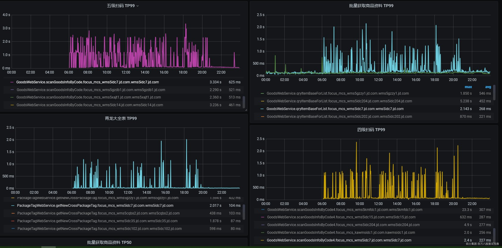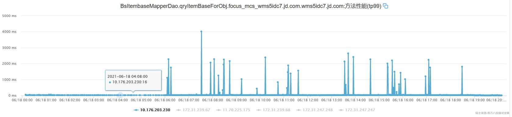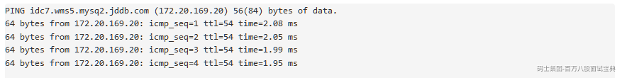

一个慢SQL引起的应用性能下降

1：通过监控看板发现在相同的时间内，不同的mcs方法耗时监控均有频繁跳点，且不同方法的跳 点规律一致。

2：首先查看DAO监控，发现有部分DAO层方法监控有明显跳点

3：考虑是否应用到数据库延迟影响，登录部署mcs的实例机器，ping相应数据库，未有异常---

3：查看mysql数据库监控，发现有慢SQL在执行，此SQL为五级扫码的最后一层逻辑，使用了前 后%的形式。

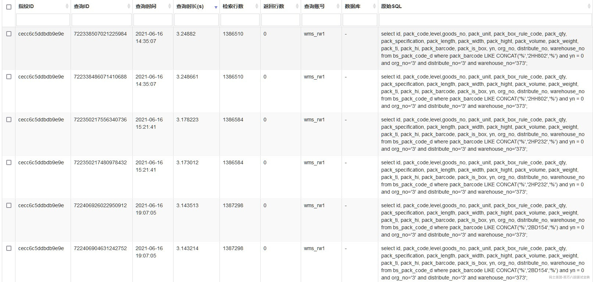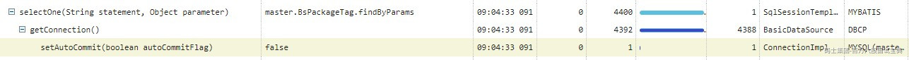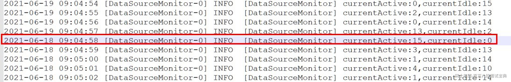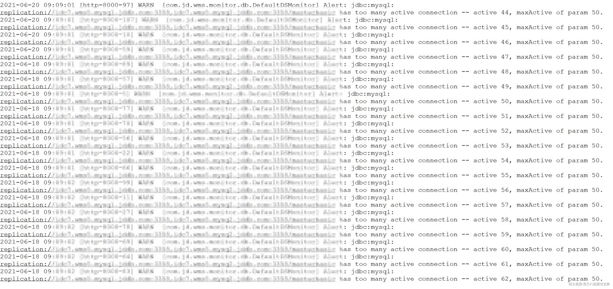

在此不仅有疑问，此SQL只是五级扫码的慢SQL,为什么目前整体的mcs性能都下降了。

4：查看pinpoint，发现不同的执行慢方法，主要都集中在此步耗时较长。

5：查看数据库活动日志监控日志（日志1监控为每隔1S监控，监控数据可做一部分参考用）

日志2：

当有跳点的时候，通过数据库监控发现，数据库所配置的最大活动线程数据已达饱和，因此导致后

续的所有请求均需要等待获取数据库连接进而等待，进而导致了整体mcs性能的下降。

SQL优化后监控效果,，至此第一步优化效果呈现，大批量高跳点异常消除。

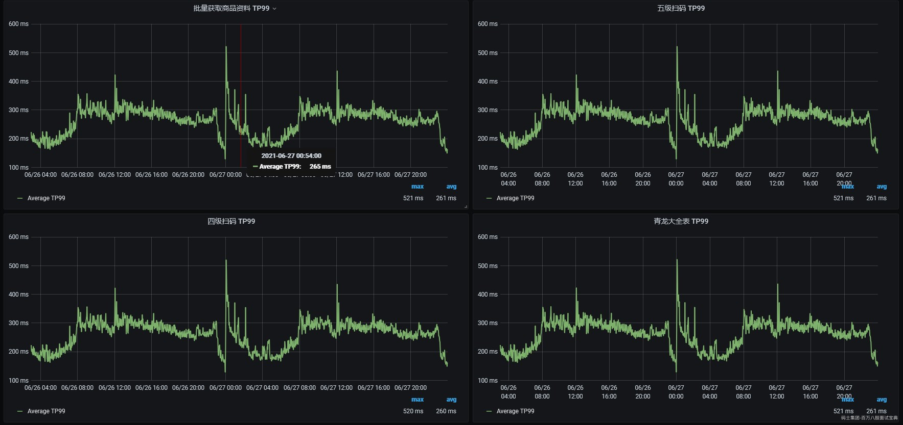

**count慢查询优化**

1。问题现象： 有若干max点

日志中也给出了参数（搜索activiy-inner应用，关键词TimeMonitor：

2021-07-08 10:59:27:284 ERROR [56e9344191d045d298d4ec68d99835e4] TimeMonitorAspect - 【TimeMonitor】BaseDao#count[]: 执行时间1397ms，告警配置

1000ms，方法入参 [{"bindType":1,"promoId":30001557642,"site":301,"status":0,"venderId":215778}]

2021-07-08 10:59:35:080 ERROR [56e9344191d045d298d4ec68d99835e4] TimeMonitorAspect - 【TimeMonitor】BaseDao#count[]: 执行时间1374ms，告警配置

1000ms，方法入参 [{"bindType":1,"promoId":30001557642,"site":301,"status":0,"venderId":215778}]

2021-07-08 10:48:52:654 ERROR [dee0aa66bc8d470f8653ab4ad8189149] TimeMonitorAspect - 【TimeMonitor】BaseDao#count[]: 执行时间1254ms，告警配置

1000ms，方法入参 [{"bindType":1,"promoId":30001557033,"site":301,"status":0,"venderId":143767}]

2021-07-08 11:58:13:171 ERROR [a59c76b34dc3435eab1e23b026af26c1]

TimeMonitorAspect - 【TimeMonitor】BaseDao#count[]: 执行时间1066ms，告警配置

1000ms，方法入参 [{"bindType":1,"promoId":30001548754,"site":301,"status":0,"venderId":10318485}]

2 分析过程 根据入参并结合traceid，能判断出来是在做礼金促销同步，同步前应该执行count方法计算待同 步的sku数量

首先根据promotest.\*\*.com中的促销工具 - 促销库线上环境查询 - 主站Pop库表 - 营销中心8库

，输入促销编号 和 商家编号，点 Sql展示按钮，注意这里给出的sql表名为promotion\_738，需 要替换为promotion738

根据条件即Promo\_sku.xml中的count方法拼装sql条件

sql为： pop\_promo5库

explain select count(1) from promo\_sku738 t where t.PROMO\_ID=30001557642 and t.VENDER\_ID=215778 and t.BIND\_TYPE = '1' and t.status = 0;

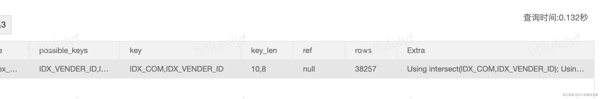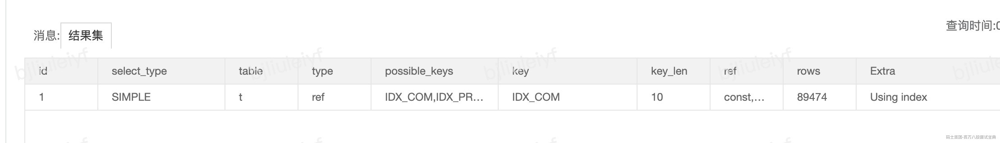

执行计划命中了交叉索引

该sql执行时间较慢，超过2s，目前分析主要原因在Using intersect 交集索引，增加了耗时将sql

改为select count(1) from promo\_sku738 t where t.PROMO\_ID=30001557642 and t.BIND\_TYPE = '1' and t.status = 0; 执行计划只命中单个索引，但执行时间较短，不到0.03s

3 其他

已验证其他活动id这么优化性能提升明显

4 代码优化方案 考虑是否在底层sku的sql判断时，如果promoid不为空时，venderid可不拼接条件 修改PromoSku.xml 把count方法条件中

<if test="venderId != null">

AND VENDER\_ID = #{venderId,jdbcType=BIGINT}

</if>

改为

<if test="venderId != null and promoId == null">

AND VENDER\_ID = #{venderId,jdbcType=BIGINT}

</if>

备注：

SELECT count(\*)

FROM union\_plan p

JOIN union\_plan\_goods g ON p.pk = g.plan\_id

WHERE p.status = 6 AND g.delete\_flag = 0

ORDER BY p.pk;

**去掉order by\*** \*语句，count 语句无需排序\*\*

**Using intersect优化建议**

1-MySQL执行计划选择了单独的N个索引中的2个索引，通过Using intersect算法进行index merge操作，底层执行了两次IO访问，导致时间增长

2- **建议使用复合索引，或者单独使用单条索引通过设计计算上移避免产生索引交集**

3-有时候需要走强制索引，

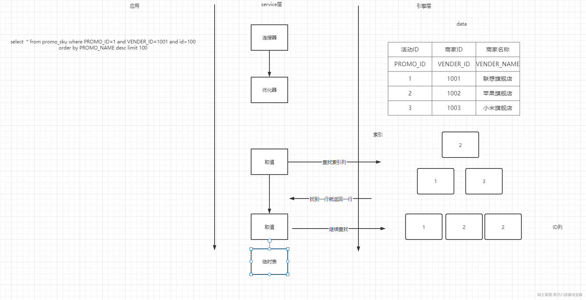

**4.8.3 死锁**

场景： 运单的上游生产是以子单的形式下发到运单，然后进行自营补全，自营补全的时候会查订单中间件

的信息，里面包含父订单，如果有父订单的触发父子单任务。

父子单任务里面会根据子订单查询订单中间件接口，查出一个list<父单，子单> 存储到数据库。

**问题场景：**

存在一种场景，如果一个子单在很短时间内下发会触发多个父子单任务，这个时候会出现同时插入 多条重复数据的问题，造成Insert场景下的死锁。

另外问了下订单中间件的人，他们说每次查询到的父子单的list可能不是一个顺序，也就是说会存 在事务1插入1、2两条数据，事务2会反着插入2、1

**基础：**

[死锁分析首先需要看懂MySql死锁日志 **http://keithlan.github.io/2017/06/05/innodb\_l ocks\_1/** 这个博客的一系列文章讲解的很清楚。](http://keithlan.github.io/2017/06/05/innodb_locks_1/)

**表结构：**

CREATE TABLE order\_parent\_child\_0 (

ID bigint(20) NOT NULL COMMENT '主键编码',

PARENT\_ORDER\_ID varchar(50) DEFAULT NULL COMMENT '主订单号',

CHILD\_ORDER\_ID varchar(50) DEFAULT NULL COMMENT '子订单号',

CREATE\_TIME timestamp NOT NULL DEFAULT CURRENT\_TIMESTAMP COMMENT '表分区',

FIRST\_TIME timestamp NULL DEFAULT NULL ON UPDATE CURRENT\_TIMESTAMP

COMMENT '创建时间',

UPDATE\_TIME timestamp NULL DEFAULT NULL ON UPDATE CURRENT\_TIMESTAMP

COMMENT '更新时间',

UPDATE\_USER varchar(50) DEFAULT NULL COMMENT '更新人',

CREATE\_USER varchar(50) DEFAULT NULL COMMENT '创建人',

SYS\_VERSION tinyint(4) DEFAULT '0' COMMENT '系统版本号',

YN int(11) DEFAULT NULL COMMENT '是否删除',

TS timestamp NULL DEFAULT CURRENT\_TIMESTAMP ON UPDATE

CURRENT\_TIMESTAMP COMMENT '时间戳', PRIMARY KEY ( ID , CREATE\_TIME ),

UNIQUE KEY uniq\_parent\_child ( PARENT\_ORDER\_ID , CHILD\_ORDER\_ID , CREATE\_TIME ) USING BTREE,

KEY idx\_parent\_order\_id ( PARENT\_ORDER\_ID )

) ENGINE=InnoDB DEFAULT CHARSET=utf8 COMMENT='父子单表';

**分析：**

原因是存在两个事务 同时插入相同的数据，且数据的插入顺序是相反的。 具体点：

参考上面说的问题场景，每个子单都会触发父子单任务补全。 存在两个同订单号的子单号：父单号:6, 一个子单号为1，另一个子单号为2,那么就会存在两个

事务：

事务一：

Insert into (parent\_order\_id, child\_order\_id) values(6,1); Insert into (parent\_order\_id, child\_order\_id) values(6,2); Commit;

事务二：

Insert into (parent\_order\_id, child\_order\_id) values(6,2); Insert into (parent\_order\_id, child\_order\_id) values(6,1); Commit;

此时会导致死锁。

**解决方式：**

1、 在插入之前以父订单号为Key做Redis分布式锁，缓存时间为5s，获取到锁的再到数据库中根 据父单号查询下有没有数据，没有数据进行插入，获取不到锁的直接丢弃。（如果插入异常，还有 worker自动跑）《线上版本》

**4.9 流程+配置+沟通等**

**1-签署协议用户点击提额列表无反应事故报告**

**事故描述：**

事故反馈时间：2020-10-2x 定位问题时间：2020-10-2x 处理事故时间：2020-10-2x

**事故类别：** 质量流程类

**事故定级：P3** 影响面：特定场景用户【10分】 影响性质：功能流程型【20分】 影响时长：大于2小时 【30分】

**事故发生现象：**

用户点击提额按钮无反应，未签署协议用户没能拉起协议进行展示导致用户不能进行协议签署及后 续相关提额操作。

**事故发生原因：** 查询提额列表接口迁移至新地址，需要回归提额功能。其中未签署协议用户需查询协议接口进行展 示，getAgreementInfoWithLogin查询协议接口测试环境已经无人维护，为配合验证开启代码分 支更换接口进行验证，因接口返回字段不同前端进行了相关字段处理，验证后未进行分支废弃处 理，进行了分支切换导致代码被带入主开发分支。上线前预发验证未回归到相关case。上线后未 签署协议用户点击提额列表查询协议后字段读取错误，无法展示协议列表，导致用户不能进行签署 协议及提额操作。

**事故造成影响：**

2020-10-2x至2020-10-2x未签署协议用户点击提额列表无反应，查询协议后无法进行展示导致用 户无法进行协议签署和提额操作。接到反馈共3个，其中客诉2个，内部反馈1个。通过前端SGM 平台报错数统计，预估单天影响签署协议用户数约3w+。

**事故解决过程：**

1.2020-10-2x 14:06:00收到用户客诉反馈，用户点击提额按钮无反应，；

2.2020-10-2x 14:30:00埋用户pin复现问题，定位代码位置，未能正确获取到接口返回的协议列 表相关字段，无法进行协议展示及后续提额操作；

3.2020-10-2x 16:12:00 修复代码，配合验证测试回归。

4.2020-10-2x 21:12:00 上线完成，未签署协议用户恢复正常提额操作；

**改进事项:**

1.测试环境验证后，预发验证需要回归验证到每一步修改过的流程，保证预发和测试环境的代码一 致性，保证每一项功能全部正常，加强规范意识；

2.加强git分支规范学习。开启分支测试流程后，切换分支时确保代码舍弃或是进行了commit操作 后在进行分支切换，切换分支后再次确认测试分支代码没有污染主分支代码。第一时间删除废弃的 测试分支。

3.注重细节操作，每一个操作流程后要进行验证，避免发生错误；

4.上线后及时回归验证需求功能及代码变动，观察监控各项指标是否正常，关注各个监测系统数 据。

5.重要流程操作进行日志上报操作，配置监控告警，上线后观察用户操作日志。确保每一项功能都 完整及正常。

**2-预售定金支持@@支付事故报告**

**事故描述：** 事故反馈时间：2020-10-XX 定位问题时间：2020-10-XX 处理事故时间：2020-10-XX **事故类别：** 系统质量类 **事故定级：P3** 影响面：特定场景用户【10分】 影响性质：功能流程型【20分】 影响时长：大于2小时【30分】 **事故发生现象：**

1.预售订单定金支付选择@@支付时，可用非预售定金专属营销券

2.商城侧营销结算积压，结算流程无法流转

**事故发生原因：**

1. 【营销中台@@规则字段透传】需求在合并代码过程中，代码合并丢失

request.setPreSale(reqVo.getPreSale())，导致预售定金标识字段未传到中台营销侧

2. 产品方案未评估预售订单进主流程后，@@支付不可用数科侧本金营销

**事故造成影响：**

1. 预售订单定金使用@@支付且使用本金营销共计5\*\*笔（多数为随机立减券），影响商城结 算

**事故解决过程：**

1. 2020-10-XX 凌晨 支付侧上线预售定金支持@@支付(此时系统无异常)

2. 2020-10-XX 10:00 产品配置线上预售定金专属本金券，并消费（此时结算系统已出现异 常，但由于流量较小，结算系统未发现反馈问题）

3. 2020-10-XX 15:00 左右交易侧开始上线，由于代码合并丢失 request.setPreSale(reqVo.getPreSale())，导致预售定金标识字段未传到中台营销侧（此 时预售定金支付陆续可见非专属通用本金券，并可消费成功，结算异常订单逐渐增多）

4. 2020-10-XX 20:30 左右商城营销结算陆续发现问题，找到息费营销，同步预售定金不可用 任何本金营销，包括快捷本金、@@侧本金以及流量最大的中台本金

5. 2020-10-XX 20:50 左右息费营销经产品评估后，修改线上逻辑，屏蔽本金券，同时定位到 预售定金标识字段未传

6. 2020-10-XX 21:00 交易侧定位到字段丢失原因

7. 2020-10-XX 21:10 赵\*确定修复方案并修复问题，与姚 **协商测试并开始上线；岳\*** \*复核合 并代码是否有遗漏

8. 2020-10-XX 21:20 赵\*上线黄村分组，下线亦庄，问题修复

9. 2020-10-XX 23:00 左右营销侧上线完成，此时屏蔽了所有本金券

**改进事项:**

1. 新业务上线必须加白名单验证、流量切量开关，确保验证全面，有问题及时修复

2. 合并代码要仔细核对，冲突部分找相关人员确认，合并完与master对比，确认变更无误方 可提交合并请求

3. 线上如果有多机房分组，上一部分分组，相关接口旧版本jsf下线，稳定一段时间，确认无误 后，全量发布

4. 对于合并有冲突的地方，做回归测试、线上验证

5. 查询接口接流量回放进行验证

**外单快捷场景营销展示问题事故报告**

**事故发生现象：**

外单快捷激活场景，用户在支付时无法看到营销利益点，造成202X-08-11 21:30:00至202X-08-

12 14:29:00 时间段内快捷激活成功数同比下降1XX笔。

**事故发生原因：**

1、 8.11号晚上21:30分，营销上线时更新了依赖jar包，由于jar包版本号不是最新版本，造成在匹 配活动时快捷场景均匹配失败。

2、 运营同事在进行快捷下单时发现无优惠活动露出，进而反馈给研发处理。

3、 由于外单场景下监控力度过粗以及研发上线完成后未对每个场景进行逐一验证，造成未能及时 发现问题，导致上线1天之后才知道存在影响。

**事故造成影响：**

外单快捷激活场景，用户在支付时无法看到营销利益点，造成事故发生时间段内快捷激活成功数同 比下降1XX笔。

**事故解决过程：**

1、2020-08-12 13:51:00 接到运营产品反馈：外单收银台快捷场景没有展示出快捷营销活动。

2、2020-08-12 13:55:00 查询线上日志，定位到问题为快捷用户标识识别失败，造成营销活动未 返回。

3、2020-08-12 14:14:00分析系统，定位到具体问题原因：8.11号晚上21:30分，上线时更新了 依赖jar包，由于jar包版本号不是最新版本，缺少逻辑；造成在匹配活动时快捷场景均匹配失败， 开始执行线上回滚。

4、2020-08-12 14:29:00 线上回滚完成，线上验证通过，功能恢复正常。

**改进事项\*** \*:\*\*

1、对于升级jar包需要谨慎，完善自测、测试以及单元测试，对各个场景进行覆盖，保证线上业务 不受升级影响。

2、加强系统监控，对各个场景下业务数据进行监控并报警。

3、和业务加强沟通，发现业务数据异常情况及时查看和沟通。

**预授信流程参数不完整事故报告**

**事故描述：**

事故开始时间：202X-05-XX 16:45:42 处理事故时间：202X-05-XX 16:55:00 处理完成时间：202X-05-XX 17:14:00 实际影响激活：7XX人

**事故定级：P3** 影响面：特定类用户【20分】 影响性质：功能流程型【30分】 影响时长：28分钟【10分】

**事故发生现象：** 预授信激活流程用户在鉴权页面输入正确鉴权方式后，提示用户“系统繁忙，请重试！” **事故发生原因：**

通过erp修改预授信流程采集数据配置propMap字段格式不对

1、 Erp编辑框中propMap字段和数据库propMap字段格式不一致，再编辑时误以为两个字段格 式一致，将数据库的该字段粘贴出来略加编辑，然后做了更改操作

2、 Erp再执行修改后序列化json后格式不对导致赋值对象为空，最终保存到数据库propMap字段 为空，

3、预授信流程是根据propMap字段配置组装参数传给cds的，由于组装后缺少必要参数，最终导 致cds必传参数没能正确传值

**错误格式实例：** {"propMappingList":[{"fromProp":"seq\_no\_wy","toProp":"seq\_no\_wy"}]} 说 明：多了propMappingList字段，数据库里是这个格式

**正确实例：** [{"fromProp":"seq\_no\_wy","toProp":"seq\_no\_wy"}] 说明：erp上填的时候应该是 这个格式

**事故造成影响：**

预授信激活流程用户鉴权后不能激活成功

**事故解决过程：**

1、202X-05-XX 16:45:42 通过erp更改配置

2、202X-05-XX 16:51:00 收到数聚力报警

3、202X-05-XX 16:55:08 在erp上紧急恢复原配置，由于没有发现格式问题，多次更新还是失败

4、202X-05-XX 17:04:35 组装sql提交online 工单，想着通过sql恢复

5、202X-05-XX 17:06:42 由于sql有特殊字符，online工单多次审核失败

5、202X-05-XX 17:08:00 紧急联系dba，给到的回复需要走其他工单

6、202X-05-XX 17:14:00 恢复正常

**改进事项:**

1. 没操作的过的系统和功能提前测试环境演练下，流程配置项的修改要走测试流程

2. 提前做好降级预案，出现问题及时回滚；修改项表单提前备份出来或编写好回滚sql

3. erp后台操作上也加上限制和校验，非法内容提前拦截，不要把错误数据更新上从而影响正 常流程

**营销系统事故报告**

**事故名称**

营销系统事故报告

**事故描述**

事故发生时间：201X-06-XX 17:15:00 事故响应时间：201X-06-XX 17:15:00 事故解决时间：201X-06-XX 20:00:00

**事故症状：**

营销有券活动活动名称显示成相同的“满5000减800元（限制分24期使用）”，erp后台显示活动

名称全相同。

**事故造成影响**

校园推广app端显示的十个券名称都是一样的；营销erp后台活动名称显示一样，线上依赖缓存无 影响。

**事故发生原因**

运营配置活动有误，活动上线后运营立即发现错误，联系研发人员修改。团队新人不懂公司规定在

匆忙情况下执行了没有带where条件的SQL语句，更新了活动名称影响数据5千条，其中有效数据

200多条。

**事故解决过程描述**

1、17:15左右：研发发现问题后马上电话DBA修复数据

2、17:30左右：DBA反馈恢复数据时间较长，想用其他方式修复，开发人员开始在缓存中查询正 确数据，用缓存恢复数据时间依然较长。

3、18:00左右：校园推广发现显示不对，优先修复校园的十个活动

4、18:10 左右：联系大数据部门查询修改之前的历史数据

5、19:00左右：大数据部门查到修改之前的数据，并转给DBA。

6、19:40左右：DBA执行更新SQL语句。

7、20:00 左右：数据修复完成,验证数据无误。

**事故总结教训**

1. **强化安全意识，严格按公司规定流程执行，涉及任何线上操作、数据库修改必须提交工单由**

**运维人员执行。**

2. **加强组内技术培训，宣贯SQL语句执行规范，任何update操作必须要有where条件，如不 符合预期影响范围应执行回滚操作。**

3. **涉及线上紧急问题应按规定执行审核、复核机制并提升问题反馈机制，避免出现工作上的疏 漏。**

**运单滞留分拣中心无法称重 故障报告**

l 故障描述：201X年7月XX日晚上21点分拣发现部分运单无法称重，22点开始逐步恢复，期间受 影响运单3XXX多单；

l 故障影响：分拣中心称重，提示无运单信息，导致有一部分货物积压在分拣中心，只能转离线处 理；

l 故障损失：0

l 处理过程描述：由于在201X年7月XX日，开发人员误将线上分组基础资料别名配置修改为UAT测 试环境别名，造成运单无法通过商家信息校验，导致推送下游数据的积压；在将分组修改为正式分 组后将之前的缓存清理后能够解决问题。

l 根本原因：线上配置文件配置错误，review没有及时发现问题；

l 提升方案：预防故障再犯的提升方案，从产品、技术、架构、流程、操作规范等多方面深入分析 故障，有针对性的制定防范措施作为提升方案，提升方案应可衡量是否完成。针对提升方案后续会 有专人持续跟进并验证其有效性。

l 应急预案：通过规范上线流程的各个环节保证，线上的稳定性。

**耗材项目推广事故（COE）分析报告**

一、 事故描述

201X年8月9日研发侧接收到产品经理转发需支持批量开启全部商家包裹明细采集服务的邮 件；邮件中由业务方高级经理审批需研发在8月15日早上9:00协助批量开启所有商家包裹明细采集 服务并以此支持全面推广包裹明细采集服务事宜（耗材采集项目于2017年3月28日上线完成）。

201X年8月14日下午4：20，经过与产品、业务确认后执行SQL批量开启所有商家耗材采集服 务。耗材项目耗材资料分两部分组成：商家自定义耗材、若未维护耗材可使用京东自营耗材。商家 包裹明细采集服务开启后由于商家均未配置个性化耗材、DTC也未配置耗材信息下发通道导致打 包时订单在WMS生产无法获取耗材信息卡单（约15000单），订单出库接收WMS包裹数据失败 分拣验收无数据卡单（约3500单）。

二、 事故影响 WMS生产无法获取耗材信息卡单约15000单；订单出库后ECLP接异常包裹数据导致推送青龙

3500单延迟。

三、 事故损失 部分订单时效有影响。 四、 处理过程描述

16：20 执行SQL开启所有事业部包裹明细采集

17：20 现场接货仓反馈包裹无数据，无法称重操作,未提供异常单号。

17：21给现场提报人电话沟通，并让其提供几个异常单号供排查问题

17：27 提供异常单号，进行排查，外单数据为空，ECLP没有下发发货数据

17：30 排查ECLP包裹数据MQ消费积压并电话反馈研发

17：44 ECLP研发排查WMS回传包裹数据货主类型与包装类型为空

18：15 确认商家端未配置耗材信息导致订单生产异常

18：20 因现场货物积压严重，无法确定数据修复时间，告知分拣离线发货，避免影响时效

19：00 完成DTC配置

19：30 关闭未配置耗材信息事业部包裹明细采集，不再产生新的异常订单

20：04 上线解决包裹回传MQ消费失败问题

20：10 推送外单的异常数据修复完成，接货仓可正常操作称重

20：57 WMS修改订单数据去掉包裹明细采集标，恢复正常生产

五、 应急预案

1.接收到类似业务需求后无论新业务、老业务推广均积极与上下游相关系统人员沟通、确认；

2.业务推广过程中需做好推广计划，执行过程中优先小批量推广并在验证无误后再考虑全面推广事 宜；

3.联系上下游相关人员一起监控，一旦出现异常情况第一时间回滚，并异常单据处理及问题排查。

六、 根本原因

1.研发、产品在接收到业务全面推广需求后未告知下游相关系统；

2.项目3月份上线完成， 到8月份未制定全国推广计划、未通知DTC进行全国库房配置，导致研发 和产品在接收到推广需求后判断错误（已有4个商家正常运营很长时间）；

3.业务推广未培训到位，在事故处理过程中，DTC配置完成后多数库房人员不会使用耗材采集功 能。

七、 提升方案

1. 项目上线完成后，项目经理或产品经理需明确后续推广计划，并通知相关系统做好全面推广 配置；

2. 针对业务诉求尽可能的开发出工具或功能给业务使用，减少研发后台修改数据的情况；

3. ECLP后续上线时间为上午部署灰度并测试，测试通过后下午17:00单量低谷期上线；

4. 对于跨系统项目及需求提前与各条线进行沟通联调，确认无影响后再集中上线；

5. 后续针对需快速推广业务，产品研发应与业务沟通并制定一个完整、风险较小的推广执行方 案，防止类似事故发生。

**领券库存发送超时事故报告**

**事故描述：**

事故反馈时间：201X-11-XX 22:00:00 处理事故时间：201X-11-XX 16:00:00 定位问题时间：201X-11-XX 10:00:00

**事故定级：P3 事故发生现象：**

1、201X年11月XX日 23:30:00 – 11月XX日16点 部分用户领取优惠券【11.3神券日-满99减5】

【11.3领券中心精选-满49减2】等，优惠券没有到账。

**事故发生原因：**

1、11月2日晚23点30分上线营销管理系统，其中一台服务器实例缓存管理功能配置文件依赖 注入失败，操作缓存报 NullPointerException 。

2、营销管理系统对缓存和数据库异常捕获并封装成“0001未知错误”错误码，领券业务系统 未对该错误码进行异常处理，出现业务逻辑漏洞：查询数据为空当作不需要判断库存处理。

**事故造成影响：**

1、 部分用户11月XX日23点30分开始领取优惠券【11.3神券日-满99减5】【11.3领券中心精选- 满49减2】等，优惠券没有到账，

11月XX日16点营销管理系统再次上线后，未到帐情况暂时停止扩大。

2、 经统计有3991张券未正常修改营销活动库存，涉及活动70个，因活动还没结束，未造成优惠 券超发和资损，和业务方确认对这70个活动修改营销活动库存成已发放优惠券库存。

**事故解决过程：**

1、2018-11-03 22:00:00收到MQ重试报警，联系优惠券中台同事排查问题。

2、11月4日9点和优惠券中台同事对照问题活动领取记录导出数据进行日志追踪，定位代码问题。

3、11月4日16点修复系统问题上线。

4、统计未正常修改库存的活动、对问题活动库存进行恢复。

**改进事项:**

1. **系统之间调用错误码判断要严谨，尽量减少系统异常对业务逻辑的侵入，RPC层出现异常要 及时中断业务逻辑。**

**系统之间调用有两种异常处理方式：**

1-直接将异常抛出给调用方，并在调用方系统对RPC操作进行异常捕获和处理。这种方式适用于组 内系统调用、微服务调用。但要注意区分数据库防重异常和其他异常的逻辑区分。

2-在服务提供方对异常捕获并进行错误码封装，这种方式适用于给其他业务线提供服务、非RPC协 议。要注意错误码处理要采用白名单，非白名单错误码当异常处理。避免因为错误码增减造成调用 方逻辑判断错误。

2. **保持服务原子性和可单元测试， 尽量让底层服务更简单，更少逻辑，底层服务出现问题能 清晰及时的在业务层中断。提高单元测试的覆盖、和效率。**

3. **重要配置不要懒加载，自定义NamespaceHandler初始化错误要抛出异常，阻止tomcat**

**容器启动，不注册，成为服务正确提供的底线。**

**可用率报警要配置低于100%就报警，及时发现问题。**

**4.10 构建+合并代码+jar包问题+环境隔离**

git提交注释规范：

**commitType(JIRA号):description**

一般配合辅助检测工具 **Checkstyle**

**4.10.1 秒杀提报线上事故复盘**

**问题描述**

7月16日上午9点30左右，陆续有运营反馈促销审核完成、但提报系统中的促销状态未进行更新， 而在促销系统中查看促销则是已审核通过状态。经排查是由于7月16日凌晨、开启了一台预发机器 的线上mq消费，导致部分促销变更信息的mq在该机器上进行了消费、因此促销状态未变更成 功。7月16日晚，秒杀研发团队对涉及的相关mq（自营、pop 促销）进行回放消费，当积压消息 消费完成后、系统恢复正常。

**技术排查过程**

7月16日上午，在收到部分促销状态未变更（包括自营和pop的问题反馈后），研发团队针对促销 mq 线上消费情况进行了检查、发现部分 mq 信息被一台预发机器（10.173.127.15）所消费。该 预发机器是7月16日凌晨开启的mq队列，其中监听到了线上的 mq 队列、导致部分促销变更的消 息在该预发环境被消费了，故未能更新提报系统中的促销状态。

经了解，此预发机器是7月16日凌晨开启的 mq 监听。当时秒杀迭代5.0需求刚上线完成、因为出 现了预发mq队列的积压告警，看到告警的人员微信联系还在单位同事、开启预发环境上的所有 mq 监听队列、进行积压的消息消费（以前针对这种预发 mq 积压的情况，也是通过打开其他预 发环境 mq 进行监听消费）。但本次操作过程中存在如下问题：

**（1）沟通不畅**

看到预警信息和开启预发mq监听消费的是两个人，其中操作人员本次迭代开发、涉及在两个分支 开发对应的功能，在各自不同预发环境分别开发，而通知人先前是在其中一个预发环境开发，沟通 双方对要开启mq监听的 "预发环境" 理解不同，通知人想的还是上线分支对应的预发环境

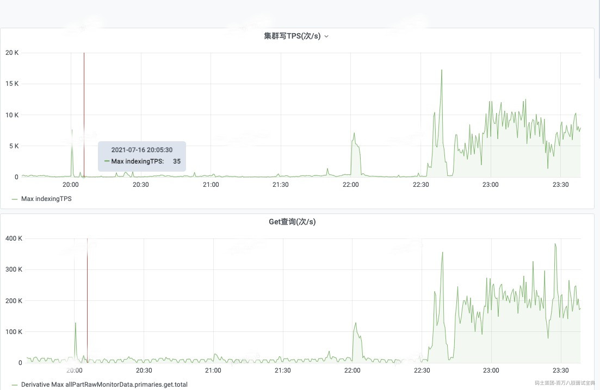

（11.64.165.XXX 的预发机器）。而当晚上完线后，操作人员就已经切换到另一个预发环境

（10.173.127.XXX）进行联调测试，看到 "预发环境" 第一时间想到操作自己当前的预发环境...沟 通不畅、继而引发了后续的问题

**（2）代码版本不同步**

同时在本地迭代5.0的开发中，也进行了 redis 线上与预发库的隔离（即预发开发环境对接的是预 发的 redis 库），因为目前提报系统创建促销时、会对本系统内创建的促销进行打标（通过 redis，在线上、预发各会打上各自的标，在接到促销发来的促销变更消息后、再根据标识判断是 否提报系统创建、并根据标识判断是所属预发或线上进行对应的转发消费，非提报系统标识的促销 信息、提报秒杀系统则会过滤、不进行操作）。因为此次迭代过程中、进行了 redis 库线上与预 发的隔离，故在5.0的迭代分支对接收促销mq、进行转发的判断的代码也进行了调整（改为了收到 促销mq，先同时转发线上、预发的监听队列，由线上、预发的监听队列进行后续的过滤操作）、 并合并 master 进行了上线。但开启消费的预发环境（10.173.127.xx）是较早从 master 上拉出 的分支，当时还未来得及合并最新刚上线的代码（否则即便线上促销变更的mq在预发机器上消 费、也是会被二次转发到线上的监听队列进行消费）。

综上两点，其实只要做到之一，本次预发消费线上mq就不会发生。此外在进行开启预发mq操作 时，正是刚成功完成迭代上线、精神状态刚放松下来的状态，对此次操作可能造成的影响警惕不 足，未能像平时一样对可能会造成的影响进行仔细的思考。各方面的原因引发了此次的问题。

在确定了问题发生的原因后，考虑到是周五、为不影响线上用户的使用，秒杀研发团队决定在周五 晚利用 mq 的回放功能，对相关涉及的促销 mq 进行重新进行消费。其中在执行自营促销的 mq，出现了 mq 长期积压、消费时间过长的问题，如下图

图1 mq 回放消费监控-1

图2 mq 回放消费监控-2

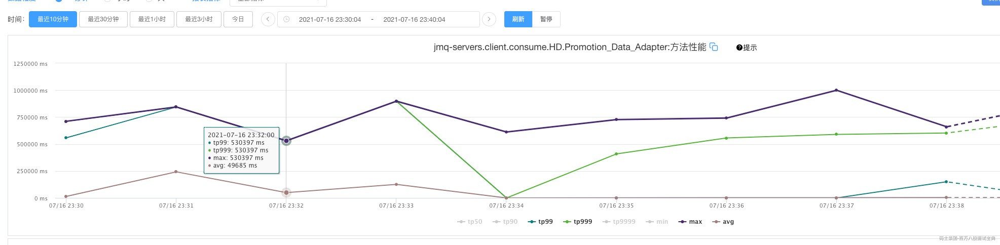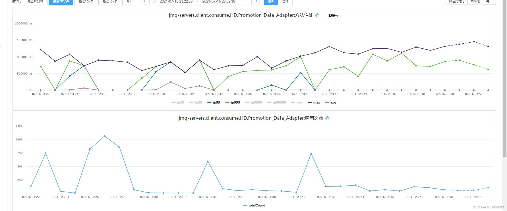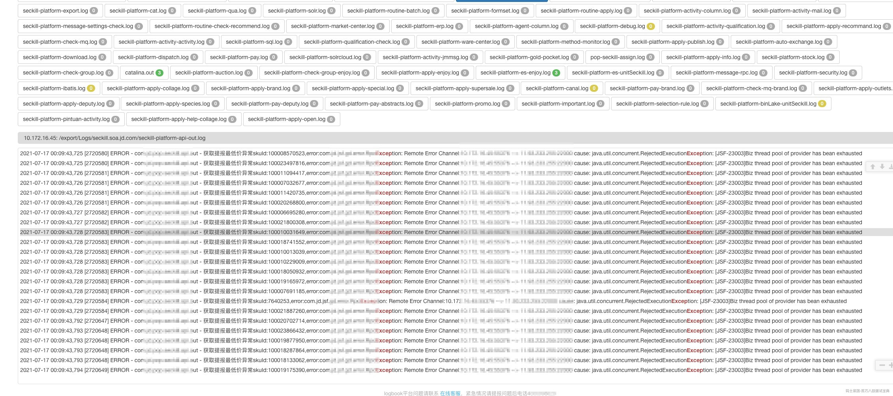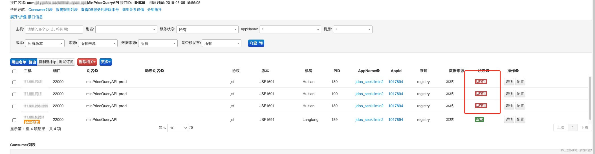

图3 促销mq消费监控

同时后台日志一直在报最低价接口调用错误

图4 最低价接口报错异常

经检查最低价接口的调用来源，是由于在消费 mq 的过程，涉及到触发闪购区块推送 cms。此处

因为新上线了迭代5.0中的一个新功能（判断推送的活动中、所有的报名商品是否属于多店铺，依 次来推送 cms），调用到了sku的基础信息接口方法，由于该接口方法中还封装了sku最低价、类 目等接口的调用，故导致在回放mq消费时，因访问量过大，造成商品sku最低价接口服务被打 挂、抛出异常，以致 mq 始终在重复消费阶段，消息始终处于积压状态。

图5 被打挂的最低价接口服务

针对此问题，秒杀这边紧急上线。替换了闪购推送 cms 功能中、涉及 sku 信息查询接口调用的方 法，不调用最低价的接口、使用取 sku 信息较少字段的方法。在重新上线后，再次进行对应 mq 的消费。因为消费量还是比较大、造成 sku 类目接口访问量加大，也让商详类目方面的研发同学 收到了预警、与提报研发进行联系。好在类目的接口并未挂掉，7月17日凌晨5点左右，mq 积压 的消息消费完毕后、MQ 机器的 CPU 使用率也都降下来了。此时本次 mq 回放消费操作完成， 同时也将消费完毕的结果通知了先前收到类目接口访问量加大预警、前来询问的商详方面研发同 事。

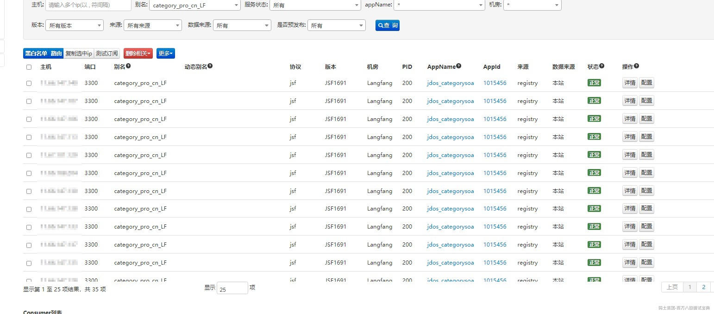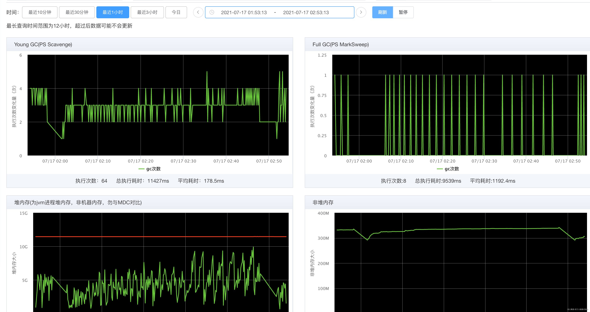

图6 涉及调用的类目接口

图7 mq 机器消费时的cpu使用率

图8 消费完成

**事故影响**

造成部分采销和商家反馈，促销状态未在提报系统中及时更新。而在促销 mq 回放消费时、巨大 的访问量打挂了调用到的最低价查询接口、并造成sku类目接口的实时访问量大幅增高。

**改进方案**

通过这次事件我们发现了一些我们的不足之处。并采取措施避免此类问题再次发生。

**已采取措施**

**改进点1：所有预发的j-one 配置中 ，pop 和自营创建促销的这两个 mq 后缀加上了 yfb，避免 在发生预发消费线上促销 mq 问题**

#pop促销mq pop.promo.status.adapter=pop\_promo\_status\_yfb

#自营促销创建成功

promo.data.new.add.adapter=Promotion\_Data\_New\_ADD\_yfb

**改进点2：进一步推进线上、预发环境的分离。**

由于目前线上、预发 redis 库已经进行了分离，所以各自环境的打标操作是在对应的 redis 库中 进行。而目前线上接收到的接收到的消息是全部的促销变更信息，由 mq 机器进行同时向线上、 预发的监听队列进行二次转发后再进行处理。此处仍存在线上和预发信息在一起同时转发的问题、 此处仍需进一步进行代码优化，尽可能的做到线上与预发分离。

**改进点3：秒杀内部周会上，再次强调要避免预发消费线上消息的问题。** 强调今后的mq消费操作中，一定要尽可能避免预发消费线上消息的问题。 此外今后如再涉及预发消费解决积压的问题时、如果不是一个人操作，一定要多沟通，确认开启

mq 的预发环境（精确到分组和 ip）、消费积压的内容（是否会对线上造成影响）、影响的上下

游、代码版本是否一致等。宁可多问不厌其烦、弄清事情原委，也不能想当然的仅按照字面意思进 行操作。

**改进点4：设计、开发的中可能存在的问题、及时在研发群中讨论沟通，不用都等到代码评审时再 看。**

针对开发中的功能，如果在设计实现上存在多种选择，可以在研发群里及时进行沟通讨论。同理如 果开发中非对接方新接入的接口、涉及老接口的调用，其中又有多个方法可调用获取返回信息时、 此时可以在研发群中与所有同事沟通、探寻最优解。

本次迭代上线的功能中，新增加的多店铺字段判断问题、需获取报名中所有自营商品所属的 venderId，此处调用了 sku 接口查询商品信息、封装的底层还涉及了最底价、商品类目等接口的 调用。由于此需求因为涉及与 CMS 端联调，为配合对方，经产品的协调、此需求是在迭代5.0设 计开始前、就利用周末时间加班提前开发完成的，所以这块功能的设计并未在此次设计评审时进行 讨论。

此功能在设计时、存在多种可用的设计实现方式。 **获取 sku 所属 venderId 的步骤可在报名商品 入库** 或是 **推送 cms 时获取封装** （目前提报系统在报名时，只针对 pop 的 sku 存放所属 venderId，未对自营 sku 的所属 venderId 在本地存放，统一都标识为 -999），当时考虑历史 数据问题、以及除本功能外、目前自营 sku 的所属 venderId 暂无其他用途，所以采用了在推 cms 时获取 sku 信息的方式来获取 sku 对应的 venderId，而后与 cms 端的联调和测试功能上 确实也都是正常。但是这块忽略了 mq 回放大量数据消费、造成的对第三方接口可能造成的访问 量激增的问题，属于设计考虑上疏漏。

在开发实现时，对于两种设计实现方式上的利弊确实是有所考虑，但因为和 cms 的联调时间被定 了下来，所以选择了改动相对较小的后一种方案来实现（当前的方式），对于设计上的可能存在的 问题考虑不全、同时想着在上线前的代码评审中还可以进行讨论，但后期代码评审时间与计划出入 较大，使得此问题一直没有能及时提出，从而导致设计上存在了隐患，并在 mq 回放消费时暴露 出来。

针对此情况，今后在开发设计上如存在多种选择时、及时在秒杀研发群中进行沟通，不一定非要到 设计评审或是代码评审时再说。目前每个人都非常忙，一旦遇到有潜在的风险都要及时抛出，避免 被遗漏。

**改进点5：排查常用的 mq 回放时或其他类似场景下、涉及调用的第三方接口，增加降级开关**

日常，提报秒杀系统不会过高的访问量，但 mq 回放时、短时间内数据访问量较大，存在打挂所 调用的第三方接口服务的可能。计划在这种场景下、排查涉及存在调用的第三方接口，减少不必要 的接口调用、并添加降级开关，避免打挂外部接口、或因不必要外部接口报错导致秒杀系统无法正 常进行消费。

**4.10.2 商品超卖复盘0610**

**一、 事故描述**

6月6日中午11:47（北京时间，下同）供应链团队接到泰国业务方张弘帆咚咚反馈泰国站出现部分 商品超卖现象。

**二、事故影响**

1. 造成泰国站在6月5日下午14:40，62个采购单重复写了出管表，涉及348个商品，372行采 购明细

2. 重复写出管，导致在6月5日14:40-6月6日14:23 期间库存不平，134个客户订单超卖。

**三、事故损失** 超卖订单无法交付，需要客服外呼取消订单，影响客户体验，具体损失待业务侧评估。 **处理过程**

**详细过程**

11:47 接到泰国业务产品张XX在群里首次反馈泰国部分商品出现SKU超卖；

11:50 供应链研发团队开始紧急处理；

12:28 排除泰国采购生产系统问题，定位到是泰国国际化采购系统预发环境问题；排查群告知采销 暂停下采购单。

12:40定位到上述预发环境消费了线上生产环境的MQ消息，并调用了技术中台预发环境写出管接 口，造成库存不平；立刻暂停采购预发MQ消息消费，停掉泰国采购预发环境服务，以防继续造成 影响；

12:42 同步业务方，可以正常下采购单，采购业务恢复生产；研发团队同时统计数据影响范围，并 排查问题具体原因；

13:14统计出受影响的采购单共XX单，并与技术中台同事确认；

13:34 明确受影响的采购单明细发给泰国业务产品进行出管冲销；

14:23 涉及的所有SKU出管数据已经冲销，库存持平，同时预发环境的数据完成清理，后续不会有 超卖订单产生。业务方同步进行外呼及问题订单处理。

**事故原因**

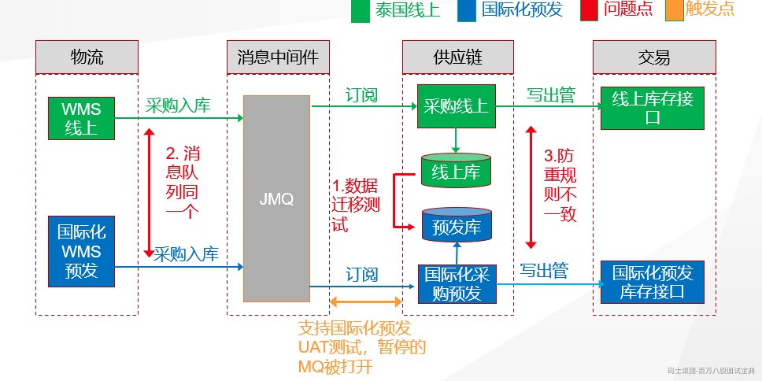

**4.11 连接池**

**二、东东农场无法进入原因与启示 问题原因：**

JONE&JDOS有每隔四小时一次的日志删除操作（平台业务研发部均使用该规则，且近几年未 发生过变动），8点12有一个应用日志的切割任务，当开始进行删除操作时，应用机CPU有个秒级 飙升，应用处理能力下降从而引起用户端卡顿； 几秒后用户端报复性访问量增加，需要新建大量 数据库链接，农场使用的是JED2.0，该版本JED自身特性所有新建链接都会去查询第一个分片，可 能会造成单个分片的负载过大； 第一分片扛不住后，出现慢SQL（基本都为新建链接拿取信息的 SQL），进一步拖住系统，最后CPU接近打满，系统出现异常。 发现问题后，第一时间研发重启 机器问题恢复；21日运维侧对第一分片进行了配置升级，增加了第一分片的抗负载能力，研发侧 按照JED的建议修改了链接池的配置，并且将日志删除操作改成了1小时一次；

**启示：**

1、 **数据库连接池的大小配置一定要合理\*** \*( 各种其他配置，例如 : 超时时间、重试次数等 ) 。\*\*

2、 **选择中间件版本时要做好充分的调研工作。**

3、 **压测时重点关注\*** \*CPU 打满 / 系统负载过高场景。\*\*

**我的设备加载数据失败**

**事故现象**

**9:00 窦西河反馈所有用户App中数据加载失败。** 9:10 查看线上日志，发现httpClient连接池 获取连接超时，暂时重启实例，保证服务可用。9:30 查看项目中httpClient连接池实现方 式，发现自实现了一个连接池，连接池最大连接数为50。15:00 编写测试类通过自实现连接 池并发调用http服务，51并发时复现线上问题。15:10 将连接池最大值及最大连接数修改为

5000及10000，暂时保证线上服务不挂。15:30 项目发布到预发布环境， **进行预发布环境压 测，未出现获取连接超时情况。** 16:00 将最新代码发布线上，数据加载正常。 次日12:00 重 构httpClient的连接池部分，使用httpClient自带连接池。重新压测上线。未出现连接池获取 连接超时问题。 7月3日 张 **反馈部分用户App中数据加载失败。-** 7月3日 经过代码分析和线下 pc端测试接口数据发现传给网关登录状态cookie的方式有问题（具体分析在下面）。 **7月4日 经过咨询接口服务方和API网关的相关开发人员，修改cookie转发逻辑，12点上线最新代 码，问题修复。**

根因分析 之前httpClient的连接池部分为自实现连接池，连接池的数量太小，大量并发会造成获取连接

超时。不同客户端调用API网关时cookie转发字段的问题。（具体分析在下面）。

止损对策 立即重启线上实例，暂时保证服务可用。增加连接池连接数量，从50扩大到5000。紧急联系

相关开发人员，定位问题，修改cookie转发代码。

优化方案 重构httpClient连接池部分的实现，从自实现连接池转换为httpClient自带连接池。添加

UMP监控。

**6月28日问题描述：所有用户都不能获取数据，线上服务不可用。 问题分析：**

查看线上日志，报timeout waiting for connection from pool，定位到问题在自实现的

httpclient连接池中，连接池大小设置为50，

当大量并发访问服务时连接池资源消耗殆尽，导致获取连接超时。

**解决办法：**

由于该项目的pv 及并发量并不太多，两台4核8G服务器资源完全能胜任，重构代码使用

httpclient自带连接池，不限制

连接池大小，使用空间资源换取时间性能。

**问题代码：**

HttpClient httpClient = HttpPool.getHttpClient();

HttpResponse httpResponse = httpClient.execute(get);

public class HttpPool {

private static final Log log = LogFactory.getLog(HttpPool.class);

private static ThreadSafeClientConnManager cm = null;

static {

SchemeRegistry schemeRegistry = new SchemeRegistry();

schemeRegistry.register(new Scheme("http", 80, PlainSocketFactory.getSocketFactory()));

cm = new ThreadSafeClientConnManager(schemeRegistry);

try {

int maxTotal = 100;

cm.setMaxTotal(maxTotal);

} catch (NumberFormatException e) {

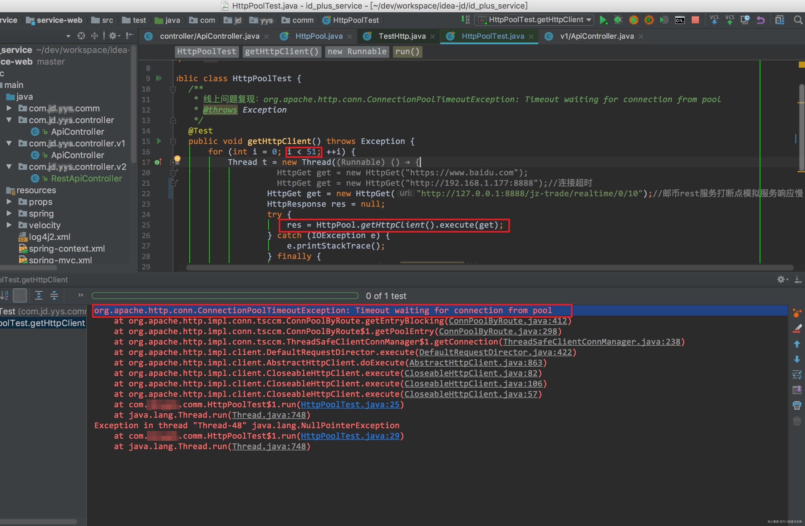

log.error("Key[httpclient.max\_total] Not Found in systemConfig.properties", e);

}

try {

int defaultMaxConnection = 50;

cm.setDefaultMaxPerRoute(defaultMaxConnection);

} catch (NumberFormatException e) {

log.error("Key[httpclient.default\_max\_connection] Not Found in systemConfig.properties", e);

}

}

public static HttpClient getHttpClient() { HttpParams params = new BasicHttpParams();

params.setParameter(CoreProtocolPNames.PROTOCOL\_VERSION,HttpVersion.HTTP\_1\_1);

params.setParameter(CoreConnectionPNames.CONNECTION\_TIMEOUT, 3000); // 3000ms return new DefaultHttpClient(cm, params);

}

public static void release() {

if (cm != null) {

cm.shutdown();

}

}

}

**测试类复现：**

**修改后的代码：**

HttpClient httpClient = getHttpClient(get); private HttpClient getHttpClient(HttpGet get) { CloseableHttpClient httpClient = HttpClients.createDefault(); RequestConfig requestConfig = RequestConfig.custom()

.setSocketTimeout(15 \* 1000)

.setConnectTimeout(15 \* 1000)

.setConnectionRequestTimeout(15 \* 1000)

.build();

get.setConfig(requestConfig);

return httpClient;

}

**4.12 性能优化**

**4.12.1 毫秒级性能优化**

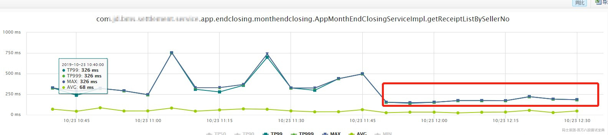

最近接到一个移动研发部关于双11备战的需求，大概意思是我们有个接口响应有时超过400ms或

500ms，流量高峰时对他们系统有隐患，希望我们尽快优化一下。

接口： com.xx.xx.settlement.service.app.endclosing.monthendclosing.AppMonthEndClosingServi ceImpl#getReceiptListBySellerNo

因为优化结果最多是提升100或200毫秒，所以哪怕是毫秒的提升都要考虑进去。发现在调用一个

jsf接口获取一些字典表之类的东西时，耗时在20多毫秒，

问题有以下几点：

1.查询到的数据通过gson序列化后缓存到redis，下次请求时再用gson反序列化成json串。gson

序列化从出生就有性能问题，我们叫他龟son。

换成fastjson后在本地测试能从400ms降到100毫秒，线上环境从24毫秒降到15毫秒。

2.有些 dubbo 接口和redis使用时有多次序列化的问题，如：使用redis时把对象序列化成json字 符串，最终存储到redis时会把字符串充列化成字节数组，同样命中缓存时

要经过两次反序列化，从性能上来看是有问题的。

3.字典表等变化很不频繁的数据，如果请求量大，最好使用一级缓存或两级缓存同时使用。

**4.12.2 服务性能优化案例分析**

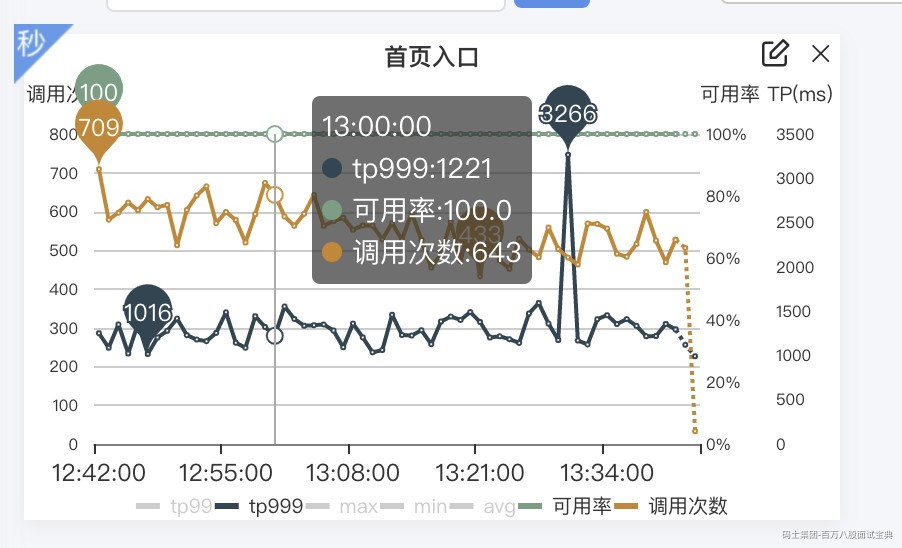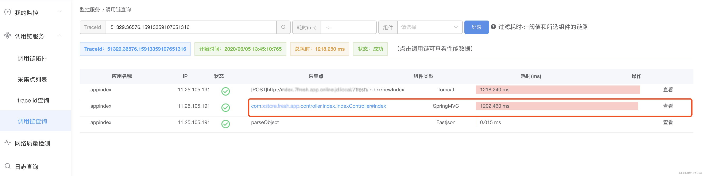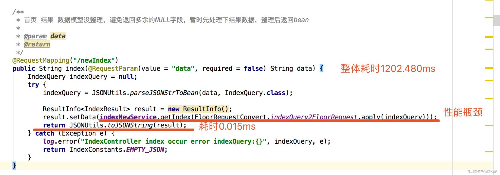

抽样一个应用服务做为案例分析，沉淀一个分析性能问题的思路

1.通过黄金流程面板可以看到首页的性能基本在1000ms以上，首页作为端门户，加载的快慢直接 影响用户的体验

2.根据链路跟踪可以识别到性能瓶颈的环节点

链路跟踪中到了com.xstore.fresh.app.controller.index.IndexController#index 下调的service

是整个性能瓶颈，下面人工分析下service的代码逻辑

3.IndexNewService分析

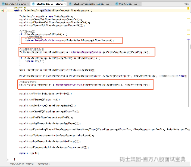

**结论：**

根据以上的分析，可以看出首页的性能瓶颈点并不在于复杂的加工逻辑，而是一些服务的众多依赖 拖慢了性能，总结有以下几点：

1.能并行的逻辑尽量不串行加工，考虑下线程数量，可分组共享线程

2.非大数据量的情况下，能内存计算的尽量内存中做逻辑，尽量减少网络交互开销

3.对于内部服务的聚合可进行编排化，外部按需索取 （参照商品信息聚合服务的优化建议）

4.对于外部依赖的服务需要提供性能指标，并约束业务系统践行

**4.13 容易忽略的点**

**4.13.1 那些年踩过的坑（技术篇）**

高并发下的SimpleDateFormat

第一坑：

public class DateUtilTest {

private static final DateFormat DATE\_FORMAT = new SimpleDateFormat("yyyy-MM-dd HH:mm:ss");

@Test

public void dateTest(){

ExecutorService executorService = Executors.newFixedThreadPool(500);

for (int i = 0; i < 500; i++) {

executorService.execute(new Runnable() {

@Override

public void run() {

for (int j = 0; j < 1000000; j++) {

try {

DATE\_FORMAT.parse("2016-12-12 12:12:12");

} catch (ParseException e) {

e.printStackTrace();

}

}

}

});

}

}

}

代码运行结果： Exception in thread "pool-1-thread-2" java.lang.NumberFormatException:

For input string: ""

at java.lang.NumberFormatException.forInputString(NumberFormatException.java:65)

at java.lang.Long.parseLong(Long.java:453)

at java.lang.Long.parseLong(Long.java:483)

at java.text.DigitList.getLong(DigitList.java:194)

原因：日期格式化的类是非同步的，建议为每一个线程创建独立的格式化实例，如果多个线程并发 访问同一个格式化实例，就必须在外部添加同步机制。

正确写法：

public class DateUtilTest {

@Test

public void dateTest1(){

ExecutorService executorService = Executors.newFixedThreadPool(500);

for (int i = 0; i < 500; i++) {

executorService.execute(new Runnable() {

@Override

public void run() {

for (int j = 0; j < 1000000; j++) {

try {

12:12:12");

new SimpleDateFormat("yyyy-MM-dd HH:mm:ss").parse("2016-12-12

} catch (ParseException e) {

e.printStackTrace();

}

}

}

});

}

}

}

小结

高并发所引发的问题往往很难解决，因为它无法稳定重现，如比本文中的问题，如果不是在高并发 的情况下，可能你的程序运行半年甚至更久，都不一定能出现几次解析失败的异常。就算偶尔出 [现，你也可能任务是日期格式错误，从而忽略掉它本身的机制。详情请看 **https://blog.csdn.ne t/farrell\_zeng/article/details/54408616**](https://blog.csdn.net/farrell_zeng/article/details/54408616)

<低级错误> 构建HashMap<Integer,Object>时，key类型为Integer； 但是再获取时get(Long)时 key使用的是Long类型，导致数据获取为空。 问题原因：

HashMap中key是否相等的判断依据：hashCode和equals方法，哈希值相同且equals返回true

才认为同一个key。

32bit以下的数值Integer和Long的hashCode是相同的；但是由于类型不同，equals方法返回

false。

也就是new Integer(888) 与new Long(888)是两个不同的key； 解决方法：

1. 统一使用一种类型Integer或Long；

2. 将数值转换成String类型作为key，彻底避免。

判定Integer对象相等尽量不要使用==，建议使用equals或者int值比较

分析：虽然JDK内部会存储-128 – 127的Integer缓存对象，但是通过new Integer()创建的对象与 缓存的对象不是一个。

使用equals方法或者int值比较 字符串判断相等要用Objects.equals();

**4.14 开发规范TOP10-晋升考核内容指导篇**

该规范 曾作为很多团队职级晋升技术参考标准之一。 适用范围：针对生产系统，不含监控与报表类应用

**1. 禁止在大循环中调用Service，SQL，Redis**

**1.1. Service的循环调用**

服务本身：提供批量接口； 调用方：尽可能的以批量方式调用取代逐条调用，减少系统开销； 案例：

修改前的代码：

/\*\*

\* 获取容器中的订单列表和具体订单的商品明细列表

\*\*/

public List<ObCheckMP> getListCheckMP(List<ObCheckC> listCheckC, ObCheckQuery checkQuery) {

try {

//根据商品明细提取容器内的全部订单主档明细 List<ObCheckM> listCheckM = new ArrayList<ObCheckM>(); Map<String, ObCheckP> map = new HashMap<String, ObCheckP>(); for (ObCheckP cp : listCheckPAll) {

if (!map.containsKey(cp.getOutboundNo())) { map.put(cp.getOutboundNo(), cp); ObCheckQuery tq = new ObCheckQuery(cp);

//订的复核类型

tq.setCheckType(checkType);

//在循环内查询数据库

listCheckM.add(checkMManager.queryBeanByOutboundNo(tq));

}

}

if (null == listCheckM || listCheckM.size() == 0) {

throw new UserMessage("此容器中不存未复核的订单！");

}

List<ObCheckMP> listCheckMP = new ArrayList<ObCheckMP>();

for (ObCheckM checkM : listCheckM) {

ObCheckQuery otmQuery = new ObCheckQuery(checkM);

//在循环内调用外围接口

List<String> listStatus = orderStatusService.getActiveStatusAll(otmQuery);

if (null != listStatus && listStatus.size() > 0) {

if

(orderStatusService.checkOrderStatus(ConstantFields.OTM\_STATUS\_CHECK, listStatus) ||

orderStatusService.checkOrderStatus(ConstantFields.OTM\_STATUS\_PACK, listStatus)) {

log.info("订单：" + checkM.getOutboundNo() + "已经复核完成！

（OTM）");

订单不需要取出来

//复核台标记为空，或复核台标记不是rebinwall复核台的，复核完成的

if (StringUtils.isBlank(platformKey) ||

!platformKey.equals(ConstantFields.PLATFORM\_NO\_REBINWALL)) {

//单据状态服务已经显示复核或打包完成的

continue;

}

}

if (checkM.getStatus() != ConstantFields.STATUS\_CANCEL &&

checkM.getStatus() != ConstantFields.STATUS\_TROUBLE) {

if

(orderStatusService.checkOrderStatus(ConstantFields.STATUS\_TROUBLE, listStatus)) {

//校验订单是否被转病单

checkM.setStatus(ConstantFields.STATUS\_TROUBLE);

//checkM.setYN(1); //转病单后，订单标记为为删除

//在循环查询数据库

checkMManager.updateCheckM(checkM);

} else {

otmQuery.setWaveNo("");//校验订单是否取消

//在循环内调用外围接口

listStatus =

orderStatusService.getActiveStatusAll(otmQuery);

if

(orderStatusService.checkOrderStatus(ConstantFields.STATUS\_CANCEL, listStatus)) {

//校验订单是否被取消

checkM.setStatus(ConstantFields.STATUS\_CANCEL);

//在循环内查询数据库

checkMManager.updateCheckM(checkM);

}

}

}

}

if (checkM.getStatus() == ConstantFields.STATUS\_INIT) { checkM.setStatus(ConstantFields.STATUS\_CHECKING); checkM.setUpdateUser(checkQuery.getOperateUser()); checkMManager.updateCheckM(checkM); //在循环内查询数据库

listCheckPAll);

}

List<ObCheckP> listCheckPOrder = this.getUnCheckedListForCheckMP(checkM,

int totalQtySmall = 0;

//计算订单中小件商品总数量（不区分SKU），显示在订单明细列表中

for (ObCheckP checkP : listCheckPOrder) {

//容器中订单的小件商品总数量

totalQtySmall += checkP.getGoodsQty();

}

ObCheckMP checkMP = new ObCheckMP();

//订单商品的SKU数量 checkM.setSkuQty(listCheckPOrder.size()); checkM.setTotalQtySmall(totalQtySmall); checkMP.setCheckM(checkM); checkMP.setListCheckP(listCheckPOrder); listCheckMP.add(checkMP);

}

return listCheckMP;

} catch (Exception ex) {

throw new RuntimeException("获取容器中的订单和订单的商品明细异常！" +

ex.getMessage(), ex);

}

}

以上代码的弊端：

假设一个容器内有50个订单的话，在根据容器的商品明细获取订单主档需要调用50次数据库查 询。判断单据状态需要调用50次单据状态服务，订单状态校验验证完后， 修改本地订单主档的状态也需要调用50次。另外，调用单据状态时，单据状态也要和数据库调用

50次。 总共调用200次数据库操作。最大的问题在于调用50次外围的单据状态，如果每次调用都有所延迟 的话，50次的调用延迟就想到可怕了，可能导致超时而无法继续。

修改后的代码如下：

/\*\*

\* 获取容器中的订单列表和具体订单的商品明细列表

\*/

public List<ObCheckMP> getListCheckMP(List<ObCheckC> listCheckC, ObCheckQuery checkQuery) {

try {

//根据商品明细提取容器内的全部订单的订单号

Map<String, ObCheckP> map = new HashMap<String, ObCheckP>(); List<String> listOutboundNo = new ArrayList<String>();

for (ObCheckP cp : listCheckPAll) {

if (!map.containsKey(cp.getOutboundNo())) {

map.put(cp.getOutboundNo(), cp);

//将订单号放在集合里 查询采用in的方式

listOutboundNo.add(cp.getOutboundNo());

}

}

//按订单号获取出订单主档信息

ObCheckQuery tq = new ObCheckQuery(listCheckC.get(0));

//复核类型（rebinwall和一般订单的复核类型一样） tq.setCheckType(checkQuery.getCheckType()); tq.setListOutboundNo(listOutboundNo);

//只需要一次查询数据库操作

List<ObCheckM> listCheckM = checkMManager.getListByQueryBean(tq);

if (null == listCheckM || listCheckM.size() == 0) {

throw new UserMessage("此容器中不存未复核的订单！");

}

的状态

//抽出一个方法，单独校验单据状态，方法内调用一次单据状态，然后在内存里判断每个订单

List<ObCheckM> listCheckingM = this.checkOutboundStatus(listCheckM, checkQuery);

//批量更新订单的主档信息（调用一次数据库）

checkMManager.updateCheckM(listCheckingM, null);

//封装返回客户端对象

List<ObCheckMP> listCheckMP = new ArrayList<ObCheckMP>();

for (ObCheckM checkM : listCheckM) {

//提取当前订单的未复核商品明细，并合并相同SKU的商品记录

List<ObCheckP> listCheckPOrder = this.getUnCheckedListForCheckMP(checkM,

listCheckPAll);

//计算订单中小件商品总数量（不区分SKU），显示在订单明细列表中

int totalQtySmall = 0;

for (ObCheckP checkP : listCheckPOrder) {

//容器中订单的小件商品总数量

totalQtySmall += checkP.getGoodsQty();

}

ObCheckMP checkMP = new ObCheckMP(); checkM.setSkuQty(listCheckPOrder.size()); //订单商品的SKU数量 checkM.setTotalQtySmall(totalQtySmall); checkMP.setCheckM(checkM); checkMP.setListCheckP(listCheckPOrder); listCheckMP.add(checkMP);

}

return listCheckMP;

} catch (Exception ex) {

throw new RuntimeException("获取容器中的订单和订单的商品明细异常！" +

ex.getMessage(), ex);

}

}

/\*\*

\* - 校验订单的单据状态

\* 

\* - @param listCheckM

\* 

\* - @param checkQuery

\*

\* @return

\*/

private List<ObCheckM> checkOutboundStatus(List<ObCheckM> listCheckM, ObCheckQuery checkQuery)

{

String platformKey = checkQuery.getPlatformKey(); //复核台标识(区分rebinwall和一般订单的

复核类型)

List<ObCheckM> listCheckingM = new ArrayList<ObCheckM>();

List<ReceiptTrack> listTrack = orderStatusService.getActiveStatusAll(listCheckM); //调用 一次单据状态服务

//以下在内存校验定的的状态 （在内存的判断时间可以忽略）

for (ObCheckM checkM : listCheckM) {

if (null != listTrack && listTrack.size() > 0) {

if (orderStatusService.checkOrderStatus("", checkM.getOutboundNo(), ConstantFields.OTM\_STATUS\_CHECK, listTrack) ||

orderStatusService.checkOrderStatus("", checkM.getOutboundNo(), ConstantFields.OTM\_STATUS\_PACK, listTrack)) {

log.info("订单：" + checkM.getOutboundNo() + "已经复核完成！（OTM）");

if (StringUtils.isBlank(platformKey) ||

!platformKey.equals(ConstantFields.PLATFORM\_NO\_REBINWALL)) {

//复核台标记为空，或复核台标记不是rebinwall复核台的，复核完成的

订单不需要取出来

listCheckM.remove(checkM);//将复核完成的订单从列表中移除

continue; //单据状态服务已经显示复核或打包完成的

}

}

if (checkM.getStatus() != ConstantFields.STATUS\_CANCEL && checkM.getStatus()

!= ConstantFields.STATUS\_TROUBLE) {

//校验订单是否被转病单

if (orderStatusService.checkOrderStatus(checkM.getWaveNo(), checkM.getOutboundNo(), ConstantFields.STATUS\_TROUBLE, listTrack)) {

checkM.setStatus(ConstantFields.STATUS\_TROUBLE);

listCheckingM.add(checkM);

} else {

//校验订单是否被取消

if (orderStatusService.checkOrderStatus("", checkM.getOutboundNo(), ConstantFields.STATUS\_CANCEL, listTrack)) {

checkM.setStatus(ConstantFields.STATUS\_CANCEL);

listCheckingM.add(checkM);

}

}

}

}

if (checkM.getStatus() == ConstantFields.STATUS\_INIT) { checkM.setStatus(ConstantFields.STATUS\_CHECKING); checkM.setUpdateUser(checkQuery.getOperateUser()); listCheckingM.add(checkM);

}

}

return listCheckingM;

}

分析：

修改完后，只需要调用2次数据操作，和一次单据状态服务。

**1.2. SQL的循环调用**

主要针对查询，尽可能的将逐条查询转化为一次查询一个批次，减少与数据库交互次数。

**1.3. Redis的循环调用**

**案例：双11 Redis事故**

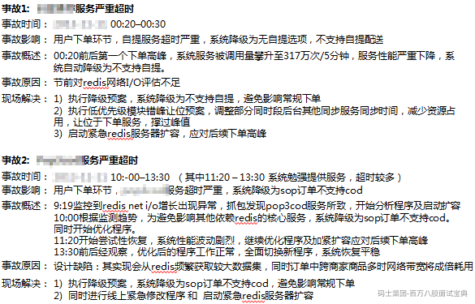

核心系统进行全面设计评审、代码审查，消除隐患。

1. 设计及代码评审时不能凭经验想当然，如对网络数据包大小等内容，一定要结合业务通过实 测的方式估算，必须要进行边界限制

2. 模块设计、部署方案需要根据业务及系统负载重新规划部署，避免交叉影响

3. 系统压测要进行极端条件测试，对系统抗压能力用数据说话

4. 面对突发状况，能根据具体业务单元负载情况，支持细粒度隔离降级，动态控制调节流量

5. 获取兄弟系统及平台架构部支持，共同打造支持快速隔离、弹性扩容集群|

总结： 第一条的关键是频次对系统的影响，实现同样的功能，减少交互次数，降低性能开销； 初次设计更直接的方式是逐条进行，这种情况下，养成对实现进行重构的习惯。

**2. 禁止3B：Big Transaction，Big SQL， Big Batch**

**2.1. Big Transaction**

注意点：

6. 对数据库操作必须使用事务，不能使用自动提交，尽量使用声明式事务；

7. 让事务尽可能的小,在Service层组装数据，在manager层处理事务；

8. 不要在事务里调用服务（服务可能阻塞）；

9. 不要在事务里调用Redis；

10. 在事务中批量更新要排序，确保多事务并发时，避免资源锁等待。

单表（记录顺序）： A，B，C

C，B，A 多表（表顺序） A→B

B→A

**详解：** 无论是Oracle、SqlServer还是Mysql，大事务是一定要避免的，大事务容易造成锁资源的长时间 占用，从而降低并发性能，增大死锁概率。如下是几种大事务的典型场景：

1- @Transactional打在Class上，这样类中的所有方法均在事务边界内，容易造成大事务，

@Transactional应该控制更精细一些，打到方法级；

2- 在一个事务中要更新多张表，在更新每一张表之前都要处理一堆业务逻辑（查询、运算、调用 服务等等），正确的做法应该是将查询、运算和服务调用逻辑提到事务外，事务边界内尽可能只处 理表更新操作；

**2.2. Big SQL**

SQL使用：

1. 尽量不用表关联，如果使用表关联，不要超过3个表join；

2. 热点数据尽量使用Redis；（比如基础资料）

3. 尽量不用子查询，不用Exist，不在条件列上使用函数；

**2.3. Big Batch**

大批量的查询输出很容易将内存打爆，报表或者打印要分批处理。

**3. 禁止全表扫描SQL和select \*，update所 有列**

**3.1. 全表扫描**

什么是全表扫描？ 在数据库中，对无索引表查询或有索引但SQL不能有效利用进行查询的过程称为全表扫描。 全表扫描会搜寻数据库表中的每一条记录，直到所有符合给定条件的记录返回。

**3.2. select \***

查询需要的字段； 当需要查询全部字段时，写出全部字段名；

**3.3. update所有列**

1-不能写通用的update SQL，按业务更新；

2-按物理主键或业务主键进行update操作；

**4. 禁止Worker扫描业务表**

worker框架只限定：Tbschedule, xxl-job等其他分布式任务调度； Quartz调度在新系统中不再使用；

**4.1. 带来的问题**

1-增加对业务表的访问压力；

2-如果涉及更新，影响并发性能；

**4.2. 正确的做法**

1-建立独立的任务表；

2-数据量大：基于时间做分区索引；

3-处理完成的任务可以删除或转历史,保证任务表数据量比较少

import java.util.HashMap;

import java.util.HashSet; import java.util.Map; import java.util.Set;

/\*\*

\* @author sunzhiqiang23

\* @title: TaskHashUtil

\* @projectName okr\_performance

\* @description: 定时任务hashCode工具

\* @date 2020/8/19 14:36

\*/

public class TaskHashUtil {

/\*\*

\* 任务执行hash位数：31

\*/

private static final int TASK\_HASH\_BIT = 0x1f;

/\*\*

\* 生成任务记录的hashCode

\* @return 返回0-31之间的int

\*/

public static int generateHashCode() { int i = (int) System.nanoTime(); return i & TASK\_HASH\_BIT;

}

/\*\*

\* 根据集群分片信息获取hashCode

\* @param serverCount 分片数

\* @param curServer 当前分片

\* @return

\*/

public static Integer[] getHashCodeBySharding(Integer serverCount, Integer curServer) { Map<Integer, Set<Integer>> shardingMap = new HashMap<>();

//生成一个大小等于分片数的map

//每个map元素的value中包含不重复的0-31的随机数

//所有map元素的value覆盖0-31的每个数

for (int i = 0; i < 32; i++) {

int key = i % serverCount;

if (!shardingMap.containsKey(key)) { Set<Integer> v = new HashSet<>(); v.add(i);

shardingMap.put(key, v);

} else {

shardingMap.get(key).add(i);

}

}

Integer[] arr = new Integer[] {};

return shardingMap.get(curServer).toArray(arr);

}

public static void main(String[] args){

getHashCodeBySharding(6, 1);

}

}

**4.3. 举例**

比如单据审核后，推送财务为例： 错误的做法是用worker扫描单据表，往财务推送数据 正确的做法是单据审核时，在任务表增加一个往财务推送数据的任务，任务可以包含数据，也可以 只存相关ID，worker扫描这个任务表，给财务推送数据，推送完成可以删除任务也可以把任务转 历史。

**4.4. 数据转历史**

不建议使用worker进行数据转历史，因为这样会出现worker扫业务表，同时删除生产数据性能不 好。

建议的做法：把表设计为热，凉，冷三个级别，以CRM的事件表为例 在生产系统中设计为两个表： 热表：只存未关闭的事件，可以做表分区，分区字段根据业务定； 凉表：存已关闭的事件，用时间做表分区； 事件关闭时，把事件从热表转到凉表。 凉表的数据转历史采用分区置换的方式，从而避免使用worker转历史。

**5. 禁止没有边界限制的创建大量对象、Net**

**IO**

**5.1. 创建大量对象**

在大循环中创建大对象，很容易耗尽Java堆内存，根据内存状况设定一个安全阀值，有效控制其 无限增长。

几种情况： 持续向容器对象中插入对象，不做clear； 创建数据连接，网络连接不释放； 资源不释放；

COE： 异常数据引起创建大量实例 程序bug引起创建大量实例 案例1：

CRM调用服务超时，服务没有释放文件句柄，导致内存溢出。

**案例2：（死循环）** xx服务平台JVM进程Crash问题 问题描述：xx服务平台部署了4台应用服务器，2013年10月30日，上午出现其中2台应用服务器的 JVM进程Crash，下午又出现4台服务器的JVM进程几乎同时Crash，查看tomcat日志无任何异常 或错误信息，只是日志突然中断，从监控看进程消失前包括cpu、memory、load、thread、tcp 等状态一切正常，看不出任何征兆。

问题原因：通过Core dump文件定位发现在进程消失前报了signal 11错误，初步断定和死循环相 关，后来从代码中发现在特殊的数据条件下存在一个死循环。 总结：递归要慎用，在正常条件下不会死循环，但在极端环境下就可能出现死循环。

**5.2. Net IO**

Net IO往往容易被我们忽略，在服务调用、存取缓存等场景下 ，都需要充分预估Net IO并设定安 全阀值，比如服务调用的返回值大小阀值，返回记录数量阀值等，读取缓存的频率要尽可能控制在 最小次数，每次读取的Value的大小安全阀值等等。

**6. 禁止输入参数不做校验及服务直接抛出异 常**

**6.1. 参数校验**

案例：

2012/8/5: POP系统Worker向青龙运单系统推送订单号和包裹数量，推送一条脏数据（订单号：

282297153，包裹数量：282297153），造成运单系统要生成2亿8千万以上包裹对象，从而导致 Tomcat内存溢出，无法提供服务；POP系统Worker调用失败后，会重复推送数据（没有次数限 制），导致负载均衡下其它运单Tomcat相继在调用下内存溢出，从而整个系统故障。 这个案例本身涉及多个方面：

1-错误的调用；

2-参数未做校验；

3-创建对象未做限制，导致内存溢出；

**6.2. 服务异常**

异常处理是系统内的一种错误处理机制，一般不用于跨系统调用； 通过定义错误码方式是处理跨系统错误的正确方式； 返回错误码，更便于调用方根据不同的返回值进行不同的处理，抛出异常的方式实际上是将底层的 实现细节暴露给调用方。

**7. 禁止服务及UI按钮不做防重入**

**7.1. 服务防重**

MQ消息重复： 在服务端防止重复数据被多次被插入到数据库。 常用的办法：

**7.2. UI防重入**

在用户操作完成后，应当将界面变为不可操作状态（比如：按钮不可点击等，不再相应enter事件 等等）。

**8. 禁止一次性查询或导出全部数据，禁止单 次操作数据超过5000条**

1-分页SQL来处理，异步方式，控制导出权限；

2-设定fetchsize的方式；

3-禁止从生产主库导出；

MYSQL中，fetchsize启用的前提条件： 1.MySQL版本在5.0以上，MySQL的JDBC驱动更新到最 新版本(至少5.0以上) 2.Statement一定是\* **TYPE\_FORWARD\_ONLY\*** 的，并发级别是 CONCUR\_READ\_ONLY(即创建Statement的默认参数) 3.以下两句语句选一即可： 1). statement.setFetchSize(Integer.MIN\_VALUE); 2). ((com.mysql.jdbc.Statement)stat).enableStreamingResults();

mysql JDBC连接参数： "useCursorFetch=true&defaultFetchSize=2000"

**9. 禁止线上服务不接入方法性能监控和存活 监控**

**9.1. 服务监控设计**

线上的服务一律要接监控方法性能监控和存活监控，存活监控包括端口存活监控和URL存活监控。 服务监控从三个层面出发考虑：

系统外部接口：系统对外提供的接口或服务。 系统交互：系统依赖的外部接口，各个子API及调用关系， 系统中的任何场景。 系统自身：各个子的进程，系统内各个模块的API及调用关系，系统依赖的第三方组件。

**10. 禁止服务产生底层依赖上层，强依赖**

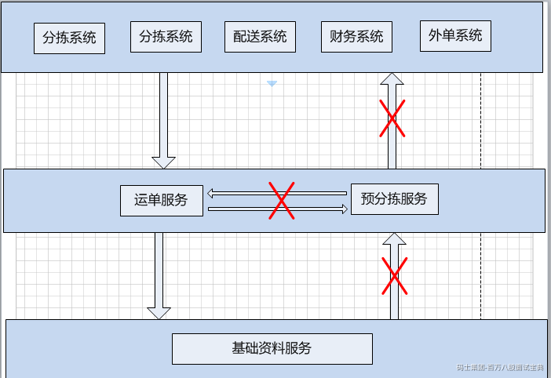

**弱、循环依赖**

**10.1. 依赖设计**

1-上层可以直接调用底层；

2-底层需要用到上层的数据，通过可以异步方式（如MQ），不要直接取调用上层服务；

3-平台级服务不要去调用弱的客户端服务，反之可以；

4-依赖关系要清晰，避免产生循环依赖。 平行系统之间的强依赖问题：

1-降级；

2-通过第三方系统解耦； 案例：
