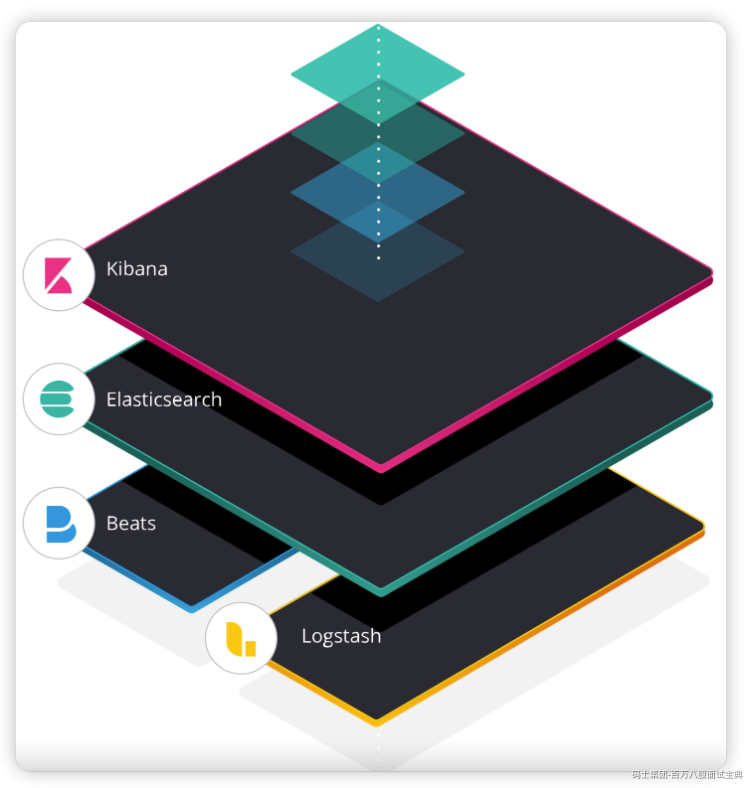
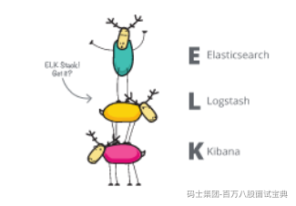
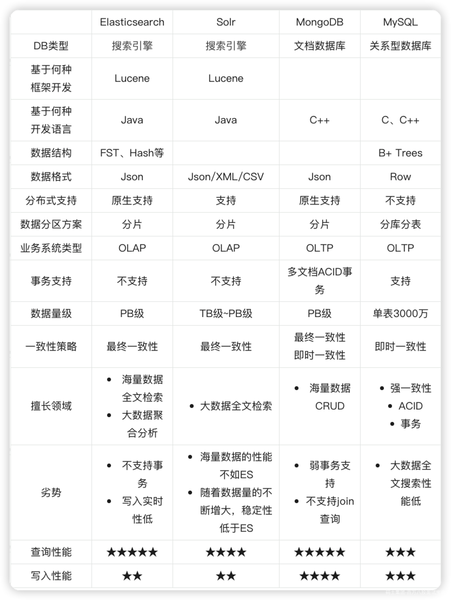
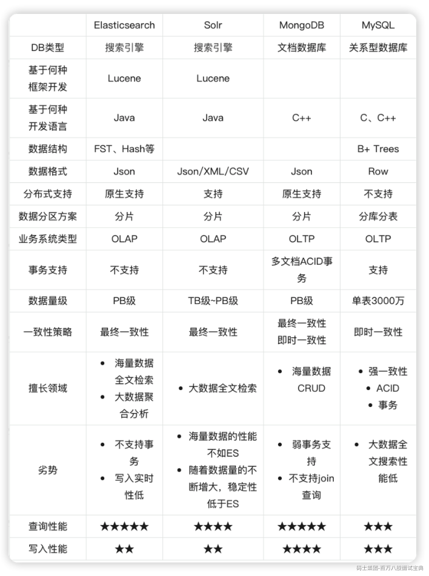
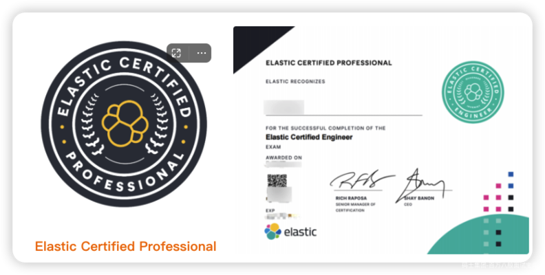
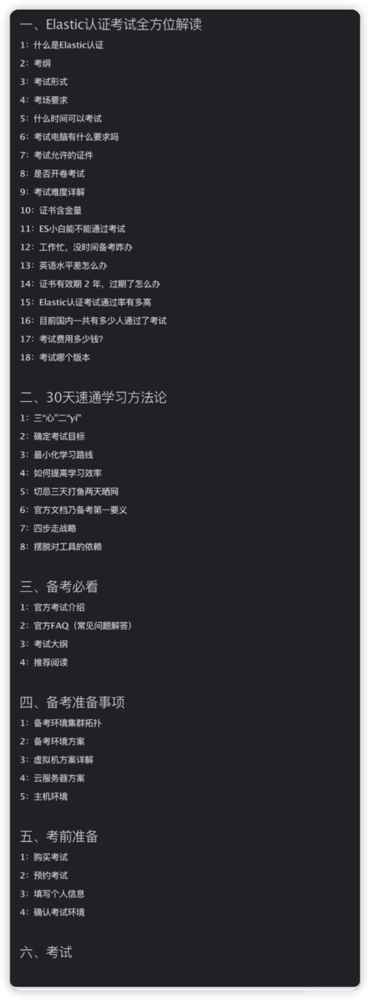

# 1、课程介绍

## 1.1 ES 8.x 演化进程

|  |  |  |  |
| --- | --- | --- | --- |
| **版本号** | **发布日期** | **多少个次要版本迭代** | **历时** |
| 8.0 | 2022年2月11日 | ？ | 至今 |
| 7.0 | 2019年4月11日 | 17个次要版本 | 34个月 |
| 6.0 | 2017年11月15日 | 8个次要版本 | 17个月 |
| 5.0 | 2016年10月27日 | 6个次要版本 | 13个月 |

## 1.2 我应该如何选择版本学习

- 学新不学旧

## 1.3 学习方法论

- 上手阶段建议使用图形化界面学习

- 初学者建议把书籍作为辅助工具而不是首选

- 合理利用好官方文档以及学习笔记

- 练大于看

- 主动学习

- 选择合适的倍率观看视频

# 2、Elasticsearch 是什么

## 2.1 概念

### 2.1.1 标准定义

Elasticsearch（以下简称 ES）是一个天生支持分布式的搜索、聚合分析和存储引擎。

### 2.1.2 其他形式

ES 是一个基于 Java 语言开发的，基于 Lucene 的开源分布式搜索引擎。

## 2.2 Elastic Stack

Elasticsearch 同时也是 Elastic 技术体系（Elastic Stack）中最核心的成员。

Elastic Stack 技术栈除了 ES 之外，还囊括了：

- Kibana：提供了功能强大的图形化工具。

- Logstash：动态数据收集管道

- Beats：轻量化数据采集器

**ELK 到底是什么呢？**

“ELK”是三个开源项目的首字母缩写，这三个项目分别是：Elasticsearch、Logstash 和 Kibana。Elasticsearch 是一个搜索和分析引擎。Logstash 是服务器端数据处理管道，能够同时从多个来源采集数据，转换数据，然后将数据发送到诸如 Elasticsearch 等“存储库”中。Kibana 则可以让用户在 Elasticsearch 中使用图形和图表对数据进行可视化。

Elastic Stack 是 ELK Stack 的更新换代产品。

### 2.2.1 一切都起源于 Elasticsearch

| ES 这个开源的分布式搜索引擎基于 JSON 开发而来，具有 RESTful 风格。它使用简单，可缩放规模，十分灵活，因此受到用户的热烈好评，而且如大家所知，围绕这一产品还形成了一家专门致力于搜索的公司。 |   
 |  
| ------------------------------------------------------------------------------------------------------------------------------------------------------------------------------------------ | ------------------------------------------------------------------------------------------------------------------------------------------------------------------------------------------------------------------------------------------- |

### 2.2.2 引入 Logstash 和 Kibana

|  |  |
| --- | --- |
|  | Elasticsearch 的核心是搜索引擎，所以用户开始将其用于日志用例，并希望能够轻松地对日志进行采集和可视化。有鉴于此，我们引入了强大的采集管道 Logstash 和灵活的可视化工具 Kibana。 |

### 2.2.3 然后向 ELK 中加入了 Beats

| “我只想对某个文件进行 tail 操作，”用户表示。我们用心倾听。在 2015 年，我们向 ELK Stack 中加入了一系列轻量型的单一功能数据采集器，并把它们叫做 Beats。 |   
 |  
| ------------------------------------------------------------------------------------------------------------------------------------------------------- | ------------------------------------------------------------------------------------------------------------------------------------ |

### 2.2.4 老外也有“起名困难症”

| 

| ELK 这个名称又要变了，的确如此。把它叫做 BELK？BLEK？ELKB？当时的确有过继续沿用首字母缩写的想法。然而，对于扩展速度如此之快的堆栈而言，一直采用首字母缩写的确不是长久之计。 |  
| ------------------------------------------------------------------------------------------------------------------------------------ | --------------------------------------------------------------------------------------------------------------------------------------------------------------------------- |

### 2.2.5 就这样，Elastic Stack 这个名字应运而生了

| 和用户一直以来熟知并喜爱的开源产品一模一样，只是集成程度更高了，功能更加强大了，入门也更加容易了，而且可以带来无限可能。 | 

| Elastic Stack 就是 ELK Stack，但是更加灵活，可以帮助人们出色完成各项事务。 |  
| ------------------------------------------------------------------------------------------------------------------------ | ------------------------------------------------------------------------------------------------------------------------------------ | -------------------------------------------------------------------------- |

# 3、ES 用来解决什么问题

## 3.1 ES 的核心价值

Elasticsearch 是解决海量数据全文检索的不二之选！

## 3.2 以下场景 ES 并非首选

- 管理数据

- 事务场景

- 大单页查询

- 数据实时写入或更新

## 3.3 选型

# 4、哪些场景应该使用 ES

## 4.1 为何要学习ES

| 

| Shay Banon said：Search is something that any application should have |  
| ------------------------------------------------------------------------------------------------------------------------------------ | --------------------------------------------------------------------- |

## 4.2 应用场景广泛

众所周知！几乎没有一款软件是没有搜索功能的。而毫不客气的说，只要是用到搜索的场景，ES 几乎都可以说是最好的选择。

|  |  |
| --- | --- |
| 搜索引擎各大电商平台导航、打车、外卖软件音视频软件GithubELK日志系统站内搜索等 |  |

# 5、特点

- 基于 Java 语言开发

- 基于 Lucene 框架

- 仅支持 Json 的数据格式

- 原生支持分布式

- 支持 PB 级数据量

- 跨语言

- 高性能、高可用、易扩展

- 开箱即用、上手简单

- 潜力巨大、可开发性强

- 开源、免费

# 6、Elastic 认证考试

**百度搜索**：Elastic认证工程师、Elastic认证考试、Elastic 认证

## 6.1 Elastic 认证考试介绍

**推荐阅读**：[认知篇：Elastic认证工程师，完全解读](https://es-cn.blog.csdn.net/article/details/119851046)

## 6.2 Elastic 认证考试大纲

**推荐阅读**：[Elastic认证考试大纲：全方位分析（难度、考试频率、得分指数、综合分析等）](https://es-cn.blog.csdn.net/article/details/124004686)

**官方考纲**：<https://www.elastic.co/cn/training/elastic-certified-engineer-exam>

## 6.3 Elastic 认证证书价值

- 能力的提升

- 自身实力证明

- 一定程度弥补学历和大龄的劣势

- 更多面试机会

- 核心竞争力

- 纪念意义

## 6.4 《30 天速通 Elastic 认证考试》

### 6.4.1 课程大纲

### 6.4.2 课程地址

### 6.4.3 课程资料
