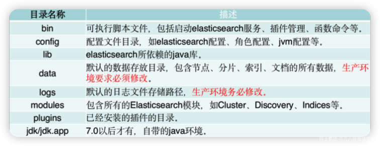
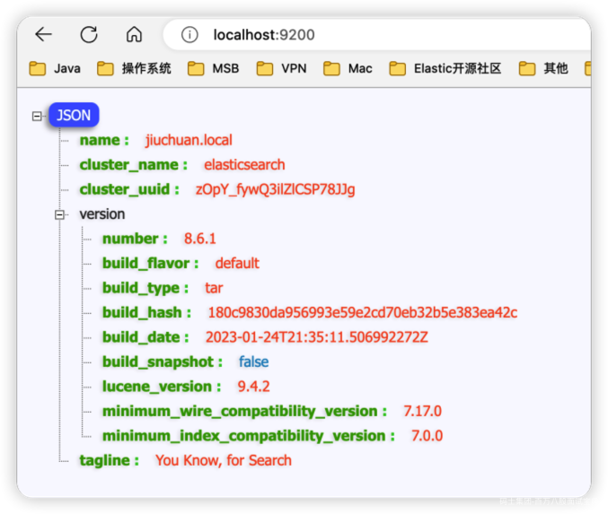

# 1、安装 Java 环境

## 1.1 Java 版本选择


Java 9、Java 10、Java 12 和 Java 13 均为短期版本。不建议使用。有关 JVM 支持，参考 Oracle 的时间表，网址为：<http://www.oracle.com/technetwork/java/eol-135779.html>

Elastic 支持部分 OpenJDK 派生的分发版：

1. 由 IcedTea 项目构建；

2. 操作系统供应商在“产品和操作系统”矩阵中生产并通过 TCK 测试的产品；

3. Azul Zulu 从 Elasticsearch 6.6.0 版开始。

## 1.2 Java 下载安装

传送门：[**JDK 安装，附各个版本JDK下载链接**](https://es-cn.blog.csdn.net/article/details/126861940)

## 1.3 Java 版本冲突问题

配置 ES\_JAVA\_HOME

```plain
echo 'export ES_JAVA_HOME=/Library/Java/JavaVirtualMachines/jdk-19.jdk/Contents/Home'>>~/.bash_profile
source ~/.bash_profile
```

# 2、下载和安装 ES

## 2.1 下载地址

传送门：[Past Release](https://www.elastic.co/cn/downloads/past-releases#elasticsearch)

## 2.2 文件目录



# 3、启动服务

## 3.1 启动方式

- **Windows**：双击 bin 目录下的 elasticsearch.bat 文件

- **Mac**：双击 bin 目录下的 elasticsearch



ES 8.x 以后版本默认启动 `Security`

# 4、生产模式和开发模式

## 4.1 生产模式和开发模式

- **生产模式**：生产模式是指 Elasticsearch 集群用于生产环境的运行模式。在这种模式下，集群需要在生产环境中部署，以便能够处理来自用户的真实请求。生产模式下需要考虑诸如高可用性、故障转移、性能优化和安全等因素。

- **开发模式**：开发模式是指 Elasticsearch 集群用于开发和测试环境的运行模式。在这种模式下，集群可以在本地开发机器上运行，以便开发人员可以测试和调试代码。开发模式下不需要考虑高可用性和性能优化等因素，但需要确保数据安全，避免意外删除或修改数据。

在实践中，为了确保生产集群的稳定性和安全性，通常需要在开发模式下进行开发和测试，并在生产环境之前进行充分测试和验证。

**总结：**

生产模式用于生产环境，因此务必要进行严格的引导检查（即：启动项检查），以保证服务后期的扩展性和高可用性等。而开发模式则更强调降低 ES 的学习和使用成本，因此应尽量避免引导检查等门槛操作。

## 4.2 引导检查

在 Elasticsearch（ES）中，启动项检查是在启动 Elasticsearch 进程时进行的一系列检查，以确保集群可以正常启动和运行。这些检查包括以下几个方面：

1. 配置文件检查：Elasticsearch 使用 YAML 格式的配置文件来配置集群的各种设置，包括节点名称、网络设置、存储路径等。在启动 Elasticsearch 进程时，会检查配置文件的语法和内容是否正确，包括检查配置项是否存在、是否具有有效的值、是否遵循正确的格式等。

2. 内存限制检查：Elasticsearch 在运行时需要占用一定的内存资源，包括堆内存和操作系统的虚拟内存。启动 Elasticsearch 进程时，会检查操作系统的虚拟内存限制是否足够，并根据配置文件中的设置来分配堆内存大小，以避免出现内存不足的情况。

3. 网络设置检查：Elasticsearch 集群中的节点之间通过网络进行通信，启动 Elasticsearch 进程时，会检查网络设置是否正确配置，包括检查节点名称是否唯一、通信端口是否可用、网络接口是否正确配置等。

4. 存储路径检查：Elasticsearch 会将索引和数据存储在磁盘上，启动 Elasticsearch 进程时，会检查配置文件中指定的存储路径是否存在、是否有足够的权限，以确保索引和数据能够正常存储和访问。

5. 插件检查：Elasticsearch 支持插件来扩展其功能，启动 Elasticsearch 进程时，会检查配置文件中指定的插件是否存在、是否与当前版本兼容，以确保插件能够正确加载和运行。

如果启动项检查中存在任何错误或异常，Elasticsearch 可能会拒绝启动或显示错误信息，需要根据错误信息进行相应的修复或调整，以确保集群可以正常启动和运行。

## 4.3 单节点发现

单节点发现是 ES 为降低 ES 的使用门槛而提供的一种启动方式，在单节点发现模式下，节点将选举自己为主节点，并且不允许其他任何节点加入，也不会加入其他任何集群。

配置单节点发现的方式如下：

```plain
discovery.type: single-node
```

# 5、单节点集群

## 5.1 关闭 Security

```plain
xpack.security.enabled: false
```

## 5.2 配置项

- cluster.name: 集群名称，默认为 elasticsearch，是确定集群的依据

- node.name: 节点名称，默认为主机名，同一个集群之间不能重复

- http.port: 服务端口号，默认 9200，多节点依次递增，是访问服务的端口

- transport.port: 节点之间的通信端口，默认 9300，多节点之间依次递增。

## 5.3 服务启动

### 5.3.1 Windows

直接双击启动 bin\elasticsearch.bat 文件即可，或者在 Winodws PowerShell 下执行：

```plain
bin % .\elasticsearch.bat
```

### 5.3.2 Mac 环境

直接双击启动 bin/elasticsearch 文件即可，或者在终端下执行：

```plain
bin % ./elasticsearch
```

## 5.4 验证服务状态

浏览器访问：<http://localhost:9200/>

# 6、多节点集群

## 6.1 自动发现策略

在ES中，自动发现策略是指如何自动检测和识别新的节点加入或节点离开集群的过程，以确保集群的可靠性和稳定性。

ES使用多播（multicast）和单播（unicast）两种方式进行节点的发现。

- 多播：多播是一种在局域网中广播消息的方式，ES可以通过多播协议向局域网内的其他节点发送广播消息，以检测新节点的加入或节点离开。新节点可以通过监听特定的多播地址和端口来加入集群，从而实现自动发现。但是，多播可能受到网络环境的限制，如防火墙配置和路由器设置，可能会导致多播消息无法传递，从而影响自动发现的可靠性。

- 单播：单播是一种点对点的通信方式，ES可以通过在配置文件中指定预定义的节点列表，定期向这些节点发送单播请求来进行节点的自动发现。这样，新节点可以直接通过与预定义节点的单播通信来加入集群。单播方式相对于多播方式更加灵活，不受网络环境的限制，但需要手动配置节点列表，管理起来可能会更加繁琐。

需要注意的是，自动发现策略在ES的配置中可以进行灵活的设置，可以根据具体的需求和网络环境选择合适的方式。另外，ES还支持使用插件或第三方工具进行自动发现，例如使用ZooKeeper、Consul等外部服务进行节点的自动发现。

## 6.2 本地多项目集群

### 6.2.1 启动方式

|  |  |
| --- | --- |
| **操作系统** | **脚本** |
| MacOS | open /node1/bin/elasticsearch open /node2/bin/elasticsearch open /node3/bin/elasticsearch |
| windows | start D:\node1\bin\elasticsearch.bat start D:\node2\bin\elasticsearch.bat start D:\node3\bin\elasticsearch.bat |

亦可手动挨个启动节点

### 6.2.2 优缺点

- **优点**：一劳永逸，不需要每次执行很多命令

- **缺点**：浪费大量磁盘空间

## 6.3 本地单项目集群

### 6.3.1 启动方式

|  |  |
| --- | --- |
| **操作系统** | **命令** |
| Mac | ./elasticsearch -Epath.data=data1 -Epath.logs=log1 -Enode.name=node1 -Ecluster.name=elastic ./elasticsearch -Epath.data=data2 -Epath.logs=log2 -Enode.name=node2 -Ecluster.name=elastic |
| Windows | .\elasticsearch.bat -Epath.data=data1 -Epath.logs=log1 -Enode.name=node1 -Ecluster.name=elastic .\elasticsearch.bat -Epath.data=data2 -Epath.logs=log2 -Enode.name=node1 -Ecluster.name=elastic |

### 6.3.2 优缺点

- 优点：节省磁盘空间

- 缺点：启动麻烦，容易出错，除了节省磁盘空间，没有其他意义。

# 7、安装和部署 Kibana

下载地址：

- 选择版本：<https://www.elastic.co/cn/downloads/past-releases#kibana>

- 最新版本：<https://www.elastic.co/cn/downloads/kibana>

|  |  |  |
| --- | --- | --- |
|  | Windows | **MacOS** |
| **命令行** | .\kibana\bin\kibana.bat | ./kibana/bin/kibana |
| **图形界面** | 双击kibana.bat | 双击kibana |
| **Shell** | start kibana\bin\kibana.bat | open kibana/bin/kibana |

# 8、常用的客户端工具

## 8.1 PostMan

下载：<https://www.postman.com/>

## 8.2 ApiPost

下载：<https://www.apipost.cn/>

## 8.3 Head

Chrome 地址：[传送门](https://chrome.google.com/webstore/detail/multi-elasticsearch-head/cpmmilfkofbeimbmgiclohpodggeheim)

## 8.4 ElasticVUE

Chrome 地址：[传送门](https://chrome.google.com/webstore/detail/elasticvue/hkedbapjpblbodpgbajblpnlpenaebaa)

Edge 地址：[传送门](https://microsoftedge.microsoft.com/addons/search/elasticvue?hl=zh-CN)
