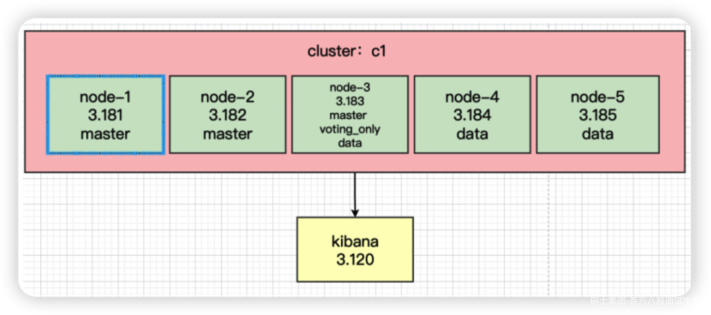

# 1、构建虚拟机环境

## 1.1 下载地址

- Windows & Linux：[WMware Workstation 16 Pro](https://www.vmware.com/cn/products/workstation-pro/workstation-pro-evaluation.html)

- MacOS：[WMware Fusion](https://www.vmware.com/cn/products/fusion.html)

## 1.2 安装

略...

# 2、构建 CentOS 镜像

## 2.1 下载系统镜像

下载地址：<https://centos.org/download/>

选择符合符合你电脑的指令集版本，比如我的CPU是 x86\_64架构

## 2.2 配置环境

### 2.2.1 网络环境

```plain
vi /etc/sysconfig/network-scripts/ifcfg-ens33
```

内容配置为以下信息，ip 地址根据你本地环境而定

```plain
TYPE="Ethernet"
PROXY_METHOD="none"
BROWSER_ONLY="no"
BOOTPROTO="none" #关闭DHCP
DEFROUTE="yes"
IPV4_FAILURE_FATAL="no"
IPV6INIT="yes"
IPV6_AUTOCONF="yes"
IPV6_DEFROUTE="yes"
IPV6_FAILURE_FATAL="no"
IPV6_ADDR_GEN_MODE="stable-privacy"
NAME="ens33"
UUID="6dcded77-ba54-4f70-a16c-80535656ba86"
DEVICE="ens33"
ONBOOT="yes"
IPADDR="192.168.3.81" #修改每个节点的ip地址
PREFIX="24"
GATEWAY="192.168.3.1"
DNS1="114.114.114.114"
DOMAIN="8.8.8.8"
IPV6_PRIVACY="no"
```

重启网络服务，使用SSH客户端创建连接

```plain
service network restart
```

### 2.2.2 安装必要的工具软件

比如：vim、wget 等，视个人情况选择安装

### 2.2.3 配置基础运行环境

- 配置 java 环境，[兼容性列表](https://blog.csdn.net/wlei0618/article/details/124930218?ops_request_misc=%7B%22request%5Fid%22%3A%22165398867416782390530796%22%2C%22scm%22%3A%2220140713.130102334.pc%5Fblog.%22%7D&request_id=165398867416782390530796&biz_id=0&utm_medium=distribute.pc_search_result.none-task-blog-2~blog~first_rank_ecpm_v1~rank_v31_ecpm-2-124930218-null-null.nonecase&utm_term=兼容性&spm=1018.2226.3001.4450)

# 3、构建 ES 运行环境

## 3.1 下载和解压

**下载 Elasticsearch：**

```plain
wget https://artifacts.elastic.co/downloads/elasticsearch/elasticsearch-8.7.0-linux-x86_64.tar.gz
```

解压

```plain
tar -xzvf elasticsearch-8.7.0-linux-x86_64.tar.gz
```

## 3.2 Elastic 账号

### 3.2.1 创建 `elastic`账号

```json
useradd elastic
```

### 3.2.2 设置 `elastic`账号的密码：

```json
passwd elastic
```

### 3.2.3 为账号赋予目录权限

```json
chown -R elastic:elastic {{espath}}
```

## 3.3 新手常见环境问题及解决方案

### 3.3.1 禁用 Swapping：

```plain
bootstrap.memory_lock: true
```

### 3.3.2 文件描述符

**问题描述**：引导检查报错：未开启内存锁

**问题解释**：Elasticsearch 使用了很多文件描述符或文件句柄。耗尽文件描述符可能是灾难性的，并且很可能会导致数据丢失。确保将运行 Elasticsearch 的用户的打开文件描述符数量限制增加到 65,536 或更高。

**解决办法**：

```shell
vim /etc/security/limits.conf
# 添加以下内容
* soft nofile 65536
* hard nofile 65536
* soft nproc 32000
* hard nproc 32000
* hard memlock unlimited
* soft memlock unlimited

vim /etc/systemd/system.conf ，分别修改以下内容。
DefaultLimitNOFILE=65536
DefaultLimitNPROC=32000
DefaultLimitMEMLOCK=infinity

ulimit -n 65535(需使用root账号)
```

### 3.3.3 虚拟内存

**问题描述**：引导检查报错 max virtual memory areas vm.max\_map\_count [65530] likely too low, increase to at least [262144]

**问题解释**：5.0版本以后ES使用mmapfs作为默认的文件系统存储类型。可以通过配置index.store.type来设置ES默认的文件系统存储类型。ES mmapfs默认使用一个目录来存储它的索引。操作系统对 mmap 计数的默认限制可能太低，这可能会导致内存不足异常.

**解决办法**：

修改文件系统

```plain
Niofs(非阻塞文件系统)	mmapfs(内存映射文件系统)
配置:index.store.type: niofs
```

使用 root 运行以下命令：

```plain
sysctl -w vm.max_map_count=262144
```

永久生效：

```plain
vi /etc/sysctl.conf
vm.max_map_count=262144

grep vm.max_map_count /etc/sysctl.conf
```

### 3.3.4 线程数

**问题描述**：max number of threads [1024] for user [elasticsearch] is too low, increase to at least [2048]

**问题解释**：ES 使用多个线程池来进行不同类型的操作。重要的是它能够在需要时创建新线程。确保 Elasticsearch 用户可以创建的线程数至少为 4096。

**解决办法**

```plain
在启动es服务之前使用root账户执行
ulimit -u 4096
```

或

```plain
vim /etc/security/limits.conf
设置nproc为4096
```

或

```plain
vim /etc/security/limits.d/90-nproc.conf 
修改如下内容（注意星号）：
* soft nproc 1024  =>  * soft nproc 4096
```

### 3.3.5 IPv4 forwarding

**问题描述**：WARNING: IPv4 forwarding is disabled. Networking will not work.

**问题解释**：翻译即可

**解决办法**：

```plain
vi /etc/sysctl.conf
net.ipv4.ip_forward=1
restart network && systemctl restart docker
sysctl net.ipv4.ip_forward
```

### 3.3.6 内存不足

**问题描述**：error='Cannot allocate memory'

**问题解释**：ES 5.x+堆内存大小默认配置为 2G ES 7.x+默认4G

**解决办法**：

```plain
//JVM一般为物理内存一半
-e "ES_JAVA_OPTS=-Xms512m -Xmx512m"
```

# 4、集群配置

## 4.1 自动发现

ES 是自动发现的，即零配置，开箱即用，无需任何网络配置，Elasticsearch 将绑定到可用的环回地址并扫描本地端口 9300 到 9305 连接同一服务器上运行的其他节点，自动形成集群。此行为无需进行任何配置即可提供自动集群服务。

## 4.2 集群的核心配置

- cluster.name：集群名称，节点根据集群名称确定是否是同一个集群。

- node.name：节点名称，集群内唯一。

- node.roles：[ data, master, voting\_only ]，`node.roles`配置项如果没有显式的配置，那么当前节点拥有所有角色（master、data、ingest、ml、remote\_cluster\_client、transform）。如果你放开了注释，或者手动显式添加了 `node.roles`配置项，那么当前节点仅拥有此配置项的中括号中显式配置的角色，没有配置的角色将被阉割。因此如果在不熟悉角色配置的情况下，不要轻易修改角色配置值， **切勿画蛇添足** **。**

- network.host： 节点对外提供服务的地址以及集群内通信的ip地址

- bootstrap.memory\_lock: Swapping 对性能和节点稳定性非常不利，应该不惜一切代价避免。它可能导致GC持续**几分钟**而不是几毫秒，并且可能导致节点响应缓慢甚至与集群断开连接。在弹性分布式系统中，使用Swap还不如让操作系统杀死节点效果更好。可以通过设置 `bootstrap.memory_lock: true` 以防止任何 Elasticsearch 堆内存被换出。

- http.port：对外提供服务的端口号，默认是 9200

- transport.port：9300——集群之间通信的端口，若不指定默认：9300

- discovery.seed\_hosts: 集群初始化的种子节点，可配置部分或全部候选节点，大型集群可通过嗅探器发现剩余节点，考试环境配置全部节点即可

- cluster.initial\_master\_nodes：节点初始 `active master`节点, 必须是有 master 角色的节点，即必须是候选节点，但并不是必须配置所有候选节点。生产模式下启动新集群时，必须明确列出应在第一次选举中计算其选票的候选节点。第一次成功形成集群后，`cluster.initial_master_nodes`从每个节点的配置中删除设置。重新启动集群或向现有集群添加新节点时，请勿使用此设置。

# 5、节点角色

**推荐阅读：**[**ES节点角色深层解读，及高可用集群架构角色设计**](https://www.elastic.org.cn/archives/roles)

## 5.1 主节点（active master）

一般口语上所属的“主节点”或者“master节点”指的是 active master 节点，而非具备 master 角色的节点

- 避免重负载

- 一般来说，如果小型或轻负载集群的主节点具有其他角色和职责，则其可能运行良好，但是一旦您的集群包含多个节点，使用专用的主节点通常是有意义的。

- 任何不是 `voting-only` 的 `master-eligible`节点都可以被选举为 `active master`。

- 高可用性 (HA) 集群需要至少三个候选节点，其中至少两个不是仅投票节点。这样即使其中一个节点发生故障，也可以保证剩下的节点能够选举出一个主节点。

## 5.2 master 候选节点/投票节点

通常也叫 master-eligible 节点，被称之为：具有候选资格的节点。

默认情况下，master-eligible节点是那些在集群状态发布期间参与选举并执行某些任务的节点，配置了master角色的节点都是有效的投票节点，可以参与选举也可以投票

任何不是[仅投票](https://www.elastic.co/guide/en/elasticsearch/reference/7.13/modules-node.html#voting-only-node)节点的主合格节点都可以通过[主选举过程选举](https://www.elastic.co/guide/en/elasticsearch/reference/7.13/modules-discovery.html)成为主节点。

**配置主节点（有选举和被选举权）：**

```plain
node.roles: [ master,xx,xx,xx ]
```

**配置专用主节点（dedicated master-eligible node）：**

```plain
node.roles: [ master ]
```

**配置仅投票节点（只有选举权，没有被选举权，这样的节点可以同时充当数据节点避免资源浪费）：**

```plain
node.roles: [ data, master, voting_only ]
```

## 5.3 data：数据节点

数据节点保存包含已编入索引的文档的分片。数据节点处理数据相关操作，如 CRUD、搜索和聚合。这些操作是 I/O 密集型、内存密集型和 CPU 密集型的。监控这些资源并在它们过载时添加更多数据节点非常重要。

**配置数据节点：**

```plain
node.roles: [ data, xxx ]
```

## 5.4 ingest：预处理节点

预处理节点有点类似于logstash的消息管道，所以也叫ingest pipeline，常用语一些数据写入之前的预处理操作，比如去除空格、split等操作，常和update\_by\_query、reindex等一起考

## 5.5 remote\_cluster\_client：

以下操作所需节点必须具有该角色：

- 跨集群搜索

- 跨集群复制

- 通过公网IP地址访问节点

具有 `remote_cluster_client`角色的节点，使其有资格充当远程客户端

# 6、高可用集群

## 6.1 基本架构



## 6.2 节点配置

```plain
cluster.name: c1
node.name: node-1
node.roles: [master]
path.data: /path/to/data
path.logs: /path/to/logs
bootstrap.memory_lock: true
network.host: 192.168.3.181
http.port: 9200
transport.port: 9300
discovery.seed_hosts: ["192.168.3.181:9300", "192.168.3.182:9300","192.168.3.183:9300", "192.168.3.184:9300","192.168.3.185:9300"]
cluster.initial_master_nodes: ["node-1"]
cluster.name: c1
node.name: node-2
node.roles: [master]
path.data: /path/to/data
path.logs: /path/to/logs
bootstrap.memory_lock: true
network.host: 192.168.3.181
http.port: 9200
transport.port: 9300
discovery.seed_hosts: ["192.168.3.181:9300", "192.168.3.182:9300","192.168.3.183:9300", "192.168.3.184:9300","192.168.3.185:9300"]
cluster.initial_master_nodes: ["node-1"]
cluster.name: c1
node.name: node-3
node.roles: [master,data,voting_only]
path.data: /path/to/data
path.logs: /path/to/logs
bootstrap.memory_lock: true
network.host: 192.168.3.183
http.port: 9200
transport.port: 9300
discovery.seed_hosts: ["192.168.3.181:9300", "192.168.3.182:9300","192.168.3.183:9300", "192.168.3.184:9300","192.168.3.185:9300"]
cluster.initial_master_nodes: ["node-1"]
cluster.name: c1
node.name: node-4
node.roles: [data]
path.data: /path/to/data
path.logs: /path/to/logs
bootstrap.memory_lock: true
network.host: 192.168.3.184
http.port: 9200
transport.port: 9300
discovery.seed_hosts: ["192.168.3.181:9300", "192.168.3.182:9300","192.168.3.183:9300", "192.168.3.184:9300","192.168.3.185:9300"]
cluster.initial_master_nodes: ["node-1"]
cluster.name: c1
node.name: node-5
node.roles: [data]
path.data: /path/to/data
path.logs: /path/to/logs
bootstrap.memory_lock: true
network.host: 192.168.3.185
http.port: 9200
transport.port: 9300
discovery.seed_hosts: ["192.168.3.181:9300", "192.168.3.182:9300","192.168.3.183:9300", "192.168.3.184:9300","192.168.3.185:9300"]
cluster.initial_master_nodes: ["node-1"]
```

## 6.3 部署 Kibana

###### 下载 Kibana：

```powershell
wget https://artifacts.elastic.co/downloads/kibana/kibana-8.7.1-linux-x86_64.tar.gz
```

###### 解压：

```plain
tar -xzvf kibana-8.7.1-linux-x86_64.tar.gz
```

###### 配置

```plain
server.port: 5601
server.host: "192.168.3.120"
elasticsearch.hosts: ["http://192.168.3.181:9200","http://192.168.3.192:9200"]
```
