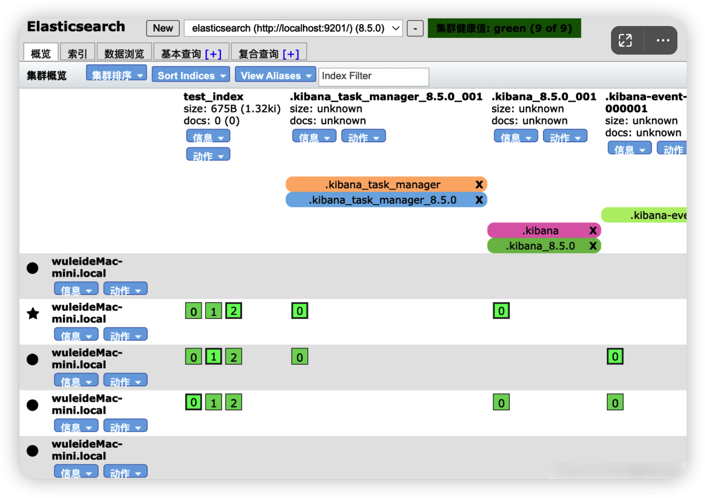
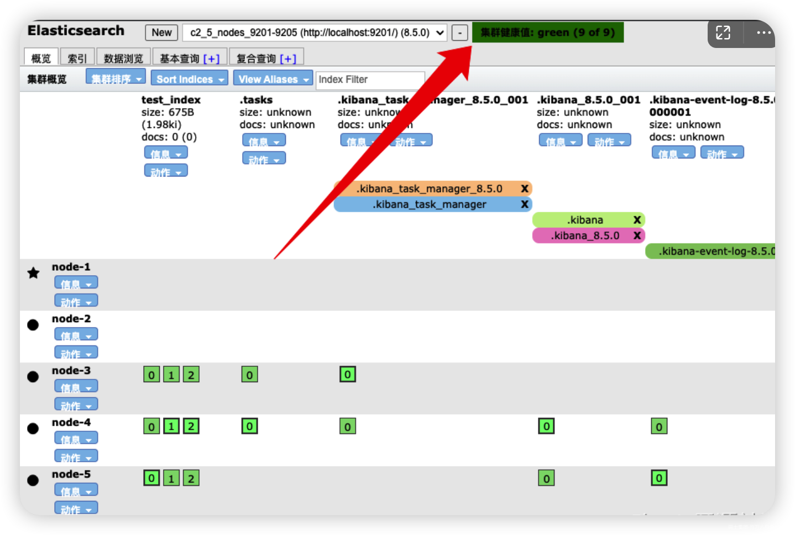
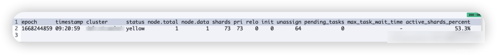
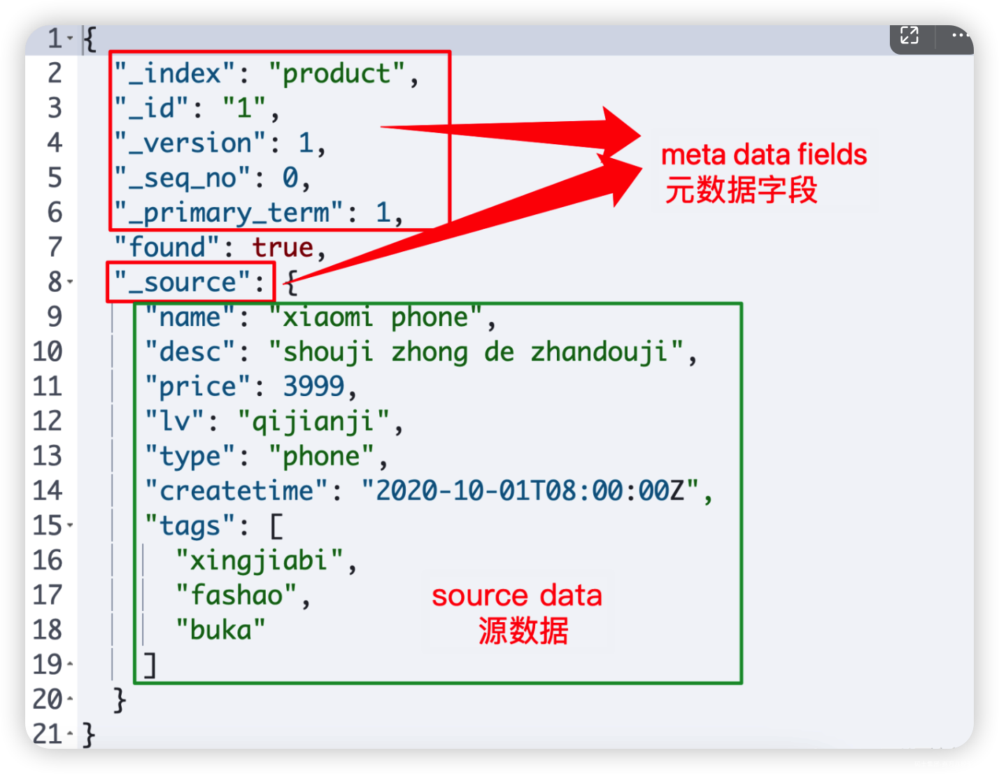

# 1、节点：Node

一个节点就是一个Elasticsearch的实例，可以理解为一个 ES 的进程。

**注意**

- 一个节点 ≠ 一台服务器

```json
GET _cat/nodes?v
```

**通过 Head 插件查看集群节点信息**



# 2、角色：Roles

## 2.1 常见的角色

- **主节点（active master）**：一般指活跃的主节点，一个集群中只能有一个，主要作用是对集群的管理。

- **候选节点（master-eligible）**：当主节点发生故障时，参与选举，也就是主节点的替代节点。

- **数据节点（data node）**：数据节点保存包含已编入索引的文档的分片。数据节点处理数据相关操作，如 CRUD、搜索和聚合。这些操作是 I/O 密集型、内存密集型和 CPU 密集型的。监控这些资源并在它们过载时添加更多数据节点非常重要。

- **预处理节点（ingest node）**：预处理节点有点类似于logstash的消息管道，所以也叫ingest pipeline，常用于一些数据写入之前的预处理操作。

## 2.2 使用和配置方法

准确的说，应该叫节点角色，是区分不同功能节点的一项服务配置，配置方法为

```json
node.roles: [ 角色1, 角色2, xxx ]
```

**注意：**

- 如果 node.roles 为缺省配置，那么当前节点具备所有角色

# 3、分片：Shard

## 3.1 分片的基本概念

如过用一句话来概括，分片可以理解为 索引 的 碎片。并且所有碎片都是可以无限复制的

## 3.2 分片的种类

- 主分片（primary shard）:

- 副本分片（replica shard）:

## 3.3 分片的作用和意义

- 高可用性：提高分布式服务的高可用性。

- 提高性能：提供系统服务的吞吐量和并发响应的能力

- 易扩展性：当集群的性能不满足业务要求时，可以方便快速的扩容集群，而无需停止服务。

## 3.4 分片的基本策略

- 一个索引包含一个或多个分片，在 7.0 之前默认五个主分片，每个主分片一个副本；在 7.0 之后默认一个主分片。副本可以在索引创建之后修改数量，但是主分片的数量一旦确定不可修改，只能创建索引

- 每个分片都是一个 Lucene 实例，有完整的创建索引和处理请求的能力

- ES 会自动再 nodes 上做分片均衡 shard reblance

- 一个doc不可能同时存在于多个主分片中，但是当每个主分片的副本数量不为一时，可以同时存在于多个副本中。

- `主分片和其副本分片`不能同时存在于同一个节点上。

- `完全相同的副本`不能同时存在于同一个节点上。

# 4、集群：Cluster

## 4.1 集群

## 4.2 集群的健康值检查

### 4.2.1 健康状态

- 绿色：所有分片都可用

- 黄色：至少有一个副本不可用，但是所有主分片都可用，此时集群能提供完整的读写服务，但是可用性较低。

- 红色：至少有一个主分片不可用，数据不完整。此时集群无法提供完整的读写服务。集群不可用。



**新手误区：对不同健康状态下的可用性描述，集群不可用指的是集群状态为红色，无法提供完整读写服务，而不代表无法通过客户端远程连接和调用服务。**

### 4.2.2 健康值检查

**方法一：\_cat API**

```json
GET _cat/health
```

返回结果如下



**方法二：\_cluster API**

```json
GET _cluster/health
```

# 5、索引和文档

## 5.1 索引

索引在 ES 中所表述的含义和 MySQL 中的索引完全不同，在 MySQL 中索引指的是加速数据查询的一种特殊的数据结构，如 normal index。

而在 ES 中，索引表述的含义等价于 MySQL 中的表（仅针对 ES 7.x 以后版本），注意这里只是类比去理解，索引并不等于表。

## 5.2 文档

在 Elasticsearch 中，文档即表示一条数据，而 es 中的文档是以 Json 的格式来存储的。


