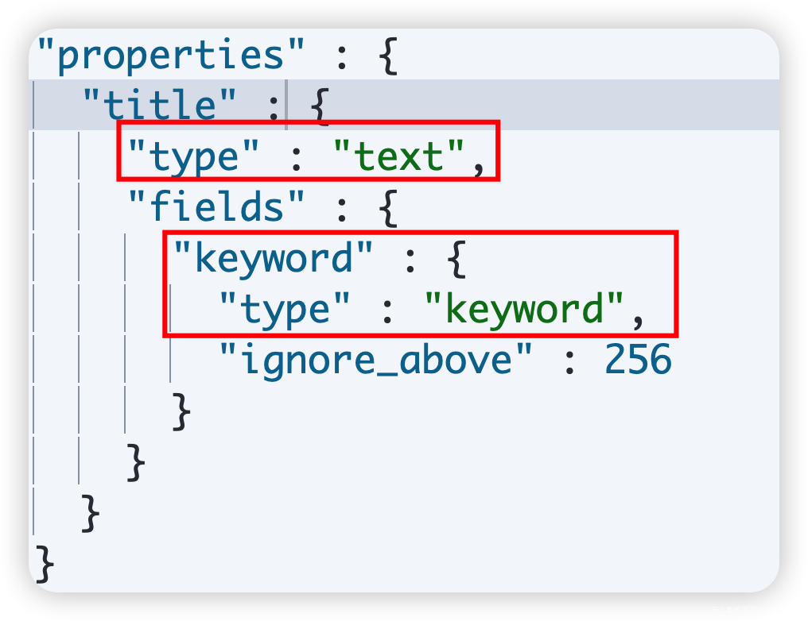

# 1.Elasticsearch 安装

## 1.1 安装Java环境

最好是java 8、java11或者java14,略。

jdk兼容性：<https://www.elastic.co/cn/support/matrix#matrix_jvm>

操作系统兼容性：<https://www.elastic.co/cn/support/matrix>

自身兼容性：<https://www.elastic.co/cn/support/matrix#matrix_compatibility>

---

> 目前使用jdk8。看官网中描述，Elasticsearch8版本往后都不支持jdk8。

---

## 1.2 安装Elasticsearch

### 1.2.1 Elasticsearch 下载

下载地址：<https://www.elastic.co/cn/downloads/elasticsearch>

---

> 我这里下载的是Linux的版本。

---

### 1.2.2 Elasticsearch 目录结构

|  |  |
| --- | --- |
| 目录名称 | 描述 |
| bin | 可执行脚本文件，包括启动elasticsearch服务、插件管理、函数命令等。 |
| config | 配置文件目录，如elasticsearch配置、角色配置、jvm配置等。 |
| lib | elasticsearch所依赖的java库。 |
| data | 默认的数据存放目录，包含节点、分片、索引、文档的所有数据，生产环境要求必须修改。 |
| logs | 默认的日志文件存储路径，生产环境务必修改。 |
| modules | 包含所有的Elasticsearch模块，如Cluster、Discovery、Indices等。 |
| plugins | 已经安装的插件的目录。 |
| jdk/jdk.app | 7.0以后才有，自带的java环境。 |

### 1.2.3 Elasticsearch单节点启动

|  |  |  |  |
| --- | --- | --- | --- |
|  | Windows | Linux | MacOS |
| 命令行 | cd elasticsearch\bin .\elasticsearch -d | cd elasticsearch/bin ./elasticsearch -d | cd elasticsearch/bin ./elasticsearch -d |
| 图形界面 | 在bin目录下双击elasticsearch.bat | — | 在bin目录下双击elasticsearch |
| Shell | start elasticsearch\bin\elasticsearch.bat | — | open elasticsearch/bin/elasticsearch |

验证服务启动成功：<http://localhost:9200>

---

> 我这里下载Elasticsearch 7.17.13 安装基于linux安装，选择一个节点搭建9台es。
>
> 1. **下载Elasticsearch 7.17.13**
>
> <https://www.elastic.co/cn/downloads/past-releases/elasticsearch-7-17-13>
>
> 1. **上传解压**
>
> 安装包上传到node5节点，解压：
>
> 1. **关闭geoip数据库更新**
>
> 需要关闭geoip数据库更新，据说是个bug，不清楚具体什么原因。在elasticsearch.yml中添加如下配置：
>
> 1. **设置其他配置**
>
> 当开启一个全新的集群时，会有一个集群的引导步骤，这步骤用来确定哪些节点参与第一次的主节点选举。在开发模式下，这个步骤由节点自动完成，这种模式本质上是不安全的，因为不是所有节点都适合做主节点，主节点关系到集群的稳定性。因此在生产模式下，集群第一次启动时，需要有一个适合作为主节点的节点列表，这个列表就是通过 `cluster.initial_master_nodes`来配置，在配置中需要写出具体的节点名称，对应 `node.name`配置项。在elasticsearch.yml中添加如下配置:
>
> 1. **设置文件句柄数**
>
> elasticsearch用户拥有的可创建文件描述的权限太低，至少需要65536,在node5节点上配置/etc/security/limits.conf文件如下内容，设置系统最大打开文件句柄数：
>
> 注意各个节点配置完成后，如果是ssh连接到各个节点需要重新打开新的ssh窗口生效或者重新启动机器生效。查看生效命令如下：
>
> 1. **调大单个进程的虚拟内存区域数量**
>
> max\_map\_count文件包含限制一个进程可以拥有的VMA(虚拟内存区域)的数量 ，es启动会检查数值是否大于200W，否则启动失败。只需要在部署es的节点上设置“sysctl -w vm.max\_map\_count=2000000”调大即可，这里在node5节点上做设置。
>
> 以上是临时设置，当节点重启后会失效，可以在/etc/sysctl.conf中加入vm.max\_map\_count=2000000做永久设置。在node5节点上配置/etc/sysctl.conf进行永久设置：
>
> 设置成功后，重启机器，可以通过cat /proc/sys/vm/max\_map\_count 命令检查此值为200W。
>
> 1. **创建用户es:es**
>
> 由于基于linux运行es不支持root用户运行，所以这里添加用户es，设置所属组为es，密码为123456
>
> 1. **启动es**
>
> 也可以在启动命令后加上-d ,后台启动:
>
> 可以通过 logs/elasticsearch.log 日志，查看启动是否成功。
>
> 1. **访问WEBUI**
>
> 

```plain
[root@node5 software]# tar -zxvf ./elasticsearch-7.17.13-linux-x86_64.tar.gz
```

```plain
[es@node5 config]$ cd /software/elasticsearch-7.17.13/config

[es@node5 config]$ vim elasticsearch.yml
ingest.geoip.downloader.enabled: false
```

```plain
#各个节点都可以访问es
network.host: 0.0.0.0

#设置初始主节点
cluster.initial_master_nodes: ["node5"]
```

```plain
# 打开limits.conf文件，vim /etc/security/limits.conf 
* soft nofile 65536
* hard nofile 65536
```

```plain
#查看可以打开最大文件描述符的数量，默认是1024
ulimit -n
```

```plain
#限制单个进程的虚拟内存区域数量(临时设置)
sysctl -w vm.max_map_count=2000000
```

```plain
#vim /etc/sysctl.conf （追加参数，永久设置）
...
vm.max_map_count=2000000
...
```

```plain
[root@node5 bin]# groupadd es

# -g 指定组 -p 密码
[root@node5 bin]# useradd es -g es -p 123456

# -R 处理指定目录以及其子目录下的所有文件
[root@node5 bin]# chown es:es -R /software/elasticsearch-7.17.13
```

```plain
#单机启动直接执行如下命令
[es@node5 ~]$ cd /software/elasticsearch-7.17.13/bin/
[es@node5 bin]$ ./elasticsearch
```

```plain
./elasticsearch -d
```

---

### 1.2.4 本机启动多个es节点

在本机单个项目启动多节点：

|  |  |
| --- | --- |
| 操作系统 | 命令 |
| Linux/MacOS | ./elasticsearch -E path.data=data1 -E path.logs=log1 -E node.name=node1 -E cluster.name=msb\_teach ./elasticsearch -E path.data=data2 -E path.logs=log2 -E node.name=node2 -E cluster.name=msb\_teach |
| Windows | .\elasticsearch.bat -E path.data=data1 -E path.logs=log1 -E node.name=node1 -E cluster.name=msb\_teach .\elasticsearch.bat -E path.data=data2 -E path.logs=log2 -E node.name=node1 -E cluster.name=msb\_teach |

在本机多个项目启动多个单节点：

|  |  |
| --- | --- |
| 操作系统 | 脚本 |
| MacOS | open /node1/bin/elasticsearch open /node2/bin/elasticsearch open /node3/bin/elasticsearch |
| windows | start D:\node1\bin\elasticsearch.bat start D:\node2\bin\elasticsearch.bat start D:\node3\bin\elasticsearch.bat |

---

> 这里我在node5节点设置3个es节点组成单节点伪分布式集群，操作如下：
>
> 1. **在node5节点上修改elasticsearch.yml文件**
>
> 1. **在node5节点 $ES\_HOME/bin中创建如下脚本**
>
> start\_es\_cluster.sh
>
> 以上多增加了node.roles 和 transport.profiles.default.port 配置项，看后面进阶课程第一节介绍了。
>
> 3.**修改脚本执行权限**
>
> 1. **启动脚本**

```plain
#节点发现需要配置一些种子节点，与7.X之前老版本：disvoery.zen.ping.unicast.hosts类似，一般配置集群中的全部节点
discovery.seed_hosts: ["192.168.179.8:9301", "192.168.179.8:9302", "192.168.179.8:9303"]

#指定集群初次选举中用到的具有主节点资格的节点，称为集群引导，只在第一次形成集群时需要。
cluster.initial_master_nodes: ["es1"]
```

```plain
./elasticsearch -E path.data=data1 -E path.logs=log1 -E node.name=es1 -E node.roles=master -E http.port=9201 -E transport.profiles.default.port=9
301 -d
./elasticsearch -E path.data=data2 -E path.logs=log2 -E node.name=es2 -E node.roles=data -E http.port=9202 -E transport.profiles.default.port=930
2 -d
./elasticsearch -E path.data=data3 -E path.logs=log3 -E node.name=es3 -E node.roles=data -E http.port=9203 -E transport.profiles.default.port=930
3 -d

```

```plain
[es@node5 bin]$ chmod +x ./start_es_cluster.sh
```

```plain
[es@node5 bin]$ ./start_es_cluster.sh 
```

---

## 1.3 Elasticsearch-Head插件安装

1. 安装依赖：(1) 下载node：

```plain
① 下载地址：https://nodejs.org/en/download
```

```plain
② 检查是否安装成功：Win+R  CMD输入“node -v”命令检查，如果输出了版本号，则node安装成功。
```

```plain
(2) 安装grunt：
```

```plain
① CMD中执行“npm install -g grunt-cli”命令等待安装完成
```

```plain
② 输入：grunt -version命令检查是否安装成功
```

1. 下载Head插件(1) 下载地址：<https://github.com/mobz/elasticsearch-head>(2) 下载完成后，解压，打开elasticsearch-head-master文件夹，  
   修改Gruntfile.js文件，添加hostname:'\*', 如图：(3) 输入 cd elasticsearch-head  
   npm install(4) 输入 npm run start 启动服务(5) 验证：<http://localhost:9100/> 安装成功(6) 如果无法发现ES节点，尝试在ES配置文件中设置允许跨域  
   http.cors.enabled: true  
   http.cors.allow-origin: "\*"

---

> 这里基于Linux node5节点进行ES Header安装，步骤如下：
>
> ### 1.3.1 **安装node js**
>
> 1. 下载 并解压node js
>
> 1. 设置node环境变量
>
> 1. 查看node 版本
>
> 以上错误原因：新版的node v18开始 都需要GLIBC\_2.27支持，目前linux系统内却没有那么高的版本。
>
> 解决方式如下：
>
> 以上继续报错：
>
> 解决方式：升级gcc与make,[新开一个窗口进行处理]
>
> 这时所有的问题都已经解决完毕，再重新执行上一步，更新glibc即可。
>
> 继续报错：
>
> 错误原因：linux节点没有安装bison
>
> 重新更新glibc：
>
> 安装glibc:
>
> 貌似最后有错误也不需要关注。
>
> 1. 配置yum
>
> 以上安装导致yum出现问题，错误如下：
>
> 修复：
>
> 1. 继续查询node版本
>
> 错误原因是缺少GLIBCXX\_3.4.20，解决方法是升级libstdc++
>
> 通过strings查看有没有GLIBCXX\_3.4.20：
>
> 只要结果中有GLIBCXX\_3.4.20 往后版本就可以。
>
> 最终执行查询node版本命令：
>
> ### 1.3.2 安装grunt
>
> es head 启动会检测该工具。这里需要linux节点科学上网。
>
> ### 1.3.3 下载Head插件
>
> Header插件下载地址：<https://github.com/mobz/elasticsearch-head，安装步骤如下：>
>
> 1. 下载完成后，上传到node5节点并解压。
>
> 1. 配置Gruntfile.js
>
> 1. 安装依赖
>
> 1. 然后配置国内镜像并安装Head插件
>
> 5.通过Header访问ES
>
> 浏览器访问：<http://node5:9100/>
>
> 
>
> 发现连接不上ES集群，在ES集群配置文件$ES\_HOME/config/elasticsearch.yml中配置如下内容：
>
> 
>
> 6.如果想要停止es header，使用下面的方式：

```plain
#访问 https://nodejs.org/en/download 下载node js
node-v18.17.1-linux-x64.tar

#解压node
[root@node5 software]# tar xf ./node-v18.17.1-linux-x64.tar.xz

```

```plain
#vim /etc/profile
export PATH=$PATH:/software/node-v18.17.1-linux-x64/bin/

#生效环境变量
[root@node5 software]# source /etc/profile

```

```plain
[root@node5 software]# node -v
node: /lib64/libm.so.6: version `GLIBC_2.27' not found (required by node)
node: /lib64/libc.so.6: version `GLIBC_2.25' not found (required by node)
node: /lib64/libc.so.6: version `GLIBC_2.28' not found (required by node)
node: /lib64/libstdc++.so.6: version `CXXABI_1.3.9' not found (required by node)
node: /lib64/libstdc++.so.6: version `GLIBCXX_3.4.20' not found (required by node)
node: /lib64/libstdc++.so.6: version `GLIBCXX_3.4.21' not found (required by node)

```

```plain
#更新glibc
[root@node5 ~]# cd /software/

[root@node5 software]# wget http://ftp.gnu.org/gnu/glibc/glibc-2.28.tar.gz
[root@node5 software]# tar xf glibc-2.28.tar.gz 
[root@node5 software]# cd glibc-2.28/ && mkdir build  && cd build
[root@node5 software]# ../configure --prefix=/usr --disable-profile --enable-add-ons --with-headers=/usr/include --with-binutils=/usr/bin
```

```plain
configure: error: 
*** These critical programs are missing or too old: make bison compiler
*** Check the INSTALL file for required versions.
```

```plain
# 升级GCC(默认为4 升级为8)
yum install -y centos-release-scl
yum install -y devtoolset-8-gcc*
mv /usr/bin/gcc /usr/bin/gcc-4.8.5
ln -s /opt/rh/devtoolset-8/root/bin/gcc /usr/bin/gcc
mv /usr/bin/g++ /usr/bin/g++-4.8.5
ln -s /opt/rh/devtoolset-8/root/bin/g++ /usr/bin/g++

# 升级 make(默认为3 升级为4)
wget http://ftp.gnu.org/gnu/make/make-4.3.tar.gz
tar -xzvf make-4.3.tar.gz && cd make-4.3/
./configure  --prefix=/usr/local/make
make && make install
cd /usr/bin/ && mv make make.bak
ln -sv /usr/local/make/bin/make /usr/bin/make
```

```plain
cd /software/glibc-2.28/build
../configure --prefix=/usr --disable-profile --enable-add-ons --with-headers=/usr/include --with-binutils=/usr/bin
```

```plain
configure: error: 
*** These critical programs are missing or too old: bison
*** Check the INSTALL file for required versions.
```

```plain
yum install -y bison
```

```plain
cd /software/glibc-2.28/build
../configure --prefix=/usr --disable-profile --enable-add-ons --with-headers=/usr/include --with-binutils=/usr/bin
```

```plain
cd /software/glibc-2.28/build
make && make install
```

```plain
[root@node5 software]# yum -y install vim
Failed to set locale, defaulting to C
error: rpmdb: BDB0113 Thread/process 82962/140200373183744 failed: BDB1507 Thread died in Berkeley DB library
error: db5 error(-30973) from dbenv->failchk: BDB0087 DB_RUNRECOVERY: Fatal error, run database recovery
error: cannot open Packages index using db5 -  (-30973)
error: cannot open Packages database in /var/lib/rpm
CRITICAL:yum.main:

Error: rpmdb open failed

```

```plain
# 运行以下命令来重新生成语言环境配置
[root@node5 ~]# localedef -c -f UTF-8 -i zh_CN zh_CN.utf-8
```

```plain
[root@node5 software]# node -v
node: /lib64/libstdc++.so.6: version `CXXABI_1.3.9' not found (required by node)
node: /lib64/libstdc++.so.6: version `GLIBCXX_3.4.20' not found (required by node)
node: /lib64/libstdc++.so.6: version `GLIBCXX_3.4.21' not found (required by node)
```

```plain
#下载新版本 GLIBCXX 并设置
[root@node5 software]# wget http://www.vuln.cn/wp-content/uploads/2019/08/libstdc.so_.6.0.26.zip

[root@node5 software]# yum -y install unzip

[root@node5 software]# unzip libstdc.so_.6.0.26.zip
[root@node5 software]# cp libstdc++.so.6.0.26 /lib64/
[root@node5 software]# cd /lib64

# 把原来的命令做备份
[root@node5 lib64]# cp libstdc++.so.6 libstdc++.so.6.bak
[root@node5 lib64]# rm -f libstdc++.so.6

# 重新链接
[root@node5 lib64]# ln -s libstdc++.so.6.0.26 libstdc++.so.6

```

```plain
[root@node5 lib64]# strings /usr/lib64/libstdc++.so.6 | grep GLIBCXX

```

```plain
[root@node5 lib64]# node -v
v18.17.1

```

```plain
[root@node5 software]# npm install -g grunt-cli
...
changed 59 packages in 2s

4 packages are looking for funding
  run `npm fund` for details

#查看版本
[root@node5 software]# grunt -version
grunt-cli v1.4.3

```

```plain
[root@node5 software]# unzip elasticsearch-head-master.zip

```

```plain
#修改Gruntfile.js文件,添加hostname:'*'
[root@node5 software]# cd elasticsearch-head-master

#vim Gruntfile.js
 connect: {
     server: {
         options: {
             hostname: '*',
             port: 9100,
             base: '.',
             keepalive: true
         }
     }
 }

```

```plain
[root@node5 elasticsearch-head-master]# yum -y install bzip2

```

```plain
#进入elasticsearch-head安装目录
[root@node5 software]# cd elasticsearch-head-master

#安装并指定国内镜像
[root@node5 elasticsearch-head-master]# npm install --registry=http://registry.npm.taobao.org

# 启动Header,但是这种方式启动关闭shell页面后就停止了
[root@node5 elasticsearch-head-master]# npm run start

#可以这种方式后台启动
[root@node5 elasticsearch-head-master]# npm run start &

```

```plain
http.cors.enabled: true
http.cors.allow-origin: "*"

```

```plain
#安装lsof
[root@node5 elasticsearch-head-master]# yum -y install lsof

#查出端口运行的进程id
[root@node5 elasticsearch-head-master]# lsof -i:9100

#结束进程
kill -9 进程id

```

---

## 1.4 集群健康值检查

(1) 健康值状态

① Green：所有Primary和Replica均为active，集群健康

② Yellow：至少一个Replica不可用，但是所有Primary均为active，数据仍然是可以保证完整性的。

③ Red：至少有一个Primary为不可用状态，数据不完整，集群不可用。

(2) 健康值检查

① \_cat/health

② \_cluster/health

## 1.5 安装Kibana

1. 下载地址<https://www.elastic.co/cn/downloads/kibana>

2. 启动服务

（从版本6.0.0开始，Kibana仅支持64位操作系统。）

|  |  |  |  |
| --- | --- | --- | --- |
|  | Windows | Linux | MacOS |
| 命令行 | cd kibana\bin .\kibana.bat | cd kibana/bin ./kibana | cd kibana/bin ./kibana |
| 图形界面 | 在bin目录下双击kibana.bat | — | 在bin目录下双击kibana |
| Shell | start kibana\bin\kibana.bat | — | open kibana/bin/kibana |

1. 验证服务启动成功：<http://localhost:5601>

2. 配置elasticsearch服务的地址


1. 命令行关闭kibana关闭窗口

关于“Kibana server is not ready yet” 问题的原因及解决办法

- Kibana和Elasticsearch的版本不兼容。解决办法：保持版本一直

- Elasticsearch的服务地址和Kibana中配置的elasticsearch.hosts不同解决办法：修改kibana.yml中的elasticsearch.hosts配置

- Elasticsearch中禁止跨域访问解决办法：在elasticsearch.yml中配置允许跨域

- 服务器中开启了防火墙解决办法：关闭防火墙或者修改服务器的安全策略

- Elasticsearch所在磁盘剩余空间不足90%解决办法：清理磁盘空间，配置监控和报警

---

> 下载Kibana需要与es版本匹配，参考：<https://www.elastic.co/cn/support/matrix#matrix_compatibility,由于es使用的是7.17.7版本，所以这里下载Kibana7.17.x版本。>
>
> 在node5节点安装Kibana，步骤如下：
>
> 1. 下载Kibana，上传并解压
>
> Kibana7.17.x版本下载地址：<https://www.elastic.co/cn/downloads/past-releases/kibana-7-17-13>
>
> 1. 配置es集群配置$KIBANA\_HOME/config/kibana.yml，配置elasticsearch服务
>
> 1. 启动Kibana
>
> 启动Kibana不能使用root用户。
>
> 4.访问Kibana
>
> <http://node5:5601/>
>
> 
>
> 当通过Kibana来查询es集群时，出现如下警告：
>
> 
>
> 原因：ElasticSearch提示是不是忘了启用开启es安全功能。个人学习ES可以不需要开启安全功能，在生产集群中建议开启安全选项。
>
> 解决:在es配置文件elasticsearch.yml中显式禁用即可取消提示。
>
> 
>
> ## 1.查看es集群健康情况
>
> ## 2. 格式化查看es集群健康情况

```plain
[root@node5 software]# tar -zxvf ./kibana-7.17.13-linux-x86_64.tar.gz 

```

```plain
#配置Kibana host
server.host: "192.168.179.8"

#配置es集群地址
elasticsearch.hosts: [http://node5:9201]

```

```plain
# -R 处理指定目录以及其子目录下的所有文件
[root@node5 software]# chown es:es -R /software/kibana-7.17.13-linux-x86_64

#切换es用户，启动Kibana
[root@node5 software]# su es
[es@node5 software]$ cd /software/kibana-7.17.13-linux-x86_64/bin/
[es@node5 bin]$ ./kibana
... ...
log   [12:39:09.459] [info][server][Kibana][http] http server running at http://192.168.179.8:5601
  log   [12:39:09.648] [info][status] Kibana is now degraded
... ...

```

```plain
#! Elasticsearch built-in security features are not enabled. Without authentication, your cluster could be accessible to anyone. See https://www.elastic.co/guide/en/elasticsearch/reference/7.17/security-minimal-setup.html to enable security.

```

```plain
xpack.security.enabled: false

```

```plain
#命令
GET _cat/health

#结果
1694494955 05:02:35 elasticsearch green 3 2 16 8 0 0 0 0 - 100.0%

#加上头部解释 ，命令
GET _cat/health?v

#结果
epoch      timestamp cluster       status node.total node.data shards pri relo init unassign pending_tasks max_task_wait_time active_shards_percent
1694495317 05:08:37  elasticsearch green           3         2     16   8    0    0        0             0                  -                100.0%

```

```plain
#命令
GET _cluster/health

#结果
{
  "cluster_name" : "elasticsearch",
  "status" : "green",
  "timed_out" : false,
  "number_of_nodes" : 3,
  "number_of_data_nodes" : 2,
  "active_primary_shards" : 8,
  "active_shards" : 16,
  "relocating_shards" : 0,
  "initializing_shards" : 0,
  "unassigned_shards" : 0,
  "delayed_unassigned_shards" : 0,
  "number_of_pending_tasks" : 0,
  "number_of_in_flight_fetch" : 0,
  "task_max_waiting_in_queue_millis" : 0,
  "active_shards_percent_as_number" : 100.0
}

```

## 1.6 ES安装IK分词器

后面会用到IK分词器，这里在es中安装下IK分词器。按照如下步骤实现即可。

1. 下载IK分词器插件

IK分词器插件下载地址：<https://github.com/medcl/elasticsearch-analysis-ik/>

下载的时候要注意版本，在该网页下方有IK匹配ES的版本。这里下载的是elasticsearch-analysis-ik-7.17.6版本。

1. 安装IK分词器插件

将下载的IK分词器插件上传到ES安装目录的plugins文件夹中，并解压，然后把elasticsearch-analysis-ik-7.17.6.zip压缩包删除，一定要删除。

```plain
#切换es用户
[root@node5 ~]# su es
[es@node5 ~]# cd /software/elasticsearch-7.17.13/plugins

#将ik分词器压缩包解压到对应的路径中
[es@node5 plugins]$ unzip ./elasticsearch-analysis-ik-7.17.6.zip  -d ./ik

#删除ik分词器压缩包
[es@node5 plugins]$ rm -rf ./elasticsearch-analysis-ik-7.17.6.zip 

```

1. 修改配置文件中es版本

```plain
[es@node5 plugins]$ cd /software/elasticsearch-7.17.13/plugins/ik

#只需要修改如下两个内容为对应es版本就可以
[es@node5 plugins]$ vim plugin-descriptor.properties
version=7.17.7
elasticsearch.version=7.17.7

```

1. 重启ES

```plain
#查看es进程id
[es@node5 plugins]$ jps
16945 Elasticsearch
17090 Elasticsearch
45070 Jps
17247 Elasticsearch

#kill 进程
[es@node5 plugins]$ kill -9 16945 17090 17247

#重启es
[es@node5 plugins]$ cd /software/elasticsearch-7.17.13/bin/
[es@node5 bin]$ ./start_es_cluster.sh 

```

# 2.ES核心概念

## 2.1 Elasticsearch

分布式的搜索、存储和分析引擎

搜索引擎类的数据库

ES的优势

应用范围广泛

## 2.2 节点

每个节点就是一个Elasticsearch的实例

一个节点≠一台服务器

## 2.3 节点角色

- master：候选节点

- data：数据节点

- data\_content：数据内容节点

- data\_hot：热节点

- data\_warm：索引不再定期更新，但仍可查询

- data\_code：冷节点，只读索引

- Ingest：预处理节点，作用类似于Logstash中的Filter

- ml：机器学习节点

- remote\_cluster\_client：候选客户端节点

- transform：转换节点

- voting\_only：仅投票节点

## 2.4 分片

- 一个索引包含一个或多个分片，在7.0之前默认五个主分片，每个主分片一个副本；在7.0之后默认一个主分片。副本可以在索引创建之后修改数量，但是主分片的数量一旦确定不可修改，只能创建索引

- 每个分片都是一个Lucene实例，有完整的创建索引和处理请求的能力

- ES会自动在nodes上做分片均衡

- 一个doc不可能同时存在于多个主分片中，但是当每个主分片的副本数量不为一时，可以同时存在于多个副本中。

- 每个主分片和其副本分片不能同时存在于同一个节点上，所以最低的可用配置是两个节点互为主备。

## 2.5 集群

原生分布式

一个节点≠一台服务器

## 2.6 集群状态

- 健康值状态Green：所有Primary和Replica均为active，集群健康Yellow：至少一个Replica不可用，但是所有Primary均为active，数据仍然是可以保证完整性的。Red：至少有一个Primary为不可用状态，数据不完整，集群不可用。

- 健康值检查\_cat/health\_cluster/health

## 2.7 索引

类型-Type: 7.x 弱化 8.x完全删除 \_doc

文档-Document

# 3. 索引的CRUD

## 3.1 创建索引

> 命令：
>
> 结果:

```plain
PUT /product

```

```plain
{
  "acknowledged" : true,
  "shards_acknowledged" : true,
  "index" : "product"
}

```

## 3.2 查询索引数据

> 命令:
>
> 结果：
>
> 还可以查询索引中对应某id数据，命令如下:

```plain
GET /product/_search

```

```plain
{
  "took" : 8, 				# 花费时间
  "timed_out" : false, 		# 是否超时
  "_shards" : {				# 分片信息
    "total" : 1,
    "successful" : 1,
    "skipped" : 0,
    "failed" : 0
  },
  "hits" : {				# 查询数据结果
    "total" : {
      "value" : 0,
      " " : "eq"
    },
    "max_score" : null,
    "hits" : [ ]
  }
}

```

```plain
GET /product/_doc/1

```

## 3.3 查询es集群所有索引信息

> 命令:
>
> 结果：

```plain
# ？v表示显示结果列头
GET _cat/indices?v

```

```plain
health status index                            uuid                   pri rep docs.count docs.deleted store.size pri.store.size
green  open   product                          GN5iVxsyTuq9IY6SPJo8jg   1   1          0            0       454b           227b
green  open   .apm-custom-link                 Jsfwz7dESjayFofMfUhXUg   1   1          0            0       454b           227b
green  open   .kibana_7.17.13_001              ckJBGULVTMyfW7xNBDXfjQ   1   1        321           14      4.8mb          2.4mb
green  open   .apm-agent-configuration         M76TpMMAQaCIGSiNoSn7Mg   1   1          0            0       454b           227b
green  open   .kibana_task_manager_7.17.13_001 UDgkX2Y1SpCe0EBLyex4gQ   1   1         17         4760      1.4mb          704kb
green  open   .tasks                           A4f9PuEqQuGYN39AvF9nUQ   1   1          2            0     15.6kb          7.8kb

```

## 3.4 删除索引

> 命令：
>
> 结果：

```plain
DELETE /product

```

```plain
{
  "acknowledged" : true
}

```

## 3.5 插入数据

> 命令:
>
> 结果：
>
> 再次查询结果：

```plain
PUT /product/_doc/1
{
  "name": "xiaomi phone",
  "desc": "shouji zhong de zhandouji",
  "price": 13999,
  "tags": [
    "xingjiabi",
    "fashao",
    "buka"
  ]
}

PUT /product/_doc/2
{
  "name": "xiaomi nfc phone",
  "desc": "zhichi quangongneng nfc,shouji zhong de jianjiji",
  "price": 4999,
  "tags": [
    "xingjiabi",
    "fashao",
    "gongjiaoka"
  ]
}

PUT /product/_doc/3
{
  "name": "nfc phone",
  "desc": "shouji zhong de hongzhaji",
  "price": 2999,
  "tags": [
    "xingjiabi",
    "fashao",
    "menjinka"
  ]
}

PUT /product/_doc/4
{
  "name": "xiaomi erji",
  "desc": "erji zhong de huangmenji",
  "price": 999,
  "tags": [
    "low",
    "bufangshui",
    "yinzhicha"
  ]
}

PUT /product/_doc/5
{
  "name": "hongmi erji",
  "desc": "erji zhong de kandeji",
  "price": 399,
  "tags": [
    "lowbee",
    "xuhangduan",
    "zhiliangx"
  ]
}

```

```plain
# PUT /product/_doc/1
{
  "_index" : "product",
  "_type" : "_doc",
  "_id" : "1",
  "_version" : 1,
  "result" : "created",
  "_shards" : {
    "total" : 2,
    "successful" : 2,
    "failed" : 0
  },
  "_seq_no" : 0,
  "_primary_term" : 1
}

# PUT /product/_doc/2
{
  "_index" : "product",
  "_type" : "_doc",
  "_id" : "2",
  "_version" : 1,
  "result" : "created",
  "_shards" : {
    "total" : 2,
    "successful" : 2,
    "failed" : 0
  },
  "_seq_no" : 1,
  "_primary_term" : 1
}

# PUT /product/_doc/3
{
  "_index" : "product",
  "_type" : "_doc",
  "_id" : "3",
  "_version" : 1,
  "result" : "created",
  "_shards" : {
    "total" : 2,
    "successful" : 2,
    "failed" : 0
  },
  "_seq_no" : 2,
  "_primary_term" : 1
}

# PUT /product/_doc/4
{
  "_index" : "product",
  "_type" : "_doc",
  "_id" : "4",
  "_version" : 1,
  "result" : "created",
  "_shards" : {
    "total" : 2,
    "successful" : 2,
    "failed" : 0
  },
  "_seq_no" : 3,
  "_primary_term" : 1
}

# PUT /product/_doc/5
{
  "_index" : "product",
  "_type" : "_doc",
  "_id" : "5",
  "_version" : 1,
  "result" : "created",
  "_shards" : {
    "total" : 2,
    "successful" : 2,
    "failed" : 0
  },
  "_seq_no" : 4,
  "_primary_term" : 1
}

```

```plain
#查询索引product
GET /product/_search

#结果
{
  "took" : 157,
  "timed_out" : false,
  "_shards" : {
    "total" : 1,
    "successful" : 1,
    "skipped" : 0,
    "failed" : 0
  },
  "hits" : {
    "total" : {
      "value" : 5,
      "relation" : "eq"
    },
    "max_score" : 1.0,
    "hits" : [
      {
        "_index" : "product",
        "_type" : "_doc",
        "_id" : "1",
        "_score" : 1.0,
        "_source" : {
          "name" : "xiaomi phone",
          "desc" : "shouji zhong de zhandouji",
          "price" : 13999,
          "tags" : [
            "xingjiabi",
            "fashao",
            "buka"
          ]
        }
      },
      {
        "_index" : "product",
        "_type" : "_doc",
        "_id" : "2",
        "_score" : 1.0,
        "_source" : {
          "name" : "xiaomi nfc phone",
          "desc" : "zhichi quangongneng nfc,shouji zhong de jianjiji",
          "price" : 4999,
          "tags" : [
            "xingjiabi",
            "fashao",
            "gongjiaoka"
          ]
        }
      },
      {
        "_index" : "product",
        "_type" : "_doc",
        "_id" : "3",
        "_score" : 1.0,
        "_source" : {
          "name" : "nfc phone",
          "desc" : "shouji zhong de hongzhaji",
          "price" : 2999,
          "tags" : [
            "xingjiabi",
            "fashao",
            "menjinka"
          ]
        }
      },
      {
        "_index" : "product",
        "_type" : "_doc",
        "_id" : "4",
        "_score" : 1.0,
        "_source" : {
          "name" : "xiaomi erji",
          "desc" : "erji zhong de huangmenji",
          "price" : 999,
          "tags" : [
            "low",
            "bufangshui",
            "yinzhicha"
          ]
        }
      },
      {
        "_index" : "product",
        "_type" : "_doc",
        "_id" : "5",
        "_score" : 1.0,
        "_source" : {
          "name" : "hongmi erji",
          "desc" : "erji zhong de kandeji",
          "price" : 399,
          "tags" : [
            "lowbee",
            "xuhangduan",
            "zhiliangx"
          ]
        }
      }
    ]
  }
}

```

## 3.6 Put修改数据

> put命令可以插入数据也可以修改数据，所以可以直接使用put命令插入修改的数据就可以。
>
> 如下，proudct索引中id为1的数据的price由13999改成23999，命令：
>
> 查询product索引中id为1的数据:
>
> 但是使用put命令修改数据时，必须指定该id所有的列，否则只会更新指定的数据列。如下:

```plain
#命令
PUT /product/_doc/1
{
  "name": "xiaomi phone",
  "desc": "shouji zhong de zhandouji",
  "price": 23999,
  "tags": [
    "xingjiabi",
    "fashao",
    "buka"
  ]
}

#结果
{
  "_index" : "product",
  "_type" : "_doc",
  "_id" : "1",
  "_version" : 2,
  "result" : "updated",
  "_shards" : {
    "total" : 2,
    "successful" : 2,
    "failed" : 0
  },
  "_seq_no" : 5,
  "_primary_term" : 1
}

```

```plain
#命令
GET /product/_doc/1

#结果
{
  "_index" : "product",
  "_type" : "_doc",
  "_id" : "1",
  "_version" : 2,
  "_seq_no" : 5,
  "_primary_term" : 1,
  "found" : true,
  "_source" : {
    "name" : "xiaomi phone",
    "desc" : "shouji zhong de zhandouji",
    "price" : 23999,
    "tags" : [
      "xingjiabi",
      "fashao",
      "buka"
    ]
  }
}

```

```plain
#put命令更新product中id为1的数据
PUT /product/_doc/1
{
  "price": 3999
}

#再次查询只会看到product中id为1数据的结果如下
GET /product/_doc/1
{
  "_index" : "product",
  "_type" : "_doc",
  "_id" : "1",
  "_version" : 3,
  "_seq_no" : 6,
  "_primary_term" : 1,
  "found" : true,
  "_source" : {
    "price" : 3999
  }
}

```

## 3.7 Post修改数据

> 如果只是想要修改索引中id的部分字段数据，可以使用POST命令。
>
> 命令：
>
> 恢复product中id为1的数据，然后执行POST命令修改price价格：

```plain
 POST /product/_update/1
 {
   "doc":{
     "price":33999
   }
 }

```

```plain
 #POST更新命令
 POST /product/_update/1
 {
   "doc":{
     "price":33999
   }
 }
 
 #结果
 {
   "_index" : "product",
   "_type" : "_doc",
   "_id" : "1",
   "_version" : 7,
   "result" : "updated",
   "_shards" : {
     "total" : 2,
     "successful" : 2,
     "failed" : 0
   },
   "_seq_no" : 10,
   "_primary_term" : 1
 }
 
 
 
 #再次查询product中id为1的结果
 GET /product/_doc/1
 {
   "_index" : "product",
   "_type" : "_doc",
   "_id" : "1",
   "_version" : 5,
   "_seq_no" : 8,
   "_primary_term" : 1,
   "found" : true,
   "_source" : {
     "name" : "xiaomi phone",
     "desc" : "shouji zhong de zhandouji",
     "price" : 33999,
     "tags" : [
       "xingjiabi",
       "fashao",
       "buka"
     ]
   }
 }
 

```

## 3.8 删除数据

> 命令：
>
> 结果：
>
> 再次查询删除的数据会找不到：

```plain
DELETE /product/_doc/1

```

```plain
{
  "_index" : "product",
  "_type" : "_doc",
  "_id" : "1",
  "_version" : 8,
  "result" : "deleted",
  "_shards" : {
    "total" : 2,
    "successful" : 2,
    "failed" : 0
  },
  "_seq_no" : 11,
  "_primary_term" : 1
}

```

```plain
#再次查询
GET /product/_doc/1

#结果找不到
{
  "_index" : "product",
  "_type" : "_doc",
  "_id" : "1",
  "found" : false
}

```

# 4. Mapping映射

## 4.1 Mapping概念

Mapping 也称之为映射，定义了 ES 的索引结构、字段类型、分词器等属性，是索引必不可少的组成部分。

ES 中的 mapping 有点类似与RDB中“表结构”的概念，在 MySQL 中，表结构里包含了字段名称，字段的类型还有索引信息等。在 Mapping 里也包含了一些属性，比如字段名称、类型、字段使用的分词器、是否评分、是否创建索引等属性，并且在ES中一个字段可以有对个类型。分词器、评分等概念在后面的课程讲解。

## 4.2 查看Mapping

查看完整 mapping

```plain
GET /index/_mappings

```

查看指定字段 mapping

```plain
GET /index/_mappings/field/<field_name>

```

> 1. 查看product索引的mappings

> 1. 查看指定字段的mapping

```plain
#语句
GET /product/_mappings

#结果
{
  "product" : {
    "mappings" : {
      "properties" : {
        "desc" : {
          "type" : "text",
          "fields" : {
            "keyword" : {
              "type" : "keyword",
              "ignore_above" : 256
            }
          }
        },
        "name" : {
          "type" : "text",
          "fields" : {
            "keyword" : {
              "type" : "keyword",
              "ignore_above" : 256
            }
          }
        },
        "price" : {
          "type" : "long"
        },
        "tags" : {
          "type" : "text",
          "fields" : {
            "keyword" : {
              "type" : "keyword",
              "ignore_above" : 256
            }
          }
        }
      }
    }
  }
}

```

```plain
#语句
GET /product/_mapping/field/price

#结果
{
  "product" : {
    "mappings" : {
      "price" : {
        "full_name" : "price",
        "mapping" : {
          "price" : {
            "type" : "long"
          }
        }
      }
    }
  }
}

```

## 4.3 Mapping 映射字段类型

映射的数据类型也就是 ES 索引支持的数据类型，其概念和 MySQL 中的字段类型相似，但是具体的类型和 MySQL 中有所区别，最主要的区别就在于 ES 中支持可分词的数据类型，如：Text 类型，可分词类型是用以支持全文检索的，这也是 ES 生态最核心的功能。

### **4.3.1 数字类型**

- long：64 位有符号整形

- integer：32 位有符号整形

- short：16 位有符号整形

- byte：8位有符号整形

- double：双精度 64位浮点类型

- float：单精度 64位浮点类型

- half\_float：半精度 64位浮点类型

- scaled\_float：缩放类型浮点数，按固定 double 比例因子缩放

- unsigned\_long：无符号 64 位整数。

### **4.3.2 基本数据类型**

- binary：Base64 字符串二进制值

- boolean：布尔类型，接收 ture 和 false 两个值

- alias：字段别名

### **4.3.3 Keywords 类型**

- keyword：适用于索引结构化的字段，可以用于过滤、排序、聚合。keyword类型的字段只能通过精确值搜索到。如 Id、姓名这类字段应使用 keyword

- constant\_keyword：始终包含相同值的关键字字段

- wildcard：可针对类似 grep 的

### **4.3.4 Dates**（时间类型）

- **date**：JSON 没有日期数据类型，因此 Elasticsearch 中的日期可以是以下三种

- 包含格式化日期的字符串，例如 "2015-01-01"、 "2015/01/01 12:10:30"

- 时间戳，表示*自"1970年 1 月 1 日"以来的毫秒*数/秒数。

- **date\_nanos**：此数据类型是对 date 类型的补充。但是有一个重要区别。date 类型存储最高精度为毫秒，而date\_nanos 类型存储日期最高精度是纳秒，但是高精度意味着可存储的日期范围小，即：从大约 1970 到 2262，因为日期仍存储为表示纳秒的长 自时代以来。

### 4.3.5 对象类型

- **object**：非基本数据类型之外，默认的 json 对象为 object 类型。

- **flattened**：单映射对象类型，其值为 json 对象。

## 4.4 两种映射类型

### 4.4.1 自动映射 Dynamic field mapping

|  |  |
| --- | --- |
| **field type** | **dynamic** |
| true/false | boolean |
| 小数 | float |
| 数字 | long |
| object | object |
| 数组 | 取决于数组中的第一个非空元素的类型 |
| 日期格式字符串 | date |
| 数字类型字符串 | float/long |
| 其他字符串 | text + keyword |

除了上述字段类型之外，其他类型都必须显示映射，也就是必须手工指定，因为其他类型ES无法自动识别。

> 自动映射类型说的是在es中直接向索引中插入数据，es可以自动推断每个字段的类型。如
>
> 如果索引中某列是数组类型，那么es会根据数组中第一个值的数据类型进行推断。且该数组中所有数据类型要求一致。
>
> 例如：

```plain
#向es 某索引写入数据，该索引可以不存在，会自动创建
PUT test_dynamic_mapping/_doc/1
{
  "name":"张三",
  "age":18
}

#查看mapping
GET test_dynamic_mapping/_mapping

#mapping结果
{
  "test_dynamic_mapping" : {
    "mappings" : {
      "properties" : {
        "age" : {
          "type" : "long"
        },
        "name" : {
          "type" : "text",
          "fields" : {
            "keyword" : {
              "type" : "keyword",
              "ignore_above" : 256
            }
          }
        }
      }
    }
  }
}

```

```plain
#向 test_dynamic_mapping 中id为1插入数据
PUT test_dynamic_mapping/_doc/1
{
    "name":"张三 李四 王五",
    "age":18,
    "sex2":true,
    "tags":[
        "tag1",
        "tag2",
        "tag3"
    ],
    "tags2":[
        1,2,3
    ]
  
}

#查询mappings
GET test_dynamic_mapping/_mapping

#结果
{
  "test_dynamic_mapping" : {
    "mappings" : {
      "properties" : {
        "age" : {
          "type" : "long"
        },
        "name" : {
          "type" : "text",
          "fields" : {
            "keyword" : {
              "type" : "keyword",
              "ignore_above" : 256
            }
          }
        },
        "sex" : {
          "type" : "text",
          "fields" : {
            "keyword" : {
              "type" : "keyword",
              "ignore_above" : 256
            }
          }
        },
        "sex2" : {
          "type" : "boolean"
        },
        "tags" : {
          "type" : "text",
          "fields" : {
            "keyword" : {
              "type" : "keyword",
              "ignore_above" : 256
            }
          }
        },
        "tags2" : {
          "type" : "long"
        }
      }
    }
  }
}

以上可见，tags推断成了text类型，tags2推断成了long类型。

```

### 4.4.2 显式映射 Expllcit field mapping

```plain
PUT /product
{
    "mappings": {
        "properties": {
            "field": {
                 "mapping_parameter": "parameter_value"
            }
        }
     }
}

```

> 生产中建议使用显式映射。
>
> 手动创建mapping时，可以先创建个索引，并获取该索引的mappings，然后该结果"比着葫芦画瓢"的方式创建。例如：

```plain
#创建一个index
PUT test_mapping/_doc/1
{
    "name":"张三 李四 王五",
    "age":18,
    "sex2":true,
    "tags":[
        "tag1",
        "tag2",
        "tag3"
    ],
    "tags2":[
        1,2,3
    ]
  
}

#获取该索引的mapping
GET test_mapping/_mapping

#结果
{
  "test_mapping" : {
    "mappings" : {
      "properties" : {
        "age" : {
          "type" : "long"
        },
        "name" : {
          "type" : "text",
          "fields" : {
            "keyword" : {
              "type" : "keyword",
              "ignore_above" : 256
            }
          }
        },
        "sex2" : {
          "type" : "boolean"
        },
        "tags" : {
          "type" : "text",
          "fields" : {
            "keyword" : {
              "type" : "keyword",
              "ignore_above" : 256
            }
          }
        },
        "tags2" : {
          "type" : "long"
        }
      }
    }
  }
}

#基于以上结果去创建index的mapping
PUT test_mapping2
{
  "mappings" : {
      "properties" : {
        "col1" : {
          "type" : "long"
        },
        "col2" : {
          "type" : "text",
          "fields" : {
            "keyword" : {
              "type" : "keyword",
              "ignore_above" : 256
            }
          }
        },
        "col3" : {
          "type" : "boolean"
        },
        "col4" : {
          "type" : "long"
        }
      }
    }
}

#查询index test_mapping2中的数据结果
GET test_mapping2/_mapping

#结果
{
  "test_mapping2" : {
    "mappings" : {
      "properties" : {
        "col1" : {
          "type" : "long"
        },
        "col2" : {
          "type" : "text",
          "fields" : {
            "keyword" : {
              "type" : "keyword",
              "ignore_above" : 256
            }
          }
        },
        "col3" : {
          "type" : "boolean"
        },
        "col4" : {
          "type" : "long"
        }
      }
    }
  }
}

```

## 4.5 映射参数

- **index**：是否对创建对当前字段创建倒排索引，默认 true，如果不创建索引，该字段不会通过索引被搜索到,但是仍然会在 source 元数据中展示

- **analyzer**：指定分析器（character filter、tokenizer、Token filters）。

- **boost**：对当前字段相关度的评分权重，默认1

- **coerce**：是否允许强制类型转换 true “1”=> 1 false “1”=< 1

- **copy\_to**：该参数允许将多个字段的值复制到组字段中，然后可以将其作为单个字段进行查询

- **doc\_values**：为了提升排序和聚合效率，默认true，如果确定不需要对字段进行排序或聚合，也不需要通过脚本访问字段值，则可以禁用doc值以节省磁盘空间（不支持text和annotated\_text）

- **dynamic**：控制是否可以动态添加新字段

- **true** 新检测到的字段将添加到映射中。（默认）

- **false** 新检测到的字段将被忽略。这些字段将不会被索引，因此将无法搜索，但仍会出现在\_source返回的匹配项中。这些字段不会添加到映射中，必须显式添加新字段。

- **strict** 如果检测到新字段，则会引发异常并拒绝文档。必须将新字段显式添加到映

- **eager\_global\_ordinals**：用于聚合的字段上，优化聚合性能，但不适用于 Frozen indices。

- **Frozen indices**（冻结索引）：有些索引使用率很高，会被保存在内存中，有些使用率特别低，宁愿在使用的时候重新创建，在使用完毕后丢弃数据，Frozen indices 的数据命中频率小，不适用于高搜索负载，数据不会被保存在内存中，堆空间占用比普通索引少得多，Frozen indices是只读的，请求可能是秒级或者分钟级。

- **enable**：是否创建倒排索引，可以对字段操作，也可以对索引操作，如果不创建索引，让然可以检索并在\_source元数据中展示，谨慎使用，该状态无法修改。

```plain
PUT my_index
{
  "mappings": {
      "enabled": false
  }
}

```

- **fielddata**：查询时内存数据结构，在首次用当前字段聚合、排序或者在脚本中使用时，需要字段为fielddata数据结构，并且创建倒排索引保存到堆中

- **fields**：给field创建多字段，用于不同目的（全文检索或者聚合分析排序）

- **format**：格式化

```plain
"date": {
   "type":  "date",
   "format": "yyyy-MM-dd"
}

```

- **ignore\_above**：超过长度将被忽略

- **ignore\_malformed**：忽略类型错误

- **index\_options**：控制将哪些信息添加到反向索引中以进行搜索和突出显示。仅用于text字段

- **Index\_phrases**：提升 exact\_value 查询速度，但是要消耗更多磁盘空间

- **Index\_prefixes**：前缀搜索

- **min\_chars**：前缀最小长度，> 0，默认 2（包含）

- **max\_chars**：前缀最大长度，< 20，默认 5（包含）

- **meta**：附加元数据

- **normalizer**：

- **norms：是否禁用评分（在 filter 和聚合字段上应该禁用）。**

- **null\_value**：为 null 值设置默认值

- **position\_increment\_gap**：参考 [match\_phrase 跨值查询中 position\_increment\_gap 参数用法](https://blog.csdn.net/wlei0618/article/details/128189190)

- **proterties**：除了mapping还可用于object的属性设置

- **search\_analyzer**：设置单独的查询时分析器：

- **similarity**：为字段设置相关度算法，支持BM25、classic（TF-IDF）、boolean

- **store**：设置字段是否仅查询

- **term\_vector**：运维参数，会在进阶课程中深入讲解

## 4.6 Text和Keyword类型

### 4.6.1 Text类型

当一个字段是要被全文搜索的，比如 Email 内容、产品描述，**这些字段应该使用 text 类型。设置 text 类型以后，字段内容会被分词**，在生成倒排索引以前，字符串会被分析器分成一个一个词项。text类型的字段不用于排序，很少用于聚合。

text类型注意事项 :

- 适用于全文检索：如 match 查询

- 文本字段会被分词

- 默认情况下，会创建倒排索引

- 自动映射器会为 Text 类型创建 Keyword 字段



> 测试如下:
>
> 1. 创建一个index :test\_text
>
> 2.查看 test\_text 索引中的字段类型
>
> 注意：name是text类型
>
> 1. 查询test\_text索引中的数据

```plain
#向index test_text中写入2条数据
PUT test_text/_doc/1
{
  "id":1,
  "name":"zhangsan is good man",
  "age":18
}

PUT test_text/_doc/2
{
  "id":2,
  "name":"lisi is a woman",
  "age":19
}

#查询test_text中的数据
GET test_text/_search

#结果
{
  "took" : 400,
  "timed_out" : false,
  "_shards" : {
    "total" : 1,
    "successful" : 1,
    "skipped" : 0,
    "failed" : 0
  },
  "hits" : {
    "total" : {
      "value" : 2,
      "relation" : "eq"
    },
    "max_score" : 1.0,
    "hits" : [
      {
        "_index" : "test_text",
        "_type" : "_doc",
        "_id" : "1",
        "_score" : 1.0,
        "_source" : {
          "id" : 1,
          "name" : "zhangsan is good man",
          "age" : 18
        }
      },
      {
        "_index" : "test_text",
        "_type" : "_doc",
        "_id" : "2",
        "_score" : 1.0,
        "_source" : {
          "id" : 2,
          "name" : "lisi is a woman",
          "age" : 19
        }
      }
    ]
  }
}

```

```plain
#命令
GET test_text/_mapping

#结果
{
  "test_text" : {
    "mappings" : {
      "properties" : {
        "age" : {
          "type" : "long"
        },
        "id" : {
          "type" : "long"
        },
        "name" : {
          "type" : "text",
          "fields" : {
            "keyword" : {
              "type" : "keyword",
              "ignore_above" : 256
            }
          }
        }
      }
    }
  }
}

```

```plain
#命令，查询了test_text中name含有zhangsan的结果，全文检索
GET test_text/_search
{
  "query": {
    "match": {
      "name": "zhangsan"
    }
  }
}

#结果
{
  "took" : 27,
  "timed_out" : false,
  "_shards" : {
    "total" : 1,
    "successful" : 1,
    "skipped" : 0,
    "failed" : 0
  },
  "hits" : {
    "total" : {
      "value" : 1,
      "relation" : "eq"
    },
    "max_score" : 0.6931471,
    "hits" : [
      {
        "_index" : "test_text",
        "_type" : "_doc",
        "_id" : "1",
        "_score" : 0.6931471,
        "_source" : {
          "id" : 1,
          "name" : "zhangsan is good man",
          "age" : 18
        }
      }
    ]
  }
}

```

### 4.6.2 Keyword类型

Keyword 类型适用于不分词的字段，如姓名、Id、数字等。如果数字类型不用于范围查找，用 Keyword 的性能要高于数值类型。

Keyword语法和语义如下: 如当使用 keyword 类型查询时，其字段值会被作为一个整体，并保留字段值的原始属性。

```plain
GET test_index/_search
{
  "query": {
    "match": {
      "title.keyword": "测试文本值"
    }
  }
}

```

Keyword注意事项

- Keyword 不会对文本分词，会保留字段的原有属性，包括大小写等。

- Keyword 仅仅是字段类型，而不会对搜索词产生任何影响

- Keyword 一般用于需要精确查找的字段，或者聚合排序字段

- Keyword 通常和 Term 搜索一起用（会在 DSL 中提到）

- Keyword 字段的 ignore\_above 参数代表其截断长度，默认 256，如果超出长度，字段值会被忽略，而不是截断。

> 测试Keyword类型
>
> 1. 创建 test\_keyword索引，并插入数据
>
> 1. 从test\_keyword索引中查询数据
>
> **注意：查询数据时match+text类型常用，全文检索；term+keyword类型常用，只能匹配全数据。**

```plain
#创建mapping，指定类型
PUT test_keyword
{
  "mappings": {
    "properties": {
      "name":{
        "type":"keyword"
      }
    }
  }
}

#查询mapping
GET test_keyword/_mapping

#mapping结果
{
  "test_keyword" : {
    "mappings" : {
      "properties" : {
        "name" : {
          "type" : "keyword"
        }
      }
    }
  }
}

 

#向index : test_keyword中插入数据
PUT test_keyword/_doc/1
{
  "name":"zhangsan is a good man"
}

```

```plain
#查询数据，只能匹配全部名称才会有结果
GET test_keyword/_search
{
  "query":{
    "term": {
      "name": "zhangsan is a good man"
    }
  }
}

```

## 4.7 映射模板

### 4.7.1 映射模板简介

之前讲过的映射类型或者字段参数，都是为确定的某个字段而声明的，如果希望对符合某类要求的特定字段制定映射，就需要用到映射模板：Dynamic templates。

映射模板有时候也被称作：自动映射模板、动态模板等。

> 映射模版可以将一些指定的字段类型映射成其他类型，例如：int映射成string，long映射成string。或者符合指定规则名称的字段映射成某种类型。

### 4.7.2 基本用法

```plain
"dynamic_templates": [
    {
      "my_template_name": { 
        ... match conditions ... 
        "mapping": { ... } 
      }
    },
    ...
]

```

conditions参数如下:

- **match\_mapping\_type** ：主要用于对数据类型的匹配。

- **match 和 unmatch**：用于对字段名称的匹配。

### 4.7.3 案例

```plain
PUT test_dynamic_template
{
  "mappings": {
    "dynamic_templates": [
      {
        "integers": {
          "match_mapping_type": "long",
          "mapping": {
            "type": "integer"
          }
        }
      },
      {
        "longs_as_strings": {
          "match_mapping_type": "string",
          "match": "num_*",
          "unmatch": "*_text",
          "mapping": {
            "type": "keyword"
          }
        }
      }
    ]
  }
}

```

以上代码会产生以下效果：

- 所有 long 类型字段会默认映射为 integer

- 所有文本字段，如果是以 num\_ 开头，并且不以 \_text 结尾，会自动映射为 keyword 类型

> 案例测试如下。
>
> 1. 创建索引，并指定mapping模版
>
> 以上模版的意思是将long类型自动映射为integer类型。字段是string类型并且名称符合num\_开头且不以\_text结尾的字段映射成keyword类型。
>
> 1. 向索引 test\_dynamic\_template中写入数据

```plain
PUT test_dynamic_template
{
  "mappings": {
    "dynamic_templates": [
      {
        "integers": {
          "match_mapping_type": "long",
          "mapping": {
            "type": "integer"
          }
        }
      },
      {
        "longs_as_strings": {
          "match_mapping_type": "string",
          "match": "num_*",
          "unmatch": "*_text",
          "mapping": {
            "type": "keyword"
          }
        }
      }
    ]
  }
}

```

```plain
#写入数据
PUT test_dynamic_template/_doc/1
{
  "col1":"aaa",
  "num_col2":"bbb",
  "num_col3_text":"ccc",
  "col4_text":"ddd"
}

#查看mapping
GET test_dynamic_template/_mapping

#结果，可见只有num_col2被映射成keyword类型。
{
  "test_dynamic_template" : {
    "mappings" : {
      "dynamic_templates" : [
        {
          "integers" : {
            "match_mapping_type" : "long",
            "mapping" : {
              "type" : "integer"
            }
          }
        },
        {
          "longs_as_strings" : {
            "match" : "num_*",
            "unmatch" : "*_text",
            "match_mapping_type" : "string",
            "mapping" : {
              "type" : "keyword"
            }
          }
        }
      ],
      "properties" : {
        "col1" : {
          "type" : "text",
          "fields" : {
            "keyword" : {
              "type" : "keyword",
              "ignore_above" : 256
            }
          }
        },
        "col4_text" : {
          "type" : "text",
          "fields" : {
            "keyword" : {
              "type" : "keyword",
              "ignore_above" : 256
            }
          }
        },
        "num_col2" : {
          "type" : "keyword"
        },
        "num_col3_text" : {
          "type" : "text",
          "fields" : {
            "keyword" : {
              "type" : "keyword",
              "ignore_above" : 256
            }
          }
        }
      }
    }
  }
}

```

# 5. 搜索和查询DSL

## 5.1 查询上下文

使用query关键字进行检索，倾向于相关度搜索，故需要计算评分。搜索是Elasticsearch最关键和重要的部分。

> 通过一个案例查询返回结果的上下文信息，也就是看看各个字段的意思。
>
> 1. 查询es所有索引
>
> 1. 查看product索引中数据

```plain
GET _cat/indices

```

```plain
#命令,以下命令等价于 GET product/_search
GET product/_search
{
  "query": {
    "match_all": {}
  }
}

#结果
{
  "took" : 63,                 // 查询所花费的时间（毫秒），本例中为 63 毫秒
  "timed_out" : false,         // 查询是否超时，本例中为 false，表示未超时
  "_shards" : {                // 关于分片的信息
    "total" : 1,               // 总共的分片数量为 1
    "successful" : 1,          // 成功的分片数量为 1
    "skipped" : 0,             // 跳过的分片数量为 0
    "failed" : 0               // 失败的分片数量为 0
  },
  "hits" : {                   // 命中的文档信息
    "total" : {                // 总命中数量信息
      "value" : 5,             // 总命中文档数量为 5
      "relation" : "eq"        // 关系为 "eq"，表示精确匹配
    },
    "max_score" : 1.0,         // 最高分数为 1.0
    "hits" : [                 // 命中的具体文档列表
      {
        "_index" : "product",   // 文档所属的索引名称为 "product"
        "_type" : "_doc",       // 文档的类型为 "_doc"
        "_id" : "1",            // 文档的唯一标识符为 "1"
        "_score" : 1.0,         // 文档的得分为 1.0
        "_source" : {           // "_source" 表示元数据，类似mysql中的字段内容
          "name" : "xiaomi phone",   // 产品名称为 "xiaomi phone"
          "desc" : "shouji zhong de zhandouji",   // 产品描述为 "手机中的战斗机"
          "price" : 23999,       // 产品价格为 23999
          "tags" : [             // 产品标签列表
            "xingjiabi",         // 标签1："xingjiabi"
            "fashao",            // 标签2："fashao"
            "buka"               // 标签3："buka"
          ]
        }
      },
      // 后续文档的信息结构与第一个文档类似，但具体内容不同，包括 "_id" 和 "_source" 内容
      // ...
    ]
  }
}

```

## 5.2 \_score相关度评分

概念：相关度评分用于对搜索结果排序，评分越高则认为其结果和搜索的预期值相关度越高，即越符合搜索预期值。在7.x之前相关度评分默认使用TF/IDF算法计算而来，7.x之后默认为BM25。在核心知识篇不必关心相关评分的具体原理，只需知晓其概念即可。

排序：相关度评分为搜索结果的排序依据，默认情况下评分越高，则结果越靠前。

## 5.3 \_source元数据

### 5.3.1 禁用\_source

好处：节省存储开销

坏处：

- 不支持update、update\_by\_query和reindex API。

- 不支持高亮。

- 不支持reindex、更改mapping分析器和版本升级。

- 通过查看索引时使用的原始文档来调试查询或聚合的功能。

- 将来有可能自动修复索引损坏。

**总结：如果只是为了节省磁盘，可以压缩索引比禁用\_source更好。**

### 5.3.2 数据源过滤器

**Including：结果中返回哪些field**

**Excluding：结果中不要返回哪些field，不返回的field不代表不能通过该字段进行检索，因为元数据不存在不代表索引不存在**

- 在mapping中定义过滤：支持通配符，但是这种方式不推荐，因为mapping不可变

```plain
PUT product
{
  "mappings": {
    "_source": {
      "includes": [
        "name",
        "price"
      ],
      "excludes": [
        "desc",
        "tags"
      ]
    }
  }
}
```

- 常用过滤规则

- "\_source": "false", \_

- \_"\_source": "obj.\*",

- "*source": [ "obj1.**\***", "obj2.**\***" ],*

- \_"\_source": {  
  "includes": [ "obj1.\*", "obj2.\*" ],  
  "excludes": [ "\*.description" ]  
  }

> ### 禁用source方式
>
> **两种方式禁用source：query查询禁用和mapping设置禁用。但是一般不会禁用source，因为禁用后查询不到任何数据或者只能查询索引部分数据，没有任何意义，主要还是使用数据过滤。**
>
> 1. **query查询时候禁用**
>
> 这种查询直接设置 \_source:false，在查询结果中就没有了source内容，看不到数据字段，没有啥意义。
>
> 1. **mapping中禁用**
>
> 在mapping中禁用语法如下：
>
> 案例：
>
> ### 查询数据时过滤字段
>
> 一般不禁用souce，而是查询的时候通过 \_source:字段 来过滤掉不使用字段，语法如下:
>
> 案例1：
>
> 案例2：

```plain
#查询语句
GET product/_search
{
  "_source": false, 
  "query": {
    "match_all": {}
  }
}

#结果
{
  "took" : 4,
  "timed_out" : false,
  "_shards" : {
    "total" : 1,
    "successful" : 1,
    "skipped" : 0,
    "failed" : 0
  },
  "hits" : {
    "total" : {
      "value" : 5,
      "relation" : "eq"
    },
    "max_score" : 1.0,
    "hits" : [
      {
        "_index" : "product",
        "_type" : "_doc",
        "_id" : "1",
        "_score" : 1.0
      },
      {
        "_index" : "product",
        "_type" : "_doc",
        "_id" : "2",
        "_score" : 1.0
      },
      {
        "_index" : "product",
        "_type" : "_doc",
        "_id" : "3",
        "_score" : 1.0
      },
      {
        "_index" : "product",
        "_type" : "_doc",
        "_id" : "4",
        "_score" : 1.0
      },
      {
        "_index" : "product",
        "_type" : "_doc",
        "_id" : "5",
        "_score" : 1.0
      }
    ]
  }
}

```

```plain
PUT product2: // HTTP PUT请求，用于创建或更新名为 "product2" 的索引。
{
  "mappings": { 
    "_source": { // 用于配置文档源字段的行为。
      "includes": ["name", "price"], // 指定包含在文档源字段中的字段列表
      "excludes": ["desc", "tags"]   // 指定排除在文档源字段中的字段列表
    }
  }
}

```

```plain
#创建索引product2的mapping
PUT product2
{
  "mappings": {
    "_source":{
      "includes":["name","price"],
      "excludes":["desc","tags"]
    }
  }
}

#向索引mapping中写入数据
PUT /product2/_doc/1
{
  "name": "hongmi erji",
  "desc": "erji zhong de kandeji",
  "price": 399,
  "tags": [
    "lowbee",
    "xuhangduan",
    "zhiliangx"
  ]
}

#查询索引product2中的数据结果
GET /product2/_search

#结果
{
  "took" : 2,
  "timed_out" : false,
  "_shards" : {
    "total" : 1,
    "successful" : 1,
    "skipped" : 0,
    "failed" : 0
  },
  "hits" : {
    "total" : {
      "value" : 1,
      "relation" : "eq"
    },
    "max_score" : 1.0,
    "hits" : [
      {
        "_index" : "product2",
        "_type" : "_doc",
        "_id" : "1",
        "_score" : 1.0,
        "_source" : {
          "price" : 399,
          "name" : "hongmi erji"
        }
      }
    ]
  }
}

通过结果可以看到includes的字段都被查询出，excludes的字段都被过滤掉

```

```plain
GET product3/_search
{
  "_source":"tags",
  "query":{
    "match_all":{}
  }
}

或者

GET product4/_search
{
  "_source": {
    "includes":[
      "obj-cols.id",
      "obj-cols.age"
      ],
      "excludes": [
        "name",
        "price"
        ]
  }
}

```

```plain
#创建索引product3并插入数据
PUT /product3/_doc/1
{
  "name": "hongmi erji",
  "desc": "erji zhong de kandeji",
  "price": 399,
  "tags": [
    "lowbee",
    "xuhangduan",
    "zhiliangx"
  ]
}

#查询通过指定source来过滤查询字段，可以看到结果中只有tags被查询出来
GET product3/_search
{
  "_source":"tags",
  "query":{
    "match_all":{}
  }
}

#结果
{
  "took" : 3,
  "timed_out" : false,
  "_shards" : {
    "total" : 1,
    "successful" : 1,
    "skipped" : 0,
    "failed" : 0
  },
  "hits" : {
    "total" : {
      "value" : 1,
      "relation" : "eq"
    },
    "max_score" : 1.0,
    "hits" : [
      {
        "_index" : "product3",
        "_type" : "_doc",
        "_id" : "1",
        "_score" : 1.0,
        "_source" : {
          "tags" : [
            "lowbee",
            "xuhangduan",
            "zhiliangx"
          ]
        }
      }
    ]
  }
}

```

```plain
#创建product4索引，并插入数据
PUT /product4/_doc/1
{
  "obj-cols":{
    "id":1,
    "age":10,
    "socre":100
  },
  "name": "hongmi erji",
  "desc": "erji zhong de kandeji",
  "price": 399,
  "tags": [
    "lowbee",
    "xuhangduan",
    "zhiliangx"
  ]
}

#查询过滤数据
GET product4/_search
{
  "_source": {
    "includes":[
      "obj-cols.id",
      "obj-cols.age"
      ],
      "excludes": [
        "name",
        "price"
        ]
  }
}

#结果
{
  "took" : 4,
  "timed_out" : false,
  "_shards" : {
    "total" : 1,
    "successful" : 1,
    "skipped" : 0,
    "failed" : 0
  },
  "hits" : {
    "total" : {
      "value" : 1,
      "relation" : "eq"
    },
    "max_score" : 1.0,
    "hits" : [
      {
        "_index" : "product4",
        "_type" : "_doc",
        "_id" : "1",
        "_score" : 1.0,
        "_source" : {
          "obj-cols" : {
            "id" : 1,
            "age" : 10
          }
        }
      }
    ]
  }
}

```

## 5.4 Query String

### 5.4.1 查询所有

GET /product/\_search

### 5.4.2 带参数

GET /product/\_search?q=name:xiaomi

> 案例测试
>
> 1. 准备数据
>
> 1. 带参数查询

```plain
DELETE product

#向product索引中插入5条数据
PUT /product/_doc/1
{
  "name": "xiaomi phone",
  "desc": "shouji zhong de zhandouji",
  "date":"2023-06-01",
  "price": 23999,
  "tags": [
    "xingjiabi",
    "fashao",
    "buka"
  ]
}

PUT /product/_doc/2
{
  "name": "xiaomi nfc phone",
  "desc": "zhichi quangongneng nfc,shouji zhong de jianjiji",
  "date":"2023-06-02",
  "price": 4999,
  "tags": [
    "xingjiabi",
    "fashao",
    "gongjiaoka"
  ]
}

PUT /product/_doc/3
{
  "name": "nfc phone",
  "desc": "shouji zhong de hongzhaji",
  "date":"2023-06-03",
  "price": 2999,
  "tags": [
    "xingjiabi",
    "fashao",
    "menjinka"
  ]
}

PUT /product/_doc/4
{
  "name": "xiaomi erji",
  "desc": "erji zhong de huangmenji",
  "date":"2023-06-04",
  "price": 999,
  "tags": [
    "low",
    "bufangshui",
    "yinzhicha"
  ]
}

PUT /product/_doc/5
{
  "name": "hongmi erji",
  "desc": "erji zhong de kandeji 2023-06-01",
  "date":"2023-06-05",
  "price": 399,
  "tags": [
    "lowbee",
    "xuhangduan",
    "zhiliangx"
  ]
}

```

```plain
#查询name中包含xiaomi的数据并且价格是4999的
GET /product/_search?q=name:xiaomi&q=price:4999

#结果
{
  "took" : 3,
  "timed_out" : false,
  "_shards" : {
    "total" : 1,
    "successful" : 1,
    "skipped" : 0,
    "failed" : 0
  },
  "hits" : {
    "total" : {
      "value" : 1,
      "relation" : "eq"
    },
    "max_score" : 1.0,
    "hits" : [
      {
        "_index" : "product",
        "_type" : "_doc",
        "_id" : "2",
        "_score" : 1.0,
        "_source" : {
          "name" : "xiaomi nfc phone",
          "desc" : "zhichi quangongneng nfc,shouji zhong de jianjiji",
          "date" : "2023-06-02",
          "price" : 4999,
          "tags" : [
            "xingjiabi",
            "fashao",
            "gongjiaoka"
          ]
        }
      }
    ]
  }
}

```

### 5.4.3 分页

GET /product/\_search?from=0&size=2&sort=price:asc

> 案例：

```plain
#按照价格升序排序，并分页
GET /product/_search?from=0&size=2&sort=price:asc

#结果
{
  "took" : 5,
  "timed_out" : false,
  "_shards" : {
    "total" : 1,
    "successful" : 1,
    "skipped" : 0,
    "failed" : 0
  },
  "hits" : {
    "total" : {
      "value" : 5,
      "relation" : "eq"
    },
    "max_score" : null,
    "hits" : [
      {
        "_index" : "product",
        "_type" : "_doc",
        "_id" : "5",
        "_score" : null,
        "_source" : {
          "name" : "hongmi erji",
          "desc" : "erji zhong de kandeji 2023-06-01",
          "date" : "2023-06-05",
          "price" : 399,
          "tags" : [
            "lowbee",
            "xuhangduan",
            "zhiliangx"
          ]
        },
        "sort" : [
          399
        ]
      },
      {
        "_index" : "product",
        "_type" : "_doc",
        "_id" : "4",
        "_score" : null,
        "_source" : {
          "name" : "xiaomi erji",
          "desc" : "erji zhong de huangmenji",
          "date" : "2023-06-04",
          "price" : 999,
          "tags" : [
            "low",
            "bufangshui",
            "yinzhicha"
          ]
        },
        "sort" : [
          999
        ]
      }
    ]
  }
}

```

### 5.4.4 精准匹配 exact value

GET /product/\_search?q=date:2023-06-01

> 案例：查询字段date数据为2023-06-01的数据

```plain
#查询
GET /product/_search?q=date:2023-06-01

#结果
{
  "took" : 5,
  "timed_out" : false,
  "_shards" : {
    "total" : 1,
    "successful" : 1,
    "skipped" : 0,
    "failed" : 0
  },
  "hits" : {
    "total" : {
      "value" : 1,
      "relation" : "eq"
    },
    "max_score" : 1.0,
    "hits" : [
      {
        "_index" : "product",
        "_type" : "_doc",
        "_id" : "1",
        "_score" : 1.0,
        "_source" : {
          "name" : "xiaomi phone",
          "desc" : "shouji zhong de zhandouji",
          "date" : "2023-06-01",
          "price" : 23999,
          "tags" : [
            "xingjiabi",
            "fashao",
            "buka"
          ]
        }
      }
    ]
  }
}

```

### 5.4.5 \_all搜索 相当于在所有有索引的字段中检索

GET /product/\_search?q=2023-06-01

```plain
DELETE product
# 验证_all搜索
PUT product
{
  "mappings": {
    "properties": {
      "desc": {
        "type": "text", 
        "index": false
      }
    }
  }
}
# 先初始化数据
POST /product/_update/5
{
  "doc": {
    "desc": "erji zhong de kendeji 2021-06-01"
  }
}

```

> 如下两种查询两者不同，q中加上data:...表示精准查询某字段数据。不加的表示从所有字段查询数据，即：\_all搜索。
>
> GET /product/\_search?q=date:2023-06-01
>
> GET /product/\_search?q=2023-06-01

```plain
#查询
GET /product/_search?q=2023-06-01

#结果
{
  "took" : 4,
  "timed_out" : false,
  "_shards" : {
    "total" : 1,
    "successful" : 1,
    "skipped" : 0,
    "failed" : 0
  },
  "hits" : {
    "total" : {
      "value" : 2,
      "relation" : "eq"
    },
    "max_score" : 3.8934655,
    "hits" : [
      {
        "_index" : "product",
        "_type" : "_doc",
        "_id" : "5",
        "_score" : 3.8934655,
        "_source" : {
          "name" : "hongmi erji",
          "desc" : "erji zhong de kandeji 2023-06-01",
          "date" : "2023-06-05",
          "price" : 399,
          "tags" : [
            "lowbee",
            "xuhangduan",
            "zhiliangx"
          ]
        }
      },
      {
        "_index" : "product",
        "_type" : "_doc",
        "_id" : "1",
        "_score" : 1.0,
        "_source" : {
          "name" : "xiaomi phone",
          "desc" : "shouji zhong de zhandouji",
          "date" : "2023-06-01",
          "price" : 23999,
          "tags" : [
            "xingjiabi",
            "fashao",
            "buka"
          ]
        }
      }
    ]
  }
}

```

## 5.5 全文检索 - Fulltext query

全文检索语法：

```plain
GET index/_search
{
  "query": {
    ... ...
  }
}

```

### 5.5.1 match

match匹配包含某个term的子句。

> product索引数据如下：
>
> match可以指定某个字段包含一个词。案例：
>
> match也可以指定某个字段包含多个词，会自动分词后在对应字段查询，只要某个字段包含该词，那么就会匹配。
>
> 案例

```plain
{
  "took" : 3,
  "timed_out" : false,
  "_shards" : {
    "total" : 1,
    "successful" : 1,
    "skipped" : 0,
    "failed" : 0
  },
  "hits" : {
    "total" : {
      "value" : 5,
      "relation" : "eq"
    },
    "max_score" : 1.0,
    "hits" : [
      {
        "_index" : "product",
        "_type" : "_doc",
        "_id" : "1",
        "_score" : 1.0,
        "_source" : {
          "name" : "xiaomi phone",
          "desc" : "shouji zhong de zhandouji",
          "date" : "2023-06-01",
          "price" : 23999,
          "tags" : [
            "xingjiabi",
            "fashao",
            "buka"
          ]
        }
      },
      {
        "_index" : "product",
        "_type" : "_doc",
        "_id" : "2",
        "_score" : 1.0,
        "_source" : {
          "name" : "xiaomi nfc phone",
          "desc" : "zhichi quangongneng nfc,shouji zhong de jianjiji",
          "date" : "2023-06-02",
          "price" : 4999,
          "tags" : [
            "xingjiabi",
            "fashao",
            "gongjiaoka"
          ]
        }
      },
      {
        "_index" : "product",
        "_type" : "_doc",
        "_id" : "3",
        "_score" : 1.0,
        "_source" : {
          "name" : "nfc phone",
          "desc" : "shouji zhong de hongzhaji",
          "date" : "2023-06-03",
          "price" : 2999,
          "tags" : [
            "xingjiabi",
            "fashao",
            "menjinka"
          ]
        }
      },
      {
        "_index" : "product",
        "_type" : "_doc",
        "_id" : "4",
        "_score" : 1.0,
        "_source" : {
          "name" : "xiaomi erji",
          "desc" : "erji zhong de huangmenji",
          "date" : "2023-06-04",
          "price" : 999,
          "tags" : [
            "low",
            "bufangshui",
            "yinzhicha"
          ]
        }
      },
      {
        "_index" : "product",
        "_type" : "_doc",
        "_id" : "5",
        "_score" : 1.0,
        "_source" : {
          "name" : "hongmi erji",
          "desc" : "erji zhong de kandeji 2023-06-01",
          "date" : "2023-06-05",
          "price" : 399,
          "tags" : [
            "lowbee",
            "xuhangduan",
            "zhiliangx"
          ]
        }
      }
    ]
  }
}

```

```plain
#match查询name字段中包含xiaomi的数据
GET /product/_search
{
  "query": {
    "match": {
      "name": "xiaomi"
    }
  }
}

#结果
{
  "took" : 3,
  "timed_out" : false,
  "_shards" : {
    "total" : 1,
    "successful" : 1,
    "skipped" : 0,
    "failed" : 0
  },
  "hits" : {
    "total" : {
      "value" : 3,
      "relation" : "eq"
    },
    "max_score" : 0.5464143,
    "hits" : [
      {
        "_index" : "product",
        "_type" : "_doc",
        "_id" : "1",
        "_score" : 0.5464143,
        "_source" : {
          "name" : "xiaomi phone",
          "desc" : "shouji zhong de zhandouji",
          "date" : "2023-06-01",
          "price" : 23999,
          "tags" : [
            "xingjiabi",
            "fashao",
            "buka"
          ]
        }
      },
      {
        "_index" : "product",
        "_type" : "_doc",
        "_id" : "4",
        "_score" : 0.5464143,
        "_source" : {
          "name" : "xiaomi erji",
          "desc" : "erji zhong de huangmenji",
          "date" : "2023-06-04",
          "price" : 999,
          "tags" : [
            "low",
            "bufangshui",
            "yinzhicha"
          ]
        }
      },
      {
        "_index" : "product",
        "_type" : "_doc",
        "_id" : "2",
        "_score" : 0.4579659,
        "_source" : {
          "name" : "xiaomi nfc phone",
          "desc" : "zhichi quangongneng nfc,shouji zhong de jianjiji",
          "date" : "2023-06-02",
          "price" : 4999,
          "tags" : [
            "xingjiabi",
            "fashao",
            "gongjiaoka"
          ]
        }
      }
    ]
  }
}

```

```plain
#查找name中包含xiaomi、nfc、phone三个词任意一个即被匹配
GET /product/_search
{
  "query": {
    "match": {
      "name": "xiaomi nfc phone"
    }
  }
}

#结果
{
  "took" : 3,
  "timed_out" : false,
  "_shards" : {
    "total" : 1,
    "successful" : 1,
    "skipped" : 0,
    "failed" : 0
  },
  "hits" : {
    "total" : {
      "value" : 5,
      "relation" : "eq"
    },
    "max_score" : 1.0,
    "hits" : [
      {
        "_index" : "product",
        "_type" : "_doc",
        "_id" : "1",
        "_score" : 1.0,
        "_source" : {
          "name" : "xiaomi phone",
          "desc" : "shouji zhong de zhandouji",
          "date" : "2023-06-01",
          "price" : 23999,
          "tags" : [
            "xingjiabi",
            "fashao",
            "buka"
          ]
        }
      },
      {
        "_index" : "product",
        "_type" : "_doc",
        "_id" : "2",
        "_score" : 1.0,
        "_source" : {
          "name" : "xiaomi nfc phone",
          "desc" : "zhichi quangongneng nfc,shouji zhong de jianjiji",
          "date" : "2023-06-02",
          "price" : 4999,
          "tags" : [
            "xingjiabi",
            "fashao",
            "gongjiaoka"
          ]
        }
      },
      {
        "_index" : "product",
        "_type" : "_doc",
        "_id" : "3",
        "_score" : 1.0,
        "_source" : {
          "name" : "nfc phone",
          "desc" : "shouji zhong de hongzhaji",
          "date" : "2023-06-03",
          "price" : 2999,
          "tags" : [
            "xingjiabi",
            "fashao",
            "menjinka"
          ]
        }
      },
      {
        "_index" : "product",
        "_type" : "_doc",
        "_id" : "4",
        "_score" : 1.0,
        "_source" : {
          "name" : "xiaomi erji",
          "desc" : "erji zhong de huangmenji",
          "date" : "2023-06-04",
          "price" : 999,
          "tags" : [
            "low",
            "bufangshui",
            "yinzhicha"
          ]
        }
      },
      {
        "_index" : "product",
        "_type" : "_doc",
        "_id" : "5",
        "_score" : 1.0,
        "_source" : {
          "name" : "hongmi erji",
          "desc" : "erji zhong de kandeji 2023-06-01",
          "date" : "2023-06-05",
          "price" : 399,
          "tags" : [
            "lowbee",
            "xuhangduan",
            "zhiliangx"
          ]
        }
      }
    ]
  }
}

```

### 5.5.2 match\_all

match\_all:匹配所有结果的子句。

> match\_all就是查询所有数据。语法如下：
>
> 以上命令等价于 GET product/\_search

```plain
GET product/_search
{
  "query": {
    "match_all": {}
  }
}

```

### 5.5.3 multi\_match

multi\_match多字段条件。

> multi\_match可以指定多个匹配字段，多个匹配字段只要包含指定的term就可以。
>
> 语法如下，表示只要name和desc字段中包含phone和huangmenji任意词的数据条目就可以被查询匹配。
>
> 案例

```plain
GET product/_search
{
  "query": {
    "multi_match": {
      "query": "phone huangmenji",
      "fields": ["name","desc"]
    }
  }
}

```

```plain
#查询
GET product/_search
{
  "query": {
    "multi_match": {
      "query": "phone huangmenji",
      "fields": ["name","desc"]
    }
  }
}

#结果
{
  "took" : 19,
  "timed_out" : false,
  "_shards" : {
    "total" : 1,
    "successful" : 1,
    "skipped" : 0,
    "failed" : 0
  },
  "hits" : {
    "total" : {
      "value" : 4,
      "relation" : "eq"
    },
    "max_score" : 1.6360576,
    "hits" : [
      {
        "_index" : "product",
        "_type" : "_doc",
        "_id" : "4",
        "_score" : 1.6360576,
        "_source" : {
          "name" : "xiaomi erji",
          "desc" : "erji zhong de huangmenji",
          "date" : "2023-06-04",
          "price" : 999,
          "tags" : [
            "low",
            "bufangshui",
            "yinzhicha"
          ]
        }
      },
      {
        "_index" : "product",
        "_type" : "_doc",
        "_id" : "1",
        "_score" : 0.5464143,
        "_source" : {
          "name" : "xiaomi phone",
          "desc" : "shouji zhong de zhandouji",
          "date" : "2023-06-01",
          "price" : 23999,
          "tags" : [
            "xingjiabi",
            "fashao",
            "buka"
          ]
        }
      },
      {
        "_index" : "product",
        "_type" : "_doc",
        "_id" : "3",
        "_score" : 0.5464143,
        "_source" : {
          "name" : "nfc phone",
          "desc" : "shouji zhong de hongzhaji",
          "date" : "2023-06-03",
          "price" : 2999,
          "tags" : [
            "xingjiabi",
            "fashao",
            "menjinka"
          ]
        }
      },
      {
        "_index" : "product",
        "_type" : "_doc",
        "_id" : "2",
        "_score" : 0.4579659,
        "_source" : {
          "name" : "xiaomi nfc phone",
          "desc" : "zhichi quangongneng nfc,shouji zhong de jianjiji",
          "date" : "2023-06-02",
          "price" : 4999,
          "tags" : [
            "xingjiabi",
            "fashao",
            "gongjiaoka"
          ]
        }
      }
    ]
  }
}

```

### 5.5.4 match\_phrase

match\_phrase短语搜索查询。

> match\_phrase使用语法如下:
>
> 以上match\_phrase表示只会在name字段中匹配包含xiaomi 和nfc term的内容，并且两者顺序不能变化。
>
> 案例：

```plain
GET product/_search
{
  "query": {
    "match_phrase": {
      "name": "xiaomi nfc"
    }
  }
}

```

```plain
#查询
GET product/_search
{
  "query": {
    "match_phrase": {
      "name": "xiaomi nfc"
    }
  }
}

#结果只有一条数据
{
  "took" : 22,
  "timed_out" : false,
  "_shards" : {
    "total" : 1,
    "successful" : 1,
    "skipped" : 0,
    "failed" : 0
  },
  "hits" : {
    "total" : {
      "value" : 1,
      "relation" : "eq"
    },
    "max_score" : 1.2360376,
    "hits" : [
      {
        "_index" : "product",
        "_type" : "_doc",
        "_id" : "2",
        "_score" : 1.2360376,
        "_source" : {
          "name" : "xiaomi nfc phone",
          "desc" : "zhichi quangongneng nfc,shouji zhong de jianjiji",
          "date" : "2023-06-02",
          "price" : 4999,
          "tags" : [
            "xingjiabi",
            "fashao",
            "gongjiaoka"
          ]
        }
      }
    ]
  }
}

#如果改变查询顺序,将没有任何结果，因为数据中name字段没有nfc在前xiaomi在后的
GET product/_search
{
  "query": {
    "match_phrase": {
      "name": "nfc xiaomi"
    }
  }
}

```

## 5.6 精准查询 Term query

### 5.6.1 term

term：匹配和搜索词项完全相等的结果

- **term和match\_phrase区别:**match\_phrase 会将检索关键词分词, match\_phrase的分词结果必须在被检索字段的分词中都包含，而且顺序必须相同，而且默认必须都是连续的**term搜索不会将搜索词分词**

- **term和keyword区别**term是对于搜索词不分词,keyword是字段类型,是对于source data中的字段值不分词

> ### 关于term搜索不会将搜索词分词的解释如下
>
> term 查询语法与match类似，如下：
>
> 特别需要注意的是，以上语法使用示例term中指定了查询name字段数据"xiaomi phone" ，表示将"xiaomi phone"看成了一个词语总体，并不是两个词，所以在查询product索引中数据时，只会找到倒排索引中有"xiaomi phone"的数据。
>
> 而在product中其中id为1的数据如下：
>
> 虽然name为"xiaomi phone"，通过term查询也不会查询出数据，原因是在es中会对id为1的数据”xiaomi phone“进行分词，xiaomi和phone作为单个词存在于倒排索引中，但是倒排索引中没有”xiaomi phone"这么一个词，所以查询不出来结果。
>
> ### 关于term和keyword的解释
>
> 在es中查询mapping，部分结果如下:
>
> 以上每个text字段都有fields属性，其中fields属性对象中还有keyword字段，keyword字段为该text字段的附属字段类型为keyword类型，“ignore\_above”表示该text字段不能超过的长度，超过这个长度，那么keyword附属字段只取到该指定长度内容就截断。
>
> text字段的附属keyword字段，类型为keyword表示当前text字段不分词被保留，匹配的时候可以直接查询不分词的内容。例如，以下查询指定了term查询，并且指定了name.keyword为“xiaomi phone",表示只要name字段中有符合”xiaomi phone“完整此条的内容就会被查询出来。

```plain
GET product/_search
{
  "query": {
    "term": {
      "name": "xiaomi phone"
    }
  }
}

```

```plain
{
  "_index" : "product",
  "_type" : "_doc",
  "_id" : "1",
  "_version" : 5,
  "_seq_no" : 20,
  "_primary_term" : 1,
  "found" : true,
  "_source" : {
    "name" : "xiaomi phone",
    "desc" : "shouji zhong de zhandouji",
    "date" : "2023-06-01",
    "price" : 23999,
    "tags" : [
      "xingjiabi",
      "fashao",
      "buka"
    ]
  }
}

```

```plain
#查询
GET /product/_mapping

#结果
"mappings" : {
      "properties" : {
        "date" : {
          "type" : "date"
        },
        "desc" : {
          "type" : "text",
          "fields" : {
            "keyword" : {
              "type" : "keyword",
              "ignore_above" : 256
            }
          }
        },
        "name" : {
          "type" : "text",
          "fields" : {
            "keyword" : {
              "type" : "keyword",
              "ignore_above" : 256
            }
          }
        },
        ... ...

```

```plain
#查询
GET product/_search
{
  "query": {
    "term": {
      "name.keyword": "xiaomi phone"
    }
  }
}

#结果
{
  "took" : 2,
  "timed_out" : false,
  "_shards" : {
    "total" : 1,
    "successful" : 1,
    "skipped" : 0,
    "failed" : 0
  },
  "hits" : {
    "total" : {
      "value" : 1,
      "relation" : "eq"
    },
    "max_score" : 1.4816045,
    "hits" : [
      {
        "_index" : "product",
        "_type" : "_doc",
        "_id" : "1",
        "_score" : 1.4816045,
        "_source" : {
          "name" : "xiaomi phone",
          "desc" : "shouji zhong de zhandouji",
          "date" : "2023-06-01",
          "price" : 23999,
          "tags" : [
            "xingjiabi",
            "fashao",
            "buka"
          ]
        }
      }
    ]
  }
}

```

### 5.6.2 terms

terms可以指定一组搜索词项列表，匹配和搜索词项列表中任意项匹配的结果。

> 执行如下terms查询，查看结果

```plain
#如下命令，查询的是desc字段中只要包含lowbee和erji两个词任意一个，都会被匹配
GET /product/_search
{
  "query": {
    "terms": {
      "desc": [
        "lowbee",
        "erji"
      ]
    }
  }
}

#结果
{
  "took" : 6,
  "timed_out" : false,
  "_shards" : {
    "total" : 1,
    "successful" : 1,
    "skipped" : 0,
    "failed" : 0
  },
  "hits" : {
    "total" : {
      "value" : 2,
      "relation" : "eq"
    },
    "max_score" : 1.0,
    "hits" : [
      {
        "_index" : "product",
        "_type" : "_doc",
        "_id" : "4",
        "_score" : 1.0,
        "_source" : {
          "name" : "xiaomi erji",
          "desc" : "erji zhong de huangmenji",
          "date" : "2023-06-04",
          "price" : 999,
          "tags" : [
            "low",
            "bufangshui",
            "yinzhicha"
          ]
        }
      },
      {
        "_index" : "product",
        "_type" : "_doc",
        "_id" : "5",
        "_score" : 1.0,
        "_source" : {
          "name" : "hongmi erji",
          "desc" : "erji zhong de kandeji 2023-06-01",
          "date" : "2023-06-05",
          "price" : 399,
          "tags" : [
            "lowbee",
            "xuhangduan",
            "zhiliangx"
          ]
        }
      }
    ]
  }
}

```

### 5.6.3 range

range是范围查找。

> range的使用方式如下：
>
> gte：大于等于，lte：小于等于 ，还有gt:大于，lt:小于
>
> 案例：
>
> range还可以作用在日期类型上，使用如下：
>
> "now-1d/d"表示当期日期减去1天，"now/d"表示当前天。还可以指定时区：

```plain
GET /product/_search
{
  "query": {
    "range": {
      "FIELD": {
        "gte": 10,
        "lte": 20
      }
    }
  }
}

```

```plain
#查询
GET /product/_search
{
  "query": {
    "range": {
      "price": {
        "gte": 900,
        "lte": 2000
      }
    }
  }
}

#结果
{
  "took" : 2,
  "timed_out" : false,
  "_shards" : {
    "total" : 1,
    "successful" : 1,
    "skipped" : 0,
    "failed" : 0
  },
  "hits" : {
    "total" : {
      "value" : 1,
      "relation" : "eq"
    },
    "max_score" : 1.0,
    "hits" : [
      {
        "_index" : "product",
        "_type" : "_doc",
        "_id" : "4",
        "_score" : 1.0,
        "_source" : {
          "name" : "xiaomi erji",
          "desc" : "erji zhong de huangmenji",
          "date" : "2023-06-04",
          "price" : 999,
          "tags" : [
            "low",
            "bufangshui",
            "yinzhicha"
          ]
        }
      }
    ]
  }
}

```

```plain
GET /product/_search
{
  "query": {
    "range": {
      "date": {
        "gte": "now-1d/d",
        "lte": "now/d"
      }
    }
  }
}

```

```plain
GET /product/_search
{
  "query": {
    "range": {
      "date": {
        "time_zone":"+08:00",
        "gte": "2023-04-15T08:00:00",
        "lte": "2023-04-16T08:00:00"
      }
    }
  }
}

```

## 5.7 Filter 过滤器

filter用来过滤数据。用法如下：

```plain
GET _search
{
  "query": {
    "constant_score": {
      "filter": {
        "term": {
          "status": "active"
        }
      }
    }
  }
}

```

query和filter的主要区别在： filter是结果导向的而query是过程导向。query倾向于“当前文档和查询的语句的相关度”而filter倾向于“当前文档和查询的条件是不是相符”。\*\*即在查询过程中，query是要对查询的每个结果计算相关性得分的，而filter不会。\*\*另外filter有相应的缓存机制，可以提高查询效率。

> ### filter可以嵌套在constant\_score和boolean查询中，参考案例。
>
> ### 测试query和filter的结果对比
>
> query查询，可以看到有score分数排名
>
> 而filter不会有score排名，只关注结果中是否包含指定的词。
>
> 以上filter是嵌套在constant\_score查询中，也可以嵌套在boolean查询中。

```plain
#query查询
GET /product/_search
{
  "query": {
    "term": {
      "name": "xiaomi"
    }
  }
}

#结果
{
  "took" : 1,
  "timed_out" : false,
  "_shards" : {
    "total" : 1,
    "successful" : 1,
    "skipped" : 0,
    "failed" : 0
  },
  "hits" : {
    "total" : {
      "value" : 3,
      "relation" : "eq"
    },
    "max_score" : 0.5464143,
    "hits" : [
      {
        "_index" : "product",
        "_type" : "_doc",
        "_id" : "1",
        "_score" : 0.5464143,
        "_source" : {
          "name" : "xiaomi phone",
          "desc" : "shouji zhong de zhandouji",
          "date" : "2023-06-01",
          "price" : 23999,
          "tags" : [
            "xingjiabi",
            "fashao",
            "buka"
          ]
        }
      },
      {
        "_index" : "product",
        "_type" : "_doc",
        "_id" : "4",
        "_score" : 0.5464143,
        "_source" : {
          "name" : "xiaomi erji",
          "desc" : "erji zhong de huangmenji",
          "date" : "2023-06-04",
          "price" : 999,
          "tags" : [
            "low",
            "bufangshui",
            "yinzhicha"
          ]
        }
      },
      {
        "_index" : "product",
        "_type" : "_doc",
        "_id" : "2",
        "_score" : 0.4579659,
        "_source" : {
          "name" : "xiaomi nfc phone",
          "desc" : "zhichi quangongneng nfc,shouji zhong de jianjiji",
          "date" : "2023-06-02",
          "price" : 4999,
          "tags" : [
            "xingjiabi",
            "fashao",
            "gongjiaoka"
          ]
        }
      }
    ]
  }
}

```

```plain
#查询
GET /product/_search
{
  "query": {
    "constant_score": { 	// 使用constant_score查询，将所有匹配的文档分配相同的分数
      "filter": {
        "term": {
          "name": "xiaomi"
        }
      },
      "boost": 1.2		 	// 设置查询的增强因子，增加匹配文档的分数
    }
  }
}

#结果中score分值都是一样的
{
  "took" : 2,
  "timed_out" : false,
  "_shards" : {
    "total" : 1,
    "successful" : 1,
    "skipped" : 0,
    "failed" : 0
  },
  "hits" : {
    "total" : {
      "value" : 3,
      "relation" : "eq"
    },
    "max_score" : 1.2,
    "hits" : [
      {
        "_index" : "product",
        "_type" : "_doc",
        "_id" : "1",
        "_score" : 1.2,
        "_source" : {
          "name" : "xiaomi phone",
          "desc" : "shouji zhong de zhandouji",
          "date" : "2023-06-01",
          "price" : 23999,
          "tags" : [
            "xingjiabi",
            "fashao",
            "buka"
          ]
        }
      },
      {
        "_index" : "product",
        "_type" : "_doc",
        "_id" : "2",
        "_score" : 1.2,
        "_source" : {
          "name" : "xiaomi nfc phone",
          "desc" : "zhichi quangongneng nfc,shouji zhong de jianjiji",
          "date" : "2023-06-02",
          "price" : 4999,
          "tags" : [
            "xingjiabi",
            "fashao",
            "gongjiaoka"
          ]
        }
      },
      {
        "_index" : "product",
        "_type" : "_doc",
        "_id" : "4",
        "_score" : 1.2,
        "_source" : {
          "name" : "xiaomi erji",
          "desc" : "erji zhong de huangmenji",
          "date" : "2023-06-04",
          "price" : 999,
          "tags" : [
            "low",
            "bufangshui",
            "yinzhicha"
          ]
        }
      }
    ]
  }
}

```

```plain
#查询
GET product/_search
{
  "query": {
    "bool": {
      "filter": [
        {
          "term": {
            "name": "xiaomi"
          }
        }
      ]
    }
  }
  
  #结果
  {
  "took" : 2,
  "timed_out" : false,
  "_shards" : {
    "total" : 1,
    "successful" : 1,
    "skipped" : 0,
    "failed" : 0
  },
  "hits" : {
    "total" : {
      "value" : 3,
      "relation" : "eq"
    },
    "max_score" : 0.0,
    "hits" : [
      {
        "_index" : "product",
        "_type" : "_doc",
        "_id" : "1",
        "_score" : 0.0,
        "_source" : {
          "name" : "xiaomi phone",
          "desc" : "shouji zhong de zhandouji",
          "date" : "2023-06-01",
          "price" : 23999,
          "tags" : [
            "xingjiabi",
            "fashao",
            "buka"
          ]
        }
      },
      {
        "_index" : "product",
        "_type" : "_doc",
        "_id" : "2",
        "_score" : 0.0,
        "_source" : {
          "name" : "xiaomi nfc phone",
          "desc" : "zhichi quangongneng nfc,shouji zhong de jianjiji",
          "date" : "2023-06-02",
          "price" : 4999,
          "tags" : [
            "xingjiabi",
            "fashao",
            "gongjiaoka"
          ]
        }
      },
      {
        "_index" : "product",
        "_type" : "_doc",
        "_id" : "4",
        "_score" : 0.0,
        "_source" : {
          "name" : "xiaomi erji",
          "desc" : "erji zhong de huangmenji",
          "date" : "2023-06-04",
          "price" : 999,
          "tags" : [
            "low",
            "bufangshui",
            "yinzhicha"
          ]
        }
      }
    ]
  }
}

```

## 5.8 组合查询 bool query

**bool**：可以组合多个查询条件，bool查询也是采用more\_matches\_is\_better的机制，因此满足must和should子句的文档将会合并起来计算分值

- **must**：必须满足子句（查询）必须出现在匹配的文档中，并将有助于得分。

- **filter**：过滤器 不计算相关度分数，cache☆子句（查询）必须出现在匹配的文档中。但是不像 must查询的分数将被忽略。Filter子句在[filter上下文](https://www.elastic.co/guide/en/elasticsearch/reference/current/query-filter-context.html)中执行，这意味着计分被忽略，并且子句被考虑用于缓存。

- **should**：可能满足 or子句（查询）应出现在匹配的文档中。

- **must\_not**：必须不满足 不计算相关度分数 not子句（查询）不得出现在匹配的文档中。子句在[过滤器上下文](https://www.elastic.co/guide/en/elasticsearch/reference/current/query-filter-context.html)中执行，这意味着计分被忽略，并且子句被视为用于缓存。由于忽略计分，因此将返回所有文档的分数。

**minimum\_should\_match**：参数指定should返回的文档必须匹配的子句的数量或百分比。如果bool查询包含至少一个 should 子句，而没有 must 或 filter 子句，则默认值为 1。否则，默认值为0

> 目前product 索引中的数据如下：
>
> ### 1. must测试
>
> ### bool query多条件查询
>
> must中可以跟上多条件，表示多个条件都要符合的数据才会被命中。
>
> 以下must子句中多条件查询案例是查询name字段包含“xiaomi”和“phone”任意字段并且desc中包含“shouji zhong”的短语的结果。
>
> ### 2. filter
>
> filter与must用法类似，只是返回的结果中score为0。以下语句和以上组合查询的语句一样。
>
> ### 3. must\_not
>
> must\_not中如果是组合查询，那么表示两者都不能满足的数据才会命中。
>
> ### 4.should
>
> should表示可以满足的条件，类似sql查询中的or。
>
> 如下语句，should中指定了两个匹配：match\_phrase和range，两个匹配之间关系是or关系，表示只要满足一个匹配条件的数据就会被查询出来。
>
> ### 5. 多子句组合查询
>
> #### 5.1 多子句组合查询一
>
> 如下查询
>
> 以上组合查询使用了filter和must子句，先满足filter然后满足must的子句才会被匹配。以上查询中就是查询price小于1000并且name中包含xiaomi的数据。结果如下:
>
> #### 5.2 多子句组合查询二 ——包含should子句
>
> 当多子句组合查询中包含should子句时，should指定的条件可以满足0次到1次。例如:
>
> 以上多子句组合查询中有filter和should两个子句，should中指定的条件可以满足0到1次。也就是说只要pirce小于50000不满足should条件的数据也会被查询出来。查询结果如下:
>
> 可以在多子句组合查询中指定minimum\_should\_match参数来指定should子句应该满足的次数。如下：
>
> 以上子句表示满足filter子句的数据且满足should条件一次的数据才会被匹配。结果如下:
>
> 继续举例，以下查询中是filter和should组合查询，并且指定了 "minimum\_should\_match": 1 ，should子句中指定了两个条件。
>
> 查询表示满足filter条件并且满足should条件之一的数据都会被匹配。
>
> 结果如下：
>
> 如果"minimum\_should\_match"设置为 2，将查询改成如下，表示满足filter条件的数据并且满足should指定的2个条件的数据才会被查询。这时只有id为4的数据被匹配。
>
> 结果如下：

```plain
1:{
   "name" : "xiaomi phone",
   "desc" : "shouji zhong de zhandouji",
   "date" : "2023-06-01",
   "price" : 23999,
   "tags" : [
     "xingjiabi",
     "fashao",
     "buka"
   ]
 }

2:{
   "name" : "xiaomi nfc phone",
   "desc" : "zhichi quangongneng nfc,shouji zhong de jianjiji",
   "date" : "2023-06-02",
   "price" : 4999,
   "tags" : [
     "xingjiabi",
     "fashao",
     "gongjiaoka"
   ]
 }

3:{
   "name" : "nfc phone",
   "desc" : "shouji zhong de hongzhaji",
   "date" : "2023-06-03",
   "price" : 2999,
   "tags" : [
     "xingjiabi",
     "fashao",
     "menjinka"
   ]
 }

4: {
   "name" : "xiaomi erji",
   "desc" : "erji zhong de huangmenji",
   "date" : "2023-06-04",
   "price" : 999,
   "tags" : [
     "low",
     "bufangshui",
     "yinzhicha"
   ]
 }

5: {
   "name" : "hongmi erji",
   "desc" : "erji zhong de kandeji 2023-06-01",
   "date" : "2023-06-05",
   "price" : 399,
   "tags" : [
     "lowbee",
     "xuhangduan",
     "zhiliangx"
   ]
 }

```

```plain
#查询语句，指定了_source为false，不显示数据，只显示id
GET /product/_search
{
  "_source": false, 
  "query": {
    "bool": {
      "must": [
        {
          "match": {
            "name": "xiaomi phone"
          }
        }
      ]
    }
  }
}

#结果
{
  "took" : 7,
  "timed_out" : false,
  "_shards" : {
    "total" : 1,
    "successful" : 1,
    "skipped" : 0,
    "failed" : 0
  },
  "hits" : {
    "total" : {
      "value" : 4,
      "relation" : "eq"
    },
    "max_score" : 1.0928286,
    "hits" : [
      {
        "_index" : "product",
        "_type" : "_doc",
        "_id" : "1",
        "_score" : 1.0928286
      },
      {
        "_index" : "product",
        "_type" : "_doc",
        "_id" : "2",
        "_score" : 0.9159318
      },
      {
        "_index" : "product",
        "_type" : "_doc",
        "_id" : "3",
        "_score" : 0.5464143
      },
      {
        "_index" : "product",
        "_type" : "_doc",
        "_id" : "4",
        "_score" : 0.5464143
      }
    ]
  }
}

```

```plain
#查询
GET /product/_search
{
  "_source": false, 
  "query": {
    "bool": {
      "must": [
        {
          "match": {
            "name": "xiaomi phone"
          }
        },
        {
          "match_phrase": {
            "desc": "shouji zhong"
          }
        }
      ]
    }
  }
}

#结果:
{
  "took" : 4,
  "timed_out" : false,
  "_shards" : {
    "total" : 1,
    "successful" : 1,
    "skipped" : 0,
    "failed" : 0
  },
  "hits" : {
    "total" : {
      "value" : 3,
      "relation" : "eq"
    },
    "max_score" : 1.7251351,
    "hits" : [
      {
        "_index" : "product",
        "_type" : "_doc",
        "_id" : "1",
        "_score" : 1.7251351
      },
      {
        "_index" : "product",
        "_type" : "_doc",
        "_id" : "2",
        "_score" : 1.4175164
      },
      {
        "_index" : "product",
        "_type" : "_doc",
        "_id" : "3",
        "_score" : 1.1787207
      }
    ]
  }
}

```

```plain
#查询语句
GET /product/_search
{
  "_source": false, 
  "query": {
    "bool": {
      "filter": [
        {
          "match": {
            "name": "xiaomi phone"
          }
        },
        {
          "match_phrase": {
            "desc": "shouji zhong"
          }
        }
      ]
    }
  }
}

#结果
{
  "took" : 3,
  "timed_out" : false,
  "_shards" : {
    "total" : 1,
    "successful" : 1,
    "skipped" : 0,
    "failed" : 0
  },
  "hits" : {
    "total" : {
      "value" : 3,
      "relation" : "eq"
    },
    "max_score" : 0.0,
    "hits" : [
      {
        "_index" : "product",
        "_type" : "_doc",
        "_id" : "1",
        "_score" : 0.0
      },
      {
        "_index" : "product",
        "_type" : "_doc",
        "_id" : "2",
        "_score" : 0.0
      },
      {
        "_index" : "product",
        "_type" : "_doc",
        "_id" : "3",
        "_score" : 0.0
      }
    ]
  }
}

```

```plain
#语句
GET /product/_search
{
  "_source": false, 
  "query": {
    "bool": {
      "must_not": [
        {
          "match": {
            "name": "xiaomi phone"
          }
        },
        {
          "match_phrase": {
            "desc": "shouji zhong"
          }
        }
      ]
    }
  }
}

#结果
{
  "took" : 5,
  "timed_out" : false,
  "_shards" : {
    "total" : 1,
    "successful" : 1,
    "skipped" : 0,
    "failed" : 0
  },
  "hits" : {
    "total" : {
      "value" : 1,
      "relation" : "eq"
    },
    "max_score" : 0.0,
    "hits" : [
      {
        "_index" : "product",
        "_type" : "_doc",
        "_id" : "5",
        "_score" : 0.0
      }
    ]
  }
}

```

```plain
#语句
GET /product/_search
{
  "_source": false, 
  "query": {
    "bool": {
      "should": [
        {
          "match_phrase": {
            "name": "xiaomi phone"
          }
        },
        {
          "range": {
            "price": {
              "lte": 500
            }
          }
        }
      ]
    }
  }
}

#结果
{
  "took" : 5,
  "timed_out" : false,
  "_shards" : {
    "total" : 1,
    "successful" : 1,
    "skipped" : 0,
    "failed" : 0
  },
  "hits" : {
    "total" : {
      "value" : 2,
      "relation" : "eq"
    },
    "max_score" : 1.0928286,
    "hits" : [
      {
        "_index" : "product",
        "_type" : "_doc",
        "_id" : "1",
        "_score" : 1.0928286
      },
      {
        "_index" : "product",
        "_type" : "_doc",
        "_id" : "5",
        "_score" : 1.0
      }
    ]
  }
}

```

```plain
GET /product/_search
{
  "_source": false, 
  "query": {
    "bool": {
      "filter": [
        {
          "range": {
            "price": {
              "lte": 1000
            }
          }
        }
      ], 
      "must": [
        {
          "match": {
            "name": "xiaomi"
          }
        }
      ]
    }
  }
}

```

```plain
{
  "took" : 3,
  "timed_out" : false,
  "_shards" : {
    "total" : 1,
    "successful" : 1,
    "skipped" : 0,
    "failed" : 0
  },
  "hits" : {
    "total" : {
      "value" : 1,
      "relation" : "eq"
    },
    "max_score" : 0.5464143,
    "hits" : [
      {
        "_index" : "product",
        "_type" : "_doc",
        "_id" : "4",
        "_score" : 0.5464143
      }
    ]
  }
}

```

```plain
GET /product/_search
{
  "_source": false, 
  "query": {
    "bool": {
      "filter": [
        {
          "range": {
            "price": {
              "lte": 50000
            }
          }
        }
      ], 
      "should": [
        {
          "match_phrase": {
            "name": "xiaomi erji"
          }
        }
      ]
    }
  }
}

```

```plain
{
  "took" : 11,
  "timed_out" : false,
  "_shards" : {
    "total" : 1,
    "successful" : 1,
    "skipped" : 0,
    "failed" : 0
  },
  "hits" : {
    "total" : {
      "value" : 5,
      "relation" : "eq"
    },
    "max_score" : 1.4747574,
    "hits" : [
      {
        "_index" : "product",
        "_type" : "_doc",
        "_id" : "4",
        "_score" : 1.4747574
      },
      {
        "_index" : "product",
        "_type" : "_doc",
        "_id" : "1",
        "_score" : 0.0
      },
      {
        "_index" : "product",
        "_type" : "_doc",
        "_id" : "2",
        "_score" : 0.0
      },
      {
        "_index" : "product",
        "_type" : "_doc",
        "_id" : "3",
        "_score" : 0.0
      },
      {
        "_index" : "product",
        "_type" : "_doc",
        "_id" : "5",
        "_score" : 0.0
      }
    ]
  }
}

```

```plain
GET /product/_search
{
  "_source": false, 
  "query": {
    "bool": {
      "filter": [
        {
          "range": {
            "price": {
              "lte": 50000
            }
          }
        }
      ], 
      "should": [
        {
          "match_phrase": {
            "name": "xiaomi erji"
          }
        }
      ],
      "minimum_should_match": 1
    }
  }
}

```

```plain
{
  "took" : 2,
  "timed_out" : false,
  "_shards" : {
    "total" : 1,
    "successful" : 1,
    "skipped" : 0,
    "failed" : 0
  },
  "hits" : {
    "total" : {
      "value" : 1,
      "relation" : "eq"
    },
    "max_score" : 1.4747574,
    "hits" : [
      {
        "_index" : "product",
        "_type" : "_doc",
        "_id" : "4",
        "_score" : 1.4747574
      }
    ]
  }
}

```

```plain
GET /product/_search
{
  "_source": false, 
  "query": {
    "bool": {
      "filter": [
        {
          "range": {
            "price": {
              "lte": 50000
            }
          }
        }
      ], 
      "should": [
        {
          "match_phrase": {
            "name": "xiaomi erji"
          }
        },
        {
          "match": {
            "name": "xiaomi"
          }
        }
      ],
      "minimum_should_match": 1
    }
  }
}

```

```plain
{
  "took" : 4,
  "timed_out" : false,
  "_shards" : {
    "total" : 1,
    "successful" : 1,
    "skipped" : 0,
    "failed" : 0
  },
  "hits" : {
    "total" : {
      "value" : 3,
      "relation" : "eq"
    },
    "max_score" : 2.0211718,
    "hits" : [
      {
        "_index" : "product",
        "_type" : "_doc",
        "_id" : "4",
        "_score" : 2.0211718
      },
      {
        "_index" : "product",
        "_type" : "_doc",
        "_id" : "1",
        "_score" : 0.5464143
      },
      {
        "_index" : "product",
        "_type" : "_doc",
        "_id" : "2",
        "_score" : 0.4579659
      }
    ]
  }
}

```

```plain
GET /product/_search
{
  "_source": false, 
  "query": {
    "bool": {
      "filter": [
        {
          "range": {
            "price": {
              "lte": 50000
            }
          }
        }
      ], 
      "should": [
        {
          "match_phrase": {
            "name": "xiaomi erji"
          }
        },
        {
          "match": {
            "name": "xiaomi"
          }
        }
      ],
      "minimum_should_match": 2
    }
  }
}

```

```plain
{
  "took" : 2,
  "timed_out" : false,
  "_shards" : {
    "total" : 1,
    "successful" : 1,
    "skipped" : 0,
    "failed" : 0
  },
  "hits" : {
    "total" : {
      "value" : 1,
      "relation" : "eq"
    },
    "max_score" : 2.0211718,
    "hits" : [
      {
        "_index" : "product",
        "_type" : "_doc",
        "_id" : "4",
        "_score" : 2.0211718
      }
    ]
  }
}

```

# 6.分词器

## 6.1 规范化-normalization

normalization就是将文档规范化，提高召回率

```plain
#语句
GET _analyze
{
  "text": "Mr. Ma is an excellent teacher",     # 要分析的文本内容
  "analyzer": "standard"                        # 指定使用"standard"分析器进行文本分析
}

#结果
{
  "tokens" : [
    {
      "token" : "mr",
      "start_offset" : 0,
      "end_offset" : 2,
      "type" : "<ALPHANUM>",
      "position" : 0
    },
    {
      "token" : "ma",
      "start_offset" : 4,
      "end_offset" : 6,
      "type" : "<ALPHANUM>",
      "position" : 1
    },
    {
      "token" : "is",
      "start_offset" : 7,
      "end_offset" : 9,
      "type" : "<ALPHANUM>",
      "position" : 2
    },
    {
      "token" : "an",
      "start_offset" : 10,
      "end_offset" : 12,
      "type" : "<ALPHANUM>",
      "position" : 3
    },
    {
      "token" : "excellent",
      "start_offset" : 13,
      "end_offset" : 22,
      "type" : "<ALPHANUM>",
      "position" : 4
    },
    {
      "token" : "teacher",
      "start_offset" : 23,
      "end_offset" : 30,
      "type" : "<ALPHANUM>",
      "position" : 5
    }
  ]
}

#语句
GET _analyze
{
  "text": "Mr. Ma is an excellent teacher",
  "analyzer": "english"
}

#结果
{
  "tokens" : [
    {
      "token" : "mr",
      "start_offset" : 0,
      "end_offset" : 2,
      "type" : "<ALPHANUM>",
      "position" : 0
    },
    {
      "token" : "ma",
      "start_offset" : 4,
      "end_offset" : 6,
      "type" : "<ALPHANUM>",
      "position" : 1
    },
    {
      "token" : "excel",
      "start_offset" : 13,
      "end_offset" : 22,
      "type" : "<ALPHANUM>",
      "position" : 4
    },
    {
      "token" : "teacher",
      "start_offset" : 23,
      "end_offset" : 30,
      "type" : "<ALPHANUM>",
      "position" : 5
    }
  ]
}

```

## 6.2 字符过滤器 - character filter

### 6.2.1 HTML Strip Charactre Filter

[HTML Strip Character Filter](https://www.elastic.co/guide/en/elasticsearch/reference/current/analysis-htmlstrip-charfilter.html)：html\_strip

- 参数：escaped\_tags 需要保留的html标签

> html strip 字符过滤器可以过滤掉html标签，可以通过escaped\_tags来指定需要保留的标签
>
> 案例：
>
> 还可以加上 escaped\_tags 参数保留html中哪些标签值。

```plain
#定义分析器，使用html strip对数据进行过滤html标签
PUT my_index                     # 创建名为"my_index"的索引
{
  "settings": {                  # 设置索引的分析器和字符过滤器
    "analysis": {
      "char_filter": {            # 定义字符过滤器
        "my_defined_name":{       # 给字符过滤器指定一个自定义名称"my_defined_name"
          "type":"html_strip"     # 使用"html_strip"字符过滤器类型，用于去除HTML标签
        }
      },
      "analyzer": {               # 定义分析器
        "my_analyzer":{           # 给分析器指定一个自定义名称"my_analyzer"
          "tokenizer":"keyword",  # 使用"keyword"分词器，将文本视为整个单词
          "char_filter":"my_defined_name"  # 使用自定义字符过滤器"my_defined_name"来处理文本
        }
      }
    }
  }
}

#使用
GET my_index/_analyze             # 执行分析请求在名为"my_index"的索引上
{
  "analyzer": "my_analyzer",     # 使用名为"my_analyzer"的自定义分析器进行文本分析
  "text": "<p>I'm so <a>happy</a>!</p>"  # 要分析的文本内容包括HTML标签和转义字符
}

#结果
{
  "tokens" : [
    {
      "token" : """
I'm so happy!
""",
      "start_offset" : 0,
      "end_offset" : 32,
      "type" : "word",
      "position" : 0
    }
  ]
}

```

```plain
#删除索引
DELETE my_index

#重建索引，指定 escaped_tags参数
PUT my_index
{
  "settings": {
    "analysis": {
      "char_filter": {
        "my_defined_name":{
          "type":"html_strip",
          "escaped_tags":"a"
        }
      },
      "analyzer": {
        "my_analyzer":{
          "tokenizer":"keyword",
          "char_filter":"my_defined_name"
        }
      }
    }
  }
}

#再次查询
GET my_index/_analyze
{
  "analyzer": "my_analyzer",
  "text":"<p>I'm so <a>happy</a>!</p>"
}

#结果
{
  "tokens" : [
    {
      "token" : """
I'm so <a>happy</a>!
""",
      "start_offset" : 0,
      "end_offset" : 32,
      "type" : "word",
      "position" : 0
    }
  ]
}

```

### 6.2.2 Mapping Character Filter

[Mapping Character Filter](https://www.elastic.co/guide/en/elasticsearch/reference/current/analysis-mapping-charfilter.html)：type mapping

> mapping 字符过滤器可以对指定数据进行映射过滤。操作如下：
>
> 使用：
>
> 结果：

```plain
DELETE my_index

PUT my_index
{
  "settings": {
    "analysis": {
      "char_filter": {
        "my_defined_name":{
          "type":"mapping",
          "mappings":[
            "滚 => *",
            "垃圾 => **"
            ]
        }
      },
      "analyzer": {
        "my_analyzer":{
          "tokenizer":"keyword",
          "char_filter":"my_defined_name"
        }
      }
    }
  }
}

```

```plain
GET my_index/_analyze
{
  "analyzer": "my_analyzer",
  "text":"你就是个垃圾！滚！"
}

```

```plain
{
  "tokens" : [
    {
      "token" : "你就是个**！*！",
      "start_offset" : 0,
      "end_offset" : 9,
      "type" : "word",
      "position" : 0
    }
  ]
}

```

### 6.2.3 Pattern Replace Character Filter

[Pattern Replace Character Filter](https://www.elastic.co/guide/en/elasticsearch/reference/current/analysis-pattern-replace-charfilter.html)：type pattern\_replace

> Pattern 字符过滤器就是正则替换。可以通过正则进行数据匹配进而进行匹配。使用如下:
>
> 注意以上设置pattern中正则时，通过小括号还分割$1、$2...参数，可以在replacement中指定对应的参数。
>
> 执行 ：
>
> 结果：

```plain
PUT my_index
{
  "settings": {
    "analysis": {
      "char_filter": {
       "my_defined_name":{       # 给字符过滤器指定一个自定义名称"my_defined_name"
          "type":"pattern_replace",   # 使用"pattern_replace"字符过滤器类型
          "pattern":"(\\d{3})\\d{4}(\\d{4})",  # 定义匹配模式，查找并替换满足此正则表达式的内容
          "replacement":"$1****$2"   # 替换匹配的内容，保留前3位数字，中间用****替代，然后再保留接下来的4位数字
        }
      },
      "analyzer": {
        "my_analyzer":{
          "tokenizer":"keyword",
          "char_filter":"my_defined_name"
        }
      }
    }
  }
}

```

```plain
GET my_index/_analyze
{
  "analyzer": "my_analyzer",
  "text":"我的手机号是18812345678！"
}

```

```plain
{
  "tokens" : [
    {
      "token" : "我的手机号是188****5678！",
      "start_offset" : 0,
      "end_offset" : 18,
      "type" : "word",
      "position" : 0
    }
  ]
}

```

## 6.3 令牌过滤器-token filter

令牌过滤器可以设置停用词、时态转换、大小写转换、同义词转换、语气词处理等。比如：

- has=>have

- him=>he

- apples=>apple

- the/oh/a=>干掉

> #### 1. 同义词转换 - 读取文件转换词语
>
> 在linux 路径ES安装目录的config下创建 dic/synonyms.txt文件，写入如下内容：
>
> 然后创建索引并设置使用同义词 synonym\_graph过滤器。
>
> 查询:
>
> 结果：
>
> #### 2. 同义词转换 - 直接指定同义词
>
> 只需要将synonym\_graph类型改成synonym类型就可以，同时指定一些同义词。
>
> 创建：
>
> 查询：
>
> 结果:
>
> #### 3. 大小写过滤器
>
> 大写变小写。
>
> 小写变大写。
>
> #### 4. filter+script 进行过滤
>
> 对指定的词变成大写，如果长度小于5改变成大写，否则保持不变。
>
> 结果：
>
> #### 5.停用词
>
> stopwords可以指定停用词。

```plain
[es@node5 ~]$ cd /software/elasticsearch-7.17.13/config
[es@node5 config]$ mkdir dic && cd dic
[es@node5 dic]$ vim synonyms.txt
张三,李四 => 王五
电脑 => 计算机
苹果 => 苹果电脑

```

```plain
PUT my_index
{
  "settings": {
    "analysis": {
      "filter": {
        "my_synonym":{
          "type":"synonym_graph",
          "synonyms_path":"dic/synonyms.txt"
        }
      },
      "analyzer": {
        "my_analyzer":{
          "tokenizer":"ik_max_word",
          "filter":["my_synonym"]
        }
      }
    }
  }
}

```

```plain
GET my_index/_analyze
{
  "analyzer": "my_analyzer",
  "text":["张三","李四","电脑","苹果","张三,李四"]
}

```

```plain
{
  "tokens" : [
    {
      "token" : "王",
      "start_offset" : 0,
      "end_offset" : 2,
      "type" : "SYNONYM",
      "position" : 0
    },
    {
      "token" : "五",
      "start_offset" : 0,
      "end_offset" : 2,
      "type" : "SYNONYM",
      "position" : 1
    },
    {
      "token" : "王",
      "start_offset" : 3,
      "end_offset" : 5,
      "type" : "SYNONYM",
      "position" : 102
    },
    {
      "token" : "五",
      "start_offset" : 3,
      "end_offset" : 5,
      "type" : "SYNONYM",
      "position" : 103
    },
    {
      "token" : "计算机",
      "start_offset" : 6,
      "end_offset" : 8,
      "type" : "SYNONYM",
      "position" : 204
    },
    {
      "token" : "计算",
      "start_offset" : 6,
      "end_offset" : 8,
      "type" : "SYNONYM",
      "position" : 205
    },
    {
      "token" : "算机",
      "start_offset" : 6,
      "end_offset" : 8,
      "type" : "SYNONYM",
      "position" : 206
    },
    {
      "token" : "苹果电脑",
      "start_offset" : 9,
      "end_offset" : 11,
      "type" : "SYNONYM",
      "position" : 307
    },
    {
      "token" : "苹果",
      "start_offset" : 9,
      "end_offset" : 11,
      "type" : "SYNONYM",
      "position" : 308
    },
    {
      "token" : "电脑",
      "start_offset" : 9,
      "end_offset" : 11,
      "type" : "SYNONYM",
      "position" : 309
    },
    {
      "token" : "王",
      "start_offset" : 12,
      "end_offset" : 14,
      "type" : "SYNONYM",
      "position" : 410
    },
    {
      "token" : "五",
      "start_offset" : 12,
      "end_offset" : 14,
      "type" : "SYNONYM",
      "position" : 411
    },
    {
      "token" : "王",
      "start_offset" : 15,
      "end_offset" : 17,
      "type" : "SYNONYM",
      "position" : 412
    },
    {
      "token" : "五",
      "start_offset" : 15,
      "end_offset" : 17,
      "type" : "SYNONYM",
      "position" : 413
    }
  ]
}

```

```plain
PUT my_index
{
  "settings": {
    "analysis": {
      "filter": {
        "my_synonym":{
          "type":"synonym",
          "synonyms":["赵,钱,孙,李=>吴","张三,马六=>王五"]
        }
      },
      "analyzer": {
        "my_analyzer":{
          "tokenizer":"ik_max_word",
          "filter":["my_synonym"]
        }
      }
    }
  }
}

```

```plain
GET my_index/_analyze
{
  "analyzer": "my_analyzer",
  "text":["赵,钱,孙,李","张三、马六","张三","马六"]
}

```

```plain
{
  "tokens" : [
    {
      "token" : "赵",
      "start_offset" : 0,
      "end_offset" : 1,
      "type" : "CN_CHAR",
      "position" : 0
    },
    {
      "token" : "钱",
      "start_offset" : 2,
      "end_offset" : 3,
      "type" : "CN_CHAR",
      "position" : 1
    },
    {
      "token" : "孙",
      "start_offset" : 4,
      "end_offset" : 5,
      "type" : "CN_CHAR",
      "position" : 2
    },
    {
      "token" : "李",
      "start_offset" : 6,
      "end_offset" : 7,
      "type" : "CN_CHAR",
      "position" : 3
    },
    {
      "token" : "王",
      "start_offset" : 8,
      "end_offset" : 10,
      "type" : "SYNONYM",
      "position" : 104
    },
    {
      "token" : "五",
      "start_offset" : 8,
      "end_offset" : 10,
      "type" : "SYNONYM",
      "position" : 105
    },
    {
      "token" : "马",
      "start_offset" : 11,
      "end_offset" : 12,
      "type" : "CN_CHAR",
      "position" : 106
    },
    {
      "token" : "六",
      "start_offset" : 12,
      "end_offset" : 13,
      "type" : "TYPE_CNUM",
      "position" : 107
    },
    {
      "token" : "王",
      "start_offset" : 14,
      "end_offset" : 16,
      "type" : "SYNONYM",
      "position" : 208
    },
    {
      "token" : "五",
      "start_offset" : 14,
      "end_offset" : 16,
      "type" : "SYNONYM",
      "position" : 209
    },
    {
      "token" : "马",
      "start_offset" : 17,
      "end_offset" : 18,
      "type" : "CN_CHAR",
      "position" : 310
    },
    {
      "token" : "六",
      "start_offset" : 18,
      "end_offset" : 19,
      "type" : "TYPE_CNUM",
      "position" : 311
    }
  ]
}

```

```plain
#使用命令
GET my_index/_analyze
{
  "tokenizer": "standard",
  "filter": ["lowercase"],
  "text": ["ADFADSA ADFAS ADAS"]
}

#结果
{
  "tokens" : [
    {
      "token" : "adfadsa",
      "start_offset" : 0,
      "end_offset" : 7,
      "type" : "<ALPHANUM>",
      "position" : 0
    },
    {
      "token" : "adfas",
      "start_offset" : 8,
      "end_offset" : 13,
      "type" : "<ALPHANUM>",
      "position" : 1
    },
    {
      "token" : "adas",
      "start_offset" : 14,
      "end_offset" : 18,
      "type" : "<ALPHANUM>",
      "position" : 2
    }
  ]
}

```

```plain
#查询
GET my_index/_analyze
{
  "tokenizer": "standard",
  "filter": ["uppercase"],
  "text": ["sdad dafa df"]
}

#结果
{
  "tokens" : [
    {
      "token" : "SDAD",
      "start_offset" : 0,
      "end_offset" : 4,
      "type" : "<ALPHANUM>",
      "position" : 0
    },
    {
      "token" : "DAFA",
      "start_offset" : 5,
      "end_offset" : 9,
      "type" : "<ALPHANUM>",
      "position" : 1
    },
    {
      "token" : "DF",
      "start_offset" : 10,
      "end_offset" : 12,
      "type" : "<ALPHANUM>",
      "position" : 2
    }
  ]
}

```

```plain
GET my_index/_analyze       # 执行分析请求在名为"my_index"的索引上
{
  "tokenizer": "standard",  # 使用标准分词器对文本进行分词
  "filter": {
    "type": "condition",    # 使用条件过滤器，这似乎是一个自定义过滤器
    "filter": "uppercase",  # 应用大写过滤器
    "script": {
      "source": "token.getTerm().length()<5"  # 使用脚本来定义过滤条件，仅保留长度小于5的词汇
    }
  },
  "text": ["sdad dafadff df"]  # 要分析的文本内容，包括三个词汇
}

```

```plain
{
  "tokens" : [
    {
      "token" : "SDAD",
      "start_offset" : 0,
      "end_offset" : 4,
      "type" : "<ALPHANUM>",
      "position" : 0
    },
    {
      "token" : "dafadff",
      "start_offset" : 5,
      "end_offset" : 12,
      "type" : "<ALPHANUM>",
      "position" : 1
    },
    {
      "token" : "DF",
      "start_offset" : 13,
      "end_offset" : 15,
      "type" : "<ALPHANUM>",
      "position" : 2
    }
  ]
}

```

```plain
#设置
PUT my_index
{
  "settings": {
    "analysis": {
      "analyzer": {
        "my_analyzer":{
          "type":"standard", # 需要设置为type ,而不是 tokenizer，否则停用词不生效
          "stopwords":["hello","es"]
        }
      }
    }
  }
}

#查询
GET my_index/_analyze
{
  "analyzer": "my_analyzer",
  "text": ["hello es world"]
}

#结果,停用词都没有再展示
{
  "tokens" : [
    {
      "token" : "world",
      "start_offset" : 9,
      "end_offset" : 14,
      "type" : "<ALPHANUM>",
      "position" : 2
    }
  ]
}

```

## 6.4 分词器-tokenizer

分词器主要用来分词，常见的分词器如下：

- standard analyzer：默认分词器，中文支持的不理想，会逐字拆分。

- pattern tokenizer：以正则匹配分隔符，把文本拆分成若干词项。

- simple pattern tokenizer：以正则匹配词项，速度比pattern tokenizer快。

- whitespace analyzer：以空白符分隔 Tim\_cookie

> 还有一种常用的分词器是ik分词器，使用方式如下：
>
> 结果:

```plain
GET my_index/_analyze
{
  "analyzer": "ik_max_word",
  "text":["我爱北京天安门"]
}

```

```plain
{
  "tokens" : [
    {
      "token" : "我",
      "start_offset" : 0,
      "end_offset" : 1,
      "type" : "CN_CHAR",
      "position" : 0
    },
    {
      "token" : "爱",
      "start_offset" : 1,
      "end_offset" : 2,
      "type" : "CN_CHAR",
      "position" : 1
    },
    {
      "token" : "北京",
      "start_offset" : 2,
      "end_offset" : 4,
      "type" : "CN_WORD",
      "position" : 2
    },
    {
      "token" : "天安门",
      "start_offset" : 4,
      "end_offset" : 7,
      "type" : "CN_WORD",
      "position" : 3
    },
    {
      "token" : "天安",
      "start_offset" : 4,
      "end_offset" : 6,
      "type" : "CN_WORD",
      "position" : 4
    },
    {
      "token" : "门",
      "start_offset" : 6,
      "end_offset" : 7,
      "type" : "CN_CHAR",
      "position" : 5
    }
  ]
}

```

## 6.5 自定义分词器 - custom analyzer

- char\_filter：内置或自定义字符过滤器 。

- token filter：内置或自定义token filter 。

- tokenizer：内置或自定义分词器。

> 自定义使用分词器的使用语法如下:
>
> char\_filter、filter、tokenizer都可以配置多个。
>
> #### 案例一，char\_filter、filter、tokenizer配置1个。
>
> 结果如下:
>
> #### 案例二，char\_filter配置2个。
>
> 相对上个案例，只是在char\_filter中设置了2个char filter名称，并且在analyer中配置的char\_filter中指定了这两个char filter名称。
>
> 结果：

```plain
PUT custom_analysis
{
  "settings": {
    "analysis": {
      "char_filter": {...}, #指定分词器字符过滤
      "filter": {...}, 		#指定停用词
      "tokenizer": {...},	#指定分词器，这里是自定义，可以指定名字并配置
      "analyzer": {...}		#定义分析器
  
      }
    }
  }
}

GET custom_analysis/_analyze
{
  "analyzer": "填写自己定义的分析器名称", 
  "text": ["填写自己要分析的文本"]
}

```

```plain
PUT custom_analysis
{
  "settings": {
    "analysis": {
      "char_filter": {
        "my_char_filter":{
          "type":"mapping",
          "mappings":[
            "滚=>*",
            "垃圾=>**"
            ]
        }
      },
      "filter": {
        "my_stopword":{
          "type": "stop",
          "stopwords":["你","是"]
        }
      }, 
      "tokenizer": {
        "my_tokenizer":{
          "type":"pattern",
          "pattern":"[ .,?]"
        }
      },
      "analyzer": {
        "my_analyzer":{
          "type":"custom",
          "char_filter":["my_char_filter"],
          "tokenizer":"my_tokenizer",
          "filter":["my_stopword"]
        }
  
      }
    }
  }
}

#查询
GET custom_analysis/_analyze
{
  "analyzer": "my_analyzer",
  "text": ["门外.有个.垃圾桶.在.滚动,你.是.不知道.的.吧?"]
}

```

```plain
{
  "tokens" : [
    {
      "token" : "门外",
      "start_offset" : 0,
      "end_offset" : 2,
      "type" : "word",
      "position" : 0
    },
    {
      "token" : "有个",
      "start_offset" : 3,
      "end_offset" : 5,
      "type" : "word",
      "position" : 1
    },
    {
      "token" : "**桶",
      "start_offset" : 6,
      "end_offset" : 9,
      "type" : "word",
      "position" : 2
    },
    {
      "token" : "在",
      "start_offset" : 10,
      "end_offset" : 11,
      "type" : "word",
      "position" : 3
    },
    {
      "token" : "*动",
      "start_offset" : 12,
      "end_offset" : 14,
      "type" : "word",
      "position" : 4
    },
    {
      "token" : "不知道",
      "start_offset" : 19,
      "end_offset" : 22,
      "type" : "word",
      "position" : 7
    },
    {
      "token" : "的",
      "start_offset" : 23,
      "end_offset" : 24,
      "type" : "word",
      "position" : 8
    },
    {
      "token" : "吧",
      "start_offset" : 25,
      "end_offset" : 26,
      "type" : "word",
      "position" : 9
    }
  ]
}

```

```plain
DELETE custom_analysis
PUT custom_analysis
{
  "settings": {
    "analysis": {
      "char_filter": {
        "my_char_filter":{
          "type":"mapping",
          "mappings":[
            "滚=>*",
            "垃圾=>**"
            ]
        },
        "my_char_filter2":{
          "type":"mapping",
          "mappings":[
            "不知道=>很知道"            ]
        }
      },
      "filter": {
        "my_stopword":{
          "type": "stop",
          "stopwords":["你","是"]
        }
      }, 
      "tokenizer": {
        "my_tokenizer":{
          "type":"pattern",
          "pattern":"[ .,?]"
        }
      },
      "analyzer": {
        "my_analyzer":{
          "type":"custom",
          "char_filter":["my_char_filter","my_char_filter2"],
          "tokenizer":"my_tokenizer",
          "filter":["my_stopword"]
        }
  
      }
    }
  }
}

#查询
GET custom_analysis/_analyze
{
  "analyzer": "my_analyzer",
  "text": ["门外.有个.垃圾桶.在.滚动,你.是.不知道.的.吧?"]
}

```

```plain
{
  "tokens" : [
    {
      "token" : "门外",
      "start_offset" : 0,
      "end_offset" : 2,
      "type" : "word",
      "position" : 0
    },
    {
      "token" : "有个",
      "start_offset" : 3,
      "end_offset" : 5,
      "type" : "word",
      "position" : 1
    },
    {
      "token" : "**桶",
      "start_offset" : 6,
      "end_offset" : 9,
      "type" : "word",
      "position" : 2
    },
    {
      "token" : "在",
      "start_offset" : 10,
      "end_offset" : 11,
      "type" : "word",
      "position" : 3
    },
    {
      "token" : "*动",
      "start_offset" : 12,
      "end_offset" : 14,
      "type" : "word",
      "position" : 4
    },
    {
      "token" : "很知道",
      "start_offset" : 19,
      "end_offset" : 22,
      "type" : "word",
      "position" : 7
    },
    {
      "token" : "的",
      "start_offset" : 23,
      "end_offset" : 24,
      "type" : "word",
      "position" : 8
    },
    {
      "token" : "吧",
      "start_offset" : 25,
      "end_offset" : 26,
      "type" : "word",
      "position" : 9
    }
  ]
}

```

## 6.6 中文分词器 - IK分词器

### 6.6.1 安装和部署

- ik下载地址：<https://github.com/medcl/elasticsearch-analysis-ik>

- Github加速器：<https://github.com/fhefh2015/Fast-GitHub>

- 创建插件文件夹 cd your-es-root/plugins/ && mkdir ik

- 将插件解压缩到文件夹 your-es-root/plugins/ik

- 重新启动es

### 6.6.2 IK文件描述

- IKAnalyzer.cfg.xml：IK分词配置文件

- 主词库：main.dic

- 英文停用词：stopword.dic，不会建立在倒排索引中

- 特殊词库：

- quantifier.dic：特殊词库：计量单位等

- suffix.dic：特殊词库：行政单位

- surname.dic：特殊词库：百家姓

- preposition：特殊词库：语气词

- 自定义词库：网络词汇、流行词、自造词等

### 6.6.3 ik提供的两种analyzer:

1. ik\_max\_word会将文本做最细粒度的拆分，比如会将“中华人民共和国国歌”拆分为“中华人民共和国,中华人民,中华,华人,人民共和国,人民,人,民,共和国,共和,和,国国,国歌”，会穷尽各种可能的组合，适合 Term Query；

2. ik\_smart: 会做最粗粒度的拆分，比如会将“中华人民共和国国歌”拆分为“中华人民共和国,国歌”，适合 Phrase 查询。

> 参照"【自己加】ES安装IK分词器"部分。

## 6.7 IK分词器 热更新

### 6.7.1 远程词库文件

1. 优点：上手简单

2. 缺点：

1. 词库的管理不方便，要操作直接操作磁盘文件，检索页很麻烦

2. 文件的读写没有专门的优化性能不好

3. 多一层接口调用和网络传输

> 这种用到了再来看代码。主要实现思路就是自己写springboot 定义一个接口，IK分词器定时调用发现新增的词语和停用词。

### 6.7.2 ik访问数据库

1. MySQL驱动版本兼容性

1. <https://dev.mysql.com/doc/connector-j/8.0/en/connector-j-versions.html>

2. <https://dev.mysql.com/doc/connector-j/5.1/en/connector-j-versions.html>

2. 驱动下载地址

1. <https://mvnrepository.com/artifact/mysql/mysql-connector-java>

> IK访问数据库的思路就是下载IK分词器插件源码，在源码中增加一个访问mysql数据库获取分词的代码，然后打包IK插件，替换到es plugin目录中，这样就相当于自己定义了ik插件，该插件中能访问数据库获取新增词和停用词。
>
> 后续用到了再来设置。

# 7. 聚合查询

## 7.1 聚合查询概念

聚合（aggs）不同于普通查询，是目前学到的第二种大的查询分类，第一种即“query”，因此在代码中的第一层嵌套由“query”变为了“aggs”。**用于进行聚合的字段必须是exact value，分词字段不可进行聚合**，对于text字段如果需要使用聚合，需要开启fielddata，但是通常不建议，因为fielddata是将聚合使用的数据结构由磁盘（doc\_values）变为了堆内存（field\_data），大数据的聚合操作很容易导致OOM，详细原理会在进阶篇中阐述。

## 7.2 聚合分类

1. 分桶聚合（Bucket agregations）：类比SQL中的group by的作用，主要用于统计不同类型数据的数量

2. 指标聚合（Metrics agregations）：主要用于最大值、最小值、平均值、字段之和等指标的统计

3. 管道聚合（Pipeline agregations）：用于对聚合的结果进行二次聚合，如要统计绑定数量最多的标签bucket，就是要先按照标签进行分桶，再在分桶的结果上计算最大值。

聚合分类查询语法:

```plain
GET product/_search
{
  "aggs": {
    "<aggs_name>": {
      "<agg_type>": {
        "field": "<field_name>"
      }
    }
  }
}

```

- aggs\_name：聚合函数的名称

- agg\_type：聚合种类，比如是桶聚合（terms）或者是指标聚合（avg、sum、min、max等）

- field\_name：字段名称或者叫域名。

> 准备数据，创建了索引product，并且指定了mappings和11条数据
>
> 11条数据如下：
>
> 

```plain
DELETE product
## 数据
PUT product
{
  "mappings" : {
      "properties" : {
        "createtime" : {
          "type" : "date"
        },
        "date" : {
          "type" : "date"
        },
        "desc" : {
          "type" : "text",
          "fields" : {
            "keyword" : {
              "type" : "keyword",
              "ignore_above" : 256
            }
          },
          "analyzer":"ik_max_word"
        },
        "lv" : {
          "type" : "text",
          "fields" : {
            "keyword" : {
              "type" : "keyword",
              "ignore_above" : 256
            }
          }
        },
        "name" : {
          "type" : "text",
          "analyzer":"ik_max_word",
          "fields" : {
            "keyword" : {
              "type" : "keyword",
              "ignore_above" : 256
            }
          }
        },
        "price" : {
          "type" : "long"
        },
        "tags" : {
          "type" : "text",
          "fields" : {
            "keyword" : {
              "type" : "keyword",
              "ignore_above" : 256
            }
          }
        },
        "type" : {
          "type" : "text",
          "fields" : {
            "keyword" : {
              "type" : "keyword",
              "ignore_above" : 256
            }
          }
        }
      }
    }
}
PUT /product/_doc/1
{
    "name" : "小米手机",
    "desc" :  "手机中的战斗机",
    "price" :  3999,
    "lv":"旗舰机",
    "type":"手机",
    "createtime":"2020-10-01T08:00:00Z",
    "tags": [ "性价比", "发烧", "不卡顿" ]
}
PUT /product/_doc/2
{
  "name": "小米NFC手机",
  "desc": "支持全功能NFC，手机中的滑翔机",
  "price": 4999,
  "lv": "旗舰机",
  "type": "手机",
  "createtime": "2020-05-21T08:00:00Z",
  "tags": [
    "性价比",
    "发烧",
    "公交卡"
  ]
}
PUT /product/_doc/3
{
  "name": "NFC手机",
  "desc": "手机中的轰炸机",
  "price": 2999,
  "lv": "高端机",
  "type": "手机",
  "createtime": "2020-06-20",
  "tags": [
    "性价比",
    "快充",
    "门禁卡"
  ]
}
PUT /product/_doc/4
{
  "name": "小米耳机",
  "desc": "耳机中的黄焖鸡",
  "price": 999,
  "lv": "百元机",
  "type": "耳机",
  "createtime": "2020-06-23",
  "tags": [
    "降噪",
    "防水",
    "蓝牙"
  ]
}
PUT /product/_doc/5
{
  "name": "红米耳机",
  "desc": "耳机中的肯德基",
  "price": 399,
  "type": "耳机",
  "lv": "百元机",
  "createtime": "2020-07-20",
  "tags": [
    "防火",
    "低音炮",
    "听声辨位"
  ]
}
PUT /product/_doc/6
{
  "name": "小米手机10",
  "desc": "充电贼快掉电更快，超级无敌望远镜，高刷电竞屏",
  "price": "5999",
  "lv": "旗舰机",
  "type": "手机",
  "createtime": "2020-07-27",
  "tags": [
    "120HZ刷新率",
    "120W快充",
    "120倍变焦"
  ]
}
PUT /product/_doc/7
{
  "name": "挨炮 SE2",
  "desc": "除了CPU，一无是处",
  "price": "3299",
  "lv": "旗舰机",
  "type": "手机",
  "createtime": "2020-07-21",
  "tags": [
    "割韭菜",
    "割韭菜",
    "割新韭菜"
  ]
}
PUT /product/_doc/8
{
  "name": "XS Max",
  "desc": "听说要出新款12手机了，终于可以换掉手中的4S了",
  "price": 4399,
  "lv": "旗舰机",
  "type": "手机",
  "createtime": "2020-08-19",
  "tags": [
    "5V1A",
    "4G全网通",
    "大"
  ]
}
PUT /product/_doc/9
{
  "name": "小米电视",
  "desc": "70寸性价比只选，不要一万八，要不要八千八，只要两千九百九十八",
  "price": 2998,
  "lv": "高端机",
  "type": "耳机",
  "createtime": "2020-08-16",
  "tags": [
    "巨馍",
    "家庭影院",
    "游戏"
  ]
}
PUT /product/_doc/10
{
  "name": "红米电视",
  "desc": "我比上边那个更划算，我也2998，我也70寸，但是我更好看",
  "price": 2998,
  "type": "电视",
  "lv": "高端机",
  "createtime": "2020-08-28",
  "tags": [
    "大片",
    "蓝光8K",
    "超薄"
  ]
}
PUT /product/_doc/11
{
  "name": "红米电视",
  "desc": "我比上边那个更划算，我也2998，我也70寸，但是我更好看",
  "price": 2999,
  "type": "电视",
  "lv": "高端机",
  "createtime": "2020-08-28",
  "tags": [
    "大片",
    "蓝光8K",
    "超薄"
  ]
}

#查询数据
GET product/_search?size=20

```

### 7.2.1 桶聚合

- 场景：用于统计不同种类的文档的数量，可进行嵌套统计。

- 函数名称：terms

- 注意：聚合字段必须是exact value，如keyword

> #### 案例：统计不同标签的商品数量
>
> 以下统计语句中terms是指定桶聚合；field是指定桶；"size": 3 表示只查询3条数据；order是对计数的排序，默认是对统计结果的倒序排序。
>
> 结果：

```plain
#统计不同标签的商品数量
GET product/_search
{
  "size": 0, 
  "aggs": {
    "aggs_tag": {
      "terms": {
        "field": "tags.keyword",
        "size": 3,
        "order": {
          "_count": "desc"
        }
      }
    }
  }
}

```

```plain
{
  "took" : 6,
  "timed_out" : false,
  "_shards" : {
    "total" : 1,
    "successful" : 1,
    "skipped" : 0,
    "failed" : 0
  },
  "hits" : {
    "total" : {
      "value" : 11,
      "relation" : "eq"
    },
    "max_score" : null,
    "hits" : [ ]
  },
  "aggregations" : {
    "aggs_tag" : {
      "doc_count_error_upper_bound" : 0,
      "sum_other_doc_count" : 25,
      "buckets" : [
        {
          "key" : "性价比",
          "doc_count" : 3
        },
        {
          "key" : "发烧",
          "doc_count" : 2
        },
        {
          "key" : "大片",
          "doc_count" : 2
        }
      ]
    }
  }
}

```

### 7.2.2 指标聚合

- 场景：用于统计某个指标，如最大值、最小值、平均值，可以结合桶聚合一起使用，如按照商品类型分桶，统计每个桶的平均价格。

- 函数：

- 平均值：Avg、

- 最大值：Max、

- 最小值：Min、

- 求和：Sum、

- 详细信息：Stats、

- 数量：Value count

> #### 案例一：统计最贵、最便宜、平均、计数等指标
>
> 结果：
>
> 另外一种简便查询方式：
>
> ### 案例二：按照name去重的结果
>
> 通过指定 cardinality 来进行去重计数统计
>
> 结果只有10条，因为最后两条数据name相等。

```plain
GET product/_search
{
  "size": 0, 
  "aggs": {
    "max_price": {
      "max": {
        "field": "price"
      }
    },
    "min_price":{
      "min": {
        "field": "price"
      }
    },
    "avg_price":{
      "avg": {
        "field": "price"
      }
    },
    "sum_price":{
      "sum": {
        "field": "price"
      }
    },
    "cnt_price":{
      "value_count": {
        "field": "price"
      }
    }
  }
}

```

```plain
{
  "took" : 2,
  "timed_out" : false,
  "_shards" : {
    "total" : 1,
    "successful" : 1,
    "skipped" : 0,
    "failed" : 0
  },
  "hits" : {
    "total" : {
      "value" : 11,
      "relation" : "eq"
    },
    "max_score" : null,
    "hits" : [ ]
  },
  "aggregations" : {
    "max_price" : {
      "value" : 5999.0
    },
    "cnt_price" : {
      "value" : 11
    },
    "min_price" : {
      "value" : 399.0
    },
    "avg_price" : {
      "value" : 3280.6363636363635
    },
    "sum_price" : {
      "value" : 36087.0
    }
  }
}

```

```plain
GET product/_search
{
  "size":0,
  "aggs":{
    "price_stats":{  	#自己命名
      "stats": {		#必须是stats
        "field": "price"
      }
    }
  }
}

```

```plain
GET product/_search
{
  "size": 0,
  "aggs": {
    "name_count": {
      "cardinality": {
        "field": "name.keyword"
      }
    }
  }
}

```

```plain
{
  "took" : 8,
  "timed_out" : false,
  "_shards" : {
    "total" : 1,
    "successful" : 1,
    "skipped" : 0,
    "failed" : 0
  },
  "hits" : {
    "total" : {
      "value" : 11,
      "relation" : "eq"
    },
    "max_score" : null,
    "hits" : [ ]
  },
  "aggregations" : {
    "name_count" : {
      "value" : 10
    }
  }
}

```

### 7.2.3 管道聚合

- 场景：用于对聚合查询的二次聚合，如统计平均价格最低的商品分类，即先按照商品分类进行桶聚合，并计算其平均价格，然后对其平均价格计算最小值聚合

- 管道聚合函数：

- Min bucket：最小桶

- Max bucket：最大桶

- Avg bucket：桶平均值

- Sum bucket：桶求和

- Stats bucket：桶信息

在使用以上管道聚合函数时，需要指定参数buckets\_path。注意：**buckets\_path为管道聚合的关键字，其值从当前聚合统计的聚合函数开始计算为第一级。比如下面例子中，my\_aggs和my\_min\_bucket同级， my\_aggs就是buckets\_path值的起始值。**

```json
GET product/_search
{
  "size": 0, 
  "aggs": {
    "my_aggs": {
      "terms": {
        ...
      },
      "aggs": {
        "my_price_bucket": {
          ...
        }
      }
    },
    "my_min_bucket":{
      "min_bucket": {
        "buckets_path": "my_aggs>my_price_bucket"
      }
    }
  }
}
```

> **以下统计平均价格最低的商品分类。**
>
> 该需求在es中可以分为两个步骤完成，第一：先计算每个分类对应的平均价格 ；第二：再找出平均价格最低的值。这两个步骤就相当于是个管道查询，第一个步骤输出的结果给第二个查询。
>
> 查询命令:
>
> 以上查询命令结果如下：
>
> min\_bucket中就是结果。

```plain
# 统计平均价格最低的商品分类
# 1. 先对商品分类计算平均价格 
# 2. 然后再找出平均价格最低的数据
GET product/_search
{
  "size": 0,  // 返回文档数量为0，只返回聚合结果而不包括文档
  "aggs": {  // 聚合操作的开始
    "type_bucket": {  // 创建名为"type_bucket"的聚合桶，用于按产品类型分组
      "terms": {  // 使用terms聚合，按字段"type.keyword"进行分组
        "field": "type.keyword"
      },
      "aggs": {  // 嵌套聚合操作的开始，用于计算每个类型的平均价格
        "price_bucket": {  // 创建名为"price_bucket"的聚合桶，用于价格统计
          "avg": {  // 使用avg聚合，计算字段"price"的平均值
            "field": "price"
          }
        }
      }
    },
    "min_bucket": {  // 创建名为"min_bucket"的聚合桶，用于查找最低平均价格的产品类型
      "min_bucket": {  // 使用min_bucket聚合，基于"price_bucket"聚合的结果来查找最低值
        "buckets_path": "type_bucket>price_bucket"  // 从"type_bucket"聚合中的"price_bucket"子聚合中获取数据
      }
    }
  }
}

```

```plain
{
  "took" : 6,
  "timed_out" : false,
  "_shards" : {
    "total" : 1,
    "successful" : 1,
    "skipped" : 0,
    "failed" : 0
  },
  "hits" : {
    "total" : {
      "value" : 11,
      "relation" : "eq"
    },
    "max_score" : null,
    "hits" : [ ]
  },
  "aggregations" : {
    "type_bucket" : {
      "doc_count_error_upper_bound" : 0,
      "sum_other_doc_count" : 0,
      "buckets" : [
        {
          "key" : "手机",
          "doc_count" : 6,
          "price_bucket" : {
            "value" : 4282.333333333333
          }
        },
        {
          "key" : "耳机",
          "doc_count" : 3,
          "price_bucket" : {
            "value" : 1465.3333333333333
          }
        },
        {
          "key" : "电视",
          "doc_count" : 2,
          "price_bucket" : {
            "value" : 2998.5
          }
        }
      ]
    },
    "min_bucket" : {
      "value" : 1465.3333333333333,
      "keys" : [
        "耳机"
      ]
    }
  }
}

```

## 7.3 嵌套聚合

### 7.3.1 基于聚合结果的聚合

嵌套聚合用途：用于在某种聚合的计算结果之上再次聚合，如统计不同类型商品的平均价格，就是在按照商品类型桶聚合之后，在其结果之上计算平均价格。

嵌套聚合语法：

```plain
GET product/_search
{
  "size": 0,
  "aggs": {
    "<agg_name>": {
      "<agg_type>": {
        "field": "<field_name>"
      },
      "aggs": {
        "<agg_name_child>": {
          "<agg_type>": {
            "field": "<field_name>"
          }
        }
      }
    }
  }
}

```

> 
>
> ### 案例一：按照type分组，统计每个lv类别数量
>
> 这个查询就是统计不同商品类型下不同级别的数量，类似sql中select count(\*) from tbl group by type ,lv的查询。
>
> 查询语句：
>
> 结果：
>
> ### 案例二：按照lv分组，统计price详细信息
>
> 该查询类似sql中的select max(price),avg(price),min(price) ... from tbl group by lv
>
> 查询命令：
>
> 结果：
>
> ### 案例三: 按照type、lv分组，统计price的详细信息
>
> 该查询类似sql中的select max(price),avg(price),min(price) ... from tbl group by type,lv
>
> 查询语句:
>
> 结果:
>
> ### 案例四：按照type、lv分组，统计price的详细信息及tags信息
>
> 该查询类似sql中的select max(price),avg(price),min(price) ... ,term的信息 from tbl group by type,lv
>
> 查询语句:
>
> 查询结果:
>
> ### 案例五：按照type、lv分组，统计平均价格最低的lv
>
> 这个查询显然需要通过管道聚合，分两个步骤完成。第一：按照type ，lv 分组，计算每个分组中平均价格，类似sql中的select avg(price) from tbl group by type,lv ;第二:通过管道聚合找出价格最低的结果。
>
> 查询语句:
>
> 结果：

```plain
GET /product/_search
{
  "size":0,
  "aggs": {
    "type_agg": {
      "terms": {
        "field": "type.keyword"
      },
      "aggs": {
        "lv_agg": {
          "terms": {
            "field": "lv.keyword"
          },
          "aggs": {
            "cnt": {
              "value_count": {
                "field": "lv.keyword"
              }
            }
          }
        }
      }
    }
  }
}

```

```plain
{
  "took" : 5,
  "timed_out" : false,
  "_shards" : {
    "total" : 1,
    "successful" : 1,
    "skipped" : 0,
    "failed" : 0
  },
  "hits" : {
    "total" : {
      "value" : 11,
      "relation" : "eq"
    },
    "max_score" : null,
    "hits" : [ ]
  },
  "aggregations" : {
    "type_agg" : {
      "doc_count_error_upper_bound" : 0,
      "sum_other_doc_count" : 0,
      "buckets" : [
        {
          "key" : "手机",
          "doc_count" : 6,
          "lv_agg" : {
            "doc_count_error_upper_bound" : 0,
            "sum_other_doc_count" : 0,
            "buckets" : [
              {
                "key" : "旗舰机",
                "doc_count" : 5,
                "cnt" : {
                  "value" : 5
                }
              },
              {
                "key" : "高端机",
                "doc_count" : 1,
                "cnt" : {
                  "value" : 1
                }
              }
            ]
          }
        },
        {
          "key" : "耳机",
          "doc_count" : 3,
          "lv_agg" : {
            "doc_count_error_upper_bound" : 0,
            "sum_other_doc_count" : 0,
            "buckets" : [
              {
                "key" : "百元机",
                "doc_count" : 2,
                "cnt" : {
                  "value" : 2
                }
              },
              {
                "key" : "高端机",
                "doc_count" : 1,
                "cnt" : {
                  "value" : 1
                }
              }
            ]
          }
        },
        {
          "key" : "电视",
          "doc_count" : 2,
          "lv_agg" : {
            "doc_count_error_upper_bound" : 0,
            "sum_other_doc_count" : 0,
            "buckets" : [
              {
                "key" : "高端机",
                "doc_count" : 2,
                "cnt" : {
                  "value" : 2
                }
              }
            ]
          }
        }
      ]
    }
  }
}

```

```plain
GET /product/_search
{
  "size":0,
  "aggs": {
    "lv_agg": {
      "terms": {
        "field": "lv.keyword"
      },
      "aggs": {
        "price_agg": {
          "stats": {
            "field": "price"
          }
        }
      }
    }
  }
}

```

```plain
{
  "took" : 5,
  "timed_out" : false,
  "_shards" : {
    "total" : 1,
    "successful" : 1,
    "skipped" : 0,
    "failed" : 0
  },
  "hits" : {
    "total" : {
      "value" : 11,
      "relation" : "eq"
    },
    "max_score" : null,
    "hits" : [ ]
  },
  "aggregations" : {
    "lv_agg" : {
      "doc_count_error_upper_bound" : 0,
      "sum_other_doc_count" : 0,
      "buckets" : [
        {
          "key" : "旗舰机",
          "doc_count" : 5,
          "price_agg" : {
            "count" : 5,
            "min" : 3299.0,
            "max" : 5999.0,
            "avg" : 4539.0,
            "sum" : 22695.0
          }
        },
        {
          "key" : "高端机",
          "doc_count" : 4,
          "price_agg" : {
            "count" : 4,
            "min" : 2998.0,
            "max" : 2999.0,
            "avg" : 2998.5,
            "sum" : 11994.0
          }
        },
        {
          "key" : "百元机",
          "doc_count" : 2,
          "price_agg" : {
            "count" : 2,
            "min" : 399.0,
            "max" : 999.0,
            "avg" : 699.0,
            "sum" : 1398.0
          }
        }
      ]
    }
  }
}

```

```plain
GET /product/_search
{
  "size":0,
  "aggs": {
    "type_agg": {
      "terms": {
        "field": "type.keyword"
      },
      "aggs": {
        "lv_agg": {
          "terms": {
            "field": "lv.keyword"
          },
          "aggs": {
            "price_agg": {
              "stats": {
                "field": "price"
              }
            }
          }
        }
      }
    }
  }
}

```

```plain
{
  "took" : 4,
  "timed_out" : false,
  "_shards" : {
    "total" : 1,
    "successful" : 1,
    "skipped" : 0,
    "failed" : 0
  },
  "hits" : {
    "total" : {
      "value" : 11,
      "relation" : "eq"
    },
    "max_score" : null,
    "hits" : [ ]
  },
  "aggregations" : {
    "type_agg" : {
      "doc_count_error_upper_bound" : 0,
      "sum_other_doc_count" : 0,
      "buckets" : [
        {
          "key" : "手机",
          "doc_count" : 6,
          "lv_agg" : {
            "doc_count_error_upper_bound" : 0,
            "sum_other_doc_count" : 0,
            "buckets" : [
              {
                "key" : "旗舰机",
                "doc_count" : 5,
                "price_agg" : {
                  "count" : 5,
                  "min" : 3299.0,
                  "max" : 5999.0,
                  "avg" : 4539.0,
                  "sum" : 22695.0
                }
              },
              {
                "key" : "高端机",
                "doc_count" : 1,
                "price_agg" : {
                  "count" : 1,
                  "min" : 2999.0,
                  "max" : 2999.0,
                  "avg" : 2999.0,
                  "sum" : 2999.0
                }
              }
            ]
          }
        },
        {
          "key" : "耳机",
          "doc_count" : 3,
          "lv_agg" : {
            "doc_count_error_upper_bound" : 0,
            "sum_other_doc_count" : 0,
            "buckets" : [
              {
                "key" : "百元机",
                "doc_count" : 2,
                "price_agg" : {
                  "count" : 2,
                  "min" : 399.0,
                  "max" : 999.0,
                  "avg" : 699.0,
                  "sum" : 1398.0
                }
              },
              {
                "key" : "高端机",
                "doc_count" : 1,
                "price_agg" : {
                  "count" : 1,
                  "min" : 2998.0,
                  "max" : 2998.0,
                  "avg" : 2998.0,
                  "sum" : 2998.0
                }
              }
            ]
          }
        },
        {
          "key" : "电视",
          "doc_count" : 2,
          "lv_agg" : {
            "doc_count_error_upper_bound" : 0,
            "sum_other_doc_count" : 0,
            "buckets" : [
              {
                "key" : "高端机",
                "doc_count" : 2,
                "price_agg" : {
                  "count" : 2,
                  "min" : 2998.0,
                  "max" : 2999.0,
                  "avg" : 2998.5,
                  "sum" : 5997.0
                }
              }
            ]
          }
        }
      ]
    }
  }
}

```

```plain
GET /product/_search
{
  "size":0,
  "aggs": {
    "type_agg": {
      "terms": {
        "field": "type.keyword"
      },
      "aggs": {
        "lv_agg": {
          "terms": {
            "field": "lv.keyword"
          },
          "aggs": {
            "price_agg": {
              "stats": {
                "field": "price"
              }
            },
            "tags_agg":{
              "terms": {
                "field": "tags.keyword",
                "size": 2
              }
            }
          }
        }
      }
    }
  }
}

```

```plain
{
  "took" : 10,
  "timed_out" : false,
  "_shards" : {
    "total" : 1,
    "successful" : 1,
    "skipped" : 0,
    "failed" : 0
  },
  "hits" : {
    "total" : {
      "value" : 11,
      "relation" : "eq"
    },
    "max_score" : null,
    "hits" : [ ]
  },
  "aggregations" : {
    "type_agg" : {
      "doc_count_error_upper_bound" : 0,
      "sum_other_doc_count" : 0,
      "buckets" : [
        {
          "key" : "手机",
          "doc_count" : 6,
          "lv_agg" : {
            "doc_count_error_upper_bound" : 0,
            "sum_other_doc_count" : 0,
            "buckets" : [
              {
                "key" : "旗舰机",
                "doc_count" : 5,
                "tags_agg" : {
                  "doc_count_error_upper_bound" : 0,
                  "sum_other_doc_count" : 10,
                  "buckets" : [
                    {
                      "key" : "发烧",
                      "doc_count" : 2
                    },
                    {
                      "key" : "性价比",
                      "doc_count" : 2
                    }
                  ]
                },
                "price_agg" : {
                  "count" : 5,
                  "min" : 3299.0,
                  "max" : 5999.0,
                  "avg" : 4539.0,
                  "sum" : 22695.0
                }
              },
              {
                "key" : "高端机",
                "doc_count" : 1,
                "tags_agg" : {
                  "doc_count_error_upper_bound" : 0,
                  "sum_other_doc_count" : 1,
                  "buckets" : [
                    {
                      "key" : "快充",
                      "doc_count" : 1
                    },
                    {
                      "key" : "性价比",
                      "doc_count" : 1
                    }
                  ]
                },
                "price_agg" : {
                  "count" : 1,
                  "min" : 2999.0,
                  "max" : 2999.0,
                  "avg" : 2999.0,
                  "sum" : 2999.0
                }
              }
            ]
          }
        },
        {
          "key" : "耳机",
          "doc_count" : 3,
          "lv_agg" : {
            "doc_count_error_upper_bound" : 0,
            "sum_other_doc_count" : 0,
            "buckets" : [
              {
                "key" : "百元机",
                "doc_count" : 2,
                "tags_agg" : {
                  "doc_count_error_upper_bound" : 0,
                  "sum_other_doc_count" : 4,
                  "buckets" : [
                    {
                      "key" : "低音炮",
                      "doc_count" : 1
                    },
                    {
                      "key" : "听声辨位",
                      "doc_count" : 1
                    }
                  ]
                },
                "price_agg" : {
                  "count" : 2,
                  "min" : 399.0,
                  "max" : 999.0,
                  "avg" : 699.0,
                  "sum" : 1398.0
                }
              },
              {
                "key" : "高端机",
                "doc_count" : 1,
                "tags_agg" : {
                  "doc_count_error_upper_bound" : 0,
                  "sum_other_doc_count" : 1,
                  "buckets" : [
                    {
                      "key" : "家庭影院",
                      "doc_count" : 1
                    },
                    {
                      "key" : "巨馍",
                      "doc_count" : 1
                    }
                  ]
                },
                "price_agg" : {
                  "count" : 1,
                  "min" : 2998.0,
                  "max" : 2998.0,
                  "avg" : 2998.0,
                  "sum" : 2998.0
                }
              }
            ]
          }
        },
        {
          "key" : "电视",
          "doc_count" : 2,
          "lv_agg" : {
            "doc_count_error_upper_bound" : 0,
            "sum_other_doc_count" : 0,
            "buckets" : [
              {
                "key" : "高端机",
                "doc_count" : 2,
                "tags_agg" : {
                  "doc_count_error_upper_bound" : 0,
                  "sum_other_doc_count" : 2,
                  "buckets" : [
                    {
                      "key" : "大片",
                      "doc_count" : 2
                    },
                    {
                      "key" : "蓝光8K",
                      "doc_count" : 2
                    }
                  ]
                },
                "price_agg" : {
                  "count" : 2,
                  "min" : 2998.0,
                  "max" : 2999.0,
                  "avg" : 2998.5,
                  "sum" : 5997.0
                }
              }
            ]
          }
        }
      ]
    }
  }
}

```

```plain
GET /product/_search
{
  "size":0,
  "aggs": {
    "type_agg": {
      "terms": {
        "field": "type.keyword"
      },
      "aggs": {
        "lv_agg": {
          "terms": {
            "field": "lv.keyword"
          },
          "aggs": {
            "price_agg": {
              "avg": {
                "field": "price"
              }
            }
          }
        },
        "my_min_bucket":{
          "min_bucket": {
            "buckets_path": "lv_agg>price_agg"
          }
    
        }
      }
    }
  
  }
}

```

```plain
{
  "took" : 5,
  "timed_out" : false,
  "_shards" : {
    "total" : 1,
    "successful" : 1,
    "skipped" : 0,
    "failed" : 0
  },
  "hits" : {
    "total" : {
      "value" : 11,
      "relation" : "eq"
    },
    "max_score" : null,
    "hits" : [ ]
  },
  "aggregations" : {
    "type_agg" : {
      "doc_count_error_upper_bound" : 0,
      "sum_other_doc_count" : 0,
      "buckets" : [
        {
          "key" : "手机",
          "doc_count" : 6,
          "lv_agg" : {
            "doc_count_error_upper_bound" : 0,
            "sum_other_doc_count" : 0,
            "buckets" : [
              {
                "key" : "旗舰机",
                "doc_count" : 5,
                "price_agg" : {
                  "value" : 4539.0
                }
              },
              {
                "key" : "高端机",
                "doc_count" : 1,
                "price_agg" : {
                  "value" : 2999.0
                }
              }
            ]
          },
          "my_min_bucket" : {
            "value" : 2999.0,
            "keys" : [
              "高端机"
            ]
          }
        },
        {
          "key" : "耳机",
          "doc_count" : 3,
          "lv_agg" : {
            "doc_count_error_upper_bound" : 0,
            "sum_other_doc_count" : 0,
            "buckets" : [
              {
                "key" : "百元机",
                "doc_count" : 2,
                "price_agg" : {
                  "value" : 699.0
                }
              },
              {
                "key" : "高端机",
                "doc_count" : 1,
                "price_agg" : {
                  "value" : 2998.0
                }
              }
            ]
          },
          "my_min_bucket" : {
            "value" : 699.0,
            "keys" : [
              "百元机"
            ]
          }
        },
        {
          "key" : "电视",
          "doc_count" : 2,
          "lv_agg" : {
            "doc_count_error_upper_bound" : 0,
            "sum_other_doc_count" : 0,
            "buckets" : [
              {
                "key" : "高端机",
                "doc_count" : 2,
                "price_agg" : {
                  "value" : 2998.5
                }
              }
            ]
          },
          "my_min_bucket" : {
            "value" : 2998.5,
            "keys" : [
              "高端机"
            ]
          }
        }
      ]
    }
  }
}

```

### 7.3.2 基于查询结果的聚合

> 基于查询结果聚合，这里指的就是对数据进行query后进行聚合查询。
>
> 语法：
>
> #### 案例一:基于查询的结果进行agg聚合
>
> 对product进行price大于5000的数据进行tags 聚合查询。如下语句，需要注意的是query和aggs的顺序可以上下变换，但总体是先执行query后执行aggs。
>
> 结果，该结果中只是对price大于5000的数据进行了terms聚合查询
>
> #### 案例二：基于查询聚合结果中，查询和聚合中都有过滤条件时，满足两者的数据才会被聚合统计
>
> 如下查询命令，在query中指定了查询的price需要大于4000，那么后续aggs中统计的max\_price、min\_price、avg\_price都是基于price大于4000的结果数据进行统计
>
> 如果我们想要在计算avg\_price的时候，不是基于price大于4000的数据进行聚合计算，而是基于全部数据进行统计price平均值，那么可以在avg\_price中加上“global:{}”，如下:
>
> 查询结果:
>
> “global:{}”就相当于是指定了从全部数据查询。
>
> 我们也可以在聚合查询中再设置条件，这样query中有条件，aggs中一些查询也有条件，在对应设置条件的aggs中聚合时，满足query和aggs中的数据才会被聚合查询。
>
> 如下，query中设置了price要大于4000，在aggs中avg\_price的计算中设置了price小于3000，那么avg\_price计算的就是price大于4000且小于3000的数据，显然没有这种数据，不会出现结果。
>
> 查询结果如下：

```plain
GET product/_search
{
    "query":{
        ...
    },
    "aggs":{
       .... 
    }
}

```

```plain
GET product/_search
{
  "size":0,
  "query": {
    "range": {
      "price": {
        "gte": 5000
      }
    }
  },
  "aggs": {
    "tags_bucket": {
      "terms": {
        "field": "tags.keyword",
        "size": 2
      }
    }
  }
  
}

```

```plain
{
  "took" : 2,
  "timed_out" : false,
  "_shards" : {
    "total" : 1,
    "successful" : 1,
    "skipped" : 0,
    "failed" : 0
  },
  "hits" : {
    "total" : {
      "value" : 1,
      "relation" : "eq"
    },
    "max_score" : null,
    "hits" : [ ]
  },
  "aggregations" : {
    "tags_bucket" : {
      "doc_count_error_upper_bound" : 0,
      "sum_other_doc_count" : 1,
      "buckets" : [
        {
          "key" : "120HZ刷新率",
          "doc_count" : 1
        },
        {
          "key" : "120W快充",
          "doc_count" : 1
        }
      ]
    }
  }
}

```

```plain
GET product/_search
{
  "size":0,
  "query": {
    "range": {
      "price": {
        "gte": 4000
      }
    }
  },
  "aggs": {
    "max_price": {
      "max": {
        "field": "price"
      }
    },
    "min_price":{
      "min": {
        "field": "price"
      }
    },
    "avg_price": {
      "avg": {
        "field": "price"
      }
    }
  }
}

```

```plain
GET product/_search
{
  "query": {
    "range": {
      "price": {
        "gte": 4000
      }
    }
  },
  "aggs": {
    "max_price": {
      "max": {
        "field": "price"
      }
    },
    "min_price":{
      "min": {
        "field": "price"
      }
    },
    "avg_price":{
      "global": {}, 
      "aggs": {
        "avg_price": {
          "avg": {
            "field": "price"
          }
        }
      }
    }
  }
}

```

```plain
{
  "took" : 3,
  "timed_out" : false,
  "_shards" : {
    "total" : 1,
    "successful" : 1,
    "skipped" : 0,
    "failed" : 0
  },
  "hits" : {
    "total" : {
      "value" : 3,
      "relation" : "eq"
    },
    "max_score" : null,
    "hits" : [ ]
  },
  "aggregations" : {
    "max_price" : {
      "value" : 5999.0
    },
    "min_price" : {
      "value" : 4399.0
    },
    "avg_price" : {
      "doc_count" : 11,
      "avg_price" : {
        "value" : 3280.6363636363635
      }
    }
  }
}

```

```plain
GET product/_search
{
  "size":0,
  "query": {
    "range": {
      "price": {
        "gte": 4000
      }
    }
  },
  "aggs": {
    "max_price": {
      "max": {
        "field": "price"
      }
    },
    "min_price":{
      "min": {
        "field": "price"
      }
    },
    "avg_price":{
      "filter": {
        "range": {
          "FIELD": {
            "lte": 3000
          }
        }
      },  
      "aggs": {
        "avg_price": {
          "avg": {
            "field": "price"
          }
        }
      }
    }
  }
}

```

```plain
{
  "took" : 1,
  "timed_out" : false,
  "_shards" : {
    "total" : 1,
    "successful" : 1,
    "skipped" : 0,
    "failed" : 0
  },
  "hits" : {
    "total" : {
      "value" : 3,
      "relation" : "eq"
    },
    "max_score" : null,
    "hits" : [ ]
  },
  "aggregations" : {
    "max_price" : {
      "value" : 5999.0
    },
    "min_price" : {
      "value" : 4399.0
    },
    "avg_price" : {
      "meta" : { },
      "doc_count" : 0,
      "avg_price" : {
        "value" : null
      }
    }
  }
}

```

## 7.4 聚合和查询的相互关系

### 7.4.1 基于query或filter的聚合

语法：

```json
GET product/_search
{
  "query": {
    ...
  }, 
  "aggs": {
    ...
  }
}
```

注意：以上语法，执行顺序为先query后aggs，顺序和谁在上谁在下没有关系。query中可以是查询、也可以是filter、或者bool query

### 7.4.2 基于聚合结果的查询

```plain
GET product/_search
{
  "aggs": {
    ...
  },
  "post_filter": {
    ...
  }
}

```

注意：以上语法，执行顺序为先aggs后post\_filter，顺序和谁在上谁在下没有关系。

### 7.4.3 查询条件的作用域

```json
GET product/_search
{
  "size": 10,
  "query": {
    ...
  },
  "aggs": {
    "avg_price": {
      ...
    },
    "all_avg_price": {
      "global": {},
      "aggs": {
        ...
      }
    }
  }
}
```

上面例子中，avg\_price的计算结果是基于query的查询结果的，而all\_avg\_price的聚合是基于all data的

> 以上这种聚合和查询的相互关系，查看7.3中的案例就可以。

## 7.5 聚合排序

### 7.5.1 排序规则

order\_type：

- \_count（数量）

- \_key（聚合结果的key值）

- \_term（废弃但是仍然可用，使用\_key代替）

```json
GET product/_search
{
  "aggs": {
    "type_agg": {
      "terms": {
        "field": "tags",
        "order": {
          "<order_type>": "desc"
        },
        "size": 10
      }
    }
  }
}
```

> 可以在聚合查询aggs中指定order进行数据排序。order中可以指定\_count和\_key来决定如何排序。\_count指的是按照统计的term数据条数排序；\_key指的是按照统计term的hash值排序。
>
> #### 按照term统计条数结果排序
>
> 结果：
>
> #### 按照term词进行排序
>
> 结果：

```plain
GET product/_search
{
 "size":0,
 "aggs": {
   "tags_aggs": {
     "terms": {
       "field": "tags.keyword",
       "size": 3,
       "order": {
         "_count": "desc"
       }
     }
   }
 }
}

```

```plain
{
 "took" : 2,
 "timed_out" : false,
 "_shards" : {
   "total" : 1,
   "successful" : 1,
   "skipped" : 0,
   "failed" : 0
 },
 "hits" : {
   "total" : {
     "value" : 11,
     "relation" : "eq"
   },
   "max_score" : null,
   "hits" : [ ]
 },
 "aggregations" : {
   "tags_aggs" : {
     "doc_count_error_upper_bound" : 0,
     "sum_other_doc_count" : 25,
     "buckets" : [
       {
         "key" : "性价比",
         "doc_count" : 3
       },
       {
         "key" : "发烧",
         "doc_count" : 2
       },
       {
         "key" : "大片",
         "doc_count" : 2
       }
     ]
   }
 }
}

```

```plain
GET product/_search
{
 "size":0,
 "aggs": {
   "tags_aggs": {
     "terms": {
       "field": "tags.keyword",
       "size": 3,
       "order": {
         "_key": "asc"
       }
     }
   }
 }
}

```

```plain
{
 "took" : 1,
 "timed_out" : false,
 "_shards" : {
   "total" : 1,
   "successful" : 1,
   "skipped" : 0,
   "failed" : 0
 },
 "hits" : {
   "total" : {
     "value" : 11,
     "relation" : "eq"
   },
   "max_score" : null,
   "hits" : [ ]
 },
 "aggregations" : {
   "tags_aggs" : {
     "doc_count_error_upper_bound" : 0,
     "sum_other_doc_count" : 29,
     "buckets" : [
       {
         "key" : "120HZ刷新率",
         "doc_count" : 1
       },
       {
         "key" : "120W快充",
         "doc_count" : 1
       },
       {
         "key" : "120倍变焦",
         "doc_count" : 1
       }
     ]
   }
 }
}

```

### 7.5.2 多级排序

即排序的优先级，按照外层优先的顺序

```json
GET product/_search?size=0
{
  "aggs": {
    "first_sort": {
      ...
      "aggs": {
        "second_sort": {
          ...
        }
      }
    }
  }
}
```

上例中，先按照first\_sort排序，再按照second\_sort排序

> 多级排序说的是多级聚合中每层聚合都有排序时如何排序。如上案例，多级排序中，先按照first\_sort排序，再按照second\_sort排序。
>
> #### 案例：按照type数排序，然后再按照每个type中的lv数排序
>
> 结果如下:

```plain
GET product/_search
{
  "size":0,
  "aggs": {
    "type_agg": {
      "terms": {
        "field": "type.keyword",
        "size": 3,
        "order": {
          "_count": "asc"
        }
      },
      "aggs": {
        "lv_agg": {
          "terms": {
            "field": "lv.keyword",
            "size": 3,
            "order": {
              "_count": "asc"
            }
          }
        }
      }
    }
  }
}

```

```plain
{
  "took" : 2,
  "timed_out" : false,
  "_shards" : {
    "total" : 1,
    "successful" : 1,
    "skipped" : 0,
    "failed" : 0
  },
  "hits" : {
    "total" : {
      "value" : 11,
      "relation" : "eq"
    },
    "max_score" : null,
    "hits" : [ ]
  },
  "aggregations" : {
    "type_agg" : {
      "doc_count_error_upper_bound" : 0,
      "sum_other_doc_count" : 0,
      "buckets" : [
        {
          "key" : "电视",
          "doc_count" : 2,
          "lv_agg" : {
            "doc_count_error_upper_bound" : 0,
            "sum_other_doc_count" : 0,
            "buckets" : [
              {
                "key" : "高端机",
                "doc_count" : 2
              }
            ]
          }
        },
        {
          "key" : "耳机",
          "doc_count" : 3,
          "lv_agg" : {
            "doc_count_error_upper_bound" : 0,
            "sum_other_doc_count" : 0,
            "buckets" : [
              {
                "key" : "高端机",
                "doc_count" : 1
              },
              {
                "key" : "百元机",
                "doc_count" : 2
              }
            ]
          }
        },
        {
          "key" : "手机",
          "doc_count" : 6,
          "lv_agg" : {
            "doc_count_error_upper_bound" : 0,
            "sum_other_doc_count" : 0,
            "buckets" : [
              {
                "key" : "高端机",
                "doc_count" : 1
              },
              {
                "key" : "旗舰机",
                "doc_count" : 5
              }
            ]
          }
        }
      ]
    }
  }
}

```

### 7.5.3 多层排序

即按照多层聚合中的里层某个聚合的结果进行排序

```json
GET product/_search
{
  "size": 0,
  "aggs": {
    "tag_avg_price": {
      "terms": {
        "field": "type.keyword",
        "order": {
          "agg_stats>my_stats.sum": "desc"
        }
      },
      "aggs": {
        "agg_stats": {
             ...
          "aggs": {
            "my_stats": {
              "extended_stats": {
                ...
              }
            }
          }
        }
      }
    }
  }
}
```

上例中，按照里层聚合“my\_stats”进行排序

> 这里说的多层排序是指多层聚合中外层中指定排序需要按照里层某个统计指标进行排序。
>
> 如下案例，该案例中展示的term词汇排序按照里层聚合的sum进行升序排序展示。
>
> 结果如下：
>
> 如果按照里层统计的price的sum降序排序，就是将order中的asc改成desc，结果如下:

```plain
GET product/_search
{
  "size":0,
  "aggs": {
    "type_agg": {
      "terms": {
        "field": "type.keyword",
        "size": 3,
        "order": {
          "agg_stats.sum": "asc"
        }
      },
      "aggs": {
        "agg_stats":{
          "stats": {
            "field": "price"
          }
        }
      }
    }
  }
}

```

```plain
{
  "took" : 2,
  "timed_out" : false,
  "_shards" : {
    "total" : 1,
    "successful" : 1,
    "skipped" : 0,
    "failed" : 0
  },
  "hits" : {
    "total" : {
      "value" : 11,
      "relation" : "eq"
    },
    "max_score" : null,
    "hits" : [ ]
  },
  "aggregations" : {
    "type_agg" : {
      "doc_count_error_upper_bound" : 0,
      "sum_other_doc_count" : 0,
      "buckets" : [
        {
          "key" : "耳机",
          "doc_count" : 3,
          "agg_stats" : {
            "count" : 3,
            "min" : 399.0,
            "max" : 2998.0,
            "avg" : 1465.3333333333333,
            "sum" : 4396.0
          }
        },
        {
          "key" : "电视",
          "doc_count" : 2,
          "agg_stats" : {
            "count" : 2,
            "min" : 2998.0,
            "max" : 2999.0,
            "avg" : 2998.5,
            "sum" : 5997.0
          }
        },
        {
          "key" : "手机",
          "doc_count" : 6,
          "agg_stats" : {
            "count" : 6,
            "min" : 2999.0,
            "max" : 5999.0,
            "avg" : 4282.333333333333,
            "sum" : 25694.0
          }
        }
      ]
    }
  }
}

```

```plain
#命令:
GET product/_search
{
  "size":0,
  "aggs": {
    "type_agg": {
      "terms": {
        "field": "type.keyword",
        "size": 3,
        "order": {
          "agg_stats.sum": "desc"
        }
      },
      "aggs": {
        "agg_stats":{
          "stats": {
            "field": "price"
          }
        }
      }
    }
  }
}

#结果

{
  "took" : 2,
  "timed_out" : false,
  "_shards" : {
    "total" : 1,
    "successful" : 1,
    "skipped" : 0,
    "failed" : 0
  },
  "hits" : {
    "total" : {
      "value" : 11,
      "relation" : "eq"
    },
    "max_score" : null,
    "hits" : [ ]
  },
  "aggregations" : {
    "type_agg" : {
      "doc_count_error_upper_bound" : 0,
      "sum_other_doc_count" : 0,
      "buckets" : [
        {
          "key" : "手机",
          "doc_count" : 6,
          "agg_stats" : {
            "count" : 6,
            "min" : 2999.0,
            "max" : 5999.0,
            "avg" : 4282.333333333333,
            "sum" : 25694.0
          }
        },
        {
          "key" : "电视",
          "doc_count" : 2,
          "agg_stats" : {
            "count" : 2,
            "min" : 2998.0,
            "max" : 2999.0,
            "avg" : 2998.5,
            "sum" : 5997.0
          }
        },
        {
          "key" : "耳机",
          "doc_count" : 3,
          "agg_stats" : {
            "count" : 3,
            "min" : 399.0,
            "max" : 2998.0,
            "avg" : 1465.3333333333333,
            "sum" : 4396.0
          }
        }
      ]
    }
  }
}

```

## 7.6 常用的查询函数

### 7.6.1 histogram：直方图或柱状图统计

- 用途：用于区间统计，如不同价格商品区间的销售情况

- 语法：

```json
GET product/_search?size=0
{
  "aggs": {
    "<histogram_name>": {
      "histogram": {
        "field": "price", 			#字段名 称
        "interval": 1000,			#区间间隔
        "keyed": true,				#返回数据的结构化类型
        "min_doc_count": <num>,		#返回桶的最小文档数阈值，即文档数小于num的桶不会被输出
        "missing": 1999				#空值的替换值，即如果文档对应字段的值为空，则默认输出1999（参数值）
      }
    }
  }
}
```

> 以下命令是对price列进行直方图查询:
>
> 结果:

```plain
GET product/_search?size=0
{
  "aggs": {
    "price_histogram": {
      "histogram": {
        "field":"price",
        "interval": 1000,
        "keyed": true,
        "min_doc_count": 0,
        "missing": 1999
      }
    }
  }
}

```

```plain
{
  "took" : 20,
  "timed_out" : false,
  "_shards" : {
    "total" : 1,
    "successful" : 1,
    "skipped" : 0,
    "failed" : 0
  },
  "hits" : {
    "total" : {
      "value" : 11,
      "relation" : "eq"
    },
    "max_score" : null,
    "hits" : [ ]
  },
  "aggregations" : {
    "price_histogram" : {
      "buckets" : {
        "0.0" : {
          "key" : 0.0,
          "doc_count" : 2
        },
        "1000.0" : {
          "key" : 1000.0,
          "doc_count" : 0
        },
        "2000.0" : {
          "key" : 2000.0,
          "doc_count" : 4
        },
        "3000.0" : {
          "key" : 3000.0,
          "doc_count" : 2
        },
        "4000.0" : {
          "key" : 4000.0,
          "doc_count" : 2
        },
        "5000.0" : {
          "key" : 5000.0,
          "doc_count" : 1
        }
      }
    }
  }
}

```

### 7.6.2 date-histogram：基于日期的直方图

比如统计一年每个月的销售额，计算某些月没有数据也可以统计。

语法：

```json
GET product/_search?size=0
{
  "aggs": {
    "my_date_histogram": {
      "date_histogram": {
        "field": "createtime",				#字段需为date类型
        "<interval_type>": "month",			#时间间隔的参数可选项
        "format": "yyyy-MM", 				#日期的格式化输出
        "extended_bounds": {				#输出空桶
          "min": "2020-01",
          "max": "2020-12"
        }
      }
    }
  }
}
```

interval\_type：时间间隔的参数可选项，可以设置如下三个：

- fixed\_interval：ms（毫秒）、s（秒）、 m（分钟）、h（小时）、d（天），注意单位需要带上具体的数值，如2d为两天。需要当心当单位过小，会导致输出桶过多而导致服务崩溃。

- calendar\_interval：month、year

- interval：（废弃，但是仍然可用），建议使用fixed\_interval

> #### fixed\_interval:以下案例 以天为周期统计结果
>
> 结果:
>
> #### calendar\_interval:以下案例设置以月为周期统计结果
>
> 结果：
>
> #### 再来一个案例
>
> 使用calendar\_interval设置interval为月，统计2020年1月到12月的所有数据，虽然在数据中没有一些月的数据，也可以统计。
>
> 结果：
>
> #### auto\_histogram：可以自动设置interval
>
> 结果如下，自动设置了时间周期是1个月。
>
> ### 通过cumulative\_sum进行总计计算
>
> 通过“cumulative\_sum”统计2020-01月到12月每月price的值以及总计值。
>
> 注意层级关系:
>
> 结果：

```plain
GET product/_search?size=0
{
  "aggs": {
    "my_date_histogram":{
      "date_histogram": {
        "field": "createtime",
        "fixed_interval": "1d"
      }
    }
  }
}

```

```plain
{
  "took" : 3,
  "timed_out" : false,
  "_shards" : {
    "total" : 1,
    "successful" : 1,
    "skipped" : 0,
    "failed" : 0
  },
  "hits" : {
    "total" : {
      "value" : 11,
      "relation" : "eq"
    },
    "max_score" : null,
    "hits" : [ ]
  },
  "aggregations" : {
    "my_date_histogram" : {
      "buckets" : [
        {
          "key_as_string" : "2020-05-21T00:00:00.000Z",
          "key" : 1590019200000,
          "doc_count" : 1
        },
        {
          "key_as_string" : "2020-05-22T00:00:00.000Z",
          "key" : 1590105600000,
          "doc_count" : 0
        },
        {
          "key_as_string" : "2020-05-23T00:00:00.000Z",
          "key" : 1590192000000,
          "doc_count" : 0
        },
        ... ...

```

```plain
GET product/_search?size=0
{
  "aggs": {
    "my_date_histogram":{
      "date_histogram": {
        "field": "createtime",
        "calendar_interval": "month",
        "format": "yyyy-MM"
      }
    }
  }
}

```

```plain
{
  "took" : 3,
  "timed_out" : false,
  "_shards" : {
    "total" : 1,
    "successful" : 1,
    "skipped" : 0,
    "failed" : 0
  },
  "hits" : {
    "total" : {
      "value" : 11,
      "relation" : "eq"
    },
    "max_score" : null,
    "hits" : [ ]
  },
  "aggregations" : {
    "my_date_histogram" : {
      "buckets" : [
        {
          "key_as_string" : "2020-05",
          "key" : 1588291200000,
          "doc_count" : 1
        },
        {
          "key_as_string" : "2020-06",
          "key" : 1590969600000,
          "doc_count" : 2
        },
        {
          "key_as_string" : "2020-07",
          "key" : 1593561600000,
          "doc_count" : 3
        },
        {
          "key_as_string" : "2020-08",
          "key" : 1596240000000,
          "doc_count" : 4
        },
        {
          "key_as_string" : "2020-09",
          "key" : 1598918400000,
          "doc_count" : 0
        },
        {
          "key_as_string" : "2020-10",
          "key" : 1601510400000,
          "doc_count" : 1
        }
      ]
    }
  }
}

```

```plain
GET product/_search?size=0
{
  "aggs": {
    "my_date_histogram":{
      "date_histogram": {
        "field": "createtime",
        "calendar_interval": "month",
        "format": "yyyy-MM",
        "extended_bounds": {
          "min": "2020-01",
          "max": "2020-12"
        }
      }
    }
  }
}

```

```plain
{
  "took" : 6,
  "timed_out" : false,
  "_shards" : {
    "total" : 1,
    "successful" : 1,
    "skipped" : 0,
    "failed" : 0
  },
  "hits" : {
    "total" : {
      "value" : 11,
      "relation" : "eq"
    },
    "max_score" : null,
    "hits" : [ ]
  },
  "aggregations" : {
    "my_date_histogram" : {
      "buckets" : [
        {
          "key_as_string" : "2020-01",
          "key" : 1577836800000,
          "doc_count" : 0
        },
        {
          "key_as_string" : "2020-02",
          "key" : 1580515200000,
          "doc_count" : 0
        },
        {
          "key_as_string" : "2020-03",
          "key" : 1583020800000,
          "doc_count" : 0
        },
        {
          "key_as_string" : "2020-04",
          "key" : 1585699200000,
          "doc_count" : 0
        },
        {
          "key_as_string" : "2020-05",
          "key" : 1588291200000,
          "doc_count" : 1
        },
        {
          "key_as_string" : "2020-06",
          "key" : 1590969600000,
          "doc_count" : 2
        },
        {
          "key_as_string" : "2020-07",
          "key" : 1593561600000,
          "doc_count" : 3
        },
        {
          "key_as_string" : "2020-08",
          "key" : 1596240000000,
          "doc_count" : 4
        },
        {
          "key_as_string" : "2020-09",
          "key" : 1598918400000,
          "doc_count" : 0
        },
        {
          "key_as_string" : "2020-10",
          "key" : 1601510400000,
          "doc_count" : 1
        },
        {
          "key_as_string" : "2020-11",
          "key" : 1604188800000,
          "doc_count" : 0
        },
        {
          "key_as_string" : "2020-12",
          "key" : 1606780800000,
          "doc_count" : 0
        }
      ]
    }
  }
}

```

```plain
GET product/_search?size=0
{
  "aggs": {
    "my_auto_histogram":{
      "auto_date_histogram": {
        "field": "createtime",
        "format": "yyyy-MM"
      }
    }
  }
}

```

```plain
{
  "took" : 25,
  "timed_out" : false,
  "_shards" : {
    "total" : 1,
    "successful" : 1,
    "skipped" : 0,
    "failed" : 0
  },
  "hits" : {
    "total" : {
      "value" : 11,
      "relation" : "eq"
    },
    "max_score" : null,
    "hits" : [ ]
  },
  "aggregations" : {
    "my_auto_histogram" : {
      "buckets" : [
        {
          "key_as_string" : "2020-05",
          "key" : 1588291200000,
          "doc_count" : 1
        },
        {
          "key_as_string" : "2020-06",
          "key" : 1590969600000,
          "doc_count" : 2
        },
        {
          "key_as_string" : "2020-07",
          "key" : 1593561600000,
          "doc_count" : 3
        },
        {
          "key_as_string" : "2020-08",
          "key" : 1596240000000,
          "doc_count" : 4
        },
        {
          "key_as_string" : "2020-09",
          "key" : 1598918400000,
          "doc_count" : 0
        },
        {
          "key_as_string" : "2020-10",
          "key" : 1601510400000,
          "doc_count" : 1
        }
      ],
      "interval" : "1M"
    }
  }
}

```

```plain
GET product/_search?size=0
{
  "aggs": {
    "my_date_histogram":{
      "date_histogram": {
        "field": "createtime",
        "calendar_interval": "month",
        "format": "yyyy-MM",
        "extended_bounds": {
          "min": "2020-01",
          "max": "2020-12"
        } 
      },
      "aggs": {
        "sum_price": {
          "sum": {
            "field": "price"
          }
        },
        "my_cumulative_sum":{
          "cumulative_sum": {
            "buckets_path": "sum_price"
          }
        }
      }
    }
  }
}

```

```plain
{
  "took" : 5,
  "timed_out" : false,
  "_shards" : {
    "total" : 1,
    "successful" : 1,
    "skipped" : 0,
    "failed" : 0
  },
  "hits" : {
    "total" : {
      "value" : 11,
      "relation" : "eq"
    },
    "max_score" : null,
    "hits" : [ ]
  },
  "aggregations" : {
    "my_date_histogram" : {
      "buckets" : [
        {
          "key_as_string" : "2020-01",
          "key" : 1577836800000,
          "doc_count" : 0,
          "sum_price" : {
            "value" : 0.0
          },
          "my_cumulative_sum" : {
            "value" : 0.0
          }
        },
        {
          "key_as_string" : "2020-02",
          "key" : 1580515200000,
          "doc_count" : 0,
          "sum_price" : {
            "value" : 0.0
          },
          "my_cumulative_sum" : {
            "value" : 0.0
          }
        },
        {
          "key_as_string" : "2020-03",
          "key" : 1583020800000,
          "doc_count" : 0,
          "sum_price" : {
            "value" : 0.0
          },
          "my_cumulative_sum" : {
            "value" : 0.0
          }
        },
        {
          "key_as_string" : "2020-04",
          "key" : 1585699200000,
          "doc_count" : 0,
          "sum_price" : {
            "value" : 0.0
          },
          "my_cumulative_sum" : {
            "value" : 0.0
          }
        },
        {
          "key_as_string" : "2020-05",
          "key" : 1588291200000,
          "doc_count" : 1,
          "sum_price" : {
            "value" : 4999.0
          },
          "my_cumulative_sum" : {
            "value" : 4999.0
          }
        },
        {
          "key_as_string" : "2020-06",
          "key" : 1590969600000,
          "doc_count" : 2,
          "sum_price" : {
            "value" : 3998.0
          },
          "my_cumulative_sum" : {
            "value" : 8997.0
          }
        },
        {
          "key_as_string" : "2020-07",
          "key" : 1593561600000,
          "doc_count" : 3,
          "sum_price" : {
            "value" : 9697.0
          },
          "my_cumulative_sum" : {
            "value" : 18694.0
          }
        },
        {
          "key_as_string" : "2020-08",
          "key" : 1596240000000,
          "doc_count" : 4,
          "sum_price" : {
            "value" : 13394.0
          },
          "my_cumulative_sum" : {
            "value" : 32088.0
          }
        },
        {
          "key_as_string" : "2020-09",
          "key" : 1598918400000,
          "doc_count" : 0,
          "sum_price" : {
            "value" : 0.0
          },
          "my_cumulative_sum" : {
            "value" : 32088.0
          }
        },
        {
          "key_as_string" : "2020-10",
          "key" : 1601510400000,
          "doc_count" : 1,
          "sum_price" : {
            "value" : 3999.0
          },
          "my_cumulative_sum" : {
            "value" : 36087.0
          }
        },
        {
          "key_as_string" : "2020-11",
          "key" : 1604188800000,
          "doc_count" : 0,
          "sum_price" : {
            "value" : 0.0
          },
          "my_cumulative_sum" : {
            "value" : 36087.0
          }
        },
        {
          "key_as_string" : "2020-12",
          "key" : 1606780800000,
          "doc_count" : 0,
          "sum_price" : {
            "value" : 0.0
          },
          "my_cumulative_sum" : {
            "value" : 36087.0
          }
        }
      ]
    }
  }
}

```

### 7.6.3 percentile 百分位统计 或者 饼状图

[计算结果为何为近似值](https://www.elastic.co/guide/en/elasticsearch/reference/7.10/search-aggregations-metrics-percentile-aggregation.html)。

1. **percentiles**

用于评估当前数值分布情况，比如99 percentile 是 1000 ， 是指 99%的数值都在1000以内。常见的一个场景就是我们制定 SLA 的时候常说 99% 的请求延迟都在100ms 以内，这个时候你就可以用 99 percentile 来查一下，看一下 99 percenttile 的值如果在 100ms 以内，就代表SLA达标了。

- 语法：

```json
GET product/_search?size=0
{
  "aggs": {
    "<percentiles_name>": {
      "percentiles": {
        "field": "price",
        "percents": [#区间的数值，如5、10、30、50、99 即代表5%、10%、30%、50%、99%的数值分布
                  percent1， 
                  percent2，
                  ...
        ]
      }
    }
  }
}
```

> #### percentiles使用示例
>
> 执行结果如下：
>
> 以上结果中，以”"75.0" : 4299.0,“为例解释：表示百分之75数据的price都在4299以内。

```plain
GET product/_search?size=0
{
  "aggs": {
    "my_price_percentiles": {
      "percentiles": {
        "field": "price",
        "percents": [
          1,
          5,
          25,
          50,
          75,
          95,
          99
        ]
      }
    }
  }
}

```

```plain
{
  "took" : 12,
  "timed_out" : false,
  "_shards" : {
    "total" : 1,
    "successful" : 1,
    "skipped" : 0,
    "failed" : 0
  },
  "hits" : {
    "total" : {
      "value" : 11,
      "relation" : "eq"
    },
    "max_score" : null,
    "hits" : [ ]
  },
  "aggregations" : {
    "my_price_percentiles" : {
      "values" : {
        "1.0" : 399.0,
        "5.0" : 429.0,
        "25.0" : 2998.0,
        "50.0" : 2999.0,
        "75.0" : 4299.0,
        "95.0" : 5948.999999999999,
        "99.0" : 5999.0
      }
    }
  }
}

```

1. **percentile\_ranks**

percentile rank 其实就是percentiles的反向查询，比如我想看一下 1000、3000 在当前数值中处于哪一个范围内，你查一下它的 rank，发现是95，99，那么说明有95%的数值都在1000以内，99%的数值都在3000以内。

```json
GET product/_search?size=0
{
  "aggs": {
    "<percentiles_name>": {
      "percentile_ranks": {
        "field": "<field_value>",
        "values": [
          rank1,
          rank2,
          ...
        ]
      }
    }
  }
}
```

> #### percentile\_ranks使用示例如下
>
> 查询结果如下：
>
> 以上结果以“ "4000.0" : 69.43801652892563”为例解释：表示数据中price小于等于4000的数据占比为69%，即：百分之69的数据price值都小于等于4000

```plain
GET product/_search?size=0
{
  "aggs": {
    "my_price_percentiles": {
      "percentile_ranks": {
        "field": "price",
        "values": [
          1000,
          2000,
          3000,
          4000,
          5000,
          6000
          ]
      }
    }
  }
}

```

```plain
{
  "took" : 4,
  "timed_out" : false,
  "_shards" : {
    "total" : 1,
    "successful" : 1,
    "skipped" : 0,
    "failed" : 0
  },
  "hits" : {
    "total" : {
      "value" : 11,
      "relation" : "eq"
    },
    "max_score" : null,
    "hits" : [ ]
  },
  "aggregations" : {
    "my_price_percentiles" : {
      "values" : {
        "1000.0" : 11.196614082339362,
        "2000.0" : 18.19546136704716,
        "3000.0" : 45.515151515151516,
        "4000.0" : 69.43801652892563,
        "5000.0" : 85.23863636363636,
        "6000.0" : 100.0
      }
    }
  }
}

```

# 8. 脚本查询

## 8.1 脚本查询介绍

### 8.1.1 概念

Scripting是Elasticsearch支持的一种专门用于复杂场景下支持自定义编程的强大的脚本功能，ES支持多种脚本语言，如painless，其语法类似于Java,也有注释、关键字、类型、变量、函数等，其就要相对于其他脚本高出几倍的性能，并且安全可靠，可以用于内联和存储脚本。

### 8.1.2 支持的语言

1. **groovy**：ES 1.4.x-5.0的默认脚本语言

2. **painless**：JavaEE使用java语言开发，.Net使用C#/F#语言开发，Flutter使用Dart语言开发，同样，**ES 5.0+版本后的Scripting使用的语言默认就是painless**，painless是一种专门用于Elasticsearch的简单,用于内联和存储脚本，是ES 5.0+的默认脚本语言，类似于Java,也有注释、关键字、类型、变量、函数等，是一种安全的脚本语言。并且是Elasticsearch的默认脚本语言。

3. **其他**：

[expression](https://www.elastic.co/guide/en/elasticsearch/reference/current/modules-scripting-expression.html)：每个文档的开销较低：表达式的作用更多，可以非常快速地执行，甚至比编写native脚本还要快，支持javascript语法的子集：单个表达式。缺点：只能访问数字，布尔值，日期和geo\_point字段，存储的字段不可用

[mustache](https://www.elastic.co/guide/en/elasticsearch/reference/current/search-template.html)：提供模板参数化查询

### 8.1.3 特点

1. 语法简单，学习成本低

2. 灵活度高，可编程能力强

3. 性能相较于其他脚本语言很高

4. 安全性好

5. 独立语言，虽然易学但仍需单独学习

6. 相较于DSL性能低

7. 不适用于复杂的业务场景

### 8.1.4使用场景

各种复杂的应用场景，如自定义评分、自定义聚合查询等。

## 8.2 Scripting基本语法及使用

> Scripting使用语法如下:
>
> ### 案例一：对product索引中id为2的数据的price减去1
>
> 可以通过Scripting脚本查询实现。
>
> 使用Scripting对price进行减去1操作:
>
> 以上scripting “ctx.\_source.price”中ctx表示上下文，通过上下文可以获取索引的\_index、\_type、\_version、\_seq\_no等任意内容。例如，也可以减去\_version
>
> ### scripting简化写法
>
> Scripting还可以进行简化书写如下：
>
> 原始写法：
>
> 简化写法：

```plain
POST product/_update/6
{
  "script":{
    "lang":"painless",
    "source":"自己写的语句"
  }
}

以上自己写的语句格式为：ctx._source.<field-name>

```

```plain
#首先查询product中id为2的数据内容，price价格为4999
GET product/_doc/2

#结果
{
  "_index" : "product",
  "_type" : "_doc",
  "_id" : "2",
  "_version" : 3,
  "_seq_no" : 12,
  "_primary_term" : 2,
  "found" : true,
  "_source" : {
    "name" : "小米NFC手机",
    "desc" : "支持全功能NFC，手机中的滑翔机",
    "price" : 4999,
    "lv" : "旗舰机",
    "type" : "手机",
    "createtime" : "2020-05-21T08:00:00Z",
    "tags" : [
      "性价比",
      "发烧",
      "公交卡"
    ]
  }
}

```

```plain
POST product/_update/2
{
  "script": {
    "source": "ctx._source.price -=1"
  }
}

#再次查询结果 ,price价格变化
{
  "_index" : "product",
  "_type" : "_doc",
  "_id" : "2",
  "_version" : 4,
  "_seq_no" : 13,
  "_primary_term" : 2,
  "found" : true,
  "_source" : {
    "name" : "小米NFC手机",
    "desc" : "支持全功能NFC，手机中的滑翔机",
    "price" : 4998,
    "lv" : "旗舰机",
    "type" : "手机",
    "createtime" : "2020-05-21T08:00:00Z",
    "tags" : [
      "性价比",
      "发烧",
      "公交卡"
    ]
  }
}

```

```plain
POST product/_update/2
{
  "script": {
    "source": "ctx._source.price+=ctx._version"
  }
}

```

```plain
POST product/_update/2
{
  "script": {
    "source": "ctx._source.price -=1"
  }
}

```

```plain
POST product/_update/2
{
  "script": "ctx._source.price-=1"
}

```

## 8.3 Scripting的CRUD

### 8.3.1 Scripting更新数据

> 这里给product索引中id为6的数据的tags增加一个标签"无线充电"。
>
> product中id为6的数据原始内容：
>
> tags中新增"无线充电"标签：
>
> 再次查询结果:

```plain
{
  "_index" : "product",
  "_type" : "_doc",
  "_id" : "6",
  "_version" : 1,
  "_seq_no" : 5,
  "_primary_term" : 1,
  "found" : true,
  "_source" : {
    "name" : "小米手机10",
    "desc" : "充电贼快掉电更快，超级无敌望远镜，高刷电竞屏",
    "price" : "5999",
    "lv" : "旗舰机",
    "type" : "手机",
    "createtime" : "2020-07-27",
    "tags" : [
      "120HZ刷新率",
      "120W快充",
      "120倍变焦"
    ]
  }
}

```

```plain
POST product/_update/6
{
  "script": {
    "lang": "painless",
    "source":"ctx._source.tags.add('无线充电')"
  }
}

```

```plain
{
  "_index" : "product",
  "_type" : "_doc",
  "_id" : "6",
  "_version" : 2,
  "_seq_no" : 18,
  "_primary_term" : 2,
  "found" : true,
  "_source" : {
    "name" : "小米手机10",
    "desc" : "充电贼快掉电更快，超级无敌望远镜，高刷电竞屏",
    "price" : "5999",
    "lv" : "旗舰机",
    "type" : "手机",
    "createtime" : "2020-07-27",
    "tags" : [
      "120HZ刷新率",
      "120W快充",
      "120倍变焦",
      "无线充电"
    ]
  }
}

```

### 8.3.2 Scripting删除数据

> 删除数据使用ctx.op='delete'。
>
> 以上语句把id为11的数据进行删除。再次查询id为11的数据查询不到。

```plain
POST product/_update/11
{
  "script": {
    "lang": "painless",
    "source":"ctx.op='delete'"
  }
}

```

```plain
#查询
GET product/_doc/11

#结果
{
  "_index" : "product",
  "_type" : "_doc",
  "_id" : "11",
  "found" : false
}

```

### 8.3.3 Scripting upsert操作

> upsert = insert + update
>
> 如下案例，product中没有id为15的数据，执行如下upsert语句
>
> 可以看到结果中会先创建 id为15的数据，以上语句执行后结果：
>
> 查询id为15的数据：
>
> 再次执行upsert语句,由于id为15的数据存在，所以会将price进行更新。

```plain
POST product/_update/15
{
  "script": {
    "lang": "painless",
    "source": "ctx._source.price+=100"
  },
  "upsert": {
    "name": "大米手机",
    "desc": "大米新手机，没见过",
    "price": 100
  }
}

```

```plain
{
  "_index" : "product",
  "_type" : "_doc",
  "_id" : "15",
  "_version" : 1,
  "result" : "created",
  "_shards" : {
    "total" : 2,
    "successful" : 2,
    "failed" : 0
  },
  "_seq_no" : 21,
  "_primary_term" : 2
}

```

```plain
GET product/_doc/15

```

```plain
#再次执行upsert语句
POST product/_update/15
{
  "script": {
    "lang": "painless",
    "source": "ctx._source.price+=100"
  },
  "upsert": {
    "name": "大米手机",
    "desc": "大米新手机，没见过",
    "price": 100
  }
}

#再次查询id为15的数据
GET product/_doc/15

#结果
{
  "_index" : "product",
  "_type" : "_doc",
  "_id" : "15",
  "_version" : 2,
  "_seq_no" : 22,
  "_primary_term" : 2,
  "found" : true,
  "_source" : {
    "name" : "大米手机",
    "desc" : "大米新手机，没见过",
    "price" : 200
  }
}

```

> 这里不再演示expression的使用。

### 8.3.4 Scripting 查询

> 这里说的Scripting查询是通过Scripting语句对数据进行转换后展示。**特别注意这是使用的是GET product/\_search，所以使用了script\_fields。**
>
> 使用语法如下：
>
> 自己写的语句通过doc来获取每条索引数据。
>
> 例如：对price乘以0.9后展示结果。操作如下：
>
> 以上doc['price'].value就是获取每条索引price的value值，也可以写成doc.price.value。
>
> 结果：

```plain
GET product/_search
{
  "script_fields": {
    "<自己定义名字>": {
      "script": {
        "lang":"painless",
        "source": "自己写的语句"
      }
    }
  }
}

```

```plain
GET product/_search
{
  "script_fields": {
    "my_price": {
      "script": {
        "lang":"painless",
        "source": "doc['price'].value *0.9"
      }
    }
  }
}

```

```plain
{
  "took" : 72,
  "timed_out" : false,
  "_shards" : {
    "total" : 1,
    "successful" : 1,
    "skipped" : 0,
    "failed" : 0
  },
  "hits" : {
    "total" : {
      "value" : 11,
      "relation" : "eq"
    },
    "max_score" : 1.0,
    "hits" : [
      {
        "_index" : "product",
        "_type" : "_doc",
        "_id" : "1",
        "_score" : 1.0,
        "fields" : {
          "my_price" : [
            3599.1
          ]
        }
      },
      {
        "_index" : "product",
        "_type" : "_doc",
        "_id" : "3",
        "_score" : 1.0,
        "fields" : {
          "my_price" : [
            2699.1
          ]
        }
      },
      {
        "_index" : "product",
        "_type" : "_doc",
        "_id" : "4",
        "_score" : 1.0,
        "fields" : {
          "my_price" : [
            899.1
          ]
        }
      },
      {
        "_index" : "product",
        "_type" : "_doc",
        "_id" : "5",
        "_score" : 1.0,
        "fields" : {
          "my_price" : [
            359.1
          ]
        }
      },
      {
        "_index" : "product",
        "_type" : "_doc",
        "_id" : "7",
        "_score" : 1.0,
        "fields" : {
          "my_price" : [
            2969.1
          ]
        }
      },
      {
        "_index" : "product",
        "_type" : "_doc",
        "_id" : "8",
        "_score" : 1.0,
        "fields" : {
          "my_price" : [
            3959.1
          ]
        }
      },
      {
        "_index" : "product",
        "_type" : "_doc",
        "_id" : "9",
        "_score" : 1.0,
        "fields" : {
          "my_price" : [
            2698.2000000000003
          ]
        }
      },
      {
        "_index" : "product",
        "_type" : "_doc",
        "_id" : "10",
        "_score" : 1.0,
        "fields" : {
          "my_price" : [
            2698.2000000000003
          ]
        }
      },
      {
        "_index" : "product",
        "_type" : "_doc",
        "_id" : "2",
        "_score" : 1.0,
        "fields" : {
          "my_price" : [
            4497.3
          ]
        }
      },
      {
        "_index" : "product",
        "_type" : "_doc",
        "_id" : "6",
        "_score" : 1.0,
        "fields" : {
          "my_price" : [
            5399190.0
          ]
        }
      }
    ]
  }
}

```

## 8.4 参数化查询

> 使用scripting进行查询时，通过"source"可以设置计算逻辑，在souce中设置的多个参数可以统一提取出来进行维护，这就是参数化查询。
>
> 如下,计算price 8折之后的结果，默认写法如下：
>
> 我们可以将0.8提取出来形成参数化查询。这里就是设置了个params参数，并给0.8指定了个名称，然后在source中通过params.自定义名称获取了0.8
>
> 参数化查询的好处是当查询多个数据时，方便维护数据。如下，需要设置多个price打折信息，可以通过参数化进行设置：
>
> 以上org\_price是查询原始price价格，方便对比。**特别注意：source中的脚本是一个数组格式，需要写成一行，不要换行**
>
> 最终执行结果：

```plain
GET product/_search
{
  "script_fields": {
    "my_price": {
      "script": {
        "lang":"painless",
        "source": "doc['price'].value *0.8"
      }
    }
  }
}

```

```plain
GET product/_search
{
  "script_fields": {
    "my_price": {
      "script": {
        "lang":"painless",
        "source": "doc['price'].value * params.discount_8",
        "params": {
          "discount_8":0.8
        }
      }
    }
  }
}

```

```plain
GET product/_search
{
  "script_fields": {
    "org_price":{
      "script":{
        "lang": "painless",
        "source":"doc['price'].value"
      }
    },
    "my_price": {
      "script": {
        "lang": "painless",
        "source": "[doc['price'].value * params.discount_8, doc['price'].value * params.discount_7,doc['price'].value * params.discount_6,doc['price'].value * params.discount_5,doc['price'].value * params.discount_4]",
        "params": {
          "discount_8": 0.8,
          "discount_7": 0.7,
          "discount_6": 0.6,
          "discount_5": 0.5,
          "discount_4": 0.4
        }
      }
    }
  }
}

```

```plain
{
  "took" : 35,
  "timed_out" : false,
  "_shards" : {
    "total" : 1,
    "successful" : 1,
    "skipped" : 0,
    "failed" : 0
  },
  "hits" : {
    "total" : {
      "value" : 11,
      "relation" : "eq"
    },
    "max_score" : 1.0,
    "hits" : [
      {
        "_index" : "product",
        "_type" : "_doc",
        "_id" : "1",
        "_score" : 1.0,
        "fields" : {
          "my_price" : [
            3199.2000000000003,
            2799.2999999999997,
            2399.4,
            1999.5,
            1599.6000000000001
          ],
          "org_price" : [
            3999
          ]
        }
      },
      {
        "_index" : "product",
        "_type" : "_doc",
        "_id" : "3",
        "_score" : 1.0,
        "fields" : {
          "my_price" : [
            2399.2000000000003,
            2099.2999999999997,
            1799.3999999999999,
            1499.5,
            1199.6000000000001
          ],
          "org_price" : [
            2999
          ]
        }
      },
      {
        "_index" : "product",
        "_type" : "_doc",
        "_id" : "4",
        "_score" : 1.0,
        "fields" : {
          "my_price" : [
            799.2,
            699.3,
            599.4,
            499.5,
            399.6
          ],
          "org_price" : [
            999
          ]
        }
      },
      {
        "_index" : "product",
        "_type" : "_doc",
        "_id" : "5",
        "_score" : 1.0,
        "fields" : {
          "my_price" : [
            319.20000000000005,
            279.29999999999995,
            239.39999999999998,
            199.5,
            159.60000000000002
          ],
          "org_price" : [
            399
          ]
        }
      },
      {
        "_index" : "product",
        "_type" : "_doc",
        "_id" : "7",
        "_score" : 1.0,
        "fields" : {
          "my_price" : [
            2639.2000000000003,
            2309.2999999999997,
            1979.3999999999999,
            1649.5,
            1319.6000000000001
          ],
          "org_price" : [
            3299
          ]
        }
      },
      {
        "_index" : "product",
        "_type" : "_doc",
        "_id" : "8",
        "_score" : 1.0,
        "fields" : {
          "my_price" : [
            3519.2000000000003,
            3079.2999999999997,
            2639.4,
            2199.5,
            1759.6000000000001
          ],
          "org_price" : [
            4399
          ]
        }
      },
      {
        "_index" : "product",
        "_type" : "_doc",
        "_id" : "9",
        "_score" : 1.0,
        "fields" : {
          "my_price" : [
            2398.4,
            2098.6,
            1798.8,
            1499.0,
            1199.2
          ],
          "org_price" : [
            2998
          ]
        }
      },
      {
        "_index" : "product",
        "_type" : "_doc",
        "_id" : "10",
        "_score" : 1.0,
        "fields" : {
          "my_price" : [
            2398.4,
            2098.6,
            1798.8,
            1499.0,
            1199.2
          ],
          "org_price" : [
            2998
          ]
        }
      },
      {
        "_index" : "product",
        "_type" : "_doc",
        "_id" : "2",
        "_score" : 1.0,
        "fields" : {
          "my_price" : [
            3997.6000000000004,
            3497.8999999999996,
            2998.2,
            2498.5,
            1998.8000000000002
          ],
          "org_price" : [
            4997
          ]
        }
      },
      {
        "_index" : "product",
        "_type" : "_doc",
        "_id" : "6",
        "_score" : 1.0,
        "fields" : {
          "my_price" : [
            4799280.0,
            4199370.0,
            3599460.0,
            2999550.0,
            2399640.0
          ],
          "org_price" : [
            5999100
          ]
        }
      }
    ]
  }
}

```

## 8.5 Stored Scripts

> Stored Scripts 简单理解就是Scripts模板。下面举例说明Scripts的作用和使用。
>
> 前面我们对price打8折使用Scripting实现的写法如下：
>
> 如果多个查询都需要使用price打8折的情况，那么每次查询都需要书写script内容，比较麻烦。这时候可以使用Scripts模板，定义一个price打8折的Script模板，再查询时直接引用Script模板ID就可以解决这个问题。
>
> Script模板的使用语法如下：
>
> 以上命令执行后会将script模版写入到es缓存中。当创建了Script模版后，使用GET /\_scripts/来获取特定脚本模板的信息。
>
> 如上案例中，我们定义price打8折的script模版：
>
> 查询该定义的script模版内容，不要忘记创建的script\_id名称：
>
> 定义好模版使用的时候可以直接引用Script\_id名称。例如：
>
> 以上命令中把script中的id指定为前面创建的script\_id就可以，但是params参数必须指定，并且名称和定义的模板中的params名称保持一致。

```plain
GET product/_search
{
  "script_fields": {
    "discount_price": {
      "script": {
        "lang":"painless",
        "source": "doc.price.value * params.discount",
        "params": {
          "discount":0.8
        }
      }
    }
  }
}

```

```plain
POST _scripts/<模版id>
{
  "script":{
    "lang":"painless",
    "source": "自己定义的script的脚本语句"
  }
}

```

```plain
POST _scripts/price_discount_0.8
{
  "script":{
    "lang":"painless",
    "source": "doc.price.value * params.discount"
  }
}

```

```plain
#命令
GET /_scripts/price_discount_0.8

#结果
{
  "_id" : "price_discount_0.8",
  "found" : true,
  "script" : {
    "lang" : "painless",
    "source" : "doc.price.value * params.discount"
  }
}

```

```plain
GET product/_search
{
  "script_fields": {
    "org_price":{
      "script":{
        "lang": "painless",
        "source": "doc['price'].value"
      }
    },
    "discount_price": {
      "script": {
        "id": "price_discount_0.8", 
        "params": {
          "discount":0.8
        }
      }
    }
  }
}

```

```plain
#以上命令执行后的结果如下
{
  "took" : 13,
  "timed_out" : false,
  "_shards" : {
    "total" : 1,
    "successful" : 1,
    "skipped" : 0,
    "failed" : 0
  },
  "hits" : {
    "total" : {
      "value" : 11,
      "relation" : "eq"
    },
    "max_score" : 1.0,
    "hits" : [
      {
        "_index" : "product",
        "_type" : "_doc",
        "_id" : "7",
        "_score" : 1.0,
        "fields" : {
          "discount_price" : [
            2639.2000000000003
          ],
          "org_price" : [
            3299
          ]
        }
      },
      {
        "_index" : "product",
        "_type" : "_doc",
        "_id" : "1",
        "_score" : 1.0,
        "fields" : {
          "discount_price" : [
            3199.2000000000003
          ],
          "org_price" : [
            3999
          ]
        }
      },
      {
        "_index" : "product",
        "_type" : "_doc",
        "_id" : "3",
        "_score" : 1.0,
        "fields" : {
          "discount_price" : [
            2399.2000000000003
          ],
          "org_price" : [
            2999
          ]
        }
      },
      {
        "_index" : "product",
        "_type" : "_doc",
        "_id" : "4",
        "_score" : 1.0,
        "fields" : {
          "discount_price" : [
            799.2
          ],
          "org_price" : [
            999
          ]
        }
      },
      {
        "_index" : "product",
        "_type" : "_doc",
        "_id" : "5",
        "_score" : 1.0,
        "fields" : {
          "discount_price" : [
            319.20000000000005
          ],
          "org_price" : [
            399
          ]
        }
      },
      {
        "_index" : "product",
        "_type" : "_doc",
        "_id" : "8",
        "_score" : 1.0,
        "fields" : {
          "discount_price" : [
            3519.2000000000003
          ],
          "org_price" : [
            4399
          ]
        }
      },
      {
        "_index" : "product",
        "_type" : "_doc",
        "_id" : "9",
        "_score" : 1.0,
        "fields" : {
          "discount_price" : [
            2398.4
          ],
          "org_price" : [
            2998
          ]
        }
      },
      {
        "_index" : "product",
        "_type" : "_doc",
        "_id" : "10",
        "_score" : 1.0,
        "fields" : {
          "discount_price" : [
            2398.4
          ],
          "org_price" : [
            2998
          ]
        }
      },
      {
        "_index" : "product",
        "_type" : "_doc",
        "_id" : "2",
        "_score" : 1.0,
        "fields" : {
          "discount_price" : [
            3997.6000000000004
          ],
          "org_price" : [
            4997
          ]
        }
      },
      {
        "_index" : "product",
        "_type" : "_doc",
        "_id" : "6",
        "_score" : 1.0,
        "fields" : {
          "discount_price" : [
            4799280.0
          ],
          "org_price" : [
            5999100
          ]
        }
      }
    ]
  }
}

```

## 8.6 Scripting的函数式编程

### 8.6.1 正则

早先某些版本正则表达式默认情况下处于禁用模式，因为它绕过了painless的针对长时间运行和占用内存脚本的保护机制。而且有深度对战行为。如果需要开启正则，需要配置：script.painless.regex.enabled: true

**注意**：通常正则的使用范围比较小，应用范围基本限制在数据量比较小和并发量比较小的应用场景下。

**doc['field'].value和params****[****'****\_****source']['field']**

理解之间的区别是很重要的，doc['field'].value和params['\_source']['field']。首先，使用doc关键字，将导致该字段的条件被加载到内存（缓存），这将导致更快的执行，但更多的内存消耗。此外，doc[...]符号只允许简单类型（不能返回一个复杂类型(JSON对象或者nested类型)），只有在非分析或单个词条的基础上有意义。但是，doc如果可能，使用仍然是从文档访问值的推荐方式，因为\_source每次使用时都必须加载并解析。使用\_source非常缓慢。

> 所谓Scripting函数式编程指的是可以在script中编写多行业务逻辑。格式如下：
>
> 以上每个业务语句后需要指定分号，编写的每个业务语句类似java语法，最后一个业务语句后可以不跟上分号。
>
> ### 案例一：向product索引id为1的数据tags中加入两个tag
>
> 查询product索引中id为1的数据：
>
> ### 案例二：在script脚本中使用正则
>
> 在Scripting的函数式编程中还支持正则匹配，如下案例中，对name字段中包含小米的数据price加上1000。
>
> 案例如下,首先查询product索引中id为2的数据内容：
>
> 然后使用Scripting对id为2 的数据进行正则判断，如果name中包含了小米词，那么price中加上1000。
>
> 以上命令中 ==~ 进行正则匹配；ctx.op = "noop"表示什么都不做。执行命令后，再次查询id为2的数据可以看到price中已经加上1000。
>
> ### 案例三 ： 统计所有price小于1000的商品tag数量，不去重
>
> 这里针对product索引中的数据统计每个doc的tags标签数量。
>
> 执行后结果如下:
>
> 以上查询命令也可以简化：
>
> 结果一样。

```plain
POST product/_update/1
{
  "script":{
    "lang":"painless",
    "source": """
      业务语句1;
      业务语句2；
      业务语句3；
    """
  }
}

```

```plain
POST product/_update/1
{
  "script":{
    "lang":"painless",
    "source": """
      ctx._source.tags.add("无线1");
      ctx._source.tags.add("无线2");
    """
  }
}

```

```plain
#查询
GET /product/_doc/1

#结果
{
  "_index" : "product",
  "_type" : "_doc",
  "_id" : "1",
  "_version" : 2,
  "_seq_no" : 23,
  "_primary_term" : 2,
  "found" : true,
  "_source" : {
    "name" : "小米手机",
    "desc" : "手机中的战斗机",
    "price" : 3999,
    "lv" : "旗舰机",
    "type" : "手机",
    "createtime" : "2020-10-01T08:00:00Z",
    "tags" : [
      "性价比",
      "发烧",
      "不卡顿",
      "无线1",
      "无线2"
    ]
  }
}

```

```plain
#命令
GET /product/_doc/2

#结果
{
  "_index" : "product",
  "_type" : "_doc",
  "_id" : "2",
  "_version" : 10,
  "_seq_no" : 25,
  "_primary_term" : 2,
  "found" : true,
  "_source" : {
    "name" : "小米NFC手机",
    "desc" : "支持全功能NFC，手机中的滑翔机",
    "price" : 4997,
    "lv" : "旗舰机",
    "type" : "手机",
    "createtime" : "2020-05-21T08:00:00Z",
    "tags" : [
      "性价比",
      "发烧",
      "公交卡"
    ]
  }
}

```

```plain
POST product/_update/2
{
  "script":{
    "lang":"painless",
    "source": """
      if(ctx._source.name ==~ /[\s\S]*小米[\s\S]*/){
        ctx._source.price += 1000
      }else{
        ctx.op = "noop"
      }
    """
  }
}

```

```plain
{
  "_index" : "product",
  "_type" : "_doc",
  "_id" : "2",
  "_version" : 15,
  "_seq_no" : 30,
  "_primary_term" : 2,
  "found" : true,
  "_source" : {
    "name" : "小米NFC手机",
    "desc" : "支持全功能NFC，手机中的滑翔机",
    "price" : 5997,
    "lv" : "旗舰机",
    "type" : "手机",
    "createtime" : "2020-05-21T08:00:00Z",
    "tags" : [
      "性价比",
      "发烧",
      "公交卡"
    ]
  }
}

```

```plain
GET product/_search
{
  "query": {
    "bool": {
      "filter": [
        {
          "range": {
            "price": {
              "lte": 1000
            }
          }
        }
      ]
    }
  },
  "aggs": {
    "tag_sum": {
      "sum": {
        "script": {
          "lang": "painless",
          "source": """
            int total =0;
            for(int i=0 ;i<doc['tags.keyword'].length;i++){
              total++;
            }
            return total;
          """
        }
      }
    }
  }
}

```

```plain
{
  "took" : 16,
  "timed_out" : false,
  "_shards" : {
    "total" : 1,
    "successful" : 1,
    "skipped" : 0,
    "failed" : 0
  },
  "hits" : {
    "total" : {
      "value" : 3,
      "relation" : "eq"
    },
    "max_score" : 0.0,
    "hits" : [
      {
        "_index" : "product",
        "_type" : "_doc",
        "_id" : "15",
        "_score" : 0.0,
        "_source" : {
          "name" : "大米手机",
          "desc" : "大米新手机，没见过",
          "price" : 200
        }
      },
      {
        "_index" : "product",
        "_type" : "_doc",
        "_id" : "4",
        "_score" : 0.0,
        "_source" : {
          "name" : "小米耳机",
          "desc" : "耳机中的黄焖鸡",
          "price" : 999,
          "lv" : "百元机",
          "type" : "耳机",
          "createtime" : "2020-06-23",
          "tags" : [
            "降噪",
            "防水",
            "蓝牙"
          ]
        }
      },
      {
        "_index" : "product",
        "_type" : "_doc",
        "_id" : "5",
        "_score" : 0.0,
        "_source" : {
          "name" : "红米耳机",
          "desc" : "耳机中的肯德基",
          "price" : 399,
          "type" : "耳机",
          "lv" : "百元机",
          "createtime" : "2020-07-20",
          "tags" : [
            "防火",
            "低音炮",
            "听声辨位"
          ]
        }
      }
    ]
  },
  "aggregations" : {
    "tag_sum" : {
      "value" : 6.0
    }
  }
}

```

```plain
GET product/_search
{
  "query": {
    "bool": {
      "filter": [
        {
          "range": {
            "price": {
              "lte": 1000
            }
          }
        }
      ]
    }
  },
  "aggs": {
    "tag_sum": {
      "sum": {
        "script": " doc['tags.keyword'].length"
      }
    }
  }
}

```

# 9. 索引的批量查询

## 9.1 基于mget的批量查询

- 批量查询语法

```plain
GET /_mget
```

> ### 批量查询
>
> 查询product索引中id为2和3的数据：
>
> 结果：
>
> 以上查询可以 继续简化，简化为如下形式:
>
> 结果如下：
>
> ### 批量查询时指定一些字段
>
> 批量查询时指定一些字段的写法类似SQL中的 select \* from tbl where id in(... ...)。
>
> **案例一：批量查询中一些id查询指定字段，一些id查询全部字段**
>
> 可以通过在docs中指定"\_source"来指定一些doc中查询的字段。
>
> 结果：
>
> 案例二：批量查询中可以指定查询的字段和排除的字段。
>
> 可以通过docs中的source中指定include 和 exclude来指定查询的字段和不查询的字段。
>
> 查询结果：

```plain
GET /_mget
{
  "docs":[
    {
      "_index":"product",
      "_id":2
    },
    {
      "_index":"product",
      "_id":3
    }
    ]
}

```

```plain
{
  "docs" : [
    {
      "_index" : "product",
      "_type" : "_doc",
      "_id" : "2",
      "_version" : 15,
      "_seq_no" : 30,
      "_primary_term" : 2,
      "found" : true,
      "_source" : {
        "name" : "小米NFC手机",
        "desc" : "支持全功能NFC，手机中的滑翔机",
        "price" : 5997,
        "lv" : "旗舰机",
        "type" : "手机",
        "createtime" : "2020-05-21T08:00:00Z",
        "tags" : [
          "性价比",
          "发烧",
          "公交卡"
        ]
      }
    },
    {
      "_index" : "product",
      "_type" : "_doc",
      "_id" : "3",
      "_version" : 1,
      "_seq_no" : 2,
      "_primary_term" : 1,
      "found" : true,
      "_source" : {
        "name" : "NFC手机",
        "desc" : "手机中的轰炸机",
        "price" : 2999,
        "lv" : "高端机",
        "type" : "手机",
        "createtime" : "2020-06-20",
        "tags" : [
          "性价比",
          "快充",
          "门禁卡"
        ]
      }
    }
  ]
}

```

```plain
GET product/_mget
{
  "ids": [
    2,
    3
  ]
}

```

```plain
{
  "docs" : [
    {
      "_index" : "product",
      "_type" : "_doc",
      "_id" : "2",
      "_version" : 15,
      "_seq_no" : 30,
      "_primary_term" : 2,
      "found" : true,
      "_source" : {
        "name" : "小米NFC手机",
        "desc" : "支持全功能NFC，手机中的滑翔机",
        "price" : 5997,
        "lv" : "旗舰机",
        "type" : "手机",
        "createtime" : "2020-05-21T08:00:00Z",
        "tags" : [
          "性价比",
          "发烧",
          "公交卡"
        ]
      }
    },
    {
      "_index" : "product",
      "_type" : "_doc",
      "_id" : "3",
      "_version" : 1,
      "_seq_no" : 2,
      "_primary_term" : 1,
      "found" : true,
      "_source" : {
        "name" : "NFC手机",
        "desc" : "手机中的轰炸机",
        "price" : 2999,
        "lv" : "高端机",
        "type" : "手机",
        "createtime" : "2020-06-20",
        "tags" : [
          "性价比",
          "快充",
          "门禁卡"
        ]
      }
    }
  ]
}

```

```plain
GET product/_mget
{
  "docs": [
    {
      "_id": 2,
      "_source": [
        "name",
        "price"
      ]
    },
    {
      "_id": 3
    }
  ]
}

```

```plain
{
  "docs" : [
    {
      "_index" : "product",
      "_type" : "_doc",
      "_id" : "2",
      "_version" : 15,
      "_seq_no" : 30,
      "_primary_term" : 2,
      "found" : true,
      "_source" : {
        "price" : 5997,
        "name" : "小米NFC手机"
      }
    },
    {
      "_index" : "product",
      "_type" : "_doc",
      "_id" : "3",
      "_version" : 1,
      "_seq_no" : 2,
      "_primary_term" : 1,
      "found" : true,
      "_source" : {
        "name" : "NFC手机",
        "desc" : "手机中的轰炸机",
        "price" : 2999,
        "lv" : "高端机",
        "type" : "手机",
        "createtime" : "2020-06-20",
        "tags" : [
          "性价比",
          "快充",
          "门禁卡"
        ]
      }
    }
  ]
}

```

```plain
GET product/_mget
{
  "docs": [
    {
      "_id": 2,
      "_source": {
        "include": [
          "name",
          "price",
          "lv"
        ],
        "exclude": [
          "desc",
          "type"
        ]
      }
    },
    {
      "_id": 3
    }
  ]
}

```

```plain
{
  "docs" : [
    {
      "_index" : "product",
      "_type" : "_doc",
      "_id" : "2",
      "_version" : 15,
      "_seq_no" : 30,
      "_primary_term" : 2,
      "found" : true,
      "_source" : {
        "price" : 5997,
        "name" : "小米NFC手机",
        "lv" : "旗舰机"
      }
    },
    {
      "_index" : "product",
      "_type" : "_doc",
      "_id" : "3",
      "_version" : 1,
      "_seq_no" : 2,
      "_primary_term" : 1,
      "found" : true,
      "_source" : {
        "name" : "NFC手机",
        "desc" : "手机中的轰炸机",
        "price" : 2999,
        "lv" : "高端机",
        "type" : "手机",
        "createtime" : "2020-06-20",
        "tags" : [
          "性价比",
          "快充",
          "门禁卡"
        ]
      }
    }
  ]
}

```

## 9.2 索引的操作类型

- **create**：如果在PUT数据的时候当前数据已经存在，则数据会被覆盖，如果在PUT的时候加上操作类型create，此时如果数据已存在则会返回失败，**因为已经强制指定了操作类型为create，ES就不会再去执行update操作**。比如：PUT /pruduct/\_create/1/ （ 老版本的语法为 PUT /pruduct/\_doc/1/\_create ）指的就是在索引product中强制创建id为1的数据，如果id为1的数据已存在，则返回失败。

- **delete**：删除文档，ES对文档的删除是懒删除机制，即标记删除。（lazy delete原理）

- **index**：在ES中，写入操作被称为Index，这里Index为动词，即索引数据为将数据创建在ES中的索引，写入数据亦可称之为“索引数据”。可以是创建，也可以是全量替换

- **update**：执行partial update（全量替换，部分替换）

**以上四种操作类型均为写操作。ES中的数据写入均发生在Primary Shard，当数据在Primary写入完成之后会同步到相应的Replica Shard。ES的数据写入有两种方式：单个数据写入和批量写入，ES为批量写入数据提供了特有的API：\_bulk。底层原理在我的《Elasticsearch底层原理》有详细介绍**

> ### 创建索引
>
> 在es中正常创建索引可以通过PUT test\_index/\_doc/1命令直接创建，命令如下：
>
> 此刻如果继续执行 PUT test\_index/\_doc/1 命令，会覆盖当前id为1 的数据：
>
> Put除了 PUT test\_index/\_doc/1 这种写法添加索引外，还可以加上\_create强制指定新增数据，如果对应的id数据已经存在，则报错。
>
> 执行后，会创建id为2的数据，如果再次执行创建命令则会报错。
>
> 在插入数据时，还可以让es自动随机生成id，不需要指定，语法如下：
>
> 自动生成ID举例如下：
>
> 查询test\_index中的结果如下:
>
> ### 删除索引
>
> 数据删除语法如下:
>
> 需要注意，数据删除不是真正的删除，而是标记删除。
>
> 举例：
>
> ### 更新索引
>
> 更新索引分为两种，一种是put全量替换，另一种是通过"POST .../\_update/..."部分更新。
>
> 举例：
>
> 使用put全量覆盖id为3的数据:
>
> 还原数据，然后通过"POST .../\_update/..."部分更新列数据。
>
> ### index可以进行数据写入也可以全量更新
>
> 我们可以通过“index”操作，向索引中写入数据或者全量更新数据。
>
> “index"的使用语法如下：
>
> 在索引test\_index中目前没有id为4的数据，通过”index"操作写入id为4的数据：
>
> ### filter\_path语句
>
> 在es中向索引中写入数据时，如果写入成功会返回一些信息，我们可以在执行的命令上加上"？filter\_path=items.\*.error"来指定只输出错误信息，如果命令执行正常则不输出信息。这个命令常用于批量写入，只输出错误信息，方便排查错误场景。
>
> 举例：向test\_index中写入id为5的数据，加上"？filter\_path=items.\*.error"参数：
>
> 可以看到，命令执行后，会返回一个空：
>
> 如果命令执行错误，会返回错误信息，如下：
>
> 由于已经存在id为5的数据，所以出现错误，如下:

```plain
#创建索引
PUT test_index/_doc/1
{
  "test_field1":"test1",
  "test_field2":"test2"
}

#查询
GET test_index/_doc/1

#结果
{
  "_index" : "test_index",
  "_type" : "_doc",
  "_id" : "1",
  "_version" : 1,
  "_seq_no" : 0,
  "_primary_term" : 1,
  "found" : true,
  "_source" : {
    "test_field1" : "test1",
    "test_field2" : "test2"
  }
}

```

```plain
#继续put
PUT test_index/_doc/1
{
  "col1":"col"
}

#查看结果 GET test_index/_doc/1
{
  "_index" : "test_index",
  "_type" : "_doc",
  "_id" : "1",
  "_version" : 2,
  "_seq_no" : 1,
  "_primary_term" : 1,
  "found" : true,
  "_source" : {
    "col1" : "col"
  }
}
```

```plain
PUT test_index/_create/2
{
  "col1":"col"
}

```

```plain
POST index/_doc
{
    col:value,
    ... ...
}
```

```plain
POST test_index/_doc
{
    "col1":"value1",
    "col2":"value2"
}
```

```plain
{
  "took" : 246,
  "timed_out" : false,
  "_shards" : {
    "total" : 1,
    "successful" : 1,
    "skipped" : 0,
    "failed" : 0
  },
  "hits" : {
    "total" : {
      "value" : 3,
      "relation" : "eq"
    },
    "max_score" : 1.0,
    "hits" : [
      {
        "_index" : "test_index",
        "_type" : "_doc",
        "_id" : "1",
        "_score" : 1.0,
        "_source" : {
          "col1" : "col"
        }
      },
      {
        "_index" : "test_index",
        "_type" : "_doc",
        "_id" : "2",
        "_score" : 1.0,
        "_source" : {
          "col1" : "col"
        }
      },
      {
        "_index" : "test_index",
        "_type" : "_doc",
        "_id" : "JYLpnYoBEz2fKhpotYt2",
        "_score" : 1.0,
        "_source" : {
          "col1" : "value1",
          "col2" : "value2"
        }
      }
    ]
  }
}

```

```plain
DELETE index/_doc/id
```

```plain
#删除
DELETE test_index/_doc/1

#结果
{
  "_index" : "test_index",
  "_type" : "_doc",
  "_id" : "1",
  "_version" : 3,
  "result" : "deleted",
  "_shards" : {
    "total" : 2,
    "successful" : 2,
    "failed" : 0
  },
  "_seq_no" : 4,
  "_primary_term" : 1
}

```

```plain
#创建 test_index id为3的数据
PUT test_index/_doc/3
{
  "col1":"value1",
  "col2":"value2"
}

#查询id为3的数据
GET test_index/_doc/3

#可以看到只有两列
{
  "_index" : "test_index",
  "_type" : "_doc",
  "_id" : "3",
  "_version" : 1,
  "_seq_no" : 5,
  "_primary_term" : 1,
  "found" : true,
  "_source" : {
    "col1" : "value1",
    "col2" : "value2"
  }
}

```

```plain
#全量覆盖id为3的数据
PUT test_index/_doc/3
{
  "new_col1":"new_value1"
}

#再次查询id为3的数据,可以看到数据被覆盖
{
  "_index" : "test_index",
  "_type" : "_doc",
  "_id" : "3",
  "_version" : 3,
  "_seq_no" : 7,
  "_primary_term" : 1,
  "found" : true,
  "_source" : {
    "new_col1" : "new_value1"
  }
}

```

```plain
#恢复id为3的数据
PUT test_index/_doc/3
{
  "col1":"value1",
  "col2":"value2"
}

#通过 "POST .../_update/..."部分更新列数据。
POST test_index/_update/3
{
  "doc": {
    "col1":"new_value1"
  }
}

#再次查看id为3的数据
GET test_index/_doc/3

#结果中只有指定的col1列被更新
{
  "_index" : "test_index",
  "_type" : "_doc",
  "_id" : "3",
  "_version" : 6,
  "_seq_no" : 10,
  "_primary_term" : 1,
  "found" : true,
  "_source" : {
    "col1" : "new_value1",
    "col2" : "value2"
  }
}

```

```plain
PUT index/_doc/id?op_type=index
{
    ....
}
```

```plain
#插入id为4的数据
PUT test_index/_doc/4
{
  "col1":"value1",
  "col2":"value2"
}

#查询
GET test_index/_doc/4

#结果
{
  "_index" : "test_index",
  "_type" : "_doc",
  "_id" : "4",
  "_version" : 1,
  "_seq_no" : 11,
  "_primary_term" : 1,
  "found" : true,
  "_source" : {
    "col1" : "value1",
    "col2" : "value2"
  }
}

#对以上写入命令修改后，再次执行命令，可以看到全量更新
PUT test_index/_doc/4
{
  "new_col1":"new_value1"
}

#再次查询id为4的数据，数据全部被更新，结果如下
{
  "_index" : "test_index",
  "_type" : "_doc",
  "_id" : "4",
  "_version" : 2,
  "_seq_no" : 12,
  "_primary_term" : 1,
  "found" : true,
  "_source" : {
    "new_col1" : "new_value1"
  }
}
```

```plain
PUT test_index/_doc/5?filter_path=items.*.error
{
  "col1":"value1",
  "col2":"value2"
}

```

```plain
{}
```

```plain
PUT test_index/_create/5?filter_path=items.*.error
{
  "col1":"value1",
  "col2":"value2"
}

```

```plain
{
  "error" : {
    "root_cause" : [
      {
        "type" : "version_conflict_engine_exception",
        "reason" : "[5]: version conflict, document already exists (current version [1])",
        "index_uuid" : "YfEjzR2nQsqCLDuybwM_bw",
        "shard" : "0",
        "index" : "test_index"
      }
    ],
    "type" : "version_conflict_engine_exception",
    "reason" : "[5]: version conflict, document already exists (current version [1])",
    "index_uuid" : "YfEjzR2nQsqCLDuybwM_bw",
    "shard" : "0",
    "index" : "test_index"
  },
  "status" : 409
}

```

## 9.3 基于\_bulk的增删改

- 批量写入语法

```plain
POST /_bulk
```

POST //\_bulk {"action": {"metadata"}} {"data"}

```plain

```

注意：

1. bulk api对json的语法有严格的要求，除了delete外，每一个操作都要两个json串（metadata和business data），且每个json串内不能换行，非同一个json串必须换行，否则会报错。

2. bulk操作中，任意一个操作失败，是不会影响其他的操作的，但是在返回结果里，会告诉你异常日志。

> ### \_bulk向索引中写入数据
>
> 查询：
>
> 结果：
>
> ### \_bulk从索引中删除数据
>
> 查询：
>
> 结果：
>
> ### \_bulk 更新索引数据
>
> 查询结果：
>
> ### \_bulk 批量操作索引
>
> 查询：
>
> 结果：

```plain
POST _bulk
{"create":{"_index":"bulk_index","_id":2}}
{"name":"testname"}
```

```plain
GET /bulk_index/_search
```

```plain
{
  "took" : 1,
  "timed_out" : false,
  "_shards" : {
    "total" : 1,
    "successful" : 1,
    "skipped" : 0,
    "failed" : 0
  },
  "hits" : {
    "total" : {
      "value" : 1,
      "relation" : "eq"
    },
    "max_score" : 1.0,
    "hits" : [
      {
        "_index" : "bulk_index",
        "_type" : "_doc",
        "_id" : "2",
        "_score" : 1.0,
        "_source" : {
          "name" : "testname"
        }
      }
    ]
  }
}

```

```plain
POST _bulk
{"delete":{"_index":"bulk_index","_id":2}}

```

```plain
GET /bulk_index/_search
```

```plain
{
  "took" : 1,
  "timed_out" : false,
  "_shards" : {
    "total" : 1,
    "successful" : 1,
    "skipped" : 0,
    "failed" : 0
  },
  "hits" : {
    "total" : {
      "value" : 0,
      "relation" : "eq"
    },
    "max_score" : null,
    "hits" : [ ]
  }
}

```

```plain
#重新创建 id为2的数据
POST _bulk
{"create":{"_index":"bulk_index","_id":2}}
{"name":"testname"}

#查询
GET /bulk_index/_search

#更新id为2的数据
POST _bulk
{"update":{"_index":"bulk_index","_id":2}}
{"doc":{"name":"xxxx"}}

```

```plain
{
  "took" : 60,
  "timed_out" : false,
  "_shards" : {
    "total" : 1,
    "successful" : 1,
    "skipped" : 0,
    "failed" : 0
  },
  "hits" : {
    "total" : {
      "value" : 1,
      "relation" : "eq"
    },
    "max_score" : 1.0,
    "hits" : [
      {
        "_index" : "bulk_index",
        "_type" : "_doc",
        "_id" : "2",
        "_score" : 1.0,
        "_source" : {
          "name" : "xxxx"
        }
      }
    ]
  }
}

```

```plain
POST _bulk
{"create":{"_index":"bulk_index","_id":1}}
{"name":"id is 1"}
{"update":{"_index":"bulk_index","_id":1}}
{"doc":{"name":"AAA"}}

```

```plain
GET /bulk_index/_search

```

```plain
{
  "took" : 1,
  "timed_out" : false,
  "_shards" : {
    "total" : 1,
    "successful" : 1,
    "skipped" : 0,
    "failed" : 0
  },
  "hits" : {
    "total" : {
      "value" : 2,
      "relation" : "eq"
    },
    "max_score" : 1.0,
    "hits" : [
      {
        "_index" : "bulk_index",
        "_type" : "_doc",
        "_id" : "2",
        "_score" : 1.0,
        "_source" : {
          "name" : "xxxx"
        }
      },
      {
        "_index" : "bulk_index",
        "_type" : "_doc",
        "_id" : "1",
        "_score" : 1.0,
        "_source" : {
          "name" : "AAA"
        }
      }
    ]
  }
}
```

# 10. 模糊查询和智能搜索推荐

## 10.1 前缀搜索 - prefix

概念：以xx开头的搜索，不计算相关度评分。

注意：

- 前缀搜索匹配的是term，而不是field。

- 前缀搜索的性能很差

- 前缀搜索没有缓存

- 前缀搜索尽可能把前缀长度设置的更长

语法：

```plain
GET <index>/_search
{
"query": {
​    "prefix": {
​      "<field>": {
​        "value": "<word_prefix>"
​      }
​    }
}
}

```

> ### 关于index\_prefixes参数
>
> 在创建对应索引时，可以在索引的mapping中指定index\_prefixes参数，表示回复分词后的每个词再次创建索引，需要指定参数min\_chars和max\_chars，例如：
>
> 以上指定了index\_prefixes参数，min\_chars指定为2，max\_chars指定为5,表示会对每个词的2-5个字符继续构建索引。比如分词后有个词为english，那么创建倒排索引时，倒排索引中还会有 en、eng、engl、engli这些索引词。
>
> 所以 index\_prefixes会导致有很多词，浪费空间，但是能加快搜索的效率。 空间换取时间，尽量不要使用。
>
> ### 准备数据
>
> 数据结果：
>
> ### 前缀索引查询
>
> 注意：根据查询条件中指定的prifix为“城管”,那么es会在倒排索引中搜索包含“城管”的id。由于my\_index中指定了ik\_max\_word分词器，所以结果如下，如果使用默认的standard分词器，构建倒排索引时会将中文分成一个个词，从而导致没有结果。

```plain
PUT my_index
{
  "mappings": {
    "properties": {
      "text": {
        "analyzer": "ik_max_word",
        "type": "text",
        "index_prefixes":{
          "min_chars":2,
          "max_chars":4
        },
        "fields": {
          "keyword": {
            "type": "keyword",
            "ignore_above": 256
          }
        }
      }
    }
  }
}

```

```plain
# 删除 my_index
DELETE my_index

# 创建index结构，这里设置了分词器为ik_max_word
PUT my_index
{
  "mappings": {
    "properties": {
      "text": {
        "analyzer": "ik_max_word",
        "type": "text",
        "fields": {
          "keyword": {
            "type": "keyword",
            "ignore_above": 256
          }
        }
      }
    }
  }
}

#查询mapping
GET my_index/_mapping

#使用批量_bulk存入数据
POST /my_index/_bulk?filter_path=items.*.error
{"index":{"_id":"1"}}
{"text":"城管打电话喊商贩去摆摊摊"}
{"index":{"_id":"2"}}
{"text":"笑果文化回应商贩老农去摆摊"}
{"index":{"_id":"3"}}
{"text":"老农耗时17年种出椅子树"}
{"index":{"_id":"4"}}
{"text":"夫妻结婚30多年AA制,被城管抓"}
{"index":{"_id":"5"}}
{"text":"黑人见义勇为阻止抢劫反被铐住"}

#查看数据
GET my_index/_search
```

```plain
{
  "took" : 1,
  "timed_out" : false,
  "_shards" : {
    "total" : 1,
    "successful" : 1,
    "skipped" : 0,
    "failed" : 0
  },
  "hits" : {
    "total" : {
      "value" : 5,
      "relation" : "eq"
    },
    "max_score" : 1.0,
    "hits" : [
      {
        "_index" : "my_index",
        "_type" : "_doc",
        "_id" : "1",
        "_score" : 1.0,
        "_source" : {
          "text" : "城管打电话喊商贩去摆摊摊"
        }
      },
      {
        "_index" : "my_index",
        "_type" : "_doc",
        "_id" : "2",
        "_score" : 1.0,
        "_source" : {
          "text" : "笑果文化回应商贩老农去摆摊"
        }
      },
      {
        "_index" : "my_index",
        "_type" : "_doc",
        "_id" : "3",
        "_score" : 1.0,
        "_source" : {
          "text" : "老农耗时17年种出椅子树"
        }
      },
      {
        "_index" : "my_index",
        "_type" : "_doc",
        "_id" : "4",
        "_score" : 1.0,
        "_source" : {
          "text" : "夫妻结婚30多年AA制,被城管抓"
        }
      },
      {
        "_index" : "my_index",
        "_type" : "_doc",
        "_id" : "5",
        "_score" : 1.0,
        "_source" : {
          "text" : "黑人见义勇为阻止抢劫反被铐住"
        }
      }
    ]
  }
}

```

```plain
GET my_index/_search
{
  "query": {
    "prefix": {
      "text": {
        "value": "城管"
      }
    }
  }
}
```

```plain
{
  "took" : 5,
  "timed_out" : false,
  "_shards" : {
    "total" : 1,
    "successful" : 1,
    "skipped" : 0,
    "failed" : 0
  },
  "hits" : {
    "total" : {
      "value" : 2,
      "relation" : "eq"
    },
    "max_score" : 1.0,
    "hits" : [
      {
        "_index" : "my_index",
        "_type" : "_doc",
        "_id" : "1",
        "_score" : 1.0,
        "_source" : {
          "text" : "城管打电话喊商贩去摆摊摊"
        }
      },
      {
        "_index" : "my_index",
        "_type" : "_doc",
        "_id" : "4",
        "_score" : 1.0,
        "_source" : {
          "text" : "夫妻结婚30多年AA制,被城管抓"
        }
      }
    ]
  }
}

```

## 10.2 通配符 - wildcard

概念：通配符运算符是匹配一个或多个字符的占位符。例如，\*通配符运算符匹配零个或多个字符。您可以将通配符运算符与其他字符结合使用以创建通配符模式。

注意：

- 通配符匹配的也是term，而不是field

语法：

```plain
GET <index>/_search
{
  "query": {
​    "wildcard": {
​      "<field>": {
​        "value": "<word_with_wildcard>"
​      }
​    }
  }
}
```

> ### 准备数据
>
> ### 通配符查询
>
> 匹配 product\_en中包含eng\*lish的数据。
>
> 结果:
>
> 注意：如果是把title变成title.keyword，就不能匹配出来数据，原因是keyword是整个字段匹配，如下：
>
> 以上不会有任何结果。如果查询text类型的字段是个数组，那么数组中的每个词都是一个exactly value，也就是每个词都可以作为单独词被匹配。
>
> 例如，索引product中的数据如下：
>
> 注意，以上tags就是个数组，类型为text，下面通过通配符进行查询:
>
> 可以看到计算tags中加上了keyword，作为整个字段匹配，也能在tags中对每个value进行匹配，因为tags这种数组中的每个元素都是作为一个个单独的exactly value看待的。

```plain
#删除product_en索引
DELETE /product_en

#向product_en索引中插入数据
POST /product_en/_bulk
{ "index": { "_id": "1"} }
{ "title": "my english","desc" :  "shouji zhong de zhandouji","price" :  3999, "tags": [ "xingjiabi", "fashao", "buka", "1"]}
{ "index": { "_id": "2"} }
{ "title": "xiaomi nfc phone","desc" :  "zhichi quangongneng nfc,shouji zhong de jianjiji","price" :  4999, "tags": [ "xingjiabi", "fashao", "gongjiaoka" , "asd2fgas"]}
{ "index": { "_id": "3"} }
{ "title": "nfc phone","desc" :  "shouji zhong de hongzhaji","price" :  2999, "tags": [ "xingjiabi", "fashao", "menjinka" , "as345"]}
{ "title": { "_id": "4"} }
{ "text": "xiaomi erji","desc" :  "erji zhong de huangmenji","price" :  999, "tags": [ "low", "bufangshui", "yinzhicha", "4dsg" ]}
{ "index": { "_id": "5"} }
{ "title": "hongmi erji","desc" :  "erji zhong de kendeji","price" :  399, "tags": [ "lowbee", "xuhangduan", "zhiliangx" , "sdg5"]}
```

```plain
GET product_en/_search
{
  "query": {
    "wildcard": {
      "title": {
        "value": "eng*ish"
      }
    }
  }
}
```

```plain
{
  "took" : 6,
  "timed_out" : false,
  "_shards" : {
    "total" : 1,
    "successful" : 1,
    "skipped" : 0,
    "failed" : 0
  },
  "hits" : {
    "total" : {
      "value" : 1,
      "relation" : "eq"
    },
    "max_score" : 1.0,
    "hits" : [
      {
        "_index" : "product_en",
        "_type" : "_doc",
        "_id" : "1",
        "_score" : 1.0,
        "_source" : {
          "title" : "my english",
          "desc" : "shouji zhong de zhandouji",
          "price" : 3999,
          "tags" : [
            "xingjiabi",
            "fashao",
            "buka",
            "1"
          ]
        }
      }
    ]
  }
}

```

```plain
GET product_en/_search
{
  "query": {
    "wildcard": {
      "title.keyword": {
        "value": "eng*ish"
      }
    }
  }
}
```

```plain
#查询
GET product/_doc/1

#结果
{
  "_index" : "product",
  "_type" : "_doc",
  "_id" : "1",
  "_version" : 2,
  "_seq_no" : 23,
  "_primary_term" : 2,
  "found" : true,
  "_source" : {
    "name" : "小米手机",
    "desc" : "手机中的战斗机",
    "price" : 3999,
    "lv" : "旗舰机",
    "type" : "手机",
    "createtime" : "2020-10-01T08:00:00Z",
    "tags" : [
      "性价比",
      "发烧",
      "不卡顿",
      "无线1",
      "无线2"
    ]
  }
}

```

```plain
GET product/_search
{
  "query": {
    "wildcard": {
      "tags.keyword": {
        "value": "发*"
      }
    }
  }
}
```

## 10.3 正则表达式 - regexp

概念：regexp查询的性能可以根据提供的正则表达式而有所不同。为了提高性能，应避免使用通配符模式，如.*或 .*?+未经前缀或后缀

语法：

​```json  
/\_search { "query": { "regexp": { "": { "value": "", "flags": "ALL", } } } }

```plain

flags参数并不常用，有如下几个配置项：

- ALL

  启用所有可选操作符。默认。
- COMPLEMENT

  启用~操作符。可以使用~对下面最短的模式进行否定。例如

  a~bc  # matches 'adc' and 'aec' but not 'abc'
- INTERVAL

  启用<>操作符。可以使用<>匹配数值范围。例如

  foo<1-100>    # matches 'foo1', 'foo2' ... 'foo99', 'foo100'

  foo<01-100>   # matches 'foo01', 'foo02' ... 'foo99', 'foo100'
- INTERSECTION

  启用&操作符，它充当AND操作符。如果左边和右边的模式都匹配，则匹配成功。例如:

  aaa.+&.+bbb  # matches 'aaabbb'
- ANYSTRING

  启用@操作符。您可以使用@来匹配任何整个字符串。
  您可以将@操作符与&和~操作符组合起来，创建一个“everything except”逻辑。例如:

  @&~(abc.+)  # matches everything except terms beginning with 'abc'

> 正则查询product_en索引中 name包含nfc的数据。
>
> ```
> GET product_en/_search
> {
>   "query":{
>     "regexp": {
>       "title": "[\\s\\S]*nfc[\\s\\S]*"
>     }
>   }
> }
> ```
>
> 结果：
>
> ```
> {
>   "took" : 4,
>   "timed_out" : false,
>   "_shards" : {
>     "total" : 1,
>     "successful" : 1,
>     "skipped" : 0,
>     "failed" : 0
>   },
>   "hits" : {
>     "total" : {
>       "value" : 2,
>       "relation" : "eq"
>     },
>     "max_score" : 1.0,
>     "hits" : [
>       {
>         "_index" : "product_en",
>         "_type" : "_doc",
>         "_id" : "2",
>         "_score" : 1.0,
>         "_source" : {
>           "title" : "xiaomi nfc phone",
>           "desc" : "zhichi quangongneng nfc,shouji zhong de jianjiji",
>           "price" : 4999,
>           "tags" : [
>             "xingjiabi",
>             "fashao",
>             "gongjiaoka",
>             "asd2fgas"
>           ]
>         }
>       },
>       {
>         "_index" : "product_en",
>         "_type" : "_doc",
>         "_id" : "3",
>         "_score" : 1.0,
>         "_source" : {
>           "title" : "nfc phone",
>           "desc" : "shouji zhong de hongzhaji",
>           "price" : 2999,
>           "tags" : [
>             "xingjiabi",
>             "fashao",
>             "menjinka",
>             "as345"
>           ]
>         }
>       }
>     ]
>   }
> }
>
> ```

## 10.4 模糊查询-fuzzy

混淆字符 (**b**ox → fox)							缺少字符 (**b**lack → lack)

多出字符 (sic → sic**k**)							 颠倒次序 (a**c**t → **c**at)

语法：

```json
GET <index>/_search
{
  "query": {
    "fuzzy": {
      "<field>": {
        "value": "<keyword>"
      }
    }
  }
}
```

参数：

- value：（必须，关键词）

- fuzziness：编辑距离，（0，1，2）并非越大越好，召回率高但结果不准确

axe=>aex Levenshtein=2 Damerau-Levenshtein=1

1. 两段文本之间的Damerau-Levenshtein距离是使一个字符串与另一个字符串匹配所需的插入、删除、替换和调换的数量

2. 距离公式：Levenshtein是lucene的，es改进版：Damerau-Levenshtein，

- transpositions：（可选，布尔值）指示编辑是否包括两个相邻字符的变位（ab→ba）。默认为true。

> 通过模糊查询查询数据：
>
> 结果：
>
> 通过fuzzy查询时，所谓模糊查询就是查询的字段对应的value值如果错误几个字符也能正确的找出结果，如下，query中的desc指定错误2个字母，最多指出编辑错误2个字母，可以是多余、乱序、写错、少写等。
>
> 结果：
>
> ### match中查询也支持fuzzy查询
>
> 在match查询中通过fuzzy查询。fuzziness参数可以设置为0、1、2，最大为2。
>
> 查询结果：
>
> ### match中使用fuzzy与单独使用fuzzy的区别
>
> match中使用fuzzy是对match查询数据进行分词后进行匹配查询。而在fuzzy中进行查询时，不会对查询的数据进行分词。举例如下：

```plain
GET product_en/_search
{
  "query":{
    "fuzzy": {
      "desc":"quangongneng" 
    }
  }
}
```

```plain
{
  "took" : 45,
  "timed_out" : false,
  "_shards" : {
    "total" : 1,
    "successful" : 1,
    "skipped" : 0,
    "failed" : 0
  },
  "hits" : {
    "total" : {
      "value" : 1,
      "relation" : "eq"
    },
    "max_score" : 1.0085384,
    "hits" : [
      {
        "_index" : "product_en",
        "_type" : "_doc",
        "_id" : "2",
        "_score" : 1.0085384,
        "_source" : {
          "title" : "xiaomi nfc phone",
          "desc" : "zhichi quangongneng nfc,shouji zhong de jianjiji",
          "price" : 4999,
          "tags" : [
            "xingjiabi",
            "fashao",
            "gongjiaoka",
            "asd2fgas"
          ]
        }
      }
    ]
  }
}

```

```plain
GET product_en/_search
{
  "query":{
    "fuzzy": {
      "desc":"quan12ngneng" 
    }
  }
}
```

```plain
{
  "took" : 5,
  "timed_out" : false,
  "_shards" : {
    "total" : 1,
    "successful" : 1,
    "skipped" : 0,
    "failed" : 0
  },
  "hits" : {
    "total" : {
      "value" : 1,
      "relation" : "eq"
    },
    "max_score" : 0.8404486,
    "hits" : [
      {
        "_index" : "product_en",
        "_type" : "_doc",
        "_id" : "2",
        "_score" : 0.8404486,
        "_source" : {
          "title" : "xiaomi nfc phone",
          "desc" : "zhichi quangongneng nfc,shouji zhong de jianjiji",
          "price" : 4999,
          "tags" : [
            "xingjiabi",
            "fashao",
            "gongjiaoka",
            "asd2fgas"
          ]
        }
      }
    ]
  }
}
```

```plain
GET product_en/_search
{
  "query":{
    "match":{
      "desc": {
        "query": "quan12ngneng",
        "fuzziness": 2
      }
    }
  }
}
```

```plain
{
  "took" : 4,
  "timed_out" : false,
  "_shards" : {
    "total" : 1,
    "successful" : 1,
    "skipped" : 0,
    "failed" : 0
  },
  "hits" : {
    "total" : {
      "value" : 1,
      "relation" : "eq"
    },
    "max_score" : 0.8404486,
    "hits" : [
      {
        "_index" : "product_en",
        "_type" : "_doc",
        "_id" : "2",
        "_score" : 0.8404486,
        "_source" : {
          "title" : "xiaomi nfc phone",
          "desc" : "zhichi quangongneng nfc,shouji zhong de jianjiji",
          "price" : 4999,
          "tags" : [
            "xingjiabi",
            "fashao",
            "gongjiaoka",
            "asd2fgas"
          ]
        }
      }
    ]
  }
}

```

```plain
#fuzzy中查询的“nfc quan12ngneng"不会进行分词查询，而是匹配整个“nfc quan12ngneng”字段，无结果
GET product_en/_search
{
  "query":{
    "fuzzy": {
      "desc":"nfc quan12ngneng" 
    }
  }
}  

#match中使用fuzzy查询“nfc quan12ngneng"会进行分词查询，有结果
GET product_en/_search
{
  "query":{
    "match":{
      "desc": {
        "query": "nfc quan12ngneng",
        "fuzziness": 2
      }
    }
  }
}

#match中使用fuzzy查询会有结果，结果如下：
{
  "took" : 5,
  "timed_out" : false,
  "_shards" : {
    "total" : 1,
    "successful" : 1,
    "skipped" : 0,
    "failed" : 0
  },
  "hits" : {
    "total" : {
      "value" : 1,
      "relation" : "eq"
    },
    "max_score" : 1.848987,
    "hits" : [
      {
        "_index" : "product_en",
        "_type" : "_doc",
        "_id" : "2",
        "_score" : 1.848987,
        "_source" : {
          "title" : "xiaomi nfc phone",
          "desc" : "zhichi quangongneng nfc,shouji zhong de jianjiji",
          "price" : 4999,
          "tags" : [
            "xingjiabi",
            "fashao",
            "gongjiaoka",
            "asd2fgas"
          ]
        }
      }
    ]
  }
}

```

## 10.5 短语前缀 - match\_phrase\_prefix

**复习 - match\_phrase：**

- match\_phrase会分词

- 被检索字段必须包含match\_phrase中的所有词项并且顺序必须是相同的

- 被检索字段包含的match\_phrase中的词项之间不能有其他词项

**match\_phrase\_prefix 概念：**

```plain
match_phrase_prefix与match_phrase相同,但是它多了一个特性,就是它允许在文本的最后一个词项(term)上的前缀匹配,如果 是一个单词,比如a,它会匹配文档字段所有以a开头的文档,如果是一个短语,比如 "this is ma" ,他会先在倒排索引中做以ma做前缀搜索,然后在匹配到的doc中做match_phrase查询,(网上有的说是先match_phrase,然后再进行前缀搜索, 是不对的)
```

**语法**：

```plain
GET <index>/_search
{
  "query": {
    "match_phrase_prefix": {
      "<field>": {
        "value": "<keyword>"
        参数...
      }
    }
  }
}
```

**参数:**

- analyzer 指定何种分析器来对该短语进行分词处理

- max\_expansions 限制匹配的最大词项

- boost 用于设置该查询的权重

- slop 允许短语间的词项(term)间隔：slop 参数告诉 match\_phrase 查询词条相隔多远时仍然能将文档视为匹配 什么是相隔多远？ 意思是说为了让查询和文档匹配你需要移动词条多少次？

原理解析：<https://www.elastic.co/cn/blog/found-fuzzy-search#performance-considerations>

> ### 使用示例
>
> 使用match\_phrase\_prefix搜索desc字段"shouji zhong d" ,会首先在倒排索引中搜索d开头的词项，然后匹配"shouji zhong" 此条得到结果。
>
> 结果：
>
> ### 关于max\_expansions
>
> max\_expansions 限制匹配的最大词项 。如下：
>
> max\_expansions是作用于分片级别，以上设置为1表示每个分片中返回一条结果。由于多个分片最终结果可能是多条数据。最终结果如下：
>
> ### 关于slop
>
> slop 允许短语间的词项(term)间隔：slop 参数告诉 match\_phrase 查询词条相隔多远时仍然能将文档视为匹配 什么是相隔多远？ 意思是说为了让查询和文档匹配你需要移动词条多少次
>
> 例如：
>
> product\_en索引数据中desc列有“zhong de hongzhaji”,我们可以通过指定slop参数搜索"zhong hongzhaji"也可以搜索到"zhong de hongzhaji"，这是因为“zhong de hongzhaji”相比于"zhong hongzhaji"，只需要移动一个位置间隔。如下：
>
> 结果：

```plain
GET product_en/_search
{
  "query":{
    "match_phrase_prefix":{
      "desc": {
        "query": "shouji zhong d"
      }
    }
  }
}

```

```plain
{
  "took" : 27,
  "timed_out" : false,
  "_shards" : {
    "total" : 1,
    "successful" : 1,
    "skipped" : 0,
    "failed" : 0
  },
  "hits" : {
    "total" : {
      "value" : 3,
      "relation" : "eq"
    },
    "max_score" : 0.6065768,
    "hits" : [
      {
        "_index" : "product_en",
        "_type" : "_doc",
        "_id" : "1",
        "_score" : 0.6065768,
        "_source" : {
          "title" : "my english",
          "desc" : "shouji zhong de zhandouji",
          "price" : 3999,
          "tags" : [
            "xingjiabi",
            "fashao",
            "buka",
            "1"
          ]
        }
      },
      {
        "_index" : "product_en",
        "_type" : "_doc",
        "_id" : "3",
        "_score" : 0.6065768,
        "_source" : {
          "title" : "nfc phone",
          "desc" : "shouji zhong de hongzhaji",
          "price" : 2999,
          "tags" : [
            "xingjiabi",
            "fashao",
            "menjinka",
            "as345"
          ]
        }
      },
      {
        "_index" : "product_en",
        "_type" : "_doc",
        "_id" : "2",
        "_score" : 0.4752937,
        "_source" : {
          "title" : "xiaomi nfc phone",
          "desc" : "zhichi quangongneng nfc,shouji zhong de jianjiji",
          "price" : 4999,
          "tags" : [
            "xingjiabi",
            "fashao",
            "gongjiaoka",
            "asd2fgas"
          ]
        }
      }
    ]
  }
}

```

```plain
GET product_en/_search
{
  "query":{
    "match_phrase_prefix":{
      "desc": {
        "query": "shouji zhong d",
        "max_expansions": 1
      }
    }
  }
}
```

```plain
{
  "took" : 2,
  "timed_out" : false,
  "_shards" : {
    "total" : 1,
    "successful" : 1,
    "skipped" : 0,
    "failed" : 0
  },
  "hits" : {
    "total" : {
      "value" : 3,
      "relation" : "eq"
    },
    "max_score" : 0.6065768,
    "hits" : [
      {
        "_index" : "product_en",
        "_type" : "_doc",
        "_id" : "1",
        "_score" : 0.6065768,
        "_source" : {
          "title" : "my english",
          "desc" : "shouji zhong de zhandouji",
          "price" : 3999,
          "tags" : [
            "xingjiabi",
            "fashao",
            "buka",
            "1"
          ]
        }
      },
      {
        "_index" : "product_en",
        "_type" : "_doc",
        "_id" : "3",
        "_score" : 0.6065768,
        "_source" : {
          "title" : "nfc phone",
          "desc" : "shouji zhong de hongzhaji",
          "price" : 2999,
          "tags" : [
            "xingjiabi",
            "fashao",
            "menjinka",
            "as345"
          ]
        }
      },
      {
        "_index" : "product_en",
        "_type" : "_doc",
        "_id" : "2",
        "_score" : 0.4752937,
        "_source" : {
          "title" : "xiaomi nfc phone",
          "desc" : "zhichi quangongneng nfc,shouji zhong de jianjiji",
          "price" : 4999,
          "tags" : [
            "xingjiabi",
            "fashao",
            "gongjiaoka",
            "asd2fgas"
          ]
        }
      }
    ]
  }
}

```

```plain
GET product_en/_search
{
  "query":{
    "match_phrase_prefix":{
      "desc": {
        "query": "zhong hongzhaji",
        "slop":1
      }
    }
  }
}

```

```plain
{
  "took" : 1,
  "timed_out" : false,
  "_shards" : {
    "total" : 1,
    "successful" : 1,
    "skipped" : 0,
    "failed" : 0
  },
  "hits" : {
    "total" : {
      "value" : 1,
      "relation" : "eq"
    },
    "max_score" : 0.9244956,
    "hits" : [
      {
        "_index" : "product_en",
        "_type" : "_doc",
        "_id" : "3",
        "_score" : 0.9244956,
        "_source" : {
          "title" : "nfc phone",
          "desc" : "shouji zhong de hongzhaji",
          "price" : 2999,
          "tags" : [
            "xingjiabi",
            "fashao",
            "menjinka",
            "as345"
          ]
        }
      }
    ]
  }
}
 
```

## 10.6 前缀、中缀、后缀搜索 - n-gram & edge ngram

分词器-tokenizer:

```json
GET _analyze
{
  "tokenizer": "ngram",
  "text": "reba always loves me"
}
```

令牌过滤器-token filter

```json
GET _analyze
{
  "tokenizer": "ik_max_word",
  "filter": [ "ngram" ],
  "text": "reba always loves me"
}
```

min\_gram：创建索引所拆分字符的最小阈值

max\_gram：创建索引所拆分字符的最大阈值

ngram：从每一个字符开始,按照步长,进行分词,适合前缀中缀检索

edge\_ngram：从第一个字符开始,按照步长,进行分词,适合前缀匹配场景

> ### ngram可以看成一个分词器
>
> ngram可以看成是一个分词器，默认分词的粒度最小为1，最大为2。例如：
>
> 可以看到将 "reba always love me"进行了分词，最小粒度为1，最大为2，结果如下：
>
> ### ngram也可以看成token filter 令牌过滤器
>
> 令牌过滤器也叫词项过滤器，可以参考前面内容。ngram作为令牌过滤器测试如下:
>
> 得到的结果如下，默认按照分词的粒度最小为1，最大为2进行了分词。
>
> ### ngram -可以用于前缀、中缀、后缀搜索
>
> 可以在创建index索引的时候指定filter 令牌过滤器为ngram，并指定分词的最小和最大的粒度，对索引中的内容进行分词。例如：
>
> my\_index中指定了自定义分词器 my\_ngram，该分词器中自定义了切词粒度最小为2，最大为3。
>
> 向my\_index中插入数据：
>
> 编写搜索命令,如下命令中我们从数据中搜索"my eng is goo" ，实际上真实数据中没有“"my eng is goo"内容，但是由于设置了分词粒度最小为2，最大为3，所以es给my\_index中的每条数据都设置了最小粒度为2最大粒度为3的分词并构建索引。所以我们可以执行"my eng is goo"搜索到数据。
>
> 结果如下：
>
> 如果我们将搜索内容改成如下:
>
> 由于最大分词粒度为3，所以不会对engl创建分词构建索引，所以搜索不出任意结果。
>
> 当然，我们可以使用ngram进行中缀和后缀搜索，如下：
>
> 以上中缀和后缀的方式都能搜索到结果。
>
> 总结：ngram可以用于前缀、中缀、后缀的搜索，这种搜索会根据设置的最小和最大的分词粒度构建分词索引，会占用大量空间，但会加快搜索的速度。
>
> #### edge ngram - 只用于前缀搜索
>
> edge ngram的使用方式与ngram使用方式一样，但只能用于前缀搜索。使用示例如下：
>
> 查询时只能用于前缀查询：
>
> 结果如下：
>
> 如果中缀和后缀查询不会查出结果：
>
> 以上查询不会有结果。
>
> 总结：es实际业务中使用edge ngram比ngram要多，这种只用前缀搜索在实际业务中使用更多，分词占用的空间更小。

```plain
GET _analyze
{
  "tokenizer": "ngram",
  "text": "reba always love me"
}

```

```plain
{
  "tokens" : [
    {
      "token" : "r",
      "start_offset" : 0,
      "end_offset" : 1,
      "type" : "word",
      "position" : 0
    },
    {
      "token" : "re",
      "start_offset" : 0,
      "end_offset" : 2,
      "type" : "word",
      "position" : 1
    },
    {
      "token" : "e",
      "start_offset" : 1,
      "end_offset" : 2,
      "type" : "word",
      "position" : 2
    },
    {
      "token" : "eb",
      "start_offset" : 1,
      "end_offset" : 3,
      "type" : "word",
      "position" : 3
    },
    {
      "token" : "b",
      "start_offset" : 2,
      "end_offset" : 3,
      "type" : "word",
      "position" : 4
    },
    {
      "token" : "ba",
      "start_offset" : 2,
      "end_offset" : 4,
      "type" : "word",
      "position" : 5
    },
    {
      "token" : "a",
      "start_offset" : 3,
      "end_offset" : 4,
      "type" : "word",
      "position" : 6
    },
    {
      "token" : "a ",
      "start_offset" : 3,
      "end_offset" : 5,
      "type" : "word",
      "position" : 7
    },
    ... ...
  ]
}

```

```plain
GET _analyze
{
  "tokenizer": "standard",
  "filter": ["ngram"], 
  "text": "reba always love me"
}
```

```plain
{
  "tokens" : [
    {
      "token" : "r",
      "start_offset" : 0,
      "end_offset" : 4,
      "type" : "<ALPHANUM>",
      "position" : 0
    },
    {
      "token" : "re",
      "start_offset" : 0,
      "end_offset" : 4,
      "type" : "<ALPHANUM>",
      "position" : 0
    },
    {
      "token" : "e",
      "start_offset" : 0,
      "end_offset" : 4,
      "type" : "<ALPHANUM>",
      "position" : 0
    },
    {
      "token" : "eb",
      "start_offset" : 0,
      "end_offset" : 4,
      "type" : "<ALPHANUM>",
      "position" : 0
    },
    ... ...
```

```plain
DELETE my_index

PUT my_index
{
  "settings": {
    "analysis": {
      "filter": {
        "2_3_ngram": {
          "type": "ngram",
          "min_gram": 2,
          "max_gram": 3
        }
      },
      "analyzer": {
        "my_ngram": {
          "type":"custom",
          "tokenizer": "standard",
          "filter": [ "2_3_ngram" ]
        }
      }
    }
  },
  "mappings": {
    "properties": {
      "text": {
        "type": "text",
        "analyzer":"my_ngram",
        "search_analyzer": "standard"
      }
    }
  }
}
```

```plain
POST /my_index/_bulk
{ "index": { "_id": "1"} }
{ "text": "my english" }
{ "index": { "_id": "2"} }
{ "text": "my english is good" }
{ "index": { "_id": "3"} }
{ "text": "my chinese is good" }
{ "index": { "_id": "4"} }
{ "text": "my japanese is nice" }
{ "index": { "_id": "5"} }
{ "text": "my disk is full" }

```

```plain
GET /my_index/_search
{
  "query": {
    "match_phrase": {
      "text": "my eng is goo"
    }
  }
}

```

```plain
{
  "took" : 957,
  "timed_out" : false,
  "_shards" : {
    "total" : 1,
    "successful" : 1,
    "skipped" : 0,
    "failed" : 0
  },
  "hits" : {
    "total" : {
      "value" : 1,
      "relation" : "eq"
    },
    "max_score" : 2.7769918,
    "hits" : [
      {
        "_index" : "my_index",
        "_type" : "_doc",
        "_id" : "2",
        "_score" : 2.7769918,
        "_source" : {
          "text" : "my english is good"
        }
      }
    ]
  }
}

```

```plain
GET /my_index/_search
{
  "query": {
    "match_phrase": {
      "text": "my engl is goo"
    }
  }
}
```

```plain
# 中缀：ngl为中间的部分，也可以搜索到结果
GET /my_index/_search
{
  "query": {
    "match_phrase": {
      "text": "my ngl is goo"
    }
  }
}

#后缀：sh是english单词的后缀，通过搜索sh也可以搜索到结果
GET /my_index/_search
{
  "query": {
    "match_phrase": {
      "text": "my sh is goo"
    }
  }
}

```

```plain
#创建索引 my_index_edge ,注意filter中使用的是edge_ngram
PUT my_index_edge
{
  "settings": {
    "analysis": {
      "filter": {
        "2_3_ngram": {
          "type": "edge_ngram",
          "min_gram": 2,
          "max_gram": 3
        }
      },
      "analyzer": {
        "my_edge_ngram": {
          "type":"custom",
          "tokenizer": "standard",
          "filter": [ "2_3_ngram" ]
        }
      }
    }
  },
  "mappings": {
    "properties": {
      "text": {
        "type": "text",
        "analyzer":"my_edge_ngram",
        "search_analyzer": "standard"
      }
    }
  }
}

#写入数据
POST /my_index_edge/_bulk
{ "index": { "_id": "1"} }
{ "text": "my english" }
{ "index": { "_id": "2"} }
{ "text": "my english is good" }
{ "index": { "_id": "3"} }
{ "text": "my chinese is good" }
{ "index": { "_id": "4"} }
{ "text": "my japanese is nice" }
{ "index": { "_id": "5"} }
{ "text": "my disk is full" }
```

```plain
GET /my_index_edge/_search
{
  "query": {
    "match_phrase": {
      "text": "my eng is goo"
    }
  }
}
```

```plain
{
  "took" : 3,
  "timed_out" : false,
  "_shards" : {
    "total" : 1,
    "successful" : 1,
    "skipped" : 0,
    "failed" : 0
  },
  "hits" : {
    "total" : {
      "value" : 1,
      "relation" : "eq"
    },
    "max_score" : 2.3778245,
    "hits" : [
      {
        "_index" : "my_index_edge",
        "_type" : "_doc",
        "_id" : "2",
        "_score" : 2.3778245,
        "_source" : {
          "text" : "my english is good"
        }
      }
    ]
  }
}

```

```plain
GET /my_index_edge/_search
{
  "query": {
    "match_phrase": {
      "text": "my lis is goo"
    }
  }
}
```

# 11.搜索推荐

搜索一般都会要求具有“搜索推荐”或者叫“搜索补全”的功能，即在用户输入搜索的过程中，进行自动补全或者纠错。以此来提高搜索文档的匹配精准度，进而提升用户的搜索体验，这就是Suggest。

搜索推荐一共有四种:term suggester、phrase suggester、completion suggester、context suggester。

## 11.1 term suggester

term suggester正如其名，只基于tokenizer之后的单个term去匹配建议词，并不会考虑多个term之间的关系。

使用语法如下：

```plain
POST <index>/_search
{ 
  "suggest": {
    "<suggest_name>": {
      "text": "<search_content>",
      "term": {
        "suggest_mode": "<suggest_mode>",
        "field": "<field_name>"
      }
    }
  }
}
```

**Options：**

- **text**：用户搜索的文本

- **field**：要从哪个字段选取推荐数据

- **analyzer**：使用哪种分词器

- **size**：每个建议返回的最大结果数

- **sort**：如何按照提示词项排序，参数值只可以是以下两个枚举：

- **score**：分数>词频>词项本身

- **frequency**：词频>分数>词项本身

- **suggest\_mode**：搜索推荐的推荐模式，参数值亦是枚举：

- missing：默认值，仅为不在索引中的词项生成建议词

- popular：仅返回与搜索词文档词频或文档词频更高的建议词

- always：根据 建议文本中的词项 推荐 任何匹配的建议词

- **max\_edits**：可以具有最大偏移距离候选建议以便被认为是建议。只能是1到2之间的值。任何其他值都将导致引发错误的请求错误。默认为2

- **prefix\_length**：前缀匹配的时候，必须满足的最少字符

- **min\_word\_length**：最少包含的单词数量

- **min\_doc\_freq**：最少的文档频率

- **max\_term\_freq**：最大的词频

> ### 准备测试数据
>
> ### term suggester 使用案例
>
> 使用term suggester进行数据查询:
>
> 以上查询，从title字段中查询包含baoqing和baoqiang的数据，结果如下：
>
> 我们可以看到结果中对baoqing和baoqiang都生成了一个结果，但是baoqiang中结果为0，并没有像baoqing结果中一样进行推荐词。这是因为baoqiang这个词在title字段中存在，term suggester默认仅为不在索引中的词项生成建议词，所以baoqing会有推荐结果。
>
> 控制是否只对不存在索引中的词项生成建议词的参数可以由**suggest\_mode**来配置，该值默认就为missing,如下：

```plain
DELETE news

POST _bulk
{ "index" : { "_index" : "news","_id":1 } }
{ "title": "baoqiang bought a new hat with the same color of this font, which is very beautiful baoqiangba baoqiangda baoqiangdada baoqian baoqia"}
{ "index" : { "_index" : "news","_id":2 } }
{ "title": "baoqiangge gave birth to two children, one is upstairs, one is downstairs baoqiangba baoqiangda baoqiangdada baoqian baoqia"}
{ "index" : { "_index" : "news","_id":3} }
{ "title": "baoqiangge 's money was rolled away baoqiangba baoqiangda baoqiangdada baoqian baoqia"}
{ "index" : { "_index" : "news","_id":4} }
{ "title": "baoqiangda baoqiangda baoqiangda baoqiangda baoqiangda baoqian baoqia"}

#获取mapping
GET news/_mapping

#mapping结果
{
  "news" : {
    "mappings" : {
      "properties" : {
        "title" : {
          "type" : "text",
          "fields" : {
            "keyword" : {
              "type" : "keyword",
              "ignore_above" : 256
            }
          }
        }
      }
    }
  }
}

```

```plain
POST news/_search
{
  "suggest": {
    "my-suggestion": {
      "text": "baoqing baoqiang",
      "term": {
        "field": "title"
      }
    }
  }
}

```

```plain
{
  "took" : 36,
  "timed_out" : false,
  "_shards" : {
    "total" : 1,
    "successful" : 1,
    "skipped" : 0,
    "failed" : 0
  },
  "hits" : {
    "total" : {
      "value" : 0,
      "relation" : "eq"
    },
    "max_score" : null,
    "hits" : [ ]
  },
  "suggest" : {
    "my-suggestion" : [
      {
        "text" : "baoqing",
        "offset" : 0,
        "length" : 7,
        "options" : [
          {
            "text" : "baoqiang",
            "score" : 0.85714287,
            "freq" : 1
          },
          {
            "text" : "baoqian",
            "score" : 0.71428573,
            "freq" : 4
          },
          {
            "text" : "baoqia",
            "score" : 0.6666666,
            "freq" : 4
          }
        ]
      },
      {
        "text" : "baoqiang",
        "offset" : 8,
        "length" : 8,
        "options" : [ ]
      }
    ]
  }
}

```

```plain
POST news/_search
{
  "suggest": {
    "my-suggestion": {
      "text": "baoqing baoqiang",
      "term": {
        "field": "title",
        "suggest_mode":"missing"
      }
    }
  }
}
```

## 11.2 phrase suggester

phrase suggester和term suggester相比，对建议的文本会参考上下文，也就是一个句子的其他token，不只是单纯的token距离匹配，它可以基于共生和频率选出更好的建议。

> phrase suggester 整体测试下来，好像是可以根据搜索的错误词，给你进行正确词的推荐。可以高亮展示推荐的词。
>
> 使用phrase suggester时需要首先创建mapping，mapping创建格式如下：
>
> phrase suggester的语法与term suggester类似：

```plain
PUT test
{
  "settings": {
    "index": {
      "number_of_shards": 1,       // 主分片数量设置为1
      "number_of_replicas": 0,     // 副本数量设置为0
      "analysis": {
        "analyzer": {
          "trigram": {				//自定义的分词器，后面会使用到
            "type": "custom",      // 自定义分析器类型
            "tokenizer": "standard", // 使用标准分词器
            "filter": [
              "lowercase",          // 转换为小写
              "shingle"             // 使用shingle过滤器
            ]
          }
        },
        "filter": {
          "shingle": {
            "type": "shingle",     // 使用shingle过滤器
            "min_shingle_size": 2, // 最小shingle大小设置为2
            "max_shingle_size": 3  // 最大shingle大小设置为3
          }
        }
      }
    }
  },
  "mappings": {
    "properties": {
      "title": {
        "type": "text",            // 文本字段类型
        "fields": {
          "trigram": {
            "type": "text",        // 文本字段类型，使用自定义trigram分析器
            "analyzer": "trigram"  // 使用自定义trigram分析器进行分析
          }
        }
      }
    }
  }
}

```

```plain
POST <index>/_search
{ 
  "suggest": {
    "<suggest_name>": {
      "text": "<search_content>",
      "term": {
        "suggest_mode": "<suggest_mode>",
        "field": "<field_name>"
      }
    }
  }
};
```

> single token filter是单词级别的切分过滤器，举例如下：
>
> 可以看到，single这种过滤器对text切分都是1个单词、2个单词的切分。结果如下：

```plain
GET /_analyze
{
  "tokenizer": "standard",
  "filter": ["shingle"],
  "text": "lucene and elasticsearch"
}
```

```plain
{
  "tokens" : [
    {
      "token" : "lucene",
      "start_offset" : 0,
      "end_offset" : 6,
      "type" : "<ALPHANUM>",
      "position" : 0
    },
    {
      "token" : "lucene and",
      "start_offset" : 0,
      "end_offset" : 10,
      "type" : "shingle",
      "position" : 0,
      "positionLength" : 2
    },
    {
      "token" : "and",
      "start_offset" : 7,
      "end_offset" : 10,
      "type" : "<ALPHANUM>",
      "position" : 1
    },
    {
      "token" : "and elasticsearch",
      "start_offset" : 7,
      "end_offset" : 24,
      "type" : "shingle",
      "position" : 1,
      "positionLength" : 2
    },
    {
      "token" : "elasticsearch",
      "start_offset" : 11,
      "end_offset" : 24,
      "type" : "<ALPHANUM>",
      "position" : 2
    }
  ]
}

```

**Options：**

- real\_word\_error\_likelihood： 此选项的默认值为 0.95。此选项告诉 Elasticsearch 索引中 5% 的术语拼写错误。这意味着随着这个参数的值越来越低，Elasticsearch 会将越来越多存在于索引中的术语视为拼写错误，即使它们是正确的

- max\_errors：为了形成更正，最多被认为是拼写错误的术语的最大百分比。默认值为 1

- confidence：默认值为 1.0，最大值也是。该值充当与建议分数相关的阈值。只有得分超过此值的建议才会显示。例如，置信度为 1.0 只会返回得分高于输入短语的建议

- collate：告诉 Elasticsearch 根据指定的查询检查每个建议，以修剪索引中不存在匹配文档的建议。在这种情况下，它是一个匹配查询。由于此查询是模板查询，因此搜索查询是当前建议，位于查询中的参数下。可以在查询下的“params”对象中添加更多字段。同样，当参数“prune”设置为true时，我们将在响应中增加一个字段“collate\_match”，指示建议结果中是否存在所有更正关键字的匹配

- direct\_generator：phrase suggester使用候选生成器生成给定文本中每个项可能的项的列表。单个候选生成器类似于为文本中的每个单独的调用term suggester。生成器的输出随后与建议候选项中的候选项结合打分。目前只支持一种候选生成器，即direct\_generator。建议API接受密钥直接生成器下的生成器列表；列表中的每个生成器都按原始文本中的每个项调用。

> ### 准备数据
>
> ### 使用phrase suggester
>
> 如下是使用phrase suggester的方式，max\_errors表示最大允许的错误数。
>
> 结果如下，在结果中出现了"text"字段，每个text都是es根据搜索的词推荐的结果，这里的text并非是该索引下存在的数据。结果中对搜索不同的词（类似的词）进行了高亮展示（这里就是用html标签给包装出来了。）

```plain
DELETE test

POST test/_bulk
{ "index" : { "_id":1} }
{"title": "lucene and elasticsearch"}
{ "index" : {"_id":2} }
{"title": "lucene and elasticsearhc"}
{ "index" : { "_id":3} }
{"title": "luceen and elasticsearch"}

```

```plain
POST test/_search
{
  "suggest": {
    "text": "Luceen and elasticsearhc", // 搜索建议的文本
    "simple_phrase": {
      "phrase": {
        "field": "title.trigram",       // 在"title.trigram"字段上执行建议
        "max_errors": 2,                // 允许的最大错误数
        "direct_generator": [
          {
            "field": "title.trigram",
            "suggest_mode": "always"
          }
        ],
        "highlight": {
          "pre_tag": "<em>",             // 高亮开始标签
          "post_tag": "</em>"            // 高亮结束标签
        }
      }
    }
  }
}
```

```plain
{
  "took" : 8,
  "timed_out" : false,
  "_shards" : {
    "total" : 1,
    "successful" : 1,
    "skipped" : 0,
    "failed" : 0
  },
  "hits" : {
    "total" : {
      "value" : 0,
      "relation" : "eq"
    },
    "max_score" : null,
    "hits" : [ ]
  },
  "suggest" : {
    "simple_phrase" : [
      {
        "text" : "Luceen and elasticsearhc",
        "offset" : 0,
        "length" : 24,
        "options" : [
          {
            "text" : "lucene and elasticsearhc",
            "highlighted" : "<em>lucene</em> and elasticsearhc",
            "score" : 0.3250637
          },
          {
            "text" : "lucene and elasticsearch",
            "highlighted" : "<em>lucene</em> and <em>elasticsearch</em>",
            "score" : 0.23758027
          },
          {
            "text" : "luceen and elasticsearch",
            "highlighted" : "luceen and <em>elasticsearch</em>",
            "score" : 0.2108863
          }
        ]
      }
    ]
  }
}

```

## 11.3 completion suggester

completion suggester 自动补全，自动完成，支持三种查询【前缀查询（prefix）模糊查询（fuzzy）正则表达式查询（regex)】 ，主要针对的应用场景就是"Auto Completion"。 此场景下用户每输入一个字符的时候，就需要即时发送一次查询请求到后端查找匹配项，在用户输入速度较高的情况下对后端响应速度要求比较苛刻。因此实现上它和前面两个Suggester采用了不同的数据结构，索引并非通过倒排来完成，而是将analyze过的数据编码成FST和索引一起存放。对于一个open状态的索引，FST会被ES整个装载到内存里的，进行前缀查找速度极快。但是FST只能用于前缀查找，这也是Completion Suggester的局限所在。

> 查询语法如下：

```plain
GET suggest_carinfo/_search?pretty
{
  "suggest": {
    "car_suggest": { // 自定义建议名称
      "prefix": "奥迪", // 指定前缀为"奥迪"
      "completion": {
        "field": "title.suggest" // 在"title.suggest"字段上执行建议
      }
    }
  }
}
```

- completion：es的一种特有类型，专门为suggest提供，基于内存，性能很高。

- prefix query：基于前缀查询的搜索提示，是最常用的一种搜索推荐查询。

- prefix：客户端搜索词

- field：建议词字段

- size：需要返回的建议词数量（默认5）

- skip\_duplicates：是否过滤掉重复建议，默认false

- fuzzy query

- fuzziness：允许的偏移量，默认auto

- transpositions：如果设置为true，则换位计为一次更改而不是两次更改，默认为true。

- min\_length：返回模糊建议之前的最小输入长度，默认 3

- prefix\_length：输入的最小长度（不检查模糊替代项）默认为 1

- unicode\_aware：如果为true，则所有度量（如模糊编辑距离，换位和长度）均以Unicode代码点而不是以字节为单位。这比原始字节略慢，因此默认情况下将其设置为false。

- regex query：可以用正则表示前缀，不建议使用

> 使用completion suggester时，需要在mappings中创建 field,并指定fields中的suggest为completion,如下示例：

```plain
PUT suggest_carinfo
{
  "mappings": {
    "properties": {
        "title": {
          "type": "text",
          "analyzer": "ik_max_word",
          "fields": {
            "suggest": {
              "type": "completion",
              "analyzer": "ik_max_word"
            }
          }
        },
        "content": {
          "type": "text",
          "analyzer": "ik_max_word"
        }
      }
  }
}
```

> ### 数据准备
>
> ### completion suggester使用
>
> 查询结果如下：
>
> 可以看到只要以"奥迪"开头的数据都被查询出来。
>
> 在 completion suggester查询中还可以加上 fuzzy，指定模糊查询，如下：
>
> 结果如下，可以看到查询的是"宝马5系"，由于查询中指定了fuzzy 参数为2，结果中"宝马3系"也被查询出来。

```plain
POST _bulk
{"index":{"_index":"suggest_carinfo","_id":1}}
{"title":"宝马X5 两万公里准新车","content":"这里是宝马X5图文描述"}
{"index":{"_index":"suggest_carinfo","_id":2}}
{"title":"宝马5系","content":"这里是奥迪A6图文描述"}
{"index":{"_index":"suggest_carinfo","_id":3}}
{"title":"宝马3系","content":"这里是奔驰图文描述"}
{"index":{"_index":"suggest_carinfo","_id":4}}
{"title":"奥迪Q5 两万公里准新车","content":"这里是宝马X5图文描述"}
{"index":{"_index":"suggest_carinfo","_id":5}}
{"title":"奥迪A6 无敌车况","content":"这里是奥迪A6图文描述"}
{"index":{"_index":"suggest_carinfo","_id":6}}
{"title":"奥迪双钻","content":"这里是奔驰图文描述"}
{"index":{"_index":"suggest_carinfo","_id":7}}
{"title":"奔驰AMG 两万公里准新车","content":"这里是宝马X5图文描述"}
{"index":{"_index":"suggest_carinfo","_id":8}}
{"title":"奔驰大G 无敌车况","content":"这里是奥迪A6图文描述"}
{"index":{"_index":"suggest_carinfo","_id":9}}
{"title":"奔驰C260","content":"这里是奔驰图文描述"}
{"index":{"_index":"suggest_carinfo","_id":10}}
{"title":"nir奔驰C260","content":"这里是奔驰图文描述"}
```

```plain
GET suggest_carinfo/_search?pretty
{
  "suggest": {
    "car_suggest": { // 自定义建议名称
      "prefix": "奥迪", // 指定前缀为"奥迪"
      "completion": {
        "field": "title.suggest" // 在"title.suggest"字段上执行建议
      }
    }
  }
}
```

```plain
{
  "took" : 135,
  "timed_out" : false,
  "_shards" : {
    "total" : 1,
    "successful" : 1,
    "skipped" : 0,
    "failed" : 0
  },
  "hits" : {
    "total" : {
      "value" : 0,
      "relation" : "eq"
    },
    "max_score" : null,
    "hits" : [ ]
  },
  "suggest" : {
    "car_suggest" : [
      {
        "text" : "奥迪",
        "offset" : 0,
        "length" : 2,
        "options" : [
          {
            "text" : "奥迪A6 无敌车况",
            "_index" : "suggest_carinfo",
            "_type" : "_doc",
            "_id" : "5",
            "_score" : 1.0,
            "_source" : {
              "title" : "奥迪A6 无敌车况",
              "content" : "这里是奥迪A6图文描述"
            }
          },
          {
            "text" : "奥迪Q5 两万公里准新车",
            "_index" : "suggest_carinfo",
            "_type" : "_doc",
            "_id" : "4",
            "_score" : 1.0,
            "_source" : {
              "title" : "奥迪Q5 两万公里准新车",
              "content" : "这里是宝马X5图文描述"
            }
          },
          {
            "text" : "奥迪双钻",
            "_index" : "suggest_carinfo",
            "_type" : "_doc",
            "_id" : "6",
            "_score" : 1.0,
            "_source" : {
              "title" : "奥迪双钻",
              "content" : "这里是奔驰图文描述"
            }
          }
        ]
      }
    ]
  }
}

```

```plain
POST suggest_carinfo/_search
{
  "suggest": {
    "car_suggest": {
      "prefix": "宝马5系",
      "completion": {
        "field": "title.suggest",
        "skip_duplicates":true,
        "fuzzy": {
          "fuzziness": 2
        }
      }
    }
  }
}
```

```plain
{
  "took" : 45,
  "timed_out" : false,
  "_shards" : {
    "total" : 1,
    "successful" : 1,
    "skipped" : 0,
    "failed" : 0
  },
  "hits" : {
    "total" : {
      "value" : 0,
      "relation" : "eq"
    },
    "max_score" : null,
    "hits" : [ ]
  },
  "suggest" : {
    "car_suggest" : [
      {
        "text" : "宝马5系",
        "offset" : 0,
        "length" : 4,
        "options" : [
          {
            "text" : "宝马5系",
            "_index" : "suggest_carinfo",
            "_type" : "_doc",
            "_id" : "2",
            "_score" : 10.0,
            "_source" : {
              "title" : "宝马5系",
              "content" : "这里是奥迪A6图文描述"
            }
          },
          {
            "text" : "宝马3系",
            "_index" : "suggest_carinfo",
            "_type" : "_doc",
            "_id" : "3",
            "_score" : 7.0,
            "_source" : {
              "title" : "宝马3系",
              "content" : "这里是奔驰图文描述"
            }
          }
        ]
      }
    ]
  }
}

```

## 11.4 context suggester

context suggester 会考虑索引中的所有文档，但是通常来说，我们在进行智能推荐的时候最好通过某些条件过滤，并且有可能会针对某些特性提升权重。

- contexts：上下文对象，可以定义多个

- name：`context`的名字，用于区分同一个索引中不同的 `context`对象。需要在查询的时候指定当前name

- type：`context`对象的类型，目前支持两种：category和geo，分别用于对suggest item分类和指定地理位置。

- boost：权重值，用于提升排名

- path：如果没有path，相当于在PUT数据的时候需要指定context.name字段，如果在Mapping中指定了path，在PUT数据的时候就不需要了，因为 Mapping是一次性的，而PUT数据是频繁操作，这样就简化了代码。这段解释有木有很牛逼，网上搜到的都是官方文档的翻译，觉悟雷同。

> context suggester使用时需要在mappings的suggest中配置contexts,形式如下;
>
> ### 准备数据
>
> 以上put中参数的解释如下：
>
> - input:表示查询时可能只能推荐的一些结果。
>
> - contexts:通过context对象指定该条插入的数据使用的是哪种类型。如第一条中contexts中指定的就是"place\_type"，这个名字和mappings中的contexts定义的类型名称”place\_type"相同，表示使用的是category类型。
>
> 插入的id为1的数据表示 "cafe", "food" 分类中有[ "timmy's", "starbucks", "dunkin donuts" ]三个推荐。
>
> 以上数据插入完成后进行查询索引中的数据：
>
> ### context suggester查询
>
> #### 1. type为category查询
>
> 以上命令查询后，可以从数据中匹配sta开头的数据并且种类属于"cafe"和"restaurants"，虽然"restaurants"这个种类不存在，也可以进行搜索。
>
> 只能推荐的结果如下：
>
> ##### 对查询的种类设置权重
>
> 以上查询命令中，对money种类设置了boost参数，该参数默认为1，设置为2表示money的种类的权重大一些，推荐结果优先展示。虽然我们搜索了prifix为tim的数据，但是数据中cafe 、food、money种类都包含tim开头的数据，那么由于查询指定了money种类的权重高，得到的结果也优先推荐money中的内容。cafe种类中也有tim开头的数据，会排在后面。
>
> 执行后的结果如下：
>
> #### 2. type为geo种类查询
>
> 以上命令input是推荐的结果，contexts中指定了两个地理坐标。
>
> 查询使用如下：
>
> 以上命令执行后，会根据指定的contexts的location坐标去匹配数据，会首先根据坐标点找到input内容，然后再匹配前缀为aa的input推荐内容，只要prefix能匹配到input中的一个内容，所有结果都会进行推荐展示。

```plain
PUT place
{
  "mappings": {
    "properties": {
      "suggest": {
        "type": "completion",
        "contexts": [
          {
            "name": "place_type",		-- 自己取的context名字
            "type": "category"			-- category指定suggest  item分类
          },
          {
            "name": "location",		 	-- 自己取的context名字
            "type": "geo",				-- geo指定地理位置
            "precision": 4
          }
        ]
      }
    }
  }
}
```

```plain
DELETE place

# 创建place的mapping
PUT place
{
  "mappings": {
    "properties": {
      "suggest": {
        "type": "completion",
        "contexts": [
          {
            "name": "place_type",
            "type": "category"
          },
          {
            "name": "location",
            "type": "geo",
            "precision": 4
          }
        ]
      }
    }
  }
}

#写入数据
PUT place/_doc/1
{
  "suggest": {
    "input": [ "timmy's", "starbucks", "dunkin donuts" ],
    "contexts": {
      "place_type": [ "cafe", "food" ]              
    }
  }
}
PUT place/_doc/2
{
  "suggest": {
    "input": [ "monkey", "timmy's", "Lamborghini" ],
    "contexts": {
      "place_type": [ "money"]              
    }
  }
}
```

```plain
#查询命令:
GET place/_search

#结果
{
  "took" : 1,
  "timed_out" : false,
  "_shards" : {
    "total" : 1,
    "successful" : 1,
    "skipped" : 0,
    "failed" : 0
  },
  "hits" : {
    "total" : {
      "value" : 2,
      "relation" : "eq"
    },
    "max_score" : 1.0,
    "hits" : [
      {
        "_index" : "place",
        "_type" : "_doc",
        "_id" : "1",
        "_score" : 1.0,
        "_source" : {
          "suggest" : {
            "input" : [
              "timmy's",
              "starbucks",
              "dunkin donuts"
            ],
            "contexts" : {
              "place_type" : [
                "cafe",
                "food"
              ]
            }
          }
        }
      },
      {
        "_index" : "place",
        "_type" : "_doc",
        "_id" : "2",
        "_score" : 1.0,
        "_source" : {
          "suggest" : {
            "input" : [
              "monkey",
              "timmy's",
              "Lamborghini"
            ],
            "contexts" : {
              "place_type" : [
                "money"
              ]
            }
          }
        }
      }
    ]
  }
}

```

```plain
POST place/_search?pretty
{
  "suggest": {
    "place_suggestion": {
      "prefix": "sta",  -- 匹配前缀为sta的数据
      "completion": {
        "field": "suggest",
        "size": 10,
        "contexts": {  	-- 通过context中的place_type 设置要查询的类别
          "place_type": [ "cafe", "restaurants" ]
        }
      }
    }
  }
}
```

```plain
{
  "took" : 9,
  "timed_out" : false,
  "_shards" : {
    "total" : 1,
    "successful" : 1,
    "skipped" : 0,
    "failed" : 0
  },
  "hits" : {
    "total" : {
      "value" : 0,
      "relation" : "eq"
    },
    "max_score" : null,
    "hits" : [ ]
  },
  "suggest" : {
    "place_suggestion" : [
      {
        "text" : "sta",
        "offset" : 0,
        "length" : 3,
        "options" : [
          {
            "text" : "starbucks",
            "_index" : "place",
            "_type" : "_doc",
            "_id" : "1",
            "_score" : 1.0,
            "_source" : {
              "suggest" : {
                "input" : [
                  "timmy's",
                  "starbucks",
                  "dunkin donuts"
                ],
                "contexts" : {
                  "place_type" : [
                    "cafe",
                    "food"
                  ]
                }
              }
            },
            "contexts" : {
              "place_type" : [
                "cafe"
              ]
            }
          }
        ]
      }
    ]
  }
}

```

```plain
POST place/_search?pretty
{
  "suggest": {
    "place_suggestion": {
      "prefix": "tim",
      "completion": {
        "field": "suggest",
        "contexts": {
          "place_type": [                       
            { "context": "cafe" },
            { "context": "money", "boost": 2 }
          ]
        }
      }
    }
  }
}
```

```plain
#数据内容：
PUT place/_doc/1
{
  "suggest": {
    "input": [ "timmy's", "starbucks", "dunkin donuts" ],
    "contexts": {
      "place_type": [ "cafe", "food" ]              
    }
  }
}
PUT place/_doc/2
{
  "suggest": {
    "input": [ "monkey", "timmy's", "Lamborghini" ],
    "contexts": {
      "place_type": [ "money"]              
    }
  }
}
```

```plain
{
  "took" : 7,
  "timed_out" : false,
  "_shards" : {
    "total" : 1,
    "successful" : 1,
    "skipped" : 0,
    "failed" : 0
  },
  "hits" : {
    "total" : {
      "value" : 0,
      "relation" : "eq"
    },
    "max_score" : null,
    "hits" : [ ]
  },
  "suggest" : {
    "place_suggestion" : [
      {
        "text" : "tim",
        "offset" : 0,
        "length" : 3,
        "options" : [
          {
            "text" : "timmy's",
            "_index" : "place",
            "_type" : "_doc",
            "_id" : "2",
            "_score" : 2.0,
            "_source" : {
              "suggest" : {
                "input" : [
                  "monkey",
                  "timmy's",
                  "Lamborghini"
                ],
                "contexts" : {
                  "place_type" : [
                    "money"
                  ]
                }
              }
            },
            "contexts" : {
              "place_type" : [
                "money"
              ]
            }
          },
          {
            "text" : "timmy's",
            "_index" : "place",
            "_type" : "_doc",
            "_id" : "1",
            "_score" : 1.0,
            "_source" : {
              "suggest" : {
                "input" : [
                  "timmy's",
                  "starbucks",
                  "dunkin donuts"
                ],
                "contexts" : {
                  "place_type" : [
                    "cafe",
                    "food"
                  ]
                }
              }
            },
            "contexts" : {
              "place_type" : [
                "cafe"
              ]
            }
          }
        ]
      }
    ]
  }
}

```

```plain
PUT place/_doc/3
{
  "suggest": {
    "input": "aabbcc",
    "contexts": {
      "location": [
        {
          "lat": 43.6624803,
          "lon": -79.3863353
        },
        {
          "lat": 43.6624718,
          "lon": -79.3873227
        }
      ]
    }
  }
}
```

```plain
POST place/_search
{
  "suggest": {
    "place_suggestion": {
      "prefix":"aa",
      "completion": {
        "field": "suggest",
        "contexts": {
          "location": {
            "lat": 413.662,
            "lon": -719.380
          }
        }
      }
    }
  }
}
```

# 12. 数据建模

## 12.1 嵌套类型-Nested

nested属于object类型的一种，是Elasticsearch中用于复杂类型对象数组的索引操作。Elasticsearch没有内部对象的概念，因此，ES在存储复杂类型的时候会把对象的复杂层次结果扁平化为一个键值对列表。

**比如**：

```plain
PUT my-index-000001/_doc/1
{
  "group" : "fans",
  "user" : [ 
    {
      "first" : "John",
      "last" :  "Smith"
    },
    {
      "first" : "Alice",
      "last" :  "White"
    }
  ]
} 
```

上面的文档被创建之后，user数组中的每个json对象会以下面的形式存储

```plain
{
  "group" :        "fans",
  "user.first" : [ "alice", "john" ],
  "user.last" :  [ "smith", "white" ]
}
```

`user.first`和 `user.last`字段被扁平化为多值字段，`first`和 `last`之间的关联丢失。

> 举例说明以上问题。
>
> 1. 创建一个mapping
>
> 注意，这个mapping中goods\_list内又设置了字段类型，该goods\_list中嵌套的是json类型的数据。
>
> 1. 插入数据
>
> 以上两条数据中goods\_list都是json类型。
>
> 1. 查询数据
>
> 以上查询语句我们本意是查询goods\_list的name为"洗碗机"并且goods\_list中的price为"1999"的数据，根据插入的两条数据来看，没有满足的数据。但是执行后查询出来以下结果：
>
> 这个原因就是因为order 索引被创建后，在内部每个json对象会以下面的形式存储：
>
> 上面的文档被创建之后，user数组中的每个json对象会以下面的形式存储
>
> 所以才查询出来了以上结果。
>
> 根据以上演示的案例来看，针对这种嵌套类型查询数据出来的结果与本意查询的结果不符，就是由于嵌套类型内部存储导致的问题。为了解决这种问题我们需要设置 nested嵌套类型。

```plain
PUT order
{
  "mappings": {
    "properties": {
      "goods_list": {
        "properties": {
          "name": {
            "type": "text",
            "analyzer": "ik_max_word",
            "fields": {
              "keyword": {
                "type": "keyword",
                "ignore_above": 256
              }
            }
          }
        }
      }
    }
  }
}
```

```plain
PUT /order/_doc/1
{
  "order_name": "小米10 Pro订单",
  "desc": "shouji zhong de zhandouji",
  "goods_count": 3,
  "total_price": 12699,
  "goods_list": [
    {
      "name": "小米10 PRO MAX 5G",
      "price": 4999
    },
    {
      "name": "钢化膜",
      "price": 19
    },
    {
      "name": "手机壳",
      "price": 1999
    }
  ]
}

PUT /order/_doc/2
{
  "order_name": "扫地机器人订单",
  "desc": "shouji zhong de zhandouji",
  "goods_count": 2,
  "total_price": 12699,
  "goods_list": [
    {
      "name": "小米扫地机器人儿",
      "price": 1999
    },
    {
      "name": "洗碗机",
      "price": 4999
    }
  ]
}
```

```plain
GET order/_search
{
  "query": {
    "bool": {
      "must": [
        {
          "match": {
            "goods_list.name": "洗碗机"
          }
        },
        {
          "match": {
            "goods_list.price": "1999"
          }
        }
      ]
    }
  }
}
```

```plain
{
  "took" : 3,
  "timed_out" : false,
  "_shards" : {
    "total" : 1,
    "successful" : 1,
    "skipped" : 0,
    "failed" : 0
  },
  "hits" : {
    "total" : {
      "value" : 1,
      "relation" : "eq"
    },
    "max_score" : 3.1597633,
    "hits" : [
      {
        "_index" : "order",
        "_type" : "_doc",
        "_id" : "2",
        "_score" : 3.1597633,
        "_source" : {
          "order_name" : "扫地机器人订单",
          "desc" : "shouji zhong de zhandouji",
          "goods_count" : 2,
          "total_price" : 12699,
          "goods_list" : [
            {
              "name" : "小米扫地机器人儿",
              "price" : 1999
            },
            {
              "name" : "洗碗机",
              "price" : 4999
            }
          ]
        }
      }
    ]
  }
}

```

```plain
{
  "group" :        "fans",
  "user.first" : [ "alice", "john" ],
  "user.last" :  [ "smith", "white" ]
}
```

```plain
{
  "order_name": "小米10 Pro订单",
  "goods_list.name" : [ "小米10 PRO MAX 5G", "钢化膜","手机壳" ],
  "goods_list.price" :  [ "4999", "99","1999" ]
}

{
  "order_name": "扫地机器人订单",
  "goods_list.name" : ["小米扫地机器人儿", "洗碗机" ],
  "goods_list.price" :  [ "1999", "4999" ]
}

```

**使用nested为复杂类型创建mapping，语法如下**：

```plain
PUT <index_name>
{
  "mappings": {
    "properties": {
      "<nested_field_name>": {
        "type": "nested"
      }
    }
  }
}
```

**查询语法如下:**

```plain
GET <index_name>/_search
{
  "query": {
    "nested": {
      "path": "<nested_field_name>",
      "query": {
        ...
      }
    }
  }
}
```

以上查询语法中的解释如下：

- path：nested对象的查询深度

- score\_mode：评分计算方式

- avg （默认）：使用所有匹配的子对象的平均相关性得分。

- max：使用所有匹配的子对象中的最高相关性得分。

- min：使用所有匹配的子对象中最低的相关性得分。

- none：不要使用匹配的子对象的相关性分数。该查询为父文档分配得分为0。

- sum：将所有匹配的子对象的相关性得分相加。

> 还是前面的案例，正确查询嵌套数据的方式如下:
>
> 1.创建mappings，创建的时候指定mappings
>
> 1. 写入一样的两条数据
>
> 1. 查询数据
>
> 第一个查询：
>
> 该查询时查找goods\_list.name为"小米10"并且goods\_list.price为"4999"的数据，查询结果：
>
> 第2个查询:
>
> 该查询时查找goods\_list.name为"洗碗机"并且goods\_list.price为"1999"的数据，查询结果没有数据。
>
> ### 再来一个案例
>
> 查询city为包含北京市 或者 包含淇滨区的信息，查询命令如下:
>
> 查询结果：

```plain
DELETE order

PUT order
{
  "mappings": {
    "properties": {
      "goods_list": {
        "type": "nested",
        "properties": {
          "name": {
            "type": "text",
            "analyzer": "ik_max_word",
            "fields": {
              "keyword": {
                "type": "keyword",
                "ignore_above": 256
              }
            }
          }
        }
      }
    }
  }
}
```

```plain
PUT /order/_doc/1
{
  "order_name": "小米10 Pro订单",
  "desc": "shouji zhong de zhandouji",
  "goods_count": 3,
  "total_price": 12699,
  "goods_list": [
    {
      "name": "小米10 PRO MAX 5G",
      "price": 4999
    },
    {
      "name": "钢化膜",
      "price": 19
    },
    {
      "name": "手机壳",
      "price": 1999
    }
  ]
}
PUT /order/_doc/2
{
  "order_name": "扫地机器人订单",
  "desc": "shouji zhong de zhandouji",
  "goods_count": 2,
  "total_price": 12699,
  "goods_list": [
    {
      "name": "小米扫地机器人儿",
      "price": 1999
    },
    {
      "name": "洗碗机",
      "price": 4999
    }
  ]
}

```

```plain
GET /order/_search
{
  "query": {
    "nested": {
      "path": "goods_list",
      "query": {
        "bool": {
          "must": [
            {
              "match": {
                "goods_list.name": "小米10"
              }
            },
            {
              "match": {
                "goods_list.price": 4999
              }
            }
          ]
        }
      }
    }
  }
}
```

```plain
{
  "took" : 2,
  "timed_out" : false,
  "_shards" : {
    "total" : 1,
    "successful" : 1,
    "skipped" : 0,
    "failed" : 0
  },
  "hits" : {
    "total" : {
      "value" : 1,
      "relation" : "eq"
    },
    "max_score" : 2.821453,
    "hits" : [
      {
        "_index" : "order",
        "_type" : "_doc",
        "_id" : "1",
        "_score" : 2.821453,
        "_source" : {
          "order_name" : "小米10 Pro订单",
          "desc" : "shouji zhong de zhandouji",
          "goods_count" : 3,
          "total_price" : 12699,
          "goods_list" : [
            {
              "name" : "小米10 PRO MAX 5G",
              "price" : 4999
            },
            {
              "name" : "钢化膜",
              "price" : 19
            },
            {
              "name" : "手机壳",
              "price" : 1999
            }
          ]
        }
      }
    ]
  }
}

```

```plain
GET /order/_search
{
  "query": {
    "nested": {
      "path": "goods_list",
      "query": {
        "bool": {
          "must": [
            {
              "match": {
                "goods_list.name": "洗碗机"
              }
            },
            {
              "match": {
                "goods_list.price": "1999"
              }
            }
          ]
        }
      }
    }
  }
}
```

```plain
{
  "took" : 5,
  "timed_out" : false,
  "_shards" : {
    "total" : 1,
    "successful" : 1,
    "skipped" : 0,
    "failed" : 0
  },
  "hits" : {
    "total" : {
      "value" : 0,
      "relation" : "eq"
    },
    "max_score" : null,
    "hits" : [ ]
  }
}

```

```plain
#创建索引
PUT /area
{
  "mappings": {
    "properties": {
      "province": {
        "type": "nested",
        "properties": {
          "name": {
            "type": "text",
            "analyzer": "ik_max_word"
          },
          "cities": {
            "type": "nested",
            "properties": {
              "name": {
                "type": "text",
                "analyzer": "ik_max_word"
              },
              "district": {
                "type": "nested",
                "properties": {
                  "name": {
                    "type": "text",
                    "analyzer": "ik_max_word"
                  }
                }
              }
            }
          }
        }
      }
    }
  }
}

#插入数据
PUT /area/_doc/1
{
  "province": {
    "name": "北京",
    "cities": [
      {
        "name": "北京市",
        "district": [
          {"name":"丰台区"},
          {"name":"海淀区"},
          {"name":"朝阳区"},
          {"name":"东城区"},
          {"name":"西城区"},
          {"name":"昌平区"}
          ]
      }
    ]
  }
}
PUT /area/_doc/2
{
  "province": {
    "name": "河南省",
    "cities": [
      {
        "name": "郑州市",
        "district": [
          {
            "name": "金水区"
          },
          {
            "name": "高新区"
          },
          {
            "name": "郑东新区"
          },
          {
            "name": "二七区"
          },
          {
            "name": "中原区"
          },
          {
            "name": "惠济区"
          }
        ]
      },
      {
        "name": "鹤壁市",
        "district": [
          {
            "name": "山城区"
          },
          {
            "name": "淇滨区"
          },
          {
            "name": "鹤山区"
          },
          {
            "name": "朝歌"
          },
          {
            "name": "浚县"
          }
        ]
      }
    ]
  }
}
PUT /area/_doc/3
{
  "province": {
    "name": "台湾省",
    "cities": [
      {
        "name": "台北市",
        "district": [
          {
            "name": "中正区"
          },
          {
            "name": "大同区"
          },
          {
            "name": "中山区"
          },
          {
            "name": "万华区"
          },
          {
            "name": "信义区"
          },
          {
            "name": "松山区"
          }
        ]
      },
      {
        "name": "高雄",
        "district": [
          {
            "name": "小港区"
          },
          {
            "name": "鼓山区"
          },
          {
            "name": "三民区"
          }
        ]
      }
    ]
  }
}

```

```plain
GET /area/_search
{
  "query": {
    "nested": {
      "path": "province",
      "query": {
        "nested": {
          "path": "province.cities",
          "query": {
            "bool": {
              "should": [
                {
                  "match": {
                    "province.cities.name": "北京市"
                  }
                },
                {
                  "nested": {
                    "path": "province.cities.district",
                    "query": {
                      "bool": {
                        "must": [
                          {
                            "match": {
                              "province.cities.district.name": "淇滨区"
                            }
                          }
                        ]
                      }
                    }
                  }
                }
              ]
            }
          }
        }
      }
    }
  }

```

```plain
{
  "took" : 917,
  "timed_out" : false,
  "_shards" : {
    "total" : 1,
    "successful" : 1,
    "skipped" : 0,
    "failed" : 0
  },
  "hits" : {
    "total" : {
      "value" : 2,
      "relation" : "eq"
    },
    "max_score" : 3.1155045,
    "hits" : [
      {
        "_index" : "area",
        "_type" : "_doc",
        "_id" : "1",
        "_score" : 3.1155045,
        "_source" : {
          "province" : {
            "name" : "北京",
            "cities" : [
              {
                "name" : "北京市",
                "district" : [
                  {
                    "name" : "丰台区"
                  },
                  {
                    "name" : "海淀区"
                  },
                  {
                    "name" : "朝阳区"
                  },
                  {
                    "name" : "东城区"
                  },
                  {
                    "name" : "西城区"
                  },
                  {
                    "name" : "昌平区"
                  }
                ]
              }
            ]
          }
        }
      },
      {
        "_index" : "area",
        "_type" : "_doc",
        "_id" : "2",
        "_score" : 2.4581459,
        "_source" : {
          "province" : {
            "name" : "河南省",
            "cities" : [
              {
                "name" : "郑州市",
                "district" : [
                  {
                    "name" : "金水区"
                  },
                  {
                    "name" : "高新区"
                  },
                  {
                    "name" : "郑东新区"
                  },
                  {
                    "name" : "二七区"
                  },
                  {
                    "name" : "中原区"
                  },
                  {
                    "name" : "惠济区"
                  }
                ]
              },
              {
                "name" : "鹤壁市",
                "district" : [
                  {
                    "name" : "山城区"
                  },
                  {
                    "name" : "淇滨区"
                  },
                  {
                    "name" : "鹤山区"
                  },
                  {
                    "name" : "朝歌"
                  },
                  {
                    "name" : "浚县"
                  }
                ]
              }
            ]
          }
        }
      }
    ]
  }
}

```

## 12.2 父子级关系查询 - join

join连接数据类型是一个特殊字段，它在同一索引的文档中创建父/子关系。关系部分在文档中定义了一组可能的关系，每个关系是一个父名和一个子名。父/子关系可以定义如下：

```plain
PUT <index_name>
{
  "mappings": {
    "properties": {
      "<join_field_name>": { 
        "type": "join",
        "relations": {
          "<parent_name>": "<child_name>" 
        }
      }
    }
  }
}
```

**使用场景**

`join`类型不能像关系数据库中的表链接那样去用，不论是 `has_child`或者是 `has_parent`查询都会对索引的查询性能有严重的负面影响。并且会触发[global ordinals](https://www.elastic.co/guide/en/elasticsearch/reference/7.12/eager-global-ordinals.html#_what_are_global_ordinals)

`join`**唯一**合适应用场景是：当索引数据包含一对多的关系，并且其中一个实体的数量远远超过另一个的时候。比如：`老师`有 `一万个学生`

**注意**

- 在索引父子级关系数据的时候必须传入routing参数，即指定把数据存入哪个分片，因为父文档和子文档必须在同一个分片上，因此，在获取、删除或更新子文档时需要提供相同的路由值。

- 每个索引只允许有一个 `join`类型的字段映射

- 一个元素可以有多个子元素但只有一个父元素

- 可以向现有连接字段添加新关系

- 也可以向现有元素添加子元素，但前提是该元素已经是父元素

> ### 准备数据
>
> ### 数据查询
>
> 父子级关系数据查询的时候，需要指定 `has_child`或者是 `has_parent`，如果是查询父级数据需要指定 `has_child`并指定对应的type，如果是查询子级数据需要指定 `has_parent`并指定对应的type。
>
> 1. 搜索所有部门
>
> 结果:
>
> 1. 搜索周老师所在部门
>
> 结果：
>
> 1. 搜索咨询部所有老师
>
> 结果：
>
> 1. 搜索部门id为2的部门员工
>
> 结果：

```plain
DELETE msb_depart

#创建索引 msb_depart的mapping
PUT msb_depart
{
  "mappings": {
    "properties": {
      "msb_join_field": {
        "type": "join",
        "relations": {
          "depart": "employee"
        }
      },
      "my_id": {
        "type": "keyword"
      }
    }
  }
}
GET msb_depart/_mapping
#部门
PUT msb_depart/_doc/1
{
  "my_id": 1,
  "name":"教学部",
  "msb_join_field":{
    "name":"depart"
  }
}
PUT msb_depart/_doc/2
{
  "my_id": 2,
  "name":"咨询部",
  "msb_join_field":{
    "name":"depart"
  }
}

# 因为父文档和子文档在同一个索引中，所以插入子文档时必须指定routing，后面说是还讲解
PUT msb_depart/_doc/3?routing=1&refresh
{
  "my_id": 3,
  "name":"马老师",
  "msb_join_field":{
    "name":"employee",
    "parent":1
  }
}
PUT msb_depart/_doc/4?routing=1&refresh
{
  "my_id": 4,
  "name":"周老师",
  "msb_join_field":{
    "name":"employee",
    "parent":1
  }
}
# 咨询
PUT msb_depart/_doc/5?routing=1&refresh
{
  "my_id": 5,
  "name":"静静",
  "msb_join_field":{
    "name":"employee",
    "parent":2
  }
}
PUT msb_depart/_doc/6?routing=1&refresh
{
  "my_id": 6,
  "name":"球球",
  "msb_join_field":{
    "name":"employee",
    "parent":2
  }
}
PUT msb_depart/_doc/7?routing=1&refresh
{
  "my_id": 7,
  "name":"琪琪",
  "msb_join_field":{
    "name":"employee",
    "parent":2
  }
}
```

```plain
GET msb_depart/_search
{
  "query": {
    "has_child": {
      "type": "employee",
      "query": {
        "match_all": {}
      }
    }
  }
}
```

```plain
{
  "took" : 19,
  "timed_out" : false,
  "_shards" : {
    "total" : 1,
    "successful" : 1,
    "skipped" : 0,
    "failed" : 0
  },
  "hits" : {
    "total" : {
      "value" : 2,
      "relation" : "eq"
    },
    "max_score" : 1.0,
    "hits" : [
      {
        "_index" : "msb_depart",
        "_type" : "_doc",
        "_id" : "1",
        "_score" : 1.0,
        "_source" : {
          "my_id" : 1,
          "name" : "教学部",
          "msb_join_field" : {
            "name" : "depart"
          }
        }
      },
      {
        "_index" : "msb_depart",
        "_type" : "_doc",
        "_id" : "2",
        "_score" : 1.0,
        "_source" : {
          "my_id" : 2,
          "name" : "咨询部",
          "msb_join_field" : {
            "name" : "depart"
          }
        }
      }
    ]
  }
}

```

```plain
GET msb_depart/_search
{
  "query": {
    "has_child": {
      "type": "employee",
      "query": {
        "match": {
          "name.keyword": "周老师"
        }
      }
    }
  }
}
```

```plain
{
  "took" : 1,
  "timed_out" : false,
  "_shards" : {
    "total" : 1,
    "successful" : 1,
    "skipped" : 0,
    "failed" : 0
  },
  "hits" : {
    "total" : {
      "value" : 1,
      "relation" : "eq"
    },
    "max_score" : 1.0,
    "hits" : [
      {
        "_index" : "msb_depart",
        "_type" : "_doc",
        "_id" : "1",
        "_score" : 1.0,
        "_source" : {
          "my_id" : 1,
          "name" : "教学部",
          "msb_join_field" : {
            "name" : "depart"
          }
        }
      }
    ]
  }
}

```

```plain
GET msb_depart/_search
{
  "query": {
    "has_parent": {
      "parent_type": "depart",
      "query": {
        "match": {
          "name.keyword": "咨询部"
        }
      }
    }
  }
}
```

```plain
{
  "took" : 6,
  "timed_out" : false,
  "_shards" : {
    "total" : 1,
    "successful" : 1,
    "skipped" : 0,
    "failed" : 0
  },
  "hits" : {
    "total" : {
      "value" : 3,
      "relation" : "eq"
    },
    "max_score" : 1.0,
    "hits" : [
      {
        "_index" : "msb_depart",
        "_type" : "_doc",
        "_id" : "5",
        "_score" : 1.0,
        "_routing" : "1",
        "_source" : {
          "my_id" : 5,
          "name" : "静静",
          "msb_join_field" : {
            "name" : "employee",
            "parent" : 2
          }
        }
      },
      {
        "_index" : "msb_depart",
        "_type" : "_doc",
        "_id" : "6",
        "_score" : 1.0,
        "_routing" : "1",
        "_source" : {
          "my_id" : 6,
          "name" : "球球",
          "msb_join_field" : {
            "name" : "employee",
            "parent" : 2
          }
        }
      },
      {
        "_index" : "msb_depart",
        "_type" : "_doc",
        "_id" : "7",
        "_score" : 1.0,
        "_routing" : "1",
        "_source" : {
          "my_id" : 7,
          "name" : "琪琪",
          "msb_join_field" : {
            "name" : "employee",
            "parent" : 2
          }
        }
      }
    ]
  }
}

```

```plain
GET msb_depart/_search
{
  "query": {
    "parent_id":{
      "type":"employee",
      "id":2
    }
  }
}
```

```plain
{
  "took" : 2,
  "timed_out" : false,
  "_shards" : {
    "total" : 1,
    "successful" : 1,
    "skipped" : 0,
    "failed" : 0
  },
  "hits" : {
    "total" : {
      "value" : 3,
      "relation" : "eq"
    },
    "max_score" : 0.5753642,
    "hits" : [
      {
        "_index" : "msb_depart",
        "_type" : "_doc",
        "_id" : "5",
        "_score" : 0.5753642,
        "_routing" : "1",
        "_source" : {
          "my_id" : 5,
          "name" : "静静",
          "msb_join_field" : {
            "name" : "employee",
            "parent" : 2
          }
        }
      },
      {
        "_index" : "msb_depart",
        "_type" : "_doc",
        "_id" : "6",
        "_score" : 0.5753642,
        "_routing" : "1",
        "_source" : {
          "my_id" : 6,
          "name" : "球球",
          "msb_join_field" : {
            "name" : "employee",
            "parent" : 2
          }
        }
      },
      {
        "_index" : "msb_depart",
        "_type" : "_doc",
        "_id" : "7",
        "_score" : 0.5753642,
        "_routing" : "1",
        "_source" : {
          "my_id" : 7,
          "name" : "琪琪",
          "msb_join_field" : {
            "name" : "employee",
            "parent" : 2
          }
        }
      }
    ]
  }
}

```

## 12.3 数据建模

### 12.3.1概念

数据模型是描述现实世界某种现象或者状态的物理抽象，比如我们之前用 `FSA`来描述 `周老师的一天`这种现象，就是把现实世界抽象成某种模型。现实世界有很多重要的关联关系：博客帖子有一些评论，银行账户有多次交易记录，客户有多个银行账户，订单有多个订单明细，文件目录有多个文件和子目录。

关系型数据库关联关系：

- 每个实体（或 行 ，在关系世界中）可以被 `主键`唯一标识。

- 实体 `规范化` （范式）。唯一实体的数据只存储一次，而相关实体只存储它的主键。只能在一个具体位置修改这个实体的数据。

- 实体可以进行关联查询，可以跨实体搜索。

- 单个实体的变化是 `原子性`，`一致性`，`隔离性`， 和 `持久性`。 （可以在 [*ACID Transactions*](http://en.wikipedia.org/wiki/ACID_transactions) 中查看更多细节。）

- 大多数关系数据库支持跨多个实体的 ACID 事务。

但是关系型数据库有其局限性，包括对全文检索有限的支持能力。 实体关联查询时间消耗是很昂贵的，关联的越多，消耗就越昂贵。特别是跨服务器进行实体关联时成本极其昂贵，基本不可用。 但单个的服务器上又存在数据量的限制。

Elasticsearch ，和大多数 NoSQL 数据库类似，是扁平化的。索引是独立文档的集合体。 文档是否匹配搜索请求取决于它是否包含所有的所需信息。

Elasticsearch 中单个文档的数据变更是 [ACIDic](http://en.wikipedia.org/wiki/ACID_transactions) 的， 而涉及多个文档的事务则不是。当一个事务部分失败时，无法回滚索引数据到前一个状态。

扁平化有以下优势：

- 索引过程是快速和无锁的。

- 搜索过程是快速和无锁的。

- 因为每个文档相互都是独立的，大规模数据可以在多个节点上进行分布。

但关联关系仍然非常重要。某些时候，我们需要缩小扁平化和现实世界关系模型的差异。以下四种常用的方法，用来在 Elasticsearch 中进行关系型数据的管理：

- [Application-side joins](https://www.elastic.co/guide/cn/elasticsearch/guide/current/application-joins.html)

- [Data denormalization](https://www.elastic.co/guide/cn/elasticsearch/guide/current/denormalization.html)

- [Nested objects](https://www.elastic.co/guide/cn/elasticsearch/guide/current/nested-objects.html)

- [Parent/child relationships](https://www.elastic.co/guide/cn/elasticsearch/guide/current/parent-child.html)

### 12.3.2 对象和实体

对象和实体的关系就是现实世界和数据模型的映射，我们在做Java开发的时候经常用到的POJO的领域模型就是这种关系：

分层领域模型规约：

- DO（ Data Object）：与数据库表结构一一对应，通过DAO层向上传输数据源对象。

- DTO（ Data Transfer Object）：数据传输对象，Service或Manager向外传输的对象。

- BO（ Business Object）：业务对象。 由Service层输出的封装业务逻辑的对象。

- AO（ Application Object）：应用对象。 在Web层与Service层之间抽象的复用对象模型，极为贴近展示层，复用度不高。

- VO（ View Object）：显示层对象，通常是Web向模板渲染引擎层传输的对象。

- POJO（ Plain Ordinary Java Object）：在本手册中， POJO专指只有setter/getter/toString的简单类，包括DO/DTO/BO/VO等。

- Query：数据查询对象，各层接收上层的查询请求。 注意超过2个参数的查询封装，禁止使用Map类来传输。

领域模型命名规约：

- 数据对象：xxxDO，xxx即为数据表名。

- 数据传输对象：xxxDTO，xxx为业务领域相关的名称。

- 展示对象：xxxVO，xxx一般为网页名称。

- POJO是DO/DTO/BO/VO的统称，禁止命名成xxxPOJO。

### 12.3.3 数据建模的过程

- 概念：需求 => 抽象。即把实际的用户需求抽象为某种数据模型，比如我们在存储 `倒排表`的时候，就是把”储存倒排表“这个需求抽象成 `FST`的这种抽象的数据模型。

- 逻辑：抽象 => 具体。仍然以”存储倒排表“为例，FST模型构建完成之后，我们需要把其抽象变成具体的代码和对象，把实现变为肉眼可见的东西。

- 物理：具体 => 落地。同上，当我们有了逻辑之后，就可以通过具体的对象、属性编程实实在在的数据文件，保存在你的磁盘里。

### 12.3.4 意义

```plain

```

**我个人总结如下，但其实不仅限于以下几点：**

- 开发：简化开发流程，从而提高效率

- 产品：提升数据的存储效率，提升查询性能

- 管理：前期准备充分，降低后期出现问题的可能性

- 成本：综合各个因素，降低整体的运营和管理成本

### 12.3.5 数据建模的包含的内容

##### 关联关系处理（index relations）：

##### **数据模型的关联**：我们通过在我们的应用程序中实现联接可以（部分）模拟关系数据库。应用层联接的主要优点是可以对数据进行标准化处理。只能在 `user` 文档中修改用户的名称。缺点是，为了在搜索时联接文档，必须运行额外的查询

- **非规范化数据**：使用 Elasticsearch 得到最好的搜索性能的方法是有目的的通过在索引时进行非规范化 [denormalizing](http://en.wikipedia.org/wiki/Denormalization)。对每个文档保持一定数量的冗余副本可以在需要访问时避免进行关联

- **稀疏字段**：避免稀疏字段文档

- **并发问题**：全局锁、文档锁、树锁（独占锁、共享锁）、乐观锁、悲观锁

- Object类型：通俗点就是通过字段冗余，以一张大宽表来实现粗粒度的index，这样可以充分发挥扁平化的优势。但是这是以牺牲索引性能及灵活度为代价的。使用的前提：冗余的字段应该是很少改变的；比较适合与一对少量关系的处理。当业务数据库并非采用非规范化设计时，这时要将数据同步到作为二级索引库的ES中，就很难使用上述增量同步方案，必须进行定制化开发，基于特定业务进行应用开发来处理join关联和实体拼接

- **嵌套对象**：索引性能和查询性能二者不可兼得，必须进行取舍。嵌套文档将实体关系嵌套组合在单文档内部（类似与json的一对多层级结构），这种方式牺牲索引性能（文档内任一属性变化都需要重新索引该文档）来换取查询性能，可以同时返回关系实体，比较适合于一对少量的关系处理。当使用嵌套文档时，使用通用的查询方式是无法访问到的，必须使用合适的查询方式（nested query、nested filter、nested facet等），很多场景下，使用嵌套文档的复杂度在于索引阶段对关联关系的组织拼装

- **父子级关系**：父子文档牺牲了一定的查询性能来换取索引性能，适用于一对多的关系处理。其通过两种type的文档来表示父子实体，父子文档的索引是独立的。父-子文档ID映射存储在 Doc Values 中。当映射完全在内存中时， Doc Values 提供对映射的快速处理能力，另一方面当映射非常大时，可以通过溢出到磁盘提供足够的扩展能力。 在查询parent-child替代方案时，发现了一种filter-terms的语法，要求某一字段里有关联实体的ID列表。基本的原理是在terms的时候，对于多项取值，如果在另外的index或者type里已知主键id的情况下，某一字段有这些值，可以直接嵌套查询。具体可参考官方文档的示例：通过用户里的粉丝关系，微博和用户的关系，来查询某个用户的粉丝发表的微博列表。

- **扩展性**：

- 分片分配感知

- 索引模板

- 索引生命周期

- 冷热架构

- 分片管理和规划

- 滚动索引和别名

- 跨集群搜索
