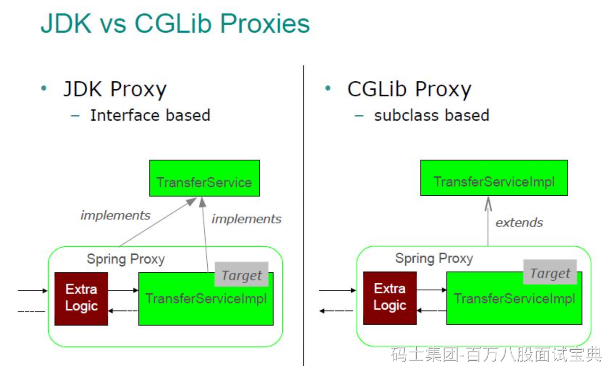

在 Java 中，JDK 动态代理和 CGLIB 两种机制各有优劣，适用于不同场景：

#### 1. 原理／依赖

JDK 动态代理完全基于接口，使用 `Proxy.newProxyInstance()` 和 `InvocationHandler`，通过反射拦截接口方法调用。CGLIB 则通过 ASM 字节码动态生成一个目标类的子类，重写方法以插入代理逻辑，无需接口实现。M

#### 2. 限制条件

- **JDK 代理**：只能代理实现了接口的类，生成的代理类型仅限接口定义。
- **CGLIB 代理**：能代理普通类，但目标类与方法都不能是 `final`，且需要默认或可识别的构造函数。

#### 3. 性能与资源

- JDK 代理在调用时使用反射，开销略高，但初始化快，适合低频调用 。
- CGLIB 生成子类避免反射调用，运行时更快，但生成过程复杂，占用内存略高。它在高频调用场景下性能优势明显。

S

#### 4. 使用场景

- 若对象已实现接口，建议优先使用 JDK 代理，代码简单且无需额外依赖。
- 若没有接口或需要覆盖类方法，使用 CGLIB 更合适；但需留意 final 限制与构造器问题。B
- Spring 框架默认策略为：若有接口则用 JDK，否则用 CGLIB，除非显式配置 。
